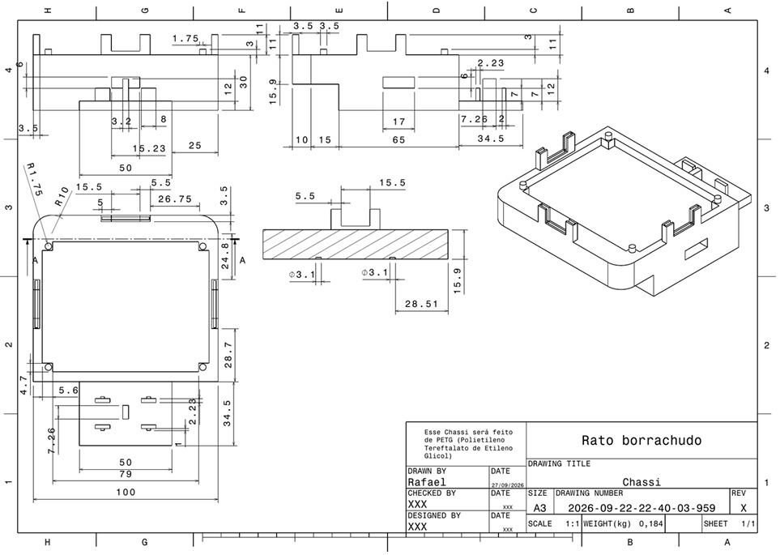
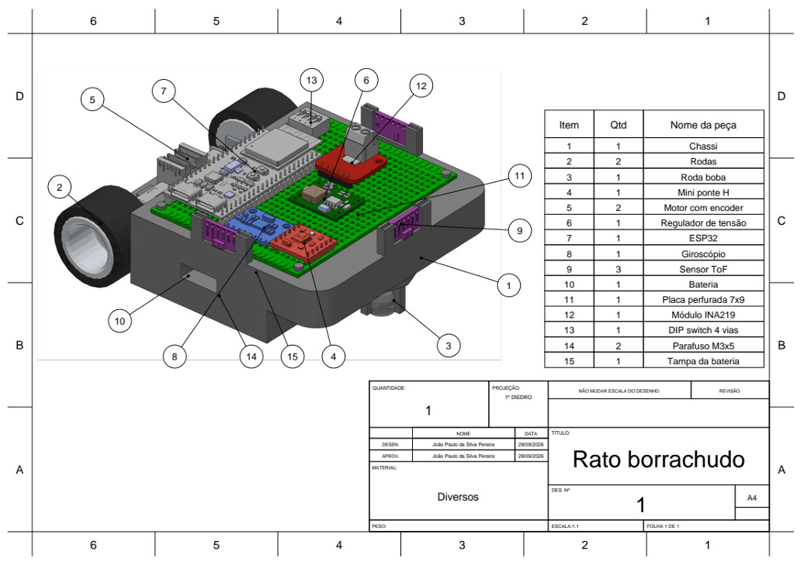
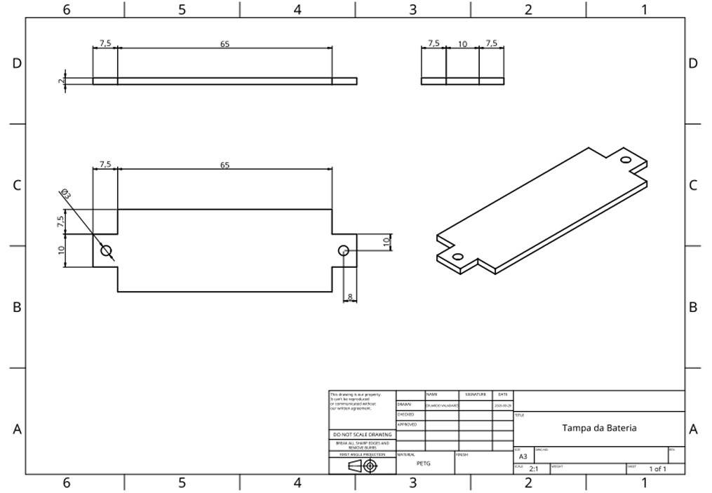

# Projeto Conceitual da Estrutura do Produto

Rato Borrachudo • PI1 2026/2 • Estruturas

## 1 Projeto do chassi

O chassi reúne a plataforma da eletrônica, o compartimento da bateria, os encaixes dos motores e os suportes dos sensores em uma única peça. Essa integração estabelece posições de montagem e reduz a necessidade de suportes estruturais separados.

O chassi apresenta comprimento de 124,5 mm, largura de 100 mm e altura máxima de 41 mm, incluindo os suportes. A geometria foi organizada em torno dos volumes dos componentes. Os cantos frontais arredondados reduzem pontos salientes, enquanto os recortes próximos às rodas permitem acomodar o sistema de tração sem prolongar a plataforma por toda a largura das rodas. Os furos no chassi permitem a passagem de ar e dos fios da bateria para a parte superior. Os suportes dos sensores é integrado no chassi, assim basta colocá-los no lugar. Há também a cavidade na parte superior para acomodar os pinos e soldas dos componentes. Na parte inferior, encaixes para o motor.

*Figura 1 - Desenho cotado do chassi do Rato Borrachudo. Fonte: desenho do grupo, chassi.pdf.*

## 2 Seleção dos materiais

O chassi, seus suportes integrados e a tampa da bateria serão fabricados por impressão 3D em PETG. A escolha foi feita baseada na, facilidade de manufatura, correção de erros posteriores. Dentre outros tipos de filamento existentes para impressão, o PETG foi escolhido pela sua maior rigidez, absorvendo impactos e vibrações sem quebrar e também pela maior resistência ao calor em comparação por exemplo, ao PLA. É o material mais usado para projetos de engenharia em impressão 3D. Entretanto, não é muito resistente a radiações solares, portanto deve evitar usar-se o robô no sol. 

Os materiais dos outros componentes foram selecionados pelo seu custo-benefício e fácil aquisição.

## 3 Justificativa de decisões de projeto

Optamos por rodas pequenas pois elas aumentam a precisão dos movimentos acionados pelos motores, haja visto que utilizaremos uma configuração de 2 rodas tracionadas e 1 roda boba. Essa configuração foi escolhida por ser mais barata e mais simples de construir, haja visto as dimensões limitadas do nosso robô, permitindo a livre rotação dele.

Os encaixes do motor são somente para guiar onde eles devem estar, eles serão presos ao chassi por meio de enforca-gatos que passarão por furos já projetados no chassi. Essa decisão foi tomada pela sua facilidade, basta encaixar o enforca-gato e apertá-lo, e também confiabilidade visto que com as guias laterais é improvável que o motor saia da sua posição.

A tampa da bateria foi pensada para permitir o fácil acesso a mesma, através de dois parafusos ou mesmo de uma fita, que é capaz de segurar o peso da bateria e tampa, facilitando ainda mais o acesso.

## 4 Montagem e partes fundamentais

| Item | Parte / quantidade | Função no produto |
|------|--------------------|-------------------|
| 1 | Chassi (1) | Sustentar os componentes e definir suas posições de montagem. |
| 2 e 3 | Rodas (2) e roda boba (1) | Dar a movimentação necessária ao robô. |
| 14 | Parafusos M3 × 5 (2) | Fixar a tampa removível do compartimento da bateria. |
| 15 | Tampa da bateria | Segurar a bateria e permitir que ela seja removida. |

## 5 Tampa da bateria

