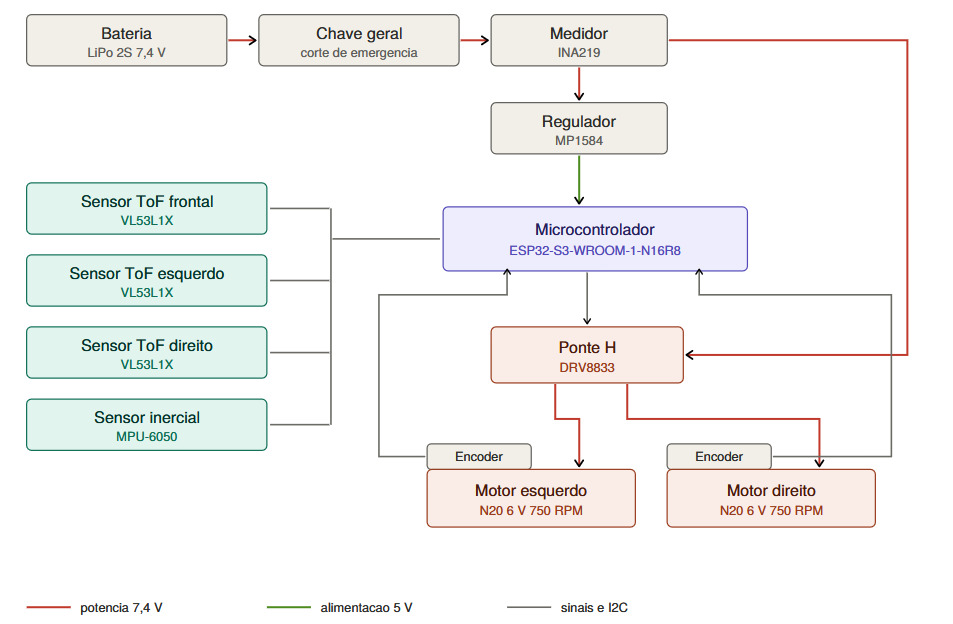
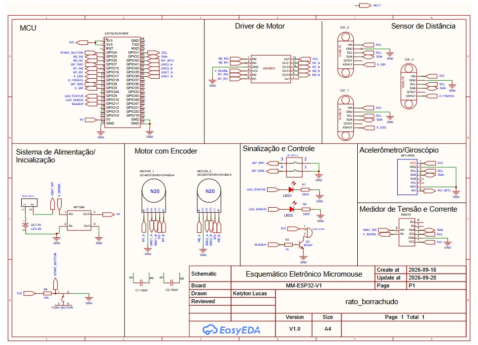

# Projeto Conceitual de Hardware

**Micromouse — Equipe Rato Borrachudo**

Projeto Integrador 1 — Grupo 1 — Turma do Prof. Diogo Caetano Garcia

Faculdade de Ciências e Tecnologias em Engenharia — Universidade de Brasília

29 de setembro de 2026

## 1 Introdução

Este documento apresenta a concepção do hardware embarcado do micromouse desenvolvido pela equipe, com detalhamento suficiente para que o produto possa ser reproduzido por terceiros. São descritos os subsistemas que compõem o robô, as escolhas de componentes e as justificativas técnicas que sustentam cada decisão de projeto.

O micromouse deve percorrer de forma autônoma labirintos de 4×4, 8×4 e 12×4 células, com células de 18 cm de lado e paredes de 1,2 cm de espessura, respeitando o envelope máximo de 16,5 cm de comprimento e largura. O sistema deve ainda transmitir telemetria em tempo real a uma aplicação web.

## 2 Visão geral do hardware

O hardware está organizado em quatro subsistemas: alimentação, processamento e comunicação, sensoriamento e acionamento. A Figura 1 apresenta o diagrama de blocos com os componentes de cada subsistema e as ligações entre eles, diferenciando os caminhos de potência, de alimentação regulada e de sinal.

*Figura 1: Diagrama de blocos do hardware do micromouse. As linhas vermelhas representam a potência não regulada de 7,4 V proveniente da bateria; a linha verde representa a alimentação regulada de 5 V; as linhas cinzas representam sinais de controle e o barramento I²C.*

A bateria LiPo 2S alimenta o robô através de uma chave geral, que também cumpre a função de corte de emergência. Logo após a chave, o medidor INA219 está inserido em série no barramento principal, de modo que a corrente medida corresponde ao consumo total do sistema. A partir desse ponto, a alimentação se divide em dois ramos: um segue para o regulador MP1584, que fornece 5 V ao microcontrolador, e outro alimenta diretamente a ponte H em 7,4 V, sem regulação.

## 3 Subsistema de alimentação

### 3.1 Arquitetura adotada

A separação dos dois ramos de alimentação é uma decisão central do projeto. Os motores apresentam corrente de travamento elevada, e alimentá-los pelo regulador exigiria que o MP1584 suportasse os picos de partida somados ao consumo da lógica. Alimentando a ponte H diretamente pela bateria, o regulador atende apenas o microcontrolador e os sensores, operando com folga confortável.

### 3.2 Regulação de tensão

O MP1584 foi escolhido em detrimento do LM2596 por três razões simultâneas: eficiência típica de 90 % contra cerca de 80 %, dimensões de 22×17 mm contra 43×21 mm, e custo menor. A redução de área é relevante dada a restrição dimensional do robô.

Os sensores e a lógica do INA219 são alimentados em 3,3 V pelo regulador interno da própria placa do microcontrolador, que parte dos 5 V do MP1584.

### 3.3 Medição de consumo

O INA219 mede tensão, corrente e potência no barramento principal e atende diretamente ao requisito de exibição do consumo de bateria na telemetria. A alternativa de menor custo, um divisor resistivo ligado ao conversor analógico-digital, foi descartada por medir apenas tensão: a curva de descarga da bateria LiPo é praticamente plana na faixa central de operação, o que tornaria a estimativa de carga imprecisa.

### 3.4 Proteções

- **Sobrecorrente, sobretemperatura e subtensão:** garantidas internamente pelo driver DRV8833, que possui proteção integrada para as três condições.
- **Inversão de polaridade:** garantida pelo uso de conector polarizado entre a bateria e a placa, que impede fisicamente a ligação invertida. Optou-se por não incluir diodo de proteção em série na entrada geral, pois, com os motores alimentados diretamente pela bateria, a queda de tensão do diodo sob os picos de corrente representaria perda relevante e introduziria erro na medição do INA219.
- **Oscilações de tensão:** o esquemático prevê capacitores de desacoplamento de 100 nF nos terminais dos motores. Como os motores estão ligados diretamente à bateria, quedas momentâneas de tensão podem se propagar pelo nó compartilhado com a lógica. A inclusão de um capacitor eletrolítico de maior capacitância junto à ponte H será avaliada durante os testes de integração.

## 4 Subsistema de processamento e comunicação

### 4.1 Escolha do microcontrolador

Foi adotada a placa ESP32-S3-WROOM-1-N16R8, que atende simultaneamente aos três requisitos do projeto: capacidade de processamento para o algoritmo de navegação, número suficiente de portas de uso geral para os sensores e encoders, e Wi-Fi nativo em 2,4 GHz para a transmissão de telemetria.

A escolha recaiu sobre a versão N16R8 por dois fatores. O primeiro é o volume de memória Flash e PSRAM, que permite manter a pilha WebSocket de telemetria em tempo real sem competição por memória com as estruturas de mapeamento do labirinto. O segundo é a maior quantidade de portas de uso geral disponíveis, o que dá folga ao mapa de pinos apresentado na Seção 9, mesmo com três linhas de desligamento de sensores, quatro canais de encoder e a interface local completa.

Em relação ao orçamento, a placa adotada tem custo superior ao do módulo ESP32 clássico inicialmente previsto. A diferença foi compensada por ajuste nas quantidades de unidades sobressalentes, mantendo o teto definido pela gerência geral.

### 4.2 Comunicação com a aplicação web

A comunicação com a aplicação web é feita por WebSocket, protocolo escolhido pela baixa sobrecarga e pela latência compatível com a atualização contínua da telemetria.

O enlace sem fio opera em 2,4 GHz, restrição imposta pelo próprio módulo, que não é compatível com 5 GHz. O robô conecta-se a uma rede local dedicada, sem acesso à internet, na qual também está o computador que executa a aplicação. Como alternativa de contingência, o próprio microcontrolador pode operar em modo Access Point, dispensando equipamento de rede externo.

### 4.3 Hardware de execução do backend e do frontend

O sistema web não exige hardware dedicado. O backend é executado em notebook pessoal de integrante da equipe e o frontend em navegador, ambos na mesma rede local isolada.

*Tabela 1: Especificação do hardware de execução do sistema web.*

| Item | Especificação | Origem |
|------|---------------|--------|
| Servidor | Computador portátil ASUS V16 (V3607VM): processador Intel Core 7 240H de 2,50 GHz, 32 GB de memória RAM e Windows 11 Home de 64 bits | Cedido |
| Cliente | Navegador em versão corrente, no mesmo computador | Cedido |
| Rede local | Rede dedicada de 2,4 GHz sem acesso à internet, ou modo Access Point do próprio microcontrolador | Cedido |

## 5 Subsistema de sensoriamento

### 5.1 Escolha do sensor de parede

O VL53L1X é um sensor de tempo de voo com emissor laser infravermelho de 940 nm. A medida depende do tempo de retorno do pulso, e não da intensidade refletida, o que o torna adequado ao labirinto especificado: as paredes são brancas e o chão é preto, condição em que sensores baseados em reflexão apresentam grande variação de leitura conforme a cor da superfície.

Foi avaliado o uso de pares discretos de LED infravermelho e fototransistor, solução de menor custo e comum em equipes de competição. A alternativa foi descartada por três motivos:

1. A vantagem principal do par discreto é o tempo de leitura, na ordem de microssegundos contra 30 a 50 ms do sensor de tempo de voo, o que permitiria maior velocidade de percurso. O critério de avaliação da disciplina não pontua tempo, de modo que esse ganho não se converte em resultado.
2. A solução exige leitura pulsada para rejeição de luz ambiente, calibração individual de cada sensor e linearização da curva de resposta. Uma calibração imprecisa produz leitura errada de parede, que é a falha que compromete diretamente a conclusão do percurso.
3. No microcontrolador adotado, um dos conversores analógico-digitais fica indisponível com o Wi-Fi ativo, o que restringiria o mapa de pinos.

Também foi avaliado o VL53L0X, de menor custo. O VL53L1X foi mantido pelo controle de região de interesse, recurso que permite estreitar o campo de visão do sensor. Sem esse controle, os sensores laterais tendem a captar a parede da célula vizinha em corredores de 16,8 cm livres, gerando indicação falsa de parede.

### 5.2 Arranjo e endereçamento

São utilizados três sensores: um frontal e dois laterais. A supressão dos sensores diagonais reduz o custo e o número de portas consumidas, transferindo para a odometria e para o sensor inercial parte da tarefa de alinhamento nas células.

Todos os sensores VL53L1X saem de fábrica com o mesmo endereço no barramento I²C. Para operá-los simultaneamente, o pino de desligamento de cada sensor é controlado por uma porta do microcontrolador, permitindo reendereçá-los individualmente durante a inicialização.

A inicialização segue a sequência abaixo, executada a cada energização, já que o endereço atribuído é volátil:

1. Todas as linhas de desligamento (XSHUT) dos três sensores são colocadas em nível baixo, mantendo os dispositivos inativos no barramento.
2. O sensor esquerdo é ativado pela linha `X_ESQ` e seu endereço é alterado de `0x29` para `0x30`.
3. O sensor frontal é ativado pela linha `X_FRENTE` e reconfigurado para o endereço `0x31`.
4. O sensor direito é ativado pela linha `X_DIR` e reconfigurado para o endereço `0x32`.

A tabela a seguir reúne os endereços de todos os dispositivos do barramento. O medidor INA219 e o sensor inercial MPU-6050 operam em endereços fixos, definidos por hardware, e não há conflito de endereçamento entre os cinco dispositivos.

#### Endereçamento e Topologia do Barramento I²C

##### Tabela de Endereçamento dos Dispositivos

Todos os periféricos I²C compartilham as mesmas linhas de comunicação **SDA (GPIO2)** e **SCL (GPIO1)**. A tabela abaixo detalha as atribuições de endereços no barramento:

| Componente           | Net/Ref   | Função                                       | End. Padrão | End. Operacional | Configuração / Inicialização                            |
| :------------------- | :-------- | :------------------------------------------- | :---------: | :--------------: | :------------------------------------------------------ |
| **INA219**           | `INA219`  | Monitoramento de Tensão e Corrente (Bateria) |   `0x40`    |    **`0x40`**    | Endereço fixo via hardware (pinos A0 e A1 ao GND)       |
| **MPU-6050**         | `MPU6050` | Unidade de Medição Inercial (IMU 6 Eixos)    |   `0x68`    |    **`0x68`**    | Endereço fixo via hardware (pino AD0 ao GND)            |
| **VL53L1X (Esq)**    | `TOF_1`   | Sensor de Proximidade Lateral Esquerdo       |   `0x29`    |    **`0x30`**    | Inicialização sequencial controlada via pino `X_ESQ`    |
| **VL53L1X (Frente)** | `TOF_3`   | Sensor de Proximidade Frontal                |   `0x29`    |    **`0x31`**    | Inicialização sequencial controlada via pino `X_FRENTE` |
| **VL53L1X (Dir)**    | `TOF_2`   | Sensor de Proximidade Lateral Direito        |   `0x29`    |    **`0x32`**    | Inicialização sequencial controlada via pino `X_DIR`    |

### 5.3 Sensor inercial

O MPU-6050 fornece as leituras de giro utilizadas na validação das curvas de 90° e na correção do desvio angular acumulado ao longo do percurso, em conjunto com a odometria dos encoders.

## 6 Subsistema de acionamento

### 6.1 Driver de motor

A ponte H DRV8833 foi escolhida por ser de tecnologia MOSFET, apresentando queda de tensão significativamente menor que a L298N, e por suas dimensões de 18,5×16,3 mm, compatíveis com a restrição dimensional do robô. Cada módulo controla dois motores e suporta 1,2 A contínuos por canal, com pico de 2 A.

### 6.2 Motores e odometria

São utilizados dois micromotores N20 de 6 V e 750 RPM com caixa de redução metálica e encoder acoplado, em configuração de tração diferencial. Adota-se a convenção de motor 1 para a roda direita e motor 2 para a roda esquerda, conforme as entradas correspondentes do driver. Cada motor mede 35×10×12 mm e consome 1,6 A com o eixo travado, medido a 6 V.

Os encoders fornecem aproximadamente 140 pulsos por volta no eixo de saída, o que permite a contagem de células percorridas e o cálculo da velocidade média exigidos na telemetria, além de alimentar a malha de correção de trajetória.

São adotadas rodas de 32 mm de diâmetro, o que corresponde a um perímetro de aproximadamente 100,5 mm e a cerca de 1,8 rotação por célula de 180 mm. O diâmetro reduzido diminui a inércia do conjunto, limita a tendência a derrapagem e eleva a resolução linear da odometria.

Os encoders são de quadratura, com efeito Hall e leitura dos canais A e B. Com aproximadamente 140 pulsos por volta no eixo de saída, a resolução é de cerca de 0,72 mm por pulso na contagem simples, o que corresponde a aproximadamente 250 pulsos por célula percorrida. A decodificação em quadratura eleva essa resolução, permitindo detectar desvios bem menores que a folga lateral disponível dentro da célula.

## 7 Interface local

O robô dispõe de botão de início, que dispara a navegação autônoma; chave geral de corte de alimentação; dip switch para seleção do tipo de labirinto; LEDs de estado e de depuração; e sinalizador sonoro. A interface local permite operar o robô sem depender de cabo ou da conexão Wi-Fi, o que é relevante porque o enunciado proíbe alterar o código durante a resolução do trajeto.

### 7.1 Seleção da dimensão do labirinto

O dip switch de duas vias é reservado exclusivamente à seleção da dimensão do labirinto, cobrindo as três configurações previstas (4×4, 8×4 e 12×4). A informação é necessária antes da partida porque define a extensão da matriz de mapeamento e a posição da célula objetivo.

### 7.2 Determinação do canto de partida

A seleção do canto de partida por chave física adicional foi substituída por determinação algorítmica. A decisão apoia-se no seguinte.

O robô adota referencial cartesiano relativo, no qual a célula inicial é sempre parametrizada como a origem, com saída na direção frontal. Como a partida ocorre obrigatoriamente em um beco sem saída de canto, a leitura dos sensores laterais na primeira célula identifica de que lado se encontra a parede externa da arena, o que fixa a orientação do referencial sem qualquer informação externa. Definida essa orientação, e conhecida a dimensão do labirinto pelo dip switch, a célula objetivo é a extremidade diametralmente oposta à origem, e a convergência do algoritmo de Flood Fill não depende de qual canto absoluto da arena foi utilizado.

A solução também elimina uma fonte de falha operacional: uma chave física mal posicionada antes da largada faria o robô buscar o objetivo na extremidade errada, erro que só se manifestaria durante a tentativa, já sem possibilidade de intervenção. A determinação em software remove essa dependência da configuração manual.

Como decorrência, a montagem é simplificada, pois dispensa uma via adicional de comutação, o roteamento correspondente na placa e a alocação de uma porta do microcontrolador.

## 8 Esquemático elétrico

A Figura 2 apresenta o esquemático elétrico completo, com os componentes, seus símbolos, as conexões entre eles e a pinagem dos dispositivos.

*Figura 2: Esquemático elétrico do micromouse, placa MM-ESP32-V1.*

## 9 Mapa de pinos

A distribuição de portas do microcontrolador observa duas restrições do módulo adotado: as portas GPIO35, GPIO36 e GPIO37 são reservadas à comunicação interna com a memória PSRAM e não foram utilizadas; e as portas com função de inicialização recebem apenas sinais cujo nível no instante da energização não compromete o processo de *boot*.

#### Mapeamento de Pinos do ESP32-S3 (Pinout)

A tabela a seguir apresenta o mapeamento completo de pinos do microcontrolador ESP32-S3, indicando a identificação física, net ports, sentido dos sinais e as respectivas conexões no circuito eletrônico do robô.

|  Pino  | Identificação | Net Port       | Direção | Função e Circuito Conectado                           |
| :----: | :------------ | :------------- | :-----: | :---------------------------------------------------- |
| **1**  | 3V3           | `3V3`          |  Saída  | Barramento lógico de alimentação de 3,3 V             |
| **2**  | 3V3           | `3V3`          |  Saída  | Interligação de 3,3 V para módulos                    |
| **3**  | RST           | —              | Entrada | Reset do microcontrolador (desconectado externamente) |
| **4**  | GPIO4         | `START_BUTTON` | Entrada | Botão de largada com pull-up de 10 kΩ (R4)            |
| **5**  | GPIO5         | `M2_IN2`       |  Saída  | Motor 2 (Esquerdo) - entrada IN4 (DRV8833)            |
| **6**  | GPIO6         | `M2_IN1`       |  Saída  | Motor 2 (Esquerdo) - entrada IN3 (DRV8833)            |
| **7**  | GPIO7         | `DIP_SW1`      | Entrada | Chave seletora DIP switch (Bit 0)                     |
| **8**  | GPIO15        | `M1_IN2`       |  Saída  | Motor 1 (Direito) - entrada IN2 (DRV8833)             |
| **9**  | GPIO16        | `M1_IN1`       |  Saída  | Motor 1 (Direito) - entrada IN1 (DRV8833)             |
| **10** | GPIO17        | `X_ESQ`        |  Saída  | Controle XSHUT do ToF lateral esquerdo                |
| **11** | GPIO18        | `X_FRENTE`     |  Saída  | Controle XSHUT do ToF frontal                         |
| **12** | GPIO8         | `DIP_SW2`      | Entrada | Chave seletora DIP switch (Bit 1)                     |
| **13** | GPIO3         | `X_DIR`        |  Saída  | Controle XSHUT do ToF lateral direito                 |
| **14** | GPIO46        | —              |    —    | Pino livre                                            |
| **15** | GPIO9         | `LED_STATUS`   |  Saída  | LED indicador de estado (resistor R1 de 330 Ω)        |
| **16** | GPIO10        | `LED_DEBUG`    |  Saída  | LED de depuração (resistor R2 de 330 Ω)               |
| **17** | GPIO11        | `BUZZER`       |  Saída  | Transistor BC547 para acionamento do buzzer           |
| **21** | 5V            | `5V`           | Entrada | Alimentação regulada 5 V (step-down MP1584)           |
| **22** | GND           | `GND`          |  Ref.   | Plano de terra comum de referência                    |
| **35** | GPIO38        | `ENC1_A`       | Entrada | Encoder Motor Direito - Canal A (odometria)           |
| **36** | GPIO39        | `ENC1_B`       | Entrada | Encoder Motor Direito - Canal B (sentido)             |
| **37** | GPIO40        | `ENC2_B`       | Entrada | Encoder Motor Esquerdo - Canal B (sentido)            |
| **38** | GPIO41        | `ENC2_A`       | Entrada | Encoder Motor Esquerdo - Canal A (odometria)          |
| **39** | GPIO42        | `INT_MPU`      | Entrada | Interrupção externa da MPU-6050                       |
| **40** | GPIO2         | `SDA`          |   I/O   | Barramento I²C - Linha de Dados                       |
| **41** | GPIO1         | `SCL`          |  Saída  | Barramento I²C - Linha de Clock                       |
| **42** | U0RXD         | `RXD`          | Entrada | Comunicação serial de depuração (UART0)               |
| **43** | U0TXD         | `TXD`          |  Saída  | Comunicação serial de depuração (UART0)               |
| **44** | GND           | `GND`          |  Ref.   | Plano de terra comum                                  |

As chaves do dip switch fecham diretamente para o terra, sem resistor externo, de modo que o firmware deve habilitar o resistor de elevação interno das portas GPIO7 e GPIO8.

Duas atribuições foram verificadas quanto a funções especiais do módulo. A porta GPIO3 possui função de strapping dedicada à seleção da origem dos sinais de JTAG, função que só se torna ativa quando o eFuse correspondente é programado, condição que não corresponde ao estado de fábrica da placa. Dessa forma, o nível imposto pela linha `X_DIR` no instante da energização não interfere na inicialização. A porta GPIO38 não possui função de strapping e está disponível para uso geral na placa adotada, sendo empregada como entrada do canal A do encoder do motor direito.

## 10 Montagem

A montagem será realizada em duas etapas: validação individual dos módulos em protoboard e, em seguida, montagem definitiva em placa padrão ilhada soldada, mais resistente à vibração do robô em movimento.

A eletrônica é montada sobre placa perfurada de 7×9 cm, instalada no andar superior do chassi e compatível com a área mecânica útil de 90×100 mm. A bateria e os motores ocupam a seção inferior, o que mantém o centro de massa baixo e afasta o caminho de potência dos sinais de sensoriamento.

Na face superior ficam centralizados o microcontrolador, o regulador MP1584, o driver DRV8833 e as barras de pinos dos periféricos do barramento I²C. A fixação central reduz o efeito da vibração sobre as soldas durante o deslocamento.

## 11 Considerações finais

A arquitetura consolidada atende às exigências do desafio proposto. A alimentação separa, logo após a medição de consumo, o caminho de potência dos motores do caminho regulado que alimenta a lógica, reduzindo a influência dos transientes de acionamento sobre o microcontrolador e os sensores. A navegação autônoma opera em malha fechada, combinando as leituras dos sensores de distância, do sensor inercial e da odometria dos encoders, e a telemetria é transmitida sem fio em tempo real, de forma concorrente à execução do percurso.

A sinalização luminosa e sonora prevista na interface local não é exigida como condição de conclusão do desafio, sendo mantida como recurso de depuração e de indicação de estado durante os ensaios.
