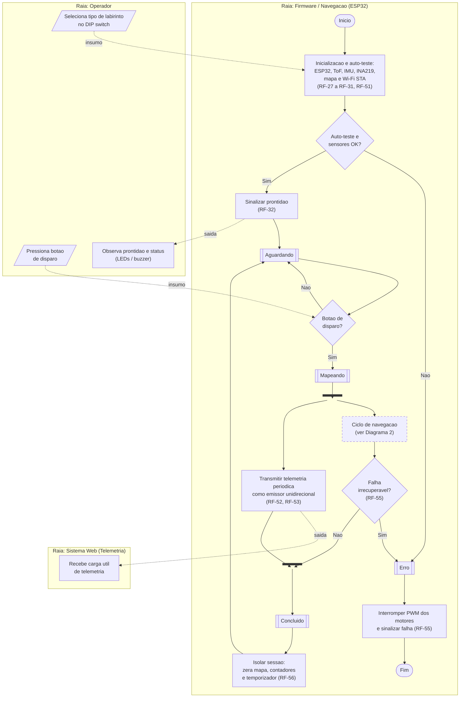
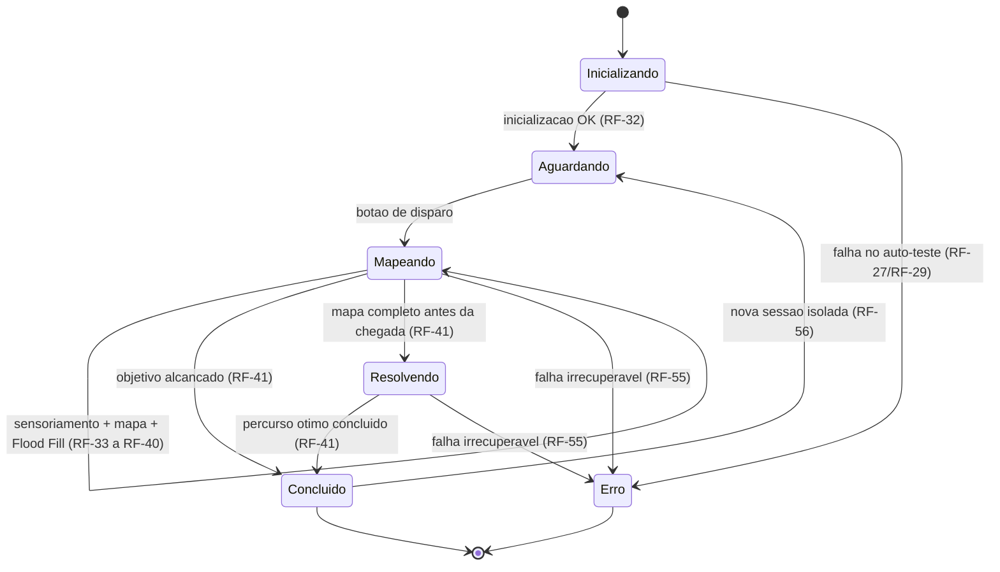
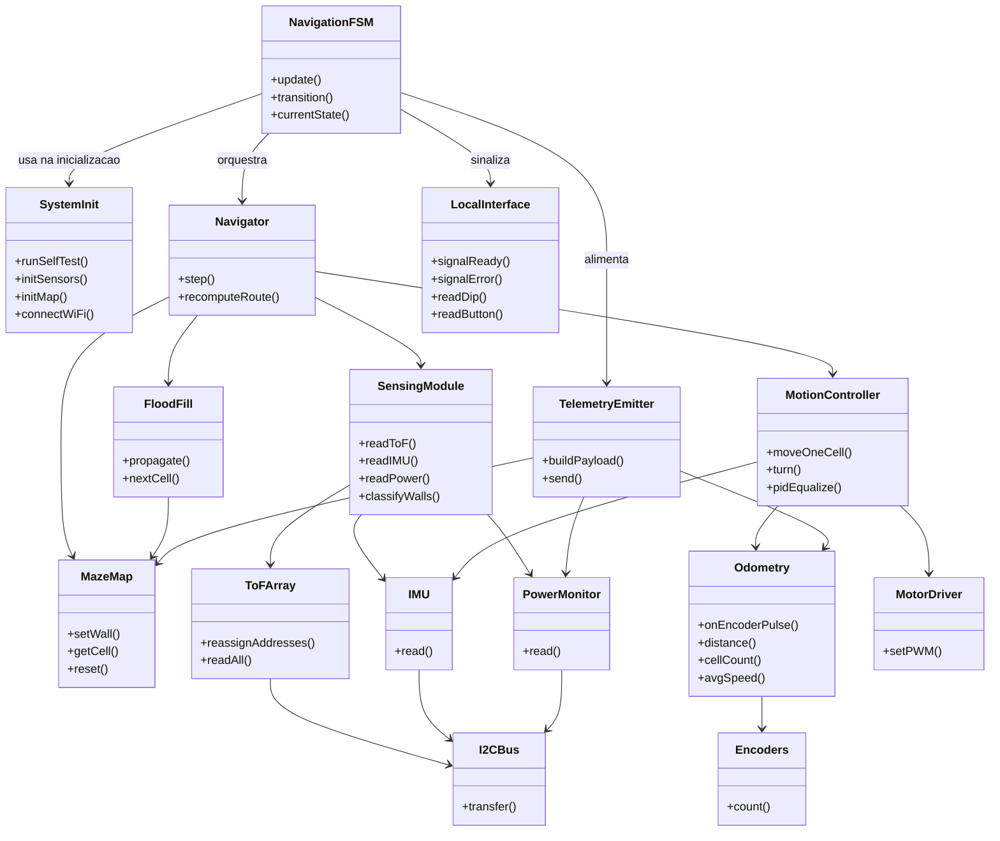
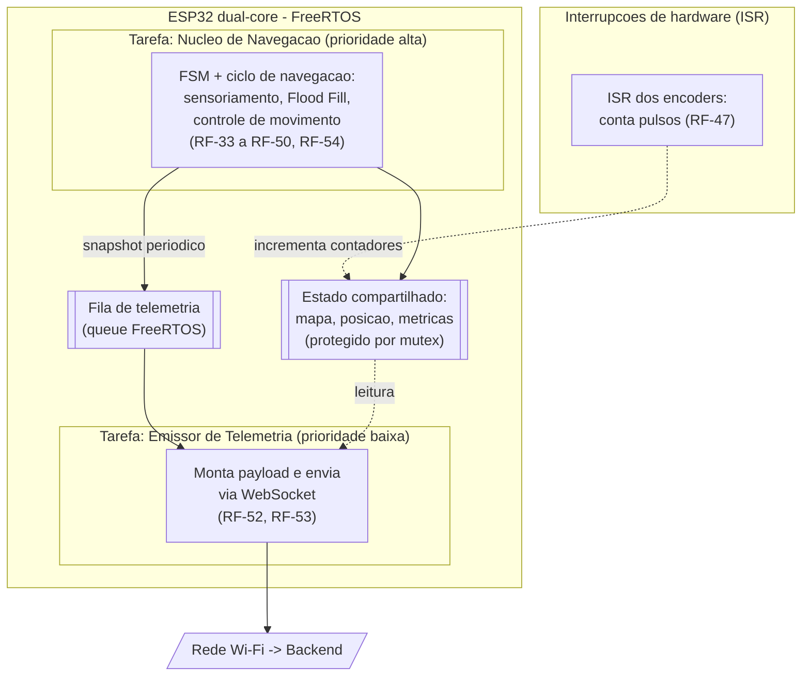
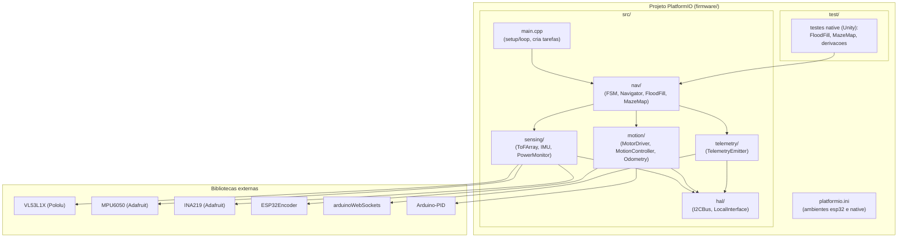
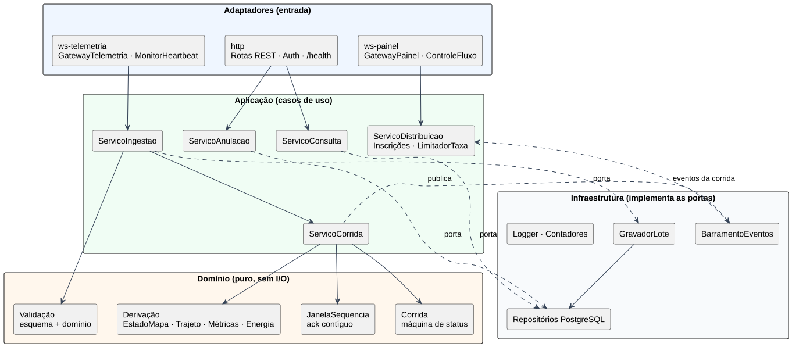

# Projeto Conceitual de Software

*Rato Borrachudo · Grupo 1 · PI1 2026/2*

**Sumário**

- [1. Diagrama de Atividades UML](#1-diagrama-de-atividades-uml)
  - [1.1 Raia do Firmware / Navegação](#11-raia-do-firmware--navegação)
  - [1.2 Raia do Backend (recepção e persistência)](#12-raia-do-backend-recepção-e-persistência)
  - [1.3 Raias do Operador e do Frontend](#13-raias-do-operador-e-do-frontend)
- [2. Backlog do Produto](#2-backlog-do-produto)
  - [2.1 Requisitos Funcionais](#21-requisitos-funcionais)
  - [2.2 Requisitos Não-Funcionais](#22-requisitos-não-funcionais)
  - [2.3 Histórias de Usuário — detalhamento](#23-histórias-de-usuário--detalhamento)
  - [2.4 Protótipos de interface em alta fidelidade](#24-protótipos-de-interface-em-alta-fidelidade)
  - [2.5 Backlog e cronograma no GitHub Projects](#25-backlog-e-cronograma-no-github-projects)
- [3. Descrição da arquitetura da solução de software](#3-descrição-da-arquitetura-da-solução-de-software)
  - [3.1 Visão geral, padrões e stack tecnológica](#31-visão-geral-padrões-e-stack-tecnológica)
  - [3.2 Firmware — visões lógica, de processos e de implementação](#32-firmware--visões-lógica-de-processos-e-de-implementação)
  - [3.3 Backend — visões e modelo de dados](#33-backend--visões-e-modelo-de-dados)
  - [3.4 Frontend — visões lógica, de processos e de implementação](#34-frontend--visões-lógica-de-processos-e-de-implementação)
- [4. Roteiro de testes funcionais](#4-roteiro-de-testes-funcionais)
  - [4.1 Firmware (RF-27 a RF-56)](#41-firmware-rf-27-a-rf-56)
  - [4.2 Backend (RF-72 a RF-98)](#42-backend-rf-72-a-rf-98)
  - [4.3 Frontend (RF-57 a RF-71)](#43-frontend-rf-57-a-rf-71)


## 1. Diagrama de Atividades UML

O comportamento funcional do produto é modelado por raias (*swimlanes*), uma por ator. As raias de Firmware, Backend e Operador/Frontend são apresentadas a seguir; os pontos de contato entre elas aparecem como fluxos de objeto (insumos e saídas).

| Ator / raia | Tipo | Papel no fluxo |
|:--|:--|:--|
| **Operador** | Usuário | Prepara o robô na pista (posição e DIP switch), liga, dispara a tentativa, acompanha o painel e intervém fisicamente quando necessário. |
| **Firmware (ESP32)** | Sistema | Inicializa o robô, navega de forma autônoma (Flood Fill) e emite a telemetria como **emissor unidirecional**. |
| **Backend** | Sistema | Autentica, valida, persiste, deriva métricas, confirma (`ack`) e distribui os dados aos painéis. |
| **Frontend (painel web)** | Sistema | Conecta-se ao backend e exibe, em tempo real, os dados obrigatórios, o labirinto, o trajeto e o estado da conexão. |

**Notação utilizada:** estado inicial e final, ações/atividades, nós de decisão e de junção (*merge*), barras de bifurcação e sincronização (*fork/join*), raias, fluxos de controle (setas contínuas) e fluxos de objeto (insumos e saídas).


### 1.1 Raia do Firmware / Navegação

A raia do firmware embarcado no ESP32 descreve a navegação autônoma, da inicialização à conclusão da tentativa, e as trocas com o **Operador** e o **Sistema Web**. São três diagramas: visão geral com raias, detalhe do ciclo de navegação e máquina de estados (RF-54).




*Figura 1 – Firmware: visão geral com raias (Operador, Firmware e Sistema Web)*

> A barra após **Mapeando** é a **bifurcação (_fork_)**: a navegação e a transmissão de telemetria correm em paralelo. A barra antes de **Concluído** é a **sincronização (_join_)**. Conforme o RNF-33, a telemetria é isolada da navegação - uma falha de Wi-Fi **não** leva ao estado Erro nem interrompe a navegação.


**Ciclo de navegação (detalhe).** Expansão da atividade "Ciclo de navegação". Vale para os estados **Mapeando** e **Resolvendo**; a diferença é que, em Resolvendo, o recálculo de rota (decisão de nova parede) é ignorado, pois o percurso ótimo já está definido.


*Figura 2 – Firmware: detalhe da atividade "Ciclo de navegação"*


**Máquina de estados de navegação.** Os seis estados definidos no RF-54 e suas transições autorizadas.




*Figura 3 – Firmware: máquina de estados de navegação (RF-54)*


**Descrição do fluxo.**

**Inicialização.** Ao ligar, o firmware executa o auto-teste do ESP32 e dos GPIO, reendereça os sete ToF no barramento I2C, verifica IMU e INA219, lê o tipo de labirinto no DIP switch (insumo do Operador), inicializa o mapa com a inundação inicial e conecta o Wi-Fi em modo estação. Se algo falhar, transita direto para **Erro**. Caso contrário, sinaliza prontidão (saída para o Operador via LED/buzzer) e entra em **Aguardando**.

**Disparo e paralelismo.** Ao receber o botão de disparo (insumo do Operador), entra em **Mapeando** e ocorre a **bifurcação**: o _Ciclo de navegação_ e a _transmissão de telemetria_ passam a correr em paralelo. A telemetria é emissora unidirecional e isolada da navegação (RNF-33).

**Ciclo de navegação (Diagrama 2).** A cada iteração o firmware lê os sensores, classifica as paredes por limiar, atualiza o mapa, propaga os valores de inundação (Flood Fill), seleciona a próxima célula de menor valor e move-se uma célula (saída para os motores). Se uma nova parede invalida a rota, recalcula antes de mover. Ao completar o mapa antes de chegar, transita para **Resolvendo** e executa o percurso ótimo sem novos recálculos. Ao alcançar o objetivo, sai do ciclo.

**Encerramento.** A **sincronização** reúne navegação e telemetria em **Concluído**; em seguida a sessão é isolada (zera mapa, contadores e temporizador) e o robô retorna a **Aguardando** para uma nova tentativa. Uma falha irrecuperável detectada durante a operação leva a **Erro**, que interrompe todos os PWM dos motores e sinaliza a condição.


### 1.2 Raia do Backend (recepção e persistência)

Comportamento do backend desde a conexão do robô até a persistência, a confirmação e a publicação dos dados aos painéis. As raias **Robô (firmware)** e **Painel (frontend)** aparecem apenas nos pontos de interação.


*Figura 4 – Backend: recepção, validação e persistência (Diagrama A)*


*Figura 5 – Backend: monitoramento de sinal e interrupção por falta de comunicação (Diagrama B)*


**Atividades, insumos e saídas**

| Diagrama | Atividade | Insumos | Saídas | RF |
|:--:|:--|:--|:--|:--|
| A | Receber `hello` (até 5 s) | Conexão WebSocket | Conexão pendente de autenticação | RF-72 |
| A | Autenticar dispositivo e versão | `hello` (dispositivo, token, `v`, `boot`) | Conexão aceita, ou rejeição registrada e conexão fechada (4001/4002) | RF-72, RNF-55, RNF-57 |
| A | Detectar reinício do robô | `boot` do `hello` × `boot` da corrida em andamento | Corrida anterior `INTERROMPIDA (REINICIO_ROBO)` e notificação aos painéis | RF-81 |
| A | Validar esquema | Mensagem + esquema JSON da versão | Mensagem válida ou rejeição | RF-75 |
| A | Validar domínio | Mensagem + dimensões do labirinto + último `t` | Mensagem válida ou rejeição | RF-76 |
| A | Registrar rejeição | Mensagem + motivo | Log JSON, linha em `mensagem_rejeitada`, contador | RF-75, RF-76, RNF-56 |
| A | Descartar duplicata | `(corrida, seq)` já persistido | `ack` reenviado, contador de duplicadas, nenhum registro novo | RF-77 |
| A | Criar corrida | (dispositivo, id da corrida no robô) | Linha em `corrida` com UUID e nº de tentativa | RF-78, RF-97 |
| A | Persistir lote | Mensagens aceitas | Linhas em `mensagem` (append-only) | RF-79, RNF-49 |
| A | Aplicar ao estado em memória | Mensagens persistidas, em ordem de `seq` | Mapa, trajeto, velocidade e energia atualizados | RF-80, RF-83 a RF-85 |
| A | Enviar `ack` cumulativo | Maior `seq` contíguo persistido | `ack` (informativo para o robô) | RF-74 |
| A | Publicar eventos | Eventos derivados | Evento/contínuo para os painéis inscritos | RF-88 a RF-90 |
| A | Persistir snapshot | Estado do mapa a cada +20 células | Linha em `snapshot_mapa` | RF-80 |
| A | Encerrar corrida | `fim_corrida` | Métricas finais, status, snapshot final, ranking recalculado | RF-81, RF-82, RF-87, RF-95 |
| B | Heartbeat | Ping a cada 1 s + pong ou mensagem | Declaração de perda após 3 s | RF-73 |
| B | Notificar sinal | Perda ou retomada | Evento `sinal` aos painéis (≤ 1 s) | RF-92 |
| B | Interromper por silêncio | 120 s sem sinal | Corrida `INTERROMPIDA (SEM_SINAL)` | RF-81, RF-87 |
| B | Aceitar lote tardio | Lote com `fim_corrida` após a interrupção | Corrida `CONCLUÍDA` ou `FALHOU` | RF-81, RF-87 |


**Pontos de decisão, paralelismo e sincronização**

- **Robô como emissor unidirecional:** nenhuma atividade do robô espera uma resposta do backend. Uma autenticação recusada se manifesta só como o fechamento da conexão. O `ack` é enviado (RF-74), mas o fluxo do robô não depende dele. Depois de uma reconexão, o robô reenvia o buffer retido e as duplicatas são descartadas pelo backend (RF-77).
- **Primeiro fork/join (Diagrama A):** depois da autenticação, o monitoramento de sinal (Diagrama B) e o laço de recepção rodam em paralelo durante toda a conexão. No Node.js isso é concorrência cooperativa no *event loop* (um *timer* e um *handler* de mensagens), sem threads.
- **Fork/join interno (Diagrama A):** depois da persistência, a confirmação, a publicação aos painéis e a verificação de snapshot são independentes. A sincronização garante que o encerramento da corrida só ocorra depois dos três ramos, para que o snapshot final e o ranking vejam o estado completo.
- **Ordem persistir → confirmar/distribuir:** o `ack` e a distribuição só acontecem **depois** da transação confirmada. Assim, um dado exibido no painel nunca se perde num reinício do backend (RNF-50, RNF-52).
- **Fork/join (Diagrama B):** o registro do evento e a notificação aos painéis são paralelos. A notificação não espera a escrita no banco, para cumprir o prazo de 1 s do RF-92.
- **Decisão de reconexão (Diagrama B):** há três saídas: mesmo `boot` (retomada), `boot` diferente (reinício, tratado no Diagrama A) e 120 s sem sinal (interrupção, com possível lote tardio).
- **Laço de recepção:** a conexão continua aberta depois do `fim_corrida`, porque o mesmo robô pode iniciar a próxima tentativa sem reconectar.


### 1.3 Raias do Operador e do Frontend

Ciclo completo de uma tentativa, da preparação do robô e do painel pelo operador até a exibição do resultado. Sob cada ação estão os requisitos atendidos; os marcadores **F1–F3** e **B1–B5** indicam os pontos de contato com as raias de Firmware e Backend (legenda no próprio diagrama).


*Figura 6 – Diagrama de Atividades das raias do Operador e do Frontend (painel web)*


**Insumos e saídas**

| Objeto | Produzido por | Consumido por | Tipo |
|:--|:--|:--|:--|
| Robô energizado com o DIP configurado | Operador: *Ligar o robô pela chave geral* | Firmware (F1) | Saída |
| Sinalização de prontidão ou de erro | Firmware (F2) | Operador: *Observar a sinalização do robô* | Insumo |
| Sinal de início da tentativa | Operador: *Pressionar o botão de disparo* | Firmware (F3) | Saída |
| Pedido de inscrição no canal de corridas ao vivo | Frontend: *Conectar-se ao backend e inscrever-se no canal de corridas ao vivo* | Backend (B1) | Saída |
| Aviso de corrida ao vivo (identificador e tipo de labirinto) | Backend (B2) | Frontend: *Aguardar o aviso de corrida ao vivo* | Insumo |
| Pedido de inscrição na corrida | Frontend: *Inscrever-se automaticamente na corrida* | Backend (B3) | Saída |
| Snapshot da corrida (tipo, mapa, posição, métricas e número de sequência de corte) | Backend (B4) | Frontend: *Montar a grade do labirinto a partir do snapshot* | Insumo |
| Atualização da corrida | Backend (B5) | Frontend: *Receber a atualização da corrida* | Insumo |
| Resultado final da tentativa | Frontend: *Congelar o cronômetro e exibir o resultado final* | Operador: sincronização antes de *Conferir o resultado final no painel* | Saída do Frontend, insumo do Operador |

Quando uma ação recebe um objeto, ela só é executada depois que o objeto chega. Por exemplo, *Aguardar o aviso de corrida ao vivo* permanece em espera até o backend enviar o aviso (B2).


**Fluxo principal**

1. O **Operador** abre o painel de telemetria no navegador. A partir desse ponto, uma bifurcação inicia dois fluxos paralelos: a preparação do robô, na raia do Operador, e a conexão do painel, na raia do Frontend.
2. Na raia do **Operador**:
   1. posiciona o robô na célula de partida;
   2. configura o DIP switch com o tipo de labirinto e o canto de partida (RF-30, RF-99);
   3. liga o robô pela chave geral.

   A configuração precede a energização porque o DIP switch é lido apenas na inicialização (RNF-35). A energização entrega ao Firmware o robô configurado (F1).
3. Na raia do **Frontend**, o painel é carregado (RNF-41, RNF-42), conecta-se ao backend por WebSocket e inscreve-se no canal de corridas ao vivo (RF-58, RF-88; B1). Confirmada a conexão, exibe o estado "conectado" (RF-59) e aguarda o aviso de uma corrida ao vivo.
4. O **Operador** observa a sinalização do robô, recebida do Firmware (F2). Diante da sinalização de prontidão (RF-32), pressiona o botão de disparo (RF-5), o que entrega ao Firmware o sinal de início da tentativa (F3). Em seguida, passa a acompanhar a execução na pista e no painel.
5. Quando o backend cria a corrida, envia o aviso ao canal de corridas ao vivo (B2). O **Frontend** inscreve-se automaticamente na corrida, sem configuração manual do operador (RF-62, RF-88; B3). Com o *snapshot* recebido (RF-89; B4), monta a grade do labirinto no formato 4×4, 8×4 ou 12×4 (RF-60, RF-62).
6. A cada atualização recebida do backend (B5), o **Frontend** verifica o tipo da mensagem:
   - **aviso de perda ou retomada do sinal do robô:** atualiza o indicador de sinal (RF-59, RF-73, RF-92);
   - **telemetria:** executa em paralelo quatro atualizações, sincronizadas ao final:
     - paredes do labirinto (RF-60);
     - trajeto e posição do robô (RF-61);
     - velocidade média, tempo e energia (RF-57, RF-64);
     - gráfico de consumo (RF-68).
7. Em seguida, o **Frontend** avalia o status da corrida:
   - **CONCLUÍDA:** sinaliza "desafio cumprido" (RF-63);
   - **FALHOU** ou **INTERROMPIDA:** sinaliza a falha e o motivo informado pelo backend, que pode ser estouro do tempo limite, erro do robô ou perda de comunicação (RF-69);
   - **EM_ANDAMENTO:** verifica a conexão com o backend antes de voltar a aguardar a próxima atualização.
8. Ao término, o **Frontend** congela o cronômetro e exibe o resultado final (RF-57, RF-64). Uma nova bifurcação então:
   - entrega o resultado final ao Operador;
   - devolve o painel à espera de uma nova corrida ao vivo.
9. O **Operador** confere o resultado final. A ação ocorre após a sincronização entre o encerramento observado por ele e o resultado entregue pelo painel. Em seguida, decide se realiza nova tentativa. Sem nova tentativa, o processo termina no nó final de atividade, que encerra também o fluxo do painel.


**Fluxos alternativos**

| Situação | Tratamento no diagrama | Requisitos |
|:--|:--|:--|
| Falha no auto-teste ou na inicialização | O robô sinaliza erro. O operador desliga o robô, corrige a falha e reinicia a preparação a partir do posicionamento. | RF-27 a RF-29; sinalização via F2 (ver seção 7) |
| Falha ao conectar o painel ao backend | O painel exibe "reconectando" e tenta novamente, sem intervenção do operador. | RF-59, RNF-39 |
| Queda da conexão entre painel e backend durante a corrida | O painel volta ao ciclo de reconexão. Ao se inscrever de novo, recebe um novo *snapshot*, o que ressincroniza a tela. | RF-89, RNF-39 |
| Perda do sinal do robô (entre robô e backend) | O painel exibe "sem sinal" e a navegação prossegue normalmente. Se a perda durar mais de 120 s, o backend marca a corrida como INTERROMPIDA e o painel sinaliza a falha. | RF-59, RF-73, RF-81, RF-92, RNF-33 |
| Colisão ou mau funcionamento do robô | O operador aciona a chave de corte geral (parada de emergência) e aguarda o resultado no painel. | RF-11 |
| Estouro do tempo limite de 10 minutos | O backend informa o estouro no status da corrida, com o motivo de término. O painel sinaliza a falha e o motivo recebido, e o operador interrompe o robô pela chave de corte geral. | RF-69, RF-87, RF-11 |
| Nova tentativa | O operador desliga o robô (se ainda estiver ligado), reposiciona e reconfigura o DIP switch se for mudar de labirinto, e liga novamente. A reinicialização garante mapa, contador e temporizador zerados. | RF-19, RF-56, RF-81 |


## 2. Backlog do Produto

O backlog reúne as três frentes de software: **Firmware** (RF-27 a RF-56), **Frontend** (RF-57 a RF-71) e **Backend** (RF-72 a RF-98). Cada RF é detalhado em uma História de Usuário (HU), na correspondência 1:1 **HU-NN ↔ RF-(26+NN)** no firmware, **HU-FE-NN ↔ RF-(56+NN)** no frontend e **HU-BE-NN ↔ RF-(71+NN)** no backend. A prioridade segue a escala MoSCoW de *2 - Requisitos*.

### 2.1 Requisitos Funcionais

#### Firmware (RF-27 a RF-56)

<u>RF-27 a RF-32/Épico FW-1: Inicialização e Auto-teste</u>

| ID (Link Github Projects) | Título | Prioridade |
|:------| :-- | :--- |
| [HU-01](https://github.com/fcte-pi1/2026.2_PI1_Grupo1_Diogo/issues/107) | Auto-teste do ESP32 ao boot | Must have |
| [HU-02](https://github.com/fcte-pi1/2026.2_PI1_Grupo1_Diogo/issues/108) | Reendereçamento dos sensores ToF no I2C | Must have |
| [HU-03](https://github.com/fcte-pi1/2026.2_PI1_Grupo1_Diogo/issues/109) | Verificação de comunicação com IMU e INA219 | Must have |
| [HU-04](https://github.com/fcte-pi1/2026.2_PI1_Grupo1_Diogo/issues/110) | Leitura do DIP switch e tipo de labirinto | Must have |
| [HU-05](https://github.com/fcte-pi1/2026.2_PI1_Grupo1_Diogo/issues/111) | Inicialização do mapa do labirinto | Must have |
| [HU-06](https://github.com/fcte-pi1/2026.2_PI1_Grupo1_Diogo/issues/112) | Sinalização de prontidão e transição para Aguardando | Must have |

<u>RF-33 a RF-37/Épico FW-2: Sensoriamento e Percepção</u>

| ID (Link Github Projects) | Título | Prioridade |
|:------| :-- | :--- |
| [HU-07](https://github.com/fcte-pi1/2026.2_PI1_Grupo1_Diogo/issues/113) | Leitura periódica dos sensores ToF VL53L1X | Must have |
| [HU-08](https://github.com/fcte-pi1/2026.2_PI1_Grupo1_Diogo/issues/114) | Classificação de paredes por limiar de detecção | Must have |
| [HU-09](https://github.com/fcte-pi1/2026.2_PI1_Grupo1_Diogo/issues/115) | Leitura de dados do IMU MPU-6050 | Must have |
| [HU-10](https://github.com/fcte-pi1/2026.2_PI1_Grupo1_Diogo/issues/116) | Leitura de dados de energia do INA219 | Must have |
| [HU-11](https://github.com/fcte-pi1/2026.2_PI1_Grupo1_Diogo/issues/117) | Atualização do mapa do labirinto | Must have |

<u>RF-38 a RF-41/Épico FW-3: Navegação e Algoritmo Flood Fill</u>

| ID (Link Github Projects) | Título | Prioridade |
|:------| :-- | :--- |
| [HU-12](https://github.com/fcte-pi1/2026.2_PI1_Grupo1_Diogo/issues/118) | Cálculo e propagação dos valores de inundação | Must have |
| [HU-13](https://github.com/fcte-pi1/2026.2_PI1_Grupo1_Diogo/issues/119) | Seleção da próxima célula de menor valor de inundação | Must have |
| [HU-14](https://github.com/fcte-pi1/2026.2_PI1_Grupo1_Diogo/issues/120) | Recálculo de rota por nova parede detectada | Must have |
| [HU-15](https://github.com/fcte-pi1/2026.2_PI1_Grupo1_Diogo/issues/121) | Encerramento do mapeamento e transição de estado | Must have |

<u>RF-42 a RF-46/Épico FW-4: Controle de Movimento</u>

| ID (Link Github Projects) | Título | Prioridade |
|:------| :-- | :--- |
| [HU-16](https://github.com/fcte-pi1/2026.2_PI1_Grupo1_Diogo/issues/122) | Geração de sinais PWM via canais LEDC | Must have |
| [HU-17](https://github.com/fcte-pi1/2026.2_PI1_Grupo1_Diogo/issues/123) | Malha de controle PID para equalização de velocidades | Must have |
| [HU-18](https://github.com/fcte-pi1/2026.2_PI1_Grupo1_Diogo/issues/124) | Correção de trajetória por ToF laterais e IMU | Must have |
| [HU-19](https://github.com/fcte-pi1/2026.2_PI1_Grupo1_Diogo/issues/125) | Monitoramento e controle do ângulo de curva | Must have |
| [HU-20](https://github.com/fcte-pi1/2026.2_PI1_Grupo1_Diogo/issues/126) | Autorização de avanço após conclusão de curva | Must have |

<u>RF-47 a RF-50/Épico FW-5: Odometria</u>

| ID (Link Github Projects) | Título | Prioridade |
|:------| :-- | :--- |
| [HU-21](https://github.com/fcte-pi1/2026.2_PI1_Grupo1_Diogo/issues/127) | Captura de pulsos dos encoders por interrupção | Must have |
| [HU-22](https://github.com/fcte-pi1/2026.2_PI1_Grupo1_Diogo/issues/128) | Conversão de pulsos em distância percorrida | Must have |
| [HU-23](https://github.com/fcte-pi1/2026.2_PI1_Grupo1_Diogo/issues/129) | Contagem de células percorridas | Must have |
| [HU-24](https://github.com/fcte-pi1/2026.2_PI1_Grupo1_Diogo/issues/130) | Cálculo da velocidade média da sessão | Must have |

<u>RF-51 a RF-53/Épico FW-6: Telemetria e Comunicação</u>

| ID (Link Github Projects) | Título | Prioridade |
|:------| :-- | :--- |
| [HU-25](https://github.com/fcte-pi1/2026.2_PI1_Grupo1_Diogo/issues/131) | Configuração do Wi-Fi em modo estação (STA) | Must have |
| [HU-26](https://github.com/fcte-pi1/2026.2_PI1_Grupo1_Diogo/issues/132) | Transmissão contínua da carga útil de telemetria | Must have |
| [HU-27](https://github.com/fcte-pi1/2026.2_PI1_Grupo1_Diogo/issues/133) | Garantia de transmissão unidirecional de telemetria | Must have |

<u>RF-54 a RF-56/Épico FW-7: Máquina de Estados e Robustez</u>

| ID (Link Github Projects) | Título | Prioridade |
|:------| :-- | :--- |
| [HU-28](https://github.com/fcte-pi1/2026.2_PI1_Grupo1_Diogo/issues/134) | Implementação da máquina de estados de navegação | Must have |
| [HU-29](https://github.com/fcte-pi1/2026.2_PI1_Grupo1_Diogo/issues/135) | Detecção de falhas e transição para o estado Erro | Must have |
| [HU-30](https://github.com/fcte-pi1/2026.2_PI1_Grupo1_Diogo/issues/136) | Isolamento entre sessões de resolução consecutivas | Must have |

#### Frontend (RF-57 a RF-71)

<u>RF-57 a RF-64/Épico: Painel de acompanhamento ao vivo</u>

| ID (Link Github Projects) | Título | Prioridade |
|:------| :-- | :--- |
| [HU-FE-01](https://github.com/fcte-pi1/2026.2_PI1_Grupo1_Diogo/issues/137) | Exibir os dados obrigatórios da execução | Must have |
| [HU-FE-02](https://github.com/fcte-pi1/2026.2_PI1_Grupo1_Diogo/issues/138) | Receber continuamente os dados da tentativa | Must have |
| [HU-FE-03](https://github.com/fcte-pi1/2026.2_PI1_Grupo1_Diogo/issues/139) | Indicar o estado da conexão | Must have |
| [HU-FE-04](https://github.com/fcte-pi1/2026.2_PI1_Grupo1_Diogo/issues/140) | Renderizar o labirinto atualizado | Must have |
| [HU-FE-05](https://github.com/fcte-pi1/2026.2_PI1_Grupo1_Diogo/issues/141) | Visualizar o trajeto percorrido | Must have |
| [HU-FE-06](https://github.com/fcte-pi1/2026.2_PI1_Grupo1_Diogo/issues/142) | Adaptar a tela ao tipo de labirinto | Must have |
| [HU-FE-07](https://github.com/fcte-pi1/2026.2_PI1_Grupo1_Diogo/issues/143) | Indicar o desafio cumprido | Must have |
| [HU-FE-08](https://github.com/fcte-pi1/2026.2_PI1_Grupo1_Diogo/issues/144) | Cronometrar a tentativa | Must have |

<u>RF-65 a RF-71/Épico: Histórico e análise de execuções</u>

| ID (Link Github Projects) | Título | Prioridade |
|:------| :-- | :--- |
| [HU-FE-09](https://github.com/fcte-pi1/2026.2_PI1_Grupo1_Diogo/issues/145) | Listar o histórico de execuções | Must have |
| [HU-FE-10](https://github.com/fcte-pi1/2026.2_PI1_Grupo1_Diogo/issues/146) | Filtrar execuções por tipo de labirinto | Must have |
| [HU-FE-11](https://github.com/fcte-pi1/2026.2_PI1_Grupo1_Diogo/issues/147) | Detalhar uma execução passada | Should have |
| [HU-FE-12](https://github.com/fcte-pi1/2026.2_PI1_Grupo1_Diogo/issues/148) | Analisar o consumo durante a tentativa | Should have |
| [HU-FE-13](https://github.com/fcte-pi1/2026.2_PI1_Grupo1_Diogo/issues/149) | Sinalizar falha de execução | Should have |
| [HU-FE-14](https://github.com/fcte-pi1/2026.2_PI1_Grupo1_Diogo/issues/150) | Consultar dados em modo de depuração | Could have |
| [HU-FE-15](https://github.com/fcte-pi1/2026.2_PI1_Grupo1_Diogo/issues/151) | Exportar resultados da execução | Could have |

#### Backend (RF-72 a RF-98)

<u>[RF-72](https://github.com/fcte-pi1/2026.2_PI1_Grupo1_Diogo/issues/152)/Épico: Autenticação da fonte de telemetria</u>

| ID (Link Github Projects) | Título | Prioridade |
|:------| :-- | :--- |
| [HU-BE-01](https://github.com/fcte-pi1/2026.2_PI1_Grupo1_Diogo/issues/262) | Conectar somente robôs autorizados | Must have |

<u>[RF-73](https://github.com/fcte-pi1/2026.2_PI1_Grupo1_Diogo/issues/153)/Épico: Detecção de perda de conexão por heartbeat</u>

| ID (Link Github Projects) | Título | Prioridade |
|:------| :-- | :--- |
| [HU-BE-02](https://github.com/fcte-pi1/2026.2_PI1_Grupo1_Diogo/issues/263) | Saber rapidamente quando o robô perdeu o sinal | Must have |

<u>[RF-74](https://github.com/fcte-pi1/2026.2_PI1_Grupo1_Diogo/issues/154)/Épico: Confirmação cumulativa de mensagens (ack)</u>

| ID (Link Github Projects) | Título | Prioridade |
|:------| :-- | :--- |
| [HU-BE-03](https://github.com/fcte-pi1/2026.2_PI1_Grupo1_Diogo/issues/264) | Confirmar ao robô o que já foi gravado | Must have |

<u>[RF-75](https://github.com/fcte-pi1/2026.2_PI1_Grupo1_Diogo/issues/155)/Épico: Validação de mensagens contra o esquema do protocolo</u>

| ID (Link Github Projects) | Título | Prioridade |
|:------| :-- | :--- |
| [HU-BE-04](https://github.com/fcte-pi1/2026.2_PI1_Grupo1_Diogo/issues/265) | Rejeitar mensagens malformadas sem derrubar a conexão | Must have |

<u>[RF-76](https://github.com/fcte-pi1/2026.2_PI1_Grupo1_Diogo/issues/156)/Épico: Validação das regras de domínio</u>

| ID (Link Github Projects) | Título | Prioridade |
|:------| :-- | :--- |
| [HU-BE-05](https://github.com/fcte-pi1/2026.2_PI1_Grupo1_Diogo/issues/266) | Rejeitar dados fisicamente impossíveis | Must have |

<u>[RF-77](https://github.com/fcte-pi1/2026.2_PI1_Grupo1_Diogo/issues/157)/Épico: Idempotência por corrida e número de sequência</u>

| ID (Link Github Projects) | Título | Prioridade |
|:------| :-- | :--- |
| [HU-BE-06](https://github.com/fcte-pi1/2026.2_PI1_Grupo1_Diogo/issues/267) | Não duplicar dados reenviados | Must have |

<u>[RF-78](https://github.com/fcte-pi1/2026.2_PI1_Grupo1_Diogo/issues/158)/Épico: Criação automática e idempotente da corrida</u>

| ID (Link Github Projects) | Título | Prioridade |
|:------| :-- | :--- |
| [HU-BE-07](https://github.com/fcte-pi1/2026.2_PI1_Grupo1_Diogo/issues/268) | Registrar a corrida sem ação manual | Must have |

<u>[RF-79](https://github.com/fcte-pi1/2026.2_PI1_Grupo1_Diogo/issues/159)/Épico: Persistência append-only das mensagens da corrida</u>

| ID (Link Github Projects) | Título | Prioridade |
|:------| :-- | :--- |
| [HU-BE-08](https://github.com/fcte-pi1/2026.2_PI1_Grupo1_Diogo/issues/269) | Guardar o registro bruto e inalterável da corrida | Must have |

<u>[RF-80](https://github.com/fcte-pi1/2026.2_PI1_Grupo1_Diogo/issues/160)/Épico: Snapshot periódico do estado do mapa</u>

| ID (Link Github Projects) | Título | Prioridade |
|:------| :-- | :--- |
| [HU-BE-09](https://github.com/fcte-pi1/2026.2_PI1_Grupo1_Diogo/issues/270) | Preservar o estado do mapa periodicamente | Must have |

<u>[RF-81](https://github.com/fcte-pi1/2026.2_PI1_Grupo1_Diogo/issues/161)/Épico: Encerramento e marcação de corridas interrompidas</u>

| ID (Link Github Projects) | Título | Prioridade |
|:------| :-- | :--- |
| [HU-BE-10](https://github.com/fcte-pi1/2026.2_PI1_Grupo1_Diogo/issues/271) | Encerrar ou marcar como interrompida cada corrida | Must have |

<u>[RF-82](https://github.com/fcte-pi1/2026.2_PI1_Grupo1_Diogo/issues/162)/Épico: Cálculo do tempo de conclusão pelo relógio do robô</u>

| ID (Link Github Projects) | Título | Prioridade |
|:------| :-- | :--- |
| [HU-BE-11](https://github.com/fcte-pi1/2026.2_PI1_Grupo1_Diogo/issues/272) | Obter o tempo oficial de conclusão | Must have |

<u>[RF-83](https://github.com/fcte-pi1/2026.2_PI1_Grupo1_Diogo/issues/163)/Épico: Cálculo da velocidade média da corrida</u>

| ID (Link Github Projects) | Título | Prioridade |
|:------| :-- | :--- |
| [HU-BE-12](https://github.com/fcte-pi1/2026.2_PI1_Grupo1_Diogo/issues/273) | Acompanhar a velocidade média | Must have |

<u>[RF-84](https://github.com/fcte-pi1/2026.2_PI1_Grupo1_Diogo/issues/164)/Épico: Derivação do trajeto ordenado por sequência</u>

| ID (Link Github Projects) | Título | Prioridade |
|:------| :-- | :--- |
| [HU-BE-13](https://github.com/fcte-pi1/2026.2_PI1_Grupo1_Diogo/issues/274) | Reconstituir o trajeto percorrido | Must have |

<u>[RF-85](https://github.com/fcte-pi1/2026.2_PI1_Grupo1_Diogo/issues/165)/Épico: Derivação de métricas da série de tensão da bateria</u>

| ID (Link Github Projects) | Título | Prioridade |
|:------| :-- | :--- |
| [HU-BE-14](https://github.com/fcte-pi1/2026.2_PI1_Grupo1_Diogo/issues/275) | Avaliar o consumo de bateria da corrida | Must have |

<u>[RF-86](https://github.com/fcte-pi1/2026.2_PI1_Grupo1_Diogo/issues/166)/Épico: Alerta de tensão baixa aos painéis</u>

| ID (Link Github Projects) | Título | Prioridade |
|:------| :-- | :--- |
| [HU-BE-15](https://github.com/fcte-pi1/2026.2_PI1_Grupo1_Diogo/issues/276) | Ser alertado de bateria baixa | Should have |

<u>[RF-87](https://github.com/fcte-pi1/2026.2_PI1_Grupo1_Diogo/issues/167)/Épico: Status do desafio com motivo de término</u>

| ID (Link Github Projects) | Título | Prioridade |
|:------| :-- | :--- |
| [HU-BE-16](https://github.com/fcte-pi1/2026.2_PI1_Grupo1_Diogo/issues/277) | Saber o resultado da corrida e o motivo | Must have |

<u>[RF-88](https://github.com/fcte-pi1/2026.2_PI1_Grupo1_Diogo/issues/168)/Épico: Distribuição de atualizações por inscrição de corrida</u>

| ID (Link Github Projects) | Título | Prioridade |
|:------| :-- | :--- |
| [HU-BE-17](https://github.com/fcte-pi1/2026.2_PI1_Grupo1_Diogo/issues/278) | Receber só as atualizações da corrida acompanhada | Must have |

<u>[RF-89](https://github.com/fcte-pi1/2026.2_PI1_Grupo1_Diogo/issues/169)/Épico: Snapshot consistente para inscrição no meio da corrida</u>

| ID (Link Github Projects) | Título | Prioridade |
|:------| :-- | :--- |
| [HU-BE-18](https://github.com/fcte-pi1/2026.2_PI1_Grupo1_Diogo/issues/279) | Entrar no meio da corrida e ver o estado completo | Must have |

<u>[RF-90](https://github.com/fcte-pi1/2026.2_PI1_Grupo1_Diogo/issues/170)/Épico: Limite de taxa de atualizações contínuas por painel</u>

| ID (Link Github Projects) | Título | Prioridade |
|:------| :-- | :--- |
| [HU-BE-19](https://github.com/fcte-pi1/2026.2_PI1_Grupo1_Diogo/issues/280) | Receber dados contínuos em ritmo controlado | Must have |

<u>[RF-91](https://github.com/fcte-pi1/2026.2_PI1_Grupo1_Diogo/issues/171)/Épico: Controle de fluxo por painel sobrecarregado</u>

| ID (Link Github Projects) | Título | Prioridade |
|:------| :-- | :--- |
| [HU-BE-20](https://github.com/fcte-pi1/2026.2_PI1_Grupo1_Diogo/issues/281) | Não deixar um painel lento prejudicar os demais | Should have |

<u>[RF-92](https://github.com/fcte-pi1/2026.2_PI1_Grupo1_Diogo/issues/172)/Épico: Notificação de perda e retomada de sinal do robô</u>

| ID (Link Github Projects) | Título | Prioridade |
|:------| :-- | :--- |
| [HU-BE-21](https://github.com/fcte-pi1/2026.2_PI1_Grupo1_Diogo/issues/282) | Ver no painel a perda e a retomada de sinal | Must have |

<u>[RF-93](https://github.com/fcte-pi1/2026.2_PI1_Grupo1_Diogo/issues/173)/Épico: Listagem de corridas com filtros e paginação</u>

| ID (Link Github Projects) | Título | Prioridade |
|:------| :-- | :--- |
| [HU-BE-22](https://github.com/fcte-pi1/2026.2_PI1_Grupo1_Diogo/issues/283) | Consultar o histórico de corridas | Must have |

<u>[RF-94](https://github.com/fcte-pi1/2026.2_PI1_Grupo1_Diogo/issues/174)/Épico: Linha do tempo completa da corrida para replay</u>

| ID (Link Github Projects) | Título | Prioridade |
|:------| :-- | :--- |
| [HU-BE-23](https://github.com/fcte-pi1/2026.2_PI1_Grupo1_Diogo/issues/284) | Rever uma corrida passo a passo | Should have |

<u>[RF-95](https://github.com/fcte-pi1/2026.2_PI1_Grupo1_Diogo/issues/175)/Épico: Leaderboard por tipo de labirinto</u>

| ID (Link Github Projects) | Título | Prioridade |
|:------| :-- | :--- |
| [HU-BE-24](https://github.com/fcte-pi1/2026.2_PI1_Grupo1_Diogo/issues/285) | Ver o ranking por tipo de labirinto | Must have |

<u>[RF-96](https://github.com/fcte-pi1/2026.2_PI1_Grupo1_Diogo/issues/176)/Épico: Anulação de corrida pelo operador</u>

| ID (Link Github Projects) | Título | Prioridade |
|:------| :-- | :--- |
| [HU-BE-25](https://github.com/fcte-pi1/2026.2_PI1_Grupo1_Diogo/issues/286) | Anular uma corrida inválida | Should have |

<u>[RF-97](https://github.com/fcte-pi1/2026.2_PI1_Grupo1_Diogo/issues/177)/Épico: Numeração de tentativas por tipo de labirinto</u>

| ID (Link Github Projects) | Título | Prioridade |
|:------| :-- | :--- |
| [HU-BE-26](https://github.com/fcte-pi1/2026.2_PI1_Grupo1_Diogo/issues/287) | Identificar a primeira tentativa em cada labirinto | Should have |

<u>[RF-98](https://github.com/fcte-pi1/2026.2_PI1_Grupo1_Diogo/issues/178)/Épico: Exportação de corrida em JSON e CSV</u>

| ID (Link Github Projects) | Título | Prioridade |
|:------| :-- | :--- |
| [HU-BE-27](https://github.com/fcte-pi1/2026.2_PI1_Grupo1_Diogo/issues/288) | Exportar os dados de uma corrida | Could have |


### 2.2 Requisitos Não-Funcionais

| ID (Link Github Projects) | Título | Prioridade | Rastreabilidade |
|:--------------------------| :-- | :--- |:----------------|
| [RNF-31](https://github.com/fcte-pi1/2026.2_PI1_Grupo1_Diogo/issues/209) | Calibração Obrigatória dos Limiares de Detecção de Parede antes de Operação | Must have | RF-33/HU-07, RF-34/HU-08 |
| [RNF-32](https://github.com/fcte-pi1/2026.2_PI1_Grupo1_Diogo/issues/210) | Critério de Desempate Determinístico no Algoritmo Flood Fill | Must have | RF-39/HU-13 |
| [RNF-33](https://github.com/fcte-pi1/2026.2_PI1_Grupo1_Diogo/issues/211) | Isolamento entre Módulo de Telemetria e Módulo de Navegação | Must have | RF-52/HU-26, RF-53/HU-27, RF-55/HU-29 |
| [RNF-34](https://github.com/fcte-pi1/2026.2_PI1_Grupo1_Diogo/issues/212) | Compensação de Deriva do Giroscópio entre Manobras Consecutivas | Must have | RF-45/HU-19, RF-46/HU-20 |
| [RNF-35](https://github.com/fcte-pi1/2026.2_PI1_Grupo1_Diogo/issues/213) | Restrição de Leitura do DIP Switch Exclusivamente ao Boot | Must have | RF-30/HU-04 |
| [RNF-36](https://github.com/fcte-pi1/2026.2_PI1_Grupo1_Diogo/issues/214) | Odometria Fornece Apenas Posição Relativa sem Garantia de Posição Absoluta | Must have | RF-47/HU-21 a RF-50/HU-24 |
| [RNF-37](https://github.com/fcte-pi1/2026.2_PI1_Grupo1_Diogo/issues/215) | Latência de atualização | Must have | RF-57/HU-FE-01, RF-58/HU-FE-02, RF-60/HU-FE-04, RF-61/HU-FE-05, RF-63/HU-FE-07, RF-69/HU-FE-13 |
| [RNF-38](https://github.com/fcte-pi1/2026.2_PI1_Grupo1_Diogo/issues/216) | Taxa de atualização sustentada | Must have | RF-58/HU-FE-02, RF-60/HU-FE-04, RF-61/HU-FE-05, RF-70/HU-FE-14 |
| [RNF-39](https://github.com/fcte-pi1/2026.2_PI1_Grupo1_Diogo/issues/217) | Reconexão automática | Must have | RF-58/HU-FE-02, RF-59/HU-FE-03, RF-69/HU-FE-13 |
| [RNF-40](https://github.com/fcte-pi1/2026.2_PI1_Grupo1_Diogo/issues/218) | Retenção da tentativa completa | Must have | RF-57/HU-FE-01, RF-61/HU-FE-05, RF-64/HU-FE-08, RF-68/HU-FE-12, RF-70/HU-FE-14 |
| [RNF-41](https://github.com/fcte-pi1/2026.2_PI1_Grupo1_Diogo/issues/219) | Operação em rede local isolada | Must have | RF-57/HU-FE-01 a RF-71/HU-FE-15 |
| [RNF-42](https://github.com/fcte-pi1/2026.2_PI1_Grupo1_Diogo/issues/220) | Tempo de carregamento inicial | Should have | RF-57/HU-FE-01, RF-60/HU-FE-04, RF-65/HU-FE-09 |
| [RNF-43](https://github.com/fcte-pi1/2026.2_PI1_Grupo1_Diogo/issues/221) | Tempo de resposta das consultas | Should have | RF-65/HU-FE-09, RF-66/HU-FE-10, RF-67/HU-FE-11 |
| [RNF-44](https://github.com/fcte-pi1/2026.2_PI1_Grupo1_Diogo/issues/222) | Adaptação a diferentes telas | Should have | RF-57/HU-FE-01, RF-60/HU-FE-04, RF-65/HU-FE-09, RF-67/HU-FE-11 |
| [RNF-45](https://github.com/fcte-pi1/2026.2_PI1_Grupo1_Diogo/issues/223) | Compatibilidade de navegadores | Should have | RF-57/HU-FE-01 a RF-71/HU-FE-15 |
| [RNF-46](https://github.com/fcte-pi1/2026.2_PI1_Grupo1_Diogo/issues/224) | Legibilidade em apresentação | Should have | RF-57/HU-FE-01, RF-60/HU-FE-04, RF-61/HU-FE-05, RF-63/HU-FE-07, RF-64/HU-FE-08 |
| [RNF-47](https://github.com/fcte-pi1/2026.2_PI1_Grupo1_Diogo/issues/225) | Cobertura de testes | Should have | RF-57/HU-FE-01, RF-58/HU-FE-02, RF-60/HU-FE-04, RF-61/HU-FE-05, RF-64/HU-FE-08, RF-68/HU-FE-12 |
| [RNF-48](https://github.com/fcte-pi1/2026.2_PI1_Grupo1_Diogo/issues/226) | Baixa latência (servidor–painel e ponta a ponta) | Must have | RF-88/HU-BE-17, RF-90/HU-BE-19 |
| [RNF-49](https://github.com/fcte-pi1/2026.2_PI1_Grupo1_Diogo/issues/227) | Não bloqueio do Event Loop | Must have | RF-79/HU-BE-08, RF-90/HU-BE-19, RF-98/HU-BE-27 |
| [RNF-50](https://github.com/fcte-pi1/2026.2_PI1_Grupo1_Diogo/issues/228) | Integridade dos dados após quedas de conexão | Must have | RF-74/HU-BE-03, RF-77/HU-BE-06 |
| [RNF-51](https://github.com/fcte-pi1/2026.2_PI1_Grupo1_Diogo/issues/229) | Capacidade de carga (mensagens e painéis simultâneos) | Must have | RF-79/HU-BE-08, RF-88/HU-BE-17 |
| [RNF-52](https://github.com/fcte-pi1/2026.2_PI1_Grupo1_Diogo/issues/230) | Recuperação após reinício do backend | Must have | RF-80/HU-BE-09, RF-81/HU-BE-10 |
| [RNF-53](https://github.com/fcte-pi1/2026.2_PI1_Grupo1_Diogo/issues/231) | Testabilidade dos fluxos de ingestão | Must have | RF-72/HU-BE-01 a RF-87/HU-BE-16 |
| [RNF-54](https://github.com/fcte-pi1/2026.2_PI1_Grupo1_Diogo/issues/232) | Imutabilidade da corrida finalizada | Must have | RF-79/HU-BE-08, RF-96/HU-BE-25 |
| [RNF-55](https://github.com/fcte-pi1/2026.2_PI1_Grupo1_Diogo/issues/233) | Segurança proporcional (autenticação e escrita restrita) | Must have | RF-72/HU-BE-01, RF-96/HU-BE-25 |
| [RNF-56](https://github.com/fcte-pi1/2026.2_PI1_Grupo1_Diogo/issues/234) | Observabilidade (logs, health e contadores) | Must have | RF-75/HU-BE-04, RF-76/HU-BE-05, RF-77/HU-BE-06 |
| [RNF-57](https://github.com/fcte-pi1/2026.2_PI1_Grupo1_Diogo/issues/235) | Evolutividade do protocolo | Should have | RF-72/HU-BE-01, RF-75/HU-BE-04 |
| [RNF-58](https://github.com/fcte-pi1/2026.2_PI1_Grupo1_Diogo/issues/236) | Implantabilidade simples | Should have | Transversal (todas as RF/HU do backend) |


### 2.3 Histórias de Usuário — detalhamento

Cada HU traz a descrição *Eu-Como-Para*, os critérios de aceitação e o protótipo de interface. O firmware não possui interface gráfica: sua interação com o operador é física (botão de disparo, DIP switch, LEDs e buzzer), indicada no campo **Interface**. O backend também não tem tela própria; quando o efeito da HU aparece no painel, o campo **Protótipo** remete à HU de frontend correspondente. Nos critérios do backend e do frontend, **†** indica refinamento proposto pela frente, a validar com o time.


#### Firmware

**Épico FW-1 – Inicialização e Auto-teste (RF-27 a RF-32)**

##### HU-01 — Auto-teste do ESP32 ao boot
- **Rastreabilidade:** RF-27 - [#107](https://github.com/fcte-pi1/2026.2_PI1_Grupo1_Diogo/issues/107)
- **Prioridade:** Must have
- **Descrição:** Eu, como **operador**, quero que o firmware **verifique o funcionamento do ESP32 e a configuração dos pinos GPIO ao ligar**, para **ter certeza de que o robô está apto antes de qualquer operação com periféricos**.
- **Critérios de aceitação:**
  1. Ao energizar, antes de acessar qualquer periférico externo, o firmware executa a verificação básica do microcontrolador e dos GPIO.
  2. Se a verificação falhar, o firmware **não** prossegue para a inicialização dos periféricos.
  3. O resultado do auto-teste é registrado (log serial) e, em caso de falha, sinalizado fisicamente.
- **Interface:** física (LED/buzzer em caso de falha).

##### HU-02 — Reendereçamento dos sensores ToF no barramento I2C
- **Rastreabilidade:** RF-28 - [#108](https://github.com/fcte-pi1/2026.2_PI1_Grupo1_Diogo/issues/108)
- **Prioridade:** Must have
- **Descrição:** Eu, como **operador**, quero que o firmware **atribua endereços I2C únicos aos sete sensores VL53L1X na inicialização**, para que **todos possam ser lidos individualmente no mesmo barramento**.
- **Critérios de aceitação:**
  1. Na inicialização, o firmware desativa todos os sensores via XSHUT, ativa um a um e grava um novo endereço em cada.
  2. Após cada atribuição há confirmação de comunicação no barramento I2C.
  3. Ao final, os sete sensores respondem em endereços distintos; endereço duplicado ou sensor sem resposta gera falha de inicialização.
- **Interface:** não se aplica.

##### HU-03 — Verificação de comunicação com IMU e INA219
- **Rastreabilidade:** RF-29 - [#109](https://github.com/fcte-pi1/2026.2_PI1_Grupo1_Diogo/issues/109)
- **Prioridade:** Must have
- **Descrição:** Eu, como **operador**, quero que o firmware **confirme que o MPU-6050 e o INA219 respondem no I2C após o reendereçamento**, para **garantir que os sensores essenciais estão operantes antes de ler dados**.
- **Critérios de aceitação:**
  1. Após o reendereçamento dos ToF, o firmware consulta IMU e INA219 no barramento.
  2. Se qualquer um não responder, a inicialização falha e é sinalizada.
  3. Nenhuma leitura de dados sensoriais ocorre antes dessa confirmação.
- **Interface:** física (sinalização em caso de falha).

##### HU-04 — Leitura do DIP switch e determinação do tipo de labirinto
- **Rastreabilidade:** RF-30 - [#110](https://github.com/fcte-pi1/2026.2_PI1_Grupo1_Diogo/issues/110)
- **Prioridade:** Must have
- **Descrição:** Eu, como **operador**, quero **selecionar o tipo de labirinto (4x4, 8x4 ou 12x4) no DIP switch e que o firmware o leia no boot**, para que **o robô monte o mapa nas dimensões corretas**.
- **Critérios de aceitação:**
  1. Na inicialização, o firmware lê o estado das chaves do DIP switch via GPIO.
  2. O tipo lido define as dimensões da grade e a posição da célula objetivo.
  3. A seleção é fixada para a sessão em curso.
- **Interface:** física (DIP switch).

##### HU-05 — Inicialização do mapa do labirinto
- **Rastreabilidade:** RF-31 - [#111](https://github.com/fcte-pi1/2026.2_PI1_Grupo1_Diogo/issues/111)
- **Prioridade:** Must have
- **Descrição:** Eu, como **operador**, quero que o firmware **aloque e prepare a matriz do labirinto conforme o tipo lido**, para que **a navegação comece com um mapa consistente**.
- **Critérios de aceitação:**
  1. A estrutura matricial é alocada com dimensões derivadas do tipo de labirinto.
  2. As paredes internas iniciam com estado "desconhecida" e o perímetro externo com "presente".
  3. Os valores de inundação iniciais são propagados a partir da célula objetivo.
- **Interface:** não se aplica.

##### HU-06 — Sinalização de prontidão e transição para Aguardando
- **Rastreabilidade:** RF-32 - [#112](https://github.com/fcte-pi1/2026.2_PI1_Grupo1_Diogo/issues/112)
- **Prioridade:** Must have
- **Descrição:** Eu, como **operador**, quero que o robô **sinalize quando terminou a inicialização**, para **saber que posso dispará-lo**.
- **Critérios de aceitação:**
  1. Após todos os passos de inicialização bem-sucedidos, o firmware aciona o buzzer e os LEDs de interface local.
  2. Em seguida, transita para o estado de navegação Aguardando.
  3. Se algum passo anterior falhou, a prontidão não é sinalizada.
- **Interface:** física (LED/buzzer).

**Épico FW-2 – Sensoriamento e Percepção (RF-33 a RF-37)**

##### HU-07 — Leitura periódica dos sensores ToF VL53L1X
- **Rastreabilidade:** RF-33 - [#113](https://github.com/fcte-pi1/2026.2_PI1_Grupo1_Diogo/issues/113)
- **Prioridade:** Must have
- **Descrição:** Eu, como **operador**, quero que o firmware **leia os sete ToF a cada ciclo de sensoriamento**, para que **o robô perceba as paredes ao redor da célula atual**.
- **Critérios de aceitação:**
  1. A cada ciclo, os sete sensores são lidos de forma temporizada e sequencial via I2C.
  2. As posições cobertas são frontal, duas laterais, duas diagonais e duas adicionais.
  3. Cada leitura retorna distância em milímetros.
- **Interface:** não se aplica.

##### HU-08 — Classificação de paredes por limiar de detecção
- **Rastreabilidade:** RF-34 - [#114](https://github.com/fcte-pi1/2026.2_PI1_Grupo1_Diogo/issues/114)
- **Prioridade:** Must have
- **Descrição:** Eu, como **operador**, quero que o firmware **classifique cada face da célula como parede presente ou ausente comparando a leitura ao limiar**, para **identificar a configuração da célula atual**.
- **Critérios de aceitação:**
  1. Cada leitura é comparada ao limiar de detecção configurado para aquela posição de sensor.
  2. Leitura abaixo do limiar → parede presente; acima do limiar → parede ausente.
  3. A classificação cobre todas as faces relevantes da célula atual.
- **Interface:** não se aplica.

##### HU-09 — Leitura de dados do IMU MPU-6050
- **Rastreabilidade:** RF-35 - [#115](https://github.com/fcte-pi1/2026.2_PI1_Grupo1_Diogo/issues/115)
- **Prioridade:** Must have
- **Descrição:** Eu, como **operador**, quero que o firmware **colete giroscópio e acelerômetro do MPU-6050 a cada ciclo**, para **alimentar o controle de curvas e a correção de trajetória**.
- **Critérios de aceitação:**
  1. A cada ciclo, o giroscópio (3 eixos) e o acelerômetro (3 eixos) são lidos via I2C.
  2. Os dados do giroscópio alimentam o controle de ângulo de curva.
  3. Os dados do acelerômetro alimentam a correção de trajetória.
- **Interface:** não se aplica.

##### HU-10 — Leitura de dados de energia do INA219
- **Rastreabilidade:** RF-36 - [#116](https://github.com/fcte-pi1/2026.2_PI1_Grupo1_Diogo/issues/116)
- **Prioridade:** Must have
- **Descrição:** Eu, como **operador**, quero que o firmware **leia tensão, corrente e potência do INA219 periodicamente**, para que **o consumo de bateria apareça na telemetria em tempo real**.
- **Critérios de aceitação:**
  1. Tensão no barramento da bateria, corrente drenada e potência instantânea são medidas periodicamente via I2C.
  2. Os três valores são incluídos na carga útil de telemetria.
- **Interface:** não se aplica.

##### HU-11 — Atualização do mapa do labirinto
- **Rastreabilidade:** RF-37 - [#117](https://github.com/fcte-pi1/2026.2_PI1_Grupo1_Diogo/issues/117)
- **Prioridade:** Must have
- **Descrição:** Eu, como **operador**, quero que o firmware **registre as paredes classificadas no mapa de forma bidirecional**, para **manter a consistência entre células vizinhas**.
- **Critérios de aceitação:**
  1. Cada parede classificada (presente/ausente) é registrada no mapa.
  2. Uma parede compartilhada entre as células A e B é registrada simultaneamente nas faces correspondentes de ambas.
- **Interface:** não se aplica.

**Épico FW-3 – Navegação e Algoritmo Flood Fill (RF-38 a RF-41)**

##### HU-12 — Cálculo e propagação dos valores de inundação
- **Rastreabilidade:** RF-38 - [#118](https://github.com/fcte-pi1/2026.2_PI1_Grupo1_Diogo/issues/118)
- **Prioridade:** Must have
- **Descrição:** Eu, como **operador**, quero que o firmware **calcule os valores de inundação a partir da célula objetivo**, para que **o robô saiba a distância de cada célula até o destino**.
- **Critérios de aceitação:**
  1. A célula objetivo recebe valor de inundação 0.
  2. Cada célula adjacente sem parede presente interposta recebe o valor incrementado em 1.
  3. A propagação cobre todas as células alcançáveis do mapa.
- **Interface:** não se aplica.

##### HU-13 — Seleção da próxima célula de menor valor de inundação
- **Rastreabilidade:** RF-39 - [#119](https://github.com/fcte-pi1/2026.2_PI1_Grupo1_Diogo/issues/119)
- **Prioridade:** Must have
- **Descrição:** Eu, como **operador**, quero que o firmware **escolha como próximo passo a célula vizinha acessível de menor valor de inundação**, para que **o robô se aproxime do objetivo a cada movimento**.
- **Critérios de aceitação:**
  1. A cada passo, seleciona a vizinha acessível (sem parede interposta) com o menor valor de inundação.
  2. Em caso de empate, aplica um critério de desempate determinístico pré-definido (ver RNF-32).
- **Interface:** não se aplica.

##### HU-14 — Recálculo de rota por nova parede detectada
- **Rastreabilidade:** RF-40 - [#120](https://github.com/fcte-pi1/2026.2_PI1_Grupo1_Diogo/issues/120)
- **Prioridade:** Must have
- **Descrição:** Eu, como **operador**, quero que o firmware **recalcule a rota ao detectar uma parede que invalida o caminho corrente**, para que **o robô contorne obstáculos sem travar**.
- **Critérios de aceitação:**
  1. Ao detectar uma nova parede que invalida o caminho, o firmware interrompe o movimento.
  2. Registra a nova parede, recalcula os valores de inundação afetados e determina nova direção.
  3. Só retoma o deslocamento após o recálculo.
- **Interface:** não se aplica.

##### HU-15 — Encerramento da fase de mapeamento e transição de estado
- **Rastreabilidade:** RF-41 - [#121](https://github.com/fcte-pi1/2026.2_PI1_Grupo1_Diogo/issues/121)
- **Prioridade:** Must have
- **Descrição:** Eu, como **operador**, quero que o firmware **detecte a chegada ao objetivo e conclua o percurso ótimo quando o mapa estiver completo**, para **encerrar a tentativa corretamente**.
- **Critérios de aceitação:**
  1. Ao ocupar a célula objetivo, o firmware transita o estado para Concluído.
  2. Se o mapa completar antes da chegada, transita de Mapeando para Resolvendo e executa o percurso ótimo sem novos recálculos de rota.
- **Interface:** não se aplica.

**Épico FW-4 – Controle de Movimento (RF-42 a RF-46)**

##### HU-16 — Geração de sinais PWM via canais LEDC do ESP32
- **Rastreabilidade:** RF-42 - [#122](https://github.com/fcte-pi1/2026.2_PI1_Grupo1_Diogo/issues/122)
- **Prioridade:** Must have
- **Descrição:** Eu, como **operador**, quero que o firmware **gere PWM para o driver DRV8833 controlando direção e velocidade de cada motor**, para que **o robô se mova de forma controlada**.
- **Critérios de aceitação:**
  1. Os canais LEDC são configurados com frequência de PWM fixa na inicialização.
  2. A cada ciclo de controle, gera PWM de duty cycle variável para cada canal do driver.
  3. Direção e velocidade de cada motor N20 são controladas de forma independente.
- **Interface:** não se aplica.

##### HU-17 — Malha de controle PID para equalização de velocidades
- **Rastreabilidade:** RF-43 - [#123](https://github.com/fcte-pi1/2026.2_PI1_Grupo1_Diogo/issues/123)
- **Prioridade:** Must have
- **Descrição:** Eu, como **operador**, quero que o firmware **equalize a velocidade dos dois motores em linha reta via PID**, para que **o robô ande reto compensando assimetrias mecânicas e de atrito**.
- **Critérios de aceitação:**
  1. Durante a travessia em linha reta, o sinal de erro é a diferença de contagem de pulsos entre os encoders dos dois motores.
  2. O PID ajusta dinamicamente o duty cycle de cada canal para igualar as velocidades.
- **Interface:** não se aplica.

##### HU-18 — Correção de trajetória por ToF laterais e IMU
- **Rastreabilidade:** RF-44 - [#124](https://github.com/fcte-pi1/2026.2_PI1_Grupo1_Diogo/issues/124)
- **Prioridade:** Must have
- **Descrição:** Eu, como **operador**, quero que o firmware **corrija o desvio lateral usando os ToF laterais (e o IMU como auxílio)**, para **manter o robô alinhado ao centro da célula**.
- **Critérios de aceitação:**
  1. Em linha reta, compara as leituras dos ToF laterais para medir o desvio lateral em relação ao eixo da célula.
  2. Opcionalmente usa o acelerômetro do IMU como sinal auxiliar.
  3. Ajusta o diferencial de velocidade entre os motores para manter o alinhamento dentro da célula.
- **Interface:** não se aplica.

##### HU-19 — Monitoramento e controle do ângulo de curva
- **Rastreabilidade:** RF-45 - [#125](https://github.com/fcte-pi1/2026.2_PI1_Grupo1_Diogo/issues/125)
- **Prioridade:** Must have
- **Descrição:** Eu, como **operador**, quero que o firmware **integre o giroscópio durante curvas de 90°/180° e controle os motores até o ângulo-alvo**, para que **as curvas sejam precisas**.
- **Critérios de aceitação:**
  1. Durante a manobra, o firmware lê continuamente o giroscópio e integra o ângulo acumulado desde o início.
  2. Controla os motores para que a rotação convirja ao valor-alvo dentro da tolerância calibrada.
- **Interface:** não se aplica.

##### HU-20 — Autorização de avanço após conclusão de curva
- **Rastreabilidade:** RF-46 - [#126](https://github.com/fcte-pi1/2026.2_PI1_Grupo1_Diogo/issues/126)
- **Prioridade:** Must have
- **Descrição:** Eu, como **operador**, quero que o firmware **só autorize o avanço quando a curva tiver atingido o ângulo-alvo**, para **evitar acúmulo de erro de direção**.
- **Critérios de aceitação:**
  1. Ao final da curva, verifica se o ângulo acumulado atingiu o valor-alvo dentro da tolerância calibrada.
  2. O avanço para a próxima célula só é autorizado após essa condição ser satisfeita.
- **Interface:** não se aplica.

**Épico FW-5 – Odometria (RF-47 a RF-50)**

##### HU-21 — Captura de pulsos dos encoders por interrupção de hardware
- **Rastreabilidade:** RF-47 - [#127](https://github.com/fcte-pi1/2026.2_PI1_Grupo1_Diogo/issues/127)
- **Prioridade:** Must have
- **Descrição:** Eu, como **operador**, quero que o firmware **capture cada pulso dos encoders por interrupção de hardware**, para **não perder pulsos em alta velocidade ou sob alta carga**.
- **Critérios de aceitação:**
  1. Cada pulso dos encoders é registrado por rotina de interrupção nos GPIO do ESP32.
  2. Nenhum pulso é perdido em condições de alta velocidade ou de grande carga de processamento (validar em teste).
- **Interface:** não se aplica.

##### HU-22 — Conversão de pulsos em distância percorrida
- **Rastreabilidade:** RF-48 - [#128](https://github.com/fcte-pi1/2026.2_PI1_Grupo1_Diogo/issues/128)
- **Prioridade:** Must have
- **Descrição:** Eu, como **operador**, quero que o firmware **converta a contagem de pulsos em distância percorrida**, para **medir o deslocamento linear do robô**.
- **Critérios de aceitação:**
  1. Aplica a relação (pulsos por revolução × diâmetro da roda) para obter a distância em milímetros.
  2. O valor é atualizado a cada ciclo de odometria.
- **Interface:** não se aplica.

##### HU-23 — Contagem de células percorridas
- **Rastreabilidade:** RF-49 - [#129](https://github.com/fcte-pi1/2026.2_PI1_Grupo1_Diogo/issues/129)
- **Prioridade:** Must have
- **Descrição:** Eu, como **operador**, quero que o firmware **conte as células percorridas**, para **acompanhar o progresso do robô na telemetria**.
- **Critérios de aceitação:**
  1. Detecta, pelos pulsos acumulados, o momento em que o robô completou a travessia de uma célula inteira.
  2. Incrementa o contador de células e inclui o valor atualizado na carga útil de telemetria.
- **Interface:** não se aplica.

##### HU-24 — Cálculo da velocidade média da sessão de resolução
- **Rastreabilidade:** RF-50 - [#130](https://github.com/fcte-pi1/2026.2_PI1_Grupo1_Diogo/issues/130)
- **Prioridade:** Must have
- **Descrição:** Eu, como **operador**, quero que o firmware **calcule a velocidade média da sessão**, para **exibi-la na telemetria em tempo real**.
- **Critérios de aceitação:**
  1. Calcula continuamente a razão entre a distância total percorrida e o tempo decorrido desde o início da sessão.
  2. Inclui o valor a cada ciclo na carga útil de telemetria.
- **Interface:** não se aplica.

**Épico FW-6 – Telemetria e Comunicação (RF-51 a RF-53)**

##### HU-25 — Configuração do Wi-Fi em modo estação (STA)
- **Rastreabilidade:** RF-51 - [#131](https://github.com/fcte-pi1/2026.2_PI1_Grupo1_Diogo/issues/131)
- **Prioridade:** Must have
- **Descrição:** Eu, como **operador**, quero que o firmware **conecte o ESP32 à rede local em modo estação na inicialização**, para que **o robô possa transmitir a telemetria**.
- **Critérios de aceitação:**
  1. Na inicialização, configura o Wi-Fi em modo STA e conecta à rede definida por parâmetros de compilação.
  2. A conexão ocorre antes da transição para o estado Aguardando.
- **Interface:** não se aplica.

##### HU-26 — Transmissão contínua da carga útil de telemetria
- **Rastreabilidade:** RF-52 - [#132](https://github.com/fcte-pi1/2026.2_PI1_Grupo1_Diogo/issues/132)
- **Prioridade:** Must have
- **Descrição:** Eu, como **operador**, quero que o firmware **transmita a carga útil de telemetria durante toda a sessão**, para **acompanhar a tentativa no painel web**.
- **Critérios de aceitação:**
  1. Transmite periodicamente via Wi-Fi durante toda a sessão de resolução.
  2. A carga útil inclui: estado de navegação atual, contador de células, velocidade média, posição corrente no mapa e dados de energia do INA219.
- **Interface:** não se aplica.

##### HU-27 — Garantia de transmissão unidirecional de telemetria
- **Rastreabilidade:** RF-53 - [#133](https://github.com/fcte-pi1/2026.2_PI1_Grupo1_Diogo/issues/133)
- **Prioridade:** Must have
- **Descrição:** Eu, como **operador**, quero que o firmware **opere o Wi-Fi exclusivamente como emissor**, para que **a navegação não dependa de mensagens externas**.
- **Critérios de aceitação:**
  1. O firmware não processa, interpreta ou responde a mensagens de entrada enviadas pelo sistema web durante a sessão.
  2. Comporta-se em conformidade com o isolamento telemetria × navegação (RNF-33).
- **Interface:** não se aplica.

**Épico FW-7 – Máquina de Estados e Robustez (RF-54 a RF-56)**

##### HU-28 — Implementação da máquina de estados de navegação
- **Rastreabilidade:** RF-54 - [#134](https://github.com/fcte-pi1/2026.2_PI1_Grupo1_Diogo/issues/134)
- **Prioridade:** Must have
- **Descrição:** Eu, como **operador**, quero que o firmware **implemente os seis estados de navegação e suas transições autorizadas**, para que **o comportamento do robô seja previsível e reproduzível**.
- **Critérios de aceitação:**
  1. Estados implementados: Inicializando, Aguardando, Mapeando, Resolvendo, Concluído e Erro.
  2. Apenas as transições autorizadas entre eles ocorrem.
  3. O estado corrente entra na carga útil de telemetria a cada ciclo de transmissão.
- **Interface:** não se aplica.

##### HU-29 — Detecção de falhas e transição para o estado Erro
- **Rastreabilidade:** RF-55 - [#135](https://github.com/fcte-pi1/2026.2_PI1_Grupo1_Diogo/issues/135)
- **Prioridade:** Must have
- **Descrição:** Eu, como **operador**, quero que o firmware **entre no estado Erro ao detectar falha irrecuperável**, para que **o robô pare com segurança**.
- **Critérios de aceitação:**
  1. Monitora continuamente a integridade dos sensores e atuadores durante a operação.
  2. Ao detectar falha irrecuperável, transita imediatamente para Erro, interrompe todos os sinais PWM dos motores e sinaliza via buzzer e LEDs.
- **Interface:** física (LED/buzzer).

##### HU-30 — Isolamento entre sessões de resolução consecutivas
- **Rastreabilidade:** RF-56 - [#136](https://github.com/fcte-pi1/2026.2_PI1_Grupo1_Diogo/issues/136)
- **Prioridade:** Must have
- **Descrição:** Eu, como **operador**, quero que **cada nova sessão comece limpa**, para **evitar contaminação por dados residuais de tentativas anteriores**.
- **Critérios de aceitação:**
  1. Uma nova sessão só pode iniciar após o retorno ao estado Aguardando.
  2. Ao iniciar, o mapa é reinicializado, o contador de células é zerado e o temporizador de sessão é zerado.
- **Interface:** não se aplica.


#### Backend

##### HU-BE-01 — Conectar somente robôs autorizados

- **Issue:** [#262](https://github.com/fcte-pi1/2026.2_PI1_Grupo1_Diogo/issues/262)
- **RF:** [RF-72](https://github.com/fcte-pi1/2026.2_PI1_Grupo1_Diogo/issues/152) · **Prioridade:** Must have (P0) · **RNF:** RNF-55, RNF-57
- **História:** Eu, como **operador**, quero que o backend aceite telemetria apenas de robôs cadastrados que falem uma versão de protocolo suportada, para que nenhum dispositivo estranho na rede local contamine os resultados da apresentação.
- **Critérios de aceitação:**
  - **CA1:** Dado um dispositivo cadastrado, quando ele abre a conexão WebSocket e envia `hello` com token válido e versão de protocolo atual ou anterior, então o backend passa a aceitar mensagens de corrida dessa conexão e registra o evento `CONECTADO`. Nenhuma resposta de aplicação é exigida do robô, que é emissor unidirecional.
  - **CA2:** Dado um `hello` com token inválido ou de dispositivo desativado, quando ele é recebido, então o backend fecha a conexão com código `4001` (`TOKEN_INVALIDO`), não persiste nada da corrida e registra a tentativa em log.
  - **CA3:** Dado um `hello` com versão de protocolo diferente da atual e da anterior, quando ele é recebido, então o backend fecha a conexão com código `4002` (`VERSAO_NAO_SUPORTADA`) e registra em log.
  - **CA4 †:** Dada uma conexão aberta, quando nenhum `hello` válido chega em até 5 s ou chega outra mensagem antes do `hello`, então a conexão é encerrada sem persistir dados.
- **Protótipo:** não se aplica. O efeito visível é o indicador de conexão do painel ([RF-59](https://github.com/fcte-pi1/2026.2_PI1_Grupo1_Diogo/issues/139)).
- **Casos de teste:** CT-BE-01, CT-BE-02, CT-BE-37.

##### HU-BE-02 — Saber rapidamente quando o robô perdeu o sinal

- **Issue:** [#263](https://github.com/fcte-pi1/2026.2_PI1_Grupo1_Diogo/issues/263)
- **RF:** [RF-73](https://github.com/fcte-pi1/2026.2_PI1_Grupo1_Diogo/issues/153) · **Prioridade:** Must have (P0)
- **História:** Eu, como **operador**, quero que o backend perceba em poucos segundos que o robô parou de se comunicar, para saber se o problema está no Wi-Fi e não confundir silêncio com o robô parado.
- **Critérios de aceitação:**
  - **CA1 (do RF):** Com o robô conectado, ao parar de responder, o painel deve mostrar "sem sinal" em até 4 s (3 s de detecção + 1 s de propagação).
  - **CA2:** Dado um robô conectado, quando o backend envia ping a cada 1 s e recebe pong **ou** qualquer mensagem dentro de 3 s, então o robô continua considerado conectado.
  - **CA3:** Dado um robô conectado, quando passam 3 s sem pong nem mensagem, então o backend declara o sinal perdido e registra o evento `SINAL_PERDIDO` com data e hora.
- **Protótipo:** indicador "sem sinal" do painel ([RF-59](https://github.com/fcte-pi1/2026.2_PI1_Grupo1_Diogo/issues/139), protótipos da [#244](https://github.com/fcte-pi1/2026.2_PI1_Grupo1_Diogo/issues/244)).
- **Casos de teste:** CT-BE-03.

##### HU-BE-03 — Confirmar ao robô o que já foi gravado

- **Issue:** [#264](https://github.com/fcte-pi1/2026.2_PI1_Grupo1_Diogo/issues/264)
- **RF:** [RF-74](https://github.com/fcte-pi1/2026.2_PI1_Grupo1_Diogo/issues/154) · **Prioridade:** Must have (P0) · **RNF:** RNF-50
- **História:** Eu, como **equipe de firmware**, quero que o backend confirme cumulativamente o que já gravou e aceite reenvios sem duplicar nada, para que o ESP32 possa simplesmente reenviar seu buffer depois de uma queda de Wi-Fi, sem precisar processar respostas.
- **Critérios de aceitação:**
  - **CA1 (do RF):** Após uma queda de conexão de até 60 s seguida de reenvio em lote, o banco deve conter cada mensagem exatamente uma vez e a confirmação final deve corresponder à última mensagem recebida, sem lacunas nem duplicatas.
  - **CA2:** Dado que as mensagens 1–10 foram persistidas, quando o lote é confirmado no banco, então o backend envia `ack` com `seq = 10`. O `ack` nunca é enviado antes da transação ser confirmada.
  - **CA3:** Dado que as mensagens 1–4 e 6–8 foram persistidas e a 5 está faltando, quando o backend confirma, então o `ack` é `seq = 4`. Quando a 5 chegar e for persistida, o próximo `ack` passa a ser `seq = 8`.
  - **CA4:** Dado um robô que reconecta e reenvia todo o seu buffer retido, sem ter processado nenhum `ack`, então as mensagens já persistidas são descartadas como duplicatas (RF-77), só as que faltavam são gravadas, e o `ack` final corresponde à última mensagem.
  - **CA5:** Se o robô não reenviar as mensagens perdidas, a corrida registra a lacuna em `seqs_faltantes` (lacuna sinalizada, RNF-50).
- **Protótipo:** não se aplica.
- **Casos de teste:** CT-BE-04.
- **Nota de interface:** o robô é **emissor unidirecional** ([RF-53](https://github.com/fcte-pi1/2026.2_PI1_Grupo1_Diogo/issues/133), decisão herdada). O `ack` é enviado para cumprir o RF-74, mas o robô não é obrigado a processá-lo. O critério "sem lacunas" (CA1) depende de o firmware reenviar o buffer retido ao reconectar. Ver `3_arquitetura.md` — seção 2.1.

##### HU-BE-04 — Rejeitar mensagens malformadas sem derrubar a conexão

- **Issue:** [#265](https://github.com/fcte-pi1/2026.2_PI1_Grupo1_Diogo/issues/265)
- **RF:** [RF-75](https://github.com/fcte-pi1/2026.2_PI1_Grupo1_Diogo/issues/155) · **Prioridade:** Must have (P0) · **RNF:** RNF-56, RNF-57
- **História:** Eu, como **equipe de firmware**, quero que mensagens fora do esquema sejam rejeitadas com o motivo registrado, sem derrubar a conexão, para diagnosticar bugs de serialização no ESP32 sem perder o restante da corrida.
- **Critérios de aceitação:**
  - **CA1:** Dada uma conexão autenticada, quando chega uma mensagem que não segue o esquema JSON da versão declarada (campo obrigatório ausente, tipo errado, `tipo` desconhecido ou JSON inválido), então ela é rejeitada, não é persistida em `mensagem` e não é distribuída.
  - **CA2:** O motivo da rejeição (caminho do campo + regra violada) é registrado no log estruturado e em `mensagem_rejeitada`, e o contador de rejeitadas é incrementado.
  - **CA3:** A conexão permanece aberta e a mensagem válida seguinte é processada normalmente.
- **Protótipo:** não se aplica.
- **Casos de teste:** CT-BE-05.

##### HU-BE-05 — Rejeitar dados fisicamente impossíveis

- **Issue:** [#266](https://github.com/fcte-pi1/2026.2_PI1_Grupo1_Diogo/issues/266)
- **RF:** [RF-76](https://github.com/fcte-pi1/2026.2_PI1_Grupo1_Diogo/issues/156) · **Prioridade:** Must have (P0) · **RNF:** RNF-56
- **História:** Eu, como **avaliador**, quero que o backend descarte dados impossíveis (célula fora do labirinto, tensão absurda, tempo voltando), para que o mapa e as métricas exibidas sejam confiáveis.
- **Critérios de aceitação:**
  - **CA1 (do RF):** Uma célula com coordenada fora dos limites do labirinto da corrida deve ser rejeitada, com motivo registrado em log, conexão mantida e contador de rejeitadas incrementado.
  - **CA2:** Um tipo de labirinto fora de {4x4, 8x4, 12x4} em `inicio_corrida` é rejeitado.
  - **CA3:** Uma tensão fora do intervalo [5,0 V; 9,0 V] é rejeitada.
  - **CA4:** Uma mensagem com tempo do robô (`t`) menor que o da última mensagem aceita da mesma corrida (em ordem de `seq`) é rejeitada.
- **Protótipo:** não se aplica.
- **Casos de teste:** CT-BE-06, CT-BE-07.

##### HU-BE-06 — Não duplicar dados reenviados

- **Issue:** [#267](https://github.com/fcte-pi1/2026.2_PI1_Grupo1_Diogo/issues/267)
- **RF:** [RF-77](https://github.com/fcte-pi1/2026.2_PI1_Grupo1_Diogo/issues/157) · **Prioridade:** Must have (P0) · **RNF:** RNF-50, RNF-56
- **História:** Eu, como **equipe de firmware**, quero poder reenviar mensagens sem medo de duplicá-las, para que a estratégia de reenvio após queda seja simples e segura.
- **Critérios de aceitação:**
  - **CA1:** Dada uma mensagem `(corrida, seq)` já persistida, quando ela chega de novo, então o backend responde com `ack`, não cria novo registro e não gera nova atualização para os painéis.
  - **CA2:** Cada duplicata incrementa o contador de mensagens duplicadas exposto em `/health`.
  - **CA3:** A garantia vale mesmo com duas conexões simultâneas do mesmo robô, pois é imposta pela chave primária `(corrida_id, seq)` do banco.
- **Protótipo:** não se aplica.
- **Casos de teste:** CT-BE-08, CT-BE-04.

##### HU-BE-07 — Registrar a corrida sem ação manual

- **Issue:** [#268](https://github.com/fcte-pi1/2026.2_PI1_Grupo1_Diogo/issues/268)
- **RF:** [RF-78](https://github.com/fcte-pi1/2026.2_PI1_Grupo1_Diogo/issues/158) · **Prioridade:** Must have (P0)
- **História:** Eu, como **operador**, quero que a corrida seja criada automaticamente quando o robô começa a enviar dados, para não precisar operar o sistema durante a apresentação e não correr o risco de perder uma tentativa por esquecimento.
- **Critérios de aceitação:**
  - **CA1:** Dado um robô autenticado, quando chega `inicio_corrida` com um identificador de corrida novo, então é criada uma corrida `EM_ANDAMENTO` com UUID interno associado ao par (dispositivo, identificador gerado pelo robô).
  - **CA2:** Dado um identificador de corrida desconhecido, quando a primeira mensagem recebida não é `inicio_corrida` (ex.: após uma perda), então a corrida é criada da mesma forma.
  - **CA3:** Dado um `inicio_corrida` repetido (reenvio) ou mensagens concorrentes do mesmo par, então existe exatamente uma corrida para esse par (restrição única no banco).
  - **CA4:** Os painéis inscritos no canal "corridas ao vivo" são notificados da nova corrida.
- **Protótipo:** lista de corridas ao vivo ([#244](https://github.com/fcte-pi1/2026.2_PI1_Grupo1_Diogo/issues/244)).
- **Casos de teste:** CT-BE-09.

##### HU-BE-08 — Guardar o registro bruto e inalterável da corrida

- **Issue:** [#269](https://github.com/fcte-pi1/2026.2_PI1_Grupo1_Diogo/issues/269)
- **RF:** [RF-79](https://github.com/fcte-pi1/2026.2_PI1_Grupo1_Diogo/issues/159) · **Prioridade:** Must have (P0) · **RNF:** RNF-49, RNF-51, RNF-54
- **História:** Eu, como **avaliador**, quero que toda mensagem aceita fique guardada tal como chegou, sem edições posteriores, para que qualquer resultado possa ser auditado e reconstituído.
- **Critérios de aceitação:**
  - **CA1:** Toda mensagem aceita é gravada em `mensagem` com `corrida_id`, `seq`, `tipo`, tempo do robô, versão do protocolo, *payload* original e data e hora de recebimento.
  - **CA2:** O registro é *append-only*: tentativas de `UPDATE` ou `DELETE` na tabela `mensagem` são recusadas pelo banco.
  - **CA3 †:** A gravação é feita em lotes transacionais (até 10 ms ou 50 mensagens), sem bloquear o *event loop*.
- **Protótipo:** não se aplica.
- **Casos de teste:** CT-BE-10, CT-BE-33.

##### HU-BE-09 — Preservar o estado do mapa periodicamente

- **Issue:** [#270](https://github.com/fcte-pi1/2026.2_PI1_Grupo1_Diogo/issues/270)
- **RF:** [RF-80](https://github.com/fcte-pi1/2026.2_PI1_Grupo1_Diogo/issues/160) · **Prioridade:** Must have (P0) · **RNF:** RNF-52
- **História:** Eu, como **operador**, quero que o estado do mapa seja salvo periodicamente, para que o sistema se recupere rápido de um reinício e para que painéis novos recebam o mapa sem reprocessar a corrida inteira.
- **Critérios de aceitação:**
  - **CA1:** O backend mantém em memória, por corrida, as paredes de cada célula visitada e a posição atual do robô.
  - **CA2:** A cada 20 células visitadas (20, 40, 60…) é persistido um `snapshot_mapa` com o estado completo e o `seq` de corte.
  - **CA3:** Ao fim da corrida é persistido um snapshot final, mesmo que o total de células não seja múltiplo de 20.
- **Protótipo:** não se aplica.
- **Casos de teste:** CT-BE-11, CT-BE-34.

##### HU-BE-10 — Encerrar ou marcar como interrompida cada corrida

- **Issue:** [#271](https://github.com/fcte-pi1/2026.2_PI1_Grupo1_Diogo/issues/271)
- **RF:** [RF-81](https://github.com/fcte-pi1/2026.2_PI1_Grupo1_Diogo/issues/161) · **Prioridade:** Must have (P0) · **RNF:** RNF-52
- **História:** Eu, como **operador**, quero que toda corrida termine com um status definido, mesmo quando o robô reinicia ou some da rede, para que não fiquem corridas "penduradas" no histórico.
- **Critérios de aceitação:**
  - **CA1 (do RF):** Ao reconectar o mesmo robô após reinício, a corrida anterior deve virar INTERROMPIDA (motivo: reinício) em até 1 s.
  - **CA2 (do RF):** Se, após 120 s sem sinal, chegar depois um lote com fim de corrida bem-sucedido, o status deve passar a CONCLUÍDA com o tempo do relógio do robô.
  - **CA3:** Dada uma corrida `EM_ANDAMENTO`, quando chega `fim_corrida`, então ela é encerrada (`CONCLUÍDA` ou `FALHOU`, conforme o resultado informado).
  - **CA4:** Dada uma corrida `EM_ANDAMENTO`, quando passam 120 s sem sinal do robô, então ela passa a `INTERROMPIDA` com motivo `SEM_SINAL`.
  - **CA5 †:** O reinício é detectado pelo `boot` informado no `hello`: um valor diferente do `boot` da corrida em andamento do mesmo dispositivo caracteriza reinício.
- **Protótipo:** sinalização de falha de execução ([RF-69](https://github.com/fcte-pi1/2026.2_PI1_Grupo1_Diogo/issues/149)).
- **Casos de teste:** CT-BE-12, CT-BE-13, CT-BE-14.

##### HU-BE-11 — Obter o tempo oficial de conclusão

- **Issue:** [#272](https://github.com/fcte-pi1/2026.2_PI1_Grupo1_Diogo/issues/272)
- **RF:** [RF-82](https://github.com/fcte-pi1/2026.2_PI1_Grupo1_Diogo/issues/162) · **Prioridade:** Must have (P0)
- **História:** Eu, como **avaliador**, quero que o tempo de conclusão seja medido pelo relógio do próprio robô, para que atrasos de Wi-Fi não prejudiquem nem beneficiem nenhuma tentativa.
- **Critérios de aceitação:**
  - **CA1 (do RF):** Para início em t = 1.000 ms e fim em t = 95.500 ms no relógio do robô, o tempo de conclusão calculado deve ser 94,5 s, independentemente de atrasos de rede.
  - **CA2:** O tempo de conclusão é gravado na corrida e não é recalculado depois que ela é finalizada.
- **Protótipo:** cronômetro da tentativa ([RF-64](https://github.com/fcte-pi1/2026.2_PI1_Grupo1_Diogo/issues/144)).
- **Casos de teste:** CT-BE-15.

##### HU-BE-12 — Acompanhar a velocidade média

- **Issue:** [#273](https://github.com/fcte-pi1/2026.2_PI1_Grupo1_Diogo/issues/273)
- **RF:** [RF-83](https://github.com/fcte-pi1/2026.2_PI1_Grupo1_Diogo/issues/163) · **Prioridade:** Must have (P0)
- **História:** Eu, como **avaliador**, quero ver a velocidade média do robô atualizada a cada célula, para comparar o desempenho entre tentativas.
- **Critérios de aceitação:**
  - **CA1 (do RF):** Para 30 transições de célula em 45 s, a velocidade média calculada deve ser 0,12 m/s.
  - **CA2:** A velocidade é recalculada a cada nova transição de célula como (transições × 0,18 m) ÷ tempo decorrido no relógio do robô e distribuída aos painéis inscritos.
  - **CA3:** No fim da corrida, o valor é fixado e passa a ser o valor oficial.
- **Protótipo:** painel de métricas ([RF-57](https://github.com/fcte-pi1/2026.2_PI1_Grupo1_Diogo/issues/137)).
- **Casos de teste:** CT-BE-16.

##### HU-BE-13 — Reconstituir o trajeto percorrido

- **Issue:** [#274](https://github.com/fcte-pi1/2026.2_PI1_Grupo1_Diogo/issues/274)
- **RF:** [RF-84](https://github.com/fcte-pi1/2026.2_PI1_Grupo1_Diogo/issues/164) · **Prioridade:** Must have (P0)
- **História:** Eu, como **equipe de frontend**, quero receber o trajeto já ordenado, com o tempo de cada passagem e as revisitas marcadas, para desenhá-lo no painel sem reimplementar regras de negócio.
- **Critérios de aceitação:**
  - **CA1:** O trajeto é a lista de células visitadas ordenada por `seq`, com o tempo do robô de cada passagem.
  - **CA2:** Cada passagem indica se é revisita, e a corrida expõe o total de revisitas.
  - **CA3:** Mensagens reenviadas fora de ordem não alteram a ordem final do trajeto.
- **Protótipo:** visualização do trajeto ([RF-61](https://github.com/fcte-pi1/2026.2_PI1_Grupo1_Diogo/issues/141)).
- **Casos de teste:** CT-BE-17.

##### HU-BE-14 — Avaliar o consumo de bateria da corrida

- **Issue:** [#275](https://github.com/fcte-pi1/2026.2_PI1_Grupo1_Diogo/issues/275)
- **RF:** [RF-85](https://github.com/fcte-pi1/2026.2_PI1_Grupo1_Diogo/issues/165) · **Prioridade:** Must have (P0)
- **História:** Eu, como **operador**, quero saber a tensão inicial, a tensão final, a queda de tensão e a carga estimada de cada corrida, para decidir se a bateria aguenta mais uma tentativa.
- **Critérios de aceitação:**
  - **CA1:** A tensão inicial é a da primeira leitura de energia da corrida, e a final é a da última.
  - **CA2:** ΔV = tensão inicial − tensão final.
  - **CA3 †:** A carga estimada (%) é obtida por interpolação linear numa curva tensão→carga configurável. Curva padrão LiPo 2S: 8,4 V → 100 %; 7,6 V → 50 %; 7,0 V → 10 %; 6,0 V → 0 %. Exemplo: 8,2 V → 87,5 %.
  - **CA4:** Alterar a curva na configuração não exige mudança de código.
- **Protótipo:** gráfico de consumo ([RF-68](https://github.com/fcte-pi1/2026.2_PI1_Grupo1_Diogo/issues/148)).
- **Casos de teste:** CT-BE-18.
- **Observação:** a curva padrão precisa ser validada com a frente de Energia.

##### HU-BE-15 — Ser alertado de bateria baixa

- **Issue:** [#276](https://github.com/fcte-pi1/2026.2_PI1_Grupo1_Diogo/issues/276)
- **RF:** [RF-86](https://github.com/fcte-pi1/2026.2_PI1_Grupo1_Diogo/issues/166) · **Prioridade:** Should have (P1)
- **História:** Eu, como **operador**, quero ser alertado quando a bateria cair abaixo de um limite seguro, para interromper a tentativa antes de danificar a LiPo ou de o robô falhar por falta de energia.
- **Critérios de aceitação:**
  - **CA1:** Quando uma leitura aceita fica abaixo de 7,0 V (limiar configurável), os painéis inscritos na corrida recebem `alerta` do tipo `TENSAO_BAIXA` com a tensão medida.
  - **CA2 †:** O alerta não se repete a cada amostra. Um novo alerta só é emitido depois de a tensão voltar acima de limiar + 0,1 V e cair de novo.
- **Protótipo:** alerta no painel ([#244](https://github.com/fcte-pi1/2026.2_PI1_Grupo1_Diogo/issues/244)).
- **Casos de teste:** CT-BE-19.

##### HU-BE-16 — Saber o resultado da corrida e o motivo

- **Issue:** [#277](https://github.com/fcte-pi1/2026.2_PI1_Grupo1_Diogo/issues/277)
- **RF:** [RF-87](https://github.com/fcte-pi1/2026.2_PI1_Grupo1_Diogo/issues/167) · **Prioridade:** Must have (P0)
- **História:** Eu, como **avaliador**, quero ver o status de cada corrida e o motivo do término, para distinguir uma falha do robô de um problema de comunicação.
- **Critérios de aceitação:**
  - **CA1:** Toda corrida tem status ∈ {`EM_ANDAMENTO`, `CONCLUÍDA`, `FALHOU`, `INTERROMPIDA`}. Toda corrida encerrada tem motivo ∈ {`SUCESSO`, `FALHA_REPORTADA`, `SEM_SINAL`, `REINICIO_ROBO`}, com detalhe textual opcional vindo do firmware.
  - **CA2:** As transições permitidas são `EM_ANDAMENTO → {CONCLUÍDA, FALHOU, INTERROMPIDA}` e `INTERROMPIDA (SEM_SINAL) → {CONCLUÍDA, FALHOU}` (lote tardio). Qualquer outra transição é recusada.
  - **CA3:** Toda mudança de status é distribuída aos painéis como evento discreto.
- **Protótipo:** indicação de desafio cumprido e de falha ([RF-63](https://github.com/fcte-pi1/2026.2_PI1_Grupo1_Diogo/issues/143), [RF-69](https://github.com/fcte-pi1/2026.2_PI1_Grupo1_Diogo/issues/149)).
- **Casos de teste:** CT-BE-20, CT-BE-13.

##### HU-BE-17 — Receber só as atualizações da corrida acompanhada

- **Issue:** [#278](https://github.com/fcte-pi1/2026.2_PI1_Grupo1_Diogo/issues/278)
- **RF:** [RF-88](https://github.com/fcte-pi1/2026.2_PI1_Grupo1_Diogo/issues/168) · **Prioridade:** Must have (P0) · **RNF:** RNF-48, RNF-51
- **História:** Eu, como **equipe de frontend**, quero que o painel receba apenas as atualizações da corrida em que se inscreveu, além de um canal geral de corridas ao vivo, para não processar dados irrelevantes.
- **Critérios de aceitação:**
  - **CA1:** Dados dois painéis inscritos em corridas diferentes, cada um recebe apenas os eventos da sua corrida.
  - **CA2:** O canal "corridas ao vivo" recebe apenas o resumo de início, fim e mudança de status de todas as corridas.
  - **CA3:** Depois de `cancelar`, o painel não recebe mais eventos daquela corrida.
- **Protótipo:** tela de acompanhamento ao vivo ([#244](https://github.com/fcte-pi1/2026.2_PI1_Grupo1_Diogo/issues/244)).
- **Casos de teste:** CT-BE-21.

##### HU-BE-18 — Entrar no meio da corrida e ver o estado completo

- **Issue:** [#279](https://github.com/fcte-pi1/2026.2_PI1_Grupo1_Diogo/issues/279)
- **RF:** [RF-89](https://github.com/fcte-pi1/2026.2_PI1_Grupo1_Diogo/issues/169) · **Prioridade:** Must have (P0)
- **História:** Eu, como **avaliador**, quero abrir o painel no meio de uma corrida e ver o mapa exatamente como ele está, para acompanhar a tentativa sem ter estado presente desde o início.
- **Critérios de aceitação:**
  - **CA1 (do RF):** Um painel inscrito após 300 mensagens já processadas deve receber o snapshot com corte em 300 e, depois, apenas mensagens posteriores, resultando em mapa idêntico ao de um painel conectado desde o início.
  - **CA2:** O snapshot contém mapa (paredes por célula), posição, métricas atuais, status e `seq` de corte.
- **Protótipo:** tela de acompanhamento ao vivo ([#244](https://github.com/fcte-pi1/2026.2_PI1_Grupo1_Diogo/issues/244)).
- **Casos de teste:** CT-BE-22.

##### HU-BE-19 — Receber dados contínuos em ritmo controlado

- **Issue:** [#280](https://github.com/fcte-pi1/2026.2_PI1_Grupo1_Diogo/issues/280)
- **RF:** [RF-90](https://github.com/fcte-pi1/2026.2_PI1_Grupo1_Diogo/issues/170) · **Prioridade:** Must have (P0) · **RNF:** RNF-48, RNF-49
- **História:** Eu, como **equipe de frontend**, quero receber no máximo 10 atualizações contínuas por segundo, sempre com o valor mais recente, sem perder nenhum evento discreto, para manter o painel fluido (RNF-38) sem deixar de mostrar nenhuma célula.
- **Critérios de aceitação:**
  - **CA1 (do RF):** Com o robô enviando 50 atualizações de posição/s, cada painel deve receber no máximo 10 atualizações contínuas/s, sempre com a posição mais recente; eventos discretos (ex.: 5 células visitadas em 100 ms) devem chegar todos, na ordem de sequência.
  - **CA2:** Posição e energia são dados contínuos. Célula visitada e mudança de status são eventos discretos.
- **Protótipo:** não se aplica.
- **Casos de teste:** CT-BE-23.

##### HU-BE-20 — Não deixar um painel lento prejudicar os demais

- **Issue:** [#281](https://github.com/fcte-pi1/2026.2_PI1_Grupo1_Diogo/issues/281)
- **RF:** [RF-91](https://github.com/fcte-pi1/2026.2_PI1_Grupo1_Diogo/issues/171) · **Prioridade:** Should have (P1)
- **História:** Eu, como **operador**, quero que um painel com rede ruim não acumule memória nem atrase os outros, para que o sistema continue estável durante a apresentação.
- **Critérios de aceitação:**
  - **CA1:** Quando o buffer de envio de um painel passa de 1 MB, os dados contínuos pendentes para ele são descartados. Os eventos discretos são mantidos.
  - **CA2:** Se a condição persistir por 10 s, o painel é desconectado (código de fechamento `1013`) e o fato é registrado em log.
  - **CA3:** Os demais painéis continuam recebendo normalmente durante o episódio.
- **Protótipo:** não se aplica. O painel reconecta sozinho ([RNF-39](https://github.com/fcte-pi1/2026.2_PI1_Grupo1_Diogo/issues/217)).
- **Casos de teste:** CT-BE-24.

##### HU-BE-21 — Ver no painel a perda e a retomada de sinal

- **Issue:** [#282](https://github.com/fcte-pi1/2026.2_PI1_Grupo1_Diogo/issues/282)
- **RF:** [RF-92](https://github.com/fcte-pi1/2026.2_PI1_Grupo1_Diogo/issues/172) · **Prioridade:** Must have (P0)
- **História:** Eu, como **avaliador**, quero ver no painel quando o robô perdeu e recuperou o sinal, para entender por que os dados pararam de chegar.
- **Critérios de aceitação:**
  - **CA1:** Em até 1 s após a detecção de perda (HU-BE-02), os painéis inscritos recebem `sinal` com estado `PERDIDO`.
  - **CA2:** Em até 1 s após a reconexão aceita do robô, os painéis recebem `sinal` com estado `RETOMADO`.
- **Protótipo:** indicação do estado da conexão ([RF-59](https://github.com/fcte-pi1/2026.2_PI1_Grupo1_Diogo/issues/139)).
- **Casos de teste:** CT-BE-25, CT-BE-03.

##### HU-BE-22 — Consultar o histórico de corridas

- **Issue:** [#283](https://github.com/fcte-pi1/2026.2_PI1_Grupo1_Diogo/issues/283)
- **RF:** [RF-93](https://github.com/fcte-pi1/2026.2_PI1_Grupo1_Diogo/issues/173) · **Prioridade:** Must have (P0)
- **História:** Eu, como **avaliador**, quero listar as corridas filtrando por tipo de labirinto, status e período, para encontrar rapidamente uma tentativa específica.
- **Critérios de aceitação:**
  - **CA1:** `GET /api/corridas` aceita os filtros `tipo`, `status`, `de` e `ate` (ISO-8601), combináveis entre si.
  - **CA2:** A paginação usa `pagina` e `tamanho` (padrão 20, máximo 100) e a resposta traz `total`.
  - **CA3:** A ordenação padrão é por início, da mais recente para a mais antiga.
  - **CA4:** Com 200 corridas cadastradas, a resposta chega em menos de 2 s (coerente com o [RNF-43](https://github.com/fcte-pi1/2026.2_PI1_Grupo1_Diogo/issues/221)).
- **Protótipo:** listagem do histórico e filtro ([RF-65](https://github.com/fcte-pi1/2026.2_PI1_Grupo1_Diogo/issues/145), [RF-66](https://github.com/fcte-pi1/2026.2_PI1_Grupo1_Diogo/issues/146)).
- **Casos de teste:** CT-BE-26.

##### HU-BE-23 — Rever uma corrida passo a passo

- **Issue:** [#284](https://github.com/fcte-pi1/2026.2_PI1_Grupo1_Diogo/issues/284)
- **RF:** [RF-94](https://github.com/fcte-pi1/2026.2_PI1_Grupo1_Diogo/issues/174) · **Prioridade:** Should have (P1)
- **História:** Eu, como **operador**, quero obter a linha do tempo completa de uma corrida, para reproduzi-la no painel e analisar onde o robô errou.
- **Critérios de aceitação:**
  - **CA1:** `GET /api/corridas/{id}/linha-do-tempo` retorna todas as mensagens aceitas, em ordem de `seq`, com o tempo do robô.
  - **CA2:** Reproduzir a linha do tempo resulta no mesmo mapa do snapshot final da corrida.
  - **CA3 †:** A resposta é transmitida em *stream*, sem carregar a corrida inteira em memória.
- **Protótipo:** detalhamento de execução passada ([RF-67](https://github.com/fcte-pi1/2026.2_PI1_Grupo1_Diogo/issues/147)).
- **Casos de teste:** CT-BE-27.

##### HU-BE-24 — Ver o ranking por tipo de labirinto

- **Issue:** [#285](https://github.com/fcte-pi1/2026.2_PI1_Grupo1_Diogo/issues/285)
- **RF:** [RF-95](https://github.com/fcte-pi1/2026.2_PI1_Grupo1_Diogo/issues/175) · **Prioridade:** Must have (P0)
- **História:** Eu, como **avaliador**, quero ver o ranking de cada tipo de labirinto só com corridas válidas, para comparar as tentativas de forma justa.
- **Critérios de aceitação:**
  - **CA1 (do RF):** Com duas corridas CONCLUÍDAS no 4x4 sendo uma delas anulada, apenas a não anulada deve aparecer no leaderboard, atualizado em até 1 s após o fim da corrida.
  - **CA2:** A ordenação é por tempo de conclusão crescente. O desempate é pela menor distância percorrida (transições × 0,18 m).
  - **CA3:** Corridas `FALHOU`, `INTERROMPIDA` ou `EM_ANDAMENTO` nunca aparecem no ranking.
- **Protótipo:** ranking ([#244](https://github.com/fcte-pi1/2026.2_PI1_Grupo1_Diogo/issues/244)).
- **Casos de teste:** CT-BE-28.

##### HU-BE-25 — Anular uma corrida inválida

- **Issue:** [#286](https://github.com/fcte-pi1/2026.2_PI1_Grupo1_Diogo/issues/286)
- **RF:** [RF-96](https://github.com/fcte-pi1/2026.2_PI1_Grupo1_Diogo/issues/176) · **Prioridade:** Should have (P1) · **RNF:** RNF-54, RNF-55
- **História:** Eu, como **operador**, quero anular uma corrida com justificativa (ex.: houve toque manual), para retirá-la do ranking sem apagar o histórico.
- **Critérios de aceitação:**
  - **CA1:** `POST /api/corridas/{id}/anulacao` com motivo não vazio, feito por operador autenticado, registra autor, data e motivo, e retira a corrida do ranking.
  - **CA2:** Sem autenticação, a requisição retorna `401` e nada muda.
  - **CA3:** A corrida anulada continua disponível na listagem e no detalhe, marcada como anulada.
  - **CA4:** Uma corrida só pode ser anulada uma vez (`409` na segunda tentativa), e apenas corridas finalizadas podem ser anuladas.
- **Protótipo:** ação de anulação no detalhe da corrida ([#244](https://github.com/fcte-pi1/2026.2_PI1_Grupo1_Diogo/issues/244)).
- **Casos de teste:** CT-BE-29, CT-BE-35.

##### HU-BE-26 — Identificar a primeira tentativa em cada labirinto

- **Issue:** [#287](https://github.com/fcte-pi1/2026.2_PI1_Grupo1_Diogo/issues/287)
- **RF:** [RF-97](https://github.com/fcte-pi1/2026.2_PI1_Grupo1_Diogo/issues/177) · **Prioridade:** Should have (P1)
- **História:** Eu, como **avaliador**, quero ver o número de cada tentativa por tipo de labirinto dentro da apresentação, porque o TAP valoriza a conclusão na primeira tentativa.
- **Critérios de aceitação:**
  - **CA1:** Toda corrida criada durante uma apresentação ativa recebe `numero_tentativa` sequencial por (apresentação, tipo de labirinto), começando em 1.
  - **CA2:** Corridas anuladas, interrompidas ou que falharam também consomem número (toda tentativa conta).
  - **CA3:** A numeração é única por (apresentação, tipo), garantida por restrição no banco.
- **Protótipo:** listagem e detalhe da corrida ([#244](https://github.com/fcte-pi1/2026.2_PI1_Grupo1_Diogo/issues/244)).
- **Casos de teste:** CT-BE-30.

##### HU-BE-27 — Exportar os dados de uma corrida

- **Issue:** [#288](https://github.com/fcte-pi1/2026.2_PI1_Grupo1_Diogo/issues/288)
- **RF:** [RF-98](https://github.com/fcte-pi1/2026.2_PI1_Grupo1_Diogo/issues/178) · **Prioridade:** Could have (P2) · **RNF:** RNF-49
- **História:** Eu, como **operador**, quero exportar uma corrida em JSON e CSV, para usar os dados no relatório final e em planilhas.
- **Critérios de aceitação:**
  - **CA1:** `GET /api/corridas/{id}/exportacao?formato=json` retorna o resumo da corrida, as métricas, o trajeto e as leituras de energia.
  - **CA2:** `formato=csv` retorna uma linha por mensagem (`seq`, `t_robo_ms`, `tipo` e os campos do *payload* achatados), com cabeçalho e separador `,`.
  - **CA3:** A exportação é gerada em *stream* e não eleva o atraso do *event loop* acima do limite do RNF-49.
- **Protótipo:** botão de exportação ([RF-71](https://github.com/fcte-pi1/2026.2_PI1_Grupo1_Diogo/issues/151)).
- **Casos de teste:** CT-BE-31.


#### Frontend

##### HU-FE-01 — Exibir os dados obrigatórios da execução

- **RF:** [RF-57](https://github.com/fcte-pi1/2026.2_PI1_Grupo1_Diogo/issues/137) · **Prioridade:** Must have (P0) · **RNF:** RNF-37, RNF-40, RNF-41, RNF-44, RNF-46, RNF-47
- **História:** Eu, como **operador**, quero visualizar em uma única tela os dados essenciais da tentativa, para acompanhar a execução sem alternar entre telas.
- **Critérios de aceitação:**
  - **CA1:** Dada uma tentativa com telemetria recebida, quando o painel processa uma atualização, então exibe tipo do labirinto, trajeto, velocidade média, tempo, status do desafio, tensão, corrente e potência.
  - **CA2:** Dado um campo ausente ou ainda sem amostra, quando a interface renderiza o painel, então apresenta estado explícito de indisponibilidade sem inventar valores.
  - **CA3:** Dado um dado novo aceito pelo backend, quando ele chega, então o valor correspondente é atualizado em até 500 ms sem recarregar a página.
- **Protótipo:** painel principal da execução.
- **Casos de teste:** CT-FE-01.

##### HU-FE-02 — Receber continuamente os dados da tentativa

- **RF:** [RF-58](https://github.com/fcte-pi1/2026.2_PI1_Grupo1_Diogo/issues/138) · **Prioridade:** Must have (P0) · **RNF:** RNF-37, RNF-38, RNF-39, RNF-40, RNF-41, RNF-47
- **História:** Eu, como **operador**, quero que o painel receba atualizações durante toda a tentativa, para acompanhar o robô em tempo real.
- **Critérios de aceitação:**
  - **CA1:** Dada uma tentativa em andamento, quando o painel abre o acompanhamento, então mantém uma conexão WebSocket ativa com o backend.
  - **CA2:** Quando uma mensagem válida é recebida, então os dados visíveis são atualizados sem recarregar a página.
  - **CA3:** Dado um fluxo de até 10 mensagens de telemetria por segundo, quando as mensagens são processadas, então a interface mantém renderização igual ou superior a 30 quadros por segundo e não perde amostras armazenadas da tentativa.
- **Protótipo:** tela de acompanhamento ao vivo.
- **Casos de teste:** CT-FE-02.

##### HU-FE-03 — Indicar o estado da conexão

- **RF:** [RF-59](https://github.com/fcte-pi1/2026.2_PI1_Grupo1_Diogo/issues/139) · **Prioridade:** Must have (P0) · **RNF:** RNF-39, RNF-41, RNF-46
- **História:** Eu, como **operador**, quero saber se o painel está conectado ao robô, para distinguir uma pausa de movimento de uma falha de comunicação.
- **Critérios de aceitação:**
  - **CA1:** Quando o WebSocket está aberto e recebendo dados, então a interface exibe o estado `Conectado`.
  - **CA2:** Quando a conexão cai e a tentativa de reconexão está ativa, então exibe `Reconectando`.
  - **CA3:** Quando não há conexão ativa nem tentativa em andamento, então exibe `Desconectado`.
  - **CA4:** Após uma queda, quando o backend volta a aceitar a conexão, então o estado muda para `Conectado` em até 5 s, sem intervenção do operador.
- **Protótipo:** indicador de conexão.
- **Casos de teste:** CT-FE-03.

##### HU-FE-04 — Renderizar o labirinto atualizado

- **RF:** [RF-60](https://github.com/fcte-pi1/2026.2_PI1_Grupo1_Diogo/issues/140) · **Prioridade:** Must have (P0) · **RNF:** RNF-37, RNF-38, RNF-41, RNF-42, RNF-44, RNF-46, RNF-47
- **História:** Eu, como **avaliador**, quero ver a malha do labirinto e o estado de suas paredes, para entender o espaço descoberto pelo robô.
- **Critérios de aceitação:**
  - **CA1:** Dado um tipo de labirinto válido, quando o mapa é recebido, então a interface desenha uma grade exatamente no formato 4×4, 8×4 ou 12×4.
  - **CA2:** Quando uma parede está desconhecida, presente ou ausente, então ela é exibida com representação visual distinta e consistente.
  - **CA3:** Quando chega uma atualização de parede, então somente a célula ou aresta afetada é atualizada, preservando as demais informações do mapa.
  - **CA4:** Dado o fluxo máximo previsto, quando o mapa é atualizado, então a interface continua responsiva e sem rolagem horizontal entre 360 px e 1920 px.
- **Protótipo:** visualização da malha do labirinto.
- **Casos de teste:** CT-FE-04.

##### HU-FE-05 — Visualizar o trajeto percorrido

- **RF:** [RF-61](https://github.com/fcte-pi1/2026.2_PI1_Grupo1_Diogo/issues/141) · **Prioridade:** Must have (P0) · **RNF:** RNF-37, RNF-38, RNF-40, RNF-46, RNF-47
- **História:** Eu, como **avaliador**, quero ver as células visitadas e a posição atual sobre o labirinto, para acompanhar o caminho realizado pelo robô.
- **Critérios de aceitação:**
  - **CA1:** Dado um trajeto recebido do backend, quando a interface o renderiza, então destaca as células na ordem de sequência recebida.
  - **CA2:** A posição atual do robô é visualmente distinta das células já visitadas.
  - **CA3:** Dado que uma célula foi visitada mais de uma vez, quando o trajeto é exibido, então a revisita não apaga a ordem nem as passagens anteriores.
  - **CA4:** Quando chegam mensagens fora de ordem, então o trajeto visual continua ordenado pelo número de sequência fornecido pelo backend.
- **Protótipo:** visualização do trajeto.
- **Casos de teste:** CT-FE-05.

##### HU-FE-06 — Adaptar a tela ao tipo de labirinto

- **RF:** [RF-62](https://github.com/fcte-pi1/2026.2_PI1_Grupo1_Diogo/issues/142) · **Prioridade:** Must have (P0) · **RNF:** RNF-42, RNF-44, RNF-46
- **História:** Eu, como **operador**, quero que a grade seja configurada automaticamente pelo tipo de labirinto informado pelo robô, para não precisar ajustar a tela manualmente.
- **Critérios de aceitação:**
  - **CA1:** Quando o painel recebe o tipo `4x4`, `8x4` ou `12x4`, então cria a grade correspondente.
  - **CA2:** Quando o tipo de labirinto muda entre execuções, então a grade anterior é descartada e a nova dimensão é aplicada.
  - **CA3:** Quando o tipo recebido é inválido ou ainda não foi informado, então a interface não desenha uma grade incorreta e exibe estado de configuração pendente ou inválida.
- **Protótipo:** seleção automática da grade no painel.
- **Casos de teste:** CT-FE-06.

##### HU-FE-07 — Indicar o desafio cumprido

- **RF:** [RF-63](https://github.com/fcte-pi1/2026.2_PI1_Grupo1_Diogo/issues/143) · **Prioridade:** Must have (P0) · **RNF:** RNF-37, RNF-46
- **História:** Eu, como **avaliador**, quero receber uma indicação explícita quando o robô alcançar o objetivo, para identificar imediatamente a conclusão do desafio.
- **Critérios de aceitação:**
  - **CA1:** Quando o backend informa que o robô alcançou a célula objetivo, então a interface exibe o desafio como `Cumprido`.
  - **CA2:** A indicação informa visualmente que a execução foi concluída e permanece visível até a troca de execução ou limpeza do painel.
  - **CA3:** Enquanto o objetivo não foi alcançado, então a interface não exibe a execução como concluída.
- **Protótipo:** indicador de desafio cumprido.
- **Casos de teste:** CT-FE-07.

##### HU-FE-08 — Cronometrar a tentativa

- **RF:** [RF-64](https://github.com/fcte-pi1/2026.2_PI1_Grupo1_Diogo/issues/144) · **Prioridade:** Must have (P0) · **RNF:** RNF-37, RNF-40, RNF-46, RNF-47
- **História:** Eu, como **operador**, quero acompanhar o tempo decorrido e o tempo final da tentativa, para avaliar seu desempenho.
- **Critérios de aceitação:**
  - **CA1:** Quando a tentativa começa, então o cronômetro passa a mostrar o tempo decorrido.
  - **CA2:** Durante a tentativa, quando novas mensagens chegam, então o cronômetro permanece crescente e não reinicia por causa de atualização da interface.
  - **CA3:** Quando a tentativa termina com sucesso, falha ou interrupção, então o cronômetro congela e exibe o tempo de conclusão recebido ou derivado pelo backend.
  - **CA4:** Quando a página recebe uma atualização atrasada, então o tempo exibido não diminui.
- **Protótipo:** cronômetro da tentativa.
- **Casos de teste:** CT-FE-08.

##### HU-FE-09 — Listar o histórico de execuções

- **RF:** [RF-65](https://github.com/fcte-pi1/2026.2_PI1_Grupo1_Diogo/issues/145) · **Prioridade:** Must have (P0) · **RNF:** RNF-41, RNF-42, RNF-43, RNF-44, RNF-45
- **História:** Eu, como **avaliador**, quero consultar as execuções armazenadas, para comparar tentativas anteriores.
- **Critérios de aceitação:**
  - **CA1:** Quando o histórico é aberto, então a interface exibe data e hora, tipo de labirinto, tempo de execução e resultado de cada registro.
  - **CA2:** Dado que não existem registros ou a consulta falhou, então a interface exibe uma mensagem de estado apropriada sem apresentar dados antigos como atuais.
  - **CA3:** Para até 200 execuções, quando a consulta é solicitada, então a listagem é exibida em até 2 s.
- **Protótipo:** tela de histórico.
- **Casos de teste:** CT-FE-09.

##### HU-FE-10 — Filtrar execuções por tipo de labirinto

- **RF:** [RF-66](https://github.com/fcte-pi1/2026.2_PI1_Grupo1_Diogo/issues/146) · **Prioridade:** Must have (P0) · **RNF:** RNF-43, RNF-44, RNF-45
- **História:** Eu, como **avaliador**, quero filtrar o histórico por tipo de labirinto, para consultar somente as execuções relevantes.
- **Critérios de aceitação:**
  - **CA1:** Quando o operador seleciona `4x4`, `8x4`, `12x4` ou `Todos`, então a interface solicita e exibe somente os registros correspondentes.
  - **CA2:** Quando o filtro é alterado, então a listagem anterior é substituída pelos resultados do novo filtro e o estado selecionado permanece visível.
  - **CA3:** Quando nenhum registro corresponde ao filtro, então a interface exibe estado vazio sem erro.
- **Protótipo:** filtro do histórico.
- **Casos de teste:** CT-FE-10.

##### HU-FE-11 — Detalhar uma execução passada

- **RF:** [RF-67](https://github.com/fcte-pi1/2026.2_PI1_Grupo1_Diogo/issues/147) · **Prioridade:** Should have (P1) · **RNF:** RNF-40, RNF-43, RNF-44, RNF-45
- **História:** Eu, como **operador**, quero abrir uma execução do histórico e vê-la na mesma visualização do acompanhamento ao vivo, para analisar seu trajeto e suas métricas.
- **Critérios de aceitação:**
  - **CA1:** Quando uma execução válida é selecionada, então a interface abre a visualização com tipo de labirinto, mapa, trajeto, métricas, tempo e resultado daquela execução.
  - **CA2:** O modo histórico é distinguível do modo ao vivo e não permite que novas mensagens alterem a execução passada.
  - **CA3:** Quando a execução não existe ou não pode ser carregada, então a interface informa o erro e mantém o usuário no histórico.
- **Protótipo:** detalhe da execução.
- **Casos de teste:** CT-FE-11.

##### HU-FE-12 — Analisar o consumo durante a tentativa

- **RF:** [RF-68](https://github.com/fcte-pi1/2026.2_PI1_Grupo1_Diogo/issues/148) · **Prioridade:** Should have (P1) · **RNF:** RNF-37, RNF-38, RNF-40, RNF-47
- **História:** Eu, como **operador**, quero acompanhar a evolução da energia da bateria, para avaliar o consumo e a autonomia do robô.
- **Critérios de aceitação:**
  - **CA1:** Dado um histórico de amostras, quando o gráfico é exibido, então apresenta tensão em V, corrente em A e potência em W ao longo da tentativa.
  - **CA2:** Quando o backend fornece carga estimada e variação de tensão, então esses valores são exibidos no gráfico ou nos indicadores associados.
  - **CA3:** Quando novas amostras chegam, então o gráfico é atualizado sem apagar os pontos anteriores da mesma tentativa.
  - **CA4:** Dado uma tentativa de 10 minutos amostrada a 10 Hz, então a interface mantém as 6.000 amostras sem perda.
- **Protótipo:** gráfico de consumo.
- **Casos de teste:** CT-FE-12.

##### HU-FE-13 — Sinalizar falha de execução

- **RF:** [RF-69](https://github.com/fcte-pi1/2026.2_PI1_Grupo1_Diogo/issues/149) · **Prioridade:** Should have (P1) · **RNF:** RNF-37, RNF-39, RNF-46
- **História:** Eu, como **operador**, quero ser informado quando uma tentativa falhar ou for interrompida, para tomar a decisão adequada durante a apresentação.
- **Critérios de aceitação:**
  - **CA1:** Quando o backend informa perda de comunicação, então o painel sinaliza que a execução está sem sinal.
  - **CA2:** Quando o backend informa estouro de tempo limite ou erro do firmware, então o painel exibe a falha e o motivo recebido.
  - **CA3:** Quando a comunicação é retomada, então a interface diferencia retomada de execução concluída e atualiza o estado da conexão.
  - **CA4:** A sinalização de falha é exibida em até 500 ms após o recebimento do evento correspondente.
- **Protótipo:** alerta de falha da execução.
- **Casos de teste:** CT-FE-13.

##### HU-FE-14 — Consultar dados em modo de depuração

- **RF:** [RF-70](https://github.com/fcte-pi1/2026.2_PI1_Grupo1_Diogo/issues/150) · **Prioridade:** Could have (P2) · **RNF:** RNF-38, RNF-40, RNF-41, RNF-45, RNF-47
- **História:** Eu, como **equipe de desenvolvimento**, quero consultar os dados brutos dos sensores e atuadores, para diagnosticar problemas durante os testes.
- **Critérios de aceitação:**
  - **CA1:** Quando o modo de depuração é habilitado, então a interface exibe as leituras dos sete sensores ToF, o ângulo do MPU-6050 e as contagens dos encoders.
  - **CA2:** Quando chegam novas leituras, então os valores brutos são atualizados sem substituir o histórico da tentativa armazenado em memória.
  - **CA3:** O modo de depuração fica em área secundária e não oculta os dados obrigatórios da execução.
  - **CA4:** Dados ausentes ou inválidos são marcados como indisponíveis, sem serem convertidos silenciosamente em zero.
- **Protótipo:** área secundária de depuração.
- **Casos de teste:** CT-FE-14.

##### HU-FE-15 — Exportar resultados da execução

- **RF:** [RF-71](https://github.com/fcte-pi1/2026.2_PI1_Grupo1_Diogo/issues/151) · **Prioridade:** Could have (P2) · **RNF:** RNF-40, RNF-41, RNF-45
- **História:** Eu, como **equipe de desenvolvimento**, quero exportar os dados de uma execução, para utilizá-los no relatório final e em análises externas.
- **Critérios de aceitação:**
  - **CA1:** Quando o usuário solicita a exportação de uma execução, então a interface oferece formato CSV ou JSON.
  - **CA2:** O arquivo exportado contém, no mínimo, identificação da execução, tipo de labirinto, trajeto, métricas, status e dados de energia recebidos.
  - **CA3:** Quando a exportação é concluída, então o navegador inicia o download com extensão e tipo de conteúdo compatíveis com o formato escolhido.
  - **CA4:** Quando a exportação falha, então a interface informa o erro sem apagar os dados atualmente exibidos.
- **Protótipo:** controle de exportação no detalhe da execução.
- **Casos de teste:** CT-FE-15.


### 2.4 Protótipos de interface em alta fidelidade

O protótipo de alta fidelidade do painel (dashboard) simula visualmente a solução final, com foco no layout das telas, nos componentes e na interação dos principais fluxos. As telas referenciadas no campo **Protótipo** de cada HU de frontend (painel principal da execução, malha do labirinto, indicador de conexão, histórico, detalhe da execução, gráfico de consumo, alerta de falha, depuração e exportação) estão no link abaixo.

- **Figma:** [Micromouse Dashboard Prototype](https://www.figma.com/make/eealdboJrpLgxpqvPeOTT3/Micromouse-Dashboard-Prototype-c%C3%B3pia-?fullscreen=1&t=KCUWO1ECbQ9Yf5oJ-1)
- **Objetivo:** validar a estrutura visual e a usabilidade, demonstrar a interação dos usuários, permitir ajustes antes da implementação e evidenciar a navegação, os componentes e as telas principais.


### 2.5 Backlog e cronograma no GitHub Projects

Dados exportados do [GitHub Projects do grupo](https://github.com/orgs/fcte-pi1/projects/49) em 28/09/2026 (277 itens). A primeira tabela reproduz a view **Cronograma de Atividades** (fases, entregas, pacotes de trabalho e atividades); a segunda traz o estado, no board, de cada item do backlog de software (RF, RNF e HU).

#### Cronograma de atividades

| ID | Atividade | Status | Início | Fim | Responsáveis |
|:--|:--|:--|:--|:--|:--|
| [#2](https://github.com/fcte-pi1/2026.2_PI1_Grupo1_Diogo/issues/2) | **F1. Iniciação** | Fechado | 02/09 | 09/09 | — |
| [#6](https://github.com/fcte-pi1/2026.2_PI1_Grupo1_Diogo/issues/6) | &nbsp;&nbsp;&nbsp;**1. Entrega 1 — Abertura do Projeto** | Fechado | 02/09 | 09/09 | GustOki |
| [#11](https://github.com/fcte-pi1/2026.2_PI1_Grupo1_Diogo/issues/11) | &nbsp;&nbsp;&nbsp;&nbsp;&nbsp;&nbsp;1.1. Termo de Abertura do Projeto | Fechado | 02/09 | 09/09 | matiasmarin89, samuelncaetano, teuszindls |
| [#3](https://github.com/fcte-pi1/2026.2_PI1_Grupo1_Diogo/issues/3) | **F2. Planejamento** | Em Progresso | 10/09 | 30/09 | — |
| [#7](https://github.com/fcte-pi1/2026.2_PI1_Grupo1_Diogo/issues/7) | &nbsp;&nbsp;&nbsp;**2. Entrega 2 — Planejamento do Produto** | Em Progresso | 10/09 | 30/09 | GustOki |
| [#12](https://github.com/fcte-pi1/2026.2_PI1_Grupo1_Diogo/issues/12) | &nbsp;&nbsp;&nbsp;&nbsp;&nbsp;&nbsp;2.1. Requisitos do Produto | Fechado | 10/09 | 14/09 | GustOki |
| [#36](https://github.com/fcte-pi1/2026.2_PI1_Grupo1_Diogo/issues/36) | &nbsp;&nbsp;&nbsp;&nbsp;&nbsp;&nbsp;&nbsp;&nbsp;&nbsp;2.1.1. Coletar requisitos das quatro frentes | Fechado | 11/09 | 12/09 | GustOki, LucasAlves71 |
| [#37](https://github.com/fcte-pi1/2026.2_PI1_Grupo1_Diogo/issues/37) | &nbsp;&nbsp;&nbsp;&nbsp;&nbsp;&nbsp;&nbsp;&nbsp;&nbsp;2.1.2. Consolidar, numerar e priorizar em MoSCoW | Fechado | 12/09 | 13/09 | alice-mariano, samuelncaetano |
| [#38](https://github.com/fcte-pi1/2026.2_PI1_Grupo1_Diogo/issues/38) | &nbsp;&nbsp;&nbsp;&nbsp;&nbsp;&nbsp;&nbsp;&nbsp;&nbsp;2.1.3. Criar a issue de cada RF e RNF no Projects | Fechado | 13/09 | 13/09 | LucasAlves71 |
| [#39](https://github.com/fcte-pi1/2026.2_PI1_Grupo1_Diogo/issues/39) | &nbsp;&nbsp;&nbsp;&nbsp;&nbsp;&nbsp;&nbsp;&nbsp;&nbsp;2.1.4. Preencher a tabela de requisitos com os links das issues | Fechado | 13/09 | 14/09 | LucasAlves71 |
| [#75](https://github.com/fcte-pi1/2026.2_PI1_Grupo1_Diogo/issues/75) | &nbsp;&nbsp;&nbsp;&nbsp;&nbsp;&nbsp;&nbsp;&nbsp;&nbsp;2.1.5. Requisitos — Estruturas | Fechado | 13/09 | 14/09 | gabrielcs-aero |
| [#76](https://github.com/fcte-pi1/2026.2_PI1_Grupo1_Diogo/issues/76) | &nbsp;&nbsp;&nbsp;&nbsp;&nbsp;&nbsp;&nbsp;&nbsp;&nbsp;2.1.6. Requisitos — Hardware | Fechado | 13/09 | 14/09 | matiasmarin89 |
| [#77](https://github.com/fcte-pi1/2026.2_PI1_Grupo1_Diogo/issues/77) | &nbsp;&nbsp;&nbsp;&nbsp;&nbsp;&nbsp;&nbsp;&nbsp;&nbsp;2.1.7. Requisitos — Energia | Fechado | 13/09 | 14/09 | teuszindls |
| [#78](https://github.com/fcte-pi1/2026.2_PI1_Grupo1_Diogo/issues/78) | &nbsp;&nbsp;&nbsp;&nbsp;&nbsp;&nbsp;&nbsp;&nbsp;&nbsp;2.1.8. Requisitos — Software / Firmware | Fechado | 13/09 | 14/09 | GustOki, samuelncaetano |
| [#79](https://github.com/fcte-pi1/2026.2_PI1_Grupo1_Diogo/issues/79) | &nbsp;&nbsp;&nbsp;&nbsp;&nbsp;&nbsp;&nbsp;&nbsp;&nbsp;2.1.9. Requisitos — Software / Frontend | Fechado | 13/09 | 14/09 | alice-mariano |
| [#80](https://github.com/fcte-pi1/2026.2_PI1_Grupo1_Diogo/issues/80) | &nbsp;&nbsp;&nbsp;&nbsp;&nbsp;&nbsp;&nbsp;&nbsp;&nbsp;2.1.10. Requisitos — Software / Backend | Fechado | 13/09 | 14/09 | LucasAlves71, Natan8643 |
| [#13](https://github.com/fcte-pi1/2026.2_PI1_Grupo1_Diogo/issues/13) | &nbsp;&nbsp;&nbsp;&nbsp;&nbsp;&nbsp;2.2. Estrutura Analítica de Produto | Fechado | 14/09 | 16/09 | GustOki |
| [#40](https://github.com/fcte-pi1/2026.2_PI1_Grupo1_Diogo/issues/40) | &nbsp;&nbsp;&nbsp;&nbsp;&nbsp;&nbsp;&nbsp;&nbsp;&nbsp;2.2.1. Revisar a decomposição da EAP na view EAP do board | A Fazer | 14/09 | 15/09 | matiasmarin89, samuelncaetano |
| [#41](https://github.com/fcte-pi1/2026.2_PI1_Grupo1_Diogo/issues/41) | &nbsp;&nbsp;&nbsp;&nbsp;&nbsp;&nbsp;&nbsp;&nbsp;&nbsp;2.2.2. Gerar a imagem da representação da EAP | A Fazer | 15/09 | 16/09 | teuszindls |
| [#42](https://github.com/fcte-pi1/2026.2_PI1_Grupo1_Diogo/issues/42) | &nbsp;&nbsp;&nbsp;&nbsp;&nbsp;&nbsp;&nbsp;&nbsp;&nbsp;2.2.3. Preencher o documento da EAP | A Fazer | 15/09 | 16/09 | gabrielcs-aero |
| [#14](https://github.com/fcte-pi1/2026.2_PI1_Grupo1_Diogo/issues/14) | &nbsp;&nbsp;&nbsp;&nbsp;&nbsp;&nbsp;2.3. Projeto Conceitual de Estruturas | Em Progresso | 17/09 | 28/09 | gabrielcs-aero |
| [#43](https://github.com/fcte-pi1/2026.2_PI1_Grupo1_Diogo/issues/43) | &nbsp;&nbsp;&nbsp;&nbsp;&nbsp;&nbsp;&nbsp;&nbsp;&nbsp;2.3.1. Desenho CAD do chassi com cotas, materiais e partes | A Fazer | 17/09 | 24/09 | — |
| [#44](https://github.com/fcte-pi1/2026.2_PI1_Grupo1_Diogo/issues/44) | &nbsp;&nbsp;&nbsp;&nbsp;&nbsp;&nbsp;&nbsp;&nbsp;&nbsp;2.3.2. Justificar as decisões de projeto estrutural | A Fazer | 24/09 | 28/09 | — |
| [#45](https://github.com/fcte-pi1/2026.2_PI1_Grupo1_Diogo/issues/45) | &nbsp;&nbsp;&nbsp;&nbsp;&nbsp;&nbsp;&nbsp;&nbsp;&nbsp;2.3.3. Preencher o documento de projeto conceitual de estruturas | A Fazer | 24/09 | 28/09 | — |
| [#15](https://github.com/fcte-pi1/2026.2_PI1_Grupo1_Diogo/issues/15) | &nbsp;&nbsp;&nbsp;&nbsp;&nbsp;&nbsp;2.4. Projeto Conceitual de Energia | Em Progresso | 17/09 | 28/09 | teuszindls |
| [#46](https://github.com/fcte-pi1/2026.2_PI1_Grupo1_Diogo/issues/46) | &nbsp;&nbsp;&nbsp;&nbsp;&nbsp;&nbsp;&nbsp;&nbsp;&nbsp;2.4.1. Levantar consumo de cada componente (tensão, corrente, tempo) | A Fazer | 17/09 | 22/09 | — |
| [#47](https://github.com/fcte-pi1/2026.2_PI1_Grupo1_Diogo/issues/47) | &nbsp;&nbsp;&nbsp;&nbsp;&nbsp;&nbsp;&nbsp;&nbsp;&nbsp;2.4.2. Calcular energia total e definir a margem de segurança | A Fazer | 22/09 | 25/09 | — |
| [#48](https://github.com/fcte-pi1/2026.2_PI1_Grupo1_Diogo/issues/48) | &nbsp;&nbsp;&nbsp;&nbsp;&nbsp;&nbsp;&nbsp;&nbsp;&nbsp;2.4.3. Definir o circuito de alimentação, reguladores e proteções | A Fazer | 22/09 | 26/09 | — |
| [#49](https://github.com/fcte-pi1/2026.2_PI1_Grupo1_Diogo/issues/49) | &nbsp;&nbsp;&nbsp;&nbsp;&nbsp;&nbsp;&nbsp;&nbsp;&nbsp;2.4.4. Preencher o documento de projeto conceitual de energia | A Fazer | 25/09 | 28/09 | — |
| [#16](https://github.com/fcte-pi1/2026.2_PI1_Grupo1_Diogo/issues/16) | &nbsp;&nbsp;&nbsp;&nbsp;&nbsp;&nbsp;2.5. Projeto Conceitual de Hardware | Em Progresso | 17/09 | 28/09 | matiasmarin89 |
| [#50](https://github.com/fcte-pi1/2026.2_PI1_Grupo1_Diogo/issues/50) | &nbsp;&nbsp;&nbsp;&nbsp;&nbsp;&nbsp;&nbsp;&nbsp;&nbsp;2.5.1. Diagrama de blocos do hardware | A Fazer | 17/09 | 22/09 | — |
| [#51](https://github.com/fcte-pi1/2026.2_PI1_Grupo1_Diogo/issues/51) | &nbsp;&nbsp;&nbsp;&nbsp;&nbsp;&nbsp;&nbsp;&nbsp;&nbsp;2.5.2. Esquemático elétrico com componentes, conexões e pinagem | A Fazer | 22/09 | 26/09 | — |
| [#52](https://github.com/fcte-pi1/2026.2_PI1_Grupo1_Diogo/issues/52) | &nbsp;&nbsp;&nbsp;&nbsp;&nbsp;&nbsp;&nbsp;&nbsp;&nbsp;2.5.3. Mapa de pinos do ESP32 e endereçamento do barramento I2C | A Fazer | 22/09 | 26/09 | — |
| [#53](https://github.com/fcte-pi1/2026.2_PI1_Grupo1_Diogo/issues/53) | &nbsp;&nbsp;&nbsp;&nbsp;&nbsp;&nbsp;&nbsp;&nbsp;&nbsp;2.5.4. Preencher o documento de projeto conceitual de hardware | A Fazer | 26/09 | 28/09 | — |
| [#17](https://github.com/fcte-pi1/2026.2_PI1_Grupo1_Diogo/issues/17) | &nbsp;&nbsp;&nbsp;&nbsp;&nbsp;&nbsp;2.6. Projeto Conceitual de Software | Em Progresso | 17/09 | 28/09 | samuelncaetano |
| [#240](https://github.com/fcte-pi1/2026.2_PI1_Grupo1_Diogo/issues/240) | &nbsp;&nbsp;&nbsp;&nbsp;&nbsp;&nbsp;&nbsp;&nbsp;&nbsp;Épico 1 — Backlog do Produto | A Fazer | 21/09 | 28/09 | — |
| [#241](https://github.com/fcte-pi1/2026.2_PI1_Grupo1_Diogo/issues/241) | &nbsp;&nbsp;&nbsp;&nbsp;&nbsp;&nbsp;&nbsp;&nbsp;&nbsp;&nbsp;&nbsp;&nbsp;1.1 Escrever HUs do Firmware (RF-27…56) | Em Revisão | — | — | GustOki, samuelncaetano |
| [#242](https://github.com/fcte-pi1/2026.2_PI1_Grupo1_Diogo/issues/242) | &nbsp;&nbsp;&nbsp;&nbsp;&nbsp;&nbsp;&nbsp;&nbsp;&nbsp;&nbsp;&nbsp;&nbsp;1.2 Escrever HUs do Backend (RF-72…98) | Fechado | — | — | LucasAlves71 |
| [#243](https://github.com/fcte-pi1/2026.2_PI1_Grupo1_Diogo/issues/243) | &nbsp;&nbsp;&nbsp;&nbsp;&nbsp;&nbsp;&nbsp;&nbsp;&nbsp;&nbsp;&nbsp;&nbsp;1.3 Escrever HUs do Frontend (RF-57…71) | Em Revisão | — | — | alice-mariano, Natan8643 |
| [#244](https://github.com/fcte-pi1/2026.2_PI1_Grupo1_Diogo/issues/244) | &nbsp;&nbsp;&nbsp;&nbsp;&nbsp;&nbsp;&nbsp;&nbsp;&nbsp;&nbsp;&nbsp;&nbsp;1.4 Protótipos de alta fidelidade do dashboard | Em Revisão | — | — | alice-mariano, Natan8643 |
| [#245](https://github.com/fcte-pi1/2026.2_PI1_Grupo1_Diogo/issues/245) | &nbsp;&nbsp;&nbsp;&nbsp;&nbsp;&nbsp;&nbsp;&nbsp;&nbsp;Épico 2 — Diagrama de Atividades UML | A Fazer | 21/09 | 28/09 | — |
| [#246](https://github.com/fcte-pi1/2026.2_PI1_Grupo1_Diogo/issues/246) | &nbsp;&nbsp;&nbsp;&nbsp;&nbsp;&nbsp;&nbsp;&nbsp;&nbsp;&nbsp;&nbsp;&nbsp;2.1 Modelar a raia do firmware/navegação | Em Revisão | — | — | GustOki, samuelncaetano |
| [#247](https://github.com/fcte-pi1/2026.2_PI1_Grupo1_Diogo/issues/247) | &nbsp;&nbsp;&nbsp;&nbsp;&nbsp;&nbsp;&nbsp;&nbsp;&nbsp;&nbsp;&nbsp;&nbsp;2.2 Modelar a raia do backend (recepção/persistência) | Fechado | — | — | LucasAlves71 |
| [#248](https://github.com/fcte-pi1/2026.2_PI1_Grupo1_Diogo/issues/248) | &nbsp;&nbsp;&nbsp;&nbsp;&nbsp;&nbsp;&nbsp;&nbsp;&nbsp;&nbsp;&nbsp;&nbsp;2.3 Modelar a raia do operador + frontend | Fechado | — | — | alice-mariano, Natan8643 |
| [#249](https://github.com/fcte-pi1/2026.2_PI1_Grupo1_Diogo/issues/249) | &nbsp;&nbsp;&nbsp;&nbsp;&nbsp;&nbsp;&nbsp;&nbsp;&nbsp;&nbsp;&nbsp;&nbsp;2.4 Consolidar em um diagrama único e revisar notação (raias, decisão, fork/join) | Em Progresso | — | — | GustOki, samuelncaetano |
| [#250](https://github.com/fcte-pi1/2026.2_PI1_Grupo1_Diogo/issues/250) | &nbsp;&nbsp;&nbsp;&nbsp;&nbsp;&nbsp;&nbsp;&nbsp;&nbsp;Épico 3 — Arquitetura da Solução (visões 4+1) | A Fazer | 21/09 | 28/09 | — |
| [#251](https://github.com/fcte-pi1/2026.2_PI1_Grupo1_Diogo/issues/251) | &nbsp;&nbsp;&nbsp;&nbsp;&nbsp;&nbsp;&nbsp;&nbsp;&nbsp;&nbsp;&nbsp;&nbsp;3.1 Decidir e justificar a stack (padrão, linguagens, frameworks, banco de dados) | Fechado | — | — | GustOki, samuelncaetano |
| [#252](https://github.com/fcte-pi1/2026.2_PI1_Grupo1_Diogo/issues/252) | &nbsp;&nbsp;&nbsp;&nbsp;&nbsp;&nbsp;&nbsp;&nbsp;&nbsp;&nbsp;&nbsp;&nbsp;3.2 Visões do firmware (lógica / processos / implementação) | Em Revisão | — | — | GustOki, samuelncaetano |
| [#253](https://github.com/fcte-pi1/2026.2_PI1_Grupo1_Diogo/issues/253) | &nbsp;&nbsp;&nbsp;&nbsp;&nbsp;&nbsp;&nbsp;&nbsp;&nbsp;&nbsp;&nbsp;&nbsp;3.3 Visões do backend + modelo de dados (MER + DER) | Fechado | — | — | LucasAlves71 |
| [#254](https://github.com/fcte-pi1/2026.2_PI1_Grupo1_Diogo/issues/254) | &nbsp;&nbsp;&nbsp;&nbsp;&nbsp;&nbsp;&nbsp;&nbsp;&nbsp;&nbsp;&nbsp;&nbsp;3.4 Visões do frontend (lógica / implementação) | Em Revisão | — | — | alice-mariano, Natan8643 |
| [#255](https://github.com/fcte-pi1/2026.2_PI1_Grupo1_Diogo/issues/255) | &nbsp;&nbsp;&nbsp;&nbsp;&nbsp;&nbsp;&nbsp;&nbsp;&nbsp;&nbsp;&nbsp;&nbsp;3.5 Visão de implantação + integração das visões e revisão final | Em Revisão | — | — | GustOki, samuelncaetano |
| [#256](https://github.com/fcte-pi1/2026.2_PI1_Grupo1_Diogo/issues/256) | &nbsp;&nbsp;&nbsp;&nbsp;&nbsp;&nbsp;&nbsp;&nbsp;&nbsp;Épico 4 — Roteiro de Testes Funcionais | A Fazer | 21/09 | 28/09 | — |
| [#257](https://github.com/fcte-pi1/2026.2_PI1_Grupo1_Diogo/issues/257) | &nbsp;&nbsp;&nbsp;&nbsp;&nbsp;&nbsp;&nbsp;&nbsp;&nbsp;&nbsp;&nbsp;&nbsp;4.1 Casos de teste do firmware (RF Must have) | Em Revisão | — | — | GustOki, samuelncaetano |
| [#258](https://github.com/fcte-pi1/2026.2_PI1_Grupo1_Diogo/issues/258) | &nbsp;&nbsp;&nbsp;&nbsp;&nbsp;&nbsp;&nbsp;&nbsp;&nbsp;&nbsp;&nbsp;&nbsp;4.2 Casos de teste do backend (reaproveitar os critérios de aceite dos RF) | Fechado | — | — | LucasAlves71 |
| [#259](https://github.com/fcte-pi1/2026.2_PI1_Grupo1_Diogo/issues/259) | &nbsp;&nbsp;&nbsp;&nbsp;&nbsp;&nbsp;&nbsp;&nbsp;&nbsp;&nbsp;&nbsp;&nbsp;4.3 Casos de teste do frontend | Em Revisão | — | — | alice-mariano, Natan8643 |
| [#260](https://github.com/fcte-pi1/2026.2_PI1_Grupo1_Diogo/issues/260) | &nbsp;&nbsp;&nbsp;&nbsp;&nbsp;&nbsp;&nbsp;&nbsp;&nbsp;&nbsp;&nbsp;&nbsp;4.4 Revisar rastreabilidade (RF/HU ↔ caso de teste) | Em Revisão | — | — | GustOki, samuelncaetano |
| [#18](https://github.com/fcte-pi1/2026.2_PI1_Grupo1_Diogo/issues/18) | &nbsp;&nbsp;&nbsp;&nbsp;&nbsp;&nbsp;2.7. Cronograma do Projeto | A Fazer | 17/09 | 30/09 | — |
| [#61](https://github.com/fcte-pi1/2026.2_PI1_Grupo1_Diogo/issues/61) | &nbsp;&nbsp;&nbsp;&nbsp;&nbsp;&nbsp;&nbsp;&nbsp;&nbsp;2.7.1. Completar datas e responsáveis de todos os itens do board | A Fazer | 17/09 | 28/09 | — |
| [#62](https://github.com/fcte-pi1/2026.2_PI1_Grupo1_Diogo/issues/62) | &nbsp;&nbsp;&nbsp;&nbsp;&nbsp;&nbsp;&nbsp;&nbsp;&nbsp;2.7.2. Exportar o CSV da view Cronograma de Atividades | A Fazer | 28/09 | 29/09 | — |
| [#63](https://github.com/fcte-pi1/2026.2_PI1_Grupo1_Diogo/issues/63) | &nbsp;&nbsp;&nbsp;&nbsp;&nbsp;&nbsp;&nbsp;&nbsp;&nbsp;2.7.3. Renderizar o CSV em tabela Markdown no documento | A Fazer | 29/09 | 30/09 | — |
| [#19](https://github.com/fcte-pi1/2026.2_PI1_Grupo1_Diogo/issues/19) | &nbsp;&nbsp;&nbsp;&nbsp;&nbsp;&nbsp;2.8. Orçamento do Projeto | A Fazer | 17/09 | 30/09 | — |
| [#64](https://github.com/fcte-pi1/2026.2_PI1_Grupo1_Diogo/issues/64) | &nbsp;&nbsp;&nbsp;&nbsp;&nbsp;&nbsp;&nbsp;&nbsp;&nbsp;2.8.1. Consolidar o orçamento das quatro frentes | A Fazer | 17/09 | 25/09 | — |
| [#65](https://github.com/fcte-pi1/2026.2_PI1_Grupo1_Diogo/issues/65) | &nbsp;&nbsp;&nbsp;&nbsp;&nbsp;&nbsp;&nbsp;&nbsp;&nbsp;2.8.2. Incluir mão de obra pelo valor/hora de estudante da UnB | A Fazer | 25/09 | 28/09 | — |
| [#66](https://github.com/fcte-pi1/2026.2_PI1_Grupo1_Diogo/issues/66) | &nbsp;&nbsp;&nbsp;&nbsp;&nbsp;&nbsp;&nbsp;&nbsp;&nbsp;2.8.3. Preencher o documento de orçamento | A Fazer | 28/09 | 30/09 | — |
| [#4](https://github.com/fcte-pi1/2026.2_PI1_Grupo1_Diogo/issues/4) | **F3. Execução** | A Fazer | 01/10 | 23/11 | — |
| [#8](https://github.com/fcte-pi1/2026.2_PI1_Grupo1_Diogo/issues/8) | &nbsp;&nbsp;&nbsp;**3. Entrega 3 — Construção e Testes das Frentes** | A Fazer | 01/10 | 26/10 | — |
| [#20](https://github.com/fcte-pi1/2026.2_PI1_Grupo1_Diogo/issues/20) | &nbsp;&nbsp;&nbsp;&nbsp;&nbsp;&nbsp;3.1. Aquisição de Componentes | A Fazer | 01/10 | 12/10 | — |
| [#21](https://github.com/fcte-pi1/2026.2_PI1_Grupo1_Diogo/issues/21) | &nbsp;&nbsp;&nbsp;&nbsp;&nbsp;&nbsp;3.2. Chassi e Sistema de Locomoção | A Fazer | 01/10 | 26/10 | — |
| [#22](https://github.com/fcte-pi1/2026.2_PI1_Grupo1_Diogo/issues/22) | &nbsp;&nbsp;&nbsp;&nbsp;&nbsp;&nbsp;3.3. Labirinto de Testes | A Fazer | 01/10 | 26/10 | — |
| [#23](https://github.com/fcte-pi1/2026.2_PI1_Grupo1_Diogo/issues/23) | &nbsp;&nbsp;&nbsp;&nbsp;&nbsp;&nbsp;3.4. Subsistema de Alimentação | A Fazer | 01/10 | 26/10 | — |
| [#24](https://github.com/fcte-pi1/2026.2_PI1_Grupo1_Diogo/issues/24) | &nbsp;&nbsp;&nbsp;&nbsp;&nbsp;&nbsp;3.5. Eletrônica Embarcada | A Fazer | 01/10 | 26/10 | — |
| [#25](https://github.com/fcte-pi1/2026.2_PI1_Grupo1_Diogo/issues/25) | &nbsp;&nbsp;&nbsp;&nbsp;&nbsp;&nbsp;3.6. Firmware de Sensoriamento e Atuação | A Fazer | 01/10 | 26/10 | — |
| [#26](https://github.com/fcte-pi1/2026.2_PI1_Grupo1_Diogo/issues/26) | &nbsp;&nbsp;&nbsp;&nbsp;&nbsp;&nbsp;3.7. Algoritmo de Navegação (Flood Fill) | A Fazer | 01/10 | 26/10 | — |
| [#27](https://github.com/fcte-pi1/2026.2_PI1_Grupo1_Diogo/issues/27) | &nbsp;&nbsp;&nbsp;&nbsp;&nbsp;&nbsp;3.8. Sistema Web de Telemetria | A Fazer | 01/10 | 26/10 | — |
| [#28](https://github.com/fcte-pi1/2026.2_PI1_Grupo1_Diogo/issues/28) | &nbsp;&nbsp;&nbsp;&nbsp;&nbsp;&nbsp;3.9. Testes das Frentes | A Fazer | 19/10 | 26/10 | — |
| [#67](https://github.com/fcte-pi1/2026.2_PI1_Grupo1_Diogo/issues/67) | &nbsp;&nbsp;&nbsp;&nbsp;&nbsp;&nbsp;&nbsp;&nbsp;&nbsp;3.9.1. Executar e documentar os testes de estrutura | A Fazer | 19/10 | 26/10 | — |
| [#68](https://github.com/fcte-pi1/2026.2_PI1_Grupo1_Diogo/issues/68) | &nbsp;&nbsp;&nbsp;&nbsp;&nbsp;&nbsp;&nbsp;&nbsp;&nbsp;3.9.2. Executar e documentar os testes de energia | A Fazer | 19/10 | 26/10 | — |
| [#69](https://github.com/fcte-pi1/2026.2_PI1_Grupo1_Diogo/issues/69) | &nbsp;&nbsp;&nbsp;&nbsp;&nbsp;&nbsp;&nbsp;&nbsp;&nbsp;3.9.3. Executar e documentar os testes de hardware | A Fazer | 19/10 | 26/10 | — |
| [#70](https://github.com/fcte-pi1/2026.2_PI1_Grupo1_Diogo/issues/70) | &nbsp;&nbsp;&nbsp;&nbsp;&nbsp;&nbsp;&nbsp;&nbsp;&nbsp;3.9.4. Executar e documentar os testes de software | A Fazer | 19/10 | 26/10 | — |
| [#9](https://github.com/fcte-pi1/2026.2_PI1_Grupo1_Diogo/issues/9) | &nbsp;&nbsp;&nbsp;**4. Entrega 4 — Integração** | A Fazer | 27/10 | 23/11 | — |
| [#29](https://github.com/fcte-pi1/2026.2_PI1_Grupo1_Diogo/issues/29) | &nbsp;&nbsp;&nbsp;&nbsp;&nbsp;&nbsp;4.1. Integração Hardware–Estrutura | A Fazer | 27/10 | 09/11 | — |
| [#30](https://github.com/fcte-pi1/2026.2_PI1_Grupo1_Diogo/issues/30) | &nbsp;&nbsp;&nbsp;&nbsp;&nbsp;&nbsp;4.2. Integração Firmware–Hardware | A Fazer | 27/10 | 09/11 | — |
| [#31](https://github.com/fcte-pi1/2026.2_PI1_Grupo1_Diogo/issues/31) | &nbsp;&nbsp;&nbsp;&nbsp;&nbsp;&nbsp;4.3. Integração Firmware–Sistema Web | A Fazer | 27/10 | 09/11 | — |
| [#32](https://github.com/fcte-pi1/2026.2_PI1_Grupo1_Diogo/issues/32) | &nbsp;&nbsp;&nbsp;&nbsp;&nbsp;&nbsp;4.4. Testes de Integração | A Fazer | 10/11 | 23/11 | — |
| [#71](https://github.com/fcte-pi1/2026.2_PI1_Grupo1_Diogo/issues/71) | &nbsp;&nbsp;&nbsp;&nbsp;&nbsp;&nbsp;&nbsp;&nbsp;&nbsp;4.4.1. Executar e documentar os testes de integração | A Fazer | 10/11 | 23/11 | — |
| [#5](https://github.com/fcte-pi1/2026.2_PI1_Grupo1_Diogo/issues/5) | **F4. Encerramento** | A Fazer | 24/11 | 04/12 | — |
| [#10](https://github.com/fcte-pi1/2026.2_PI1_Grupo1_Diogo/issues/10) | &nbsp;&nbsp;&nbsp;**5. Entrega 5 — Apresentação e Encerramento** | A Fazer | 24/11 | 04/12 | — |
| [#33](https://github.com/fcte-pi1/2026.2_PI1_Grupo1_Diogo/issues/33) | &nbsp;&nbsp;&nbsp;&nbsp;&nbsp;&nbsp;5.1. Apresentação do Produto | A Fazer | 24/11 | 02/12 | — |
| [#34](https://github.com/fcte-pi1/2026.2_PI1_Grupo1_Diogo/issues/34) | &nbsp;&nbsp;&nbsp;&nbsp;&nbsp;&nbsp;5.2. Avaliação de Desempenho da Equipe | A Fazer | 30/11 | 04/12 | — |
| [#72](https://github.com/fcte-pi1/2026.2_PI1_Grupo1_Diogo/issues/72) | &nbsp;&nbsp;&nbsp;&nbsp;&nbsp;&nbsp;&nbsp;&nbsp;&nbsp;5.2.1. Preencher a avaliação de desempenho da equipe | A Fazer | 30/11 | 04/12 | — |
| [#35](https://github.com/fcte-pi1/2026.2_PI1_Grupo1_Diogo/issues/35) | &nbsp;&nbsp;&nbsp;&nbsp;&nbsp;&nbsp;5.3. Relatório de Encerramento | A Fazer | 30/11 | 04/12 | — |
| [#73](https://github.com/fcte-pi1/2026.2_PI1_Grupo1_Diogo/issues/73) | &nbsp;&nbsp;&nbsp;&nbsp;&nbsp;&nbsp;&nbsp;&nbsp;&nbsp;5.3.1. Preencher o relatório de encerramento do projeto | A Fazer | 30/11 | 04/12 | — |

#### Backlog de software no board

| ID | Item | Status | Responsáveis |
|:--|:--|:--|:--|
| [#107](https://github.com/fcte-pi1/2026.2_PI1_Grupo1_Diogo/issues/107) | [RF27] Auto-teste do ESP32 ao Boot | Backlog do Produto | GustOki, samuelncaetano |
| [#108](https://github.com/fcte-pi1/2026.2_PI1_Grupo1_Diogo/issues/108) | [RF28] Reendereçamento de Sensores ToF no Barramento I²C | Backlog do Produto | GustOki, samuelncaetano |
| [#109](https://github.com/fcte-pi1/2026.2_PI1_Grupo1_Diogo/issues/109) | [RF29] Verificação de Comunicação com IMU e INA219 | Backlog do Produto | GustOki, samuelncaetano |
| [#110](https://github.com/fcte-pi1/2026.2_PI1_Grupo1_Diogo/issues/110) | [RF30] Leitura do DIP Switch e Determinação do Tipo de Labirinto | Backlog do Produto | GustOki, samuelncaetano |
| [#111](https://github.com/fcte-pi1/2026.2_PI1_Grupo1_Diogo/issues/111) | [RF31] Inicialização do Mapa do Labirinto | Backlog do Produto | GustOki, samuelncaetano |
| [#112](https://github.com/fcte-pi1/2026.2_PI1_Grupo1_Diogo/issues/112) | [RF32] Sinalização de Prontidão e Transição para Estado Aguardando | Backlog do Produto | GustOki, samuelncaetano |
| [#113](https://github.com/fcte-pi1/2026.2_PI1_Grupo1_Diogo/issues/113) | [RF33] Leitura Periódica dos Sensores ToF VL53L1X | Backlog do Produto | GustOki, samuelncaetano |
| [#114](https://github.com/fcte-pi1/2026.2_PI1_Grupo1_Diogo/issues/114) | [RF34] Classificação de Paredes por Limiar de Detecção | Backlog do Produto | GustOki, samuelncaetano |
| [#115](https://github.com/fcte-pi1/2026.2_PI1_Grupo1_Diogo/issues/115) | [RF35] Leitura de Dados do IMU MPU-6050 | Backlog do Produto | GustOki, samuelncaetano |
| [#116](https://github.com/fcte-pi1/2026.2_PI1_Grupo1_Diogo/issues/116) | [RF36] Leitura de Dados de Energia do INA219 | Backlog do Produto | GustOki, samuelncaetano |
| [#117](https://github.com/fcte-pi1/2026.2_PI1_Grupo1_Diogo/issues/117) | [RF37] Atualização do Mapa do Labirinto | Backlog do Produto | GustOki, samuelncaetano |
| [#118](https://github.com/fcte-pi1/2026.2_PI1_Grupo1_Diogo/issues/118) | [RF38] Cálculo e Propagação de Valores de Inundação | Backlog do Produto | GustOki, samuelncaetano |
| [#119](https://github.com/fcte-pi1/2026.2_PI1_Grupo1_Diogo/issues/119) | [RF39] Seleção da Próxima Célula de Menor Valor de Inundação | Backlog do Produto | GustOki, samuelncaetano |
| [#120](https://github.com/fcte-pi1/2026.2_PI1_Grupo1_Diogo/issues/120) | [RF40] Recálculo de Rota por Nova Parede Detectada | Backlog do Produto | GustOki, samuelncaetano |
| [#121](https://github.com/fcte-pi1/2026.2_PI1_Grupo1_Diogo/issues/121) | [RF41] Encerramento da Fase de Mapeamento e Transição de Estado | Backlog do Produto | GustOki, samuelncaetano |
| [#122](https://github.com/fcte-pi1/2026.2_PI1_Grupo1_Diogo/issues/122) | [RF42] Geração de Sinais PWM via Canais LEDC do ESP32 | Backlog do Produto | GustOki, samuelncaetano |
| [#123](https://github.com/fcte-pi1/2026.2_PI1_Grupo1_Diogo/issues/123) | [RF43] Malha de Controle PID para Equalização de Velocidades | Backlog do Produto | GustOki, samuelncaetano |
| [#124](https://github.com/fcte-pi1/2026.2_PI1_Grupo1_Diogo/issues/124) | [RF44] Correção de Trajetória por Sensores ToF Laterais e IMU | Backlog do Produto | GustOki, samuelncaetano |
| [#125](https://github.com/fcte-pi1/2026.2_PI1_Grupo1_Diogo/issues/125) | [RF45] Monitoramento e Controle do Ângulo de Curva | Backlog do Produto | GustOki, samuelncaetano |
| [#126](https://github.com/fcte-pi1/2026.2_PI1_Grupo1_Diogo/issues/126) | [RF46] Autorização de Avanço após Conclusão de Curva | Backlog do Produto | GustOki, samuelncaetano |
| [#127](https://github.com/fcte-pi1/2026.2_PI1_Grupo1_Diogo/issues/127) | [RF47] Captura de Pulsos dos Encoders por Interrupção de Hardware | Backlog do Produto | GustOki, samuelncaetano |
| [#128](https://github.com/fcte-pi1/2026.2_PI1_Grupo1_Diogo/issues/128) | [RF48] Conversão de Pulsos em Distância Percorrida | Backlog do Produto | GustOki, samuelncaetano |
| [#129](https://github.com/fcte-pi1/2026.2_PI1_Grupo1_Diogo/issues/129) | [RF49] Contagem de Células Percorridas | Backlog do Produto | GustOki, samuelncaetano |
| [#130](https://github.com/fcte-pi1/2026.2_PI1_Grupo1_Diogo/issues/130) | [RF50] Cálculo da Velocidade Média da Sessão de Resolução | Backlog do Produto | GustOki, samuelncaetano |
| [#131](https://github.com/fcte-pi1/2026.2_PI1_Grupo1_Diogo/issues/131) | [RF51] Configuração do Módulo Wi-Fi em Modo Estação | Backlog do Produto | GustOki, samuelncaetano |
| [#132](https://github.com/fcte-pi1/2026.2_PI1_Grupo1_Diogo/issues/132) | [RF52] Transmissão Contínua da Carga Útil de Telemetria | Backlog do Produto | GustOki, samuelncaetano |
| [#133](https://github.com/fcte-pi1/2026.2_PI1_Grupo1_Diogo/issues/133) | [RF53] Garantia de Transmissão Unidirecional de Telemetria | Backlog do Produto | GustOki, samuelncaetano |
| [#134](https://github.com/fcte-pi1/2026.2_PI1_Grupo1_Diogo/issues/134) | [RF54] Implementação da Máquina de Estados de Navegação | Backlog do Produto | GustOki, samuelncaetano |
| [#135](https://github.com/fcte-pi1/2026.2_PI1_Grupo1_Diogo/issues/135) | [RF55] Detecção de Falhas e Transição para Estado Erro | Backlog do Produto | GustOki, samuelncaetano |
| [#136](https://github.com/fcte-pi1/2026.2_PI1_Grupo1_Diogo/issues/136) | [RF56] Isolamento entre Sessões de Resolução Consecutivas | Backlog do Produto | GustOki, samuelncaetano |
| [#137](https://github.com/fcte-pi1/2026.2_PI1_Grupo1_Diogo/issues/137) | [RF57] Exibição dos dados obrigatórios da execução | Backlog do Produto | alice-mariano |
| [#138](https://github.com/fcte-pi1/2026.2_PI1_Grupo1_Diogo/issues/138) | [RF58] Recepção contínua de dados | Backlog do Produto | alice-mariano |
| [#139](https://github.com/fcte-pi1/2026.2_PI1_Grupo1_Diogo/issues/139) | [RF59] Indicação do estado da conexão | Backlog do Produto | alice-mariano |
| [#140](https://github.com/fcte-pi1/2026.2_PI1_Grupo1_Diogo/issues/140) | [RF60] Renderização do labirinto | Backlog do Produto | alice-mariano |
| [#141](https://github.com/fcte-pi1/2026.2_PI1_Grupo1_Diogo/issues/141) | [RF61] Visualização do trajeto percorrido | Backlog do Produto | alice-mariano |
| [#142](https://github.com/fcte-pi1/2026.2_PI1_Grupo1_Diogo/issues/142) | [RF62] Adaptação ao tipo de labirinto | Backlog do Produto | alice-mariano |
| [#143](https://github.com/fcte-pi1/2026.2_PI1_Grupo1_Diogo/issues/143) | [RF63] Indicação de desafio cumprido | Backlog do Produto | alice-mariano |
| [#144](https://github.com/fcte-pi1/2026.2_PI1_Grupo1_Diogo/issues/144) | [RF64] Cronômetro da tentativa | Backlog do Produto | alice-mariano |
| [#145](https://github.com/fcte-pi1/2026.2_PI1_Grupo1_Diogo/issues/145) | [RF65] Listagem do histórico de execuções | Backlog do Produto | alice-mariano |
| [#146](https://github.com/fcte-pi1/2026.2_PI1_Grupo1_Diogo/issues/146) | [RF66] Filtro por tipo de labirinto | Backlog do Produto | alice-mariano |
| [#147](https://github.com/fcte-pi1/2026.2_PI1_Grupo1_Diogo/issues/147) | [RF67] Detalhamento de execução passada | Backlog do Produto | alice-mariano |
| [#148](https://github.com/fcte-pi1/2026.2_PI1_Grupo1_Diogo/issues/148) | [RF68] Gráfico de consumo ao longo da tentativa | Backlog do Produto | alice-mariano |
| [#149](https://github.com/fcte-pi1/2026.2_PI1_Grupo1_Diogo/issues/149) | [RF69] Sinalização de falha de execução | Backlog do Produto | alice-mariano |
| [#150](https://github.com/fcte-pi1/2026.2_PI1_Grupo1_Diogo/issues/150) | [RF70] Modo de depuração | Backlog do Produto | alice-mariano |
| [#151](https://github.com/fcte-pi1/2026.2_PI1_Grupo1_Diogo/issues/151) | [RF71] Exportação de resultados | Backlog do Produto | alice-mariano |
| [#152](https://github.com/fcte-pi1/2026.2_PI1_Grupo1_Diogo/issues/152) | [RF72] Autenticação da fonte de telemetria | Backlog do Produto | LucasAlves71, Natan8643 |
| [#153](https://github.com/fcte-pi1/2026.2_PI1_Grupo1_Diogo/issues/153) | [RF73] Detecção de perda de conexão por heartbeat | Backlog do Produto | LucasAlves71, Natan8643 |
| [#154](https://github.com/fcte-pi1/2026.2_PI1_Grupo1_Diogo/issues/154) | [RF74] Confirmação cumulativa de mensagens (ack) | Backlog do Produto | LucasAlves71, Natan8643 |
| [#155](https://github.com/fcte-pi1/2026.2_PI1_Grupo1_Diogo/issues/155) | [RF75] Validação de mensagens contra o esquema do protocolo | Backlog do Produto | LucasAlves71, Natan8643 |
| [#156](https://github.com/fcte-pi1/2026.2_PI1_Grupo1_Diogo/issues/156) | [RF76] Validação das regras de domínio | Backlog do Produto | LucasAlves71, Natan8643 |
| [#157](https://github.com/fcte-pi1/2026.2_PI1_Grupo1_Diogo/issues/157) | [RF77] Idempotência por corrida e número de sequência | Backlog do Produto | LucasAlves71, Natan8643 |
| [#158](https://github.com/fcte-pi1/2026.2_PI1_Grupo1_Diogo/issues/158) | [RF78] Criação automática e idempotente da corrida | Backlog do Produto | LucasAlves71, Natan8643 |
| [#159](https://github.com/fcte-pi1/2026.2_PI1_Grupo1_Diogo/issues/159) | [RF79] Persistência append-only das mensagens da corrida | Backlog do Produto | LucasAlves71, Natan8643 |
| [#160](https://github.com/fcte-pi1/2026.2_PI1_Grupo1_Diogo/issues/160) | [RF80] Snapshot periódico do estado do mapa | Backlog do Produto | LucasAlves71, Natan8643 |
| [#161](https://github.com/fcte-pi1/2026.2_PI1_Grupo1_Diogo/issues/161) | [RF81] Encerramento e marcação de corridas interrompidas | Backlog do Produto | LucasAlves71, Natan8643 |
| [#162](https://github.com/fcte-pi1/2026.2_PI1_Grupo1_Diogo/issues/162) | [RF82] Cálculo do tempo de conclusão pelo relógio do robô | Backlog do Produto | LucasAlves71, Natan8643 |
| [#163](https://github.com/fcte-pi1/2026.2_PI1_Grupo1_Diogo/issues/163) | [RF83] Cálculo da velocidade média da corrida | Backlog do Produto | LucasAlves71, Natan8643 |
| [#164](https://github.com/fcte-pi1/2026.2_PI1_Grupo1_Diogo/issues/164) | [RF84] Derivação do trajeto ordenado por sequência | Backlog do Produto | LucasAlves71, Natan8643 |
| [#165](https://github.com/fcte-pi1/2026.2_PI1_Grupo1_Diogo/issues/165) | [RF85] Derivação de métricas da série de tensão da bateria | Backlog do Produto | LucasAlves71, Natan8643 |
| [#166](https://github.com/fcte-pi1/2026.2_PI1_Grupo1_Diogo/issues/166) | [RF86] Alerta de tensão baixa aos painéis | Backlog do Produto | LucasAlves71, Natan8643 |
| [#167](https://github.com/fcte-pi1/2026.2_PI1_Grupo1_Diogo/issues/167) | [RF87] Status do desafio com motivo de término | Backlog do Produto | LucasAlves71, Natan8643 |
| [#168](https://github.com/fcte-pi1/2026.2_PI1_Grupo1_Diogo/issues/168) | [RF88] Distribuição de atualizações por inscrição de corrida | Backlog do Produto | LucasAlves71, Natan8643 |
| [#169](https://github.com/fcte-pi1/2026.2_PI1_Grupo1_Diogo/issues/169) | [RF89] Snapshot consistente para inscrição no meio da corrida | Backlog do Produto | LucasAlves71, Natan8643 |
| [#170](https://github.com/fcte-pi1/2026.2_PI1_Grupo1_Diogo/issues/170) | [RF90] Limite de taxa de atualizações contínuas por painel | Backlog do Produto | LucasAlves71, Natan8643 |
| [#171](https://github.com/fcte-pi1/2026.2_PI1_Grupo1_Diogo/issues/171) | [RF91] Controle de fluxo por painel sobrecarregado | Backlog do Produto | LucasAlves71, Natan8643 |
| [#172](https://github.com/fcte-pi1/2026.2_PI1_Grupo1_Diogo/issues/172) | [RF92] Notificação de perda e retomada de sinal do robô | Backlog do Produto | LucasAlves71, Natan8643 |
| [#173](https://github.com/fcte-pi1/2026.2_PI1_Grupo1_Diogo/issues/173) | [RF93] Listagem de corridas com filtros e paginação | Backlog do Produto | LucasAlves71, Natan8643 |
| [#174](https://github.com/fcte-pi1/2026.2_PI1_Grupo1_Diogo/issues/174) | [RF94] Linha do tempo completa da corrida para replay | Backlog do Produto | LucasAlves71, Natan8643 |
| [#175](https://github.com/fcte-pi1/2026.2_PI1_Grupo1_Diogo/issues/175) | [RF95] Leaderboard por tipo de labirinto | Backlog do Produto | LucasAlves71, Natan8643 |
| [#176](https://github.com/fcte-pi1/2026.2_PI1_Grupo1_Diogo/issues/176) | [RF96] Anulação de corrida pelo operador | Backlog do Produto | LucasAlves71, Natan8643 |
| [#177](https://github.com/fcte-pi1/2026.2_PI1_Grupo1_Diogo/issues/177) | [RF97] Numeração de tentativas por tipo de labirinto | Backlog do Produto | LucasAlves71, Natan8643 |
| [#178](https://github.com/fcte-pi1/2026.2_PI1_Grupo1_Diogo/issues/178) | [RF98] Exportação de corrida em JSON e CSV | Backlog do Produto | LucasAlves71, Natan8643 |
| [#209](https://github.com/fcte-pi1/2026.2_PI1_Grupo1_Diogo/issues/209) | [RNF31] Calibração Obrigatória dos Limiares de Detecção de Parede antes de Operação | Backlog do Produto | GustOki, samuelncaetano |
| [#210](https://github.com/fcte-pi1/2026.2_PI1_Grupo1_Diogo/issues/210) | [RNF32] Critério de Desempate Determinístico no Algoritmo Flood Fill | Backlog do Produto | GustOki, samuelncaetano |
| [#211](https://github.com/fcte-pi1/2026.2_PI1_Grupo1_Diogo/issues/211) | [RNF33] Isolamento entre Módulo de Telemetria e Módulo de Navegação | Backlog do Produto | GustOki, samuelncaetano |
| [#212](https://github.com/fcte-pi1/2026.2_PI1_Grupo1_Diogo/issues/212) | [RNF34] Compensação de Deriva do Giroscópio entre Manobras Consecutivas | Backlog do Produto | GustOki, samuelncaetano |
| [#213](https://github.com/fcte-pi1/2026.2_PI1_Grupo1_Diogo/issues/213) | [RNF35] Restrição de Leitura do DIP Switch Exclusivamente ao Boot | Backlog do Produto | GustOki, samuelncaetano |
| [#214](https://github.com/fcte-pi1/2026.2_PI1_Grupo1_Diogo/issues/214) | [RNF36] Odometria Fornece Apenas Posição Relativa sem Garantia de Posição Absoluta | Backlog do Produto | GustOki, samuelncaetano |
| [#215](https://github.com/fcte-pi1/2026.2_PI1_Grupo1_Diogo/issues/215) | [RNF37] Latência de atualização | Backlog do Produto | alice-mariano |
| [#216](https://github.com/fcte-pi1/2026.2_PI1_Grupo1_Diogo/issues/216) | [RNF38] Taxa de atualização sustentada | Backlog do Produto | alice-mariano |
| [#217](https://github.com/fcte-pi1/2026.2_PI1_Grupo1_Diogo/issues/217) | [RNF39] Reconexão automática | Backlog do Produto | alice-mariano |
| [#218](https://github.com/fcte-pi1/2026.2_PI1_Grupo1_Diogo/issues/218) | [RNF40] Retenção da tentativa completa | Backlog do Produto | alice-mariano |
| [#219](https://github.com/fcte-pi1/2026.2_PI1_Grupo1_Diogo/issues/219) | [RNF41] Operação em rede local isolada | Backlog do Produto | alice-mariano |
| [#220](https://github.com/fcte-pi1/2026.2_PI1_Grupo1_Diogo/issues/220) | [RNF42] Tempo de carregamento inicial | Backlog do Produto | alice-mariano |
| [#221](https://github.com/fcte-pi1/2026.2_PI1_Grupo1_Diogo/issues/221) | [RNF43] Tempo de resposta das consultas | Backlog do Produto | alice-mariano |
| [#222](https://github.com/fcte-pi1/2026.2_PI1_Grupo1_Diogo/issues/222) | [RNF44] Adaptação a diferentes telas | Backlog do Produto | alice-mariano |
| [#223](https://github.com/fcte-pi1/2026.2_PI1_Grupo1_Diogo/issues/223) | [RNF45] Compatibilidade de navegadores | Backlog do Produto | alice-mariano |
| [#224](https://github.com/fcte-pi1/2026.2_PI1_Grupo1_Diogo/issues/224) | [RNF46] Legibilidade em apresentação | Backlog do Produto | alice-mariano |
| [#225](https://github.com/fcte-pi1/2026.2_PI1_Grupo1_Diogo/issues/225) | [RNF47] Cobertura de testes | Backlog do Produto | alice-mariano |
| [#226](https://github.com/fcte-pi1/2026.2_PI1_Grupo1_Diogo/issues/226) | [RNF48] Baixa latência (servidor–painel e ponta a ponta) | Backlog do Produto | LucasAlves71, Natan8643 |
| [#227](https://github.com/fcte-pi1/2026.2_PI1_Grupo1_Diogo/issues/227) | [RNF49] Não bloqueio do Event Loop | Backlog do Produto | LucasAlves71, Natan8643 |
| [#228](https://github.com/fcte-pi1/2026.2_PI1_Grupo1_Diogo/issues/228) | [RNF50] Integridade dos dados após quedas de conexão | Backlog do Produto | LucasAlves71, Natan8643 |
| [#229](https://github.com/fcte-pi1/2026.2_PI1_Grupo1_Diogo/issues/229) | [RNF51] Capacidade de carga (mensagens e painéis simultâneos) | Backlog do Produto | LucasAlves71, Natan8643 |
| [#230](https://github.com/fcte-pi1/2026.2_PI1_Grupo1_Diogo/issues/230) | [RNF52] Recuperação após reinício do backend | Backlog do Produto | LucasAlves71, Natan8643 |
| [#231](https://github.com/fcte-pi1/2026.2_PI1_Grupo1_Diogo/issues/231) | [RNF53] Testabilidade dos fluxos de ingestão | Backlog do Produto | LucasAlves71, Natan8643 |
| [#232](https://github.com/fcte-pi1/2026.2_PI1_Grupo1_Diogo/issues/232) | [RNF54] Imutabilidade da corrida finalizada | Backlog do Produto | LucasAlves71, Natan8643 |
| [#233](https://github.com/fcte-pi1/2026.2_PI1_Grupo1_Diogo/issues/233) | [RNF55] Segurança proporcional (autenticação e escrita restrita) | Backlog do Produto | LucasAlves71, Natan8643 |
| [#234](https://github.com/fcte-pi1/2026.2_PI1_Grupo1_Diogo/issues/234) | [RNF56] Observabilidade (logs, health e contadores) | Backlog do Produto | LucasAlves71, Natan8643 |
| [#235](https://github.com/fcte-pi1/2026.2_PI1_Grupo1_Diogo/issues/235) | [RNF57] Evolutividade do protocolo | Backlog do Produto | LucasAlves71, Natan8643 |
| [#236](https://github.com/fcte-pi1/2026.2_PI1_Grupo1_Diogo/issues/236) | [RNF58] Implantabilidade simples | Backlog do Produto | LucasAlves71, Natan8643 |
| [#262](https://github.com/fcte-pi1/2026.2_PI1_Grupo1_Diogo/issues/262) | [HU-BE-01] Conectar somente robôs autorizados | Backlog do Produto | LucasAlves71 |
| [#263](https://github.com/fcte-pi1/2026.2_PI1_Grupo1_Diogo/issues/263) | [HU-BE-02] Saber rapidamente quando o robô perdeu o sinal | Backlog do Produto | LucasAlves71 |
| [#264](https://github.com/fcte-pi1/2026.2_PI1_Grupo1_Diogo/issues/264) | [HU-BE-03] Confirmar ao robô o que já foi gravado | Backlog do Produto | LucasAlves71 |
| [#265](https://github.com/fcte-pi1/2026.2_PI1_Grupo1_Diogo/issues/265) | [HU-BE-04] Rejeitar mensagens malformadas sem derrubar a conexão | Backlog do Produto | LucasAlves71 |
| [#266](https://github.com/fcte-pi1/2026.2_PI1_Grupo1_Diogo/issues/266) | [HU-BE-05] Rejeitar dados fisicamente impossíveis | Backlog do Produto | LucasAlves71 |
| [#267](https://github.com/fcte-pi1/2026.2_PI1_Grupo1_Diogo/issues/267) | [HU-BE-06] Não duplicar dados reenviados | Backlog do Produto | LucasAlves71 |
| [#268](https://github.com/fcte-pi1/2026.2_PI1_Grupo1_Diogo/issues/268) | [HU-BE-07] Registrar a corrida sem ação manual | Backlog do Produto | LucasAlves71 |
| [#269](https://github.com/fcte-pi1/2026.2_PI1_Grupo1_Diogo/issues/269) | [HU-BE-08] Guardar o registro bruto e inalterável da corrida | Backlog do Produto | LucasAlves71 |
| [#270](https://github.com/fcte-pi1/2026.2_PI1_Grupo1_Diogo/issues/270) | [HU-BE-09] Preservar o estado do mapa periodicamente | Backlog do Produto | LucasAlves71 |
| [#271](https://github.com/fcte-pi1/2026.2_PI1_Grupo1_Diogo/issues/271) | [HU-BE-10] Encerrar ou marcar como interrompida cada corrida | Backlog do Produto | LucasAlves71 |
| [#272](https://github.com/fcte-pi1/2026.2_PI1_Grupo1_Diogo/issues/272) | [HU-BE-11] Obter o tempo oficial de conclusão | Backlog do Produto | LucasAlves71 |
| [#273](https://github.com/fcte-pi1/2026.2_PI1_Grupo1_Diogo/issues/273) | [HU-BE-12] Acompanhar a velocidade média | Backlog do Produto | LucasAlves71 |
| [#274](https://github.com/fcte-pi1/2026.2_PI1_Grupo1_Diogo/issues/274) | [HU-BE-13] Reconstituir o trajeto percorrido | Backlog do Produto | LucasAlves71 |
| [#275](https://github.com/fcte-pi1/2026.2_PI1_Grupo1_Diogo/issues/275) | [HU-BE-14] Avaliar o consumo de bateria da corrida | Backlog do Produto | LucasAlves71 |
| [#276](https://github.com/fcte-pi1/2026.2_PI1_Grupo1_Diogo/issues/276) | [HU-BE-15] Ser alertado de bateria baixa | Backlog do Produto | LucasAlves71 |
| [#277](https://github.com/fcte-pi1/2026.2_PI1_Grupo1_Diogo/issues/277) | [HU-BE-16] Saber o resultado da corrida e o motivo | Backlog do Produto | LucasAlves71 |
| [#278](https://github.com/fcte-pi1/2026.2_PI1_Grupo1_Diogo/issues/278) | [HU-BE-17] Receber só as atualizações da corrida acompanhada | Backlog do Produto | LucasAlves71 |
| [#279](https://github.com/fcte-pi1/2026.2_PI1_Grupo1_Diogo/issues/279) | [HU-BE-18] Entrar no meio da corrida e ver o estado completo | Backlog do Produto | LucasAlves71 |
| [#280](https://github.com/fcte-pi1/2026.2_PI1_Grupo1_Diogo/issues/280) | [HU-BE-19] Receber dados contínuos em ritmo controlado | Backlog do Produto | LucasAlves71 |
| [#281](https://github.com/fcte-pi1/2026.2_PI1_Grupo1_Diogo/issues/281) | [HU-BE-20] Não deixar um painel lento prejudicar os demais | Backlog do Produto | LucasAlves71 |
| [#282](https://github.com/fcte-pi1/2026.2_PI1_Grupo1_Diogo/issues/282) | [HU-BE-21] Ver no painel a perda e a retomada de sinal | Backlog do Produto | LucasAlves71 |
| [#283](https://github.com/fcte-pi1/2026.2_PI1_Grupo1_Diogo/issues/283) | [HU-BE-22] Consultar o histórico de corridas | Backlog do Produto | LucasAlves71 |
| [#284](https://github.com/fcte-pi1/2026.2_PI1_Grupo1_Diogo/issues/284) | [HU-BE-23] Rever uma corrida passo a passo | Backlog do Produto | LucasAlves71 |
| [#285](https://github.com/fcte-pi1/2026.2_PI1_Grupo1_Diogo/issues/285) | [HU-BE-24] Ver o ranking por tipo de labirinto | Backlog do Produto | LucasAlves71 |
| [#286](https://github.com/fcte-pi1/2026.2_PI1_Grupo1_Diogo/issues/286) | [HU-BE-25] Anular uma corrida inválida | Backlog do Produto | LucasAlves71 |
| [#287](https://github.com/fcte-pi1/2026.2_PI1_Grupo1_Diogo/issues/287) | [HU-BE-26] Identificar a primeira tentativa em cada labirinto | Backlog do Produto | LucasAlves71 |
| [#288](https://github.com/fcte-pi1/2026.2_PI1_Grupo1_Diogo/issues/288) | [HU-BE-27] Exportar os dados de uma corrida | Backlog do Produto | LucasAlves71 |


## 3. Descrição da arquitetura da solução de software


### 3.1 Visão geral, padrões e stack tecnológica

A arquitetura segue as visões 4+1 adaptadas pela disciplina (lógica, de processos, de implementação, de implantação e de dados). Esta subseção responde aos itens gerais (propósito, padrão, linguagens, *frameworks* e banco de dados); as subseções seguintes detalham as visões de cada subsistema.


#### Propósito e visão geral

O sistema é **cliente-servidor distribuído**, em **rede local isolada** (RNF-41), com três subsistemas de software e um protocolo de comunicação comum:

- **Firmware (ESP32):** navegação autônoma e emissão de telemetria. Opera como **cliente Wi-Fi (STA)** e emissor unidirecional (RF-51, RF-53).
- **Backend:** servidor que recebe, valida, persiste, deriva métricas e distribui a telemetria aos painéis.
- **Frontend:** painel web (_dashboard_) que exibe a tentativa em tempo real e o histórico.
- **Protocolo:** mensagens **JSON sobre WebSocket**, com esquema versionado.

```
[ESP32/Firmware] --WebSocket/JSON--> [Backend] --WebSocket/JSON--> [Frontend(s)]
   (cliente STA)                      (servidor)                     (painéis)
```


#### Padrão arquitetural

O padrão MVC/MVP se aplica a sistemas com interface e interação de usuário; por isso ele é adotado no frontend, mas **não** no firmware nem no backend, que têm naturezas diferentes. As escolhas por subfrente:

| Subfrente    | Padrão adotado                                                                                     | Justificativa                                                                                                                                                                                                                                                                                                                                                                                                                                                                                                                                                                        |
| :----------- | :------------------------------------------------------------------------------------------------- | :----------------------------------------------------------------------------------------------------------------------------------------------------------------------------------------------------------------------------------------------------------------------------------------------------------------------------------------------------------------------------------------------------------------------------------------------------------------------------------------------------------------------------------------------------------------------------------- |
| **Firmware** | **Monólito modular em camadas** (FSM + tarefas FreeRTOS)                                           | O firmware é um binário embarcado único (monólito) organizado em módulos e camadas - HAL -> _drivers_ de sensores/atuadores -> domínio (sensoriamento, mapeamento, Flood Fill, controle de movimento, telemetria) -> controle. Como o comportamento já é definido por seis estados de navegação (RF-54), a **máquina de estados (FSM)** é o núcleo de controle, e duas **tarefas FreeRTOS** separam **navegação** e **telemetria**, atendendo ao isolamento exigido pelo RNF-33 (falha de Wi-Fi não pode afetar a navegação). MVC não se aplica: não há interface gráfica embarcada. |
| **Backend**  | **Monólito modular em camadas** (ingestão -> validação -> domínio -> persistência -> distribuição) | O escopo (1 robô, ~10 painéis, RNF-51) não justifica microsserviços, cujo overhead operacional contraria a implantação simples exigida (RNF-58: subir com um único comando em ≤ 2 min). Um monólito modular em camadas mantém baixo acoplamento entre ingestão WebSocket, validação de esquema/domínio (RF-75, RF-76), derivação de métricas (RF-82…85) e persistência (RF-79, RF-80), e é mais simples de testar (RNF-53).                                                                                                                                                          |
| **Frontend** | **Componentizado (padrão MVVM/Flux)**                                                              | O React organiza a interface em componentes reutilizáveis, com um _view-model_ (hooks/store) que separa o tratamento do fluxo WebSocket da apresentação. Essa separação sustenta a atualização reativa em tempo real (RF-58) e o desempenho exigido (RNF-38: ≥ 30 fps a 10 msg/s).                                                                                                                                                                                                                                                                                                   |


#### Linguagens de programação

| Subfrente    | Linguagem                             | Justificativa                                                                                                                                                                                                                                                                                                                                                                                         |
| :----------- | :------------------------------------ | :---------------------------------------------------------------------------------------------------------------------------------------------------------------------------------------------------------------------------------------------------------------------------------------------------------------------------------------------------------------------------------------------------- |
| **Firmware** | **C++** (padrão do ecossistema ESP32) | Acesso de baixo nível a I²C, PWM/LEDC, interrupções de encoder (RF-42, RF-47) e controle determinístico de tempo real, com amplo suporte de bibliotecas para os sensores do projeto.                                                                                                                                                                                                                  |
| **Backend**  | **TypeScript** sobre **Node.js**      | Os requisitos já pressupõem Node: _event loop_ não bloqueante (RNF-49), simulador de robô **em Node** (RNF-53) e implantação com um comando (RNF-58). O modelo assíncrono orientado a eventos do Node é ideal para muitas conexões WebSocket simultâneas (RNF-51). O TypeScript adiciona tipagem estática, que reduz erros ao lidar com o esquema do protocolo e as regras de domínio (RF-75, RF-76). |
| **Frontend** | **TypeScript** (+ HTML/CSS)           | Mesma linguagem do backend reduz troca de contexto e permite compartilhar os tipos do protocolo. Tipagem estática ajuda na consistência dos dados de telemetria exibidos.                                                                                                                                                                                                                             |

> Observação: se a equipe julgar o prazo apertado para adotar TypeScript no front/back, JavaScript puro é aceitável; a recomendação é TypeScript pela segurança de tipos no protocolo.


#### Frameworks e bibliotecas

**Firmware (ESP32)**

- **PlatformIO + framework Arduino-ESP32** (sobre FreeRTOS): ambiente de build reprodutível, com gerenciamento de bibliotecas e testes integrados. Alternativa: ESP-IDF puro (mais controle, curva de aprendizado maior).
- **Bibliotecas**: **VL53L1X** (Pololu) para os ToF; **MPU6050** (Adafruit) para o IMU; **INA219** (Adafruit) para energia; **ESP32Encoder** para odometria; **arduinoWebSockets** (Links2004) para a emissão de telemetria; **PID** (Arduino-PID) para a malha de equalização (RF-43).
- **Testes**: **Unity** (ou Google Test) via PlatformIO em ambiente _native_, para a lógica de Flood Fill e derivações desacopladas do hardware.

**Backend (Node.js)**

- **`ws`**: servidor WebSocket leve, para ingestão do robô e distribuição aos painéis (RF-72, RF-88).
- **Fastify** (ou Express): API REST de consulta - histórico, filtros, paginação, _leaderboard_ (RF-93, RF-95).
- **Ajv** (JSON Schema): validação de cada mensagem contra o esquema da versão do protocolo (RF-75).
- **PostgreSQL**: acesso ao banco.
- **Testes**: **Vitest** (ou Jest) + o **simulador de robô em Node** (RNF-53), com cobertura ≥ 80% nos módulos de validação e derivação.

**Frontend (web)**

- **React + Vite**: o Vite empacota todos os assets localmente no _build_, o que atende ao requisito crítico de **operação offline sem CDNs/fontes/APIs externas** (RNF-41).
- **Canvas 2D**: renderização da malha do labirinto e do trajeto (RF-60, RF-61) - melhor desempenho que SVG para atualização contínua e retenção de 6.000 amostras (RNF-38, RNF-40).
- **uPlot**: gráficos de consumo (tensão/corrente/potência) leves e rápidos (RF-68); alternativa mais simples: Chart.js.
- **Zustand** (ou Context API): estado da aplicação e buffer da tentativa.


#### Protocolo de comunicação

- **Transporte:** WebSocket (protocolo leve de aplicação previsto no RNF-6), sobre a rede local Wi-Fi.
- **Formato:** mensagens **JSON**, cada uma carregando a **versão do protocolo** (RF-57); o backend aceita a versão atual e a anterior, com o **esquema publicado no repositório** (RNF-57).
- **Sentido:** o robô é **emissor unidirecional** (RF-53); os painéis são somente leitura (RNF-55).
- **Confiabilidade:** numeração de sequência, confirmação cumulativa (_ack_) e idempotência garantem 0 duplicatas e 0 lacunas após quedas (RF-74, RF-77, RNF-50).


#### Resumo da stack

| Camada           | Padrão                                       | Linguagem          | Principais frameworks/bibliotecas                                                        | Persistência            |
| :--------------- | :------------------------------------------- | :----------------- | :--------------------------------------------------------------------------------------- | :---------------------- |
| Firmware (ESP32) | Monólito modular em camadas (FSM + FreeRTOS) | C++                | PlatformIO/Arduino-ESP32, VL53L1X, MPU6050, INA219, ESP32Encoder, arduinoWebSockets, PID | - (estado em memória)   |
| Backend          | Monólito modular em camadas                  | TypeScript/Node.js | ws, Fastify, Ajv, PostgreSQL, Vitest                                                 | **PostgreSQL (relacional)** |
| Frontend         | Componentizado (MVVM/Flux)                   | TypeScript         | React, Vite, Canvas 2D, uPlot, Zustand                                                   | Buffer em memória       |
| Comunicação      | Cliente-servidor                             | JSON               | WebSocket, JSON Schema (Ajv)                                                             | -                       |


#### Rastreabilidade das decisões

| Decisão                               | Requisitos que a fundamentam                      |
| :------------------------------------ | :------------------------------------------------ |
| FSM + tarefas FreeRTOS no firmware    | RF-54, RNF-33                                     |
| Node.js no backend                    | RNF-49, RNF-51, RNF-53, RNF-58                    |
| Monólito modular (não microsserviços) | RNF-58, RNF-51                                    |
| React + Vite, empacotamento local     | RNF-41, RNF-44, RNF-45                            |
| Canvas + uPlot (desempenho)           | RNF-38, RNF-40, RF-60, RF-61, RF-68               |
| Banco relacional / SQLite             | RF-77, RF-79, RF-80, RF-93, RF-95, RNF-54, RNF-58 |
| WebSocket + JSON versionado           | RNF-6, RF-57, RF-75, RNF-57                       |


### 3.2 Firmware — visões lógica, de processos e de implementação

O firmware é um **monólito modular em camadas** em C++ (PlatformIO/Arduino-ESP32 sobre FreeRTOS), com a máquina de estados finita (FSM) como núcleo de controle e tarefas FreeRTOS para o paralelismo. A visão de dados não se aplica (estado em memória, sem banco): o firmware apenas **produz** a carga útil que o backend persiste; seu único ponto de integração é o **TelemetryEmitter**, que envia a telemetria ao backend via WebSocket.


#### Visão lógica

A visão lógica mostra a decomposição do firmware em **módulos/classes** e suas responsabilidades. Trata-se de um **monólito modular em camadas**: **HAL/Drivers** (acesso ao hardware) -> **Domínio** (sensoriamento, mapa, navegação, movimento, odometria, telemetria) -> **Controle** (máquina de estados e inicialização).



*Figura 7 – Firmware: visão lógica (módulos e camadas)*

**Responsabilidades e rastreabilidade:**

| Módulo                                                                               | Responsabilidade                                                                             | RF                   |
| :----------------------------------------------------------------------------------- | :------------------------------------------------------------------------------------------- | :------------------- |
| SystemInit                                                                           | Auto-teste, reendereçamento ToF, verificação IMU/INA219, leitura do DIP, mapa inicial, Wi-Fi | RF-27 a RF-31, RF-51 |
| NavigationFSM                                                                        | Máquina de estados; sinalização de prontidão/erro                                            | RF-32, RF-54, RF-55  |
| SensingModule                                                                        | Leitura dos ToF/IMU/INA219 e classificação de paredes                                        | RF-33 a RF-36        |
| MazeMap                                                                              | Estado do mapa e paredes (bidirecional)                                                      | RF-31, RF-37         |
| FloodFill                                                                            | Propagação de valores e escolha da próxima célula                                            | RF-38, RF-39, RF-40  |
| Navigator                                                                            | Orquestra o ciclo de navegação e o recálculo de rota                                         | RF-40, RF-41         |
| MotionController                                                                     | PWM, PID, correção de trajetória, curvas                                                     | RF-42 a RF-46        |
| Odometry                                                                             | Pulsos -> distância, células, velocidade média                                               | RF-47 a RF-50        |
| TelemetryEmitter                                                                     | Monta e envia a carga útil (emissor unidirecional)                                           | RF-52, RF-53         |
| Drivers (ToFArray, IMU, PowerMonitor, MotorDriver, Encoders, LocalInterface, I2CBus) | Acesso ao hardware                                                                           | -                    |


#### Visão de processos

O ESP32 é _dual-core_ e roda FreeRTOS. O firmware separa **duas tarefas** e as **interrupções de encoder**, para garantir tempo real na navegação e o **isolamento entre navegação e telemetria** (RNF-33): a telemetria apenas **lê** o estado compartilhado e **envia**, nunca bloqueando ou influenciando a navegação.



*Figura 8 – Firmware: visão de processos (tarefas FreeRTOS e ISR)*

**Características dos processos:**

- **Núcleo de Navegação (alta prioridade):** executa a FSM e o ciclo de sensoriamento -> mapeamento -> Flood Fill -> movimento em cadência determinística. É o caminho crítico de tempo real.
- **Emissor de Telemetria (baixa prioridade):** consome _snapshots_ de uma fila e lê o estado compartilhado para montar e enviar a carga útil. Se o Wi-Fi cair, esta tarefa apenas acumula/descarta sem afetar a navegação (RNF-33); a telemetria retoma sozinha ao reconectar.
- **ISR dos encoders:** rotinas de interrupção contam pulsos sem perda mesmo em alta velocidade (RF-47), atualizando contadores no estado compartilhado.
- **Sincronização:** _queue_ FreeRTOS para os _snapshots_ e _mutex_ para o estado compartilhado, evitando condição de corrida entre as tarefas e a ISR.


#### Visão de implementação

A visão de implementação mostra a organização física do código no repositório (projeto PlatformIO), os módulos-fonte e as dependências externas.



*Figura 9 – Firmware: visão de implementação (projeto PlatformIO)*

**Organização e build:**

- **`platformio.ini`** define dois ambientes: **`esp32`** (build/upload para a placa) e **`native`** (testes de lógica no PC, sem hardware).
- **`src/`** agrupa os módulos por responsabilidade (espelhando a visão lógica), com a camada `hal/` isolando o acesso ao hardware - o que permite testar `nav/` (Flood Fill, mapa) no ambiente _native_.
- **`test/`** contém os testes automatizados (Unity), executáveis via `pio test -e native`, alinhados aos casos CT-FW-12, CT-FW-13 e CT-FW-32 do roteiro de testes (`4.4.6`).
- **Dependências** são declaradas no `platformio.ini` (`lib_deps`) e resolvidas pelo gerenciador do PlatformIO.


### 3.3 Backend — visões e modelo de dados

#### 3.3.1 Propósito do backend

O backend é o **ponto central de verdade** do sistema web do Micromouse. Ele:

1. **Recebe** a telemetria do robô (ou do simulador) por WebSocket, autentica a fonte e valida cada mensagem.
2. **Persiste** tudo o que foi aceito, de forma durável, idempotente e sem lacunas, mesmo com quedas de Wi-Fi.
3. **Deriva** as métricas oficiais da corrida (tempo, velocidade média, trajeto, energia e status), usando sempre o relógio do robô.
4. **Distribui** o estado ao vivo aos painéis com volume e ordem controlados.
5. **Expõe** histórico, replay, ranking, anulação e exportação por uma API HTTP.

O backend **não** controla o robô. Toda decisão de navegação é do firmware, e o robô é um **emissor unidirecional** (ver 3.3.2.1).

#### 3.3.2 Decisões de arquitetura

##### 3.3.2.1 Decisões herdadas do TAP e dos requisitos

Estas decisões vêm do TAP e dos requisitos aprovados. Conforme o *Guia da Equipe de Software* (§4), elas não são reabertas aqui, apenas documentadas e justificadas na forma como o backend as atende.

| Decisão herdada | Como o backend a atende |
|:--|:--|
| **Wi-Fi em modo estação (STA)** | O robô é cliente da rede local e abre a conexão com o backend. O backend só escuta: nunca inicia conexão com o robô. |
| **WebSocket, com o robô como emissor unidirecional** | O protocolo **não exige que o robô processe nenhuma mensagem de aplicação**. A autenticação (RF-72) usa o `hello`, que o robô *envia*: se falhar, o backend simplesmente fecha a conexão (código 4001/4002). O `ack` do RF-74 é enviado, mas é **informativo**: a integridade após quedas (RNF-50) é garantida pela idempotência do backend (RF-77) somada ao reenvio do buffer retido pelo robô ao reconectar, que também é só emissão. O ping/pong do heartbeat (RF-73) é um *frame* de controle respondido automaticamente pela pilha WebSocket do ESP32, sem lógica de aplicação. |
| **Rede local isolada, sem dependências externas** | Backend e banco rodam em contêineres no notebook do operador. Nenhuma chamada sai da rede local, e todas as bibliotecas ficam empacotadas na imagem. |
| **Seis campos obrigatórios da telemetria** | Tipo de labirinto → `inicio_corrida.labirinto`. Trajeto → derivado das mensagens `celula` (RF-84). Consumo de bateria → mensagens `energia` e métricas do RF-85. Velocidade média → RF-83. Tempo → relógio do robô (RF-82). Desafio cumprido → status `CONCLUIDA` (RF-87). |
| **Consultar um labirinto específico ou todos** | Filtro `tipo` opcional em `GET /api/corridas` (RF-93) e ranking por `labirinto` (RF-95), com índice por `tipo_labirinto` (seção 3.3.7.3). |

> **Premissa de interface com o firmware:** para que não haja lacunas após uma queda (critério do RF-74), o robô precisa manter um buffer circular com pelo menos 60 s de mensagens e reenviá-lo inteiro ao reconectar. Isso é compatível com a emissão unidirecional. Se o robô não reenviar, o backend continua sem duplicatas e **sinaliza** a lacuna em `corrida.seqs_faltantes`, o que atende ao RNF-50 ("0 lacunas não sinalizadas").

##### 3.3.2.2 Padrão: monólito modular orientado a eventos, em camadas

Um único processo Node.js, dividido em módulos com fronteiras explícitas (ingestão, corrida, derivação, distribuição e consulta) e organizado em camadas (**adaptadores → aplicação → domínio**, com a **infraestrutura** implementando as portas). Os módulos se comunicam por um barramento de eventos em memória.

| Alternativa | Por que não foi adotada |
|:--|:--|
| Microsserviços | Um robô, até 10 painéis e uma rede local não justificam a complexidade operacional. Haveria mais saltos de rede (pior para o RNF-48) e subir o sistema com um comando em 2 min (RNF-58) ficaria mais difícil. |
| MVC clássico | Atende bem à API REST, mas não modela o fluxo contínuo de telemetria, o estado vivo por corrida nem a distribuição em tempo real. |
| Monólito sem módulos | Mistura regras de domínio com I/O e prejudica o RNF-53 (≥ 80 % de cobertura nos módulos de validação e derivação). |

**Por que isso funciona aqui:** com um processo único, o estado vivo de cada corrida fica em memória e é atualizado de forma serial pelo *event loop*. Isso resolve de graça a consistência do snapshot para quem entra no meio da corrida (RF-89): o corte e a inscrição acontecem no mesmo *tick*, sem locks. Como o domínio é puro (sem I/O), validação e derivação podem ser testadas de forma unitária.

##### 3.3.2.3 Stack

| Camada | Escolha | Situação | Justificativa |
|:--|:--|:--|:--|
| Runtime | **Node.js 22 LTS** | Decidido pelo time | I/O assíncrono não bloqueante, adequado a muitas conexões WebSocket de baixo volume. O simulador em Node (RNF-53) compartilha o código do protocolo. |
| Linguagem | TypeScript | Proposta | Tipos do protocolo e do domínio compartilhados entre backend, simulador e frontend. |
| HTTP | Fastify | Proposta | Baixo overhead, validação por JSON Schema nativa e logs com pino integrados. |
| WebSocket | `ws` (via `@fastify/websocket`) | Proposta | Expõe `bufferedAmount` (necessário ao RF-91) e ping/pong nativo (RF-73). |
| Validação do protocolo | Ajv (JSON Schema 2020-12) | Proposta | Esquemas compilados uma vez, validação rápida e esquema publicável no repositório (RNF-57). |
| Banco de dados | **PostgreSQL 16** | Escolhido pela frente de backend | Relacional com transações ACID, `ON CONFLICT` para idempotência, `JSONB` para o *payload* bruto, *triggers* para imutabilidade e *window functions* para o ranking. |
| Acesso a dados | `pg` (node-postgres) + SQL explícito | Proposta | Controle total sobre `INSERT` em lote e `ON CONFLICT`, sem ORM escondendo o SQL. |
| Migrações | node-pg-migrate | Proposta | Migrações em SQL versionadas junto ao código. |
| Logs | pino (JSON) | Proposta | Logs estruturados com `corrida` e `seq` (RNF-56). |
| Testes | Vitest + Testcontainers (PostgreSQL) | Proposta | Unitário no domínio e integração com banco real. |
| Implantação | Docker Compose | Proposta | `docker compose up` sobe backend e banco com um único comando (RNF-58). |

> A formalização da stack é da [#251](https://github.com/fcte-pi1/2026.2_PI1_Grupo1_Diogo/issues/251). Os itens marcados como "Proposta" são a recomendação da frente de backend.

##### 3.3.2.4 Banco de dados: relacional (PostgreSQL) × não relacional (MongoDB)

O guia pede que a escolha seja justificada frente a três requisitos: *append-only*, *snapshots* e consultas por labirinto. A comparação considera também idempotência e imutabilidade, que são as garantias mais críticas do backend.

| Requisito | PostgreSQL (relacional) | MongoDB (documentos) |
|:--|:--|:--|
| **Append-only** (RF-79) | *Trigger* `BEFORE UPDATE OR DELETE` que aborta a operação, mais permissão apenas de `INSERT`/`SELECT` para o usuário da aplicação. A garantia fica **no banco**, não só no código. | Não há *trigger* síncrono que bloqueie `update`/`delete`. A garantia depende de papéis customizados e da disciplina do código. |
| **Idempotência** (RF-77, RNF-50) | Chave primária composta `(corrida_id, seq)` + `INSERT … ON CONFLICT DO NOTHING` em lote: atômico e sem leitura prévia. | Índice único composto + `insertMany({ordered:false})`, tratando o erro 11000 como duplicata. Funciona, mas com o tratamento de erro espalhado pelo código. |
| **Snapshots** (RF-80, RNF-52) | Tabela `snapshot_mapa` com o estado em `JSONB`: a flexibilidade de documento dentro do modelo relacional, com FK para a corrida e unicidade `(corrida, seq_corte)`. | Natural: o snapshot já é um documento. |
| **Consultas por labirinto** e ranking (RF-93, RF-95) | Índice `(tipo_labirinto, status, iniciada_em)`, `RANK() OVER (PARTITION BY tipo_labirinto …)` e `LEFT JOIN anulacao`: uma *view* de poucas linhas. | *Aggregation pipeline* com `$setWindowFields` e `$lookup` para excluir anuladas: possível, porém mais verboso. |
| **Imutabilidade da corrida finalizada** (RNF-54) | *Trigger* que recusa `UPDATE`/`DELETE` quando o status é `CONCLUIDA` ou `FALHOU`. | Só na aplicação. |
| **Integridade entre entidades** | Chaves estrangeiras (corrida ↔ mensagem ↔ passagem, anulação ↔ operador). | Referências manuais, sem integridade garantida. |

**Conclusão:** os dados do projeto são fortemente relacionais (corrida → mensagens → projeções; anulação → operador) e as garantias críticas (append-only, idempotência e imutabilidade) podem ser impostas **pelo próprio banco**. O único ponto em que o modelo de documentos seria mais natural, o snapshot, é resolvido com `JSONB`. Por isso a escolha é o **PostgreSQL**, e a persistência é documentada por MER e DER (seção 7).

##### 3.3.2.5 Protocolo de telemetria v1 (proposta)

Todas as mensagens são JSON sobre WebSocket. O esquema oficial será publicado em `src/backend/protocolo/v1/` (RNF-57), e o backend aceita a versão atual e a anterior.

**Robô → Backend** (`/ws/telemetria`)

| `tipo` | Campos (além do envelope) | Descrição |
|:--|:--|:--|
| `hello` | `dispositivo`, `token`, `boot` | Identificação. É a primeira mensagem da conexão e não tem `seq`. `boot` é um valor aleatório gerado a cada boot do ESP32. |
| `inicio_corrida` | `labirinto` ∈ {`4x4`,`8x4`,`12x4`} | Início da tentativa. |
| `celula` | `x`, `y`, `paredes` {`n`,`l`,`s`,`o`: bool} | Célula visitada com as paredes detectadas (evento **discreto**). |
| `posicao` | `x`, `y`, `orientacao`, `celulas` | Posição atual e contador de células (dado **contínuo**). |
| `energia` | `tensao_v`, `corrente_a`, `potencia_w` | Leitura do INA219 (dado **contínuo**). |
| `estado` | `estado` ∈ {Inicializando, Aguardando, Mapeando, Resolvendo, Concluído, Erro} | Estado de navegação (evento **discreto**). |
| `fim_corrida` | `resultado` ∈ {`sucesso`,`falha`}, `detalhe?` | Fim da tentativa. |

**Envelope comum** (exceto `hello`): `{ "v": 1, "tipo": "...", "corrida": "<id gerado pelo robô>", "seq": <int ≥ 1 por corrida>, "t": <ms no relógio do robô> }`

**Backend → Robô:** `ack { corrida, seq }` (informativo: o robô **não é obrigado a processá-lo**) · *ping* (frame de controle do WebSocket, respondido pela pilha de rede do ESP32) · fechamento da conexão com código `4001` (token inválido) ou `4002` (versão não suportada). Nenhuma resposta de aplicação é exigida do robô.

**Painel ↔ Backend** (`/ws/painel`, somente leitura — RNF-55)

| Direção | `tipo` | Conteúdo |
|:--|:--|:--|
| Painel → | `inscrever` / `cancelar` | `{ corrida }`, ou `{ canal: "ao_vivo" }` |
| → Painel | `snapshot` | `{ corrida, seq_corte, mapa, posicao, metricas, status }` |
| → Painel | `evento` | Evento discreto: `celula` ou `status`, com `seq` |
| → Painel | `continuo` | Última posição e energia (no máximo 10/s por corrida) |
| → Painel | `sinal` | `{ corrida, estado: PERDIDO \| RETOMADO }` |
| → Painel | `alerta` | `{ corrida, tipo: TENSAO_BAIXA, tensao_v }` |
| → Painel | `ao_vivo` | Resumo de início, fim e status de qualquer corrida |
| → Painel | `leaderboard` | `{ labirinto }` — sinaliza que o ranking mudou |

**API HTTP**

| Método e rota | Uso | Autenticação | RF |
|:--|:--|:--|:--|
| `GET /api/corridas?tipo&status&de&ate&pagina&tamanho` | Listagem | — | RF-93 |
| `GET /api/corridas/{id}` | Detalhe (métricas, trajeto, energia, anulação) | — | RF-84, RF-85 |
| `GET /api/corridas/{id}/linha-do-tempo` | Replay em *stream* NDJSON | — | RF-94 |
| `GET /api/leaderboard?labirinto&apresentacao` | Ranking | — | RF-95 |
| `GET /api/corridas/{id}/exportacao?formato=json\|csv` | Exportação | — | RF-98 |
| `POST /api/corridas/{id}/anulacao` | Anular com motivo | Operador (JWT) | RF-96 |
| `POST /api/apresentacoes` / `PATCH /api/apresentacoes/{id}` | Abrir ou encerrar apresentação | Operador (JWT) | RF-97 |
| `POST /api/auth/login` | Login do operador | — | RNF-55 |
| `GET /health` | Saúde, contadores e atraso do *event loop* | — | RNF-56 |

#### 3.3.3 Visão lógica

##### 3.3.3.1 Módulos e dependências



*Figura 10 – Visão lógica — módulos e dependências*

| Módulo | Responsabilidade | RF/RNF |
|:--|:--|:--|
| GatewayTelemetria | Conexão do robô, `hello`, *parse*, envio de `ack` | RF-72, RF-74 |
| MonitorHeartbeat | Ping a cada 1 s, perda após 3 s, interrupção após 120 s | RF-73, RF-81 |
| ServicoIngestao | Orquestra validação → idempotência → gravação → aplicação ao estado | RF-75 a RF-79 |
| ServicoCorrida | Criação idempotente, numeração de tentativas, status, snapshots | RF-78, RF-80, RF-81, RF-87, RF-97 |
| Derivação (domínio) | Tempo, velocidade, trajeto, energia, alerta | RF-82 a RF-86 |
| ServicoDistribuicao | Inscrições, snapshot de entrada, *throttle*, sinal | RF-88 a RF-92 |
| ControleFluxo | `bufferedAmount` > 1 MB → descarta contínuos; 10 s → desconecta | RF-91 |
| ServicoConsulta | Listagem, replay, ranking, exportação em *stream* | RF-93 a RF-95, RF-98 |
| ServicoAnulacao | Anulação autenticada, auditável | RF-96, RNF-54 |

##### 3.3.3.2 Modelo de domínio


*Figura 11 – Visão lógica — modelo de domínio*

**Máquina de status da corrida (RF-81, RF-87, RNF-54):**


*Figura 12 – Máquina de status da corrida*

> Só uma corrida `INTERROMPIDA` por `SEM_SINAL` aceita lote tardio. Uma interrompida por `REINICIO_ROBO` é definitiva, porque o robô que reiniciou perdeu o buffer.

#### 3.3.4 Visão de processos

##### 3.3.4.1 Modelo de concorrência

- **Processo único, uma thread de *event loop*.** Todo o estado vivo (corridas, inscrições, janelas de `seq`) é acessado só por essa thread, então não há *race conditions* em memória. A concorrência entre conexões e com o banco é assíncrona.
- **Nada bloqueia o loop (RNF-49):** os esquemas Ajv são compilados na inicialização; a gravação é feita em lotes assíncronos; replay e exportação usam *streams* com cursor do banco; nenhum trabalho de CPU passa de alguns milissegundos. O atraso do loop é medido com `perf_hooks.monitorEventLoopDelay` e exposto em `/health`.
- **Temporizadores:**

| Timer | Período | Função | RF |
|:--|:--|:--|:--|
| Heartbeat | 1 s por conexão de robô | Ping e verificação de silêncio de 3 s | RF-73 |
| Flush do lote | ≤ 10 ms ou 50 mensagens | Transação de `INSERT` em lote | RF-79 |
| Flush de contínuos | 100 ms por corrida | Envia a última posição e energia (≤ 10/s) | RF-90 |
| Interrupção por silêncio | 120 s após a perda | Marca `INTERROMPIDA (SEM_SINAL)` | RF-81 |
| Verificação de *backpressure* | 1 s por painel | `bufferedAmount` > 1 MB por 10 s → desconecta | RF-91 |

- **Ordem garantida:** eventos discretos são aplicados e distribuídos em ordem de `seq` contíguo. Mensagens que chegam depois de uma lacuna ficam persistidas, mas só são aplicadas ao estado quando a lacuna é preenchida. Se a corrida termina com lacuna, ela é registrada em `corrida.seqs_faltantes` ("lacuna sinalizada", RNF-50).

##### 3.3.4.2 Ingestão, persistência, confirmação e distribuição


*Figura 13 – Sequência — ingestão, persistência, confirmação e distribuição*

##### 3.3.4.3 Queda de conexão e reenvio (RF-74, RF-77, RNF-50)


*Figura 14 – Sequência — queda de conexão e reenvio*

##### 3.3.4.4 Painel que entra no meio da corrida (RF-89)


*Figura 15 – Sequência — painel que entra no meio da corrida*

##### 3.3.4.5 Recuperação após reinício do backend (RNF-52)


*Figura 16 – Sequência — recuperação após reinício do backend*

##### 3.3.4.6 Fim da corrida e ranking (RF-82, RF-87, RF-95)


*Figura 17 – Sequência — fim da corrida e ranking*

#### 3.3.5 Visão de implementação

```text
src/backend/
├── package.json · tsconfig.json · Dockerfile · docker-compose.yml · .env.example
├── protocolo/
│   ├── v1/                      # esquemas JSON publicados (RNF-57)
│   └── tipos.ts                 # tipos gerados, compartilhados com simulador e frontend
├── migracoes/                   # SQL versionado (node-pg-migrate)
├── src/
│   ├── main.ts                  # composição da aplicação (injeção manual de dependências)
│   ├── config/                  # variáveis de ambiente, curva de carga, limiares
│   ├── adaptadores/
│   │   ├── ws-telemetria/       # GatewayTelemetria, MonitorHeartbeat
│   │   ├── ws-painel/           # GatewayPainel, ControleFluxo
│   │   └── http/                # rotas, autenticação JWT, /health
│   ├── aplicacao/               # ServicoIngestao, ServicoCorrida, ServicoDistribuicao, ServicoConsulta, ServicoAnulacao
│   ├── dominio/                 # Corrida, EstadoMapa, Trajeto, Metricas, SerieEnergia, JanelaSequencia, validação de domínio
│   └── infra/                   # repositórios pg, GravadorLote, BarramentoEventos, logger, contadores
├── simulador/                   # simulador de robô em Node, mesmo protocolo (RNF-53)
└── testes/
    ├── unit/                    # domínio (meta de cobertura ≥ 80 %)
    ├── integracao/              # PostgreSQL real via Testcontainers
    └── e2e/                     # simulador → backend → cliente WebSocket de painel
```

**Regras de dependência:**

- `dominio/` não importa nada de fora dele (nem `pg`, nem `ws`, nem `fastify`).
- `aplicacao/` depende de `dominio/` e de interfaces (portas) de repositório e publicação.
- `adaptadores/` e `infra/` implementam essas portas.
- Essas regras são verificadas no CI com `dependency-cruiser`.

#### 3.3.6 Visão de implantação


*Figura 18 – Implantação — parte do backend*

`docker compose up` sobe o banco, aplica as migrações e inicia o backend (RNF-58: ≤ 2 min num notebook limpo com as imagens já baixadas). Os segredos (token dos dispositivos, senha do operador, chave JWT) vêm de `.env`, que nunca é versionado.

#### 3.3.7 Visão de dados

##### 3.3.7.1 Modelo Entidade-Relacionamento (MER)

**Entidades**

| Entidade | Descrição | Atributos principais |
|:--|:--|:--|
| **DISPOSITIVO** | Fonte de telemetria autorizada (robô ou simulador) | <u>id</u>, identificador (único), nome, token_hash, ativo |
| **OPERADOR** | Usuário com permissão de escrita | <u>id</u>, login (único), nome, senha_hash |
| **APRESENTACAO** | Sessão de apresentação que agrupa as tentativas | <u>id</u>, nome, data, ativa |
| **CORRIDA** | Uma tentativa de resolução do labirinto | <u>id</u>, id_corrida_robo, boot, tipo_labirinto, numero_tentativa, status, motivo_termino, tempos do robô, métricas finais, ultimo_seq_contiguo, seqs_faltantes |
| **MENSAGEM** | Registro *append-only* de cada mensagem aceita (entidade fraca de CORRIDA) | <u>corrida_id + seq</u>, tipo, t_robo_ms, versao_protocolo, payload, recebida_em |
| **PASSAGEM_CELULA** | Projeção de MENSAGEM do tipo `celula`: o trajeto | <u>corrida_id + seq</u>, ordem, x, y, paredes, revisita |
| **LEITURA_ENERGIA** | Projeção de MENSAGEM do tipo `energia`: a série de energia | <u>corrida_id + seq</u>, tensao_v, corrente_a, potencia_w |
| **SNAPSHOT_MAPA** | Estado completo do mapa num `seq` de corte | <u>id</u>, seq_corte, celulas_visitadas, estado |
| **ANULACAO** | Anulação auditável de uma corrida finalizada | <u>corrida_id</u>, motivo, anulada_em |
| **EVENTO_CONEXAO** | Histórico de conexão, perda, retomada e reinício | <u>id</u>, tipo, boot, ocorrido_em |
| **MENSAGEM_REJEITADA** | Auditoria das mensagens rejeitadas | <u>id</u>, motivo_codigo, detalhe, payload, recebida_em |

**Relacionamentos**

| Relacionamento | Cardinalidade | Regra |
|:--|:--|:--|
| DISPOSITIVO *executa* CORRIDA | 1 : 0..N | O par (dispositivo, id_corrida_robo) é único (RF-78) |
| APRESENTACAO *agrupa* CORRIDA | 0..1 : 0..N | Corridas de teste podem ficar fora de apresentação; (apresentação, tipo, nº de tentativa) é único (RF-97) |
| CORRIDA *registra* MENSAGEM | 1 : 0..N | Chave (corrida, seq): idempotência (RF-77) |
| MENSAGEM *origina* PASSAGEM_CELULA | 1 : 0..1 | Só para `tipo = celula` |
| MENSAGEM *origina* LEITURA_ENERGIA | 1 : 0..1 | Só para `tipo = energia` |
| CORRIDA *possui* SNAPSHOT_MAPA | 1 : 0..N | Um a cada 20 células e um final (RF-80) |
| CORRIDA *sofre* ANULACAO | 1 : 0..1 | No máximo uma anulação por corrida (RF-96) |
| OPERADOR *realiza* ANULACAO | 1 : 0..N | Autor da anulação (RNF-54) |
| DISPOSITIVO *gera* EVENTO_CONEXAO | 1 : 0..N | — |
| CORRIDA *afetada por* EVENTO_CONEXAO | 0..1 : 0..N | Perda ou reinício durante a corrida |
| DISPOSITIVO *envia* MENSAGEM_REJEITADA | 0..1 : 0..N | Nulo quando a rejeição é anterior à autenticação |

**Decisões de modelagem**

- **Anulação em tabela separada:** a linha de uma `corrida` finalizada **nunca** é alterada (RNF-54). Anular é *inserir* em `anulacao`. O ranking exclui as corridas com anulação.
- **`mensagem` é a fonte da verdade:** `passagem_celula`, `leitura_energia`, `snapshot_mapa` e as métricas de `corrida` são **projeções** que podem ser reconstruídas a partir dela. Elas existem para consultas rápidas (RNF-43) e para a recuperação (RNF-52).
- **O relógio do robô é o oficial:** `t_robo_ms` é usado nos cálculos (RF-82). `recebida_em`, do servidor, serve só para auditoria e latência.
- **Valores de enumeração em ASCII no banco** (`CONCLUIDA`). A acentuação (`CONCLUÍDA`) fica só na apresentação.

##### 3.3.7.2 Diagrama Entidade-Relacionamento (DER — PostgreSQL)


*Figura 19 – DER — PostgreSQL*

**Tipos enumerados**

| Tipo | Valores |
|:--|:--|
| `tipo_labirinto` | `4x4`, `8x4`, `12x4` |
| `status_corrida` | `EM_ANDAMENTO`, `CONCLUIDA`, `FALHOU`, `INTERROMPIDA` |
| `motivo_termino` | `SUCESSO`, `FALHA_REPORTADA`, `SEM_SINAL`, `REINICIO_ROBO` |
| `tipo_mensagem` | `inicio_corrida`, `celula`, `posicao`, `energia`, `estado`, `fim_corrida` |
| `tipo_evento_conexao` | `CONECTADO`, `SINAL_PERDIDO`, `SINAL_RETOMADO`, `DESCONECTADO`, `REINICIO_DETECTADO` |

##### 3.3.7.3 Restrições, índices e regras no banco

```sql
-- Idempotência e unicidade (RF-77, RF-78, RF-97)
ALTER TABLE mensagem ADD PRIMARY KEY (corrida_id, seq);
ALTER TABLE corrida  ADD CONSTRAINT uq_corrida_robo      UNIQUE (dispositivo_id, id_corrida_robo);
ALTER TABLE corrida  ADD CONSTRAINT uq_corrida_tentativa UNIQUE (apresentacao_id, tipo_labirinto, numero_tentativa);
CREATE UNIQUE INDEX uq_apresentacao_ativa ON apresentacao (ativa) WHERE ativa;

-- Regras de domínio replicadas no banco como defesa em profundidade (RF-76)
ALTER TABLE leitura_energia ADD CONSTRAINT ck_tensao CHECK (tensao_v BETWEEN 5.0 AND 9.0);
ALTER TABLE anulacao        ADD CONSTRAINT ck_motivo CHECK (length(trim(motivo)) > 0);
ALTER TABLE corrida         ADD COLUMN distancia_m numeric(8,2)
    GENERATED ALWAYS AS (transicoes_celula * 0.18) STORED;

-- Registro append-only (RF-79)
CREATE FUNCTION impedir_alteracao() RETURNS trigger LANGUAGE plpgsql AS $$
BEGIN
  RAISE EXCEPTION 'tabela % é append-only', TG_TABLE_NAME;
END $$;
CREATE TRIGGER tg_mensagem_append_only
  BEFORE UPDATE OR DELETE ON mensagem
  FOR EACH ROW EXECUTE FUNCTION impedir_alteracao();

-- Corrida finalizada é imutável (RNF-54)
CREATE FUNCTION proteger_corrida_finalizada() RETURNS trigger LANGUAGE plpgsql AS $$
BEGIN
  IF TG_OP = 'DELETE' OR OLD.status IN ('CONCLUIDA', 'FALHOU') THEN
    RAISE EXCEPTION 'corrida % não pode ser alterada', OLD.id;
  END IF;
  RETURN NEW;
END $$;
CREATE TRIGGER tg_corrida_imutavel
  BEFORE UPDATE OR DELETE ON corrida
  FOR EACH ROW EXECUTE FUNCTION proteger_corrida_finalizada();

-- Consultas (RF-93, RF-95)
CREATE INDEX ix_corrida_listagem   ON corrida (tipo_labirinto, status, iniciada_em DESC);
CREATE INDEX ix_corrida_leaderboard ON corrida (tipo_labirinto, tempo_conclusao_ms, distancia_m)
  WHERE status = 'CONCLUIDA';

-- Ranking (RF-95): só CONCLUÍDAS e não anuladas; desempate pela menor distância
CREATE VIEW vw_leaderboard AS
SELECT c.tipo_labirinto,
       RANK() OVER (PARTITION BY c.tipo_labirinto
                    ORDER BY c.tempo_conclusao_ms, c.distancia_m) AS posicao,
       c.id AS corrida_id, c.apresentacao_id, c.numero_tentativa,
       c.tempo_conclusao_ms, c.distancia_m, c.velocidade_media_mps, c.encerrada_em
FROM corrida c
LEFT JOIN anulacao a ON a.corrida_id = c.id
WHERE c.status = 'CONCLUIDA' AND a.corrida_id IS NULL;
```

**Permissões:** o usuário de banco da aplicação recebe apenas `INSERT` e `SELECT` em `mensagem` e `anulacao`, como segunda barreira além dos *triggers*.

**Volume estimado:** uma corrida de 10 min a 20 mensagens/s gera cerca de 12 mil linhas em `mensagem` (~3 MB com índices). Mesmo 200 corridas somam menos de 1 GB, bem dentro do que um notebook suporta.


### 3.4 Frontend — visões lógica, de processos e de implementação

#### 3.4.1 Propósito do frontend

O frontend é a **interface de acompanhamento e consulta** do sistema Micromouse. Ele:

1. **Exibe em tempo real**, em tela única, os seis dados obrigatórios da tentativa (tipo do labirinto, trajeto percorrido, consumo de bateria, velocidade média, tempo e desafio cumprido), além do labirinto, do trajeto e do estado da conexão (RF-57 a RF-64).
2. **Consulta o histórico** de execuções gravadas, com filtro por tipo de labirinto, e reexibe uma execução passada na mesma visualização usada ao vivo (RF-65 a RF-67).
3. **Apoia a análise e os testes**, com o gráfico de consumo, a sinalização de falhas, o modo de depuração e a exportação de resultados (RF-68 a RF-71).

O frontend **não** calcula as métricas oficiais nem decide o status da corrida: esses dados são derivados pelo backend, que é o ponto central de verdade (convenção das histórias de usuário do frontend). O painel também **não envia comandos ao robô**: ele é somente leitura (RNF-55) e se comunica apenas com o backend.

#### 3.4.2 Decisões de arquitetura

##### 3.4.2.1 Decisões herdadas do TAP, dos requisitos e do guia

Conforme o *Guia da Equipe de Software* (§4), estas decisões não são reabertas, apenas documentadas na forma como o frontend as atende.

| Decisão herdada | Como o frontend a atende |
|:--|:--|
| **Rede local isolada, sem dependências externas** (RNF-41) | O *build* empacota JavaScript, CSS e fontes em arquivos estáticos locais. Nenhuma CDN, fonte ou API remota é carregada. As URLs do backend são derivadas do endereço da própria página (seção 6). |
| **WebSocket para o tempo real** | O painel mantém uma conexão com `/ws/painel` durante toda a tentativa (RF-58), com reconexão automática (RNF-39). Consultas ao histórico usam a API HTTP do backend. |
| **Painel somente leitura; robô como emissor unidirecional** | O painel só envia ao backend pedidos de inscrição (`inscrever` e `cancelar`). Não há tela de comando do robô: o tipo de labirinto vem do DIP switch (RF-30) e chega ao painel pela telemetria (RF-62). |
| **Seis dados obrigatórios** | Cada dado tem um cartão fixo no `PainelMetricas` (seção 3.4.3.3). Tipo → `ao_vivo` e `snapshot`. Trajeto → eventos `celula`. Consumo → dados `energia` e métricas de carga do backend. Velocidade média e tempo → métricas do backend. Desafio cumprido → status `CONCLUIDA`. |
| **Consultar um labirinto específico ou todos** | `FiltroLabirinto` com as opções 4x4, 8x4, 12x4 e Todos, repassadas ao parâmetro `tipo` de `GET /api/corridas` (RF-66). |
| **O backend deriva; o frontend exibe** | Trajeto, tempo de conclusão, velocidade média, carga estimada e status chegam prontos. O frontend só calcula o que é de apresentação: formatação de unidades, geometria do desenho e o avanço do cronômetro entre duas mensagens (seção 3.4.3.2). |

##### 3.4.2.2 Padrão: componentizado, com fluxo de dados unidirecional (MVVM/Flux)

O padrão definido pela Gerência na [#251](https://github.com/fcte-pi1/2026.2_PI1_Grupo1_Diogo/issues/251) é o **componentizado, no estilo MVVM/Flux**. No frontend ele se organiza assim:

| Papel | No projeto | Responsabilidade |
|:--|:--|:--|
| **Model** | `dominio/` + store (`estado/`) | Estado da aplicação e regras de atualização (como uma mensagem altera o mapa, o trajeto e a série de energia). |
| **ViewModel** | `view-model/` (hooks e seletores) + `formatacao/` | Transforma o estado no que cada componente precisa exibir, já formatado. |
| **View** | `componentes/` e `paginas/` (React) | Desenha a tela de forma declarativa. Só lê pelo view-model e dispara ações. |

O fluxo é **unidirecional** (Flux): fonte de dados (WebSocket ou HTTP) → ação → store → view-model → view. A view nunca altera o estado diretamente, e o estado só muda por ações, o que torna rastreável a origem de cada mudança na tela.

| Alternativa | Por que não foi adotada |
|:--|:--|
| MVC clássico, com controladores manipulando a tela | Pensado para ciclos de requisição e resposta. No painel, a entrada principal não é o usuário, e sim um fluxo contínuo vindo do servidor. Atualizar o DOM de forma imperativa a cada mensagem dificulta o RNF-38 e os testes. |
| Estado dentro de cada componente | A conexão e os dados da tentativa precisam sobreviver à troca de tela (ao vivo ↔ histórico) sem perder amostras (RNF-40). Com estado espalhado, sair da tela ao vivo descartaria os dados. |
| MVVM com vinculação bidirecional (*two-way binding*) | O painel é essencialmente somente leitura. A vinculação bidirecional não traz ganho e torna menos claro quem alterou cada dado. |

**Por que isso funciona aqui:** a mesma `VisualizacaoExecucao` exibe tanto a corrida ao vivo quanto uma execução do histórico, porque depende apenas de um `EstadoExecucao`, e não de onde os dados vieram. Isso atende ao RF-67 ("na mesma visualização usada em tempo real") sem duplicar componentes. O domínio é TypeScript puro e pode ser testado sem navegador, o que viabiliza a cobertura de 70 % exigida pelo RNF-47. O cliente WebSocket vive fora da árvore de componentes, então navegar entre as telas não derruba a conexão (RF-58).

##### 3.4.2.3 Stack

| Camada | Escolha | Situação | Justificativa |
|:--|:--|:--|:--|
| Linguagem | **TypeScript** | Gerência ([#251](https://github.com/fcte-pi1/2026.2_PI1_Grupo1_Diogo/issues/251)) | Mesma linguagem do backend. Os tipos do protocolo são compartilhados com `src/backend/protocolo/tipos.ts`, então uma mudança no protocolo quebra a compilação do painel em vez de falhar em tempo de execução. |
| Biblioteca de interface | **React** | Gerência (#251) | Componentes reutilizáveis e modelo declarativo: a tela é função do estado. Permite a composição única da `VisualizacaoExecucao`. |
| *Build* e servidor de desenvolvimento | **Vite** | Gerência (#251) | Gera arquivos estáticos com todos os recursos locais (RNF-41). O *proxy* de desenvolvimento encaminha `/api` e `/ws` ao backend local, sem CORS. |
| Estado | **Zustand** | Gerência (#251) | A store pode ser usada fora do React, então o `ClientePainelWS` despacha mensagens sem ser um componente. Os componentes assinam fatias por seletor e só são redesenhados quando a fatia deles muda (RNF-38). Com a Context API, todos os consumidores seriam redesenhados a cada mensagem. |
| Desenho do labirinto | **Canvas 2D** (API nativa) | Gerência (#251) | Custo de desenho previsível por quadro, sem um nó de DOM por parede ou passagem (ver 3.4.2.4). |
| Gráfico de consumo | **uPlot** | Gerência (#251) | Biblioteca pequena, feita para séries temporais longas, que recebe os dados em colunas (*typed arrays*). A `SerieEnergia` já guarda os dados nesse formato (RF-68, RNF-40). |
| Rotas | React Router | Proposta da subfrente | Três rotas (`/`, `/historico`, `/historico/:id`). Permite abrir o detalhe de uma execução por link direto. |
| Estilos | CSS Modules + variáveis CSS | Proposta da subfrente | Recurso nativo do Vite, sem dependência extra. Tokens tipográficos garantem ≥ 24 px nos seis dados em 1920 × 1080 (RNF-46), e o layout usa CSS Grid responsivo (RNF-44). |
| Fontes | Fontes do sistema ou arquivos locais em `public/` | Proposta da subfrente | Nenhuma fonte remota (RNF-41). |
| Comunicação | APIs nativas `WebSocket` e `fetch` | Proposta da subfrente | Suportadas nas versões correntes de Chrome e Firefox (RNF-45), sem bibliotecas adicionais. |
| Testes unitários e de componentes | Vitest + Testing Library + jsdom | Proposta da subfrente | Mesmo executor de testes do backend. Relatório de cobertura com limite mínimo de 70 % em `dominio/` e `formatacao/` (RNF-47). |
| Testes ponta a ponta | Playwright (Chromium e Firefox) + simulador de robô do backend | Proposta da subfrente | Verifica o fluxo completo sem hardware (RNF-53) e a compatibilidade com os dois navegadores (RNF-45). |
| Qualidade | ESLint + Prettier + dependency-cruiser | Proposta da subfrente | As regras de dependência da seção 3.4.5.2 são verificadas no CI, como no backend. |

> A formalização da stack é da [#251](https://github.com/fcte-pi1/2026.2_PI1_Grupo1_Diogo/issues/251), registrada no documento `arquitetura-stack.md` da Gerência. Os itens marcados como "Proposta da subfrente" são a recomendação do frontend para completar essa decisão.

##### 3.4.2.4 Desenho do labirinto: Canvas 2D × SVG

| Critério | Canvas 2D | SVG (ou DOM) |
|:--|:--|:--|
| Custo por atualização | Um redesenho completo por quadro. Com no máximo 48 células e algumas centenas de passagens, o custo estimado fica abaixo de 1 ms (a confirmar nos testes de desempenho). | Cada parede e passagem é um elemento que o React reconcilia. É viável nessa escala, mas o custo cresce com o trajeto. |
| Controle do momento do desenho | Total: o `AgendadorQuadro` desenha no máximo uma vez por quadro, mesmo com rajadas de eventos (RNF-38). | Controlado pelo ciclo de renderização do React. |
| Interação por elemento e acessibilidade | Não há elementos individuais. É mitigado com um resumo textual (`aria-label`) e porque o labirinto não é interativo. | Nativas. |

Com 48 células, o SVG também seria viável. O Canvas foi mantido porque o custo previsível e o controle do momento do desenho favorecem os RNF-37 e RNF-38, e porque o labirinto não precisa de interação por elemento.

#### 3.4.3 Visão lógica

##### 3.4.3.1 Camadas e módulos


*Figura 20 – Visão lógica — camadas e módulos do frontend*

| Camada / módulo | Responsabilidade | RF/RNF |
|:--|:--|:--|
| **Apresentação** — páginas e componentes | Montar as três telas e desenhar os dados. Não conhece WebSocket nem HTTP. | RF-57 a RF-71, RNF-44, RNF-46 |
| **View-model** — `useExecucao(fonte)`, `useConexao`, `useHistorico`, `useDetalhe`, `useCronometro` | Selecionar a fatia de estado de cada componente e expô-la pronta para exibição. | RF-57, RF-59, RF-64 a RF-67 |
| **View-model** — `formatacao` | Unidades (m/s, V, A, W, %), tempo (mm:ss,d) e rótulos com acentuação (`CONCLUIDA` → "Concluída"; desafio "Cumprido"). O backend usa valores em ASCII, e a acentuação fica só na apresentação. | RF-57, RF-63, RF-64, RNF-47 |
| **Estado** — store Zustand | Guardar as fatias `conexao`, `aoVivo`, `detalhe`, `historico` e `alertas`, e expor as ações que as alteram. | RF-58, RF-67, RNF-40 |
| **Domínio** — `ModeloLabirinto`, `Trajeto`, `SerieEnergia`, `RelogioTentativa`, redutores | Regras de atualização do estado, em funções puras e testáveis sem navegador. | RF-60 a RF-62, RF-64, RF-68, RNF-47 |
| **Adaptador** — `ClientePainelWS` | Abrir a conexão, reconectar com *backoff*, refazer as inscrições, interpretar as mensagens e despachá-las para a store. | RF-58, RF-59, RNF-39 |
| **Adaptador** — `ClienteApi` | Listagem paginada, detalhe da corrida e URL de exportação, via `fetch`. | RF-65 a RF-67, RF-71, RNF-43 |
| **Adaptador** — `AgendadorQuadro` | Concentrar os redesenhos em `requestAnimationFrame`: no máximo um desenho por quadro. | RNF-37, RNF-38 |

##### 3.4.3.2 Modelo de estado


*Figura 21 – Visão lógica — modelo de estado do frontend*

**Decisões de modelagem**

- **Duas instâncias de `EstadoExecucao`: `aoVivo` e `detalhe`.** A corrida ao vivo continua sendo atualizada enquanto o usuário consulta o histórico, e o detalhe de uma execução passada nunca recebe mensagens ao vivo (HU-FE-11, CA2). As duas instâncias são do mesmo tipo, então a mesma visualização atende às duas.
- **Paredes guardadas como arestas, e não como faces de célula.** O `ModeloLabirinto` guarda um vetor de paredes horizontais (colunas × (linhas + 1)) e um de paredes verticais ((colunas + 1) × linhas). Uma parede compartilhada entre duas células é **um único elemento**, então ela nunca aparece presente de um lado e ausente do outro. É a mesma consistência bidirecional que o firmware garante no RF-37. As paredes internas começam como `DESCONHECIDA` e as do perímetro como `PRESENTE` (RF-60, RF-31). Cada evento `celula` altera apenas as quatro arestas da célula informada, preservando o resto do mapa (HU-FE-04, CA3).
- **Grade criada a partir do tipo de labirinto.** `ModeloLabirinto.criar(tipo)` aceita apenas `4x4`, `8x4` e `12x4`. Com tipo ausente ou inválido, a grade não é criada e a tela mostra "configuração pendente" (HU-FE-06, CA3). Quando o tipo muda entre execuções, um novo modelo substitui o anterior (HU-FE-06, CA2).
- **Trajeto ordenado por `seq`.** `Trajeto.inserir` mantém as passagens em ordem de número de sequência e ignora `seq` repetido. Mesmo que uma mensagem chegue fora de ordem, o desenho segue a ordem do backend (HU-FE-05, CA4), e uma revisita não apaga as passagens anteriores (HU-FE-05, CA3).
- **Série de energia em colunas, sem descarte.** A `SerieEnergia` guarda tempo, tensão, corrente e potência em `Float64Array` pré-alocados (capacidade inicial de 8.192 amostras, dobrada se necessário). Uma tentativa de 10 min a 10 Hz gera 6.000 amostras, cerca de 190 KB, e nenhuma é descartada (RNF-40, HU-FE-12, CA4). O formato em colunas é o que o uPlot recebe, então não há conversão a cada quadro.
- **Cronômetro ancorado no relógio do robô.** O `RelogioTentativa` guarda o tempo do robô da última mensagem (`ancoraRoboMs`) e o instante local em que ela chegou (`ancoraLocalMs`). O tempo exibido é
  `max(últimoExibido, (ancoraRoboMs − inicioRoboMs) + (agoraLocal − ancoraLocalMs))`.
  Assim, o cronômetro avança suavemente entre mensagens e nunca diminui (HU-FE-08, CA2 e CA4). Quando o status se torna final, ele congela no tempo de conclusão calculado pelo backend (RF-82, HU-FE-08, CA3). O cálculo oficial continua sendo do backend: o painel apenas interpola a exibição.
- **Idempotência também no painel.** Cada `EstadoExecucao` guarda o `ultimoSeq` aplicado. Eventos com `seq` menor ou igual são descartados, o que torna seguro receber um *snapshot* seguido de eventos, ou reaplicar mensagens após uma reconexão.
- **Ausência explícita de dados.** Campos sem amostra ficam `null`, e não `0`, e a tela mostra "—" (HU-FE-01, CA2; HU-FE-14, CA4).

##### 3.4.3.3 Componentes por tela


*Figura 22 – Visão lógica — componentes por tela*

As telas correspondem às previstas no guia (§5.2) e no protótipo de alta fidelidade: acompanhamento ao vivo, histórico com filtros e detalhe de execução, com o gráfico de consumo.

| Componente | O que exibe | Lê de | HU |
|:--|:--|:--|:--|
| `IndicadorConexao` | "Conectado", "Reconectando", "Desconectado" ou "Sem sinal do robô" (seção 3.4.3.4) | `conexao` | HU-FE-03 |
| `PainelMetricas` / `CartaoMetrica` | Os seis dados: tipo do labirinto, células percorridas, consumo (tensão, corrente, potência e carga estimada), velocidade média, tempo e desafio cumprido | `metricas`, `labirinto`, `status` | HU-FE-01 |
| `Cronometro` | Tempo decorrido, atualizado a cada 100 ms, e o tempo de conclusão congelado ao término | `relogio` | HU-FE-08 |
| `LabirintoCanvas` | Grade, paredes nos três estados, trajeto em ordem, revisitas e posição atual do robô | `mapa`, `trajeto` | HU-FE-04, HU-FE-05, HU-FE-06 |
| `BannerStatus` | "Desafio cumprido", falha com o motivo recebido, "sem sinal" e alerta de tensão baixa | `status`, `motivoTermino`, `alertas` | HU-FE-07, HU-FE-13 |
| `GraficoConsumo` | Tensão (V), corrente (A) e potência (W) ao longo do tempo do robô; carga estimada (%) e ΔV nos indicadores | `energia`, `metricas` | HU-FE-12 |
| `PainelDepuracao` | Leituras dos sete ToF, ângulo do MPU-6050 e contagem dos encoders, em área recolhível | `depuracao` | HU-FE-14 |
| `FiltroLabirinto` / `TabelaHistorico` | Filtro e lista paginada com data e hora, tipo, tempo e resultado | `historico` | HU-FE-09, HU-FE-10 |
| `BotaoExportar` | Download em CSV ou JSON pela rota de exportação do backend (RF-98) | `detalhe.corridaId` | HU-FE-15 |

**Leiaute responsivo (RNF-44, RNF-46):** em telas largas (≥ 1280 px), o labirinto fica à esquerda, os cartões à direita e o gráfico abaixo. Em telas estreitas, tudo fica em uma coluna. O canvas acompanha a largura do contêiner (`ResizeObserver`) e considera o `devicePixelRatio`, para ficar nítido também no projetor. Os seis dados usam um token de fonte de no mínimo 24 px em 1920 × 1080.

##### 3.4.3.4 Estado da conexão


*Figura 23 – Visão lógica — estados da conexão painel ↔ backend*

O RF-59 pede o estado da conexão "do robô", mas o painel nunca fala com o robô: ele fala com o backend, que fala com o robô. Por isso, o indicador combina duas informações independentes:

| Conexão painel ↔ backend | Sinal robô ↔ backend (mensagem `sinal`) | Rótulo exibido |
|:--|:--|:--|
| `CONECTADO` | `OK` ou `DESCONHECIDO` | **Conectado** |
| `CONECTADO` | `PERDIDO` | **Sem sinal do robô** (RF-73: em até 4 s) |
| `RECONECTANDO` | qualquer um | **Reconectando** ("Conectando…" na primeira tentativa) |
| `DESCONECTADO` | qualquer um | **Desconectado** |

`DESCONECTADO` só ocorre quando o navegador informa que está sem rede (evento `offline`). Nesse caso as tentativas ficam suspensas e recomeçam sozinhas no evento `online`, sem intervenção do operador (RNF-39).

**Por que o teto de 2 s no *backoff*:** as tentativas esperam 0,25 s, 0,5 s, 1 s e depois 2 s, repetidamente. Quando o backend volta, a próxima tentativa acontece em no máximo 2 s, e o *handshake* na rede local leva milissegundos, o que mantém a reconexão dentro dos 5 s do RNF-39. Um teto maior, como os de dezenas de segundos usados em muitas bibliotecas de reconexão, violaria o requisito.

##### 3.4.3.5 Contrato com o backend (o que o frontend consome)

O protocolo é definido pelo backend (arquitetura do backend, seção 3.3.2.5). A tabela lista o que o frontend usa de cada mensagem. As linhas "a confirmar" estão nos [pontos em aberto](https://github.com/fcte-pi1/2026.2_PI1_Grupo1_Diogo/blob/main/docs/software/frontend/3_arquitetura.md#pontos-em-aberto).

| Origem | Mensagem ou rota | Campos usados | Uso no frontend | Situação |
|:--|:--|:--|:--|:--|
| Painel → backend | `inscrever` / `cancelar` | `{ canal: "ao_vivo" }` ou `{ corrida }` | Acompanhar corridas novas e a corrida atual | Definido |
| Backend → painel | `ao_vivo` | corrida, labirinto, status | Inscrição automática quando uma corrida começa (RF-62) | Definido |
| Backend → painel | `snapshot` | corrida, `seq_corte`, mapa, posição, métricas, status | Estado inicial ao se inscrever ou reconectar (RF-89) | Definido; **não inclui trajeto nem série de energia** |
| Backend → painel | `evento` (`celula`) | `seq`, x, y, paredes `{n, l, s, o}`, `t` | Paredes (RF-60) e trajeto (RF-61) | `t` a confirmar |
| Backend → painel | `evento` (`status`) | `seq`, status, motivo de término, tempo de conclusão | Desafio cumprido, falha e cronômetro congelado (RF-63, RF-64, RF-69) | Motivo e tempo a confirmar |
| Backend → painel | `continuo` | posição, energia `{tensao_v, corrente_a, potencia_w}`, `t`, métricas | Posição do robô, cartões e gráfico (RF-57, RF-64, RF-68) | `t` e métricas a confirmar |
| Backend → painel | `sinal` | `estado: PERDIDO \| RETOMADO` | "Sem sinal do robô" (RF-59, RF-69) | Definido |
| Backend → painel | `alerta` | `tipo: TENSAO_BAIXA`, `tensao_v` | Alerta no `BannerStatus` | Definido; sem RF de frontend |
| Backend → painel | `leaderboard` | — | Ignorada: não há RF de frontend para o ranking | — |
| Backend → painel | mensagem de manutenção da conexão (*keepalive*) | — | *Watchdog* de conexão (seção 3.4.4.1) | A propor |
| Backend → painel | dados de depuração | 7 ToF, ângulo, encoders | `PainelDepuracao` (RF-70) | Não existe no protocolo v1 |
| HTTP | `GET /api/corridas?tipo&status&pagina&tamanho` | id, data e hora, tipo, tempo, status | Histórico e filtro (RF-65, RF-66); corrida em andamento na reconexão | Definido |
| HTTP | `GET /api/corridas/{id}` | métricas, trajeto (seq, x, y, paredes, t), energia, status, motivo | Detalhe (RF-67) e complemento do *snapshot* na reconexão | Campos do trajeto a confirmar |
| HTTP | `GET /api/corridas/{id}/exportacao?formato=json\|csv` | — (download) | Exportação (RF-71) | Definido |

Mensagens com `tipo` desconhecido são ignoradas e registradas no console, sem derrubar a conexão. Assim, uma versão nova do protocolo (RNF-57) não quebra um painel antigo.

#### 3.4.4 Visão de processos

##### 3.4.4.1 Modelo de execução

- **Uma única *thread* principal do navegador.** Todo o código do painel roda no *event loop* do JavaScript. As fontes de eventos são: mensagens do WebSocket, respostas HTTP, temporizadores, `requestAnimationFrame`, interações do usuário e os eventos `online`, `offline` e `visibilitychange`. Não são usados *Web Workers*: interpretar e aplicar uma mensagem é uma operação de custo constante (estimado abaixo de 1 ms, a medir nos testes de desempenho), e a taxa é de até 10 mensagens contínuas por segundo, limitada pelo backend (RF-90). Um *worker* só acrescentaria o custo de copiar os dados entre *threads*.
- **Atualizar o estado e desenhar são etapas separadas.** Cada mensagem atualiza a store **imediatamente**. O desenho acontece **no máximo uma vez por quadro**, no `requestAnimationFrame`. Essa separação resolve três requisitos:
  - **RNF-37:** um dado recebido aparece no próximo quadro (≈ 17 ms a 60 Hz), bem abaixo de 500 ms;
  - **RNF-38:** o custo de desenho não depende do número de mensagens, porque dez mensagens no mesmo quadro geram um único desenho;
  - **RNF-40:** quando a aba fica em segundo plano, o navegador pausa o `requestAnimationFrame`, mas a store continua recebendo e guardando as mensagens. Ao voltar, um único quadro redesenha tudo, sem perda de amostras.
- **Temporizadores:**

| Temporizador | Período | Função | RF/RNF |
|:--|:--|:--|:--|
| *Backoff* de reconexão | 0,25 → 0,5 → 1 → 2 s (teto de 2 s) | Nova tentativa de conexão com o backend | RF-59, RNF-39 |
| *Watchdog* de conexão | Verificação a cada 1 s; queda declarada após 3 s sem nenhuma mensagem | Detectar queda silenciosa da rede, que o navegador só perceberia pelo *timeout* do TCP | RNF-39 |
| Quadro | ≈ 16,7 ms (60 Hz), só quando houve alteração | Desenhar o canvas, o gráfico e os cartões | RNF-37, RNF-38 |
| Cronômetro | 100 ms enquanto a corrida está `EM_ANDAMENTO` | Atualizar o texto do tempo decorrido | RF-64 |

> O *watchdog* só funciona se o backend enviar alguma mensagem ao painel pelo menos a cada 1 s, também fora das corridas. A API `WebSocket` do navegador não expõe os *frames* de *ping*/*pong*, então esse sinal precisa ser uma mensagem de aplicação. Ver [pontos em aberto](https://github.com/fcte-pi1/2026.2_PI1_Grupo1_Diogo/blob/main/docs/software/frontend/3_arquitetura.md#pontos-em-aberto).

##### 3.4.4.2 Fluxo de uma atualização ao vivo


*Figura 24 – Sequência — fluxo de uma atualização ao vivo*

##### 3.4.4.3 Reconexão e ressincronização no meio da corrida


*Figura 25 – Sequência — reconexão e ressincronização*

- **Ordem das inscrições:** o painel se inscreve em `ao_vivo` **antes** de consultar `GET /api/corridas?status=EM_ANDAMENTO`. Assim, uma corrida que comece entre as duas operações é avisada pelo canal, e uma corrida que já estava em andamento é encontrada pela consulta. O painel não depende de o canal `ao_vivo` reenviar corridas antigas, ponto levantado no diagrama de atividades.
- **O *snapshot* substitui, não mescla:** mapa, posição, métricas e status do *snapshot* substituem os da fatia `aoVivo`, e `ultimoSeq` passa a ser o `seq_corte`. A partir daí, eventos com `seq` ≤ `seq_corte` são descartados.
- **Complemento do *snapshot*:** como o *snapshot* não traz o trajeto nem a série de energia, o painel busca o detalhe da corrida e **mescla** os dados, o trajeto por `seq` e a energia pelo tempo do robô, ignorando repetidos. Sem isso, um painel reconectado perderia as passagens e os pontos do gráfico anteriores à queda (RF-61, RF-68, RNF-40).

#### 3.4.5 Visão de implementação

##### 3.4.5.1 Organização do código

```text
src/frontend/
├── index.html
├── package.json · package-lock.json · tsconfig.json · vite.config.ts · vitest.config.ts
├── public/
│   └── fontes/                     # fontes servidas localmente (RNF-41)
├── src/
│   ├── main.tsx                    # ponto de entrada: monta <App/> e inicia o ClientePainelWS
│   ├── app/                        # App, leiaute, Cabecalho e definição das rotas
│   ├── paginas/
│   │   ├── ao-vivo/                # PaginaAoVivo
│   │   ├── historico/              # PaginaHistorico
│   │   └── detalhe/                # PaginaDetalhe
│   ├── componentes/
│   │   ├── visualizacao-execucao/  # VisualizacaoExecucao, PainelMetricas, CartaoMetrica, BannerStatus
│   │   ├── labirinto/              # LabirintoCanvas + geometria.ts (cálculos puros de posição)
│   │   ├── grafico-consumo/        # GraficoConsumo (uPlot)
│   │   ├── cronometro/             # Cronometro
│   │   ├── conexao/                # IndicadorConexao
│   │   ├── historico/              # FiltroLabirinto, TabelaHistorico, Paginacao
│   │   ├── depuracao/              # PainelDepuracao
│   │   └── exportacao/             # BotaoExportar
│   ├── view-model/                 # useExecucao, useConexao, useHistorico, useDetalhe, useCronometro, seletores
│   ├── formatacao/                 # unidades, tempo e rótulos (acentuação só aqui)
│   ├── estado/                     # store Zustand: fatias e ações
│   ├── dominio/                    # ModeloLabirinto, Trajeto, SerieEnergia, RelogioTentativa, redutores
│   ├── adaptadores/
│   │   ├── ws/                     # ClientePainelWS: conexão, backoff, watchdog, inscrições, despacho
│   │   ├── http/                   # ClienteApi: listagem, detalhe, URL de exportação
│   │   └── quadro/                 # AgendadorQuadro (requestAnimationFrame)
│   ├── protocolo/                  # reexporta os tipos de src/backend/protocolo/tipos.ts
│   └── estilos/                    # tokens (variáveis CSS) e grade responsiva
└── testes/
    ├── unit/                       # dominio/ e formatacao/ (cobertura mínima de 70 %, RNF-47)
    ├── componentes/                # Testing Library (renderização e estados de erro/vazio)
    └── e2e/                        # Playwright + simulador de robô do backend (Chromium e Firefox)
```

Os tipos do protocolo não são redefinidos no frontend: `protocolo/` apenas reexporta os tipos publicados pelo backend, por meio de um *alias* de caminho do TypeScript (`@protocolo`).

##### 3.4.5.2 Regras de dependência

- `dominio/` não importa nada de fora dele: nem React, nem Zustand, nem APIs do navegador.
- `formatacao/` depende apenas dos tipos de `dominio/`.
- `estado/` depende de `dominio/` e de `protocolo/`, e acessa o HTTP apenas pela interface (porta) implementada em `adaptadores/http/`.
- `adaptadores/` despacham ações para `estado/` e nunca importam componentes.
- `componentes/` e `paginas/` dependem de `view-model/` e `formatacao/`, e nunca importam `adaptadores/` diretamente.
- Essas regras são verificadas no CI com `dependency-cruiser`, a mesma ferramenta do backend.

##### 3.4.5.3 Comandos previstos

| Comando | O que faz | Uso |
|:--|:--|:--|
| `npm run dev` | Servidor do Vite com *proxy* de `/api` e `/ws` para `localhost:8080` | Desenvolvimento com o backend e o simulador de robô, sem o ESP32 |
| `npm run build` | Verificação de tipos (`tsc --noEmit`) e `vite build` | Gera a pasta `dist/` com os arquivos estáticos |
| `npm test` | Vitest com cobertura; falha se `dominio/` ou `formatacao/` ficarem abaixo de 70 % | Testes unitários e de componentes (RNF-47) |
| `npm run test:e2e` | Playwright em Chromium e Firefox contra o backend e o simulador | Fluxos ponta a ponta (RNF-45) |
| `npm run lint` | ESLint e `dependency-cruiser` | Estilo e regras de dependência |

#### 3.4.6 Visão de implantação

- O `npm run build` gera `dist/`: um `index.html`, os pacotes JavaScript e CSS e as fontes, todos locais (RNF-41).
- **Proposta:** o próprio backend serve `dist/` na **mesma origem** da API (`http://<notebook-do-operador>:8080/`), por exemplo com `@fastify/static`. Com isso:
  - não é preciso configurar CORS;
  - o painel deriva as URLs da própria página (`ws://<host>/ws/painel` e `/api/...`), sem IP fixo no código, o que funciona com o endereço que o notebook receber na rede local;
  - o sistema continua subindo com um único comando (RNF-58), sem um contêiner a mais.
- A alternativa é um contêiner `nginx` no `docker compose`, que exigiria configurar o encaminhamento de `/api` e `/ws`.
- Os painéis são qualquer navegador (Chrome ou Firefox) na mesma rede: o notebook do operador, o computador ligado ao projetor ou um celular (a partir de 360 px, RNF-44).


## 4. Roteiro de testes funcionais

Cada caso de teste traz **código**, **nome**, **rastreabilidade** (RF/HU), **objetivo**, **pré-condições**, **procedimentos** e **resultado esperado** (pós-condição para aprovação).


### 4.1 Firmware (RF-27 a RF-56)

**Ambientes e instrumentos.** **Bancada (protoboard):** validação de módulos individuais com o monitor serial. **Pista de testes 4×4** (RF-4): validação de navegação, movimento e sensoriamento em condição real. **Ambiente _native_ (PlatformIO + Unity):** lógica desacoplada do hardware (Flood Fill, conversões, máquina de estados). **Instrumentos:** multímetro, osciloscópio (verificação de PWM), fonte de bancada, monitor serial e o **painel web/simulador** para conferência da telemetria. **Condição padrão:** salvo indicação, os limiares de detecção dos ToF já estão calibrados (RNF-31) e a bateria LiPo 2S está carregada.

**Épico FW-1 – Inicialização e Auto-teste**

#### CT-FW-01 — Auto-teste do ESP32 ao boot
- **Rastreabilidade:** RF-27 - [#107](https://github.com/fcte-pi1/2026.2_PI1_Grupo1_Diogo/issues/107) - HU-01
- **Objetivo:** verificar que o firmware valida o microcontrolador e os GPIO antes de acessar periféricos.
- **Pré-condições:** ESP32 energizado; monitor serial conectado.
- **Procedimento:**
  1. Energizar a placa.
  2. Observar o log de boot no monitor serial.
  3. Repetir induzindo falha (ex.: GPIO essencial em curto/aberto conhecido).
- **Resultado esperado:** no boot normal, o log confirma auto-teste OK antes de qualquer acesso a periférico; sob falha, o firmware **não** prossegue à inicialização dos periféricos e sinaliza a falha (LED/buzzer).

#### CT-FW-02 — Reendereçamento dos sensores ToF no I2C
- **Rastreabilidade:** RF-28 - [#108](https://github.com/fcte-pi1/2026.2_PI1_Grupo1_Diogo/issues/108) - HU-02
- **Objetivo:** confirmar que os sete VL53L1X recebem endereços I2C únicos.
- **Pré-condições:** sete ToF conectados com seus pinos XSHUT no barramento; monitor serial.
- **Procedimento:**
  1. Energizar.
  2. Acompanhar o log de reendereçamento.
  3. Executar varredura I2C após a inicialização.
- **Resultado esperado:** o log mostra desativação por XSHUT, ativação individual e gravação de endereço com confirmação a cada passo; a varredura final acusa **7 endereços distintos**. Endereço duplicado ou sensor mudo gera falha de inicialização.

#### CT-FW-03 — Verificação de comunicação com IMU e INA219
- **Rastreabilidade:** RF-29 - [#109](https://github.com/fcte-pi1/2026.2_PI1_Grupo1_Diogo/issues/109) - HU-03
- **Objetivo:** garantir que MPU-6050 e INA219 respondem após o reendereçamento.
- **Pré-condições:** IMU e INA219 no barramento; ToF já reendereçados.
- **Procedimento:**
  1. Energizar.
  2. Observar a verificação de IMU e INA219 no log.
  3. Repetir desconectando o IMU.
- **Resultado esperado:** com ambos presentes, o log confirma resposta dos dois antes de qualquer leitura sensorial; com um ausente, a inicialização falha e é sinalizada.

#### CT-FW-04 — Leitura do DIP switch e tipo de labirinto
- **Rastreabilidade:** RF-30 - [#110](https://github.com/fcte-pi1/2026.2_PI1_Grupo1_Diogo/issues/110) - HU-04
- **Objetivo:** validar que o tipo de labirinto lido define as dimensões da grade e a célula objetivo.
- **Pré-condições:** DIP switch acessível; monitor serial.
- **Procedimento:** para cada configuração {4×4, 8×4, 12×4}:
  1. posicionar o DIP switch;
  2. energizar;
  3. ler no log as dimensões da grade e a célula objetivo.
- **Resultado esperado:** para cada configuração, o log reporta as dimensões e a célula objetivo corretas para aquele tipo.

#### CT-FW-05 — Inicialização do mapa do labirinto
- **Rastreabilidade:** RF-31 - [#111](https://github.com/fcte-pi1/2026.2_PI1_Grupo1_Diogo/issues/111) - HU-05
- **Objetivo:** confirmar o estado inicial correto do mapa.
- **Pré-condições:** tipo de labirinto definido no DIP switch.
- **Procedimento:**
  1. Energizar.
  2. Exportar/imprimir o estado inicial do mapa e dos valores de inundação (log/serial).
- **Resultado esperado:** paredes internas = "desconhecida"; perímetro externo = "presente"; valores de inundação propagados a partir da célula objetivo (objetivo = 0, crescendo).

#### CT-FW-06 — Sinalização de prontidão e transição para Aguardando
- **Rastreabilidade:** RF-32 - [#112](https://github.com/fcte-pi1/2026.2_PI1_Grupo1_Diogo/issues/112) - HU-06
- **Objetivo:** verificar a sinalização de prontidão ao fim da inicialização.
- **Pré-condições:** inicialização completa sem falhas.
- **Procedimento:**
  1. Energizar e aguardar o fim da inicialização.
  2. Observar LEDs/buzzer e o estado reportado.
- **Resultado esperado:** ao concluir todos os passos, buzzer/LEDs sinalizam prontidão e o estado passa a **Aguardando**; se algum passo falhou, a prontidão **não** é sinalizada.

**Épico FW-2 – Sensoriamento e Percepção**

#### CT-FW-07 — Leitura periódica dos ToF
- **Rastreabilidade:** RF-33 - [#113](https://github.com/fcte-pi1/2026.2_PI1_Grupo1_Diogo/issues/113) - HU-07
- **Objetivo:** validar a leitura sequencial dos sete ToF a cada ciclo.
- **Pré-condições:** robô no estado Mapeando, em célula com paredes conhecidas na bancada/pista.
- **Procedimento:**
  1. Posicionar o robô a distâncias medidas com paquímetro/régua.
  2. Registrar as leituras dos sete sensores no serial.
- **Resultado esperado:** os sete sensores retornam distância em mm a cada ciclo, cobrindo frontal, 2 laterais, 2 diagonais e 2 adicionais, condizentes com as distâncias reais.

#### CT-FW-08 — Classificação de paredes por limiar
- **Rastreabilidade:** RF-34 - [#114](https://github.com/fcte-pi1/2026.2_PI1_Grupo1_Diogo/issues/114) - HU-08
- **Objetivo:** verificar a classificação presente/ausente por limiar.
- **Pré-condições:** limiares calibrados (RNF-31).
- **Procedimento:**
  1. Colocar parede a uma distância abaixo do limiar;
  2. retirar a parede (acima do limiar);
  3. registrar a classificação para cada face.
- **Resultado esperado:** leitura abaixo do limiar → "presente"; acima → "ausente", para cada face avaliada.

#### CT-FW-09 — Leitura de dados do IMU
- **Rastreabilidade:** RF-35 - [#115](https://github.com/fcte-pi1/2026.2_PI1_Grupo1_Diogo/issues/115) - HU-09
- **Objetivo:** validar a leitura de giroscópio e acelerômetro.
- **Pré-condições:** IMU operante.
- **Procedimento:**
  1. Manter o robô parado (referência).
  2. Girar 90° manualmente.
  3. Registrar giroscópio e acelerômetro.
- **Resultado esperado:** parado, taxas próximas de zero; ao girar, o giroscópio acusa a rotação; leituras dos 3 eixos disponíveis a cada ciclo para curva e correção.

#### CT-FW-10 — Leitura de energia do INA219
- **Rastreabilidade:** RF-36 - [#116](https://github.com/fcte-pi1/2026.2_PI1_Grupo1_Diogo/issues/116) - HU-10
- **Objetivo:** validar a leitura de tensão, corrente e potência.
- **Pré-condições:** INA219 no barramento de bateria; multímetro de referência.
- **Procedimento:**
  1. Medir a tensão da bateria com multímetro.
  2. Comparar com a leitura do INA219 no serial e na telemetria.
- **Resultado esperado:** tensão, corrente e potência são lidas periodicamente e entram na telemetria; a tensão bate com o multímetro dentro da tolerância (ver RNF-10, ±0,1 V no circuito de leitura).

#### CT-FW-11 — Atualização bidirecional do mapa
- **Rastreabilidade:** RF-37 - [#117](https://github.com/fcte-pi1/2026.2_PI1_Grupo1_Diogo/issues/117) - HU-11
- **Objetivo:** garantir consistência da parede compartilhada entre células vizinhas.
- **Pré-condições:** robô mapeando.
- **Procedimento:**
  1. Detectar uma parede entre as células A e B.
  2. Inspecionar o registro das faces de A e de B no mapa.
- **Resultado esperado:** a parede é registrada simultaneamente na face correspondente de A **e** de B.

**Épico FW-3 – Navegação e Algoritmo Flood Fill**

#### CT-FW-12 — Propagação dos valores de inundação
- **Rastreabilidade:** RF-38 - [#118](https://github.com/fcte-pi1/2026.2_PI1_Grupo1_Diogo/issues/118) - HU-12
- **Objetivo:** validar o cálculo do Flood Fill. _(Teste automatizado - ambiente native.)_
- **Pré-condições:** mapa de teste conhecido carregado no teste unitário.
- **Procedimento:**
  1. Carregar um labirinto de referência.
  2. Executar a propagação.
  3. Comparar a matriz de valores com o gabarito.
- **Resultado esperado:** objetivo = 0; cada célula acessível recebe (valor do vizinho + 1); matriz idêntica ao gabarito.

#### CT-FW-13 — Seleção da próxima célula de menor valor
- **Rastreabilidade:** RF-39 - [#119](https://github.com/fcte-pi1/2026.2_PI1_Grupo1_Diogo/issues/119) - HU-13
- **Objetivo:** validar a escolha do próximo passo e o desempate. _(Automatizado.)_
- **Pré-condições:** mapa com valores de inundação e um caso de empate montado.
- **Procedimento:**
  1. Posicionar em célula com vizinhos de valores distintos → verificar escolha.
  2. Montar empate entre dois vizinhos → verificar desempate.
- **Resultado esperado:** escolhe a vizinha acessível de menor valor; no empate, aplica o critério determinístico documentado (RNF-32), com resultado reproduzível.

#### CT-FW-14 — Recálculo de rota por nova parede
- **Rastreabilidade:** RF-40 - [#120](https://github.com/fcte-pi1/2026.2_PI1_Grupo1_Diogo/issues/120) - HU-14
- **Objetivo:** validar o recálculo ao detectar parede que invalida a rota.
- **Pré-condições:** robô mapeando na pista 4×4 com um beco.
- **Procedimento:**
  1. Conduzir o robô a uma rota que leva a um beco sem saída.
  2. Observar a reação ao detectar a parede.
- **Resultado esperado:** o robô interrompe o movimento, registra a parede, recalcula os valores de inundação afetados e só então segue por nova direção.

#### CT-FW-15 — Encerramento do mapeamento e transição
- **Rastreabilidade:** RF-41 - [#121](https://github.com/fcte-pi1/2026.2_PI1_Grupo1_Diogo/issues/121) - HU-15
- **Objetivo:** validar a chegada ao objetivo e a transição Mapeando→Resolvendo.
- **Pré-condições:** pista 4×4; sessão iniciada.
- **Procedimento:**
  1. Executar uma tentativa completa até o objetivo.
  2. Em outra execução, forçar o mapa a completar antes da chegada.
- **Resultado esperado:** ao ocupar a célula objetivo, o estado vai a **Concluído**; se o mapa completa antes, transita para **Resolvendo** e executa o percurso ótimo sem novos recálculos.

**Épico FW-4 – Controle de Movimento**

#### CT-FW-16 — Geração de PWM via LEDC
- **Rastreabilidade:** RF-42 - [#122](https://github.com/fcte-pi1/2026.2_PI1_Grupo1_Diogo/issues/122) - HU-16
- **Objetivo:** validar a geração de PWM independente por motor.
- **Pré-condições:** DRV8833 conectado; osciloscópio nas saídas.
- **Procedimento:**
  1. Comandar duty cycles distintos e sentidos opostos para cada motor.
  2. Medir os sinais no osciloscópio.
- **Resultado esperado:** frequência fixa configurada na inicialização; duty variável por canal; direção e velocidade de cada motor controladas de forma independente.

#### CT-FW-17 — Malha PID de equalização de velocidades
- **Rastreabilidade:** RF-43 - [#123](https://github.com/fcte-pi1/2026.2_PI1_Grupo1_Diogo/issues/123) - HU-17
- **Objetivo:** validar que o robô anda reto igualando as velocidades.
- **Pré-condições:** robô montado, encoders funcionando, pista com trecho reto.
- **Procedimento:**
  1. Comandar a travessia de uma célula em linha reta.
  2. Registrar a contagem dos dois encoders e medir o desvio lateral ao final.
- **Resultado esperado:** o PID reduz a diferença de contagem entre os encoders; o robô conclui o trecho reto com desvio dentro do tolerado (referência RNF-16).

#### CT-FW-18 — Correção de trajetória por ToF laterais e IMU
- **Rastreabilidade:** RF-44 - [#124](https://github.com/fcte-pi1/2026.2_PI1_Grupo1_Diogo/issues/124) - HU-18
- **Objetivo:** validar a correção do desvio lateral.
- **Pré-condições:** pista com paredes laterais; robô introduzido levemente descentralizado.
- **Procedimento:**
  1. Iniciar a travessia deslocado do eixo.
  2. Observar a correção ao longo da célula.
- **Resultado esperado:** o robô ajusta o diferencial de velocidade e converge para o centro da célula, sem tocar as paredes.

#### CT-FW-19 — Controle do ângulo de curva
- **Rastreabilidade:** RF-45 - [#125](https://github.com/fcte-pi1/2026.2_PI1_Grupo1_Diogo/issues/125) - HU-19
- **Objetivo:** validar curvas de 90°/180° pelo giroscópio.
- **Pré-condições:** IMU calibrado; espaço de uma célula.
- **Procedimento:**
  1. Comandar uma curva de 90°.
  2. Comandar 180°.
  3. Medir o ângulo real (gabarito/transferidor) e comparar com o alvo.
- **Resultado esperado:** a rotação converge ao ângulo-alvo dentro da tolerância calibrada.

#### CT-FW-20 — Autorização de avanço após curva
- **Rastreabilidade:** RF-46 - [#126](https://github.com/fcte-pi1/2026.2_PI1_Grupo1_Diogo/issues/126) - HU-20
- **Objetivo:** garantir que o avanço só ocorre após a curva concluída.
- **Pré-condições:** robô executando uma curva.
- **Procedimento:**
  1. Comandar uma curva e observar o momento do avanço.
  2. Induzir uma curva incompleta (segurar levemente o robô) e observar.
- **Resultado esperado:** o avanço só é autorizado quando o ângulo acumulado atinge o alvo dentro da tolerância; se não atingir, o robô **não** avança.

**Épico FW-5 – Odometria**

#### CT-FW-21 — Captura de pulsos por interrupção
- **Rastreabilidade:** RF-47 - [#127](https://github.com/fcte-pi1/2026.2_PI1_Grupo1_Diogo/issues/127) - HU-21
- **Objetivo:** garantir que nenhum pulso é perdido.
- **Pré-condições:** encoders acoplados; referência de voltas conhecida.
- **Procedimento:**
  1. Girar a roda um número conhecido de voltas (à mão ou motor).
  2. Comparar a contagem por interrupção com o esperado.
  3. Repetir em alta velocidade.
- **Resultado esperado:** contagem por interrupção igual ao esperado, inclusive em alta velocidade/carga (sem perda de pulsos).

#### CT-FW-22 — Conversão de pulsos em distância
- **Rastreabilidade:** RF-48 - [#128](https://github.com/fcte-pi1/2026.2_PI1_Grupo1_Diogo/issues/128) - HU-22
- **Objetivo:** validar a distância calculada. _(Parcialmente automatizado.)_
- **Pré-condições:** parâmetros (pulsos/rev, diâmetro da roda) configurados.
- **Procedimento:**
  1. Deslocar o robô uma distância medida (ex.: 180 mm, uma célula).
  2. Comparar a distância calculada com a medida.
- **Resultado esperado:** a distância em mm corresponde à real dentro da tolerância; valor atualizado a cada ciclo de odometria.

#### CT-FW-23 — Contagem de células percorridas
- **Rastreabilidade:** RF-49 - [#129](https://github.com/fcte-pi1/2026.2_PI1_Grupo1_Diogo/issues/129) - HU-23
- **Objetivo:** validar o incremento do contador de células.
- **Pré-condições:** pista 4×4.
- **Procedimento:**
  1. Conduzir o robô por um caminho de N células conhecido.
  2. Ler o contador na telemetria.
- **Resultado esperado:** o contador incrementa a cada célula inteira percorrida e o valor atualizado aparece na telemetria; total = N.

#### CT-FW-24 — Cálculo da velocidade média
- **Rastreabilidade:** RF-50 - [#130](https://github.com/fcte-pi1/2026.2_PI1_Grupo1_Diogo/issues/130) - HU-24
- **Objetivo:** validar a velocidade média da sessão.
- **Pré-condições:** sessão em andamento com tempo e distância conhecidos.
- **Procedimento:**
  1. Executar um percurso e cronometrar.
  2. Comparar (distância total ÷ tempo) com o valor reportado.
- **Resultado esperado:** a velocidade média reportada corresponde à razão distância/tempo, atualizada a cada ciclo de telemetria.

**Épico FW-6 – Telemetria e Comunicação**

#### CT-FW-25 — Conexão Wi-Fi em modo estação (STA)
- **Rastreabilidade:** RF-51 - [#131](https://github.com/fcte-pi1/2026.2_PI1_Grupo1_Diogo/issues/131) - HU-25
- **Objetivo:** validar a conexão à rede local antes de Aguardando.
- **Pré-condições:** rede local configurada nos parâmetros de compilação.
- **Procedimento:**
  1. Energizar.
  2. Acompanhar no serial a conexão Wi-Fi.
- **Resultado esperado:** o ESP32 conecta em modo STA à rede definida **antes** de transitar para Aguardando.

#### CT-FW-26 — Transmissão contínua da telemetria
- **Rastreabilidade:** RF-52 - [#132](https://github.com/fcte-pi1/2026.2_PI1_Grupo1_Diogo/issues/132) - HU-26
- **Objetivo:** validar a carga útil transmitida durante a sessão.
- **Pré-condições:** backend/simulador ativo; sessão iniciada.
- **Procedimento:**
  1. Iniciar uma tentativa.
  2. Inspecionar as mensagens recebidas no backend/painel.
- **Resultado esperado:** durante toda a sessão chegam mensagens contendo estado de navegação, contador de células, velocidade média, posição no mapa e dados de energia (INA219).

#### CT-FW-27 — Transmissão unidirecional
- **Rastreabilidade:** RF-53 - [#133](https://github.com/fcte-pi1/2026.2_PI1_Grupo1_Diogo/issues/133) - HU-27
- **Objetivo:** garantir que o firmware não reage a mensagens de entrada.
- **Pré-condições:** sessão ativa.
- **Procedimento:**
  1. Enviar mensagens do servidor ao robô durante a sessão.
  2. Observar o comportamento da navegação.
- **Resultado esperado:** o firmware ignora as mensagens de entrada (não processa/responde) e a navegação segue inalterada (ver também CT-FW-31/RNF-33).

**Épico FW-7 – Máquina de Estados e Robustez**

#### CT-FW-28 — Máquina de estados de navegação
- **Rastreabilidade:** RF-54 - [#134](https://github.com/fcte-pi1/2026.2_PI1_Grupo1_Diogo/issues/134) - HU-28
- **Objetivo:** validar os seis estados e apenas as transições autorizadas.
- **Pré-condições:** telemetria acessível para leitura do estado corrente.
- **Procedimento:**
  1. Percorrer o ciclo completo (Inicializando→Aguardando→Mapeando→[Resolvendo]→Concluído).
  2. Tentar disparar transições não autorizadas.
- **Resultado esperado:** os seis estados ocorrem; apenas as transições previstas acontecem; o estado corrente aparece na telemetria a cada ciclo.

#### CT-FW-29 — Detecção de falha e estado Erro
- **Rastreabilidade:** RF-55 - [#135](https://github.com/fcte-pi1/2026.2_PI1_Grupo1_Diogo/issues/135) - HU-29
- **Objetivo:** validar a parada segura em falha irrecuperável.
- **Pré-condições:** robô em operação.
- **Procedimento:**
  1. Induzir uma falha irrecuperável (ex.: desconectar um sensor essencial durante a navegação).
  2. Observar a reação.
- **Resultado esperado:** o firmware transita para **Erro**, interrompe todos os PWM dos motores e sinaliza via buzzer/LEDs.

#### CT-FW-30 — Isolamento entre sessões consecutivas
- **Rastreabilidade:** RF-56 - [#136](https://github.com/fcte-pi1/2026.2_PI1_Grupo1_Diogo/issues/136) - HU-30
- **Objetivo:** garantir que uma nova sessão começa limpa.
- **Pré-condições:** uma sessão concluída.
- **Procedimento:**
  1. Concluir uma tentativa.
  2. Iniciar nova sessão.
  3. Inspecionar mapa, contador de células e temporizador.
- **Resultado esperado:** a nova sessão só inicia após retorno a Aguardando, com mapa reinicializado, contador zerado e temporizador zerado (sem resíduo da sessão anterior).


**Requisitos não-funcionais de firmware**

Requisitos não-funcionais de firmware fortemente ligados aos casos acima; incluídos por serem Must have e testáveis.

#### CT-FW-31 — Isolamento telemetria × navegação
- **Rastreabilidade:** RNF-33 - [#211](https://github.com/fcte-pi1/2026.2_PI1_Grupo1_Diogo/issues/211)
- **Objetivo:** garantir que falhas de Wi-Fi não afetam a navegação.
- **Procedimento:** durante uma tentativa, derrubar a rede Wi-Fi por período prolongado e observar a navegação; restabelecer a rede.
- **Resultado esperado:** a navegação prossegue normalmente (não vai a Erro); a telemetria retoma automaticamente ao voltar a conexão.

#### CT-FW-32 — Desempate determinístico do Flood Fill
- **Rastreabilidade:** RNF-32 - [#210](https://github.com/fcte-pi1/2026.2_PI1_Grupo1_Diogo/issues/210)
- **Objetivo:** garantir reprodutibilidade sob empate. _(Automatizado.)_
- **Procedimento:** executar o mesmo labirinto com empates N vezes.
- **Resultado esperado:** a mesma sequência de decisões em todas as execuções.

#### CT-FW-33 — Compensação de deriva do giroscópio
- **Rastreabilidade:** RNF-34 - [#212](https://github.com/fcte-pi1/2026.2_PI1_Grupo1_Diogo/issues/212)
- **Objetivo:** limitar a propagação de erro entre curvas.
- **Procedimento:** executar várias curvas consecutivas e medir o erro angular acumulado.
- **Resultado esperado:** a referência angular é resetada após cada curva confirmada; o erro não cresce indefinidamente entre curvas.

#### CT-FW-34 — DIP switch lido apenas no boot
- **Rastreabilidade:** RNF-35 - [#213](https://github.com/fcte-pi1/2026.2_PI1_Grupo1_Diogo/issues/213)
- **Objetivo:** garantir que alterações no DIP após o boot são ignoradas.
- **Procedimento:** iniciar uma sessão e, durante ela, alterar o DIP switch; observar o comportamento.
- **Resultado esperado:** a alteração é ignorada durante toda a sessão em curso.


### 4.2 Backend (RF-72 a RF-98)

Todos os casos podem ser executados **sem hardware**, com o simulador de robô em Node (RNF-53). Quando o RF traz um critério de aceite, ele é o resultado esperado do caso de teste.

| Item | Definição |
|:--|:--|
| **AMB — ambiente padrão** | Backend e PostgreSQL 16 subidos por `docker compose up`, banco com as migrações aplicadas e sem corridas. Dispositivo `sim-01` cadastrado com token `T-VALIDO`. Operador `op1` cadastrado. Apresentação "Teste" ativa. |
| **SIM** | Simulador de robô (`src/backend/simulador`). Envia `hello` e mensagens do protocolo v1 com `seq`, `t` e taxa configuráveis. Permite derrubar e retomar a conexão, reiniciar (novo `boot`), silenciar o pong e reenviar o buffer retido. Como o robô real, o SIM é **emissor unidirecional**: nenhum passo do SIM depende de ler respostas do backend. Os `ack` recebidos são apenas registrados para verificação. |
| **PNL** | Cliente de painel de teste: conecta em `/ws/painel`, se inscreve e grava cada mensagem recebida com o horário de chegada. Pode simular um consumidor lento (não lê o socket). |
| **SQL** | Consultas diretas ao banco para verificar o estado persistido. |
| **Nível** | **E2E** = SIM → backend → PNL/HTTP · **INT** = serviço + PostgreSQL real · **UNI** = domínio puro |

> RNF-50 é verificado pelo CT-BE-04, RNF-55 pelos CT-BE-02 e CT-BE-29, e RNF-53 pela própria execução desta suíte com o SIM, somada ao relatório de cobertura.


#### CT-BE-01 — Aceitar conexão de dispositivo autorizado

- **Rastreabilidade:** [RF-72](https://github.com/fcte-pi1/2026.2_PI1_Grupo1_Diogo/issues/152) · HU-BE-01 (CA1)
- **Objetivo:** verificar que um dispositivo com token válido e versão suportada é autenticado.
- **Pré-condições:** AMB.
- **Procedimentos:**
  1. SIM abre a conexão em `/ws/telemetria`.
  2. SIM envia `hello {dispositivo: "sim-01", token: "T-VALIDO", v: 1, boot: "b1"}`.
  3. SIM envia `inicio_corrida` (`seq` 1, `labirinto` 4x4).
- **Resultado esperado:** a conexão continua aberta, existe um `evento_conexao` do tipo `CONECTADO` para `sim-01` e uma corrida `EM_ANDAMENTO` foi criada. O backend enviou `ack` com `seq = 1` (registrado pelo SIM, que não precisa processá-lo).

#### CT-BE-02 — Recusar token inválido e versão não suportada

- **Rastreabilidade:** [RF-72](https://github.com/fcte-pi1/2026.2_PI1_Grupo1_Diogo/issues/152) · HU-BE-01 (CA2, CA3, CA4) · [RNF-55](https://github.com/fcte-pi1/2026.2_PI1_Grupo1_Diogo/issues/233)
- **Objetivo:** verificar que fontes não autorizadas ou incompatíveis não conseguem gravar dados.
- **Pré-condições:** AMB.
- **Procedimentos:**
  1. SIM envia `hello` com token `T-ERRADO`.
  2. Nova conexão: SIM envia `hello` válido com `v: 99`.
  3. Nova conexão: SIM envia `celula` sem enviar `hello` antes.
  4. Nova conexão: SIM não envia nada por 6 s.
- **Resultado esperado:**
  1. Conexão fechada pelo backend com código `4001` (`TOKEN_INVALIDO`).
  2. Conexão fechada pelo backend com código `4002` (`VERSAO_NAO_SUPORTADA`).
  3. Conexão encerrada.
  4. Conexão encerrada em até 5 s.
  - Em todos os cenários, `SELECT count(*) FROM corrida` = 0 e cada tentativa aparece no log.

#### CT-BE-03 — Detectar perda de conexão por heartbeat

- **Rastreabilidade:** [RF-73](https://github.com/fcte-pi1/2026.2_PI1_Grupo1_Diogo/issues/153), [RF-92](https://github.com/fcte-pi1/2026.2_PI1_Grupo1_Diogo/issues/172) · HU-BE-02, HU-BE-21
- **Objetivo:** verificar a detecção de silêncio em 3 s e a notificação ao painel.
- **Pré-condições:** AMB. SIM autenticado com corrida em andamento. PNL inscrito na corrida.
- **Procedimentos:**
  1. SIM para de responder pong e de enviar mensagens, com a conexão TCP ainda aberta (instante T0).
  2. Registrar o instante em que PNL recebe `sinal PERDIDO`.
- **Resultado esperado:** **(critério do RF-73)** com o robô conectado, ao parar de responder, o painel deve mostrar "sem sinal" em até 4 s (3 s de detecção + 1 s de propagação). O `sinal PERDIDO` chega entre T0 + 3 s e T0 + 4 s, e existe `evento_conexao SINAL_PERDIDO`.

#### CT-BE-04 — Confirmação cumulativa e reenvio após queda de 60 s

- **Rastreabilidade:** [RF-74](https://github.com/fcte-pi1/2026.2_PI1_Grupo1_Diogo/issues/154), [RF-77](https://github.com/fcte-pi1/2026.2_PI1_Grupo1_Diogo/issues/157) · HU-BE-03, HU-BE-06 · [RNF-50](https://github.com/fcte-pi1/2026.2_PI1_Grupo1_Diogo/issues/228)
- **Objetivo:** verificar que queda e reenvio em lote não geram lacunas nem duplicatas.
- **Pré-condições:** AMB. SIM autenticado, corrida iniciada.
- **Procedimentos:**
  1. SIM envia `seq` 1 a 120 (buffer circular configurado para 60 s).
  2. SIM derruba a conexão e acumula `seq` 121 a 400 por 60 s.
  3. SIM reconecta com o mesmo `boot`, envia `hello` e, sem esperar resposta, reenvia todo o buffer retido: `seq` 101 a 400 (a sobreposição de 101–120 é esperada, porque o robô não sabe o que já foi gravado).
- **Resultado esperado:**
  - **(critério do RF-74)** Após uma queda de conexão de até 60 s seguida de reenvio em lote, o banco deve conter cada mensagem exatamente uma vez e a confirmação final deve corresponder à última mensagem recebida, sem lacunas nem duplicatas.
  - `SELECT count(*), count(DISTINCT seq), min(seq), max(seq) FROM mensagem WHERE corrida_id = X` retorna `400, 400, 1, 400`.
  - O último `ack` enviado pelo backend é `400`, o contador de duplicadas aumentou em 20 e `corrida.seqs_faltantes = 0`.
  - **Variante (reenvio desativado no SIM):** após reconectar, o SIM continua a partir de `seq` 401. Resultado: nenhuma duplicata, `seqs_faltantes = 280` (lacunas 121–400 sinalizadas, RNF-50).

#### CT-BE-05 — Rejeitar mensagem fora do esquema sem encerrar a conexão

- **Rastreabilidade:** [RF-75](https://github.com/fcte-pi1/2026.2_PI1_Grupo1_Diogo/issues/155) · HU-BE-04
- **Objetivo:** verificar a validação de esquema e a continuidade da conexão.
- **Pré-condições:** AMB. SIM autenticado com corrida em andamento (último `seq` = 10).
- **Procedimentos:**
  1. SIM envia `celula` `seq` 11 sem o campo `paredes`.
  2. SIM envia um texto que não é JSON.
  3. SIM envia `{tipo: "teleporte", seq: 12, ...}`.
  4. SIM envia uma `celula` válida com `seq` 11.
- **Resultado esperado:** os passos 1 a 3 são rejeitados, cada um com uma linha em `mensagem_rejeitada` e no log com o motivo (ex.: `/paredes: obrigatório`). O contador de rejeitadas aumenta em 3 e a conexão continua aberta. O passo 4 é aceito (`ack 11`). Nenhuma mensagem inválida aparece em `mensagem`.

#### CT-BE-06 — Rejeitar coordenada fora do labirinto

- **Rastreabilidade:** [RF-76](https://github.com/fcte-pi1/2026.2_PI1_Grupo1_Diogo/issues/156) · HU-BE-05 (CA1)
- **Objetivo:** verificar a regra de domínio sobre os limites do labirinto.
- **Pré-condições:** AMB. Corrida 4x4 em andamento.
- **Procedimentos:** SIM envia `celula {x: 5, y: 2}` e, em seguida, `celula {x: 3, y: 3}`.
- **Resultado esperado:** **(critério do RF-76)** uma célula com coordenada fora dos limites do labirinto da corrida deve ser rejeitada, com motivo registrado em log, conexão mantida e contador de rejeitadas incrementado. A célula (3, 3) é aceita.

#### CT-BE-07 — Rejeitar tipo de labirinto, tensão e tempo inválidos

- **Rastreabilidade:** [RF-76](https://github.com/fcte-pi1/2026.2_PI1_Grupo1_Diogo/issues/156) · HU-BE-05 (CA2 a CA4)
- **Objetivo:** verificar as demais regras de domínio.
- **Pré-condições:** AMB.
- **Procedimentos:**
  1. SIM envia `inicio_corrida {labirinto: "5x5"}`.
  2. Numa corrida válida, SIM envia `energia {tensao_v: 4.9}` e `energia {tensao_v: 9.1}`.
  3. SIM envia `seq` 20 com `t = 5000` e depois `seq` 21 com `t = 4900`.
- **Resultado esperado:** as quatro mensagens inválidas são rejeitadas com os motivos `LABIRINTO_INVALIDO`, `TENSAO_FORA_DA_FAIXA` (duas vezes) e `TEMPO_DECRESCENTE`. A conexão continua aberta. Uma `energia {tensao_v: 7.4}` enviada logo depois é aceita.

#### CT-BE-08 — Mensagem duplicada é confirmada, mas não gravada nem distribuída

- **Rastreabilidade:** [RF-77](https://github.com/fcte-pi1/2026.2_PI1_Grupo1_Diogo/issues/157) · HU-BE-06
- **Objetivo:** verificar a idempotência por (corrida, `seq`).
- **Pré-condições:** AMB. Corrida em andamento. PNL inscrito.
- **Procedimentos:** SIM envia `celula seq 30` três vezes seguidas.
- **Resultado esperado:** SIM recebe 3 `ack` com `seq ≥ 30`. `mensagem` tem uma única linha com `seq = 30`. PNL recebe um único evento `celula` com `seq = 30`. O contador de duplicadas aumenta em 2.

#### CT-BE-09 — Criação automática e idempotente da corrida

- **Rastreabilidade:** [RF-78](https://github.com/fcte-pi1/2026.2_PI1_Grupo1_Diogo/issues/158) · HU-BE-07
- **Objetivo:** verificar a criação sem ação manual e a unicidade do par (dispositivo, id do robô).
- **Pré-condições:** AMB. PNL inscrito no canal `ao_vivo`.
- **Procedimentos:**
  1. SIM envia `inicio_corrida {corrida: "c-A"}`.
  2. SIM reenvia o mesmo `inicio_corrida`.
  3. SIM envia `celula {corrida: "c-B", seq: 5}` sem ter enviado `inicio_corrida` para `c-B`.
- **Resultado esperado:** existem exatamente 2 corridas (`c-A` e `c-B`), cada uma com UUID próprio e status `EM_ANDAMENTO`. PNL recebe 2 notificações `ao_vivo` de nova corrida.

#### CT-BE-10 — Registro append-only

- **Rastreabilidade:** [RF-79](https://github.com/fcte-pi1/2026.2_PI1_Grupo1_Diogo/issues/159) · HU-BE-08
- **Objetivo:** verificar que as mensagens aceitas são gravadas completas e não podem ser alteradas.
- **Pré-condições:** AMB. Uma corrida com 50 mensagens aceitas.
- **Procedimentos:**
  1. Conferir as colunas de uma linha de `mensagem`.
  2. Com o usuário de banco da aplicação, executar `UPDATE mensagem SET payload = '{}' WHERE seq = 1`.
  3. Executar `DELETE FROM mensagem WHERE seq = 1`.
- **Resultado esperado:** a linha tem `corrida_id`, `seq`, `tipo`, `t_robo_ms`, `versao_protocolo`, `payload` igual ao enviado e `recebida_em`. Os passos 2 e 3 falham (erro de permissão ou "tabela mensagem é append-only") e a linha continua igual.

#### CT-BE-11 — Snapshot a cada 20 células e ao fim

- **Rastreabilidade:** [RF-80](https://github.com/fcte-pi1/2026.2_PI1_Grupo1_Diogo/issues/160) · HU-BE-09
- **Objetivo:** verificar a política de snapshot.
- **Pré-condições:** AMB. Corrida 8x4 em andamento.
- **Procedimentos:** SIM envia 45 mensagens `celula` intercaladas com `posicao` e depois `fim_corrida`.
- **Resultado esperado:** `snapshot_mapa` tem 3 linhas, com `celulas_visitadas` = 20, 40 e 45 (final). O `estado` do snapshot final tem as paredes de todas as 45 passagens e a última posição.

#### CT-BE-12 — Encerramento normal da corrida

- **Rastreabilidade:** [RF-81](https://github.com/fcte-pi1/2026.2_PI1_Grupo1_Diogo/issues/161) · HU-BE-10 (CA3)
- **Objetivo:** verificar o encerramento ao receber `fim_corrida`.
- **Pré-condições:** AMB. Corrida em andamento.
- **Procedimentos:** SIM envia `fim_corrida {resultado: "sucesso"}`.
- **Resultado esperado:** a corrida fica `CONCLUIDA`, com motivo `SUCESSO` e `encerrada_em` preenchido.

#### CT-BE-13 — Interrupção por 120 s sem sinal e lote tardio

- **Rastreabilidade:** [RF-81](https://github.com/fcte-pi1/2026.2_PI1_Grupo1_Diogo/issues/161), [RF-87](https://github.com/fcte-pi1/2026.2_PI1_Grupo1_Diogo/issues/167) · HU-BE-10 (CA2, CA4), HU-BE-16 (CA2)
- **Objetivo:** verificar a interrupção por silêncio e a reversão por lote tardio.
- **Pré-condições:** AMB. Corrida em andamento com `t_inicio = 1000`.
- **Procedimentos:**
  1. SIM se desconecta.
  2. Aguardar 121 s e consultar a corrida.
  3. SIM reconecta com o mesmo `boot` e envia o lote pendente, terminando em `fim_corrida {resultado: "sucesso", t: 95500}`.
- **Resultado esperado:** no passo 2, a corrida está `INTERROMPIDA (SEM_SINAL)`. No passo 3, **(critério do RF-81)** se, após 120 s sem sinal, chegar depois um lote com fim de corrida bem-sucedido, o status deve passar a CONCLUÍDA com o tempo do relógio do robô: status `CONCLUIDA` e `tempo_conclusao_ms = 94500`.

#### CT-BE-14 — Interrupção por reinício do robô

- **Rastreabilidade:** [RF-81](https://github.com/fcte-pi1/2026.2_PI1_Grupo1_Diogo/issues/161) · HU-BE-10 (CA1, CA5)
- **Objetivo:** verificar a detecção de reinício pelo `boot`.
- **Pré-condições:** AMB. Corrida em andamento, criada na conexão com `boot = "b1"`.
- **Procedimentos:** SIM encerra a conexão e reconecta imediatamente com `boot = "b2"` (instante T0).
- **Resultado esperado:** **(critério do RF-81)** ao reconectar o mesmo robô após reinício, a corrida anterior deve virar INTERROMPIDA (motivo: reinício) em até 1 s: status `INTERROMPIDA`, motivo `REINICIO_ROBO` antes de T0 + 1 s, e `evento_conexao REINICIO_DETECTADO` registrado. Um `fim_corrida` enviado depois para essa corrida é rejeitado.

#### CT-BE-15 — Tempo de conclusão pelo relógio do robô

- **Rastreabilidade:** [RF-82](https://github.com/fcte-pi1/2026.2_PI1_Grupo1_Diogo/issues/162) · HU-BE-11
- **Objetivo:** verificar que o tempo oficial ignora a latência de rede.
- **Pré-condições:** AMB. SIM configurado com atraso de rede artificial variável (0 a 800 ms).
- **Procedimentos:** SIM envia `inicio_corrida` com `t = 1000`, algumas mensagens e `fim_corrida` com `t = 95500`.
- **Resultado esperado:** **(critério do RF-82)** para início em t = 1.000 ms e fim em t = 95.500 ms no relógio do robô, o tempo de conclusão calculado deve ser 94,5 s, independentemente de atrasos de rede (`tempo_conclusao_ms = 94500`).

#### CT-BE-16 — Velocidade média

- **Rastreabilidade:** [RF-83](https://github.com/fcte-pi1/2026.2_PI1_Grupo1_Diogo/issues/163) · HU-BE-12
- **Objetivo:** verificar a fórmula e a atualização a cada célula.
- **Pré-condições:** AMB. PNL inscrito. Corrida com `t_inicio = 0`.
- **Procedimentos:** SIM envia 31 `celula` (30 transições) espaçadas até `t = 45000` e depois `fim_corrida` em `t = 45000`.
- **Resultado esperado:** **(critério do RF-83)** para 30 transições de célula em 45 s, a velocidade média calculada deve ser 0,12 m/s. PNL recebe a métrica atualizada a cada nova célula, e o valor final gravado é `0.12`.

#### CT-BE-17 — Trajeto ordenado com revisitas

- **Rastreabilidade:** [RF-84](https://github.com/fcte-pi1/2026.2_PI1_Grupo1_Diogo/issues/164) · HU-BE-13
- **Objetivo:** verificar a derivação do trajeto.
- **Pré-condições:** AMB. Corrida 4x4 em andamento.
- **Procedimentos:** o percurso real é (0,0) `seq 1` → (0,1) `seq 2` → (1,1) `seq 3` → (0,1) `seq 4` → (0,2) `seq 5`. SIM envia na ordem `seq` 1, 2, 4, 5, 3 (a 3 chega por último, como num reenvio) e depois consulta `GET /api/corridas/{id}`.
- **Resultado esperado:** o trajeto retornado é (0,0) → (0,1) → (1,1) → (0,1) → (0,2), em ordem de `seq`, com o `t` de cada passagem. A passagem de `seq 4` é marcada como revisita e `revisitas = 1`. Antes da chegada da `seq 3`, o PNL não recebe os eventos 4 e 5 (ordem de `seq` contíguo). Quando ela chega, recebe 3, 4 e 5 nessa ordem.

#### CT-BE-18 — Métricas de energia

- **Rastreabilidade:** [RF-85](https://github.com/fcte-pi1/2026.2_PI1_Grupo1_Diogo/issues/165) · HU-BE-14
- **Objetivo:** verificar tensão inicial e final, ΔV e carga estimada.
- **Pré-condições:** AMB com a curva padrão (8,4 V → 100 %; 7,6 V → 50 %; 7,0 V → 10 %; 6,0 V → 0 %).
- **Procedimentos:** SIM envia `energia` com as tensões 8,2 / 8,0 / 7,8 / 7,6 V e depois `fim_corrida`.
- **Resultado esperado:** tensão inicial 8,20 V, tensão final 7,60 V, ΔV = 0,60 V, carga inicial 87,5 % e carga final 50,0 %. Alterar a curva em `config` e reiniciar muda o cálculo sem alterar código.

#### CT-BE-19 — Alerta de tensão baixa com histerese

- **Rastreabilidade:** [RF-86](https://github.com/fcte-pi1/2026.2_PI1_Grupo1_Diogo/issues/166) · HU-BE-15
- **Objetivo:** verificar a emissão única do alerta abaixo de 7,0 V.
- **Pré-condições:** AMB. PNL inscrito.
- **Procedimentos:** SIM envia as tensões 7,2 → 6,9 → 6,8 → 7,05 → 6,9 → 7,2 → 6,9 V.
- **Resultado esperado:** PNL recebe exatamente 2 `alerta TENSAO_BAIXA`: um na primeira leitura de 6,9 V e outro na última, depois de a tensão ter voltado acima de 7,1 V. Não há alerta em 6,8 V nem no 6,9 V que vem depois de 7,05 V.

#### CT-BE-20 — Status FALHOU com motivo e transição proibida

- **Rastreabilidade:** [RF-87](https://github.com/fcte-pi1/2026.2_PI1_Grupo1_Diogo/issues/167) · HU-BE-16
- **Objetivo:** verificar o status, o motivo e a máquina de status.
- **Pré-condições:** AMB. PNL inscrito.
- **Procedimentos:**
  1. SIM envia `fim_corrida {resultado: "falha", detalhe: "Erro: sensor ToF 3"}`.
  2. SIM envia outro `fim_corrida {resultado: "sucesso"}` com novo `seq` para a mesma corrida.
- **Resultado esperado:** status `FALHOU`, motivo `FALHA_REPORTADA` e detalhe gravado. PNL recebe o evento de status. O passo 2 é rejeitado (`CORRIDA_FINALIZADA`) e o status continua `FALHOU`.

#### CT-BE-21 — Distribuição por inscrição e canal ao vivo

- **Rastreabilidade:** [RF-88](https://github.com/fcte-pi1/2026.2_PI1_Grupo1_Diogo/issues/168) · HU-BE-17
- **Objetivo:** verificar o isolamento entre inscrições.
- **Pré-condições:** AMB. Dois SIM (`sim-01` e `sim-02`) com corridas A e B em andamento. PNL-1 inscrito em A, PNL-2 em B, PNL-3 em `ao_vivo`.
- **Procedimentos:**
  1. Os dois SIM enviam 20 mensagens cada.
  2. PNL-1 envia `cancelar {corrida: A}` e SIM-1 envia mais 5 mensagens.
  3. A corrida B termina.
- **Resultado esperado:** PNL-1 recebe apenas eventos de A (nenhum depois do cancelamento). PNL-2 recebe apenas eventos de B. PNL-3 recebe apenas os resumos (início e fim de B), sem eventos de célula.

#### CT-BE-22 — Snapshot consistente para inscrição no meio da corrida

- **Rastreabilidade:** [RF-89](https://github.com/fcte-pi1/2026.2_PI1_Grupo1_Diogo/issues/169) · HU-BE-18
- **Objetivo:** verificar que o painel que entra depois converge para o mesmo estado.
- **Pré-condições:** AMB. PNL-A inscrito desde o início da corrida.
- **Procedimentos:**
  1. SIM envia 300 mensagens.
  2. PNL-B se inscreve.
  3. SIM envia mais 200 mensagens.
  4. Comparar os mapas reconstruídos por PNL-A e PNL-B.
- **Resultado esperado:** **(critério do RF-89)** um painel inscrito após 300 mensagens já processadas deve receber o snapshot com corte em 300 e, depois, apenas mensagens posteriores, resultando em mapa idêntico ao de um painel conectado desde o início. PNL-B recebe `snapshot seq_corte = 300` e depois apenas eventos com `seq > 300`.

#### CT-BE-23 — Limite de 10 atualizações contínuas/s sem perder eventos discretos

- **Rastreabilidade:** [RF-90](https://github.com/fcte-pi1/2026.2_PI1_Grupo1_Diogo/issues/170) · HU-BE-19
- **Objetivo:** verificar o *throttle* de contínuos e a preservação dos discretos.
- **Pré-condições:** AMB. PNL inscrito.
- **Procedimentos:**
  1. SIM envia `posicao` a 50/s por 10 s.
  2. No meio desse intervalo, SIM envia 5 `celula` em 100 ms.
- **Resultado esperado:** **(critério do RF-90)** com o robô enviando 50 atualizações de posição/s, cada painel deve receber no máximo 10 atualizações contínuas/s, sempre com a posição mais recente; eventos discretos (ex.: 5 células visitadas em 100 ms) devem chegar todos, na ordem de sequência. Em nenhuma janela de 1 s o PNL recebe mais de 10 `continuo`, e o último `continuo` corresponde ao último `posicao` enviado.

#### CT-BE-24 — Controle de fluxo de painel lento

- **Rastreabilidade:** [RF-91](https://github.com/fcte-pi1/2026.2_PI1_Grupo1_Diogo/issues/171) · HU-BE-20
- **Objetivo:** verificar o descarte de contínuos e a desconexão do painel lento.
- **Pré-condições:** AMB. PNL-lento (não lê o socket) e PNL-normal inscritos na mesma corrida.
- **Procedimentos:** SIM envia `posicao`, `energia` e `celula` com *payloads* grandes até o `bufferedAmount` do PNL-lento passar de 1 MB, e mantém a situação por 12 s.
- **Resultado esperado:** depois de passar de 1 MB, nenhum novo `continuo` é enfileirado para o PNL-lento. Em cerca de 10 s ele é desconectado com código `1013` e o fato aparece no log. PNL-normal recebe todas as mensagens durante todo o episódio.

#### CT-BE-25 — Notificação de perda e retomada de sinal

- **Rastreabilidade:** [RF-92](https://github.com/fcte-pi1/2026.2_PI1_Grupo1_Diogo/issues/172) · HU-BE-21
- **Objetivo:** verificar os prazos de notificação.
- **Pré-condições:** AMB. PNL inscrito.
- **Procedimentos:**
  1. Provocar a perda de sinal como no CT-BE-03 e registrar o instante da detecção (evento `SINAL_PERDIDO`).
  2. SIM reconecta com o mesmo `boot` e envia `hello`. Registrar o instante em que o backend aceita o `hello` (evento `SINAL_RETOMADO`).
- **Resultado esperado:** PNL recebe `sinal PERDIDO` até 1 s após a detecção e `sinal RETOMADO` até 1 s após a aceitação do `hello`.

#### CT-BE-26 — Listagem com filtros e paginação

- **Rastreabilidade:** [RF-93](https://github.com/fcte-pi1/2026.2_PI1_Grupo1_Diogo/issues/173) · HU-BE-22
- **Objetivo:** verificar filtros, paginação e desempenho da listagem.
- **Pré-condições:** AMB com 200 corridas geradas por *seed*: 4x4, 8x4 e 12x4, com status variados, distribuídas em 3 dias.
- **Procedimentos:**
  1. `GET /api/corridas?tipo=4x4&status=CONCLUIDA&pagina=1&tamanho=20`.
  2. `GET /api/corridas?de=<dia2>&ate=<dia2>`.
  3. `GET /api/corridas?tamanho=500`.
- **Resultado esperado:** o passo 1 retorna no máximo 20 itens, todos 4x4 e `CONCLUIDA`, ordenados do mais recente para o mais antigo, com `total` igual à contagem feita por SQL. O passo 2 retorna só corridas do dia 2. O passo 3 é limitado a 100 itens. Todas as respostas chegam em menos de 2 s.

#### CT-BE-27 — Linha do tempo para replay

- **Rastreabilidade:** [RF-94](https://github.com/fcte-pi1/2026.2_PI1_Grupo1_Diogo/issues/174) · HU-BE-23
- **Objetivo:** verificar a completude e a ordem da linha do tempo.
- **Pré-condições:** AMB. Corrida concluída com 500 mensagens, algumas recebidas fora de ordem.
- **Procedimentos:** `GET /api/corridas/{id}/linha-do-tempo` e reproduzir as mensagens num `EstadoMapa` vazio.
- **Resultado esperado:** 500 registros em ordem estritamente crescente de `seq`. O mapa reproduzido é idêntico ao `estado` do snapshot final.

#### CT-BE-28 — Ranking exclui corridas anuladas e não concluídas

- **Rastreabilidade:** [RF-95](https://github.com/fcte-pi1/2026.2_PI1_Grupo1_Diogo/issues/175) · HU-BE-24
- **Objetivo:** verificar os filtros, a ordenação e o prazo de atualização do ranking.
- **Pré-condições:** AMB. No 4x4: corrida A `CONCLUIDA` (60 s), corrida B `CONCLUIDA` (50 s, anulada), corrida C `FALHOU`. PNL inscrito em `ao_vivo`.
- **Procedimentos:**
  1. `GET /api/leaderboard?labirinto=4x4`.
  2. SIM conclui a corrida D (60 s, com distância menor que a de A) e registra o instante do `fim_corrida`.
  3. Repetir a consulta após a notificação `leaderboard`.
- **Resultado esperado:** **(critério do RF-95)** com duas corridas CONCLUÍDAS no 4x4 sendo uma delas anulada, apenas a não anulada deve aparecer no leaderboard, atualizado em até 1 s após o fim da corrida. O passo 1 retorna só A. No passo 3, D aparece à frente de A (desempate por distância), e a notificação `leaderboard` chega em até 1 s após o fim de D.

#### CT-BE-29 — Anulação autenticada com justificativa

- **Rastreabilidade:** [RF-96](https://github.com/fcte-pi1/2026.2_PI1_Grupo1_Diogo/issues/176) · HU-BE-25 · [RNF-55](https://github.com/fcte-pi1/2026.2_PI1_Grupo1_Diogo/issues/233)
- **Objetivo:** verificar a anulação, a autenticação e a auditoria.
- **Pré-condições:** AMB. Corrida A `CONCLUIDA` no ranking 4x4.
- **Procedimentos:**
  1. `POST /api/corridas/A/anulacao` sem token.
  2. Com token de `op1` e motivo vazio.
  3. Com token de `op1` e motivo "houve toque manual".
  4. Repetir o passo 3.
  5. `GET /api/corridas/A` e `GET /api/leaderboard?labirinto=4x4`.
  6. Tentar anular uma corrida `EM_ANDAMENTO`.
- **Resultado esperado:** 1 → `401`. 2 → `400`. 3 → `201`, com uma linha em `anulacao` contendo autor `op1`, data e motivo. 4 → `409`. 5 → a corrida continua existindo, marcada como anulada, e não aparece no ranking. 6 → `409`.

#### CT-BE-30 — Numeração de tentativas por tipo de labirinto

- **Rastreabilidade:** [RF-97](https://github.com/fcte-pi1/2026.2_PI1_Grupo1_Diogo/issues/177) · HU-BE-26
- **Objetivo:** verificar a numeração sequencial por (apresentação, tipo).
- **Pré-condições:** AMB com a apresentação "Teste" ativa e sem corridas.
- **Procedimentos:** SIM executa, em sequência: 4x4 (falha), 4x4 (sucesso), 8x4 (interrompida), 4x4 (sucesso, depois anulada). Em seguida, abrir a apresentação "Final" e executar 4x4.
- **Resultado esperado:** na apresentação "Teste", as corridas 4x4 recebem os números 1, 2 e 3, e a 8x4 recebe 1. Na apresentação "Final", a corrida 4x4 recebe 1.

#### CT-BE-31 — Exportação em JSON e CSV

- **Rastreabilidade:** [RF-98](https://github.com/fcte-pi1/2026.2_PI1_Grupo1_Diogo/issues/178) · HU-BE-27
- **Objetivo:** verificar o conteúdo e o formato das exportações.
- **Pré-condições:** AMB. Corrida concluída com 300 mensagens.
- **Procedimentos:** `GET .../exportacao?formato=json` e `GET .../exportacao?formato=csv`.
- **Resultado esperado:** o JSON contém resumo, métricas, trajeto e série de energia, consistentes com `GET /api/corridas/{id}`. O CSV tem cabeçalho e 300 linhas de dados em ordem de `seq`, com separador `,`, e abre corretamente numa planilha. Ambos são entregues com o `Content-Type` e o nome de arquivo adequados.


**Requisitos não-funcionais do backend**

#### CT-BE-32 — Latência servidor → painel e ponta a ponta

- **Rastreabilidade:** [RNF-48](https://github.com/fcte-pi1/2026.2_PI1_Grupo1_Diogo/issues/226) · HU-BE-17, HU-BE-19
- **Objetivo:** medir as latências p95.
- **Pré-condições:** AMB. 1 SIM a 20 mensagens/s e 5 PNL inscritos, na mesma rede local.
- **Procedimentos:** executar a corrida por 5 min. O backend registra o instante de recepção e o de envio de cada mensagem. SIM e PNL registram o envio e a recepção com relógios sincronizados (mesma máquina ou NTP local).
- **Resultado esperado:** p95 (recepção → envio ao painel) ≤ 50 ms e p95 ponta a ponta (robô → painel) ≤ 300 ms.

#### CT-BE-33 — Carga sustentada sem bloqueio do event loop

- **Rastreabilidade:** [RNF-49](https://github.com/fcte-pi1/2026.2_PI1_Grupo1_Diogo/issues/227), [RNF-51](https://github.com/fcte-pi1/2026.2_PI1_Grupo1_Diogo/issues/229) · HU-BE-08, HU-BE-17
- **Objetivo:** verificar a capacidade e a responsividade do backend sob carga.
- **Pré-condições:** AMB. SIM a 50 mensagens/s. 10 PNL inscritos.
- **Procedimentos:** manter a carga por 5 min. Durante o teste, pedir 3 exportações CSV e consultar `/health` a cada 5 s.
- **Resultado esperado:** **(critério do RNF-49)** sob carga de 50 mensagens/s por 5 min, o atraso do event loop deve manter p99 ≤ 20 ms. Todas as mensagens são persistidas (`count` = enviadas), sem desconexão de painel e sem rejeição por sobrecarga.

#### CT-BE-34 — Recuperação após reinício do backend

- **Rastreabilidade:** [RNF-52](https://github.com/fcte-pi1/2026.2_PI1_Grupo1_Diogo/issues/230) · HU-BE-09, HU-BE-10
- **Objetivo:** verificar a retomada da corrida em até 5 s sem perdas.
- **Pré-condições:** AMB. Corrida em andamento com 250 mensagens.
- **Procedimentos:**
  1. Encerrar o processo do backend (`docker compose kill backend`) no instante T0 e reiniciá-lo.
  2. SIM continua gerando mensagens e reenvia a partir do `ack` quando consegue reconectar.
  3. Concluir a corrida.
- **Resultado esperado:** **(critério do RNF-52)** encerrando e reiniciando o processo durante uma corrida simulada, ela deve ser retomada em até 5 s e, após o reenvio do robô, não deve haver lacunas nem duplicatas. `/health` responde "pronto" em até T0 + 5 s (descontado o tempo do contêiner). O estado reconstruído é igual ao de antes da queda, e `count(*) = count(DISTINCT seq) = max(seq)`.

#### CT-BE-35 — Imutabilidade da corrida finalizada

- **Rastreabilidade:** [RNF-54](https://github.com/fcte-pi1/2026.2_PI1_Grupo1_Diogo/issues/232) · HU-BE-25
- **Objetivo:** verificar que uma corrida finalizada só pode ser anulada.
- **Pré-condições:** AMB. Corrida `CONCLUIDA`.
- **Procedimentos:**
  1. Via SQL, `UPDATE corrida SET tempo_conclusao_ms = 1 WHERE id = X`.
  2. `DELETE FROM corrida WHERE id = X`.
  3. Anular pela API.
- **Resultado esperado:** os passos 1 e 2 falham com "corrida X não pode ser alterada". O passo 3 funciona, e a linha de `corrida` continua idêntica à de antes (a anulação fica só em `anulacao`, com autor, data e motivo).

#### CT-BE-36 — Observabilidade

- **Rastreabilidade:** [RNF-56](https://github.com/fcte-pi1/2026.2_PI1_Grupo1_Diogo/issues/234) · HU-BE-04 a HU-BE-06
- **Objetivo:** verificar logs estruturados, `/health` e contadores.
- **Pré-condições:** AMB.
- **Procedimentos:** SIM envia 10 mensagens válidas, 2 inválidas e 3 duplicadas. Depois, consultar `GET /health` e o log.
- **Resultado esperado:** `/health` responde `200` com o estado do banco, o atraso do *event loop* e os contadores `aceitas = 10`, `rejeitadas = 2` e `duplicadas = 3`. Cada linha de log é um JSON válido com `corrida` e `seq` quando aplicável.

#### CT-BE-37 — Compatibilidade com a versão anterior do protocolo

- **Rastreabilidade:** [RNF-57](https://github.com/fcte-pi1/2026.2_PI1_Grupo1_Diogo/issues/235) · HU-BE-01
- **Objetivo:** verificar que o backend aceita a versão atual e a anterior.
- **Pré-condições:** AMB com o backend suportando as versões N e N−1 (em teste, uma versão fictícia `v0` publicada em `protocolo/`).
- **Procedimentos:** SIM executa uma corrida completa em `v: 1` e outra em `v: 0`, e depois tenta `v: -1`.
- **Resultado esperado:** as duas primeiras corridas são aceitas e persistidas com a `versao_protocolo` correta. A terceira recebe `VERSAO_NAO_SUPORTADA`. Os esquemas das versões aceitas estão publicados em `src/backend/protocolo/`.

#### CT-BE-38 — Implantação com um único comando

- **Rastreabilidade:** [RNF-58](https://github.com/fcte-pi1/2026.2_PI1_Grupo1_Diogo/issues/236)
- **Objetivo:** verificar a implantação num notebook limpo.
- **Pré-condições:** notebook com Docker instalado, sem o repositório e sem imagens do projeto em cache. Rede com acesso ao registro de imagens, ou imagens previamente salvas em pendrive para uso em rede isolada.
- **Procedimentos:** clonar o repositório, copiar `.env.example` para `.env`, executar `docker compose up -d` e cronometrar até `/health` responder `200`.
- **Resultado esperado:** backend pronto em ≤ 2 min, sem nenhum outro passo manual. CT-BE-01 passa em seguida.


### 4.3 Frontend (RF-57 a RF-71)

Ferramentas previstas: Vitest e Testing Library (unitários e de componentes) e Playwright (E2E em Chromium e Firefox). O frontend exibe os dados derivados pelo backend e não recalcula trajeto, métricas oficiais nem status da corrida.

#### CT-FE-01 — Exibir os dados obrigatórios da execução

- **Rastreabilidade:** RF-57 · HU-FE-01 · RNF-37, RNF-40, RNF-41, RNF-44, RNF-46 e RNF-47.
- **Objetivo:** verificar que o painel exibe os dados essenciais de uma tentativa e representa corretamente dados ausentes.
- **Pré-condições:** aplicação disponível; simulador conectado ao backend; corrida em andamento; viewport de 1920 × 1080.
- **Procedimentos:**
  1. Abrir o acompanhamento ao vivo.
  2. Enviar uma atualização contendo tipo `4x4`, trajeto, velocidade média, tempo, status, tensão, corrente e potência.
  3. Conferir os oito valores na tela.
  4. Enviar uma atualização sem corrente e sem potência.
  5. Medir o intervalo entre a recepção e a atualização visual.
- **Resultado esperado:** os valores recebidos são exibidos na mesma tela; campos sem amostra mostram `—` ou estado equivalente de indisponibilidade, sem serem convertidos em zero; o novo dado aparece em até 500 ms e a página não é recarregada.

#### CT-FE-02 — Receber continuamente os dados da tentativa

- **Rastreabilidade:** RF-58 · HU-FE-02 · RNF-37, RNF-38, RNF-39, RNF-40, RNF-41 e RNF-47.
- **Objetivo:** verificar a conexão WebSocket, a atualização contínua e a retenção das amostras.
- **Pré-condições:** backend e simulador disponíveis; corrida em andamento; captura de mensagens e contador de frames habilitados.
- **Procedimentos:**
  1. Abrir o painel e confirmar a inscrição no WebSocket.
  2. Enviar 10 mensagens de telemetria por segundo durante 60 segundos.
  3. Alternar para outra rota do painel e retornar ao acompanhamento.
  4. Conferir a quantidade de amostras armazenadas e a taxa de renderização.
  5. Derrubar e restabelecer o WebSocket.
- **Resultado esperado:** a conexão permanece ativa durante a tentativa; cada mensagem válida atualiza o estado sem recarregar a página; as 600 amostras são preservadas; a renderização permanece em pelo menos 30 FPS; após a queda, o cliente inicia reconexão automática.

#### CT-FE-03 — Indicar o estado da conexão

- **Rastreabilidade:** RF-59 · HU-FE-03 · RNF-39, RNF-41 e RNF-46.
- **Objetivo:** verificar os estados Conectado, Reconectando e Desconectado e a retomada automática.
- **Pré-condições:** painel aberto; backend inicialmente disponível.
- **Procedimentos:**
  1. Abrir o painel com WebSocket aceito e receber uma mensagem.
  2. Interromper a conexão e observar o indicador durante as tentativas.
  3. Simular o evento `offline` do navegador.
  4. Restabelecer a rede e disponibilizar o backend novamente.
- **Resultado esperado:** o painel exibe `Conectado`, depois `Reconectando` durante as tentativas, e `Desconectado` quando não há conexão nem tentativa ativa; após a rede retornar, exibe `Conectado` em até 5 segundos sem ação manual.

#### CT-FE-04 — Renderizar o labirinto atualizado

- **Rastreabilidade:** RF-60 · HU-FE-04 · RNF-37, RNF-38, RNF-41, RNF-42, RNF-44, RNF-46 e RNF-47.
- **Objetivo:** verificar dimensões, estados das paredes, atualização parcial e responsividade do labirinto.
- **Pré-condições:** componente do labirinto renderizado; modelo inicial com paredes internas desconhecidas e perímetro presente.
- **Procedimentos:**
  1. Carregar mapas `4x4`, `8x4` e `12x4`.
  2. Conferir a quantidade de células e a presença do perímetro.
  3. Aplicar uma atualização de parede como presente e outra como ausente.
  4. Conferir a distinção visual entre desconhecida, presente e ausente.
  5. Repetir em viewports de 360 px, 768 px e 1920 px.
- **Resultado esperado:** cada mapa possui exatamente o formato recebido; os três estados são visualmente distintos; somente a célula ou aresta afetada muda; as demais paredes são preservadas; não há rolagem horizontal nem perda de responsividade.

#### CT-FE-05 — Visualizar o trajeto percorrido

- **Rastreabilidade:** RF-61 · HU-FE-05 · RNF-37, RNF-38, RNF-40, RNF-46 e RNF-47.
- **Objetivo:** verificar ordenação por sequência, posição atual e revisitas.
- **Pré-condições:** labirinto criado; trajeto vazio.
- **Procedimentos:**
  1. Enviar eventos de células com sequências 1, 3 e 2, nessa ordem de chegada.
  2. Enviar uma nova passagem pela célula da sequência 1.
  3. Conferir a ordem desenhada, a posição atual e as passagens acumuladas.
  4. Reenviar um evento com sequência já aplicada.
- **Resultado esperado:** o trajeto é desenhado em ordem 1, 2, 3, independentemente da ordem de chegada; a posição atual é visualmente distinta; a revisita não apaga passagens anteriores; a sequência repetida não cria duplicação.

#### CT-FE-06 — Adaptar a tela ao tipo de labirinto

- **Rastreabilidade:** RF-62 · HU-FE-06 · RNF-42, RNF-44 e RNF-46.
- **Objetivo:** verificar a criação automática da grade e o tratamento de tipo ausente ou inválido.
- **Pré-condições:** painel aberto sem configuração manual do operador.
- **Procedimentos:**
  1. Enviar sucessivamente os tipos `4x4`, `8x4` e `12x4` em execuções distintas.
  2. Conferir a dimensão criada em cada execução.
  3. Enviar um tipo inválido e depois uma mensagem sem tipo.
  4. Observar o estado exibido pela interface.
- **Resultado esperado:** a grade correspondente é criada automaticamente para cada tipo válido; a grade anterior é descartada ao mudar de execução; para tipo inválido ou ausente, nenhuma grade incorreta é desenhada e a tela informa configuração pendente ou inválida.

#### CT-FE-07 — Indicar o desafio cumprido

- **Rastreabilidade:** RF-63 · HU-FE-07 · RNF-37 e RNF-46.
- **Objetivo:** verificar a sinalização persistente da conclusão.
- **Pré-condições:** corrida em andamento e objetivo ainda não alcançado.
- **Procedimentos:**
  1. Confirmar que o painel não exibe a corrida como concluída.
  2. Enviar evento de status `CONCLUIDA` indicando que a célula objetivo foi alcançada.
  3. Trocar de aba e retornar ao acompanhamento da mesma corrida.
  4. Iniciar uma nova execução.
- **Resultado esperado:** o painel exibe `Desafio cumprido` e o status concluído em até 500 ms; a indicação permanece visível durante a execução selecionada; desaparece ou é substituída somente ao trocar ou limpar a execução; antes do evento, não aparece.

#### CT-FE-08 — Cronometrar a tentativa

- **Rastreabilidade:** RF-64 · HU-FE-08 · RNF-37, RNF-40, RNF-46 e RNF-47.
- **Objetivo:** verificar avanço, congelamento e monotonicidade do cronômetro.
- **Pré-condições:** corrida com tempo inicial conhecido; relógio do navegador controlável.
- **Procedimentos:**
  1. Iniciar uma corrida e enviar mensagens com tempos crescentes do robô.
  2. Avançar o relógio local sem enviar nova mensagem.
  3. Enviar uma mensagem atrasada com tempo menor que o último tempo aceito.
  4. Enviar status final com tempo de conclusão.
- **Resultado esperado:** o cronômetro começa ao iniciar a tentativa e avança entre mensagens; não reinicia durante atualizações; nunca diminui após mensagem atrasada; ao receber status final, congela no tempo de conclusão informado pelo backend.

#### CT-FE-09 — Listar o histórico de execuções

- **Rastreabilidade:** RF-65 · HU-FE-09 · RNF-41, RNF-42, RNF-43, RNF-44 e RNF-45.
- **Objetivo:** verificar consulta, apresentação dos campos e estados vazio e erro.
- **Pré-condições:** API disponível com até 200 execuções cadastradas.
- **Procedimentos:**
  1. Abrir a tela de histórico.
  2. Interceptar `GET /api/corridas` e retornar registros com data/hora, tipo, duração e resultado.
  3. Medir o tempo até a lista ser exibida.
  4. Repetir com resposta vazia e com erro HTTP.
- **Resultado esperado:** a tabela exibe os campos obrigatórios de cada execução em até 2 segundos; com resposta vazia mostra estado vazio; com falha mostra mensagem de erro e não apresenta dados antigos como se fossem atuais.

#### CT-FE-10 — Filtrar execuções por tipo de labirinto

- **Rastreabilidade:** RF-66 · HU-FE-10 · RNF-43, RNF-44 e RNF-45.
- **Objetivo:** verificar os filtros Todos, 4x4, 8x4 e 12x4.
- **Pré-condições:** histórico com execuções dos três tipos.
- **Procedimentos:**
  1. Selecionar `4x4`, `8x4`, `12x4` e `Todos`, um de cada vez.
  2. Conferir o parâmetro `tipo` enviado à API.
  3. Conferir os registros exibidos após cada resposta.
  4. Selecionar um tipo sem registros correspondentes.
- **Resultado esperado:** cada seleção solicita e exibe somente o tipo correspondente; `Todos` exibe todos os tipos; o filtro selecionado permanece visível; nenhum resultado mostra estado vazio sem erro.

#### CT-FE-11 — Detalhar uma execução passada

- **Rastreabilidade:** RF-67 · HU-FE-11 · RNF-40, RNF-43, RNF-44 e RNF-45.
- **Objetivo:** verificar a abertura do detalhe, a reutilização da visualização e o isolamento do modo histórico.
- **Pré-condições:** histórico com uma execução válida e uma identificação inexistente; WebSocket ao vivo ativo.
- **Procedimentos:**
  1. Selecionar uma execução válida.
  2. Conferir tipo, mapa, trajeto, métricas, tempo e resultado na visualização de detalhe.
  3. Enviar uma mensagem ao vivo pelo WebSocket.
  4. Tentar abrir uma execução inexistente.
- **Resultado esperado:** o detalhe usa a mesma visualização do modo ao vivo e exibe os dados da execução selecionada; é identificado como histórico; mensagens novas não alteram o detalhe; para execução inexistente, a interface informa o erro e mantém o usuário no histórico.

#### CT-FE-12 — Analisar o consumo durante a tentativa

- **Rastreabilidade:** RF-68 · HU-FE-12 · RNF-37, RNF-38, RNF-40 e RNF-47.
- **Objetivo:** verificar séries de tensão, corrente, potência, carga estimada e variação de tensão sem perda de amostras.
- **Pré-condições:** tela de execução aberta; gráfico de consumo disponível.
- **Procedimentos:**
  1. Enviar amostras com tensão, corrente e potência ao longo do tempo.
  2. Conferir as três séries e os indicadores de carga estimada e ΔV.
  3. Enviar 6.000 amostras, equivalentes a 10 minutos a 10 Hz.
  4. Conferir o primeiro e o último ponto e a quantidade total armazenada.
- **Resultado esperado:** o gráfico exibe as três grandezas com unidades corretas; carga estimada e ΔV são exibidos quando fornecidos; novas amostras são acrescentadas sem apagar as anteriores; as 6.000 amostras permanecem disponíveis.

#### CT-FE-13 — Sinalizar falha de execução

- **Rastreabilidade:** RF-69 · HU-FE-13 · RNF-37, RNF-39 e RNF-46.
- **Objetivo:** verificar sinalização de perda de comunicação, erro, timeout e retomada.
- **Pré-condições:** corrida em andamento; painel conectado.
- **Procedimentos:**
  1. Enviar evento `sinal` com estado `PERDIDO`.
  2. Enviar status de falha com motivo recebido do backend.
  3. Enviar evento `sinal` com estado `RETOMADO`.
  4. Comparar a sinalização de retomada com a sinalização de conclusão.
  5. Medir o tempo de atualização após cada evento.
- **Resultado esperado:** o painel exibe sem sinal após `PERDIDO`; exibe falha e motivo para erro ou timeout; diferencia retomada de execução concluída; cada alerta aparece em até 500 ms e a conexão passa ao estado correspondente.

#### CT-FE-14 — Consultar dados em modo de depuração

- **Rastreabilidade:** RF-70 · HU-FE-14 · RNF-38, RNF-40, RNF-41, RNF-45 e RNF-47.
- **Objetivo:** verificar a área secundária de dados brutos e o tratamento de valores ausentes.
- **Pré-condições:** modo de depuração habilitado; mensagens de depuração disponíveis.
- **Procedimentos:**
  1. Abrir o painel de depuração.
  2. Enviar leituras dos sete sensores ToF, ângulo do MPU-6050 e contagens dos encoders.
  3. Enviar uma nova leitura e conferir que a atualização não apaga o histórico da tentativa.
  4. Enviar dados ausentes e inválidos.
  5. Verificar a área dos dados obrigatórios.
- **Resultado esperado:** todas as leituras brutas são exibidas na área secundária; novos valores atualizam o estado sem apagar amostras armazenadas; valores ausentes ou inválidos aparecem como indisponíveis; os dados obrigatórios continuam visíveis.

#### CT-FE-15 — Exportar resultados da execução

- **Rastreabilidade:** RF-71 · HU-FE-15 · RNF-40, RNF-41 e RNF-45.
- **Objetivo:** verificar exportação em JSON e CSV e o tratamento de erro.
- **Pré-condições:** detalhe de uma execução carregado; navegador com suporte a download.
- **Procedimentos:**
  1. Acionar a exportação e selecionar JSON.
  2. Conferir o download, a extensão, o tipo MIME e os campos do conteúdo.
  3. Repetir selecionando CSV.
  4. Interceptar a requisição e simular falha do backend.
- **Resultado esperado:** a interface oferece JSON e CSV; o arquivo baixado tem extensão e tipo compatíveis; contém identificação, tipo de labirinto, trajeto, métricas, status e dados de energia; em caso de falha, informa o erro e preserva os dados exibidos.


**Critérios gerais de aprovação**

- Todos os CT-FE-01 a CT-FE-15 devem estar associados a uma HU e a um RF.
- Não deve haver atualização da página para processar telemetria.
- Campos ausentes devem permanecer explicitamente indisponíveis.
- O painel não deve alterar dados históricos ao receber mensagens ao vivo.
- Os testes E2E devem passar em Chromium e Firefox nos fluxos aplicáveis.
- O relatório de cobertura deve ser anexado à documentação de testes após a implementação da suíte automatizada.
