# Projeto Conceitual de Software

- [Explicações adicionais](https://drive.google.com/file/d/1WWIz6609c7Y7zAQRBWHSbX0t2vEJ2z1A/view?usp=sharing)
- [Noções de UML](https://drive.google.com/file/d/1l1yt2ittHuRKIXVXYT76P1HriR07pK-t/view?usp=sharing)
- [Requisitos](https://engsoftmoderna.info/cap3.html)

> **Itens fundamentais:**
> - **Diagrama Atividades UML:** descrever e explicar o fluxo do comportamento funcional do produto proposto, evidenciando, de forma clara e estruturada, como as atividades são executadas, em que ordem e sob quais condições. Esse diagrama permite compreender o funcionamento dinâmico do sistema, destacando:
>   - os principais atores (usuários ou sistemas externos) envolvidos no processo;
>   - as atividades de negócio realizadas por cada ator ou pelo próprio sistema;
>   - os insumos (entradas) necessários para a execução das atividades;
>   - os resultados (saídas) gerados ao longo do fluxo;
>   - os pontos de decisão, paralelismo e sincronização das atividades;
>   - Entre as notações mais relevantes, destacam-se o estado inicial e final, atividades, nós de decisão e junção, barras de bifurcação, Raias (*swimlanes*) e Fluxos de controle.
> - **_Backlog_ do Produto**
>   - Detalhar os requisitos funcionais (RF) com a técnica de documentação e especificação de história de usuário (HU);
>   - Protótipos de interface gráfica do *software* em alta fidelidade.
>     - **Todas HUs devem conter sua descrição (Eu-Como-Para), critérios de aceitação e protótipos de interface, documentadas no github.**
>   - Exporte as informações do Backlog do Produto no GitHub Projects [em formato CSV](https://docs.github.com/en/issues/planning-and-tracking-with-projects/managing-your-project/exporting-your-projects-data), e [renderize em Markdown](https://www.google.com/search?q=convert+CSV+file+to+Markdown+table) no formato a seguir:

## Sumário

- [1. Diagrama de Atividades UML](#1-diagrama-de-atividades-uml)
  - [1.1 Diagrama de Atividades - Raia do Firmware / Navegação](#11-diagrama-de-atividades---raia-do-firmware--navegação)
  - [1.2 Diagrama de Atividades — Raia do Backend (recepção e persistência)](#12-diagrama-de-atividades--raia-do-backend-recepção-e-persistência)
  - [1.3 Diagrama de Atividades — Raias do Operador e do Frontend](#13-diagrama-de-atividades--raias-do-operador-e-do-frontend)
- [2. Backlog do Produto](#2-backlog-do-produto)
  - [2.1 Requisitos Funcionais](#21-requisitos-funcionais)
  - [2.2 Requisitos Não-Funcionais](#22-requisitos-não-funcionais)
  - [2.3 Histórias de Usuário — detalhamento](#23-histórias-de-usuário--detalhamento)
  - [2.4 Prototipo de Alta Fidelidade](#24-prototipo-de-alta-fidelidade)
- [3. Descrição da arquitetura da solução de software](#3-descrição-da-arquitetura-da-solução-de-software)
  - [3.1 Decisão de Arquitetura - Stack Tecnológica](#31-decisão-de-arquitetura---stack-tecnológica)
  - [3.2 Arquitetura do Firmware - Visões Lógica, de Processos e de Implementação (4+1)](#32-arquitetura-do-firmware---visões-lógica-de-processos-e-de-implementação-41)
  - [3.3 Arquitetura do Backend — Visões e Modelo de Dados](#33-arquitetura-do-backend--visões-e-modelo-de-dados)
  - [3.4 Arquitetura do Frontend — Visões Lógica e de Implementação](#34-arquitetura-do-frontend--visões-lógica-e-de-implementação)
- [4. Roteiro de testes funcionais](#4-roteiro-de-testes-funcionais)
  - [4.1 Roteiro de Testes Funcionais - Firmware (RF-27 a RF-56)](#41-roteiro-de-testes-funcionais---firmware-rf-27-a-rf-56)
  - [4.2 Roteiro de Testes Funcionais — Backend](#42-roteiro-de-testes-funcionais--backend)
  - [4.3 Casos de Teste — Frontend](#43-casos-de-teste--frontend)
- [5. Requisitos, metas (KAOS) e casos de uso do firmware](#5-requisitos-metas-kaos-e-casos-de-uso-do-firmware)
  - [5.1 Glossário do Firmware — Dicionário de Domínio](#51-glossário-do-firmware--dicionário-de-domínio)
  - [5.2 Metas (KAOS) — Firmware do Robô](#52-metas-kaos--firmware-do-robô)
  - [5.3 Requisitos — Firmware do Robô Seguidor de Labirinto](#53-requisitos--firmware-do-robô-seguidor-de-labirinto)
  - [5.4 Casos de Uso — Firmware do Robô Seguidor de Labirinto](#54-casos-de-uso--firmware-do-robô-seguidor-de-labirinto)
- [6. Documentação de apoio das frentes de backend e frontend](#6-documentação-de-apoio-das-frentes-de-backend-e-frontend)
  - [6.1 Projeto Conceitual — Backend](#61-projeto-conceitual--backend)
  - [6.2 Diagramas do Backend — fontes editáveis e imagens exportadas](#62-diagramas-do-backend--fontes-editáveis-e-imagens-exportadas)
  - [6.3 Diagramas do Frontend — fontes editáveis e imagens exportadas](#63-diagramas-do-frontend--fontes-editáveis-e-imagens-exportadas)

## 1. Diagrama de Atividades UML

Esta seção reúne os Diagramas de Atividades UML das raias (*swimlanes*) do produto: **Firmware/Navegação**, **Backend** e **Operador/Frontend**. A consolidação das raias em um diagrama único é responsabilidade da Gerência de Software, conforme indicado em cada documento.

### 1.1 Diagrama de Atividades - Raia do Firmware / Navegação

- **Atividade:** 2.1 - Modelar a raia do firmware/navegação - [issue #246](https://github.com/fcte-pi1/2026.2_PI1_Grupo1_Diogo/issues/246)
- **Épico:** Diagrama de Atividades UML
- **Responsável:** Gustavo Oki / Samuel
- **Entrega da etapa (AP5):** 28/09/2026
- **Projeto:** Rato Borrachudo
- **Grupo 1 - PI1 2026/2**

---

#### 1. Escopo

Este documento modela a **raia (_swimlane_) do firmware embarcado no ESP32** dentro do Diagrama de Atividades UML do sistema. Ele descreve o fluxo de comportamento da navegação autônoma - da inicialização à conclusão da tentativa - e as trocas com os atores vizinhos (**Operador** e **Sistema Web**). Esta raia será integrada às demais (backend, frontend/operador) na **atividade 2.4 - Consolidar diagrama único**.

Os diagramas estão em **Mermaid**, renderizado nativamente pelo GitHub ao visualizar o arquivo `.md`. São três:

- **Diagrama 1 - Visão geral com raias:** o fluxo macro do firmware e suas trocas com Operador e Sistema Web, com bifurcação/sincronização (_fork/join_) da telemetria.
- **Diagrama 2 - Ciclo de navegação (detalhe):** a expansão da atividade "Ciclo de navegação" (sensoriamento -> mapa -> Flood Fill -> movimento -> odometria).
- **Diagrama 3 - Máquina de estados de navegação:** visão complementar dos seis estados (RF-54).

#### 2. Notação adotada (mapeamento UML -> Mermaid)

| Elemento UML de atividade                              | Representação no Mermaid                        |
| :----------------------------------------------------- | :---------------------------------------------- |
| Estado inicial / final                                 | Nó estádio `([ ])` - "Início" / "Fim"           |
| Ação / atividade                                       | Retângulo `[ ]`                                 |
| Estado de navegação                                    | Sub-rotina `[[ ]]`                              |
| Nó de decisão                                          | Losango `{ }`                                   |
| Bifurcação / sincronização (_fork/join_)               | Barra escura (`:::bar`)                         |
| Insumo (entrada) / resultado (saída) - fluxo de objeto | Seta tracejada `-. insumo .->` / `-. saída .->` |
| Fluxo de controle                                      | Seta sólida `-->`                               |
| Raia (_swimlane_)                                      | `subgraph` por ator                             |

#### 3. Diagrama 1 - Visão geral com raias


```mermaid
flowchart TB
  subgraph OP["Raia: Operador"]
    op1[/"Seleciona tipo de labirinto<br/>no DIP switch"/]
    op2[/"Pressiona botao<br/>de disparo"/]
    op3["Observa prontidao e status<br/>(LEDs / buzzer)"]
  end

  subgraph FW["Raia: Firmware / Navegacao (ESP32)"]
    ini([Inicio])
    a1["Inicializacao e auto-teste:<br/>ESP32, ToF, IMU, INA219,<br/>mapa e Wi-Fi STA<br/>(RF-27 a RF-31, RF-51)"]
    d1{Auto-teste e<br/>sensores OK?}
    a2["Sinalizar prontidao<br/>(RF-32)"]
    sAg[["Aguardando"]]
    d2{Botao de<br/>disparo?}
    sMap[["Mapeando"]]
    fk[" "]:::bar
    cic["Ciclo de navegacao<br/>(ver Diagrama 2)"]:::sub
    tel["Transmitir telemetria periodica<br/>como emissor unidirecional<br/>(RF-52, RF-53)"]
    jn[" "]:::bar
    d3{"Falha<br/>irrecuperavel?<br/>(RF-55)"}
    sCon[["Concluido"]]
    a3["Isolar sessao:<br/>zera mapa, contadores<br/>e temporizador (RF-56)"]
    sErr[["Erro"]]
    a4["Interromper PWM dos motores<br/>e sinalizar falha (RF-55)"]
    fim([Fim])
  end

  subgraph WEB["Raia: Sistema Web (Telemetria)"]
    w1["Recebe carga util<br/>de telemetria"]
  end

  ini --> a1 --> d1
  d1 -- Nao --> sErr
  d1 -- Sim --> a2 --> sAg --> d2
  op1 -. insumo .-> a1
  a2 -. saida .-> op3
  op2 -. insumo .-> d2
  d2 -- Nao --> sAg
  d2 -- Sim --> sMap --> fk
  fk --> cic
  fk --> tel
  tel -. saida .-> w1
  cic --> d3
  tel --> jn
  d3 -- Sim --> sErr
  d3 -- Nao --> jn
  jn --> sCon --> a3 --> sAg
  sErr --> a4 --> fim

  classDef bar fill:#333,stroke:#333,color:#fff,height:6px;
  classDef sub stroke-dasharray:5 5,fill:#eef;
```

> A barra após **Mapeando** é a **bifurcação (_fork_)**: a navegação e a transmissão de telemetria correm em paralelo. A barra antes de **Concluído** é a **sincronização (_join_)**. Conforme o RNF-33, a telemetria é isolada da navegação - uma falha de Wi-Fi **não** leva ao estado Erro nem interrompe a navegação.

#### 4. Diagrama 2 - Ciclo de navegação (detalhe da raia do firmware)

Expansão da atividade "Ciclo de navegação". Vale para os estados **Mapeando** e **Resolvendo**; a diferença é que, em Resolvendo, o recálculo de rota (decisão de nova parede) é ignorado, pois o percurso ótimo já está definido.

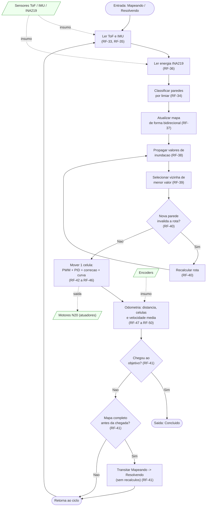
```mermaid
flowchart TB
  ent([Entrada: Mapeando / Resolvendo])
  s1["Ler ToF e IMU<br/>(RF-33, RF-35)"]
  s2["Ler energia INA219<br/>(RF-36)"]
  c1["Classificar paredes<br/>por limiar (RF-34)"]
  m1["Atualizar mapa<br/>de forma bidirecional (RF-37)"]
  f1["Propagar valores de<br/>inundacao (RF-38)"]
  f2["Selecionar vizinha de<br/>menor valor (RF-39)"]
  d1{"Nova parede<br/>invalida a rota?<br/>(RF-40)"}
  r1["Recalcular rota<br/>(RF-40)"]
  mv["Mover 1 celula:<br/>PWM + PID + correcao + curva<br/>(RF-42 a RF-46)"]
  od["Odometria: distancia, celulas<br/>e velocidade media<br/>(RF-47 a RF-50)"]
  d2{"Chegou ao<br/>objetivo? (RF-41)"}
  d3{"Mapa completo<br/>antes da chegada?<br/>(RF-41)"}
  res["Transitar Mapeando -> Resolvendo<br/>(sem recalculos) (RF-41)"]
  out([Saida: Concluido])
  loop([Retorna ao ciclo])

  sens[/"Sensores ToF / IMU / INA219"/]:::ext
  mot[/"Motores N20 (atuadores)"/]:::ext
  enc[/"Encoders"/]:::ext

  ent --> s1 --> s2 --> c1 --> m1 --> f1 --> f2 --> d1
  sens -. insumo .-> s1
  sens -. insumo .-> s2
  d1 -- Sim --> r1 --> f1
  d1 -- Nao --> mv --> od --> d2
  mv -. saida .-> mot
  enc -. insumo .-> od
  d2 -- Sim --> out
  d2 -- Nao --> d3
  d3 -- Sim --> res --> loop
  d3 -- Nao --> loop
  loop --> s1

  classDef ext fill:#efe,stroke:#393;
```

#### 5. Diagrama 3 - Máquina de estados de navegação (complementar)

Os seis estados definidos no RF-54 e suas transições autorizadas.

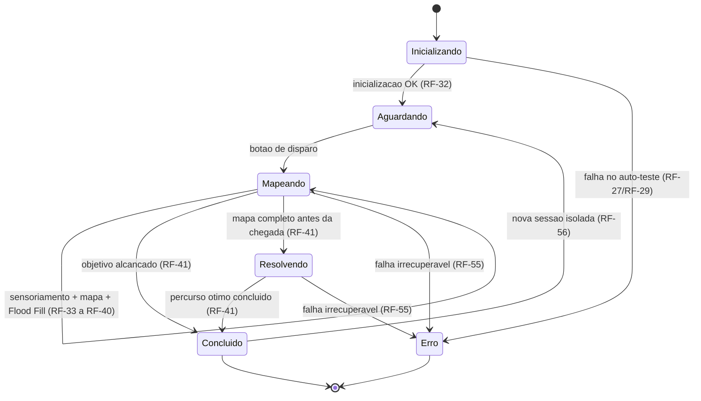
```mermaid
stateDiagram-v2
  state "Inicializando" as Init
  state "Aguardando" as Ag
  state "Mapeando" as Map
  state "Resolvendo" as Res
  state "Concluido" as Con
  state "Erro" as Err

  [*] --> Init
  Init --> Ag: inicializacao OK (RF-32)
  Init --> Err: falha no auto-teste (RF-27/RF-29)
  Ag --> Map: botao de disparo
  Map --> Map: sensoriamento + mapa + Flood Fill (RF-33 a RF-40)
  Map --> Con: objetivo alcancado (RF-41)
  Map --> Res: mapa completo antes da chegada (RF-41)
  Res --> Con: percurso otimo concluido (RF-41)
  Map --> Err: falha irrecuperavel (RF-55)
  Res --> Err: falha irrecuperavel (RF-55)
  Con --> Ag: nova sessao isolada (RF-56)
  Con --> [*]
  Err --> [*]
```

#### 6. Descrição do fluxo

##### **Inicialização.**

Ao ligar, o firmware executa o auto-teste do ESP32 e dos GPIO, reendereça os sete ToF no barramento I2C, verifica IMU e INA219, lê o tipo de labirinto no DIP switch (insumo do Operador), inicializa o mapa com a inundação inicial e conecta o Wi-Fi em modo estação. Se algo falhar, transita direto para **Erro**. Caso contrário, sinaliza prontidão (saída para o Operador via LED/buzzer) e entra em **Aguardando**.

##### **Disparo e paralelismo.**

Ao receber o botão de disparo (insumo do Operador), entra em **Mapeando** e ocorre a **bifurcação**: o _Ciclo de navegação_ e a _transmissão de telemetria_ passam a correr em paralelo. A telemetria é emissora unidirecional e isolada da navegação (RNF-33).

##### **Ciclo de navegação (Diagrama 2).**

A cada iteração o firmware lê os sensores, classifica as paredes por limiar, atualiza o mapa, propaga os valores de inundação (Flood Fill), seleciona a próxima célula de menor valor e move-se uma célula (saída para os motores). Se uma nova parede invalida a rota, recalcula antes de mover. Ao completar o mapa antes de chegar, transita para **Resolvendo** e executa o percurso ótimo sem novos recálculos. Ao alcançar o objetivo, sai do ciclo.

##### **Encerramento.**

A **sincronização** reúne navegação e telemetria em **Concluído**; em seguida a sessão é isolada (zera mapa, contadores e temporizador) e o robô retorna a **Aguardando** para uma nova tentativa. Uma falha irrecuperável detectada durante a operação leva a **Erro**, que interrompe todos os PWM dos motores e sinaliza a condição.

#### 7. Rastreabilidade (atividade -> RF)

| Atividade no diagrama                           | RF                                       |
| :---------------------------------------------- | :--------------------------------------- |
| Inicialização e auto-teste                      | RF-27, RF-28, RF-29, RF-30, RF-31, RF-51 |
| Sinalizar prontidão / Aguardando                | RF-32                                    |
| Ler ToF e IMU / energia                         | RF-33, RF-35, RF-36                      |
| Classificar paredes                             | RF-34                                    |
| Atualizar mapa                                  | RF-37                                    |
| Flood Fill (propagar / selecionar / recalcular) | RF-38, RF-39, RF-40                      |
| Encerramento de mapeamento / Resolvendo         | RF-41                                    |
| Mover 1 célula (PWM, PID, correção, curva)      | RF-42, RF-43, RF-44, RF-45, RF-46        |
| Odometria                                       | RF-47, RF-48, RF-49, RF-50               |
| Telemetria (paralela)                           | RF-52, RF-53                             |
| Máquina de estados                              | RF-54                                    |
| Detecção de falha / Erro                        | RF-55                                    |
| Isolamento entre sessões                        | RF-56                                    |

<a id="be_ad--diagrama-de-atividades--raia-do-backend-recepção-e-persistência"></a>
### 1.2 Diagrama de Atividades — Raia do Backend (recepção e persistência)

**Versão:** 1.1 — alinhada ao Guia da Equipe de Software (21/09/2026)
**Issue:** [#247 — 2.2 Modelar a raia do backend](https://github.com/fcte-pi1/2026.2_PI1_Grupo1_Diogo/issues/247)
**Escopo:** comportamento do backend desde a conexão do robô até a persistência, a confirmação e a publicação dos dados aos painéis. As raias **Robô (firmware)** e **Painel (frontend)** aparecem apenas nos pontos de interação. O detalhamento delas é das issues [#246](https://github.com/fcte-pi1/2026.2_PI1_Grupo1_Diogo/issues/246) (firmware) e [#248](https://github.com/fcte-pi1/2026.2_PI1_Grupo1_Diogo/issues/248) (frontend), e a integração num diagrama único é feita pela Gerência de Software na [#249](https://github.com/fcte-pi1/2026.2_PI1_Grupo1_Diogo/issues/249).

**Arquivos (fonte editável + imagem exportada):**

| Diagrama | Fonte (PlantUML) | Imagem |
|:--|:--|:--|
| A — Recepção, validação e persistência | [`atividades-A-recepcao-persistencia.puml`](software/backend/diagramas/atividades-A-recepcao-persistencia.puml) | [`.svg`](software/backend/diagramas/atividades-A-recepcao-persistencia.svg) |
| B — Monitoramento de sinal e interrupção | [`atividades-B-monitoramento-sinal.puml`](software/backend/diagramas/atividades-B-monitoramento-sinal.puml) | [`.svg`](software/backend/diagramas/atividades-B-monitoramento-sinal.svg) |

Para regenerar as imagens, veja [`diagramas/README.md`](#be_diag--diagramas-do-backend--fontes-editáveis-e-imagens-exportadas).

#### Notação UML utilizada

| Elemento | Representação |
|:--|:--|
| Estado inicial | círculo preto cheio |
| Estado final | círculo preto com anel |
| Atividade | retângulo de cantos arredondados |
| Envio de sinal (saída para outra raia) | pentágono apontando para a direita (`<<output>>`) |
| Recepção de sinal (entrada vinda de outra raia) | retângulo com entalhe (`<<input>>`) |
| Nó de decisão e de junção (*merge*) | losango |
| Bifurcação e sincronização (*fork/join*) | barra preta horizontal |
| Raia (*swimlane*) | coluna com o nome do ator: Robô (firmware), Backend, Painel (frontend) |
| Fluxo de controle | seta |
| Insumos e saídas | notas associadas às atividades, com detalhamento na tabela abaixo |

---

#### Diagrama A — Recepção, validação e persistência

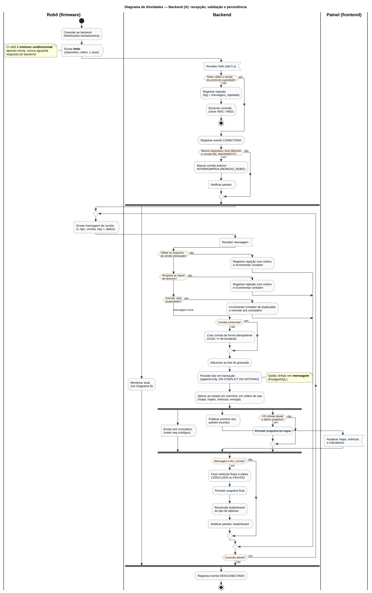

#### Diagrama B — Monitoramento de sinal e interrupção por falta de comunicação

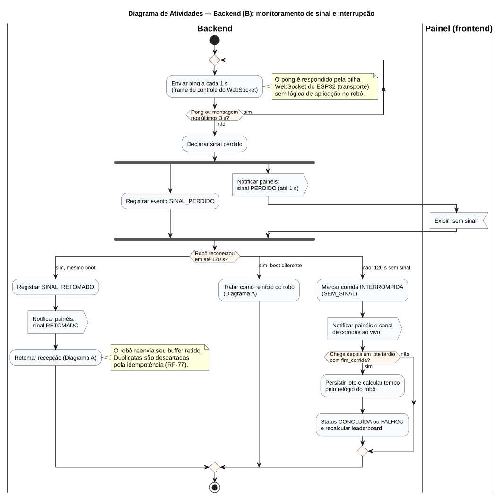

---

#### Descrição das atividades

##### Atores

| Ator | Tipo | Papel no fluxo |
|:--|:--|:--|
| Robô (firmware do ESP32) | Sistema externo | Fonte da telemetria. **Emissor unidirecional**: envia `hello` e as mensagens de corrida e nunca depende de respostas do backend. |
| Backend | Sistema (esta raia) | Autentica, valida, persiste, deriva métricas, confirma e distribui. |
| Painel (frontend) | Sistema externo | Consumidor das atualizações em tempo real. |
| Operador | Usuário | Não atua neste fluxo. Atua na anulação (RF-96), fora do caminho de ingestão. |

##### Atividades, insumos e saídas

| Diagrama | Atividade | Insumos | Saídas | RF |
|:--:|:--|:--|:--|:--|
| A | Receber `hello` (até 5 s) | Conexão WebSocket | Conexão pendente de autenticação | RF-72 |
| A | Autenticar dispositivo e versão | `hello` (dispositivo, token, `v`, `boot`) | Conexão aceita, ou rejeição registrada e conexão fechada (4001/4002) | RF-72, RNF-55, RNF-57 |
| A | Detectar reinício do robô | `boot` do `hello` × `boot` da corrida em andamento | Corrida anterior `INTERROMPIDA (REINICIO_ROBO)` e notificação aos painéis | RF-81 |
| A | Validar esquema | Mensagem + esquema JSON da versão | Mensagem válida ou rejeição | RF-75 |
| A | Validar domínio | Mensagem + dimensões do labirinto + último `t` | Mensagem válida ou rejeição | RF-76 |
| A | Registrar rejeição | Mensagem + motivo | Log JSON, linha em `mensagem_rejeitada`, contador | RF-75, RF-76, RNF-56 |
| A | Descartar duplicata | `(corrida, seq)` já persistido | `ack` reenviado, contador de duplicadas, nenhum registro novo | RF-77 |
| A | Criar corrida | (dispositivo, id da corrida no robô) | Linha em `corrida` com UUID e nº de tentativa | RF-78, RF-97 |
| A | Persistir lote | Mensagens aceitas | Linhas em `mensagem` (append-only) | RF-79, RNF-49 |
| A | Aplicar ao estado em memória | Mensagens persistidas, em ordem de `seq` | Mapa, trajeto, velocidade e energia atualizados | RF-80, RF-83 a RF-85 |
| A | Enviar `ack` cumulativo | Maior `seq` contíguo persistido | `ack` (informativo para o robô) | RF-74 |
| A | Publicar eventos | Eventos derivados | Evento/contínuo para os painéis inscritos | RF-88 a RF-90 |
| A | Persistir snapshot | Estado do mapa a cada +20 células | Linha em `snapshot_mapa` | RF-80 |
| A | Encerrar corrida | `fim_corrida` | Métricas finais, status, snapshot final, ranking recalculado | RF-81, RF-82, RF-87, RF-95 |
| B | Heartbeat | Ping a cada 1 s + pong ou mensagem | Declaração de perda após 3 s | RF-73 |
| B | Notificar sinal | Perda ou retomada | Evento `sinal` aos painéis (≤ 1 s) | RF-92 |
| B | Interromper por silêncio | 120 s sem sinal | Corrida `INTERROMPIDA (SEM_SINAL)` | RF-81, RF-87 |
| B | Aceitar lote tardio | Lote com `fim_corrida` após a interrupção | Corrida `CONCLUÍDA` ou `FALHOU` | RF-81, RF-87 |

##### Pontos de decisão, paralelismo e sincronização

- **Robô como emissor unidirecional:** nenhuma atividade do robô espera uma resposta do backend. Uma autenticação recusada se manifesta só como o fechamento da conexão. O `ack` é enviado (RF-74), mas o fluxo do robô não depende dele. Depois de uma reconexão, o robô reenvia o buffer retido e as duplicatas são descartadas pelo backend (RF-77).
- **Primeiro fork/join (Diagrama A):** depois da autenticação, o monitoramento de sinal (Diagrama B) e o laço de recepção rodam em paralelo durante toda a conexão. No Node.js isso é concorrência cooperativa no *event loop* (um *timer* e um *handler* de mensagens), sem threads.
- **Fork/join interno (Diagrama A):** depois da persistência, a confirmação, a publicação aos painéis e a verificação de snapshot são independentes. A sincronização garante que o encerramento da corrida só ocorra depois dos três ramos, para que o snapshot final e o ranking vejam o estado completo.
- **Ordem persistir → confirmar/distribuir:** o `ack` e a distribuição só acontecem **depois** da transação confirmada. Assim, um dado exibido no painel nunca se perde num reinício do backend (RNF-50, RNF-52).
- **Fork/join (Diagrama B):** o registro do evento e a notificação aos painéis são paralelos. A notificação não espera a escrita no banco, para cumprir o prazo de 1 s do RF-92.
- **Decisão de reconexão (Diagrama B):** há três saídas: mesmo `boot` (retomada), `boot` diferente (reinício, tratado no Diagrama A) e 120 s sem sinal (interrupção, com possível lote tardio).
- **Laço de recepção:** a conexão continua aberta depois do `fim_corrida`, porque o mesmo robô pode iniciar a próxima tentativa sem reconectar.

<a id="fe_ad--diagrama-de-atividades--raias-do-operador-e-do-frontend"></a>
### 1.3 Diagrama de Atividades — Raias do Operador e do Frontend

Este documento apresenta a modelagem, em Diagrama de Atividades da UML, das raias do **Operador** e do **Frontend (painel web)** do sistema Micromouse "Rato Borrachudo". A modelagem integra o entregável 5.1 do Projeto Conceitual de Software (AP5), definido no documento [4.4 - Projeto conceitual de software](4.4%20-%20Projeto%20conceitual%20de%20software.md) e detalhado no Guia da Equipe de Software (21/09/2026).

O escopo corresponde ao ciclo completo de uma tentativa, conforme o escopo mínimo do guia (seção 5.1): da preparação do robô e do painel pelo operador até a exibição do resultado no painel. As raias de Firmware e de Backend são modeladas pelos respectivos responsáveis. Os pontos de contato com essas raias estão indicados por marcadores (seção 4), e a consolidação das quatro raias em um diagrama único cabe à Gerência de Software (guia, seção 6).

#### 1. Diagrama

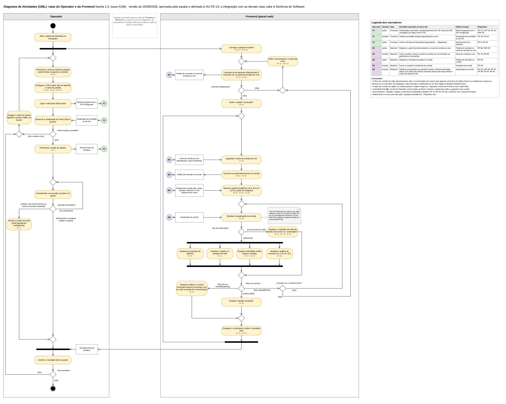

<p align="center"><b>Figura 1</b> - Diagrama de Atividades das raias do Operador e do Frontend (painel web)</p>

<p align="center">Fonte: elaboração própria. Arquivo-fonte editável: <a href="diagramas/2_diagrama_de_atividades_operador_frontend.drawio">2_diagrama_de_atividades_operador_frontend.drawio</a> (draw.io).</p>

Sob cada ação, em cinza, estão os requisitos que ela atende, com a numeração de [2 - Requisitos](2%20-%20Requisitos.md).

#### 2. Elementos do diagrama

##### 2.1 Atores e raias

| Raia | Papel no fluxo |
|:--|:--|
| **Operador** | Integrante da equipe que prepara o robô na pista, dispara a tentativa, acompanha a execução no painel e intervém fisicamente quando necessário. É o único ator humano modelado. |
| **Frontend (painel web)** | Interface que se conecta ao backend, acompanha a corrida ao vivo e exibe, em tempo real, os seis dados obrigatórios, o labirinto, o trajeto e o estado da conexão. |
| Firmware e Backend | Raias modeladas por outros integrantes. Aparecem neste documento apenas por meio dos marcadores **F** (Firmware) e **B** (Backend). |

##### 2.2 Notação UML utilizada

| Elemento | Uso no diagrama |
|:--|:--|
| Nó inicial | Início do processo, na raia do Operador. |
| Nó final de atividade | Encerramento do processo quando não há nova tentativa. Encerra todos os fluxos em andamento, inclusive o do painel. |
| Ações | 26 ações (10 na raia do Operador e 16 na raia do Frontend). |
| Nós de decisão | 7 decisões, todas com condições de guarda nas saídas. |
| Nós de junção (*merge*) | 10 junções, usadas nos retornos de laço e na convergência de caminhos alternativos. |
| Barras de bifurcação (*fork*) | 3 bifurcações: início em paralelo do painel e da preparação do robô; atualização paralela da tela; devolução do resultado ao operador em paralelo ao retorno do painel à espera. |
| Barras de sincronização (*join*) | 2 sincronizações: fim das atualizações paralelas da tela; conferência do resultado pelo operador. |
| Nós de objeto | 9 objetos que representam os insumos e as saídas trocados entre raias (seção 2.3). |
| Raias (*swimlanes*) | 2 raias (Operador e Frontend), com espaço reservado para Firmware e Backend. |
| Fluxos de controle e de objeto | Setas contínuas entre ações, nós e objetos. |
| Conectores (marcadores) | 8 marcadores, F1 a F3 e B1 a B5, que indicam os pontos de contato com as raias de Firmware e Backend. |
| Nota | Requisitos não funcionais que se aplicam ao laço de atualização (RNF-37, RNF-38 e RNF-40). |

##### 2.3 Insumos e saídas

| Objeto | Produzido por | Consumido por | Tipo |
|:--|:--|:--|:--|
| Robô energizado com o DIP configurado | Operador: *Ligar o robô pela chave geral* | Firmware (F1) | Saída |
| Sinalização de prontidão ou de erro | Firmware (F2) | Operador: *Observar a sinalização do robô* | Insumo |
| Sinal de início da tentativa | Operador: *Pressionar o botão de disparo* | Firmware (F3) | Saída |
| Pedido de inscrição no canal de corridas ao vivo | Frontend: *Conectar-se ao backend e inscrever-se no canal de corridas ao vivo* | Backend (B1) | Saída |
| Aviso de corrida ao vivo (identificador e tipo de labirinto) | Backend (B2) | Frontend: *Aguardar o aviso de corrida ao vivo* | Insumo |
| Pedido de inscrição na corrida | Frontend: *Inscrever-se automaticamente na corrida* | Backend (B3) | Saída |
| Snapshot da corrida (tipo, mapa, posição, métricas e número de sequência de corte) | Backend (B4) | Frontend: *Montar a grade do labirinto a partir do snapshot* | Insumo |
| Atualização da corrida | Backend (B5) | Frontend: *Receber a atualização da corrida* | Insumo |
| Resultado final da tentativa | Frontend: *Congelar o cronômetro e exibir o resultado final* | Operador: sincronização antes de *Conferir o resultado final no painel* | Saída do Frontend, insumo do Operador |

Quando uma ação recebe um objeto, ela só é executada depois que o objeto chega. Por exemplo, *Aguardar o aviso de corrida ao vivo* permanece em espera até o backend enviar o aviso (B2).

#### 3. Descrição do fluxo

##### 3.1 Fluxo principal

1. O **Operador** abre o painel de telemetria no navegador. A partir desse ponto, uma bifurcação inicia dois fluxos paralelos: a preparação do robô, na raia do Operador, e a conexão do painel, na raia do Frontend.
2. Na raia do **Operador**:
   1. posiciona o robô na célula de partida;
   2. configura o DIP switch com o tipo de labirinto e o canto de partida (RF-30, RF-99);
   3. liga o robô pela chave geral.

   A configuração precede a energização porque o DIP switch é lido apenas na inicialização (RNF-35). A energização entrega ao Firmware o robô configurado (F1).
3. Na raia do **Frontend**, o painel é carregado (RNF-41, RNF-42), conecta-se ao backend por WebSocket e inscreve-se no canal de corridas ao vivo (RF-58, RF-88; B1). Confirmada a conexão, exibe o estado "conectado" (RF-59) e aguarda o aviso de uma corrida ao vivo.
4. O **Operador** observa a sinalização do robô, recebida do Firmware (F2). Diante da sinalização de prontidão (RF-32), pressiona o botão de disparo (RF-5), o que entrega ao Firmware o sinal de início da tentativa (F3). Em seguida, passa a acompanhar a execução na pista e no painel.
5. Quando o backend cria a corrida, envia o aviso ao canal de corridas ao vivo (B2). O **Frontend** inscreve-se automaticamente na corrida, sem configuração manual do operador (RF-62, RF-88; B3). Com o *snapshot* recebido (RF-89; B4), monta a grade do labirinto no formato 4×4, 8×4 ou 12×4 (RF-60, RF-62).
6. A cada atualização recebida do backend (B5), o **Frontend** verifica o tipo da mensagem:
   - **aviso de perda ou retomada do sinal do robô:** atualiza o indicador de sinal (RF-59, RF-73, RF-92);
   - **telemetria:** executa em paralelo quatro atualizações, sincronizadas ao final:
     - paredes do labirinto (RF-60);
     - trajeto e posição do robô (RF-61);
     - velocidade média, tempo e energia (RF-57, RF-64);
     - gráfico de consumo (RF-68).
7. Em seguida, o **Frontend** avalia o status da corrida:
   - **CONCLUÍDA:** sinaliza "desafio cumprido" (RF-63);
   - **FALHOU** ou **INTERROMPIDA:** sinaliza a falha e o motivo informado pelo backend, que pode ser estouro do tempo limite, erro do robô ou perda de comunicação (RF-69);
   - **EM_ANDAMENTO:** verifica a conexão com o backend antes de voltar a aguardar a próxima atualização.
8. Ao término, o **Frontend** congela o cronômetro e exibe o resultado final (RF-57, RF-64). Uma nova bifurcação então:
   - entrega o resultado final ao Operador;
   - devolve o painel à espera de uma nova corrida ao vivo.
9. O **Operador** confere o resultado final. A ação ocorre após a sincronização entre o encerramento observado por ele e o resultado entregue pelo painel. Em seguida, decide se realiza nova tentativa. Sem nova tentativa, o processo termina no nó final de atividade, que encerra também o fluxo do painel.

##### 3.2 Fluxos alternativos

| Situação | Tratamento no diagrama | Requisitos |
|:--|:--|:--|
| Falha no auto-teste ou na inicialização | O robô sinaliza erro. O operador desliga o robô, corrige a falha e reinicia a preparação a partir do posicionamento. | RF-27 a RF-29; sinalização via F2 (ver seção 7) |
| Falha ao conectar o painel ao backend | O painel exibe "reconectando" e tenta novamente, sem intervenção do operador. | RF-59, RNF-39 |
| Queda da conexão entre painel e backend durante a corrida | O painel volta ao ciclo de reconexão. Ao se inscrever de novo, recebe um novo *snapshot*, o que ressincroniza a tela. | RF-89, RNF-39 |
| Perda do sinal do robô (entre robô e backend) | O painel exibe "sem sinal" e a navegação prossegue normalmente. Se a perda durar mais de 120 s, o backend marca a corrida como INTERROMPIDA e o painel sinaliza a falha. | RF-59, RF-73, RF-81, RF-92, RNF-33 |
| Colisão ou mau funcionamento do robô | O operador aciona a chave de corte geral (parada de emergência) e aguarda o resultado no painel. | RF-11 |
| Estouro do tempo limite de 10 minutos | O backend informa o estouro no status da corrida, com o motivo de término. O painel sinaliza a falha e o motivo recebido, e o operador interrompe o robô pela chave de corte geral. | RF-69, RF-87, RF-11 |
| Nova tentativa | O operador desliga o robô (se ainda estiver ligado), reposiciona e reconfigura o DIP switch se for mudar de labirinto, e liga novamente. A reinicialização garante mapa, contador e temporizador zerados. | RF-19, RF-56, RF-81 |

#### 4. Pontos de integração com as demais raias

**Convenção adotada.** O fluxo de controle de cada raia permanece nela. A comunicação com as raias de Firmware e Backend é representada por fluxos de objeto (insumos e saídas) que começam ou terminam em um marcador. Na consolidação do diagrama, cada marcador deve ser substituído por um fluxo ligado à atividade correspondente da outra raia.

| Marcador | Direção | Raia | Atividade esperada na outra raia | Objeto trocado | Requisitos |
|:--:|:--|:--|:--|:--|:--|
| F1 | saída | Firmware | Inicialização: auto-teste, reendereçamento dos sensores ToF, leitura do DIP switch, montagem do mapa e conexão Wi-Fi em modo estação | Robô energizado com o DIP configurado | RF-27 a RF-31, RF-51, RNF-35 |
| F2 | entrada | Firmware | Sinalizar prontidão (estado Aguardando) ou erro | Sinalização de prontidão ou de erro | RF-32, RF-55 |
| F3 | saída | Firmware | Iniciar a Sessão de Resolução (Aguardando → Mapeando) | Sinal de início da tentativa | RF-5, RF-54 |
| B1 | saída | Backend | Registrar o painel (somente leitura) no canal de corridas ao vivo | Pedido de inscrição no canal de corridas ao vivo | RF-88, RNF-55 |
| B2 | entrada | Backend | Criar a corrida e avisar o canal de corridas ao vivo, inclusive o painel que se reconecta durante uma corrida | Aviso de corrida ao vivo | RF-78, RF-88 |
| B3 | saída | Backend | Registrar a inscrição do painel na corrida | Pedido de inscrição na corrida | RF-88 |
| B4 | entrada | Backend | Enviar o *snapshot* consistente da corrida | Snapshot da corrida | RF-89 |
| B5 | entrada | Backend | Distribuir atualizações aos painéis inscritos: métricas derivadas, status com motivo de término (inclusive estouro do tempo limite) e avisos de sinal do robô | Atualização da corrida | RF-82 a RF-85, RF-87, RF-88, RF-90, RF-92 |

#### 5. Decisões de modelagem

1. **Operador como ator único.** Somente quem participa do processo foi modelado. O operador manipula o robô e acompanha o painel; plateia e avaliadores não fazem parte do fluxo.
2. **Inscrição automática na corrida.** O RF-62 determina que o painel se adapte ao labirinto sem configuração manual, e o RF-88 prevê um canal geral de corridas ao vivo. Os dois requisitos são compatíveis: o painel recebe o aviso pelo canal geral e se inscreve sozinho na corrida. Por isso, a raia do Operador não contém uma ação de seleção de corrida.
3. **Tempo limite detectado pelo Backend.** O estouro do limite de 10 minutos é informado pelo backend no status e no motivo de término da corrida, e o painel apenas sinaliza a falha e o motivo recebido (RF-69). A decisão segue a HU-FE-13, critério CA2, e a convenção das [histórias de usuário do frontend](#fe_hu--histórias-de-usuário--frontend) de que o painel não recalcula dados já derivados pelo backend, como o status da corrida. A interrupção física do robô cabe ao operador, porque o painel não envia comandos ao robô. Como nenhum requisito de backend prevê essa detecção hoje, o ponto está registrado na seção 7.
4. **Painel somente leitura e robô como emissor unidirecional.** O painel não envia comandos ao robô, conforme o RF-53, o RNF-55 e as decisões herdadas no guia (seção 4). A configuração do labirinto ocorre exclusivamente pelo DIP switch. Assim, não foram adotados a configuração por "comando web" citada no RF-5 nem o "recebimento de comandos" citado no RNF-6.
5. **Nova tentativa por reinicialização.** Desligar e religar o robô garante o isolamento entre sessões (RF-56) sem nova carga de firmware (RF-19). Também é coerente com a marcação como INTERROMPIDA de uma corrida não encerrada quando o robô se reconecta após reiniciar (RF-81).
6. **Escopo.** Seguindo o escopo mínimo do guia, que termina na exibição no painel, ficaram fora deste diagrama:
   - a consulta ao histórico, com filtros e detalhamento (RF-65 a RF-67);
   - o modo de depuração (RF-70);
   - a exportação de resultados (RF-71);
   - a anulação de corrida (RF-96).

#### 6. Rastreabilidade

A coluna HU remete às [histórias de usuário do frontend](#fe_hu--histórias-de-usuário--frontend), que correspondem 1:1 aos RF-57 a RF-71.

| Requisito | HU | Elemento do diagrama |
|:--|:--|:--|
| RF-5 | — | *Pressionar o botão de disparo*; F3 |
| RF-11 | — | *Acionar a chave de corte geral (parada de emergência)* |
| RF-19 | — | Laço de nova tentativa (decisão "Nova tentativa?") |
| RF-30, RF-99, RNF-35 | — | *Posicionar o robô na célula de partida*; *Configurar o DIP switch*; F1 |
| RF-32, RF-55 | — | *Observar a sinalização do robô*; decisão "Robô sinalizou prontidão?"; F2 |
| RF-57 | HU-FE-01 | *Atualizar velocidade média, tempo e energia*; *Congelar o cronômetro e exibir o resultado final* |
| RF-58 | HU-FE-02 | *Conectar-se ao backend (WebSocket) e inscrever-se no canal de corridas ao vivo*; *Receber a atualização da corrida* |
| RF-59 | HU-FE-03 | *Exibir "reconectando" e tentar de novo*; *Exibir o estado "conectado"*; *Atualizar o indicador de sinal do robô* |
| RF-60 | HU-FE-04 | *Montar a grade do labirinto*; *Atualizar as paredes do labirinto* |
| RF-61 | HU-FE-05 | *Atualizar o trajeto e a posição do robô* |
| RF-62 | HU-FE-06 | *Inscrever-se automaticamente na corrida*; *Montar a grade do labirinto* |
| RF-63 | HU-FE-07 | *Sinalizar "desafio cumprido"* |
| RF-64 | HU-FE-08 | *Atualizar velocidade média, tempo e energia*; *Congelar o cronômetro e exibir o resultado final* |
| RF-68 | HU-FE-12 | *Atualizar o gráfico de consumo* |
| RF-69 | HU-FE-13 | *Sinalizar a falha e o motivo informado*, inclusive o estouro do tempo limite informado pelo backend |
| RF-73, RF-92 | — | *Atualizar o indicador de sinal do robô*; B5 |
| RF-87 | — | Decisão "Status da corrida?"; B5 |
| RF-88, RF-89 | — | *Aguardar o aviso de corrida ao vivo*; *Inscrever-se automaticamente na corrida*; *Montar a grade do labirinto*; B1 a B4 |
| RNF-37, RNF-38, RNF-40 | — | Nota do laço de atualização |
| RNF-39 | — | Ciclo de reconexão (decisões "Conexão estabelecida?" e "Conexão com o backend ativa?") |
| RNF-41, RNF-42 | — | *Carregar a página do painel* |

Requisitos de frontend sem elemento neste diagrama:

- RF-65 a RF-67, RF-70 e RF-71: fora do escopo (seção 5, item 6);
- RNF-43 a RNF-47: tratam de desempenho das consultas, responsividade, compatibilidade, legibilidade e cobertura de testes. Não descrevem comportamento do fluxo e são tratados nos protótipos, na arquitetura e no roteiro de testes.

<a id="fe_ad--7-pontos-em-aberto"></a>
#### 7. Pontos em aberto

| Ponto | Com quem alinhar |
|:--|:--|
| Os requisitos tratam da sinalização de erro durante a operação (RF-55), mas não definem como o robô sinaliza falha no auto-teste de inicialização (RF-27 a RF-29), utilizada em F2. | Firmware |
| Confirmar que uma nova tentativa é realizada desligando e religando o robô. | Firmware |
| Ao reconectar durante uma corrida, o painel precisa receber o aviso da corrida já em andamento (B2); caso contrário, permanece aguardando uma corrida nova. | Backend |
| A detecção do estouro do tempo limite de 10 minutos cabe ao backend (HU-FE-13, CA2), mas nenhum requisito de backend a prevê hoje: o RF-81 trata apenas da falta de sinal, e o RF-87 lista os status sem esse motivo. É preciso incluir a regra no backend, com o motivo correspondente no status enviado ao painel e gravado no histórico. | Backend e Gerência de Software |
| O RF-86 prevê alerta de tensão baixa enviado aos painéis, mas nenhum requisito de frontend define sua exibição. | Gerência de Software |
| O RF-70 (modo de depuração) exige dados brutos dos sensores que não constam da carga útil de telemetria definida no RF-52. | Firmware e Gerência de Software |

#### Referências

- OBJECT MANAGEMENT GROUP. *OMG Unified Modeling Language (OMG UML), Version 2.5.1*. Needham: OMG, 2017. Disponível em: <https://www.omg.org/spec/UML/2.5.1/>.
- Grupo 1 — PI1 2026/2. *Guia da Equipe de Software — Etapa de Projeto Conceitual de Software*, 21/09/2026.
- Grupo 1 — PI1 2026/2. [2 - Requisitos](2%20-%20Requisitos.md).
- Grupo 1 — PI1 2026/2. [4.4 - Projeto conceitual de software](4.4%20-%20Projeto%20conceitual%20de%20software.md).
- Grupo 1 — PI1 2026/2. [Histórias de Usuário — Frontend](#fe_hu--histórias-de-usuário--frontend).

#### Histórico de versões

| Versão | Data | Descrição |
|:--|:--|:--|
| 1.0 | 24/09/2026 | Raias do Operador e do Frontend aprovadas pela equipe. |
| 1.1 | 25/09/2026 | Alinhamento com a HU-FE-13 (CA2): a detecção do estouro do tempo limite passa ao backend; removidas da raia do Frontend a decisão "Tempo decorrido ≥ 10 min?" e a ação *Sinalizar estouro do tempo limite*. |

## 2. Backlog do Produto

Esta seção consolida o Backlog do Produto das três frentes de software — **Firmware** (RF-27 a RF-56), **Frontend** (RF-57 a RF-71) e **Backend** (RF-72 a RF-98) — no formato exigido pelo modelo do documento 4.4: tabelas de requisitos por RF/Épico (subseções 2.1 e 2.2) e histórias de usuário com descrição *Eu-Como-Para*, critérios de aceitação e protótipos de interface (subseções 2.3 e 2.4). Os IDs de HU seguem o esquema de cada frente: `HU-NN` (firmware), `HU-FE-NN` (frontend) e `HU-BE-NN` (backend).

### 2.1 Requisitos Funcionais

#### Firmware (RF-27 a RF-56)

Preencha a coluna "ID (Link Github Projects)" com o número da issue criada para cada HU.

**Épico FW-1 - Inicialização e Auto-teste** (RF-27 a RF-32)

| ID (Link Github Projects) | Título                                               | Prioridade |
| :------------------------ | :--------------------------------------------------- | :--------- |
| HU-01                     | Auto-teste do ESP32 ao boot                          | Must have  |
| HU-02                     | Reendereçamento dos sensores ToF no I2C              | Must have  |
| HU-03                     | Verificação de comunicação com IMU e INA219          | Must have  |
| HU-04                     | Leitura do DIP switch e tipo de labirinto            | Must have  |
| HU-05                     | Inicialização do mapa do labirinto                   | Must have  |
| HU-06                     | Sinalização de prontidão e transição para Aguardando | Must have  |

**Épico FW-2 - Sensoriamento e Percepção** (RF-33 a RF-37)

| ID (Link Github Projects) | Título                                          | Prioridade |
| :------------------------ | :---------------------------------------------- | :--------- |
| HU-07                     | Leitura periódica dos sensores ToF VL53L1X      | Must have  |
| HU-08                     | Classificação de paredes por limiar de detecção | Must have  |
| HU-09                     | Leitura de dados do IMU MPU-6050                | Must have  |
| HU-10                     | Leitura de dados de energia do INA219           | Must have  |
| HU-11                     | Atualização do mapa do labirinto                | Must have  |

**Épico FW-3 - Navegação e Algoritmo Flood Fill** (RF-38 a RF-41)

| ID (Link Github Projects) | Título                                                | Prioridade |
| :------------------------ | :---------------------------------------------------- | :--------- |
| HU-12                     | Cálculo e propagação dos valores de inundação         | Must have  |
| HU-13                     | Seleção da próxima célula de menor valor de inundação | Must have  |
| HU-14                     | Recálculo de rota por nova parede detectada           | Must have  |
| HU-15                     | Encerramento do mapeamento e transição de estado      | Must have  |

**Épico FW-4 - Controle de Movimento** (RF-42 a RF-46)

| ID (Link Github Projects) | Título                                                | Prioridade |
| :------------------------ | :---------------------------------------------------- | :--------- |
| HU-16                     | Geração de sinais PWM via canais LEDC                 | Must have  |
| HU-17                     | Malha de controle PID para equalização de velocidades | Must have  |
| HU-18                     | Correção de trajetória por ToF laterais e IMU         | Must have  |
| HU-19                     | Monitoramento e controle do ângulo de curva           | Must have  |
| HU-20                     | Autorização de avanço após conclusão de curva         | Must have  |

**Épico FW-5 - Odometria** (RF-47 a RF-50)

| ID (Link Github Projects) | Título                                         | Prioridade |
| :------------------------ | :--------------------------------------------- | :--------- |
| HU-21                     | Captura de pulsos dos encoders por interrupção | Must have  |
| HU-22                     | Conversão de pulsos em distância percorrida    | Must have  |
| HU-23                     | Contagem de células percorridas                | Must have  |
| HU-24                     | Cálculo da velocidade média da sessão          | Must have  |

**Épico FW-6 - Telemetria e Comunicação** (RF-51 a RF-53)

| ID (Link Github Projects) | Título                                              | Prioridade |
| :------------------------ | :-------------------------------------------------- | :--------- |
| HU-25                     | Configuração do Wi-Fi em modo estação (STA)         | Must have  |
| HU-26                     | Transmissão contínua da carga útil de telemetria    | Must have  |
| HU-27                     | Garantia de transmissão unidirecional de telemetria | Must have  |

**Épico FW-7 - Máquina de Estados e Robustez** (RF-54 a RF-56)

| ID (Link Github Projects) | Título                                             | Prioridade |
| :------------------------ | :------------------------------------------------- | :--------- |
| HU-28                     | Implementação da máquina de estados de navegação   | Must have  |
| HU-29                     | Detecção de falhas e transição para o estado Erro  | Must have  |
| HU-30                     | Isolamento entre sessões de resolução consecutivas | Must have  |

#### Backend (RF-72 a RF-98)

##### Backlog do Produto — Backend

> Formato idêntico ao do [`4.4 - Projeto conceitual de software.md`](4.4%20-%20Projeto%20conceitual%20de%20software.md) (um bloco por RF/Épico). A coluna **ID** é o link da issue da HU no GitHub Projects (label `HU`, sub-issue do RF correspondente). A prioridade segue a escala MoSCoW de [`2 - Requisitos.md`](2%20-%20Requisitos.md).

###### Requisitos Funcionais

<u>[RF-72](https://github.com/fcte-pi1/2026.2_PI1_Grupo1_Diogo/issues/152)/Épico: Autenticação da fonte de telemetria</u>

| ID (Link Github Projects) | Título | Prioridade |
|:------| :-- | :--- |
| [HU-BE-01](https://github.com/fcte-pi1/2026.2_PI1_Grupo1_Diogo/issues/262) | Conectar somente robôs autorizados | Must have |

<u>[RF-73](https://github.com/fcte-pi1/2026.2_PI1_Grupo1_Diogo/issues/153)/Épico: Detecção de perda de conexão por heartbeat</u>

| ID (Link Github Projects) | Título | Prioridade |
|:------| :-- | :--- |
| [HU-BE-02](https://github.com/fcte-pi1/2026.2_PI1_Grupo1_Diogo/issues/263) | Saber rapidamente quando o robô perdeu o sinal | Must have |

<u>[RF-74](https://github.com/fcte-pi1/2026.2_PI1_Grupo1_Diogo/issues/154)/Épico: Confirmação cumulativa de mensagens (ack)</u>

| ID (Link Github Projects) | Título | Prioridade |
|:------| :-- | :--- |
| [HU-BE-03](https://github.com/fcte-pi1/2026.2_PI1_Grupo1_Diogo/issues/264) | Confirmar ao robô o que já foi gravado | Must have |

<u>[RF-75](https://github.com/fcte-pi1/2026.2_PI1_Grupo1_Diogo/issues/155)/Épico: Validação de mensagens contra o esquema do protocolo</u>

| ID (Link Github Projects) | Título | Prioridade |
|:------| :-- | :--- |
| [HU-BE-04](https://github.com/fcte-pi1/2026.2_PI1_Grupo1_Diogo/issues/265) | Rejeitar mensagens malformadas sem derrubar a conexão | Must have |

<u>[RF-76](https://github.com/fcte-pi1/2026.2_PI1_Grupo1_Diogo/issues/156)/Épico: Validação das regras de domínio</u>

| ID (Link Github Projects) | Título | Prioridade |
|:------| :-- | :--- |
| [HU-BE-05](https://github.com/fcte-pi1/2026.2_PI1_Grupo1_Diogo/issues/266) | Rejeitar dados fisicamente impossíveis | Must have |

<u>[RF-77](https://github.com/fcte-pi1/2026.2_PI1_Grupo1_Diogo/issues/157)/Épico: Idempotência por corrida e número de sequência</u>

| ID (Link Github Projects) | Título | Prioridade |
|:------| :-- | :--- |
| [HU-BE-06](https://github.com/fcte-pi1/2026.2_PI1_Grupo1_Diogo/issues/267) | Não duplicar dados reenviados | Must have |

<u>[RF-78](https://github.com/fcte-pi1/2026.2_PI1_Grupo1_Diogo/issues/158)/Épico: Criação automática e idempotente da corrida</u>

| ID (Link Github Projects) | Título | Prioridade |
|:------| :-- | :--- |
| [HU-BE-07](https://github.com/fcte-pi1/2026.2_PI1_Grupo1_Diogo/issues/268) | Registrar a corrida sem ação manual | Must have |

<u>[RF-79](https://github.com/fcte-pi1/2026.2_PI1_Grupo1_Diogo/issues/159)/Épico: Persistência append-only das mensagens da corrida</u>

| ID (Link Github Projects) | Título | Prioridade |
|:------| :-- | :--- |
| [HU-BE-08](https://github.com/fcte-pi1/2026.2_PI1_Grupo1_Diogo/issues/269) | Guardar o registro bruto e inalterável da corrida | Must have |

<u>[RF-80](https://github.com/fcte-pi1/2026.2_PI1_Grupo1_Diogo/issues/160)/Épico: Snapshot periódico do estado do mapa</u>

| ID (Link Github Projects) | Título | Prioridade |
|:------| :-- | :--- |
| [HU-BE-09](https://github.com/fcte-pi1/2026.2_PI1_Grupo1_Diogo/issues/270) | Preservar o estado do mapa periodicamente | Must have |

<u>[RF-81](https://github.com/fcte-pi1/2026.2_PI1_Grupo1_Diogo/issues/161)/Épico: Encerramento e marcação de corridas interrompidas</u>

| ID (Link Github Projects) | Título | Prioridade |
|:------| :-- | :--- |
| [HU-BE-10](https://github.com/fcte-pi1/2026.2_PI1_Grupo1_Diogo/issues/271) | Encerrar ou marcar como interrompida cada corrida | Must have |

<u>[RF-82](https://github.com/fcte-pi1/2026.2_PI1_Grupo1_Diogo/issues/162)/Épico: Cálculo do tempo de conclusão pelo relógio do robô</u>

| ID (Link Github Projects) | Título | Prioridade |
|:------| :-- | :--- |
| [HU-BE-11](https://github.com/fcte-pi1/2026.2_PI1_Grupo1_Diogo/issues/272) | Obter o tempo oficial de conclusão | Must have |

<u>[RF-83](https://github.com/fcte-pi1/2026.2_PI1_Grupo1_Diogo/issues/163)/Épico: Cálculo da velocidade média da corrida</u>

| ID (Link Github Projects) | Título | Prioridade |
|:------| :-- | :--- |
| [HU-BE-12](https://github.com/fcte-pi1/2026.2_PI1_Grupo1_Diogo/issues/273) | Acompanhar a velocidade média | Must have |

<u>[RF-84](https://github.com/fcte-pi1/2026.2_PI1_Grupo1_Diogo/issues/164)/Épico: Derivação do trajeto ordenado por sequência</u>

| ID (Link Github Projects) | Título | Prioridade |
|:------| :-- | :--- |
| [HU-BE-13](https://github.com/fcte-pi1/2026.2_PI1_Grupo1_Diogo/issues/274) | Reconstituir o trajeto percorrido | Must have |

<u>[RF-85](https://github.com/fcte-pi1/2026.2_PI1_Grupo1_Diogo/issues/165)/Épico: Derivação de métricas da série de tensão da bateria</u>

| ID (Link Github Projects) | Título | Prioridade |
|:------| :-- | :--- |
| [HU-BE-14](https://github.com/fcte-pi1/2026.2_PI1_Grupo1_Diogo/issues/275) | Avaliar o consumo de bateria da corrida | Must have |

<u>[RF-86](https://github.com/fcte-pi1/2026.2_PI1_Grupo1_Diogo/issues/166)/Épico: Alerta de tensão baixa aos painéis</u>

| ID (Link Github Projects) | Título | Prioridade |
|:------| :-- | :--- |
| [HU-BE-15](https://github.com/fcte-pi1/2026.2_PI1_Grupo1_Diogo/issues/276) | Ser alertado de bateria baixa | Should have |

<u>[RF-87](https://github.com/fcte-pi1/2026.2_PI1_Grupo1_Diogo/issues/167)/Épico: Status do desafio com motivo de término</u>

| ID (Link Github Projects) | Título | Prioridade |
|:------| :-- | :--- |
| [HU-BE-16](https://github.com/fcte-pi1/2026.2_PI1_Grupo1_Diogo/issues/277) | Saber o resultado da corrida e o motivo | Must have |

<u>[RF-88](https://github.com/fcte-pi1/2026.2_PI1_Grupo1_Diogo/issues/168)/Épico: Distribuição de atualizações por inscrição de corrida</u>

| ID (Link Github Projects) | Título | Prioridade |
|:------| :-- | :--- |
| [HU-BE-17](https://github.com/fcte-pi1/2026.2_PI1_Grupo1_Diogo/issues/278) | Receber só as atualizações da corrida acompanhada | Must have |

<u>[RF-89](https://github.com/fcte-pi1/2026.2_PI1_Grupo1_Diogo/issues/169)/Épico: Snapshot consistente para inscrição no meio da corrida</u>

| ID (Link Github Projects) | Título | Prioridade |
|:------| :-- | :--- |
| [HU-BE-18](https://github.com/fcte-pi1/2026.2_PI1_Grupo1_Diogo/issues/279) | Entrar no meio da corrida e ver o estado completo | Must have |

<u>[RF-90](https://github.com/fcte-pi1/2026.2_PI1_Grupo1_Diogo/issues/170)/Épico: Limite de taxa de atualizações contínuas por painel</u>

| ID (Link Github Projects) | Título | Prioridade |
|:------| :-- | :--- |
| [HU-BE-19](https://github.com/fcte-pi1/2026.2_PI1_Grupo1_Diogo/issues/280) | Receber dados contínuos em ritmo controlado | Must have |

<u>[RF-91](https://github.com/fcte-pi1/2026.2_PI1_Grupo1_Diogo/issues/171)/Épico: Controle de fluxo por painel sobrecarregado</u>

| ID (Link Github Projects) | Título | Prioridade |
|:------| :-- | :--- |
| [HU-BE-20](https://github.com/fcte-pi1/2026.2_PI1_Grupo1_Diogo/issues/281) | Não deixar um painel lento prejudicar os demais | Should have |

<u>[RF-92](https://github.com/fcte-pi1/2026.2_PI1_Grupo1_Diogo/issues/172)/Épico: Notificação de perda e retomada de sinal do robô</u>

| ID (Link Github Projects) | Título | Prioridade |
|:------| :-- | :--- |
| [HU-BE-21](https://github.com/fcte-pi1/2026.2_PI1_Grupo1_Diogo/issues/282) | Ver no painel a perda e a retomada de sinal | Must have |

<u>[RF-93](https://github.com/fcte-pi1/2026.2_PI1_Grupo1_Diogo/issues/173)/Épico: Listagem de corridas com filtros e paginação</u>

| ID (Link Github Projects) | Título | Prioridade |
|:------| :-- | :--- |
| [HU-BE-22](https://github.com/fcte-pi1/2026.2_PI1_Grupo1_Diogo/issues/283) | Consultar o histórico de corridas | Must have |

<u>[RF-94](https://github.com/fcte-pi1/2026.2_PI1_Grupo1_Diogo/issues/174)/Épico: Linha do tempo completa da corrida para replay</u>

| ID (Link Github Projects) | Título | Prioridade |
|:------| :-- | :--- |
| [HU-BE-23](https://github.com/fcte-pi1/2026.2_PI1_Grupo1_Diogo/issues/284) | Rever uma corrida passo a passo | Should have |

<u>[RF-95](https://github.com/fcte-pi1/2026.2_PI1_Grupo1_Diogo/issues/175)/Épico: Leaderboard por tipo de labirinto</u>

| ID (Link Github Projects) | Título | Prioridade |
|:------| :-- | :--- |
| [HU-BE-24](https://github.com/fcte-pi1/2026.2_PI1_Grupo1_Diogo/issues/285) | Ver o ranking por tipo de labirinto | Must have |

<u>[RF-96](https://github.com/fcte-pi1/2026.2_PI1_Grupo1_Diogo/issues/176)/Épico: Anulação de corrida pelo operador</u>

| ID (Link Github Projects) | Título | Prioridade |
|:------| :-- | :--- |
| [HU-BE-25](https://github.com/fcte-pi1/2026.2_PI1_Grupo1_Diogo/issues/286) | Anular uma corrida inválida | Should have |

<u>[RF-97](https://github.com/fcte-pi1/2026.2_PI1_Grupo1_Diogo/issues/177)/Épico: Numeração de tentativas por tipo de labirinto</u>

| ID (Link Github Projects) | Título | Prioridade |
|:------| :-- | :--- |
| [HU-BE-26](https://github.com/fcte-pi1/2026.2_PI1_Grupo1_Diogo/issues/287) | Identificar a primeira tentativa em cada labirinto | Should have |

<u>[RF-98](https://github.com/fcte-pi1/2026.2_PI1_Grupo1_Diogo/issues/178)/Épico: Exportação de corrida em JSON e CSV</u>

| ID (Link Github Projects) | Título | Prioridade |
|:------| :-- | :--- |
| [HU-BE-27](https://github.com/fcte-pi1/2026.2_PI1_Grupo1_Diogo/issues/288) | Exportar os dados de uma corrida | Could have |

#### Frontend (RF-57 a RF-71)

##### Backlog do Produto — Frontend

<u>Épico — Painel de acompanhamento ao vivo (RF-57 a RF-64)</u>

| ID | Título | RF | Prioridade | Caso de teste |
|:--|:--|:--|:--:|:--|
| HU-FE-01 | Exibir os dados obrigatórios da execução | [RF-57](https://github.com/fcte-pi1/2026.2_PI1_Grupo1_Diogo/issues/137) | P0 | CT-FE-01 |
| HU-FE-02 | Receber continuamente os dados da tentativa | [RF-58](https://github.com/fcte-pi1/2026.2_PI1_Grupo1_Diogo/issues/138) | P0 | CT-FE-02 |
| HU-FE-03 | Indicar o estado da conexão | [RF-59](https://github.com/fcte-pi1/2026.2_PI1_Grupo1_Diogo/issues/139) | P0 | CT-FE-03 |
| HU-FE-04 | Renderizar o labirinto atualizado | [RF-60](https://github.com/fcte-pi1/2026.2_PI1_Grupo1_Diogo/issues/140) | P0 | CT-FE-04 |
| HU-FE-05 | Visualizar o trajeto percorrido | [RF-61](https://github.com/fcte-pi1/2026.2_PI1_Grupo1_Diogo/issues/141) | P0 | CT-FE-05 |
| HU-FE-06 | Adaptar a tela ao tipo de labirinto | [RF-62](https://github.com/fcte-pi1/2026.2_PI1_Grupo1_Diogo/issues/142) | P0 | CT-FE-06 |
| HU-FE-07 | Indicar o desafio cumprido | [RF-63](https://github.com/fcte-pi1/2026.2_PI1_Grupo1_Diogo/issues/143) | P0 | CT-FE-07 |
| HU-FE-08 | Cronometrar a tentativa | [RF-64](https://github.com/fcte-pi1/2026.2_PI1_Grupo1_Diogo/issues/144) | P0 | CT-FE-08 |

<u>Épico — Histórico e análise de execuções (RF-65 a RF-71)</u>

| ID | Título | RF | Prioridade | Caso de teste |
|:--|:--|:--|:--:|:--|
| HU-FE-09 | Listar o histórico de execuções | [RF-65](https://github.com/fcte-pi1/2026.2_PI1_Grupo1_Diogo/issues/145) | P0 | CT-FE-09 |
| HU-FE-10 | Filtrar execuções por tipo de labirinto | [RF-66](https://github.com/fcte-pi1/2026.2_PI1_Grupo1_Diogo/issues/146) | P0 | CT-FE-10 |
| HU-FE-11 | Detalhar uma execução passada | [RF-67](https://github.com/fcte-pi1/2026.2_PI1_Grupo1_Diogo/issues/147) | P1 | CT-FE-11 |
| HU-FE-12 | Analisar o consumo durante a tentativa | [RF-68](https://github.com/fcte-pi1/2026.2_PI1_Grupo1_Diogo/issues/148) | P1 | CT-FE-12 |
| HU-FE-13 | Sinalizar falha de execução | [RF-69](https://github.com/fcte-pi1/2026.2_PI1_Grupo1_Diogo/issues/149) | P1 | CT-FE-13 |
| HU-FE-14 | Consultar dados em modo de depuração | [RF-70](https://github.com/fcte-pi1/2026.2_PI1_Grupo1_Diogo/issues/150) | P2 | CT-FE-14 |
| HU-FE-15 | Exportar resultados da execução | [RF-71](https://github.com/fcte-pi1/2026.2_PI1_Grupo1_Diogo/issues/151) | P2 | CT-FE-15 |

### 2.2 Requisitos Não-Funcionais

#### Firmware

Requisitos não-funcionais de firmware (Must have) que possuem caso de teste dedicado no roteiro de testes do firmware (apêndice da seção 4.1). O texto completo dos RNF de firmware (RNF-001 a RNF-006, numeração local do documento de requisitos do firmware) está na seção 5.3.

| ID (Link Github Projects) | Título | Prioridade | Rastreabilidade |
|:--------------------------| :-- | :--- |:----------------|
| [RNF-32](https://github.com/fcte-pi1/2026.2_PI1_Grupo1_Diogo/issues/210) | Desempate determinístico do Flood Fill | Must have | CT-FW-32 |
| [RNF-33](https://github.com/fcte-pi1/2026.2_PI1_Grupo1_Diogo/issues/211) | Isolamento telemetria × navegação | Must have | CT-FW-31 |
| [RNF-34](https://github.com/fcte-pi1/2026.2_PI1_Grupo1_Diogo/issues/212) | Compensação de deriva do giroscópio | Must have | CT-FW-33 |
| [RNF-35](https://github.com/fcte-pi1/2026.2_PI1_Grupo1_Diogo/issues/213) | DIP switch lido apenas no boot | Must have | CT-FW-34 |

#### Backend

###### Requisitos Não-Funcionais

| ID (Link Github Projects) | Título | Prioridade | Rastreabilidade |
|:--------------------------| :-- | :--- |:----------------|
| [RNF-48](https://github.com/fcte-pi1/2026.2_PI1_Grupo1_Diogo/issues/226) | Baixa latência (servidor–painel e ponta a ponta) | Must have | RF-88/HU-BE-17, RF-90/HU-BE-19 |
| [RNF-49](https://github.com/fcte-pi1/2026.2_PI1_Grupo1_Diogo/issues/227) | Não bloqueio do Event Loop | Must have | RF-79/HU-BE-08, RF-90/HU-BE-19, RF-98/HU-BE-27 |
| [RNF-50](https://github.com/fcte-pi1/2026.2_PI1_Grupo1_Diogo/issues/228) | Integridade dos dados após quedas de conexão | Must have | RF-74/HU-BE-03, RF-77/HU-BE-06 |
| [RNF-51](https://github.com/fcte-pi1/2026.2_PI1_Grupo1_Diogo/issues/229) | Capacidade de carga (mensagens e painéis simultâneos) | Must have | RF-79/HU-BE-08, RF-88/HU-BE-17 |
| [RNF-52](https://github.com/fcte-pi1/2026.2_PI1_Grupo1_Diogo/issues/230) | Recuperação após reinício do backend | Must have | RF-80/HU-BE-09, RF-81/HU-BE-10 |
| [RNF-53](https://github.com/fcte-pi1/2026.2_PI1_Grupo1_Diogo/issues/231) | Testabilidade dos fluxos de ingestão | Must have | RF-72/HU-BE-01 a RF-87/HU-BE-16 |
| [RNF-54](https://github.com/fcte-pi1/2026.2_PI1_Grupo1_Diogo/issues/232) | Imutabilidade da corrida finalizada | Must have | RF-79/HU-BE-08, RF-96/HU-BE-25 |
| [RNF-55](https://github.com/fcte-pi1/2026.2_PI1_Grupo1_Diogo/issues/233) | Segurança proporcional (autenticação e escrita restrita) | Must have | RF-72/HU-BE-01, RF-96/HU-BE-25 |
| [RNF-56](https://github.com/fcte-pi1/2026.2_PI1_Grupo1_Diogo/issues/234) | Observabilidade (logs, health e contadores) | Must have | RF-75/HU-BE-04, RF-76/HU-BE-05, RF-77/HU-BE-06 |
| [RNF-57](https://github.com/fcte-pi1/2026.2_PI1_Grupo1_Diogo/issues/235) | Evolutividade do protocolo | Should have | RF-72/HU-BE-01, RF-75/HU-BE-04 |
| [RNF-58](https://github.com/fcte-pi1/2026.2_PI1_Grupo1_Diogo/issues/236) | Implantabilidade simples | Should have | Transversal (todas as RF/HU do backend) |

---

#### Frontend

##### Requisitos Não-Funcionais do frontend — rastreabilidade

| RNF | Título | Rastreabilidade |
|:--|:--|:--|
| [RNF-37](https://github.com/fcte-pi1/2026.2_PI1_Grupo1_Diogo/issues/215) | Latência de atualização | RF-57, RF-58, RF-60, RF-61, RF-63, RF-69 |
| [RNF-38](https://github.com/fcte-pi1/2026.2_PI1_Grupo1_Diogo/issues/216) | Taxa de atualização sustentada | RF-58, RF-60, RF-61, RF-70 |
| [RNF-39](https://github.com/fcte-pi1/2026.2_PI1_Grupo1_Diogo/issues/217) | Reconexão automática | RF-58, RF-59, RF-69 |
| [RNF-40](https://github.com/fcte-pi1/2026.2_PI1_Grupo1_Diogo/issues/218) | Retenção da tentativa completa | RF-57, RF-61, RF-64, RF-68, RF-70 |
| [RNF-41](https://github.com/fcte-pi1/2026.2_PI1_Grupo1_Diogo/issues/219) | Operação em rede local isolada | RF-57 a RF-71 |
| [RNF-42](https://github.com/fcte-pi1/2026.2_PI1_Grupo1_Diogo/issues/220) | Tempo de carregamento inicial | RF-57, RF-60, RF-65 |
| [RNF-43](https://github.com/fcte-pi1/2026.2_PI1_Grupo1_Diogo/issues/221) | Tempo de resposta das consultas | RF-65, RF-66, RF-67 |
| [RNF-44](https://github.com/fcte-pi1/2026.2_PI1_Grupo1_Diogo/issues/222) | Adaptação a diferentes telas | RF-57, RF-60, RF-65, RF-67 |
| [RNF-45](https://github.com/fcte-pi1/2026.2_PI1_Grupo1_Diogo/issues/223) | Compatibilidade de navegadores | RF-57 a RF-71 |
| [RNF-46](https://github.com/fcte-pi1/2026.2_PI1_Grupo1_Diogo/issues/224) | Legibilidade em apresentação | RF-57, RF-60, RF-61, RF-63, RF-64 |
| [RNF-47](https://github.com/fcte-pi1/2026.2_PI1_Grupo1_Diogo/issues/225) | Cobertura de testes | RF-57, RF-58, RF-60, RF-61, RF-64, RF-68 |

### 2.3 Histórias de Usuário — detalhamento

Cada HU contém a descrição no formato *Eu-Como-Para*, os critérios de aceitação e a indicação do protótipo de interface (ou a justificativa de que não se aplica). As tabelas de RF/Épico e de RNF de cada frente estão nas subseções 2.1 e 2.2.

#### Backlog do Produto - Histórias de Usuário do Firmware (RF-27 a RF-56)

- **Atividade:** 1.1 - Escrever HUs do Firmware - [issue #241](https://github.com/fcte-pi1/2026.2_PI1_Grupo1_Diogo/issues/241)
- **Épico:** Backlog do Produto
- **Responsável:** Gustavo Oki / Samuel
- **Entrega da etapa (AP5):** 28/09/2026
- **Projeto:** Rato Borrachudo
- **Grupo 1 - PI1 2026/2**

---

##### 1. Escopo e como usar este documento

Este documento detalha os **30 requisitos funcionais de firmware** (RF-27 a RF-56, embarcados no ESP32) em **Histórias de Usuário (HU)**, no formato exigido pelo documento `4.4 - Projeto conceitual de software.md`: cada HU tem **descrição Eu-Como-Para**, **critérios de aceitação** e **rastreabilidade** ao RF de origem.

Cada bloco de HU abaixo já está pronto para ser **colado no corpo de uma issue** no GitHub (uma issue por HU), como sub-issue do respectivo épico. Ao criar a issue, copie o número gerado para a coluna "ID (Link Github Projects)" da tabela consolidada da seção 5.

##### 2. Atores

Para o firmware, o beneficiário das histórias é quase sempre o **Operador** - a pessoa que prepara, dispara e acompanha o micromouse na bancada e na competição. Quando a história beneficia diretamente quem depura o robô, o ator é a **Equipe de software (depuração)**.

##### 3. Convenção sobre protótipos de interface

O documento `4.4` exige protótipos de interface **para HUs que possuem tela**. O firmware **não possui interface gráfica** - sua interação com o operador é **física**, por meio de: botão de disparo, DIP switch (tipo de labirinto e canto de partida), LEDs de estado e buzzer de depuração. Assim, para as HUs de firmware não há protótipo de alta fidelidade; onde há interação física, ela está indicada no campo **Interface** da HU. Os protótipos de alta fidelidade pertencem às HUs do **frontend** (dashboard).

Todos os RF de firmware desta faixa são de prioridade **Must have**.

---

##### 4. Épicos e Histórias de Usuário

###### Épico FW-1 - Inicialização e Auto-teste (RF-27 a RF-32)

---

**HU-01 - Auto-teste do ESP32 ao boot**

- **Rastreabilidade:** RF-27 - [#107](https://github.com/fcte-pi1/2026.2_PI1_Grupo1_Diogo/issues/107)
- **Prioridade:** Must have
- **Descrição:** Eu, como **operador**, quero que o firmware **verifique o funcionamento do ESP32 e a configuração dos pinos GPIO ao ligar**, para **ter certeza de que o robô está apto antes de qualquer operação com periféricos**.
- **Critérios de aceitação:**
  1. Ao energizar, antes de acessar qualquer periférico externo, o firmware executa a verificação básica do microcontrolador e dos GPIO.
  2. Se a verificação falhar, o firmware **não** prossegue para a inicialização dos periféricos.
  3. O resultado do auto-teste é registrado (log serial) e, em caso de falha, sinalizado fisicamente.
- **Interface:** física (LED/buzzer em caso de falha).

---

**HU-02 - Reendereçamento dos sensores ToF no barramento I2C**

- **Rastreabilidade:** RF-28 - [#108](https://github.com/fcte-pi1/2026.2_PI1_Grupo1_Diogo/issues/108)
- **Prioridade:** Must have
- **Descrição:** Eu, como **operador**, quero que o firmware **atribua endereços I2C únicos aos sete sensores VL53L1X na inicialização**, para que **todos possam ser lidos individualmente no mesmo barramento**.
- **Critérios de aceitação:**
  1. Na inicialização, o firmware desativa todos os sensores via XSHUT, ativa um a um e grava um novo endereço em cada.
  2. Após cada atribuição há confirmação de comunicação no barramento I2C.
  3. Ao final, os sete sensores respondem em endereços distintos; endereço duplicado ou sensor sem resposta gera falha de inicialização.
- **Interface:** não se aplica.

---

**HU-03 - Verificação de comunicação com IMU e INA219**

- **Rastreabilidade:** RF-29 - [#109](https://github.com/fcte-pi1/2026.2_PI1_Grupo1_Diogo/issues/109)
- **Prioridade:** Must have
- **Descrição:** Eu, como **operador**, quero que o firmware **confirme que o MPU-6050 e o INA219 respondem no I2C após o reendereçamento**, para **garantir que os sensores essenciais estão operantes antes de ler dados**.
- **Critérios de aceitação:**
  1. Após o reendereçamento dos ToF, o firmware consulta IMU e INA219 no barramento.
  2. Se qualquer um não responder, a inicialização falha e é sinalizada.
  3. Nenhuma leitura de dados sensoriais ocorre antes dessa confirmação.
- **Interface:** física (sinalização em caso de falha).

---

**HU-04 - Leitura do DIP switch e determinação do tipo de labirinto**

- **Rastreabilidade:** RF-30 - [#110](https://github.com/fcte-pi1/2026.2_PI1_Grupo1_Diogo/issues/110)
- **Prioridade:** Must have
- **Descrição:** Eu, como **operador**, quero **selecionar o tipo de labirinto (4x4, 8x4 ou 12x4) no DIP switch e que o firmware o leia no boot**, para que **o robô monte o mapa nas dimensões corretas**.
- **Critérios de aceitação:**
  1. Na inicialização, o firmware lê o estado das chaves do DIP switch via GPIO.
  2. O tipo lido define as dimensões da grade e a posição da célula objetivo.
  3. A seleção é fixada para a sessão em curso.
- **Interface:** física (DIP switch).

---

**HU-05 - Inicialização do mapa do labirinto**

- **Rastreabilidade:** RF-31 - [#111](https://github.com/fcte-pi1/2026.2_PI1_Grupo1_Diogo/issues/111)
- **Prioridade:** Must have
- **Descrição:** Eu, como **operador**, quero que o firmware **aloque e prepare a matriz do labirinto conforme o tipo lido**, para que **a navegação comece com um mapa consistente**.
- **Critérios de aceitação:**
  1. A estrutura matricial é alocada com dimensões derivadas do tipo de labirinto.
  2. As paredes internas iniciam com estado "desconhecida" e o perímetro externo com "presente".
  3. Os valores de inundação iniciais são propagados a partir da célula objetivo.
- **Interface:** não se aplica.

---

**HU-06 - Sinalização de prontidão e transição para Aguardando**

- **Rastreabilidade:** RF-32 - [#112](https://github.com/fcte-pi1/2026.2_PI1_Grupo1_Diogo/issues/112)
- **Prioridade:** Must have
- **Descrição:** Eu, como **operador**, quero que o robô **sinalize quando terminou a inicialização**, para **saber que posso dispará-lo**.
- **Critérios de aceitação:**
  1. Após todos os passos de inicialização bem-sucedidos, o firmware aciona o buzzer e os LEDs de interface local.
  2. Em seguida, transita para o estado de navegação Aguardando.
  3. Se algum passo anterior falhou, a prontidão não é sinalizada.
- **Interface:** física (LED/buzzer).

###### Épico FW-2 - Sensoriamento e Percepção (RF-33 a RF-37)

---

**HU-07 - Leitura periódica dos sensores ToF VL53L1X**

- **Rastreabilidade:** RF-33 - [#113](https://github.com/fcte-pi1/2026.2_PI1_Grupo1_Diogo/issues/113)
- **Prioridade:** Must have
- **Descrição:** Eu, como **operador**, quero que o firmware **leia os sete ToF a cada ciclo de sensoriamento**, para que **o robô perceba as paredes ao redor da célula atual**.
- **Critérios de aceitação:**
  1. A cada ciclo, os sete sensores são lidos de forma temporizada e sequencial via I2C.
  2. As posições cobertas são frontal, duas laterais, duas diagonais e duas adicionais.
  3. Cada leitura retorna distância em milímetros.
- **Interface:** não se aplica.

---

**HU-08 - Classificação de paredes por limiar de detecção**

- **Rastreabilidade:** RF-34 - [#114](https://github.com/fcte-pi1/2026.2_PI1_Grupo1_Diogo/issues/114)
- **Prioridade:** Must have
- **Descrição:** Eu, como **operador**, quero que o firmware **classifique cada face da célula como parede presente ou ausente comparando a leitura ao limiar**, para **identificar a configuração da célula atual**.
- **Critérios de aceitação:**
  1. Cada leitura é comparada ao limiar de detecção configurado para aquela posição de sensor.
  2. Leitura abaixo do limiar → parede presente; acima do limiar → parede ausente.
  3. A classificação cobre todas as faces relevantes da célula atual.
- **Interface:** não se aplica.

---

**HU-09 - Leitura de dados do IMU MPU-6050**

- **Rastreabilidade:** RF-35 - [#115](https://github.com/fcte-pi1/2026.2_PI1_Grupo1_Diogo/issues/115)
- **Prioridade:** Must have
- **Descrição:** Eu, como **operador**, quero que o firmware **colete giroscópio e acelerômetro do MPU-6050 a cada ciclo**, para **alimentar o controle de curvas e a correção de trajetória**.
- **Critérios de aceitação:**
  1. A cada ciclo, o giroscópio (3 eixos) e o acelerômetro (3 eixos) são lidos via I2C.
  2. Os dados do giroscópio alimentam o controle de ângulo de curva.
  3. Os dados do acelerômetro alimentam a correção de trajetória.
- **Interface:** não se aplica.

---

**HU-10 - Leitura de dados de energia do INA219**

- **Rastreabilidade:** RF-36 - [#116](https://github.com/fcte-pi1/2026.2_PI1_Grupo1_Diogo/issues/116)
- **Prioridade:** Must have
- **Descrição:** Eu, como **operador**, quero que o firmware **leia tensão, corrente e potência do INA219 periodicamente**, para que **o consumo de bateria apareça na telemetria em tempo real**.
- **Critérios de aceitação:**
  1. Tensão no barramento da bateria, corrente drenada e potência instantânea são medidas periodicamente via I2C.
  2. Os três valores são incluídos na carga útil de telemetria.
- **Interface:** não se aplica.

---

**HU-11 - Atualização do mapa do labirinto**

- **Rastreabilidade:** RF-37 - [#117](https://github.com/fcte-pi1/2026.2_PI1_Grupo1_Diogo/issues/117)
- **Prioridade:** Must have
- **Descrição:** Eu, como **operador**, quero que o firmware **registre as paredes classificadas no mapa de forma bidirecional**, para **manter a consistência entre células vizinhas**.
- **Critérios de aceitação:**
  1. Cada parede classificada (presente/ausente) é registrada no mapa.
  2. Uma parede compartilhada entre as células A e B é registrada simultaneamente nas faces correspondentes de ambas.
- **Interface:** não se aplica.

###### Épico FW-3 - Navegação e Algoritmo Flood Fill (RF-38 a RF-41)

---

**HU-12 - Cálculo e propagação dos valores de inundação**

- **Rastreabilidade:** RF-38 - [#118](https://github.com/fcte-pi1/2026.2_PI1_Grupo1_Diogo/issues/118)
- **Prioridade:** Must have
- **Descrição:** Eu, como **operador**, quero que o firmware **calcule os valores de inundação a partir da célula objetivo**, para que **o robô saiba a distância de cada célula até o destino**.
- **Critérios de aceitação:**
  1. A célula objetivo recebe valor de inundação 0.
  2. Cada célula adjacente sem parede presente interposta recebe o valor incrementado em 1.
  3. A propagação cobre todas as células alcançáveis do mapa.
- **Interface:** não se aplica.

---

**HU-13 - Seleção da próxima célula de menor valor de inundação**

- **Rastreabilidade:** RF-39 - [#119](https://github.com/fcte-pi1/2026.2_PI1_Grupo1_Diogo/issues/119)
- **Prioridade:** Must have
- **Descrição:** Eu, como **operador**, quero que o firmware **escolha como próximo passo a célula vizinha acessível de menor valor de inundação**, para que **o robô se aproxime do objetivo a cada movimento**.
- **Critérios de aceitação:**
  1. A cada passo, seleciona a vizinha acessível (sem parede interposta) com o menor valor de inundação.
  2. Em caso de empate, aplica um critério de desempate determinístico pré-definido (ver RNF-32).
- **Interface:** não se aplica.

---

**HU-14 - Recálculo de rota por nova parede detectada**

- **Rastreabilidade:** RF-40 - [#120](https://github.com/fcte-pi1/2026.2_PI1_Grupo1_Diogo/issues/120)
- **Prioridade:** Must have
- **Descrição:** Eu, como **operador**, quero que o firmware **recalcule a rota ao detectar uma parede que invalida o caminho corrente**, para que **o robô contorne obstáculos sem travar**.
- **Critérios de aceitação:**
  1. Ao detectar uma nova parede que invalida o caminho, o firmware interrompe o movimento.
  2. Registra a nova parede, recalcula os valores de inundação afetados e determina nova direção.
  3. Só retoma o deslocamento após o recálculo.
- **Interface:** não se aplica.

---

**HU-15 - Encerramento da fase de mapeamento e transição de estado**

- **Rastreabilidade:** RF-41 - [#121](https://github.com/fcte-pi1/2026.2_PI1_Grupo1_Diogo/issues/121)
- **Prioridade:** Must have
- **Descrição:** Eu, como **operador**, quero que o firmware **detecte a chegada ao objetivo e conclua o percurso ótimo quando o mapa estiver completo**, para **encerrar a tentativa corretamente**.
- **Critérios de aceitação:**
  1. Ao ocupar a célula objetivo, o firmware transita o estado para Concluído.
  2. Se o mapa completar antes da chegada, transita de Mapeando para Resolvendo e executa o percurso ótimo sem novos recálculos de rota.
- **Interface:** não se aplica.

###### Épico FW-4 - Controle de Movimento (RF-42 a RF-46)

---

**HU-16 - Geração de sinais PWM via canais LEDC do ESP32**

- **Rastreabilidade:** RF-42 - [#122](https://github.com/fcte-pi1/2026.2_PI1_Grupo1_Diogo/issues/122)
- **Prioridade:** Must have
- **Descrição:** Eu, como **operador**, quero que o firmware **gere PWM para o driver DRV8833 controlando direção e velocidade de cada motor**, para que **o robô se mova de forma controlada**.
- **Critérios de aceitação:**
  1. Os canais LEDC são configurados com frequência de PWM fixa na inicialização.
  2. A cada ciclo de controle, gera PWM de duty cycle variável para cada canal do driver.
  3. Direção e velocidade de cada motor N20 são controladas de forma independente.
- **Interface:** não se aplica.

---

**HU-17 - Malha de controle PID para equalização de velocidades**

- **Rastreabilidade:** RF-43 - [#123](https://github.com/fcte-pi1/2026.2_PI1_Grupo1_Diogo/issues/123)
- **Prioridade:** Must have
- **Descrição:** Eu, como **operador**, quero que o firmware **equalize a velocidade dos dois motores em linha reta via PID**, para que **o robô ande reto compensando assimetrias mecânicas e de atrito**.
- **Critérios de aceitação:**
  1. Durante a travessia em linha reta, o sinal de erro é a diferença de contagem de pulsos entre os encoders dos dois motores.
  2. O PID ajusta dinamicamente o duty cycle de cada canal para igualar as velocidades.
- **Interface:** não se aplica.

---

**HU-18 - Correção de trajetória por ToF laterais e IMU**

- **Rastreabilidade:** RF-44 - [#124](https://github.com/fcte-pi1/2026.2_PI1_Grupo1_Diogo/issues/124)
- **Prioridade:** Must have
- **Descrição:** Eu, como **operador**, quero que o firmware **corrija o desvio lateral usando os ToF laterais (e o IMU como auxílio)**, para **manter o robô alinhado ao centro da célula**.
- **Critérios de aceitação:**
  1. Em linha reta, compara as leituras dos ToF laterais para medir o desvio lateral em relação ao eixo da célula.
  2. Opcionalmente usa o acelerômetro do IMU como sinal auxiliar.
  3. Ajusta o diferencial de velocidade entre os motores para manter o alinhamento dentro da célula.
- **Interface:** não se aplica.

---

**HU-19 - Monitoramento e controle do ângulo de curva**

- **Rastreabilidade:** RF-45 - [#125](https://github.com/fcte-pi1/2026.2_PI1_Grupo1_Diogo/issues/125)
- **Prioridade:** Must have
- **Descrição:** Eu, como **operador**, quero que o firmware **integre o giroscópio durante curvas de 90°/180° e controle os motores até o ângulo-alvo**, para que **as curvas sejam precisas**.
- **Critérios de aceitação:**
  1. Durante a manobra, o firmware lê continuamente o giroscópio e integra o ângulo acumulado desde o início.
  2. Controla os motores para que a rotação convirja ao valor-alvo dentro da tolerância calibrada.
- **Interface:** não se aplica.

---

**HU-20 - Autorização de avanço após conclusão de curva**

- **Rastreabilidade:** RF-46 - [#126](https://github.com/fcte-pi1/2026.2_PI1_Grupo1_Diogo/issues/126)
- **Prioridade:** Must have
- **Descrição:** Eu, como **operador**, quero que o firmware **só autorize o avanço quando a curva tiver atingido o ângulo-alvo**, para **evitar acúmulo de erro de direção**.
- **Critérios de aceitação:**
  1. Ao final da curva, verifica se o ângulo acumulado atingiu o valor-alvo dentro da tolerância calibrada.
  2. O avanço para a próxima célula só é autorizado após essa condição ser satisfeita.
- **Interface:** não se aplica.

###### Épico FW-5 - Odometria (RF-47 a RF-50)

---

**HU-21 - Captura de pulsos dos encoders por interrupção de hardware**

- **Rastreabilidade:** RF-47 - [#127](https://github.com/fcte-pi1/2026.2_PI1_Grupo1_Diogo/issues/127)
- **Prioridade:** Must have
- **Descrição:** Eu, como **operador**, quero que o firmware **capture cada pulso dos encoders por interrupção de hardware**, para **não perder pulsos em alta velocidade ou sob alta carga**.
- **Critérios de aceitação:**
  1. Cada pulso dos encoders é registrado por rotina de interrupção nos GPIO do ESP32.
  2. Nenhum pulso é perdido em condições de alta velocidade ou de grande carga de processamento (validar em teste).
- **Interface:** não se aplica.

---

**HU-22 - Conversão de pulsos em distância percorrida**

- **Rastreabilidade:** RF-48 - [#128](https://github.com/fcte-pi1/2026.2_PI1_Grupo1_Diogo/issues/128)
- **Prioridade:** Must have
- **Descrição:** Eu, como **operador**, quero que o firmware **converta a contagem de pulsos em distância percorrida**, para **medir o deslocamento linear do robô**.
- **Critérios de aceitação:**
  1. Aplica a relação (pulsos por revolução × diâmetro da roda) para obter a distância em milímetros.
  2. O valor é atualizado a cada ciclo de odometria.
- **Interface:** não se aplica.

---

**HU-23 - Contagem de células percorridas**

- **Rastreabilidade:** RF-49 - [#129](https://github.com/fcte-pi1/2026.2_PI1_Grupo1_Diogo/issues/129)
- **Prioridade:** Must have
- **Descrição:** Eu, como **operador**, quero que o firmware **conte as células percorridas**, para **acompanhar o progresso do robô na telemetria**.
- **Critérios de aceitação:**
  1. Detecta, pelos pulsos acumulados, o momento em que o robô completou a travessia de uma célula inteira.
  2. Incrementa o contador de células e inclui o valor atualizado na carga útil de telemetria.
- **Interface:** não se aplica.

---

**HU-24 - Cálculo da velocidade média da sessão de resolução**

- **Rastreabilidade:** RF-50 - [#130](https://github.com/fcte-pi1/2026.2_PI1_Grupo1_Diogo/issues/130)
- **Prioridade:** Must have
- **Descrição:** Eu, como **operador**, quero que o firmware **calcule a velocidade média da sessão**, para **exibi-la na telemetria em tempo real**.
- **Critérios de aceitação:**
  1. Calcula continuamente a razão entre a distância total percorrida e o tempo decorrido desde o início da sessão.
  2. Inclui o valor a cada ciclo na carga útil de telemetria.
- **Interface:** não se aplica.

###### Épico FW-6 - Telemetria e Comunicação (RF-51 a RF-53)

---

**HU-25 - Configuração do Wi-Fi em modo estação (STA)**

- **Rastreabilidade:** RF-51 - [#131](https://github.com/fcte-pi1/2026.2_PI1_Grupo1_Diogo/issues/131)
- **Prioridade:** Must have
- **Descrição:** Eu, como **operador**, quero que o firmware **conecte o ESP32 à rede local em modo estação na inicialização**, para que **o robô possa transmitir a telemetria**.
- **Critérios de aceitação:**
  1. Na inicialização, configura o Wi-Fi em modo STA e conecta à rede definida por parâmetros de compilação.
  2. A conexão ocorre antes da transição para o estado Aguardando.
- **Interface:** não se aplica.

---

**HU-26 - Transmissão contínua da carga útil de telemetria**

- **Rastreabilidade:** RF-52 - [#132](https://github.com/fcte-pi1/2026.2_PI1_Grupo1_Diogo/issues/132)
- **Prioridade:** Must have
- **Descrição:** Eu, como **operador**, quero que o firmware **transmita a carga útil de telemetria durante toda a sessão**, para **acompanhar a tentativa no painel web**.
- **Critérios de aceitação:**
  1. Transmite periodicamente via Wi-Fi durante toda a sessão de resolução.
  2. A carga útil inclui: estado de navegação atual, contador de células, velocidade média, posição corrente no mapa e dados de energia do INA219.
- **Interface:** não se aplica.

---

**HU-27 - Garantia de transmissão unidirecional de telemetria**

- **Rastreabilidade:** RF-53 - [#133](https://github.com/fcte-pi1/2026.2_PI1_Grupo1_Diogo/issues/133)
- **Prioridade:** Must have
- **Descrição:** Eu, como **operador**, quero que o firmware **opere o Wi-Fi exclusivamente como emissor**, para que **a navegação não dependa de mensagens externas**.
- **Critérios de aceitação:**
  1. O firmware não processa, interpreta ou responde a mensagens de entrada enviadas pelo sistema web durante a sessão.
  2. Comporta-se em conformidade com o isolamento telemetria × navegação (RNF-33).
- **Interface:** não se aplica.

###### Épico FW-7 - Máquina de Estados e Robustez (RF-54 a RF-56)

---

**HU-28 - Implementação da máquina de estados de navegação**

- **Rastreabilidade:** RF-54 - [#134](https://github.com/fcte-pi1/2026.2_PI1_Grupo1_Diogo/issues/134)
- **Prioridade:** Must have
- **Descrição:** Eu, como **operador**, quero que o firmware **implemente os seis estados de navegação e suas transições autorizadas**, para que **o comportamento do robô seja previsível e reproduzível**.
- **Critérios de aceitação:**
  1. Estados implementados: Inicializando, Aguardando, Mapeando, Resolvendo, Concluído e Erro.
  2. Apenas as transições autorizadas entre eles ocorrem.
  3. O estado corrente entra na carga útil de telemetria a cada ciclo de transmissão.
- **Interface:** não se aplica.

---

**HU-29 - Detecção de falhas e transição para o estado Erro**

- **Rastreabilidade:** RF-55 - [#135](https://github.com/fcte-pi1/2026.2_PI1_Grupo1_Diogo/issues/135)
- **Prioridade:** Must have
- **Descrição:** Eu, como **operador**, quero que o firmware **entre no estado Erro ao detectar falha irrecuperável**, para que **o robô pare com segurança**.
- **Critérios de aceitação:**
  1. Monitora continuamente a integridade dos sensores e atuadores durante a operação.
  2. Ao detectar falha irrecuperável, transita imediatamente para Erro, interrompe todos os sinais PWM dos motores e sinaliza via buzzer e LEDs.
- **Interface:** física (LED/buzzer).

---

**HU-30 - Isolamento entre sessões de resolução consecutivas**

- **Rastreabilidade:** RF-56 - [#136](https://github.com/fcte-pi1/2026.2_PI1_Grupo1_Diogo/issues/136)
- **Prioridade:** Must have
- **Descrição:** Eu, como **operador**, quero que **cada nova sessão comece limpa**, para **evitar contaminação por dados residuais de tentativas anteriores**.
- **Critérios de aceitação:**
  1. Uma nova sessão só pode iniciar após o retorno ao estado Aguardando.
  2. Ao iniciar, o mapa é reinicializado, o contador de células é zerado e o temporizador de sessão é zerado.
- **Interface:** não se aplica.

---

##### 5. Tabela consolidada (formato de exportação - 4.4)

A tabela consolidada de HUs do firmware, por épico, está na subseção [2.1 Requisitos Funcionais — Firmware](#21-requisitos-funcionais), acima.

<a id="be_hu--histórias-de-usuário--backend"></a>
#### Histórias de Usuário — Backend

**Versão:** 1.1 — alinhada ao Guia da Equipe de Software (21/09/2026)
**Issue:** [#242 — 1.2 Escrever HUs do Backend (RF-72…98)](https://github.com/fcte-pi1/2026.2_PI1_Grupo1_Diogo/issues/242)
**Escopo:** backlog do produto da frente de backend. Cada Requisito Funcional RF-72 a RF-98 (especificados em [`2 - Requisitos.md`](2%20-%20Requisitos.md)) é detalhado em uma História de Usuário (HU) no formato *Eu-Como-Para*, com critérios de aceitação verificáveis e rastreabilidade para os casos de teste ([`4_casos_de_teste.md`](#be_ct--roteiro-de-testes-funcionais--backend)).

Termos como `hello`, `ack`, `seq`, "snapshot" e os status de corrida seguem o protocolo e o modelo definidos em [`3_arquitetura.md`](#be_arq--arquitetura-do-backend--visões-e-modelo-de-dados).

---

##### Convenções

- **ID:** `HU-BE-NN`. A numeração é 1:1 com os RF do backend: **HU-BE-NN ↔ RF-(71+NN)**. Por exemplo, HU-BE-01 ↔ RF-72 e HU-BE-27 ↔ RF-98.
- **Prioridade:** herdada do RF, na escala MoSCoW (Must/Should/Could have) de `2 - Requisitos.md`. Entre parênteses, o valor P0/P1/P2 usado no campo *Priority* do GitHub Projects.
- **Critérios de aceitação:** escritos em *Dado / Quando / Então*. Quando o RF já traz um critério de aceite, ele é reaproveitado **literalmente** como CA1. Os critérios marcados com **†** refinam o RF com valores propostos pela frente de backend, que precisam ser validados com o time.
- **Protótipos:** o backend não tem interface própria. Quando o efeito da HU aparece no painel, a coluna aponta a HU/RF de frontend e os protótipos de alta fidelidade ([#244](https://github.com/fcte-pi1/2026.2_PI1_Grupo1_Diogo/issues/244)).

##### Personas

| Persona | Quem é | O que espera do backend |
|:--|:--|:--|
| **Operador** | Integrante da equipe que conduz a apresentação: liga o robô, acompanha o painel e administra as corridas. | Registro confiável e automático de cada tentativa, e o poder de anular uma corrida inválida. |
| **Avaliador** | Professor, banca ou espectador que acompanha o painel (somente leitura). | Dados ao vivo corretos, ranking justo e histórico consultável. |
| **Equipe de firmware** | Integrantes que desenvolvem o firmware do ESP32. | Um canal de telemetria que tolere quedas de Wi-Fi sem perder nem duplicar dados. |
| **Equipe de frontend** | Integrantes que desenvolvem o painel web. | Fluxo de dados consistente, já derivado e com volume controlado, além de uma API de consulta. |

---

##### Detalhamento das Histórias de Usuário

<a id="be_hu--hu-be-01--conectar-somente-robôs-autorizados"></a>
###### HU-BE-01 — Conectar somente robôs autorizados

- **Issue:** [#262](https://github.com/fcte-pi1/2026.2_PI1_Grupo1_Diogo/issues/262)
- **RF:** [RF-72](https://github.com/fcte-pi1/2026.2_PI1_Grupo1_Diogo/issues/152) · **Prioridade:** Must have (P0) · **RNF:** RNF-55, RNF-57
- **História:** Eu, como **operador**, quero que o backend aceite telemetria apenas de robôs cadastrados que falem uma versão de protocolo suportada, para que nenhum dispositivo estranho na rede local contamine os resultados da apresentação.
- **Critérios de aceitação:**
  - **CA1:** Dado um dispositivo cadastrado, quando ele abre a conexão WebSocket e envia `hello` com token válido e versão de protocolo atual ou anterior, então o backend passa a aceitar mensagens de corrida dessa conexão e registra o evento `CONECTADO`. Nenhuma resposta de aplicação é exigida do robô, que é emissor unidirecional.
  - **CA2:** Dado um `hello` com token inválido ou de dispositivo desativado, quando ele é recebido, então o backend fecha a conexão com código `4001` (`TOKEN_INVALIDO`), não persiste nada da corrida e registra a tentativa em log.
  - **CA3:** Dado um `hello` com versão de protocolo diferente da atual e da anterior, quando ele é recebido, então o backend fecha a conexão com código `4002` (`VERSAO_NAO_SUPORTADA`) e registra em log.
  - **CA4 †:** Dada uma conexão aberta, quando nenhum `hello` válido chega em até 5 s ou chega outra mensagem antes do `hello`, então a conexão é encerrada sem persistir dados.
- **Protótipo:** não se aplica. O efeito visível é o indicador de conexão do painel ([RF-59](https://github.com/fcte-pi1/2026.2_PI1_Grupo1_Diogo/issues/139)).
- **Casos de teste:** CT-BE-01, CT-BE-02, CT-BE-37.

<a id="be_hu--hu-be-02--saber-rapidamente-quando-o-robô-perdeu-o-sinal"></a>
###### HU-BE-02 — Saber rapidamente quando o robô perdeu o sinal

- **Issue:** [#263](https://github.com/fcte-pi1/2026.2_PI1_Grupo1_Diogo/issues/263)
- **RF:** [RF-73](https://github.com/fcte-pi1/2026.2_PI1_Grupo1_Diogo/issues/153) · **Prioridade:** Must have (P0)
- **História:** Eu, como **operador**, quero que o backend perceba em poucos segundos que o robô parou de se comunicar, para saber se o problema está no Wi-Fi e não confundir silêncio com o robô parado.
- **Critérios de aceitação:**
  - **CA1 (do RF):** Com o robô conectado, ao parar de responder, o painel deve mostrar "sem sinal" em até 4 s (3 s de detecção + 1 s de propagação).
  - **CA2:** Dado um robô conectado, quando o backend envia ping a cada 1 s e recebe pong **ou** qualquer mensagem dentro de 3 s, então o robô continua considerado conectado.
  - **CA3:** Dado um robô conectado, quando passam 3 s sem pong nem mensagem, então o backend declara o sinal perdido e registra o evento `SINAL_PERDIDO` com data e hora.
- **Protótipo:** indicador "sem sinal" do painel ([RF-59](https://github.com/fcte-pi1/2026.2_PI1_Grupo1_Diogo/issues/139), protótipos da [#244](https://github.com/fcte-pi1/2026.2_PI1_Grupo1_Diogo/issues/244)).
- **Casos de teste:** CT-BE-03.

<a id="be_hu--hu-be-03--confirmar-ao-robô-o-que-já-foi-gravado"></a>
###### HU-BE-03 — Confirmar ao robô o que já foi gravado

- **Issue:** [#264](https://github.com/fcte-pi1/2026.2_PI1_Grupo1_Diogo/issues/264)
- **RF:** [RF-74](https://github.com/fcte-pi1/2026.2_PI1_Grupo1_Diogo/issues/154) · **Prioridade:** Must have (P0) · **RNF:** RNF-50
- **História:** Eu, como **equipe de firmware**, quero que o backend confirme cumulativamente o que já gravou e aceite reenvios sem duplicar nada, para que o ESP32 possa simplesmente reenviar seu buffer depois de uma queda de Wi-Fi, sem precisar processar respostas.
- **Critérios de aceitação:**
  - **CA1 (do RF):** Após uma queda de conexão de até 60 s seguida de reenvio em lote, o banco deve conter cada mensagem exatamente uma vez e a confirmação final deve corresponder à última mensagem recebida, sem lacunas nem duplicatas.
  - **CA2:** Dado que as mensagens 1–10 foram persistidas, quando o lote é confirmado no banco, então o backend envia `ack` com `seq = 10`. O `ack` nunca é enviado antes da transação ser confirmada.
  - **CA3:** Dado que as mensagens 1–4 e 6–8 foram persistidas e a 5 está faltando, quando o backend confirma, então o `ack` é `seq = 4`. Quando a 5 chegar e for persistida, o próximo `ack` passa a ser `seq = 8`.
  - **CA4:** Dado um robô que reconecta e reenvia todo o seu buffer retido, sem ter processado nenhum `ack`, então as mensagens já persistidas são descartadas como duplicatas (RF-77), só as que faltavam são gravadas, e o `ack` final corresponde à última mensagem.
  - **CA5:** Se o robô não reenviar as mensagens perdidas, a corrida registra a lacuna em `seqs_faltantes` (lacuna sinalizada, RNF-50).
- **Protótipo:** não se aplica.
- **Casos de teste:** CT-BE-04.
- **Nota de interface:** o robô é **emissor unidirecional** ([RF-53](https://github.com/fcte-pi1/2026.2_PI1_Grupo1_Diogo/issues/133), decisão herdada). O `ack` é enviado para cumprir o RF-74, mas o robô não é obrigado a processá-lo. O critério "sem lacunas" (CA1) depende de o firmware reenviar o buffer retido ao reconectar. Ver [`3_arquitetura.md` — seção 2.1](#be_arq--21-decisões-herdadas-do-tap-e-dos-requisitos).

<a id="be_hu--hu-be-04--rejeitar-mensagens-malformadas-sem-derrubar-a-conexão"></a>
###### HU-BE-04 — Rejeitar mensagens malformadas sem derrubar a conexão

- **Issue:** [#265](https://github.com/fcte-pi1/2026.2_PI1_Grupo1_Diogo/issues/265)
- **RF:** [RF-75](https://github.com/fcte-pi1/2026.2_PI1_Grupo1_Diogo/issues/155) · **Prioridade:** Must have (P0) · **RNF:** RNF-56, RNF-57
- **História:** Eu, como **equipe de firmware**, quero que mensagens fora do esquema sejam rejeitadas com o motivo registrado, sem derrubar a conexão, para diagnosticar bugs de serialização no ESP32 sem perder o restante da corrida.
- **Critérios de aceitação:**
  - **CA1:** Dada uma conexão autenticada, quando chega uma mensagem que não segue o esquema JSON da versão declarada (campo obrigatório ausente, tipo errado, `tipo` desconhecido ou JSON inválido), então ela é rejeitada, não é persistida em `mensagem` e não é distribuída.
  - **CA2:** O motivo da rejeição (caminho do campo + regra violada) é registrado no log estruturado e em `mensagem_rejeitada`, e o contador de rejeitadas é incrementado.
  - **CA3:** A conexão permanece aberta e a mensagem válida seguinte é processada normalmente.
- **Protótipo:** não se aplica.
- **Casos de teste:** CT-BE-05.

<a id="be_hu--hu-be-05--rejeitar-dados-fisicamente-impossíveis"></a>
###### HU-BE-05 — Rejeitar dados fisicamente impossíveis

- **Issue:** [#266](https://github.com/fcte-pi1/2026.2_PI1_Grupo1_Diogo/issues/266)
- **RF:** [RF-76](https://github.com/fcte-pi1/2026.2_PI1_Grupo1_Diogo/issues/156) · **Prioridade:** Must have (P0) · **RNF:** RNF-56
- **História:** Eu, como **avaliador**, quero que o backend descarte dados impossíveis (célula fora do labirinto, tensão absurda, tempo voltando), para que o mapa e as métricas exibidas sejam confiáveis.
- **Critérios de aceitação:**
  - **CA1 (do RF):** Uma célula com coordenada fora dos limites do labirinto da corrida deve ser rejeitada, com motivo registrado em log, conexão mantida e contador de rejeitadas incrementado.
  - **CA2:** Um tipo de labirinto fora de {4x4, 8x4, 12x4} em `inicio_corrida` é rejeitado.
  - **CA3:** Uma tensão fora do intervalo [5,0 V; 9,0 V] é rejeitada.
  - **CA4:** Uma mensagem com tempo do robô (`t`) menor que o da última mensagem aceita da mesma corrida (em ordem de `seq`) é rejeitada.
- **Protótipo:** não se aplica.
- **Casos de teste:** CT-BE-06, CT-BE-07.

<a id="be_hu--hu-be-06--não-duplicar-dados-reenviados"></a>
###### HU-BE-06 — Não duplicar dados reenviados

- **Issue:** [#267](https://github.com/fcte-pi1/2026.2_PI1_Grupo1_Diogo/issues/267)
- **RF:** [RF-77](https://github.com/fcte-pi1/2026.2_PI1_Grupo1_Diogo/issues/157) · **Prioridade:** Must have (P0) · **RNF:** RNF-50, RNF-56
- **História:** Eu, como **equipe de firmware**, quero poder reenviar mensagens sem medo de duplicá-las, para que a estratégia de reenvio após queda seja simples e segura.
- **Critérios de aceitação:**
  - **CA1:** Dada uma mensagem `(corrida, seq)` já persistida, quando ela chega de novo, então o backend responde com `ack`, não cria novo registro e não gera nova atualização para os painéis.
  - **CA2:** Cada duplicata incrementa o contador de mensagens duplicadas exposto em `/health`.
  - **CA3:** A garantia vale mesmo com duas conexões simultâneas do mesmo robô, pois é imposta pela chave primária `(corrida_id, seq)` do banco.
- **Protótipo:** não se aplica.
- **Casos de teste:** CT-BE-08, CT-BE-04.

<a id="be_hu--hu-be-07--registrar-a-corrida-sem-ação-manual"></a>
###### HU-BE-07 — Registrar a corrida sem ação manual

- **Issue:** [#268](https://github.com/fcte-pi1/2026.2_PI1_Grupo1_Diogo/issues/268)
- **RF:** [RF-78](https://github.com/fcte-pi1/2026.2_PI1_Grupo1_Diogo/issues/158) · **Prioridade:** Must have (P0)
- **História:** Eu, como **operador**, quero que a corrida seja criada automaticamente quando o robô começa a enviar dados, para não precisar operar o sistema durante a apresentação e não correr o risco de perder uma tentativa por esquecimento.
- **Critérios de aceitação:**
  - **CA1:** Dado um robô autenticado, quando chega `inicio_corrida` com um identificador de corrida novo, então é criada uma corrida `EM_ANDAMENTO` com UUID interno associado ao par (dispositivo, identificador gerado pelo robô).
  - **CA2:** Dado um identificador de corrida desconhecido, quando a primeira mensagem recebida não é `inicio_corrida` (ex.: após uma perda), então a corrida é criada da mesma forma.
  - **CA3:** Dado um `inicio_corrida` repetido (reenvio) ou mensagens concorrentes do mesmo par, então existe exatamente uma corrida para esse par (restrição única no banco).
  - **CA4:** Os painéis inscritos no canal "corridas ao vivo" são notificados da nova corrida.
- **Protótipo:** lista de corridas ao vivo ([#244](https://github.com/fcte-pi1/2026.2_PI1_Grupo1_Diogo/issues/244)).
- **Casos de teste:** CT-BE-09.

<a id="be_hu--hu-be-08--guardar-o-registro-bruto-e-inalterável-da-corrida"></a>
###### HU-BE-08 — Guardar o registro bruto e inalterável da corrida

- **Issue:** [#269](https://github.com/fcte-pi1/2026.2_PI1_Grupo1_Diogo/issues/269)
- **RF:** [RF-79](https://github.com/fcte-pi1/2026.2_PI1_Grupo1_Diogo/issues/159) · **Prioridade:** Must have (P0) · **RNF:** RNF-49, RNF-51, RNF-54
- **História:** Eu, como **avaliador**, quero que toda mensagem aceita fique guardada tal como chegou, sem edições posteriores, para que qualquer resultado possa ser auditado e reconstituído.
- **Critérios de aceitação:**
  - **CA1:** Toda mensagem aceita é gravada em `mensagem` com `corrida_id`, `seq`, `tipo`, tempo do robô, versão do protocolo, *payload* original e data e hora de recebimento.
  - **CA2:** O registro é *append-only*: tentativas de `UPDATE` ou `DELETE` na tabela `mensagem` são recusadas pelo banco.
  - **CA3 †:** A gravação é feita em lotes transacionais (até 10 ms ou 50 mensagens), sem bloquear o *event loop*.
- **Protótipo:** não se aplica.
- **Casos de teste:** CT-BE-10, CT-BE-33.

<a id="be_hu--hu-be-09--preservar-o-estado-do-mapa-periodicamente"></a>
###### HU-BE-09 — Preservar o estado do mapa periodicamente

- **Issue:** [#270](https://github.com/fcte-pi1/2026.2_PI1_Grupo1_Diogo/issues/270)
- **RF:** [RF-80](https://github.com/fcte-pi1/2026.2_PI1_Grupo1_Diogo/issues/160) · **Prioridade:** Must have (P0) · **RNF:** RNF-52
- **História:** Eu, como **operador**, quero que o estado do mapa seja salvo periodicamente, para que o sistema se recupere rápido de um reinício e para que painéis novos recebam o mapa sem reprocessar a corrida inteira.
- **Critérios de aceitação:**
  - **CA1:** O backend mantém em memória, por corrida, as paredes de cada célula visitada e a posição atual do robô.
  - **CA2:** A cada 20 células visitadas (20, 40, 60…) é persistido um `snapshot_mapa` com o estado completo e o `seq` de corte.
  - **CA3:** Ao fim da corrida é persistido um snapshot final, mesmo que o total de células não seja múltiplo de 20.
- **Protótipo:** não se aplica.
- **Casos de teste:** CT-BE-11, CT-BE-34.

<a id="be_hu--hu-be-10--encerrar-ou-marcar-como-interrompida-cada-corrida"></a>
###### HU-BE-10 — Encerrar ou marcar como interrompida cada corrida

- **Issue:** [#271](https://github.com/fcte-pi1/2026.2_PI1_Grupo1_Diogo/issues/271)
- **RF:** [RF-81](https://github.com/fcte-pi1/2026.2_PI1_Grupo1_Diogo/issues/161) · **Prioridade:** Must have (P0) · **RNF:** RNF-52
- **História:** Eu, como **operador**, quero que toda corrida termine com um status definido, mesmo quando o robô reinicia ou some da rede, para que não fiquem corridas "penduradas" no histórico.
- **Critérios de aceitação:**
  - **CA1 (do RF):** Ao reconectar o mesmo robô após reinício, a corrida anterior deve virar INTERROMPIDA (motivo: reinício) em até 1 s.
  - **CA2 (do RF):** Se, após 120 s sem sinal, chegar depois um lote com fim de corrida bem-sucedido, o status deve passar a CONCLUÍDA com o tempo do relógio do robô.
  - **CA3:** Dada uma corrida `EM_ANDAMENTO`, quando chega `fim_corrida`, então ela é encerrada (`CONCLUÍDA` ou `FALHOU`, conforme o resultado informado).
  - **CA4:** Dada uma corrida `EM_ANDAMENTO`, quando passam 120 s sem sinal do robô, então ela passa a `INTERROMPIDA` com motivo `SEM_SINAL`.
  - **CA5 †:** O reinício é detectado pelo `boot` informado no `hello`: um valor diferente do `boot` da corrida em andamento do mesmo dispositivo caracteriza reinício.
- **Protótipo:** sinalização de falha de execução ([RF-69](https://github.com/fcte-pi1/2026.2_PI1_Grupo1_Diogo/issues/149)).
- **Casos de teste:** CT-BE-12, CT-BE-13, CT-BE-14.

<a id="be_hu--hu-be-11--obter-o-tempo-oficial-de-conclusão"></a>
###### HU-BE-11 — Obter o tempo oficial de conclusão

- **Issue:** [#272](https://github.com/fcte-pi1/2026.2_PI1_Grupo1_Diogo/issues/272)
- **RF:** [RF-82](https://github.com/fcte-pi1/2026.2_PI1_Grupo1_Diogo/issues/162) · **Prioridade:** Must have (P0)
- **História:** Eu, como **avaliador**, quero que o tempo de conclusão seja medido pelo relógio do próprio robô, para que atrasos de Wi-Fi não prejudiquem nem beneficiem nenhuma tentativa.
- **Critérios de aceitação:**
  - **CA1 (do RF):** Para início em t = 1.000 ms e fim em t = 95.500 ms no relógio do robô, o tempo de conclusão calculado deve ser 94,5 s, independentemente de atrasos de rede.
  - **CA2:** O tempo de conclusão é gravado na corrida e não é recalculado depois que ela é finalizada.
- **Protótipo:** cronômetro da tentativa ([RF-64](https://github.com/fcte-pi1/2026.2_PI1_Grupo1_Diogo/issues/144)).
- **Casos de teste:** CT-BE-15.

<a id="be_hu--hu-be-12--acompanhar-a-velocidade-média"></a>
###### HU-BE-12 — Acompanhar a velocidade média

- **Issue:** [#273](https://github.com/fcte-pi1/2026.2_PI1_Grupo1_Diogo/issues/273)
- **RF:** [RF-83](https://github.com/fcte-pi1/2026.2_PI1_Grupo1_Diogo/issues/163) · **Prioridade:** Must have (P0)
- **História:** Eu, como **avaliador**, quero ver a velocidade média do robô atualizada a cada célula, para comparar o desempenho entre tentativas.
- **Critérios de aceitação:**
  - **CA1 (do RF):** Para 30 transições de célula em 45 s, a velocidade média calculada deve ser 0,12 m/s.
  - **CA2:** A velocidade é recalculada a cada nova transição de célula como (transições × 0,18 m) ÷ tempo decorrido no relógio do robô e distribuída aos painéis inscritos.
  - **CA3:** No fim da corrida, o valor é fixado e passa a ser o valor oficial.
- **Protótipo:** painel de métricas ([RF-57](https://github.com/fcte-pi1/2026.2_PI1_Grupo1_Diogo/issues/137)).
- **Casos de teste:** CT-BE-16.

<a id="be_hu--hu-be-13--reconstituir-o-trajeto-percorrido"></a>
###### HU-BE-13 — Reconstituir o trajeto percorrido

- **Issue:** [#274](https://github.com/fcte-pi1/2026.2_PI1_Grupo1_Diogo/issues/274)
- **RF:** [RF-84](https://github.com/fcte-pi1/2026.2_PI1_Grupo1_Diogo/issues/164) · **Prioridade:** Must have (P0)
- **História:** Eu, como **equipe de frontend**, quero receber o trajeto já ordenado, com o tempo de cada passagem e as revisitas marcadas, para desenhá-lo no painel sem reimplementar regras de negócio.
- **Critérios de aceitação:**
  - **CA1:** O trajeto é a lista de células visitadas ordenada por `seq`, com o tempo do robô de cada passagem.
  - **CA2:** Cada passagem indica se é revisita, e a corrida expõe o total de revisitas.
  - **CA3:** Mensagens reenviadas fora de ordem não alteram a ordem final do trajeto.
- **Protótipo:** visualização do trajeto ([RF-61](https://github.com/fcte-pi1/2026.2_PI1_Grupo1_Diogo/issues/141)).
- **Casos de teste:** CT-BE-17.

<a id="be_hu--hu-be-14--avaliar-o-consumo-de-bateria-da-corrida"></a>
###### HU-BE-14 — Avaliar o consumo de bateria da corrida

- **Issue:** [#275](https://github.com/fcte-pi1/2026.2_PI1_Grupo1_Diogo/issues/275)
- **RF:** [RF-85](https://github.com/fcte-pi1/2026.2_PI1_Grupo1_Diogo/issues/165) · **Prioridade:** Must have (P0)
- **História:** Eu, como **operador**, quero saber a tensão inicial, a tensão final, a queda de tensão e a carga estimada de cada corrida, para decidir se a bateria aguenta mais uma tentativa.
- **Critérios de aceitação:**
  - **CA1:** A tensão inicial é a da primeira leitura de energia da corrida, e a final é a da última.
  - **CA2:** ΔV = tensão inicial − tensão final.
  - **CA3 †:** A carga estimada (%) é obtida por interpolação linear numa curva tensão→carga configurável. Curva padrão LiPo 2S: 8,4 V → 100 %; 7,6 V → 50 %; 7,0 V → 10 %; 6,0 V → 0 %. Exemplo: 8,2 V → 87,5 %.
  - **CA4:** Alterar a curva na configuração não exige mudança de código.
- **Protótipo:** gráfico de consumo ([RF-68](https://github.com/fcte-pi1/2026.2_PI1_Grupo1_Diogo/issues/148)).
- **Casos de teste:** CT-BE-18.
- **Observação:** a curva padrão precisa ser validada com a frente de Energia.

<a id="be_hu--hu-be-15--ser-alertado-de-bateria-baixa"></a>
###### HU-BE-15 — Ser alertado de bateria baixa

- **Issue:** [#276](https://github.com/fcte-pi1/2026.2_PI1_Grupo1_Diogo/issues/276)
- **RF:** [RF-86](https://github.com/fcte-pi1/2026.2_PI1_Grupo1_Diogo/issues/166) · **Prioridade:** Should have (P1)
- **História:** Eu, como **operador**, quero ser alertado quando a bateria cair abaixo de um limite seguro, para interromper a tentativa antes de danificar a LiPo ou de o robô falhar por falta de energia.
- **Critérios de aceitação:**
  - **CA1:** Quando uma leitura aceita fica abaixo de 7,0 V (limiar configurável), os painéis inscritos na corrida recebem `alerta` do tipo `TENSAO_BAIXA` com a tensão medida.
  - **CA2 †:** O alerta não se repete a cada amostra. Um novo alerta só é emitido depois de a tensão voltar acima de limiar + 0,1 V e cair de novo.
- **Protótipo:** alerta no painel ([#244](https://github.com/fcte-pi1/2026.2_PI1_Grupo1_Diogo/issues/244)).
- **Casos de teste:** CT-BE-19.

<a id="be_hu--hu-be-16--saber-o-resultado-da-corrida-e-o-motivo"></a>
###### HU-BE-16 — Saber o resultado da corrida e o motivo

- **Issue:** [#277](https://github.com/fcte-pi1/2026.2_PI1_Grupo1_Diogo/issues/277)
- **RF:** [RF-87](https://github.com/fcte-pi1/2026.2_PI1_Grupo1_Diogo/issues/167) · **Prioridade:** Must have (P0)
- **História:** Eu, como **avaliador**, quero ver o status de cada corrida e o motivo do término, para distinguir uma falha do robô de um problema de comunicação.
- **Critérios de aceitação:**
  - **CA1:** Toda corrida tem status ∈ {`EM_ANDAMENTO`, `CONCLUÍDA`, `FALHOU`, `INTERROMPIDA`}. Toda corrida encerrada tem motivo ∈ {`SUCESSO`, `FALHA_REPORTADA`, `SEM_SINAL`, `REINICIO_ROBO`}, com detalhe textual opcional vindo do firmware.
  - **CA2:** As transições permitidas são `EM_ANDAMENTO → {CONCLUÍDA, FALHOU, INTERROMPIDA}` e `INTERROMPIDA (SEM_SINAL) → {CONCLUÍDA, FALHOU}` (lote tardio). Qualquer outra transição é recusada.
  - **CA3:** Toda mudança de status é distribuída aos painéis como evento discreto.
- **Protótipo:** indicação de desafio cumprido e de falha ([RF-63](https://github.com/fcte-pi1/2026.2_PI1_Grupo1_Diogo/issues/143), [RF-69](https://github.com/fcte-pi1/2026.2_PI1_Grupo1_Diogo/issues/149)).
- **Casos de teste:** CT-BE-20, CT-BE-13.

<a id="be_hu--hu-be-17--receber-só-as-atualizações-da-corrida-acompanhada"></a>
###### HU-BE-17 — Receber só as atualizações da corrida acompanhada

- **Issue:** [#278](https://github.com/fcte-pi1/2026.2_PI1_Grupo1_Diogo/issues/278)
- **RF:** [RF-88](https://github.com/fcte-pi1/2026.2_PI1_Grupo1_Diogo/issues/168) · **Prioridade:** Must have (P0) · **RNF:** RNF-48, RNF-51
- **História:** Eu, como **equipe de frontend**, quero que o painel receba apenas as atualizações da corrida em que se inscreveu, além de um canal geral de corridas ao vivo, para não processar dados irrelevantes.
- **Critérios de aceitação:**
  - **CA1:** Dados dois painéis inscritos em corridas diferentes, cada um recebe apenas os eventos da sua corrida.
  - **CA2:** O canal "corridas ao vivo" recebe apenas o resumo de início, fim e mudança de status de todas as corridas.
  - **CA3:** Depois de `cancelar`, o painel não recebe mais eventos daquela corrida.
- **Protótipo:** tela de acompanhamento ao vivo ([#244](https://github.com/fcte-pi1/2026.2_PI1_Grupo1_Diogo/issues/244)).
- **Casos de teste:** CT-BE-21.

<a id="be_hu--hu-be-18--entrar-no-meio-da-corrida-e-ver-o-estado-completo"></a>
###### HU-BE-18 — Entrar no meio da corrida e ver o estado completo

- **Issue:** [#279](https://github.com/fcte-pi1/2026.2_PI1_Grupo1_Diogo/issues/279)
- **RF:** [RF-89](https://github.com/fcte-pi1/2026.2_PI1_Grupo1_Diogo/issues/169) · **Prioridade:** Must have (P0)
- **História:** Eu, como **avaliador**, quero abrir o painel no meio de uma corrida e ver o mapa exatamente como ele está, para acompanhar a tentativa sem ter estado presente desde o início.
- **Critérios de aceitação:**
  - **CA1 (do RF):** Um painel inscrito após 300 mensagens já processadas deve receber o snapshot com corte em 300 e, depois, apenas mensagens posteriores, resultando em mapa idêntico ao de um painel conectado desde o início.
  - **CA2:** O snapshot contém mapa (paredes por célula), posição, métricas atuais, status e `seq` de corte.
- **Protótipo:** tela de acompanhamento ao vivo ([#244](https://github.com/fcte-pi1/2026.2_PI1_Grupo1_Diogo/issues/244)).
- **Casos de teste:** CT-BE-22.

<a id="be_hu--hu-be-19--receber-dados-contínuos-em-ritmo-controlado"></a>
###### HU-BE-19 — Receber dados contínuos em ritmo controlado

- **Issue:** [#280](https://github.com/fcte-pi1/2026.2_PI1_Grupo1_Diogo/issues/280)
- **RF:** [RF-90](https://github.com/fcte-pi1/2026.2_PI1_Grupo1_Diogo/issues/170) · **Prioridade:** Must have (P0) · **RNF:** RNF-48, RNF-49
- **História:** Eu, como **equipe de frontend**, quero receber no máximo 10 atualizações contínuas por segundo, sempre com o valor mais recente, sem perder nenhum evento discreto, para manter o painel fluido (RNF-38) sem deixar de mostrar nenhuma célula.
- **Critérios de aceitação:**
  - **CA1 (do RF):** Com o robô enviando 50 atualizações de posição/s, cada painel deve receber no máximo 10 atualizações contínuas/s, sempre com a posição mais recente; eventos discretos (ex.: 5 células visitadas em 100 ms) devem chegar todos, na ordem de sequência.
  - **CA2:** Posição e energia são dados contínuos. Célula visitada e mudança de status são eventos discretos.
- **Protótipo:** não se aplica.
- **Casos de teste:** CT-BE-23.

<a id="be_hu--hu-be-20--não-deixar-um-painel-lento-prejudicar-os-demais"></a>
###### HU-BE-20 — Não deixar um painel lento prejudicar os demais

- **Issue:** [#281](https://github.com/fcte-pi1/2026.2_PI1_Grupo1_Diogo/issues/281)
- **RF:** [RF-91](https://github.com/fcte-pi1/2026.2_PI1_Grupo1_Diogo/issues/171) · **Prioridade:** Should have (P1)
- **História:** Eu, como **operador**, quero que um painel com rede ruim não acumule memória nem atrase os outros, para que o sistema continue estável durante a apresentação.
- **Critérios de aceitação:**
  - **CA1:** Quando o buffer de envio de um painel passa de 1 MB, os dados contínuos pendentes para ele são descartados. Os eventos discretos são mantidos.
  - **CA2:** Se a condição persistir por 10 s, o painel é desconectado (código de fechamento `1013`) e o fato é registrado em log.
  - **CA3:** Os demais painéis continuam recebendo normalmente durante o episódio.
- **Protótipo:** não se aplica. O painel reconecta sozinho ([RNF-39](https://github.com/fcte-pi1/2026.2_PI1_Grupo1_Diogo/issues/217)).
- **Casos de teste:** CT-BE-24.

<a id="be_hu--hu-be-21--ver-no-painel-a-perda-e-a-retomada-de-sinal"></a>
###### HU-BE-21 — Ver no painel a perda e a retomada de sinal

- **Issue:** [#282](https://github.com/fcte-pi1/2026.2_PI1_Grupo1_Diogo/issues/282)
- **RF:** [RF-92](https://github.com/fcte-pi1/2026.2_PI1_Grupo1_Diogo/issues/172) · **Prioridade:** Must have (P0)
- **História:** Eu, como **avaliador**, quero ver no painel quando o robô perdeu e recuperou o sinal, para entender por que os dados pararam de chegar.
- **Critérios de aceitação:**
  - **CA1:** Em até 1 s após a detecção de perda (HU-BE-02), os painéis inscritos recebem `sinal` com estado `PERDIDO`.
  - **CA2:** Em até 1 s após a reconexão aceita do robô, os painéis recebem `sinal` com estado `RETOMADO`.
- **Protótipo:** indicação do estado da conexão ([RF-59](https://github.com/fcte-pi1/2026.2_PI1_Grupo1_Diogo/issues/139)).
- **Casos de teste:** CT-BE-25, CT-BE-03.

<a id="be_hu--hu-be-22--consultar-o-histórico-de-corridas"></a>
###### HU-BE-22 — Consultar o histórico de corridas

- **Issue:** [#283](https://github.com/fcte-pi1/2026.2_PI1_Grupo1_Diogo/issues/283)
- **RF:** [RF-93](https://github.com/fcte-pi1/2026.2_PI1_Grupo1_Diogo/issues/173) · **Prioridade:** Must have (P0)
- **História:** Eu, como **avaliador**, quero listar as corridas filtrando por tipo de labirinto, status e período, para encontrar rapidamente uma tentativa específica.
- **Critérios de aceitação:**
  - **CA1:** `GET /api/corridas` aceita os filtros `tipo`, `status`, `de` e `ate` (ISO-8601), combináveis entre si.
  - **CA2:** A paginação usa `pagina` e `tamanho` (padrão 20, máximo 100) e a resposta traz `total`.
  - **CA3:** A ordenação padrão é por início, da mais recente para a mais antiga.
  - **CA4:** Com 200 corridas cadastradas, a resposta chega em menos de 2 s (coerente com o [RNF-43](https://github.com/fcte-pi1/2026.2_PI1_Grupo1_Diogo/issues/221)).
- **Protótipo:** listagem do histórico e filtro ([RF-65](https://github.com/fcte-pi1/2026.2_PI1_Grupo1_Diogo/issues/145), [RF-66](https://github.com/fcte-pi1/2026.2_PI1_Grupo1_Diogo/issues/146)).
- **Casos de teste:** CT-BE-26.

<a id="be_hu--hu-be-23--rever-uma-corrida-passo-a-passo"></a>
###### HU-BE-23 — Rever uma corrida passo a passo

- **Issue:** [#284](https://github.com/fcte-pi1/2026.2_PI1_Grupo1_Diogo/issues/284)
- **RF:** [RF-94](https://github.com/fcte-pi1/2026.2_PI1_Grupo1_Diogo/issues/174) · **Prioridade:** Should have (P1)
- **História:** Eu, como **operador**, quero obter a linha do tempo completa de uma corrida, para reproduzi-la no painel e analisar onde o robô errou.
- **Critérios de aceitação:**
  - **CA1:** `GET /api/corridas/{id}/linha-do-tempo` retorna todas as mensagens aceitas, em ordem de `seq`, com o tempo do robô.
  - **CA2:** Reproduzir a linha do tempo resulta no mesmo mapa do snapshot final da corrida.
  - **CA3 †:** A resposta é transmitida em *stream*, sem carregar a corrida inteira em memória.
- **Protótipo:** detalhamento de execução passada ([RF-67](https://github.com/fcte-pi1/2026.2_PI1_Grupo1_Diogo/issues/147)).
- **Casos de teste:** CT-BE-27.

<a id="be_hu--hu-be-24--ver-o-ranking-por-tipo-de-labirinto"></a>
###### HU-BE-24 — Ver o ranking por tipo de labirinto

- **Issue:** [#285](https://github.com/fcte-pi1/2026.2_PI1_Grupo1_Diogo/issues/285)
- **RF:** [RF-95](https://github.com/fcte-pi1/2026.2_PI1_Grupo1_Diogo/issues/175) · **Prioridade:** Must have (P0)
- **História:** Eu, como **avaliador**, quero ver o ranking de cada tipo de labirinto só com corridas válidas, para comparar as tentativas de forma justa.
- **Critérios de aceitação:**
  - **CA1 (do RF):** Com duas corridas CONCLUÍDAS no 4x4 sendo uma delas anulada, apenas a não anulada deve aparecer no leaderboard, atualizado em até 1 s após o fim da corrida.
  - **CA2:** A ordenação é por tempo de conclusão crescente. O desempate é pela menor distância percorrida (transições × 0,18 m).
  - **CA3:** Corridas `FALHOU`, `INTERROMPIDA` ou `EM_ANDAMENTO` nunca aparecem no ranking.
- **Protótipo:** ranking ([#244](https://github.com/fcte-pi1/2026.2_PI1_Grupo1_Diogo/issues/244)).
- **Casos de teste:** CT-BE-28.

<a id="be_hu--hu-be-25--anular-uma-corrida-inválida"></a>
###### HU-BE-25 — Anular uma corrida inválida

- **Issue:** [#286](https://github.com/fcte-pi1/2026.2_PI1_Grupo1_Diogo/issues/286)
- **RF:** [RF-96](https://github.com/fcte-pi1/2026.2_PI1_Grupo1_Diogo/issues/176) · **Prioridade:** Should have (P1) · **RNF:** RNF-54, RNF-55
- **História:** Eu, como **operador**, quero anular uma corrida com justificativa (ex.: houve toque manual), para retirá-la do ranking sem apagar o histórico.
- **Critérios de aceitação:**
  - **CA1:** `POST /api/corridas/{id}/anulacao` com motivo não vazio, feito por operador autenticado, registra autor, data e motivo, e retira a corrida do ranking.
  - **CA2:** Sem autenticação, a requisição retorna `401` e nada muda.
  - **CA3:** A corrida anulada continua disponível na listagem e no detalhe, marcada como anulada.
  - **CA4:** Uma corrida só pode ser anulada uma vez (`409` na segunda tentativa), e apenas corridas finalizadas podem ser anuladas.
- **Protótipo:** ação de anulação no detalhe da corrida ([#244](https://github.com/fcte-pi1/2026.2_PI1_Grupo1_Diogo/issues/244)).
- **Casos de teste:** CT-BE-29, CT-BE-35.

<a id="be_hu--hu-be-26--identificar-a-primeira-tentativa-em-cada-labirinto"></a>
###### HU-BE-26 — Identificar a primeira tentativa em cada labirinto

- **Issue:** [#287](https://github.com/fcte-pi1/2026.2_PI1_Grupo1_Diogo/issues/287)
- **RF:** [RF-97](https://github.com/fcte-pi1/2026.2_PI1_Grupo1_Diogo/issues/177) · **Prioridade:** Should have (P1)
- **História:** Eu, como **avaliador**, quero ver o número de cada tentativa por tipo de labirinto dentro da apresentação, porque o TAP valoriza a conclusão na primeira tentativa.
- **Critérios de aceitação:**
  - **CA1:** Toda corrida criada durante uma apresentação ativa recebe `numero_tentativa` sequencial por (apresentação, tipo de labirinto), começando em 1.
  - **CA2:** Corridas anuladas, interrompidas ou que falharam também consomem número (toda tentativa conta).
  - **CA3:** A numeração é única por (apresentação, tipo), garantida por restrição no banco.
- **Protótipo:** listagem e detalhe da corrida ([#244](https://github.com/fcte-pi1/2026.2_PI1_Grupo1_Diogo/issues/244)).
- **Casos de teste:** CT-BE-30.

<a id="be_hu--hu-be-27--exportar-os-dados-de-uma-corrida"></a>
###### HU-BE-27 — Exportar os dados de uma corrida

- **Issue:** [#288](https://github.com/fcte-pi1/2026.2_PI1_Grupo1_Diogo/issues/288)
- **RF:** [RF-98](https://github.com/fcte-pi1/2026.2_PI1_Grupo1_Diogo/issues/178) · **Prioridade:** Could have (P2) · **RNF:** RNF-49
- **História:** Eu, como **operador**, quero exportar uma corrida em JSON e CSV, para usar os dados no relatório final e em planilhas.
- **Critérios de aceitação:**
  - **CA1:** `GET /api/corridas/{id}/exportacao?formato=json` retorna o resumo da corrida, as métricas, o trajeto e as leituras de energia.
  - **CA2:** `formato=csv` retorna uma linha por mensagem (`seq`, `t_robo_ms`, `tipo` e os campos do *payload* achatados), com cabeçalho e separador `,`.
  - **CA3:** A exportação é gerada em *stream* e não eleva o atraso do *event loop* acima do limite do RNF-49.
- **Protótipo:** botão de exportação ([RF-71](https://github.com/fcte-pi1/2026.2_PI1_Grupo1_Diogo/issues/151)).
- **Casos de teste:** CT-BE-31.

<a id="fe_hu--histórias-de-usuário--frontend"></a>
#### Histórias de Usuário — Frontend

**Versão:** 1.0  
**Escopo:** backlog da frente de frontend. Cada Requisito Funcional RF-57 a RF-71 é detalhado em uma História de Usuário (HU), com critérios de aceitação verificáveis e rastreabilidade para os requisitos não funcionais e casos de teste.

Os dados exibidos pelo painel são recebidos do backend por WebSocket, conforme o protocolo de telemetria e as regras de domínio definidas para o projeto. O frontend não recalcula dados que já são derivados pelo backend, como trajeto, tempo de passagem, carga estimada e status da corrida.

##### Convenções

- **ID:** `HU-FE-NN`, em correspondência 1:1 com os RF do frontend: **HU-FE-01 ↔ RF-57** até **HU-FE-15 ↔ RF-71**.
- **Prioridade:** herdada do RF: Must have → P0, Should have → P1, Could have → P2.
- **Critérios de aceitação:** escritos em Dado / Quando / Então. Critérios com † refinam o requisito e devem ser validados com as equipes de backend e firmware.
- **Execução em tempo real:** a tela deve atualizar sem recarregar a página e preservar os dados recebidos durante a tentativa.
- **Casos de teste:** identificados como `CT-FE-NN`; os números são referências sugeridas para a suíte de testes do frontend.

##### Personas

| Persona | Quem é | O que espera do painel |
|:--|:--|:--|
| **Operador** | Integrante da equipe que acompanha e conduz a apresentação. | Ver o estado do robô, o progresso da tentativa e os alertas em uma única tela. |
| **Avaliador** | Professor, banca ou espectador da demonstração. | Acompanhar o labirinto, o trajeto, as métricas e o resultado com leitura rápida. |
| **Equipe de desenvolvimento** | Pessoas que testam firmware, backend e integração. | Consultar histórico, detalhes, dados de depuração e exportar resultados. |

##### Detalhamento das Histórias de Usuário

<a id="fe_hu--hu-fe-01--exibir-os-dados-obrigatórios-da-execução"></a>
###### HU-FE-01 — Exibir os dados obrigatórios da execução

- **RF:** [RF-57](https://github.com/fcte-pi1/2026.2_PI1_Grupo1_Diogo/issues/137) · **Prioridade:** Must have (P0) · **RNF:** RNF-37, RNF-40, RNF-41, RNF-44, RNF-46, RNF-47
- **História:** Eu, como **operador**, quero visualizar em uma única tela os dados essenciais da tentativa, para acompanhar a execução sem alternar entre telas.
- **Critérios de aceitação:**
  - **CA1:** Dada uma tentativa com telemetria recebida, quando o painel processa uma atualização, então exibe tipo do labirinto, trajeto, velocidade média, tempo, status do desafio, tensão, corrente e potência.
  - **CA2:** Dado um campo ausente ou ainda sem amostra, quando a interface renderiza o painel, então apresenta estado explícito de indisponibilidade sem inventar valores.
  - **CA3:** Dado um dado novo aceito pelo backend, quando ele chega, então o valor correspondente é atualizado em até 500 ms sem recarregar a página.
- **Protótipo:** painel principal da execução.
- **Casos de teste:** CT-FE-01.

<a id="fe_hu--hu-fe-02--receber-continuamente-os-dados-da-tentativa"></a>
###### HU-FE-02 — Receber continuamente os dados da tentativa

- **RF:** [RF-58](https://github.com/fcte-pi1/2026.2_PI1_Grupo1_Diogo/issues/138) · **Prioridade:** Must have (P0) · **RNF:** RNF-37, RNF-38, RNF-39, RNF-40, RNF-41, RNF-47
- **História:** Eu, como **operador**, quero que o painel receba atualizações durante toda a tentativa, para acompanhar o robô em tempo real.
- **Critérios de aceitação:**
  - **CA1:** Dada uma tentativa em andamento, quando o painel abre o acompanhamento, então mantém uma conexão WebSocket ativa com o backend.
  - **CA2:** Quando uma mensagem válida é recebida, então os dados visíveis são atualizados sem recarregar a página.
  - **CA3:** Dado um fluxo de até 10 mensagens de telemetria por segundo, quando as mensagens são processadas, então a interface mantém renderização igual ou superior a 30 quadros por segundo e não perde amostras armazenadas da tentativa.
- **Protótipo:** tela de acompanhamento ao vivo.
- **Casos de teste:** CT-FE-02.

<a id="fe_hu--hu-fe-03--indicar-o-estado-da-conexão"></a>
###### HU-FE-03 — Indicar o estado da conexão

- **RF:** [RF-59](https://github.com/fcte-pi1/2026.2_PI1_Grupo1_Diogo/issues/139) · **Prioridade:** Must have (P0) · **RNF:** RNF-39, RNF-41, RNF-46
- **História:** Eu, como **operador**, quero saber se o painel está conectado ao robô, para distinguir uma pausa de movimento de uma falha de comunicação.
- **Critérios de aceitação:**
  - **CA1:** Quando o WebSocket está aberto e recebendo dados, então a interface exibe o estado `Conectado`.
  - **CA2:** Quando a conexão cai e a tentativa de reconexão está ativa, então exibe `Reconectando`.
  - **CA3:** Quando não há conexão ativa nem tentativa em andamento, então exibe `Desconectado`.
  - **CA4:** Após uma queda, quando o backend volta a aceitar a conexão, então o estado muda para `Conectado` em até 5 s, sem intervenção do operador.
- **Protótipo:** indicador de conexão.
- **Casos de teste:** CT-FE-03.

<a id="fe_hu--hu-fe-04--renderizar-o-labirinto-atualizado"></a>
###### HU-FE-04 — Renderizar o labirinto atualizado

- **RF:** [RF-60](https://github.com/fcte-pi1/2026.2_PI1_Grupo1_Diogo/issues/140) · **Prioridade:** Must have (P0) · **RNF:** RNF-37, RNF-38, RNF-41, RNF-42, RNF-44, RNF-46, RNF-47
- **História:** Eu, como **avaliador**, quero ver a malha do labirinto e o estado de suas paredes, para entender o espaço descoberto pelo robô.
- **Critérios de aceitação:**
  - **CA1:** Dado um tipo de labirinto válido, quando o mapa é recebido, então a interface desenha uma grade exatamente no formato 4×4, 8×4 ou 12×4.
  - **CA2:** Quando uma parede está desconhecida, presente ou ausente, então ela é exibida com representação visual distinta e consistente.
  - **CA3:** Quando chega uma atualização de parede, então somente a célula ou aresta afetada é atualizada, preservando as demais informações do mapa.
  - **CA4:** Dado o fluxo máximo previsto, quando o mapa é atualizado, então a interface continua responsiva e sem rolagem horizontal entre 360 px e 1920 px.
- **Protótipo:** visualização da malha do labirinto.
- **Casos de teste:** CT-FE-04.

<a id="fe_hu--hu-fe-05--visualizar-o-trajeto-percorrido"></a>
###### HU-FE-05 — Visualizar o trajeto percorrido

- **RF:** [RF-61](https://github.com/fcte-pi1/2026.2_PI1_Grupo1_Diogo/issues/141) · **Prioridade:** Must have (P0) · **RNF:** RNF-37, RNF-38, RNF-40, RNF-46, RNF-47
- **História:** Eu, como **avaliador**, quero ver as células visitadas e a posição atual sobre o labirinto, para acompanhar o caminho realizado pelo robô.
- **Critérios de aceitação:**
  - **CA1:** Dado um trajeto recebido do backend, quando a interface o renderiza, então destaca as células na ordem de sequência recebida.
  - **CA2:** A posição atual do robô é visualmente distinta das células já visitadas.
  - **CA3:** Dado que uma célula foi visitada mais de uma vez, quando o trajeto é exibido, então a revisita não apaga a ordem nem as passagens anteriores.
  - **CA4:** Quando chegam mensagens fora de ordem, então o trajeto visual continua ordenado pelo número de sequência fornecido pelo backend.
- **Protótipo:** visualização do trajeto.
- **Casos de teste:** CT-FE-05.

<a id="fe_hu--hu-fe-06--adaptar-a-tela-ao-tipo-de-labirinto"></a>
###### HU-FE-06 — Adaptar a tela ao tipo de labirinto

- **RF:** [RF-62](https://github.com/fcte-pi1/2026.2_PI1_Grupo1_Diogo/issues/142) · **Prioridade:** Must have (P0) · **RNF:** RNF-42, RNF-44, RNF-46
- **História:** Eu, como **operador**, quero que a grade seja configurada automaticamente pelo tipo de labirinto informado pelo robô, para não precisar ajustar a tela manualmente.
- **Critérios de aceitação:**
  - **CA1:** Quando o painel recebe o tipo `4x4`, `8x4` ou `12x4`, então cria a grade correspondente.
  - **CA2:** Quando o tipo de labirinto muda entre execuções, então a grade anterior é descartada e a nova dimensão é aplicada.
  - **CA3:** Quando o tipo recebido é inválido ou ainda não foi informado, então a interface não desenha uma grade incorreta e exibe estado de configuração pendente ou inválida.
- **Protótipo:** seleção automática da grade no painel.
- **Casos de teste:** CT-FE-06.

<a id="fe_hu--hu-fe-07--indicar-o-desafio-cumprido"></a>
###### HU-FE-07 — Indicar o desafio cumprido

- **RF:** [RF-63](https://github.com/fcte-pi1/2026.2_PI1_Grupo1_Diogo/issues/143) · **Prioridade:** Must have (P0) · **RNF:** RNF-37, RNF-46
- **História:** Eu, como **avaliador**, quero receber uma indicação explícita quando o robô alcançar o objetivo, para identificar imediatamente a conclusão do desafio.
- **Critérios de aceitação:**
  - **CA1:** Quando o backend informa que o robô alcançou a célula objetivo, então a interface exibe o desafio como `Cumprido`.
  - **CA2:** A indicação informa visualmente que a execução foi concluída e permanece visível até a troca de execução ou limpeza do painel.
  - **CA3:** Enquanto o objetivo não foi alcançado, então a interface não exibe a execução como concluída.
- **Protótipo:** indicador de desafio cumprido.
- **Casos de teste:** CT-FE-07.

<a id="fe_hu--hu-fe-08--cronometrar-a-tentativa"></a>
###### HU-FE-08 — Cronometrar a tentativa

- **RF:** [RF-64](https://github.com/fcte-pi1/2026.2_PI1_Grupo1_Diogo/issues/144) · **Prioridade:** Must have (P0) · **RNF:** RNF-37, RNF-40, RNF-46, RNF-47
- **História:** Eu, como **operador**, quero acompanhar o tempo decorrido e o tempo final da tentativa, para avaliar seu desempenho.
- **Critérios de aceitação:**
  - **CA1:** Quando a tentativa começa, então o cronômetro passa a mostrar o tempo decorrido.
  - **CA2:** Durante a tentativa, quando novas mensagens chegam, então o cronômetro permanece crescente e não reinicia por causa de atualização da interface.
  - **CA3:** Quando a tentativa termina com sucesso, falha ou interrupção, então o cronômetro congela e exibe o tempo de conclusão recebido ou derivado pelo backend.
  - **CA4:** Quando a página recebe uma atualização atrasada, então o tempo exibido não diminui.
- **Protótipo:** cronômetro da tentativa.
- **Casos de teste:** CT-FE-08.

<a id="fe_hu--hu-fe-09--listar-o-histórico-de-execuções"></a>
###### HU-FE-09 — Listar o histórico de execuções

- **RF:** [RF-65](https://github.com/fcte-pi1/2026.2_PI1_Grupo1_Diogo/issues/145) · **Prioridade:** Must have (P0) · **RNF:** RNF-41, RNF-42, RNF-43, RNF-44, RNF-45
- **História:** Eu, como **avaliador**, quero consultar as execuções armazenadas, para comparar tentativas anteriores.
- **Critérios de aceitação:**
  - **CA1:** Quando o histórico é aberto, então a interface exibe data e hora, tipo de labirinto, tempo de execução e resultado de cada registro.
  - **CA2:** Dado que não existem registros ou a consulta falhou, então a interface exibe uma mensagem de estado apropriada sem apresentar dados antigos como atuais.
  - **CA3:** Para até 200 execuções, quando a consulta é solicitada, então a listagem é exibida em até 2 s.
- **Protótipo:** tela de histórico.
- **Casos de teste:** CT-FE-09.

<a id="fe_hu--hu-fe-10--filtrar-execuções-por-tipo-de-labirinto"></a>
###### HU-FE-10 — Filtrar execuções por tipo de labirinto

- **RF:** [RF-66](https://github.com/fcte-pi1/2026.2_PI1_Grupo1_Diogo/issues/146) · **Prioridade:** Must have (P0) · **RNF:** RNF-43, RNF-44, RNF-45
- **História:** Eu, como **avaliador**, quero filtrar o histórico por tipo de labirinto, para consultar somente as execuções relevantes.
- **Critérios de aceitação:**
  - **CA1:** Quando o operador seleciona `4x4`, `8x4`, `12x4` ou `Todos`, então a interface solicita e exibe somente os registros correspondentes.
  - **CA2:** Quando o filtro é alterado, então a listagem anterior é substituída pelos resultados do novo filtro e o estado selecionado permanece visível.
  - **CA3:** Quando nenhum registro corresponde ao filtro, então a interface exibe estado vazio sem erro.
- **Protótipo:** filtro do histórico.
- **Casos de teste:** CT-FE-10.

<a id="fe_hu--hu-fe-11--detalhar-uma-execução-passada"></a>
###### HU-FE-11 — Detalhar uma execução passada

- **RF:** [RF-67](https://github.com/fcte-pi1/2026.2_PI1_Grupo1_Diogo/issues/147) · **Prioridade:** Should have (P1) · **RNF:** RNF-40, RNF-43, RNF-44, RNF-45
- **História:** Eu, como **operador**, quero abrir uma execução do histórico e vê-la na mesma visualização do acompanhamento ao vivo, para analisar seu trajeto e suas métricas.
- **Critérios de aceitação:**
  - **CA1:** Quando uma execução válida é selecionada, então a interface abre a visualização com tipo de labirinto, mapa, trajeto, métricas, tempo e resultado daquela execução.
  - **CA2:** O modo histórico é distinguível do modo ao vivo e não permite que novas mensagens alterem a execução passada.
  - **CA3:** Quando a execução não existe ou não pode ser carregada, então a interface informa o erro e mantém o usuário no histórico.
- **Protótipo:** detalhe da execução.
- **Casos de teste:** CT-FE-11.

<a id="fe_hu--hu-fe-12--analisar-o-consumo-durante-a-tentativa"></a>
###### HU-FE-12 — Analisar o consumo durante a tentativa

- **RF:** [RF-68](https://github.com/fcte-pi1/2026.2_PI1_Grupo1_Diogo/issues/148) · **Prioridade:** Should have (P1) · **RNF:** RNF-37, RNF-38, RNF-40, RNF-47
- **História:** Eu, como **operador**, quero acompanhar a evolução da energia da bateria, para avaliar o consumo e a autonomia do robô.
- **Critérios de aceitação:**
  - **CA1:** Dado um histórico de amostras, quando o gráfico é exibido, então apresenta tensão em V, corrente em A e potência em W ao longo da tentativa.
  - **CA2:** Quando o backend fornece carga estimada e variação de tensão, então esses valores são exibidos no gráfico ou nos indicadores associados.
  - **CA3:** Quando novas amostras chegam, então o gráfico é atualizado sem apagar os pontos anteriores da mesma tentativa.
  - **CA4:** Dado uma tentativa de 10 minutos amostrada a 10 Hz, então a interface mantém as 6.000 amostras sem perda.
- **Protótipo:** gráfico de consumo.
- **Casos de teste:** CT-FE-12.

<a id="fe_hu--hu-fe-13--sinalizar-falha-de-execução"></a>
###### HU-FE-13 — Sinalizar falha de execução

- **RF:** [RF-69](https://github.com/fcte-pi1/2026.2_PI1_Grupo1_Diogo/issues/149) · **Prioridade:** Should have (P1) · **RNF:** RNF-37, RNF-39, RNF-46
- **História:** Eu, como **operador**, quero ser informado quando uma tentativa falhar ou for interrompida, para tomar a decisão adequada durante a apresentação.
- **Critérios de aceitação:**
  - **CA1:** Quando o backend informa perda de comunicação, então o painel sinaliza que a execução está sem sinal.
  - **CA2:** Quando o backend informa estouro de tempo limite ou erro do firmware, então o painel exibe a falha e o motivo recebido.
  - **CA3:** Quando a comunicação é retomada, então a interface diferencia retomada de execução concluída e atualiza o estado da conexão.
  - **CA4:** A sinalização de falha é exibida em até 500 ms após o recebimento do evento correspondente.
- **Protótipo:** alerta de falha da execução.
- **Casos de teste:** CT-FE-13.

<a id="fe_hu--hu-fe-14--consultar-dados-em-modo-de-depuração"></a>
###### HU-FE-14 — Consultar dados em modo de depuração

- **RF:** [RF-70](https://github.com/fcte-pi1/2026.2_PI1_Grupo1_Diogo/issues/150) · **Prioridade:** Could have (P2) · **RNF:** RNF-38, RNF-40, RNF-41, RNF-45, RNF-47
- **História:** Eu, como **equipe de desenvolvimento**, quero consultar os dados brutos dos sensores e atuadores, para diagnosticar problemas durante os testes.
- **Critérios de aceitação:**
  - **CA1:** Quando o modo de depuração é habilitado, então a interface exibe as leituras dos sete sensores ToF, o ângulo do MPU-6050 e as contagens dos encoders.
  - **CA2:** Quando chegam novas leituras, então os valores brutos são atualizados sem substituir o histórico da tentativa armazenado em memória.
  - **CA3:** O modo de depuração fica em área secundária e não oculta os dados obrigatórios da execução.
  - **CA4:** Dados ausentes ou inválidos são marcados como indisponíveis, sem serem convertidos silenciosamente em zero.
- **Protótipo:** área secundária de depuração.
- **Casos de teste:** CT-FE-14.

<a id="fe_hu--hu-fe-15--exportar-resultados-da-execução"></a>
###### HU-FE-15 — Exportar resultados da execução

- **RF:** [RF-71](https://github.com/fcte-pi1/2026.2_PI1_Grupo1_Diogo/issues/151) · **Prioridade:** Could have (P2) · **RNF:** RNF-40, RNF-41, RNF-45
- **História:** Eu, como **equipe de desenvolvimento**, quero exportar os dados de uma execução, para utilizá-los no relatório final e em análises externas.
- **Critérios de aceitação:**
  - **CA1:** Quando o usuário solicita a exportação de uma execução, então a interface oferece formato CSV ou JSON.
  - **CA2:** O arquivo exportado contém, no mínimo, identificação da execução, tipo de labirinto, trajeto, métricas, status e dados de energia recebidos.
  - **CA3:** Quando a exportação é concluída, então o navegador inicia o download com extensão e tipo de conteúdo compatíveis com o formato escolhido.
  - **CA4:** Quando a exportação falha, então a interface informa o erro sem apagar os dados atualmente exibidos.
- **Protótipo:** controle de exportação no detalhe da execução.
- **Casos de teste:** CT-FE-15.

<a id="proto--prototipo-de-alta-fidelidade"></a>
### 2.4 Prototipo de Alta Fidelidade

#### Visão geral

Este protótipo representa uma simulação visual próxima da solução final do sistema, com foco na experiência do usuário, no layout das telas e na interação dos principais fluxos.

#### Link do protótipo

- Figma: https://www.figma.com/make/eealdboJrpLgxpqvPeOTT3/Micromouse-Dashboard-Prototype--c%C3%B3pia-?fullscreen=1&t=KCUWO1ECbQ9Yf5oJ-1

#### Objetivo

- Validar a estrutura visual e a usabilidade da interface.
- Demonstrar como os usuários irão interagir com o sistema.
- Permitir ajustes antes da implementação final do frontend.
- Evidenciar a navegação, os componentes e as telas principais do projeto.

#### Características esperadas

- Interface visual refinada e próxima do produto final.
- Fluxos principais bem definidos.
- Elementos interativos com feedback visual.
- Organização clara de informações e ações.
- Compatibilidade com a proposta de experiência do usuário do projeto.

#### Importância para o projeto

O protótipo de alta fidelidade auxilia na validação do design, na identificação de melhorias antes da etapa de desenvolvimento e na comunicação mais clara da solução para os stakeholders e avaliadores do projeto.

#### Observação

Este arquivo deve ser atualizado conforme o protótipo evoluir, registrando principais mudanças e melhorias na interface.

## 3. Descrição da arquitetura da solução de software

> - **Descrição da arquitetura da solução de _software_ proposta:**
>   - Esta subseção deve contemplar o documento de arquitetura do sistema e deve ser estruturado segundo as visões (4+1) previstas no processo unificado (UP): lógica, de processos; implementação, implantação e dados (substituirá a visão de casos de uso).
>   - Propósito do *software* (qual o seu papel no sistema);
>   - Padrão adotado: MVC, MVP, Microsserviços, Monolítico, etc (Justificar);
>   - Linguagens de programação: Java, Python, C#, JavaScript, etc.
>   - *Frameworks* e bibliotecas: Spring Boot, .NET Core, React, Angular, Django, etc.
>   - Banco de dados: Relacional (PostgreSQL, MySQL, etc) X NãoSQL (MongoDB, etc).
>   - Persistência de dados: Modelo Entidade-Relacionamento (MER) e seu respectivo Diagrama Entidade-Relacionamento (DER), aplicáveis quando a solução utiliza banco de dados relacional; alternativamente, diagrama de estrutura de documentos, empregado nos casos em que a arquitetura adota banco de dados não relacional.

### 3.1 Decisão de Arquitetura - Stack Tecnológica

- **Atividade:** 3.1 - Decidir e justificar a stack - [issue #251](https://github.com/fcte-pi1/2026.2_PI1_Grupo1_Diogo/issues/251)
- **Épico:** Arquitetura (4+1)
- **Responsáveis:** Gustavo Oki / Samuel
- **Entrega da etapa (AP5):** 28/09/2026
- **Projeto:** Rato Borrachudo
- **Grupo 1 - PI1 2026/2**

---

#### 1. Objetivo e escopo

Este documento **decide e justifica** a stack tecnológica do software - padrão arquitetural, linguagens, frameworks/bibliotecas e banco de dados -, conforme exigido pelo `4.4 - Projeto conceitual de software.md`. As decisões aqui são a base das **visões 4+1** (atividades 3.2, 3.4, 3.5) e do **modelo de dados MER/DER** (atividade 3.3, que apenas detalha o banco escolhido aqui).

Cada decisão está fundamentada em requisitos de `2 - Requisitos.md`. As escolhas são **recomendações da Gerência a serem ratificadas** por cada subfrente antes da AP5; os pontos que ainda dependem de confirmação estão na seção 11.

#### 2. Visão geral da arquitetura

O sistema é **cliente-servidor distribuído**, em **rede local isolada** (RNF-41), com três subsistemas de software e um protocolo de comunicação comum:

- **Firmware (ESP32):** navegação autônoma e emissão de telemetria. Opera como **cliente Wi-Fi (STA)** e emissor unidirecional (RF-51, RF-53).
- **Backend:** servidor que recebe, valida, persiste, deriva métricas e distribui a telemetria aos painéis.
- **Frontend:** painel web (_dashboard_) que exibe a tentativa em tempo real e o histórico.
- **Protocolo:** mensagens **JSON sobre WebSocket**, com esquema versionado.

```
[ESP32/Firmware] --WebSocket/JSON--> [Backend] --WebSocket/JSON--> [Frontend(s)]
   (cliente STA)                      (servidor)                     (painéis)
```

#### 3. Padrão arquitetural (por subfrente)

O padrão MVC/MVP se aplica a sistemas com interface e interação de usuário; por isso ele é adotado no frontend, mas **não** no firmware nem no backend, que têm naturezas diferentes. As escolhas por subfrente:

| Subfrente    | Padrão adotado                                                                                     | Justificativa                                                                                                                                                                                                                                                                                                                                                                                                                                                                                                                                                                        |
| :----------- | :------------------------------------------------------------------------------------------------- | :----------------------------------------------------------------------------------------------------------------------------------------------------------------------------------------------------------------------------------------------------------------------------------------------------------------------------------------------------------------------------------------------------------------------------------------------------------------------------------------------------------------------------------------------------------------------------------- |
| **Firmware** | **Monólito modular em camadas** (FSM + tarefas FreeRTOS)                                           | O firmware é um binário embarcado único (monólito) organizado em módulos e camadas - HAL -> _drivers_ de sensores/atuadores -> domínio (sensoriamento, mapeamento, Flood Fill, controle de movimento, telemetria) -> controle. Como o comportamento já é definido por seis estados de navegação (RF-54), a **máquina de estados (FSM)** é o núcleo de controle, e duas **tarefas FreeRTOS** separam **navegação** e **telemetria**, atendendo ao isolamento exigido pelo RNF-33 (falha de Wi-Fi não pode afetar a navegação). MVC não se aplica: não há interface gráfica embarcada. |
| **Backend**  | **Monólito modular em camadas** (ingestão -> validação -> domínio -> persistência -> distribuição) | O escopo (1 robô, ~10 painéis, RNF-51) não justifica microsserviços, cujo overhead operacional contraria a implantação simples exigida (RNF-58: subir com um único comando em ≤ 2 min). Um monólito modular em camadas mantém baixo acoplamento entre ingestão WebSocket, validação de esquema/domínio (RF-75, RF-76), derivação de métricas (RF-82…85) e persistência (RF-79, RF-80), e é mais simples de testar (RNF-53).                                                                                                                                                          |
| **Frontend** | **Componentizado (padrão MVVM/Flux)**                                                              | O React organiza a interface em componentes reutilizáveis, com um _view-model_ (hooks/store) que separa o tratamento do fluxo WebSocket da apresentação. Essa separação sustenta a atualização reativa em tempo real (RF-58) e o desempenho exigido (RNF-38: ≥ 30 fps a 10 msg/s).                                                                                                                                                                                                                                                                                                   |

#### 4. Linguagens de programação

| Subfrente    | Linguagem                             | Justificativa                                                                                                                                                                                                                                                                                                                                                                                         |
| :----------- | :------------------------------------ | :---------------------------------------------------------------------------------------------------------------------------------------------------------------------------------------------------------------------------------------------------------------------------------------------------------------------------------------------------------------------------------------------------- |
| **Firmware** | **C++** (padrão do ecossistema ESP32) | Acesso de baixo nível a I²C, PWM/LEDC, interrupções de encoder (RF-42, RF-47) e controle determinístico de tempo real, com amplo suporte de bibliotecas para os sensores do projeto.                                                                                                                                                                                                                  |
| **Backend**  | **TypeScript** sobre **Node.js**      | Os requisitos já pressupõem Node: _event loop_ não bloqueante (RNF-49), simulador de robô **em Node** (RNF-53) e implantação com um comando (RNF-58). O modelo assíncrono orientado a eventos do Node é ideal para muitas conexões WebSocket simultâneas (RNF-51). O TypeScript adiciona tipagem estática, que reduz erros ao lidar com o esquema do protocolo e as regras de domínio (RF-75, RF-76). |
| **Frontend** | **TypeScript** (+ HTML/CSS)           | Mesma linguagem do backend reduz troca de contexto e permite compartilhar os tipos do protocolo. Tipagem estática ajuda na consistência dos dados de telemetria exibidos.                                                                                                                                                                                                                             |

> Observação: se a equipe julgar o prazo apertado para adotar TypeScript no front/back, JavaScript puro é aceitável; a recomendação é TypeScript pela segurança de tipos no protocolo.

#### 5. Frameworks e bibliotecas

**Firmware (ESP32)**

- **PlatformIO + framework Arduino-ESP32** (sobre FreeRTOS): ambiente de build reprodutível, com gerenciamento de bibliotecas e testes integrados. Alternativa: ESP-IDF puro (mais controle, curva de aprendizado maior).
- **Bibliotecas**: **VL53L1X** (Pololu) para os ToF; **MPU6050** (Adafruit) para o IMU; **INA219** (Adafruit) para energia; **ESP32Encoder** para odometria; **arduinoWebSockets** (Links2004) para a emissão de telemetria; **PID** (Arduino-PID) para a malha de equalização (RF-43).
- **Testes**: **Unity** (ou Google Test) via PlatformIO em ambiente _native_, para a lógica de Flood Fill e derivações desacopladas do hardware.

**Backend (Node.js)**

- **`ws`**: servidor WebSocket leve, para ingestão do robô e distribuição aos painéis (RF-72, RF-88).
- **Fastify** (ou Express): API REST de consulta - histórico, filtros, paginação, _leaderboard_ (RF-93, RF-95).
- **Ajv** (JSON Schema): validação de cada mensagem contra o esquema da versão do protocolo (RF-75).
- **PostgreSQL**: acesso ao banco.
- **Testes**: **Vitest** (ou Jest) + o **simulador de robô em Node** (RNF-53), com cobertura ≥ 80% nos módulos de validação e derivação.

**Frontend (web)**

- **React + Vite**: o Vite empacota todos os assets localmente no _build_, o que atende ao requisito crítico de **operação offline sem CDNs/fontes/APIs externas** (RNF-41).
- **Canvas 2D**: renderização da malha do labirinto e do trajeto (RF-60, RF-61) - melhor desempenho que SVG para atualização contínua e retenção de 6.000 amostras (RNF-38, RNF-40).
- **uPlot**: gráficos de consumo (tensão/corrente/potência) leves e rápidos (RF-68); alternativa mais simples: Chart.js.
- **Zustand** (ou Context API): estado da aplicação e buffer da tentativa.

#### 6. Protocolo de comunicação

- **Transporte:** WebSocket (protocolo leve de aplicação previsto no RNF-6), sobre a rede local Wi-Fi.
- **Formato:** mensagens **JSON**, cada uma carregando a **versão do protocolo** (RF-57); o backend aceita a versão atual e a anterior, com o **esquema publicado no repositório** (RNF-57).
- **Sentido:** o robô é **emissor unidirecional** (RF-53); os painéis são somente leitura (RNF-55).
- **Confiabilidade:** numeração de sequência, confirmação cumulativa (_ack_) e idempotência garantem 0 duplicatas e 0 lacunas após quedas (RF-74, RF-77, RNF-50).

#### 7. Resumo da stack

| Camada           | Padrão                                       | Linguagem          | Principais frameworks/bibliotecas                                                        | Persistência            |
| :--------------- | :------------------------------------------- | :----------------- | :--------------------------------------------------------------------------------------- | :---------------------- |
| Firmware (ESP32) | Monólito modular em camadas (FSM + FreeRTOS) | C++                | PlatformIO/Arduino-ESP32, VL53L1X, MPU6050, INA219, ESP32Encoder, arduinoWebSockets, PID | - (estado em memória)   |
| Backend          | Monólito modular em camadas                  | TypeScript/Node.js | ws, Fastify, Ajv, PostgreSQL, Vitest                                                 | **PostgreSQL (relacional)** |
| Frontend         | Componentizado (MVVM/Flux)                   | TypeScript         | React, Vite, Canvas 2D, uPlot, Zustand                                                   | Buffer em memória       |
| Comunicação      | Cliente-servidor                             | JSON               | WebSocket, JSON Schema (Ajv)                                                             | -                       |

#### 8. Rastreabilidade das decisões (decisão -> requisitos)

| Decisão                               | Requisitos que a fundamentam                      |
| :------------------------------------ | :------------------------------------------------ |
| FSM + tarefas FreeRTOS no firmware    | RF-54, RNF-33                                     |
| Node.js no backend                    | RNF-49, RNF-51, RNF-53, RNF-58                    |
| Monólito modular (não microsserviços) | RNF-58, RNF-51                                    |
| React + Vite, empacotamento local     | RNF-41, RNF-44, RNF-45                            |
| Canvas + uPlot (desempenho)           | RNF-38, RNF-40, RF-60, RF-61, RF-68               |
| Banco relacional / SQLite             | RF-77, RF-79, RF-80, RF-93, RF-95, RNF-54, RNF-58 |
| WebSocket + JSON versionado           | RNF-6, RF-57, RF-75, RNF-57                       |

#### 9. Riscos e mitigações

- **Desempenho de renderização** com 6.000 amostras (RNF-40). Mitigação: Canvas + _downsampling_ nos gráficos (uPlot) e limite de 10 atualizações contínuas/s já imposto pelo backend (RF-90).
- **Curva de TypeScript/PlatformIO** para parte da equipe. Mitigação: começar pelos módulos desacoplados de hardware (Flood Fill, derivações) e usar o simulador em Node.

### 3.2 Arquitetura do Firmware - Visões Lógica, de Processos e de Implementação (4+1)

- **Atividade:** 3.2 - Visões do firmware (lógica / processos / implementação)
- **Épico:** Arquitetura da Solução (4+1)
- **Responsável:** Gustavo Oki / Samuel
- **Entrega da etapa (AP5):** 28/09/2026
- **Projeto:** Rato Borrachudo
- **Grupo 1 - PI1 2026/2**

---

#### 1. Contexto e escopo

Este documento apresenta **três das cinco visões 4+1** aplicadas ao subsistema de **firmware** (ESP32): **lógica**, **de processos** e **de implementação**. As visões de **dados** (MER/DER) e de **implantação** são tratadas nas atividades 3.3 e 3.5, respectivamente. As decisões de stack são as do documento `arquitetura-stack.md`: C++ com **PlatformIO/Arduino-ESP32 sobre FreeRTOS**, arquitetura de **monólito modular em camadas** (tendo a máquina de estados finita (FSM) como núcleo de controle e tarefas FreeRTOS para o paralelismo) e bibliotecas dedicadas de sensores/atuadores.

Os diagramas estão em **Mermaid**, renderizado nativamente pelo GitHub.

#### 2. Visão Lógica

A visão lógica mostra a decomposição do firmware em **módulos/classes** e suas responsabilidades. Trata-se de um **monólito modular em camadas**: **HAL/Drivers** (acesso ao hardware) -> **Domínio** (sensoriamento, mapa, navegação, movimento, odometria, telemetria) -> **Controle** (máquina de estados e inicialização).

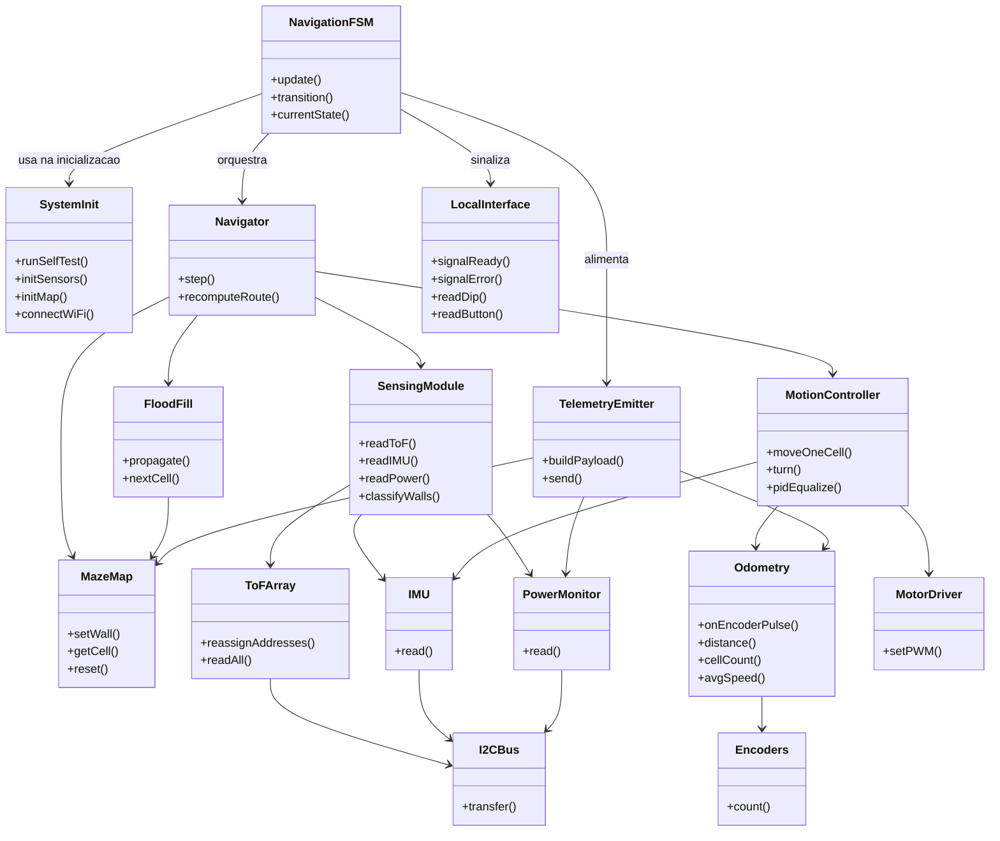
```mermaid
classDiagram
  class SystemInit {
    +runSelfTest()
    +initSensors()
    +initMap()
    +connectWiFi()
  }
  class NavigationFSM {
    +update()
    +transition()
    +currentState()
  }
  class Navigator {
    +step()
    +recomputeRoute()
  }
  class SensingModule {
    +readToF()
    +readIMU()
    +readPower()
    +classifyWalls()
  }
  class MazeMap {
    +setWall()
    +getCell()
    +reset()
  }
  class FloodFill {
    +propagate()
    +nextCell()
  }
  class MotionController {
    +moveOneCell()
    +turn()
    +pidEqualize()
  }
  class Odometry {
    +onEncoderPulse()
    +distance()
    +cellCount()
    +avgSpeed()
  }
  class TelemetryEmitter {
    +buildPayload()
    +send()
  }
  class ToFArray {
    +reassignAddresses()
    +readAll()
  }
  class IMU {
    +read()
  }
  class PowerMonitor {
    +read()
  }
  class MotorDriver {
    +setPWM()
  }
  class Encoders {
    +count()
  }
  class LocalInterface {
    +signalReady()
    +signalError()
    +readDip()
    +readButton()
  }
  class I2CBus {
    +transfer()
  }

  NavigationFSM --> SystemInit : usa na inicializacao
  NavigationFSM --> Navigator : orquestra
  NavigationFSM --> TelemetryEmitter : alimenta
  NavigationFSM --> LocalInterface : sinaliza
  Navigator --> SensingModule
  Navigator --> MazeMap
  Navigator --> FloodFill
  Navigator --> MotionController
  FloodFill --> MazeMap
  SensingModule --> ToFArray
  SensingModule --> IMU
  SensingModule --> PowerMonitor
  MotionController --> MotorDriver
  MotionController --> Odometry
  MotionController --> IMU
  Odometry --> Encoders
  ToFArray --> I2CBus
  IMU --> I2CBus
  PowerMonitor --> I2CBus
  TelemetryEmitter --> Odometry
  TelemetryEmitter --> PowerMonitor
  TelemetryEmitter --> MazeMap
```

**Responsabilidades e rastreabilidade:**

| Módulo                                                                               | Responsabilidade                                                                             | RF                   |
| :----------------------------------------------------------------------------------- | :------------------------------------------------------------------------------------------- | :------------------- |
| SystemInit                                                                           | Auto-teste, reendereçamento ToF, verificação IMU/INA219, leitura do DIP, mapa inicial, Wi-Fi | RF-27 a RF-31, RF-51 |
| NavigationFSM                                                                        | Máquina de estados; sinalização de prontidão/erro                                            | RF-32, RF-54, RF-55  |
| SensingModule                                                                        | Leitura dos ToF/IMU/INA219 e classificação de paredes                                        | RF-33 a RF-36        |
| MazeMap                                                                              | Estado do mapa e paredes (bidirecional)                                                      | RF-31, RF-37         |
| FloodFill                                                                            | Propagação de valores e escolha da próxima célula                                            | RF-38, RF-39, RF-40  |
| Navigator                                                                            | Orquestra o ciclo de navegação e o recálculo de rota                                         | RF-40, RF-41         |
| MotionController                                                                     | PWM, PID, correção de trajetória, curvas                                                     | RF-42 a RF-46        |
| Odometry                                                                             | Pulsos -> distância, células, velocidade média                                               | RF-47 a RF-50        |
| TelemetryEmitter                                                                     | Monta e envia a carga útil (emissor unidirecional)                                           | RF-52, RF-53         |
| Drivers (ToFArray, IMU, PowerMonitor, MotorDriver, Encoders, LocalInterface, I2CBus) | Acesso ao hardware                                                                           | -                    |

#### 3. Visão de Processos

O ESP32 é _dual-core_ e roda FreeRTOS. O firmware separa **duas tarefas** e as **interrupções de encoder**, para garantir tempo real na navegação e o **isolamento entre navegação e telemetria** (RNF-33): a telemetria apenas **lê** o estado compartilhado e **envia**, nunca bloqueando ou influenciando a navegação.

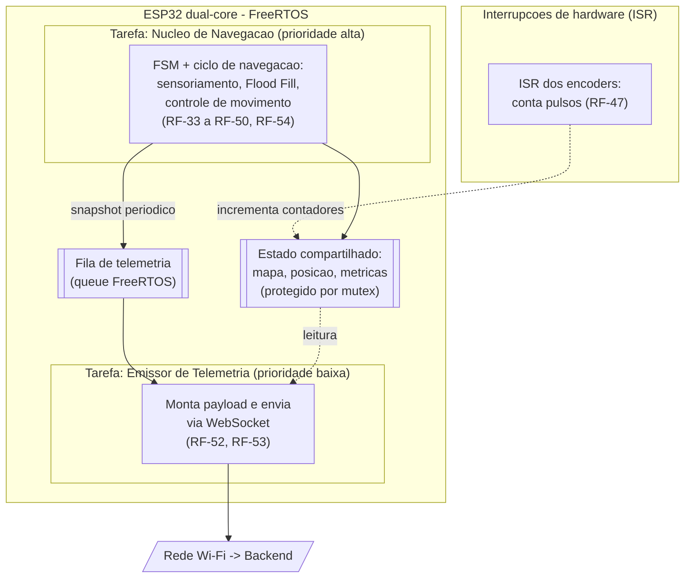
```mermaid
flowchart TB
  subgraph ISR["Interrupcoes de hardware (ISR)"]
    isrE["ISR dos encoders:<br/>conta pulsos (RF-47)"]
  end

  subgraph CORE["ESP32 dual-core - FreeRTOS"]
    subgraph TN["Tarefa: Nucleo de Navegacao (prioridade alta)"]
      tn1["FSM + ciclo de navegacao:<br/>sensoriamento, Flood Fill,<br/>controle de movimento<br/>(RF-33 a RF-50, RF-54)"]
    end
    subgraph TT["Tarefa: Emissor de Telemetria (prioridade baixa)"]
      tt1["Monta payload e envia<br/>via WebSocket<br/>(RF-52, RF-53)"]
    end
    q1[["Fila de telemetria<br/>(queue FreeRTOS)"]]
    st[["Estado compartilhado:<br/>mapa, posicao, metricas<br/>(protegido por mutex)"]]
  end

  wifi[/"Rede Wi-Fi -> Backend"/]

  isrE -. incrementa contadores .-> st
  tn1 --> st
  tn1 -->|snapshot periodico| q1
  q1 --> tt1
  st -. leitura .-> tt1
  tt1 --> wifi
```

**Características dos processos:**

- **Núcleo de Navegação (alta prioridade):** executa a FSM e o ciclo de sensoriamento -> mapeamento -> Flood Fill -> movimento em cadência determinística. É o caminho crítico de tempo real.
- **Emissor de Telemetria (baixa prioridade):** consome _snapshots_ de uma fila e lê o estado compartilhado para montar e enviar a carga útil. Se o Wi-Fi cair, esta tarefa apenas acumula/descarta sem afetar a navegação (RNF-33); a telemetria retoma sozinha ao reconectar.
- **ISR dos encoders:** rotinas de interrupção contam pulsos sem perda mesmo em alta velocidade (RF-47), atualizando contadores no estado compartilhado.
- **Sincronização:** _queue_ FreeRTOS para os _snapshots_ e _mutex_ para o estado compartilhado, evitando condição de corrida entre as tarefas e a ISR.

#### 4. Visão de Implementação

A visão de implementação mostra a organização física do código no repositório (projeto PlatformIO), os módulos-fonte e as dependências externas.

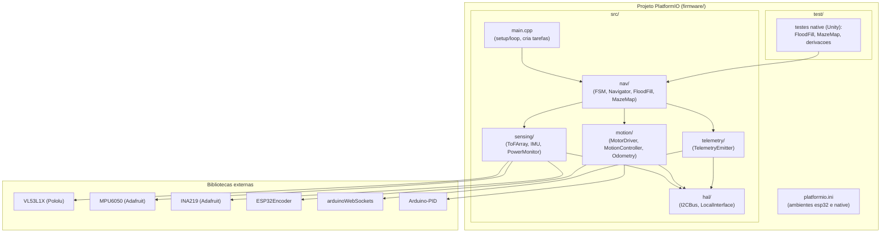
```mermaid
flowchart TB
  subgraph REPO["Projeto PlatformIO (firmware/)"]
    ini["platformio.ini<br/>(ambientes esp32 e native)"]
    subgraph SRC["src/"]
      main["main.cpp<br/>(setup/loop, cria tarefas)"]
      appnav["nav/<br/>(FSM, Navigator, FloodFill, MazeMap)"]
      sense["sensing/<br/>(ToFArray, IMU, PowerMonitor)"]
      motion["motion/<br/>(MotorDriver, MotionController, Odometry)"]
      telem["telemetry/<br/>(TelemetryEmitter)"]
      hal["hal/<br/>(I2CBus, LocalInterface)"]
    end
    subgraph TEST["test/"]
      ut["testes native (Unity):<br/>FloodFill, MazeMap, derivacoes"]
    end
  end

  subgraph LIBS["Bibliotecas externas"]
    l1["VL53L1X (Pololu)"]
    l2["MPU6050 (Adafruit)"]
    l3["INA219 (Adafruit)"]
    l4["ESP32Encoder"]
    l5["arduinoWebSockets"]
    l6["Arduino-PID"]
  end

  main --> appnav
  appnav --> sense
  appnav --> motion
  appnav --> telem
  sense --> hal
  motion --> hal
  telem --> hal
  sense --> l1
  sense --> l2
  sense --> l3
  motion --> l4
  motion --> l6
  telem --> l5
  ut --> appnav
```

**Organização e build:**

- **`platformio.ini`** define dois ambientes: **`esp32`** (build/upload para a placa) e **`native`** (testes de lógica no PC, sem hardware).
- **`src/`** agrupa os módulos por responsabilidade (espelhando a visão lógica), com a camada `hal/` isolando o acesso ao hardware - o que permite testar `nav/` (Flood Fill, mapa) no ambiente _native_.
- **`test/`** contém os testes automatizados (Unity), executáveis via `pio test -e native`, alinhados aos casos CT-FW-12, CT-FW-13 e CT-FW-32 do roteiro de testes (`4.4.6`).
- **Dependências** são declaradas no `platformio.ini` (`lib_deps`) e resolvidas pelo gerenciador do PlatformIO.

#### 5. Rastreabilidade (visão -> requisitos)

| Visão                                  | Requisitos que fundamentam                    |
| :------------------------------------- | :-------------------------------------------- |
| Lógica (decomposição em módulos)       | RF-27 a RF-56 (mapeados na tabela da seção 2) |
| Processos (tarefas + ISR + isolamento) | RF-47, RF-52, RF-53, RF-54, RNF-33            |
| Implementação (estrutura e testes)     | RNF-53 (testabilidade), decisões do `4.4.5`   |

#### 6. Observações para a integração (atividade 3.5)

- Estas visões conectam-se ao restante do sistema por um único ponto: o **TelemetryEmitter** envia, via WebSocket, para o **backend**.
- A **visão de dados** (3.3) não se aplica ao firmware (estado em memória, sem banco); o firmware apenas **produz** a carga útil que o backend persiste.

<a id="be_arq--arquitetura-do-backend--visões-e-modelo-de-dados"></a>
### 3.3 Arquitetura do Backend — Visões e Modelo de Dados

**Versão:** 1.1 — alinhada ao Guia da Equipe de Software (21/09/2026)
**Issue:** [#253 — 3.3 Visões do backend + modelo de dados (MER + DER)](https://github.com/fcte-pi1/2026.2_PI1_Grupo1_Diogo/issues/253)
**Escopo:** arquitetura do backend no modelo 4+1 adaptado pela disciplina (visões lógica, de processos, de implementação e de dados). A visão de implantação do sistema completo fica na [#255](https://github.com/fcte-pi1/2026.2_PI1_Grupo1_Diogo/issues/255). A seção [Implantação](#be_arq--6-implantação-contribuição-para-a-255) traz apenas a parte do backend.

**Rastreabilidade:** RF-72 a RF-98, RNF-48 a RNF-58 e as histórias [HU-BE-01 a HU-BE-27](#be_hu--histórias-de-usuário--backend).

---

#### 1. Propósito do backend

O backend é o **ponto central de verdade** do sistema web do Micromouse. Ele:

1. **Recebe** a telemetria do robô (ou do simulador) por WebSocket, autentica a fonte e valida cada mensagem.
2. **Persiste** tudo o que foi aceito, de forma durável, idempotente e sem lacunas, mesmo com quedas de Wi-Fi.
3. **Deriva** as métricas oficiais da corrida (tempo, velocidade média, trajeto, energia e status), usando sempre o relógio do robô.
4. **Distribui** o estado ao vivo aos painéis com volume e ordem controlados.
5. **Expõe** histórico, replay, ranking, anulação e exportação por uma API HTTP.

O backend **não** controla o robô. Toda decisão de navegação é do firmware, e o robô é um **emissor unidirecional** (ver 2.1).

#### 2. Decisões de arquitetura

<a id="be_arq--21-decisões-herdadas-do-tap-e-dos-requisitos"></a>
##### 2.1 Decisões herdadas do TAP e dos requisitos

Estas decisões vêm do TAP e dos requisitos aprovados. Conforme o *Guia da Equipe de Software* (§4), elas não são reabertas aqui, apenas documentadas e justificadas na forma como o backend as atende.

| Decisão herdada | Como o backend a atende |
|:--|:--|
| **Wi-Fi em modo estação (STA)** | O robô é cliente da rede local e abre a conexão com o backend. O backend só escuta: nunca inicia conexão com o robô. |
| **WebSocket, com o robô como emissor unidirecional** | O protocolo **não exige que o robô processe nenhuma mensagem de aplicação**. A autenticação (RF-72) usa o `hello`, que o robô *envia*: se falhar, o backend simplesmente fecha a conexão (código 4001/4002). O `ack` do RF-74 é enviado, mas é **informativo**: a integridade após quedas (RNF-50) é garantida pela idempotência do backend (RF-77) somada ao reenvio do buffer retido pelo robô ao reconectar, que também é só emissão. O ping/pong do heartbeat (RF-73) é um *frame* de controle respondido automaticamente pela pilha WebSocket do ESP32, sem lógica de aplicação. |
| **Rede local isolada, sem dependências externas** | Backend e banco rodam em contêineres no notebook do operador. Nenhuma chamada sai da rede local, e todas as bibliotecas ficam empacotadas na imagem. |
| **Seis campos obrigatórios da telemetria** | Tipo de labirinto → `inicio_corrida.labirinto`. Trajeto → derivado das mensagens `celula` (RF-84). Consumo de bateria → mensagens `energia` e métricas do RF-85. Velocidade média → RF-83. Tempo → relógio do robô (RF-82). Desafio cumprido → status `CONCLUIDA` (RF-87). |
| **Consultar um labirinto específico ou todos** | Filtro `tipo` opcional em `GET /api/corridas` (RF-93) e ranking por `labirinto` (RF-95), com índice por `tipo_labirinto` (seção 7.3). |

> **Premissa de interface com o firmware:** para que não haja lacunas após uma queda (critério do RF-74), o robô precisa manter um buffer circular com pelo menos 60 s de mensagens e reenviá-lo inteiro ao reconectar. Isso é compatível com a emissão unidirecional. Se o robô não reenviar, o backend continua sem duplicatas e **sinaliza** a lacuna em `corrida.seqs_faltantes`, o que atende ao RNF-50 ("0 lacunas não sinalizadas").

##### 2.2 Padrão: monólito modular orientado a eventos, em camadas

Um único processo Node.js, dividido em módulos com fronteiras explícitas (ingestão, corrida, derivação, distribuição e consulta) e organizado em camadas (**adaptadores → aplicação → domínio**, com a **infraestrutura** implementando as portas). Os módulos se comunicam por um barramento de eventos em memória.

| Alternativa | Por que não foi adotada |
|:--|:--|
| Microsserviços | Um robô, até 10 painéis e uma rede local não justificam a complexidade operacional. Haveria mais saltos de rede (pior para o RNF-48) e subir o sistema com um comando em 2 min (RNF-58) ficaria mais difícil. |
| MVC clássico | Atende bem à API REST, mas não modela o fluxo contínuo de telemetria, o estado vivo por corrida nem a distribuição em tempo real. |
| Monólito sem módulos | Mistura regras de domínio com I/O e prejudica o RNF-53 (≥ 80 % de cobertura nos módulos de validação e derivação). |

**Por que isso funciona aqui:** com um processo único, o estado vivo de cada corrida fica em memória e é atualizado de forma serial pelo *event loop*. Isso resolve de graça a consistência do snapshot para quem entra no meio da corrida (RF-89): o corte e a inscrição acontecem no mesmo *tick*, sem locks. Como o domínio é puro (sem I/O), validação e derivação podem ser testadas de forma unitária.

##### 2.3 Stack

| Camada | Escolha | Situação | Justificativa |
|:--|:--|:--|:--|
| Runtime | **Node.js 22 LTS** | Decidido pelo time | I/O assíncrono não bloqueante, adequado a muitas conexões WebSocket de baixo volume. O simulador em Node (RNF-53) compartilha o código do protocolo. |
| Linguagem | TypeScript | Proposta | Tipos do protocolo e do domínio compartilhados entre backend, simulador e frontend. |
| HTTP | Fastify | Proposta | Baixo overhead, validação por JSON Schema nativa e logs com pino integrados. |
| WebSocket | `ws` (via `@fastify/websocket`) | Proposta | Expõe `bufferedAmount` (necessário ao RF-91) e ping/pong nativo (RF-73). |
| Validação do protocolo | Ajv (JSON Schema 2020-12) | Proposta | Esquemas compilados uma vez, validação rápida e esquema publicável no repositório (RNF-57). |
| Banco de dados | **PostgreSQL 16** | Escolhido pela frente de backend | Relacional com transações ACID, `ON CONFLICT` para idempotência, `JSONB` para o *payload* bruto, *triggers* para imutabilidade e *window functions* para o ranking. |
| Acesso a dados | `pg` (node-postgres) + SQL explícito | Proposta | Controle total sobre `INSERT` em lote e `ON CONFLICT`, sem ORM escondendo o SQL. |
| Migrações | node-pg-migrate | Proposta | Migrações em SQL versionadas junto ao código. |
| Logs | pino (JSON) | Proposta | Logs estruturados com `corrida` e `seq` (RNF-56). |
| Testes | Vitest + Testcontainers (PostgreSQL) | Proposta | Unitário no domínio e integração com banco real. |
| Implantação | Docker Compose | Proposta | `docker compose up` sobe backend e banco com um único comando (RNF-58). |

> A formalização da stack é da [#251](https://github.com/fcte-pi1/2026.2_PI1_Grupo1_Diogo/issues/251). Os itens marcados como "Proposta" são a recomendação da frente de backend.

##### 2.4 Banco de dados: relacional (PostgreSQL) × não relacional (MongoDB)

O guia pede que a escolha seja justificada frente a três requisitos: *append-only*, *snapshots* e consultas por labirinto. A comparação considera também idempotência e imutabilidade, que são as garantias mais críticas do backend.

| Requisito | PostgreSQL (relacional) | MongoDB (documentos) |
|:--|:--|:--|
| **Append-only** (RF-79) | *Trigger* `BEFORE UPDATE OR DELETE` que aborta a operação, mais permissão apenas de `INSERT`/`SELECT` para o usuário da aplicação. A garantia fica **no banco**, não só no código. | Não há *trigger* síncrono que bloqueie `update`/`delete`. A garantia depende de papéis customizados e da disciplina do código. |
| **Idempotência** (RF-77, RNF-50) | Chave primária composta `(corrida_id, seq)` + `INSERT … ON CONFLICT DO NOTHING` em lote: atômico e sem leitura prévia. | Índice único composto + `insertMany({ordered:false})`, tratando o erro 11000 como duplicata. Funciona, mas com o tratamento de erro espalhado pelo código. |
| **Snapshots** (RF-80, RNF-52) | Tabela `snapshot_mapa` com o estado em `JSONB`: a flexibilidade de documento dentro do modelo relacional, com FK para a corrida e unicidade `(corrida, seq_corte)`. | Natural: o snapshot já é um documento. |
| **Consultas por labirinto** e ranking (RF-93, RF-95) | Índice `(tipo_labirinto, status, iniciada_em)`, `RANK() OVER (PARTITION BY tipo_labirinto …)` e `LEFT JOIN anulacao`: uma *view* de poucas linhas. | *Aggregation pipeline* com `$setWindowFields` e `$lookup` para excluir anuladas: possível, porém mais verboso. |
| **Imutabilidade da corrida finalizada** (RNF-54) | *Trigger* que recusa `UPDATE`/`DELETE` quando o status é `CONCLUIDA` ou `FALHOU`. | Só na aplicação. |
| **Integridade entre entidades** | Chaves estrangeiras (corrida ↔ mensagem ↔ passagem, anulação ↔ operador). | Referências manuais, sem integridade garantida. |

**Conclusão:** os dados do projeto são fortemente relacionais (corrida → mensagens → projeções; anulação → operador) e as garantias críticas (append-only, idempotência e imutabilidade) podem ser impostas **pelo próprio banco**. O único ponto em que o modelo de documentos seria mais natural, o snapshot, é resolvido com `JSONB`. Por isso a escolha é o **PostgreSQL**, e a persistência é documentada por MER e DER (seção 7).

<a id="be_arq--25-protocolo-de-telemetria-v1-proposta"></a>
##### 2.5 Protocolo de telemetria v1 (proposta)

Todas as mensagens são JSON sobre WebSocket. O esquema oficial será publicado em `src/backend/protocolo/v1/` (RNF-57), e o backend aceita a versão atual e a anterior.

**Robô → Backend** (`/ws/telemetria`)

| `tipo` | Campos (além do envelope) | Descrição |
|:--|:--|:--|
| `hello` | `dispositivo`, `token`, `boot` | Identificação. É a primeira mensagem da conexão e não tem `seq`. `boot` é um valor aleatório gerado a cada boot do ESP32. |
| `inicio_corrida` | `labirinto` ∈ {`4x4`,`8x4`,`12x4`} | Início da tentativa. |
| `celula` | `x`, `y`, `paredes` {`n`,`l`,`s`,`o`: bool} | Célula visitada com as paredes detectadas (evento **discreto**). |
| `posicao` | `x`, `y`, `orientacao`, `celulas` | Posição atual e contador de células (dado **contínuo**). |
| `energia` | `tensao_v`, `corrente_a`, `potencia_w` | Leitura do INA219 (dado **contínuo**). |
| `estado` | `estado` ∈ {Inicializando, Aguardando, Mapeando, Resolvendo, Concluído, Erro} | Estado de navegação (evento **discreto**). |
| `fim_corrida` | `resultado` ∈ {`sucesso`,`falha`}, `detalhe?` | Fim da tentativa. |

**Envelope comum** (exceto `hello`): `{ "v": 1, "tipo": "...", "corrida": "<id gerado pelo robô>", "seq": <int ≥ 1 por corrida>, "t": <ms no relógio do robô> }`

**Backend → Robô:** `ack { corrida, seq }` (informativo: o robô **não é obrigado a processá-lo**) · *ping* (frame de controle do WebSocket, respondido pela pilha de rede do ESP32) · fechamento da conexão com código `4001` (token inválido) ou `4002` (versão não suportada). Nenhuma resposta de aplicação é exigida do robô.

**Painel ↔ Backend** (`/ws/painel`, somente leitura — RNF-55)

| Direção | `tipo` | Conteúdo |
|:--|:--|:--|
| Painel → | `inscrever` / `cancelar` | `{ corrida }`, ou `{ canal: "ao_vivo" }` |
| → Painel | `snapshot` | `{ corrida, seq_corte, mapa, posicao, metricas, status }` |
| → Painel | `evento` | Evento discreto: `celula` ou `status`, com `seq` |
| → Painel | `continuo` | Última posição e energia (no máximo 10/s por corrida) |
| → Painel | `sinal` | `{ corrida, estado: PERDIDO \| RETOMADO }` |
| → Painel | `alerta` | `{ corrida, tipo: TENSAO_BAIXA, tensao_v }` |
| → Painel | `ao_vivo` | Resumo de início, fim e status de qualquer corrida |
| → Painel | `leaderboard` | `{ labirinto }` — sinaliza que o ranking mudou |

**API HTTP**

| Método e rota | Uso | Autenticação | RF |
|:--|:--|:--|:--|
| `GET /api/corridas?tipo&status&de&ate&pagina&tamanho` | Listagem | — | RF-93 |
| `GET /api/corridas/{id}` | Detalhe (métricas, trajeto, energia, anulação) | — | RF-84, RF-85 |
| `GET /api/corridas/{id}/linha-do-tempo` | Replay em *stream* NDJSON | — | RF-94 |
| `GET /api/leaderboard?labirinto&apresentacao` | Ranking | — | RF-95 |
| `GET /api/corridas/{id}/exportacao?formato=json\|csv` | Exportação | — | RF-98 |
| `POST /api/corridas/{id}/anulacao` | Anular com motivo | Operador (JWT) | RF-96 |
| `POST /api/apresentacoes` / `PATCH /api/apresentacoes/{id}` | Abrir ou encerrar apresentação | Operador (JWT) | RF-97 |
| `POST /api/auth/login` | Login do operador | — | RNF-55 |
| `GET /health` | Saúde, contadores e atraso do *event loop* | — | RNF-56 |

---

#### 3. Visão lógica

##### 3.1 Módulos e dependências


<sub>Fonte editável: [`diagramas/arq-01-modulos.puml`](software/backend/diagramas/arq-01-modulos.puml)</sub>

| Módulo | Responsabilidade | RF/RNF |
|:--|:--|:--|
| GatewayTelemetria | Conexão do robô, `hello`, *parse*, envio de `ack` | RF-72, RF-74 |
| MonitorHeartbeat | Ping a cada 1 s, perda após 3 s, interrupção após 120 s | RF-73, RF-81 |
| ServicoIngestao | Orquestra validação → idempotência → gravação → aplicação ao estado | RF-75 a RF-79 |
| ServicoCorrida | Criação idempotente, numeração de tentativas, status, snapshots | RF-78, RF-80, RF-81, RF-87, RF-97 |
| Derivação (domínio) | Tempo, velocidade, trajeto, energia, alerta | RF-82 a RF-86 |
| ServicoDistribuicao | Inscrições, snapshot de entrada, *throttle*, sinal | RF-88 a RF-92 |
| ControleFluxo | `bufferedAmount` > 1 MB → descarta contínuos; 10 s → desconecta | RF-91 |
| ServicoConsulta | Listagem, replay, ranking, exportação em *stream* | RF-93 a RF-95, RF-98 |
| ServicoAnulacao | Anulação autenticada, auditável | RF-96, RNF-54 |

##### 3.2 Modelo de domínio



<sub>Fonte editável: [`diagramas/arq-02-modelo-dominio.mmd`](software/backend/diagramas/arq-02-modelo-dominio.mmd)</sub>

**Máquina de status da corrida (RF-81, RF-87, RNF-54):**



<sub>Fonte editável: [`diagramas/arq-03-status-corrida.mmd`](software/backend/diagramas/arq-03-status-corrida.mmd)</sub>

> Só uma corrida `INTERROMPIDA` por `SEM_SINAL` aceita lote tardio. Uma interrompida por `REINICIO_ROBO` é definitiva, porque o robô que reiniciou perdeu o buffer.

---

#### 4. Visão de processos

##### 4.1 Modelo de concorrência

- **Processo único, uma thread de *event loop*.** Todo o estado vivo (corridas, inscrições, janelas de `seq`) é acessado só por essa thread, então não há *race conditions* em memória. A concorrência entre conexões e com o banco é assíncrona.
- **Nada bloqueia o loop (RNF-49):** os esquemas Ajv são compilados na inicialização; a gravação é feita em lotes assíncronos; replay e exportação usam *streams* com cursor do banco; nenhum trabalho de CPU passa de alguns milissegundos. O atraso do loop é medido com `perf_hooks.monitorEventLoopDelay` e exposto em `/health`.
- **Temporizadores:**

| Timer | Período | Função | RF |
|:--|:--|:--|:--|
| Heartbeat | 1 s por conexão de robô | Ping e verificação de silêncio de 3 s | RF-73 |
| Flush do lote | ≤ 10 ms ou 50 mensagens | Transação de `INSERT` em lote | RF-79 |
| Flush de contínuos | 100 ms por corrida | Envia a última posição e energia (≤ 10/s) | RF-90 |
| Interrupção por silêncio | 120 s após a perda | Marca `INTERROMPIDA (SEM_SINAL)` | RF-81 |
| Verificação de *backpressure* | 1 s por painel | `bufferedAmount` > 1 MB por 10 s → desconecta | RF-91 |

- **Ordem garantida:** eventos discretos são aplicados e distribuídos em ordem de `seq` contíguo. Mensagens que chegam depois de uma lacuna ficam persistidas, mas só são aplicadas ao estado quando a lacuna é preenchida. Se a corrida termina com lacuna, ela é registrada em `corrida.seqs_faltantes` ("lacuna sinalizada", RNF-50).

##### 4.2 Ingestão, persistência, confirmação e distribuição

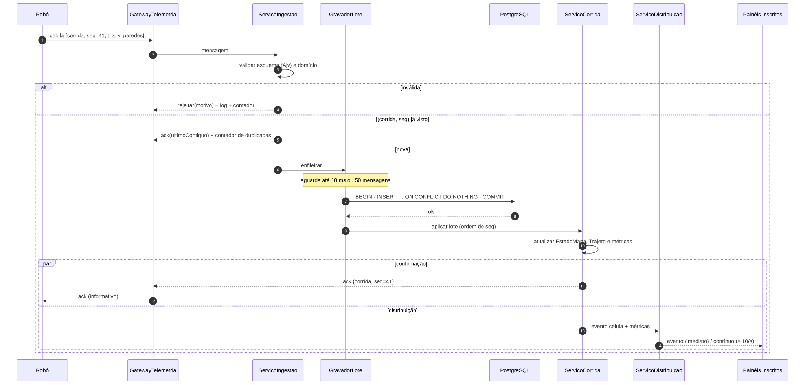

<sub>Fonte editável: [`diagramas/arq-04-seq-ingestao.mmd`](software/backend/diagramas/arq-04-seq-ingestao.mmd)</sub>

##### 4.3 Queda de conexão e reenvio (RF-74, RF-77, RNF-50)

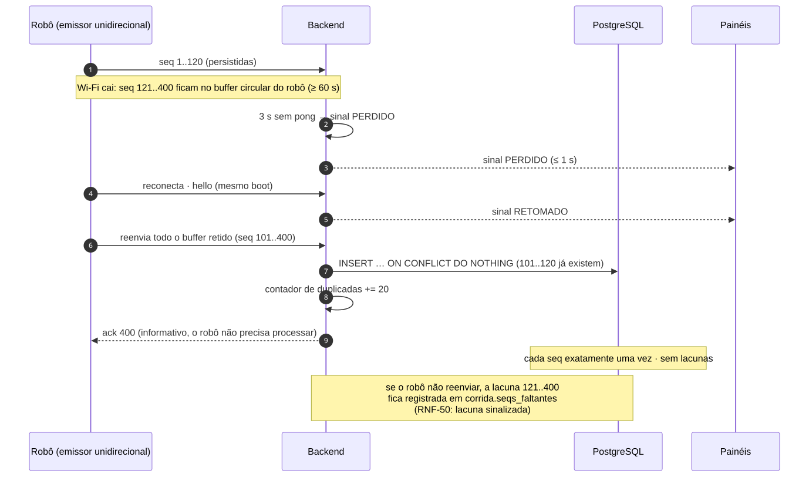

<sub>Fonte editável: [`diagramas/arq-05-seq-queda-reenvio.mmd`](software/backend/diagramas/arq-05-seq-queda-reenvio.mmd)</sub>

##### 4.4 Painel que entra no meio da corrida (RF-89)

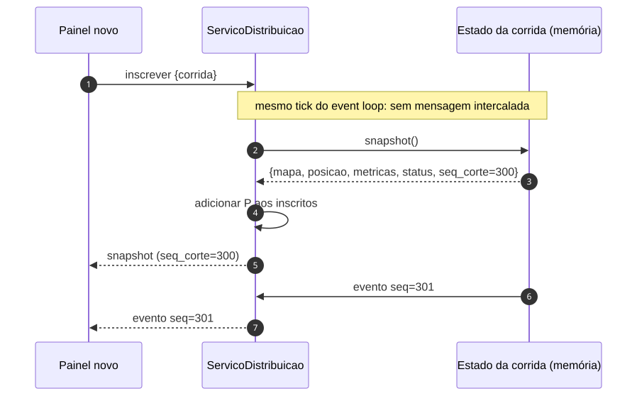

<sub>Fonte editável: [`diagramas/arq-06-seq-inscricao-meio.mmd`](software/backend/diagramas/arq-06-seq-inscricao-meio.mmd)</sub>

##### 4.5 Recuperação após reinício do backend (RNF-52)

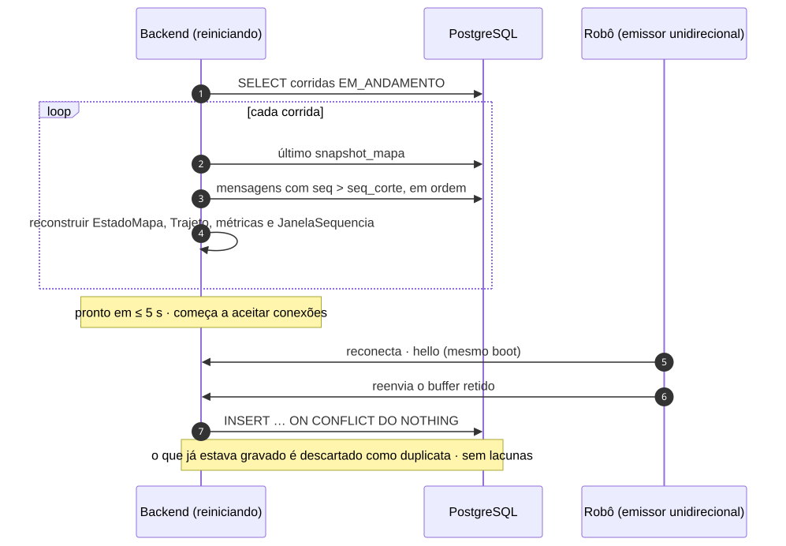

<sub>Fonte editável: [`diagramas/arq-07-seq-recuperacao.mmd`](software/backend/diagramas/arq-07-seq-recuperacao.mmd)</sub>

##### 4.6 Fim da corrida e ranking (RF-82, RF-87, RF-95)

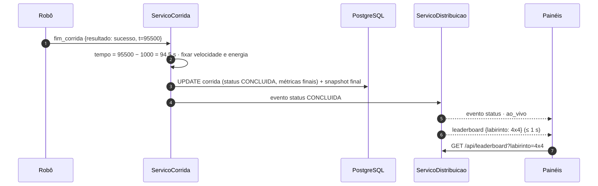

<sub>Fonte editável: [`diagramas/arq-08-seq-fim-corrida.mmd`](software/backend/diagramas/arq-08-seq-fim-corrida.mmd)</sub>

---

#### 5. Visão de implementação

```text
src/backend/
├── package.json · tsconfig.json · Dockerfile · docker-compose.yml · .env.example
├── protocolo/
│   ├── v1/                      # esquemas JSON publicados (RNF-57)
│   └── tipos.ts                 # tipos gerados, compartilhados com simulador e frontend
├── migracoes/                   # SQL versionado (node-pg-migrate)
├── src/
│   ├── main.ts                  # composição da aplicação (injeção manual de dependências)
│   ├── config/                  # variáveis de ambiente, curva de carga, limiares
│   ├── adaptadores/
│   │   ├── ws-telemetria/       # GatewayTelemetria, MonitorHeartbeat
│   │   ├── ws-painel/           # GatewayPainel, ControleFluxo
│   │   └── http/                # rotas, autenticação JWT, /health
│   ├── aplicacao/               # ServicoIngestao, ServicoCorrida, ServicoDistribuicao, ServicoConsulta, ServicoAnulacao
│   ├── dominio/                 # Corrida, EstadoMapa, Trajeto, Metricas, SerieEnergia, JanelaSequencia, validação de domínio
│   └── infra/                   # repositórios pg, GravadorLote, BarramentoEventos, logger, contadores
├── simulador/                   # simulador de robô em Node, mesmo protocolo (RNF-53)
└── testes/
    ├── unit/                    # domínio (meta de cobertura ≥ 80 %)
    ├── integracao/              # PostgreSQL real via Testcontainers
    └── e2e/                     # simulador → backend → cliente WebSocket de painel
```

**Regras de dependência:**

- `dominio/` não importa nada de fora dele (nem `pg`, nem `ws`, nem `fastify`).
- `aplicacao/` depende de `dominio/` e de interfaces (portas) de repositório e publicação.
- `adaptadores/` e `infra/` implementam essas portas.
- Essas regras são verificadas no CI com `dependency-cruiser`.

---

<a id="be_arq--6-implantação-contribuição-para-a-255"></a>
#### 6. Implantação (contribuição para a #255)



<sub>Fonte editável: [`diagramas/arq-09-implantacao.mmd`](software/backend/diagramas/arq-09-implantacao.mmd)</sub>

`docker compose up` sobe o banco, aplica as migrações e inicia o backend (RNF-58: ≤ 2 min num notebook limpo com as imagens já baixadas). Os segredos (token dos dispositivos, senha do operador, chave JWT) vêm de `.env`, que nunca é versionado.

---

<a id="be_arq--7-visão-de-dados"></a>
#### 7. Visão de dados

##### 7.1 Modelo Entidade-Relacionamento (MER)

**Entidades**

| Entidade | Descrição | Atributos principais |
|:--|:--|:--|
| **DISPOSITIVO** | Fonte de telemetria autorizada (robô ou simulador) | <u>id</u>, identificador (único), nome, token_hash, ativo |
| **OPERADOR** | Usuário com permissão de escrita | <u>id</u>, login (único), nome, senha_hash |
| **APRESENTACAO** | Sessão de apresentação que agrupa as tentativas | <u>id</u>, nome, data, ativa |
| **CORRIDA** | Uma tentativa de resolução do labirinto | <u>id</u>, id_corrida_robo, boot, tipo_labirinto, numero_tentativa, status, motivo_termino, tempos do robô, métricas finais, ultimo_seq_contiguo, seqs_faltantes |
| **MENSAGEM** | Registro *append-only* de cada mensagem aceita (entidade fraca de CORRIDA) | <u>corrida_id + seq</u>, tipo, t_robo_ms, versao_protocolo, payload, recebida_em |
| **PASSAGEM_CELULA** | Projeção de MENSAGEM do tipo `celula`: o trajeto | <u>corrida_id + seq</u>, ordem, x, y, paredes, revisita |
| **LEITURA_ENERGIA** | Projeção de MENSAGEM do tipo `energia`: a série de energia | <u>corrida_id + seq</u>, tensao_v, corrente_a, potencia_w |
| **SNAPSHOT_MAPA** | Estado completo do mapa num `seq` de corte | <u>id</u>, seq_corte, celulas_visitadas, estado |
| **ANULACAO** | Anulação auditável de uma corrida finalizada | <u>corrida_id</u>, motivo, anulada_em |
| **EVENTO_CONEXAO** | Histórico de conexão, perda, retomada e reinício | <u>id</u>, tipo, boot, ocorrido_em |
| **MENSAGEM_REJEITADA** | Auditoria das mensagens rejeitadas | <u>id</u>, motivo_codigo, detalhe, payload, recebida_em |

**Relacionamentos**

| Relacionamento | Cardinalidade | Regra |
|:--|:--|:--|
| DISPOSITIVO *executa* CORRIDA | 1 : 0..N | O par (dispositivo, id_corrida_robo) é único (RF-78) |
| APRESENTACAO *agrupa* CORRIDA | 0..1 : 0..N | Corridas de teste podem ficar fora de apresentação; (apresentação, tipo, nº de tentativa) é único (RF-97) |
| CORRIDA *registra* MENSAGEM | 1 : 0..N | Chave (corrida, seq): idempotência (RF-77) |
| MENSAGEM *origina* PASSAGEM_CELULA | 1 : 0..1 | Só para `tipo = celula` |
| MENSAGEM *origina* LEITURA_ENERGIA | 1 : 0..1 | Só para `tipo = energia` |
| CORRIDA *possui* SNAPSHOT_MAPA | 1 : 0..N | Um a cada 20 células e um final (RF-80) |
| CORRIDA *sofre* ANULACAO | 1 : 0..1 | No máximo uma anulação por corrida (RF-96) |
| OPERADOR *realiza* ANULACAO | 1 : 0..N | Autor da anulação (RNF-54) |
| DISPOSITIVO *gera* EVENTO_CONEXAO | 1 : 0..N | — |
| CORRIDA *afetada por* EVENTO_CONEXAO | 0..1 : 0..N | Perda ou reinício durante a corrida |
| DISPOSITIVO *envia* MENSAGEM_REJEITADA | 0..1 : 0..N | Nulo quando a rejeição é anterior à autenticação |

**Decisões de modelagem**

- **Anulação em tabela separada:** a linha de uma `corrida` finalizada **nunca** é alterada (RNF-54). Anular é *inserir* em `anulacao`. O ranking exclui as corridas com anulação.
- **`mensagem` é a fonte da verdade:** `passagem_celula`, `leitura_energia`, `snapshot_mapa` e as métricas de `corrida` são **projeções** que podem ser reconstruídas a partir dela. Elas existem para consultas rápidas (RNF-43) e para a recuperação (RNF-52).
- **O relógio do robô é o oficial:** `t_robo_ms` é usado nos cálculos (RF-82). `recebida_em`, do servidor, serve só para auditoria e latência.
- **Valores de enumeração em ASCII no banco** (`CONCLUIDA`). A acentuação (`CONCLUÍDA`) fica só na apresentação.

##### 7.2 Diagrama Entidade-Relacionamento (DER — PostgreSQL)



<sub>Fonte editável: [`diagramas/arq-10-der.mmd`](software/backend/diagramas/arq-10-der.mmd)</sub>

**Tipos enumerados**

| Tipo | Valores |
|:--|:--|
| `tipo_labirinto` | `4x4`, `8x4`, `12x4` |
| `status_corrida` | `EM_ANDAMENTO`, `CONCLUIDA`, `FALHOU`, `INTERROMPIDA` |
| `motivo_termino` | `SUCESSO`, `FALHA_REPORTADA`, `SEM_SINAL`, `REINICIO_ROBO` |
| `tipo_mensagem` | `inicio_corrida`, `celula`, `posicao`, `energia`, `estado`, `fim_corrida` |
| `tipo_evento_conexao` | `CONECTADO`, `SINAL_PERDIDO`, `SINAL_RETOMADO`, `DESCONECTADO`, `REINICIO_DETECTADO` |

##### 7.3 Restrições, índices e regras no banco

```sql
-- Idempotência e unicidade (RF-77, RF-78, RF-97)
ALTER TABLE mensagem ADD PRIMARY KEY (corrida_id, seq);
ALTER TABLE corrida  ADD CONSTRAINT uq_corrida_robo      UNIQUE (dispositivo_id, id_corrida_robo);
ALTER TABLE corrida  ADD CONSTRAINT uq_corrida_tentativa UNIQUE (apresentacao_id, tipo_labirinto, numero_tentativa);
CREATE UNIQUE INDEX uq_apresentacao_ativa ON apresentacao (ativa) WHERE ativa;

-- Regras de domínio replicadas no banco como defesa em profundidade (RF-76)
ALTER TABLE leitura_energia ADD CONSTRAINT ck_tensao CHECK (tensao_v BETWEEN 5.0 AND 9.0);
ALTER TABLE anulacao        ADD CONSTRAINT ck_motivo CHECK (length(trim(motivo)) > 0);
ALTER TABLE corrida         ADD COLUMN distancia_m numeric(8,2)
    GENERATED ALWAYS AS (transicoes_celula * 0.18) STORED;

-- Registro append-only (RF-79)
CREATE FUNCTION impedir_alteracao() RETURNS trigger LANGUAGE plpgsql AS $$
BEGIN
  RAISE EXCEPTION 'tabela % é append-only', TG_TABLE_NAME;
END $$;
CREATE TRIGGER tg_mensagem_append_only
  BEFORE UPDATE OR DELETE ON mensagem
  FOR EACH ROW EXECUTE FUNCTION impedir_alteracao();

-- Corrida finalizada é imutável (RNF-54)
CREATE FUNCTION proteger_corrida_finalizada() RETURNS trigger LANGUAGE plpgsql AS $$
BEGIN
  IF TG_OP = 'DELETE' OR OLD.status IN ('CONCLUIDA', 'FALHOU') THEN
    RAISE EXCEPTION 'corrida % não pode ser alterada', OLD.id;
  END IF;
  RETURN NEW;
END $$;
CREATE TRIGGER tg_corrida_imutavel
  BEFORE UPDATE OR DELETE ON corrida
  FOR EACH ROW EXECUTE FUNCTION proteger_corrida_finalizada();

-- Consultas (RF-93, RF-95)
CREATE INDEX ix_corrida_listagem   ON corrida (tipo_labirinto, status, iniciada_em DESC);
CREATE INDEX ix_corrida_leaderboard ON corrida (tipo_labirinto, tempo_conclusao_ms, distancia_m)
  WHERE status = 'CONCLUIDA';

-- Ranking (RF-95): só CONCLUÍDAS e não anuladas; desempate pela menor distância
CREATE VIEW vw_leaderboard AS
SELECT c.tipo_labirinto,
       RANK() OVER (PARTITION BY c.tipo_labirinto
                    ORDER BY c.tempo_conclusao_ms, c.distancia_m) AS posicao,
       c.id AS corrida_id, c.apresentacao_id, c.numero_tentativa,
       c.tempo_conclusao_ms, c.distancia_m, c.velocidade_media_mps, c.encerrada_em
FROM corrida c
LEFT JOIN anulacao a ON a.corrida_id = c.id
WHERE c.status = 'CONCLUIDA' AND a.corrida_id IS NULL;
```

**Permissões:** o usuário de banco da aplicação recebe apenas `INSERT` e `SELECT` em `mensagem` e `anulacao`, como segunda barreira além dos *triggers*.

**Volume estimado:** uma corrida de 10 min a 20 mensagens/s gera cerca de 12 mil linhas em `mensagem` (~3 MB com índices). Mesmo 200 corridas somam menos de 1 GB, bem dentro do que um notebook suporta.

---

#### Pontos em aberto

| # | Ponto | Impacto | Encaminhamento sugerido |
|:--|:--|:--|:--|
| 1 | **Reenvio do buffer retido pelo firmware.** O robô é emissor unidirecional ([RF-53](https://github.com/fcte-pi1/2026.2_PI1_Grupo1_Diogo/issues/133), decisão herdada, ver 2.1). O critério do RF-74 ("sem lacunas após queda de até 60 s") só é atingido se o robô guardar pelo menos 60 s de mensagens e reenviá-las ao reconectar. | Sem o reenvio, o backend continua sem duplicatas e sinaliza as lacunas (atende ao RNF-50), mas o critério "sem lacunas" do RF-74 não é cumprido. | Alinhar com a frente de firmware ([#246](https://github.com/fcte-pi1/2026.2_PI1_Grupo1_Diogo/issues/246)) a inclusão do buffer circular com reenvio ao reconectar. É só emissão, sem conflito com o RF-53. |
| 2 | Curva tensão → carga (RF-85) | Valores da carga estimada | Validar os pontos da curva padrão com a frente de Energia. |
| 3 | Formalização da stack | Frameworks marcados como "Proposta" | Registrar na [#251](https://github.com/fcte-pi1/2026.2_PI1_Grupo1_Diogo/issues/251). |
| 4 | Conteúdo exato do protocolo v1 | Campos das mensagens de telemetria | Alinhar com o [RF-52](https://github.com/fcte-pi1/2026.2_PI1_Grupo1_Diogo/issues/132) (carga útil do firmware) e publicar os esquemas em `src/backend/protocolo/v1/`. |

<a id="fe_arq--arquitetura-do-frontend--visões-lógica-e-de-implementação"></a>
### 3.4 Arquitetura do Frontend — Visões Lógica e de Implementação

**Versão:** 1.0 — alinhada ao Guia da Equipe de Software (21/09/2026)
**Issue:** [#254 — 3.4 Visões do frontend (lógica / implementação)](https://github.com/fcte-pi1/2026.2_PI1_Grupo1_Diogo/issues/254)
**Responsáveis:** Alice Mariano e Natan França
**Escopo:** arquitetura do painel web (*dashboard*) no modelo 4+1 adaptado pela disciplina, com as visões **lógica** e **de implementação** atribuídas ao frontend pelo guia (§6). A seção 4 traz, como contribuição à consolidação, a parte do frontend na visão de processos (o guia, §5.3, pede "recepção/renderização no frontend"). A seção 6 traz a parte do frontend na visão de implantação, que é consolidada na [#255](https://github.com/fcte-pi1/2026.2_PI1_Grupo1_Diogo/issues/255). O frontend não tem persistência própria, portanto não há visão de dados neste documento: o modelo de dados do sistema está na [arquitetura do backend](#be_arq--7-visão-de-dados).

**Rastreabilidade:** RF-57 a RF-71, RNF-37 a RNF-47 e as histórias [HU-FE-01 a HU-FE-15](#fe_hu--histórias-de-usuário--frontend).

---

#### 1. Propósito do frontend

O frontend é a **interface de acompanhamento e consulta** do sistema Micromouse. Ele:

1. **Exibe em tempo real**, em tela única, os seis dados obrigatórios da tentativa (tipo do labirinto, trajeto percorrido, consumo de bateria, velocidade média, tempo e desafio cumprido), além do labirinto, do trajeto e do estado da conexão (RF-57 a RF-64).
2. **Consulta o histórico** de execuções gravadas, com filtro por tipo de labirinto, e reexibe uma execução passada na mesma visualização usada ao vivo (RF-65 a RF-67).
3. **Apoia a análise e os testes**, com o gráfico de consumo, a sinalização de falhas, o modo de depuração e a exportação de resultados (RF-68 a RF-71).

O frontend **não** calcula as métricas oficiais nem decide o status da corrida: esses dados são derivados pelo backend, que é o ponto central de verdade (convenção das [histórias de usuário do frontend](#fe_hu--histórias-de-usuário--frontend)). O painel também **não envia comandos ao robô**: ele é somente leitura (RNF-55) e se comunica apenas com o backend.

#### 2. Decisões de arquitetura

##### 2.1 Decisões herdadas do TAP, dos requisitos e do guia

Conforme o *Guia da Equipe de Software* (§4), estas decisões não são reabertas, apenas documentadas na forma como o frontend as atende.

| Decisão herdada | Como o frontend a atende |
|:--|:--|
| **Rede local isolada, sem dependências externas** (RNF-41) | O *build* empacota JavaScript, CSS e fontes em arquivos estáticos locais. Nenhuma CDN, fonte ou API remota é carregada. As URLs do backend são derivadas do endereço da própria página (seção 6). |
| **WebSocket para o tempo real** | O painel mantém uma conexão com `/ws/painel` durante toda a tentativa (RF-58), com reconexão automática (RNF-39). Consultas ao histórico usam a API HTTP do backend. |
| **Painel somente leitura; robô como emissor unidirecional** | O painel só envia ao backend pedidos de inscrição (`inscrever` e `cancelar`). Não há tela de comando do robô: o tipo de labirinto vem do DIP switch (RF-30) e chega ao painel pela telemetria (RF-62). |
| **Seis dados obrigatórios** | Cada dado tem um cartão fixo no `PainelMetricas` (seção 3.3). Tipo → `ao_vivo` e `snapshot`. Trajeto → eventos `celula`. Consumo → dados `energia` e métricas de carga do backend. Velocidade média e tempo → métricas do backend. Desafio cumprido → status `CONCLUIDA`. |
| **Consultar um labirinto específico ou todos** | `FiltroLabirinto` com as opções 4x4, 8x4, 12x4 e Todos, repassadas ao parâmetro `tipo` de `GET /api/corridas` (RF-66). |
| **O backend deriva; o frontend exibe** | Trajeto, tempo de conclusão, velocidade média, carga estimada e status chegam prontos. O frontend só calcula o que é de apresentação: formatação de unidades, geometria do desenho e o avanço do cronômetro entre duas mensagens (seção 3.2). |

##### 2.2 Padrão: componentizado, com fluxo de dados unidirecional (MVVM/Flux)

O padrão definido pela Gerência na [#251](https://github.com/fcte-pi1/2026.2_PI1_Grupo1_Diogo/issues/251) é o **componentizado, no estilo MVVM/Flux**. No frontend ele se organiza assim:

| Papel | No projeto | Responsabilidade |
|:--|:--|:--|
| **Model** | `dominio/` + store (`estado/`) | Estado da aplicação e regras de atualização (como uma mensagem altera o mapa, o trajeto e a série de energia). |
| **ViewModel** | `view-model/` (hooks e seletores) + `formatacao/` | Transforma o estado no que cada componente precisa exibir, já formatado. |
| **View** | `componentes/` e `paginas/` (React) | Desenha a tela de forma declarativa. Só lê pelo view-model e dispara ações. |

O fluxo é **unidirecional** (Flux): fonte de dados (WebSocket ou HTTP) → ação → store → view-model → view. A view nunca altera o estado diretamente, e o estado só muda por ações, o que torna rastreável a origem de cada mudança na tela.

| Alternativa | Por que não foi adotada |
|:--|:--|
| MVC clássico, com controladores manipulando a tela | Pensado para ciclos de requisição e resposta. No painel, a entrada principal não é o usuário, e sim um fluxo contínuo vindo do servidor. Atualizar o DOM de forma imperativa a cada mensagem dificulta o RNF-38 e os testes. |
| Estado dentro de cada componente | A conexão e os dados da tentativa precisam sobreviver à troca de tela (ao vivo ↔ histórico) sem perder amostras (RNF-40). Com estado espalhado, sair da tela ao vivo descartaria os dados. |
| MVVM com vinculação bidirecional (*two-way binding*) | O painel é essencialmente somente leitura. A vinculação bidirecional não traz ganho e torna menos claro quem alterou cada dado. |

**Por que isso funciona aqui:** a mesma `VisualizacaoExecucao` exibe tanto a corrida ao vivo quanto uma execução do histórico, porque depende apenas de um `EstadoExecucao`, e não de onde os dados vieram. Isso atende ao RF-67 ("na mesma visualização usada em tempo real") sem duplicar componentes. O domínio é TypeScript puro e pode ser testado sem navegador, o que viabiliza a cobertura de 70 % exigida pelo RNF-47. O cliente WebSocket vive fora da árvore de componentes, então navegar entre as telas não derruba a conexão (RF-58).

##### 2.3 Stack

| Camada | Escolha | Situação | Justificativa |
|:--|:--|:--|:--|
| Linguagem | **TypeScript** | Gerência ([#251](https://github.com/fcte-pi1/2026.2_PI1_Grupo1_Diogo/issues/251)) | Mesma linguagem do backend. Os tipos do protocolo são compartilhados com `src/backend/protocolo/tipos.ts`, então uma mudança no protocolo quebra a compilação do painel em vez de falhar em tempo de execução. |
| Biblioteca de interface | **React** | Gerência (#251) | Componentes reutilizáveis e modelo declarativo: a tela é função do estado. Permite a composição única da `VisualizacaoExecucao`. |
| *Build* e servidor de desenvolvimento | **Vite** | Gerência (#251) | Gera arquivos estáticos com todos os recursos locais (RNF-41). O *proxy* de desenvolvimento encaminha `/api` e `/ws` ao backend local, sem CORS. |
| Estado | **Zustand** | Gerência (#251) | A store pode ser usada fora do React, então o `ClientePainelWS` despacha mensagens sem ser um componente. Os componentes assinam fatias por seletor e só são redesenhados quando a fatia deles muda (RNF-38). Com a Context API, todos os consumidores seriam redesenhados a cada mensagem. |
| Desenho do labirinto | **Canvas 2D** (API nativa) | Gerência (#251) | Custo de desenho previsível por quadro, sem um nó de DOM por parede ou passagem (ver 2.4). |
| Gráfico de consumo | **uPlot** | Gerência (#251) | Biblioteca pequena, feita para séries temporais longas, que recebe os dados em colunas (*typed arrays*). A `SerieEnergia` já guarda os dados nesse formato (RF-68, RNF-40). |
| Rotas | React Router | Proposta da subfrente | Três rotas (`/`, `/historico`, `/historico/:id`). Permite abrir o detalhe de uma execução por link direto. |
| Estilos | CSS Modules + variáveis CSS | Proposta da subfrente | Recurso nativo do Vite, sem dependência extra. Tokens tipográficos garantem ≥ 24 px nos seis dados em 1920 × 1080 (RNF-46), e o layout usa CSS Grid responsivo (RNF-44). |
| Fontes | Fontes do sistema ou arquivos locais em `public/` | Proposta da subfrente | Nenhuma fonte remota (RNF-41). |
| Comunicação | APIs nativas `WebSocket` e `fetch` | Proposta da subfrente | Suportadas nas versões correntes de Chrome e Firefox (RNF-45), sem bibliotecas adicionais. |
| Testes unitários e de componentes | Vitest + Testing Library + jsdom | Proposta da subfrente | Mesmo executor de testes do backend. Relatório de cobertura com limite mínimo de 70 % em `dominio/` e `formatacao/` (RNF-47). |
| Testes ponta a ponta | Playwright (Chromium e Firefox) + simulador de robô do backend | Proposta da subfrente | Verifica o fluxo completo sem hardware (RNF-53) e a compatibilidade com os dois navegadores (RNF-45). |
| Qualidade | ESLint + Prettier + dependency-cruiser | Proposta da subfrente | As regras de dependência da seção 5.2 são verificadas no CI, como no backend. |

> A formalização da stack é da [#251](https://github.com/fcte-pi1/2026.2_PI1_Grupo1_Diogo/issues/251), registrada no documento `arquitetura-stack.md` da Gerência. Os itens marcados como "Proposta da subfrente" são a recomendação do frontend para completar essa decisão.

##### 2.4 Desenho do labirinto: Canvas 2D × SVG

| Critério | Canvas 2D | SVG (ou DOM) |
|:--|:--|:--|
| Custo por atualização | Um redesenho completo por quadro. Com no máximo 48 células e algumas centenas de passagens, o custo estimado fica abaixo de 1 ms (a confirmar nos testes de desempenho). | Cada parede e passagem é um elemento que o React reconcilia. É viável nessa escala, mas o custo cresce com o trajeto. |
| Controle do momento do desenho | Total: o `AgendadorQuadro` desenha no máximo uma vez por quadro, mesmo com rajadas de eventos (RNF-38). | Controlado pelo ciclo de renderização do React. |
| Interação por elemento e acessibilidade | Não há elementos individuais. É mitigado com um resumo textual (`aria-label`) e porque o labirinto não é interativo. | Nativas. |

Com 48 células, o SVG também seria viável. O Canvas foi mantido porque o custo previsível e o controle do momento do desenho favorecem os RNF-37 e RNF-38, e porque o labirinto não precisa de interação por elemento.

---

#### 3. Visão lógica

##### 3.1 Camadas e módulos

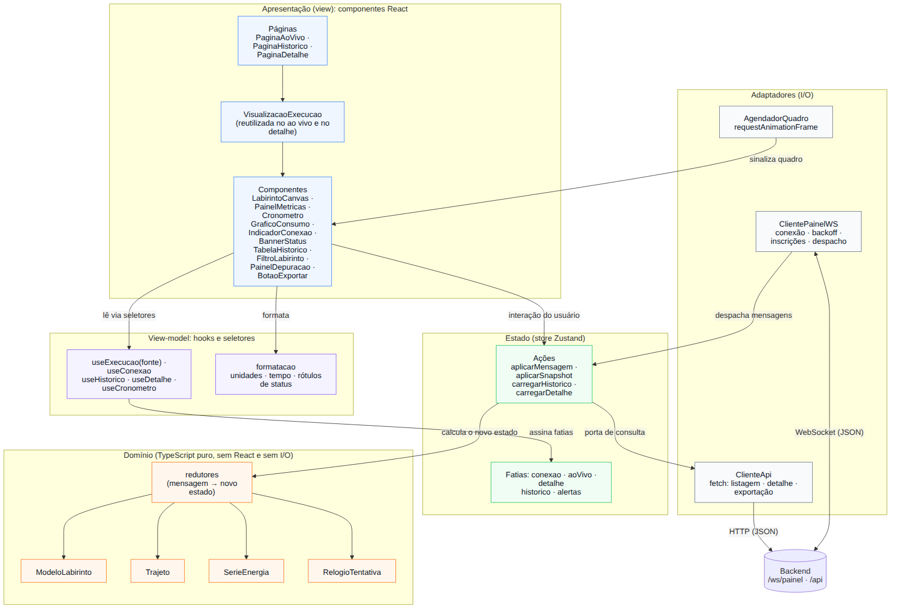

<sub>Fonte editável: [`diagramas/arq-fe-01-camadas.mmd`](software/frontend/diagramas/arq-fe-01-camadas.mmd)</sub>

| Camada / módulo | Responsabilidade | RF/RNF |
|:--|:--|:--|
| **Apresentação** — páginas e componentes | Montar as três telas e desenhar os dados. Não conhece WebSocket nem HTTP. | RF-57 a RF-71, RNF-44, RNF-46 |
| **View-model** — `useExecucao(fonte)`, `useConexao`, `useHistorico`, `useDetalhe`, `useCronometro` | Selecionar a fatia de estado de cada componente e expô-la pronta para exibição. | RF-57, RF-59, RF-64 a RF-67 |
| **View-model** — `formatacao` | Unidades (m/s, V, A, W, %), tempo (mm:ss,d) e rótulos com acentuação (`CONCLUIDA` → "Concluída"; desafio "Cumprido"). O backend usa valores em ASCII, e a acentuação fica só na apresentação. | RF-57, RF-63, RF-64, RNF-47 |
| **Estado** — store Zustand | Guardar as fatias `conexao`, `aoVivo`, `detalhe`, `historico` e `alertas`, e expor as ações que as alteram. | RF-58, RF-67, RNF-40 |
| **Domínio** — `ModeloLabirinto`, `Trajeto`, `SerieEnergia`, `RelogioTentativa`, redutores | Regras de atualização do estado, em funções puras e testáveis sem navegador. | RF-60 a RF-62, RF-64, RF-68, RNF-47 |
| **Adaptador** — `ClientePainelWS` | Abrir a conexão, reconectar com *backoff*, refazer as inscrições, interpretar as mensagens e despachá-las para a store. | RF-58, RF-59, RNF-39 |
| **Adaptador** — `ClienteApi` | Listagem paginada, detalhe da corrida e URL de exportação, via `fetch`. | RF-65 a RF-67, RF-71, RNF-43 |
| **Adaptador** — `AgendadorQuadro` | Concentrar os redesenhos em `requestAnimationFrame`: no máximo um desenho por quadro. | RNF-37, RNF-38 |

##### 3.2 Modelo de estado

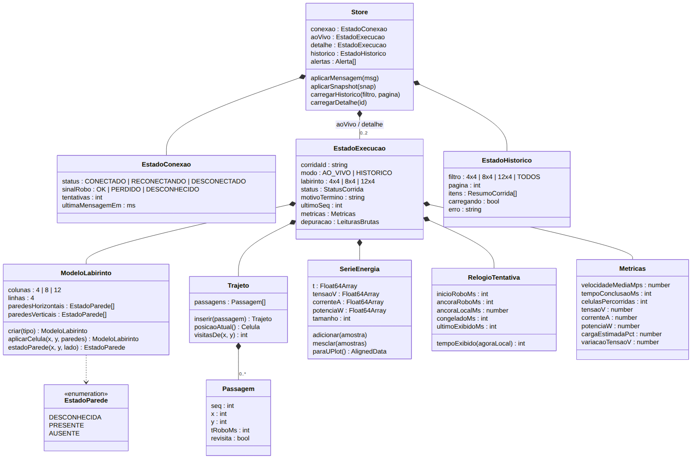

<sub>Fonte editável: [`diagramas/arq-fe-02-modelo-estado.mmd`](software/frontend/diagramas/arq-fe-02-modelo-estado.mmd)</sub>

**Decisões de modelagem**

- **Duas instâncias de `EstadoExecucao`: `aoVivo` e `detalhe`.** A corrida ao vivo continua sendo atualizada enquanto o usuário consulta o histórico, e o detalhe de uma execução passada nunca recebe mensagens ao vivo (HU-FE-11, CA2). As duas instâncias são do mesmo tipo, então a mesma visualização atende às duas.
- **Paredes guardadas como arestas, e não como faces de célula.** O `ModeloLabirinto` guarda um vetor de paredes horizontais (colunas × (linhas + 1)) e um de paredes verticais ((colunas + 1) × linhas). Uma parede compartilhada entre duas células é **um único elemento**, então ela nunca aparece presente de um lado e ausente do outro. É a mesma consistência bidirecional que o firmware garante no RF-37. As paredes internas começam como `DESCONHECIDA` e as do perímetro como `PRESENTE` (RF-60, RF-31). Cada evento `celula` altera apenas as quatro arestas da célula informada, preservando o resto do mapa (HU-FE-04, CA3).
- **Grade criada a partir do tipo de labirinto.** `ModeloLabirinto.criar(tipo)` aceita apenas `4x4`, `8x4` e `12x4`. Com tipo ausente ou inválido, a grade não é criada e a tela mostra "configuração pendente" (HU-FE-06, CA3). Quando o tipo muda entre execuções, um novo modelo substitui o anterior (HU-FE-06, CA2).
- **Trajeto ordenado por `seq`.** `Trajeto.inserir` mantém as passagens em ordem de número de sequência e ignora `seq` repetido. Mesmo que uma mensagem chegue fora de ordem, o desenho segue a ordem do backend (HU-FE-05, CA4), e uma revisita não apaga as passagens anteriores (HU-FE-05, CA3).
- **Série de energia em colunas, sem descarte.** A `SerieEnergia` guarda tempo, tensão, corrente e potência em `Float64Array` pré-alocados (capacidade inicial de 8.192 amostras, dobrada se necessário). Uma tentativa de 10 min a 10 Hz gera 6.000 amostras, cerca de 190 KB, e nenhuma é descartada (RNF-40, HU-FE-12, CA4). O formato em colunas é o que o uPlot recebe, então não há conversão a cada quadro.
- **Cronômetro ancorado no relógio do robô.** O `RelogioTentativa` guarda o tempo do robô da última mensagem (`ancoraRoboMs`) e o instante local em que ela chegou (`ancoraLocalMs`). O tempo exibido é
  `max(últimoExibido, (ancoraRoboMs − inicioRoboMs) + (agoraLocal − ancoraLocalMs))`.
  Assim, o cronômetro avança suavemente entre mensagens e nunca diminui (HU-FE-08, CA2 e CA4). Quando o status se torna final, ele congela no tempo de conclusão calculado pelo backend (RF-82, HU-FE-08, CA3). O cálculo oficial continua sendo do backend: o painel apenas interpola a exibição.
- **Idempotência também no painel.** Cada `EstadoExecucao` guarda o `ultimoSeq` aplicado. Eventos com `seq` menor ou igual são descartados, o que torna seguro receber um *snapshot* seguido de eventos, ou reaplicar mensagens após uma reconexão.
- **Ausência explícita de dados.** Campos sem amostra ficam `null`, e não `0`, e a tela mostra "—" (HU-FE-01, CA2; HU-FE-14, CA4).

##### 3.3 Componentes por tela

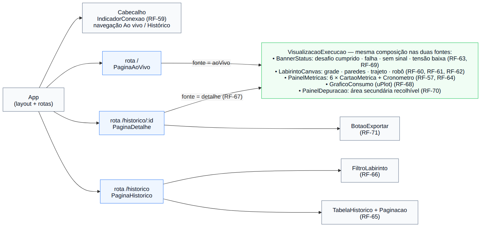

<sub>Fonte editável: [`diagramas/arq-fe-03-componentes.mmd`](software/frontend/diagramas/arq-fe-03-componentes.mmd)</sub>

As telas correspondem às previstas no guia (§5.2) e no [protótipo de alta fidelidade](#proto--prototipo-de-alta-fidelidade): acompanhamento ao vivo, histórico com filtros e detalhe de execução, com o gráfico de consumo.

| Componente | O que exibe | Lê de | HU |
|:--|:--|:--|:--|
| `IndicadorConexao` | "Conectado", "Reconectando", "Desconectado" ou "Sem sinal do robô" (seção 3.4) | `conexao` | HU-FE-03 |
| `PainelMetricas` / `CartaoMetrica` | Os seis dados: tipo do labirinto, células percorridas, consumo (tensão, corrente, potência e carga estimada), velocidade média, tempo e desafio cumprido | `metricas`, `labirinto`, `status` | HU-FE-01 |
| `Cronometro` | Tempo decorrido, atualizado a cada 100 ms, e o tempo de conclusão congelado ao término | `relogio` | HU-FE-08 |
| `LabirintoCanvas` | Grade, paredes nos três estados, trajeto em ordem, revisitas e posição atual do robô | `mapa`, `trajeto` | HU-FE-04, HU-FE-05, HU-FE-06 |
| `BannerStatus` | "Desafio cumprido", falha com o motivo recebido, "sem sinal" e alerta de tensão baixa | `status`, `motivoTermino`, `alertas` | HU-FE-07, HU-FE-13 |
| `GraficoConsumo` | Tensão (V), corrente (A) e potência (W) ao longo do tempo do robô; carga estimada (%) e ΔV nos indicadores | `energia`, `metricas` | HU-FE-12 |
| `PainelDepuracao` | Leituras dos sete ToF, ângulo do MPU-6050 e contagem dos encoders, em área recolhível | `depuracao` | HU-FE-14 |
| `FiltroLabirinto` / `TabelaHistorico` | Filtro e lista paginada com data e hora, tipo, tempo e resultado | `historico` | HU-FE-09, HU-FE-10 |
| `BotaoExportar` | Download em CSV ou JSON pela rota de exportação do backend (RF-98) | `detalhe.corridaId` | HU-FE-15 |

**Leiaute responsivo (RNF-44, RNF-46):** em telas largas (≥ 1280 px), o labirinto fica à esquerda, os cartões à direita e o gráfico abaixo. Em telas estreitas, tudo fica em uma coluna. O canvas acompanha a largura do contêiner (`ResizeObserver`) e considera o `devicePixelRatio`, para ficar nítido também no projetor. Os seis dados usam um token de fonte de no mínimo 24 px em 1920 × 1080.

##### 3.4 Estado da conexão

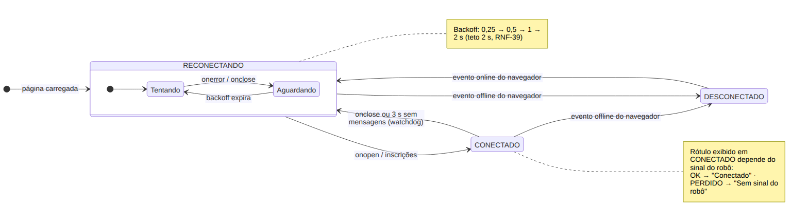

<sub>Fonte editável: [`diagramas/arq-fe-04-estados-conexao.mmd`](software/frontend/diagramas/arq-fe-04-estados-conexao.mmd)</sub>

O RF-59 pede o estado da conexão "do robô", mas o painel nunca fala com o robô: ele fala com o backend, que fala com o robô. Por isso, o indicador combina duas informações independentes:

| Conexão painel ↔ backend | Sinal robô ↔ backend (mensagem `sinal`) | Rótulo exibido |
|:--|:--|:--|
| `CONECTADO` | `OK` ou `DESCONHECIDO` | **Conectado** |
| `CONECTADO` | `PERDIDO` | **Sem sinal do robô** (RF-73: em até 4 s) |
| `RECONECTANDO` | qualquer um | **Reconectando** ("Conectando…" na primeira tentativa) |
| `DESCONECTADO` | qualquer um | **Desconectado** |

`DESCONECTADO` só ocorre quando o navegador informa que está sem rede (evento `offline`). Nesse caso as tentativas ficam suspensas e recomeçam sozinhas no evento `online`, sem intervenção do operador (RNF-39).

**Por que o teto de 2 s no *backoff*:** as tentativas esperam 0,25 s, 0,5 s, 1 s e depois 2 s, repetidamente. Quando o backend volta, a próxima tentativa acontece em no máximo 2 s, e o *handshake* na rede local leva milissegundos, o que mantém a reconexão dentro dos 5 s do RNF-39. Um teto maior, como os de dezenas de segundos usados em muitas bibliotecas de reconexão, violaria o requisito.

##### 3.5 Contrato com o backend (o que o frontend consome)

O protocolo é definido pelo backend ([arquitetura do backend, §2.5](#be_arq--25-protocolo-de-telemetria-v1-proposta)). A tabela lista o que o frontend usa de cada mensagem. As linhas "a confirmar" estão nos [pontos em aberto](#fe_arq--pontos-em-aberto).

| Origem | Mensagem ou rota | Campos usados | Uso no frontend | Situação |
|:--|:--|:--|:--|:--|
| Painel → backend | `inscrever` / `cancelar` | `{ canal: "ao_vivo" }` ou `{ corrida }` | Acompanhar corridas novas e a corrida atual | Definido |
| Backend → painel | `ao_vivo` | corrida, labirinto, status | Inscrição automática quando uma corrida começa (RF-62) | Definido |
| Backend → painel | `snapshot` | corrida, `seq_corte`, mapa, posição, métricas, status | Estado inicial ao se inscrever ou reconectar (RF-89) | Definido; **não inclui trajeto nem série de energia** |
| Backend → painel | `evento` (`celula`) | `seq`, x, y, paredes `{n, l, s, o}`, `t` | Paredes (RF-60) e trajeto (RF-61) | `t` a confirmar |
| Backend → painel | `evento` (`status`) | `seq`, status, motivo de término, tempo de conclusão | Desafio cumprido, falha e cronômetro congelado (RF-63, RF-64, RF-69) | Motivo e tempo a confirmar |
| Backend → painel | `continuo` | posição, energia `{tensao_v, corrente_a, potencia_w}`, `t`, métricas | Posição do robô, cartões e gráfico (RF-57, RF-64, RF-68) | `t` e métricas a confirmar |
| Backend → painel | `sinal` | `estado: PERDIDO \| RETOMADO` | "Sem sinal do robô" (RF-59, RF-69) | Definido |
| Backend → painel | `alerta` | `tipo: TENSAO_BAIXA`, `tensao_v` | Alerta no `BannerStatus` | Definido; sem RF de frontend |
| Backend → painel | `leaderboard` | — | Ignorada: não há RF de frontend para o ranking | — |
| Backend → painel | mensagem de manutenção da conexão (*keepalive*) | — | *Watchdog* de conexão (seção 4.1) | A propor |
| Backend → painel | dados de depuração | 7 ToF, ângulo, encoders | `PainelDepuracao` (RF-70) | Não existe no protocolo v1 |
| HTTP | `GET /api/corridas?tipo&status&pagina&tamanho` | id, data e hora, tipo, tempo, status | Histórico e filtro (RF-65, RF-66); corrida em andamento na reconexão | Definido |
| HTTP | `GET /api/corridas/{id}` | métricas, trajeto (seq, x, y, paredes, t), energia, status, motivo | Detalhe (RF-67) e complemento do *snapshot* na reconexão | Campos do trajeto a confirmar |
| HTTP | `GET /api/corridas/{id}/exportacao?formato=json\|csv` | — (download) | Exportação (RF-71) | Definido |

Mensagens com `tipo` desconhecido são ignoradas e registradas no console, sem derrubar a conexão. Assim, uma versão nova do protocolo (RNF-57) não quebra um painel antigo.

---

#### 4. Visão de processos do frontend (contribuição à consolidação)

##### 4.1 Modelo de execução

- **Uma única *thread* principal do navegador.** Todo o código do painel roda no *event loop* do JavaScript. As fontes de eventos são: mensagens do WebSocket, respostas HTTP, temporizadores, `requestAnimationFrame`, interações do usuário e os eventos `online`, `offline` e `visibilitychange`. Não são usados *Web Workers*: interpretar e aplicar uma mensagem é uma operação de custo constante (estimado abaixo de 1 ms, a medir nos testes de desempenho), e a taxa é de até 10 mensagens contínuas por segundo, limitada pelo backend (RF-90). Um *worker* só acrescentaria o custo de copiar os dados entre *threads*.
- **Atualizar o estado e desenhar são etapas separadas.** Cada mensagem atualiza a store **imediatamente**. O desenho acontece **no máximo uma vez por quadro**, no `requestAnimationFrame`. Essa separação resolve três requisitos:
  - **RNF-37:** um dado recebido aparece no próximo quadro (≈ 17 ms a 60 Hz), bem abaixo de 500 ms;
  - **RNF-38:** o custo de desenho não depende do número de mensagens, porque dez mensagens no mesmo quadro geram um único desenho;
  - **RNF-40:** quando a aba fica em segundo plano, o navegador pausa o `requestAnimationFrame`, mas a store continua recebendo e guardando as mensagens. Ao voltar, um único quadro redesenha tudo, sem perda de amostras.
- **Temporizadores:**

| Temporizador | Período | Função | RF/RNF |
|:--|:--|:--|:--|
| *Backoff* de reconexão | 0,25 → 0,5 → 1 → 2 s (teto de 2 s) | Nova tentativa de conexão com o backend | RF-59, RNF-39 |
| *Watchdog* de conexão | Verificação a cada 1 s; queda declarada após 3 s sem nenhuma mensagem | Detectar queda silenciosa da rede, que o navegador só perceberia pelo *timeout* do TCP | RNF-39 |
| Quadro | ≈ 16,7 ms (60 Hz), só quando houve alteração | Desenhar o canvas, o gráfico e os cartões | RNF-37, RNF-38 |
| Cronômetro | 100 ms enquanto a corrida está `EM_ANDAMENTO` | Atualizar o texto do tempo decorrido | RF-64 |

> O *watchdog* só funciona se o backend enviar alguma mensagem ao painel pelo menos a cada 1 s, também fora das corridas. A API `WebSocket` do navegador não expõe os *frames* de *ping*/*pong*, então esse sinal precisa ser uma mensagem de aplicação. Ver [pontos em aberto](#fe_arq--pontos-em-aberto).

##### 4.2 Fluxo de uma atualização ao vivo

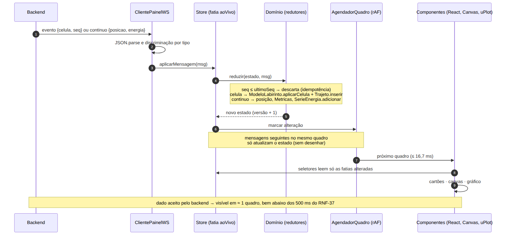

<sub>Fonte editável: [`diagramas/arq-fe-05-seq-atualizacao.mmd`](software/frontend/diagramas/arq-fe-05-seq-atualizacao.mmd)</sub>

##### 4.3 Reconexão e ressincronização no meio da corrida

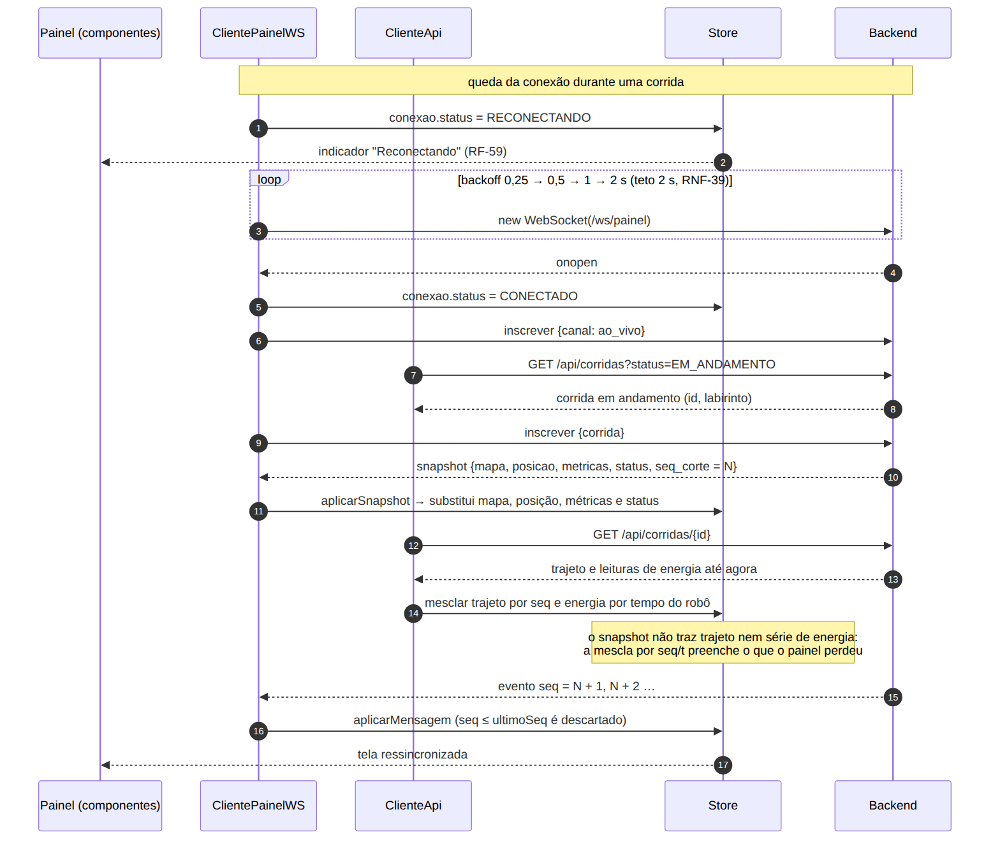

<sub>Fonte editável: [`diagramas/arq-fe-06-seq-reconexao.mmd`](software/frontend/diagramas/arq-fe-06-seq-reconexao.mmd)</sub>

- **Ordem das inscrições:** o painel se inscreve em `ao_vivo` **antes** de consultar `GET /api/corridas?status=EM_ANDAMENTO`. Assim, uma corrida que comece entre as duas operações é avisada pelo canal, e uma corrida que já estava em andamento é encontrada pela consulta. O painel não depende de o canal `ao_vivo` reenviar corridas antigas, ponto levantado no [diagrama de atividades](#fe_ad--7-pontos-em-aberto).
- **O *snapshot* substitui, não mescla:** mapa, posição, métricas e status do *snapshot* substituem os da fatia `aoVivo`, e `ultimoSeq` passa a ser o `seq_corte`. A partir daí, eventos com `seq` ≤ `seq_corte` são descartados.
- **Complemento do *snapshot*:** como o *snapshot* não traz o trajeto nem a série de energia, o painel busca o detalhe da corrida e **mescla** os dados, o trajeto por `seq` e a energia pelo tempo do robô, ignorando repetidos. Sem isso, um painel reconectado perderia as passagens e os pontos do gráfico anteriores à queda (RF-61, RF-68, RNF-40).

---

#### 5. Visão de implementação

##### 5.1 Organização do código

```text
src/frontend/
├── index.html
├── package.json · package-lock.json · tsconfig.json · vite.config.ts · vitest.config.ts
├── public/
│   └── fontes/                     # fontes servidas localmente (RNF-41)
├── src/
│   ├── main.tsx                    # ponto de entrada: monta <App/> e inicia o ClientePainelWS
│   ├── app/                        # App, leiaute, Cabecalho e definição das rotas
│   ├── paginas/
│   │   ├── ao-vivo/                # PaginaAoVivo
│   │   ├── historico/              # PaginaHistorico
│   │   └── detalhe/                # PaginaDetalhe
│   ├── componentes/
│   │   ├── visualizacao-execucao/  # VisualizacaoExecucao, PainelMetricas, CartaoMetrica, BannerStatus
│   │   ├── labirinto/              # LabirintoCanvas + geometria.ts (cálculos puros de posição)
│   │   ├── grafico-consumo/        # GraficoConsumo (uPlot)
│   │   ├── cronometro/             # Cronometro
│   │   ├── conexao/                # IndicadorConexao
│   │   ├── historico/              # FiltroLabirinto, TabelaHistorico, Paginacao
│   │   ├── depuracao/              # PainelDepuracao
│   │   └── exportacao/             # BotaoExportar
│   ├── view-model/                 # useExecucao, useConexao, useHistorico, useDetalhe, useCronometro, seletores
│   ├── formatacao/                 # unidades, tempo e rótulos (acentuação só aqui)
│   ├── estado/                     # store Zustand: fatias e ações
│   ├── dominio/                    # ModeloLabirinto, Trajeto, SerieEnergia, RelogioTentativa, redutores
│   ├── adaptadores/
│   │   ├── ws/                     # ClientePainelWS: conexão, backoff, watchdog, inscrições, despacho
│   │   ├── http/                   # ClienteApi: listagem, detalhe, URL de exportação
│   │   └── quadro/                 # AgendadorQuadro (requestAnimationFrame)
│   ├── protocolo/                  # reexporta os tipos de src/backend/protocolo/tipos.ts
│   └── estilos/                    # tokens (variáveis CSS) e grade responsiva
└── testes/
    ├── unit/                       # dominio/ e formatacao/ (cobertura mínima de 70 %, RNF-47)
    ├── componentes/                # Testing Library (renderização e estados de erro/vazio)
    └── e2e/                        # Playwright + simulador de robô do backend (Chromium e Firefox)
```

Os tipos do protocolo não são redefinidos no frontend: `protocolo/` apenas reexporta os tipos publicados pelo backend, por meio de um *alias* de caminho do TypeScript (`@protocolo`).

##### 5.2 Regras de dependência

- `dominio/` não importa nada de fora dele: nem React, nem Zustand, nem APIs do navegador.
- `formatacao/` depende apenas dos tipos de `dominio/`.
- `estado/` depende de `dominio/` e de `protocolo/`, e acessa o HTTP apenas pela interface (porta) implementada em `adaptadores/http/`.
- `adaptadores/` despacham ações para `estado/` e nunca importam componentes.
- `componentes/` e `paginas/` dependem de `view-model/` e `formatacao/`, e nunca importam `adaptadores/` diretamente.
- Essas regras são verificadas no CI com `dependency-cruiser`, a mesma ferramenta do backend.

##### 5.3 Comandos previstos

| Comando | O que faz | Uso |
|:--|:--|:--|
| `npm run dev` | Servidor do Vite com *proxy* de `/api` e `/ws` para `localhost:8080` | Desenvolvimento com o backend e o simulador de robô, sem o ESP32 |
| `npm run build` | Verificação de tipos (`tsc --noEmit`) e `vite build` | Gera a pasta `dist/` com os arquivos estáticos |
| `npm test` | Vitest com cobertura; falha se `dominio/` ou `formatacao/` ficarem abaixo de 70 % | Testes unitários e de componentes (RNF-47) |
| `npm run test:e2e` | Playwright em Chromium e Firefox contra o backend e o simulador | Fluxos ponta a ponta (RNF-45) |
| `npm run lint` | ESLint e `dependency-cruiser` | Estilo e regras de dependência |

---

#### 6. Implantação (contribuição para a #255)

- O `npm run build` gera `dist/`: um `index.html`, os pacotes JavaScript e CSS e as fontes, todos locais (RNF-41).
- **Proposta:** o próprio backend serve `dist/` na **mesma origem** da API (`http://<notebook-do-operador>:8080/`), por exemplo com `@fastify/static`. Com isso:
  - não é preciso configurar CORS;
  - o painel deriva as URLs da própria página (`ws://<host>/ws/painel` e `/api/...`), sem IP fixo no código, o que funciona com o endereço que o notebook receber na rede local;
  - o sistema continua subindo com um único comando (RNF-58), sem um contêiner a mais.
- A alternativa é um contêiner `nginx` no `docker compose`, que exigiria configurar o encaminhamento de `/api` e `/ws`.
- Os painéis são qualquer navegador (Chrome ou Firefox) na mesma rede: o notebook do operador, o computador ligado ao projetor ou um celular (a partir de 360 px, RNF-44).

---

#### 7. Rastreabilidade

| Requisito | HU | Elementos da arquitetura |
|:--|:--|:--|
| [RF-57](https://github.com/fcte-pi1/2026.2_PI1_Grupo1_Diogo/issues/137) | [HU-FE-01](#fe_hu--hu-fe-01--exibir-os-dados-obrigatórios-da-execução) | `PainelMetricas`, `CartaoMetrica`, `Metricas`, `formatacao` |
| [RF-58](https://github.com/fcte-pi1/2026.2_PI1_Grupo1_Diogo/issues/138) | [HU-FE-02](#fe_hu--hu-fe-02--receber-continuamente-os-dados-da-tentativa) | `ClientePainelWS`, `aplicarMensagem`, redutores; conexão fora da árvore de componentes (2.2) |
| [RF-59](https://github.com/fcte-pi1/2026.2_PI1_Grupo1_Diogo/issues/139) | [HU-FE-03](#fe_hu--hu-fe-03--indicar-o-estado-da-conexão) | `EstadoConexao`, máquina de estados (3.4), `IndicadorConexao` |
| [RF-60](https://github.com/fcte-pi1/2026.2_PI1_Grupo1_Diogo/issues/140) | [HU-FE-04](#fe_hu--hu-fe-04--renderizar-o-labirinto-atualizado) | `ModeloLabirinto` (paredes como arestas), `LabirintoCanvas` |
| [RF-61](https://github.com/fcte-pi1/2026.2_PI1_Grupo1_Diogo/issues/141) | [HU-FE-05](#fe_hu--hu-fe-05--visualizar-o-trajeto-percorrido) | `Trajeto` ordenado por `seq`, `LabirintoCanvas`, complemento do *snapshot* (4.3) |
| [RF-62](https://github.com/fcte-pi1/2026.2_PI1_Grupo1_Diogo/issues/142) | [HU-FE-06](#fe_hu--hu-fe-06--adaptar-a-tela-ao-tipo-de-labirinto) | `ModeloLabirinto.criar(tipo)`, inscrição automática via `ao_vivo` |
| [RF-63](https://github.com/fcte-pi1/2026.2_PI1_Grupo1_Diogo/issues/143) | [HU-FE-07](#fe_hu--hu-fe-07--indicar-o-desafio-cumprido) | `BannerStatus`, rótulos de status em `formatacao` |
| [RF-64](https://github.com/fcte-pi1/2026.2_PI1_Grupo1_Diogo/issues/144) | [HU-FE-08](#fe_hu--hu-fe-08--cronometrar-a-tentativa) | `RelogioTentativa`, `Cronometro`, temporizador de 100 ms |
| [RF-65](https://github.com/fcte-pi1/2026.2_PI1_Grupo1_Diogo/issues/145) | [HU-FE-09](#fe_hu--hu-fe-09--listar-o-histórico-de-execuções) | `ClienteApi`, fatia `historico`, `TabelaHistorico` |
| [RF-66](https://github.com/fcte-pi1/2026.2_PI1_Grupo1_Diogo/issues/146) | [HU-FE-10](#fe_hu--hu-fe-10--filtrar-execuções-por-tipo-de-labirinto) | `FiltroLabirinto`, parâmetro `tipo` da listagem |
| [RF-67](https://github.com/fcte-pi1/2026.2_PI1_Grupo1_Diogo/issues/147) | [HU-FE-11](#fe_hu--hu-fe-11--detalhar-uma-execução-passada) | `PaginaDetalhe`, fatia `detalhe`, `VisualizacaoExecucao` reutilizada |
| [RF-68](https://github.com/fcte-pi1/2026.2_PI1_Grupo1_Diogo/issues/148) | [HU-FE-12](#fe_hu--hu-fe-12--analisar-o-consumo-durante-a-tentativa) | `SerieEnergia` em colunas, `GraficoConsumo` (uPlot) |
| [RF-69](https://github.com/fcte-pi1/2026.2_PI1_Grupo1_Diogo/issues/149) | [HU-FE-13](#fe_hu--hu-fe-13--sinalizar-falha-de-execução) | `BannerStatus`, `motivoTermino`, mensagem `sinal` |
| [RF-70](https://github.com/fcte-pi1/2026.2_PI1_Grupo1_Diogo/issues/150) | [HU-FE-14](#fe_hu--hu-fe-14--consultar-dados-em-modo-de-depuração) | `PainelDepuracao`, `EstadoExecucao.depuracao` (depende do protocolo) |
| [RF-71](https://github.com/fcte-pi1/2026.2_PI1_Grupo1_Diogo/issues/151) | [HU-FE-15](#fe_hu--hu-fe-15--exportar-resultados-da-execução) | `BotaoExportar`, rota de exportação do backend |
| [RNF-37](https://github.com/fcte-pi1/2026.2_PI1_Grupo1_Diogo/issues/215) | — | Separação entre atualizar o estado e desenhar; desenho no próximo quadro (4.1) |
| [RNF-38](https://github.com/fcte-pi1/2026.2_PI1_Grupo1_Diogo/issues/216) | — | `AgendadorQuadro`, Canvas 2D, assinatura por seletor no Zustand |
| [RNF-39](https://github.com/fcte-pi1/2026.2_PI1_Grupo1_Diogo/issues/217) | — | *Backoff* com teto de 2 s, *watchdog*, eventos `online`/`offline` (3.4, 4.1) |
| [RNF-40](https://github.com/fcte-pi1/2026.2_PI1_Grupo1_Diogo/issues/218) | — | `SerieEnergia` sem descarte; store atualizada mesmo com a aba oculta; complemento do *snapshot* |
| [RNF-41](https://github.com/fcte-pi1/2026.2_PI1_Grupo1_Diogo/issues/219) | — | *Build* do Vite com recursos locais, fontes locais, mesma origem (6) |
| [RNF-42](https://github.com/fcte-pi1/2026.2_PI1_Grupo1_Diogo/issues/220) | — | Arquivos estáticos pequenos; histórico e detalhe carregados sob demanda (`React.lazy`) |
| [RNF-43](https://github.com/fcte-pi1/2026.2_PI1_Grupo1_Diogo/issues/221) | — | Paginação feita no backend; `ClienteApi` pede uma página por vez |
| [RNF-44](https://github.com/fcte-pi1/2026.2_PI1_Grupo1_Diogo/issues/222) | — | CSS Grid responsivo; canvas com `ResizeObserver` (3.3) |
| [RNF-45](https://github.com/fcte-pi1/2026.2_PI1_Grupo1_Diogo/issues/223) | — | Somente APIs padrão (`WebSocket`, Canvas 2D, `fetch`); testes E2E em Chromium e Firefox |
| [RNF-46](https://github.com/fcte-pi1/2026.2_PI1_Grupo1_Diogo/issues/224) | — | Token tipográfico ≥ 24 px para os seis dados; canvas com `devicePixelRatio` |
| [RNF-47](https://github.com/fcte-pi1/2026.2_PI1_Grupo1_Diogo/issues/225) | — | `dominio/` e `formatacao/` puros; Vitest com limite mínimo de 70 % |

---

<a id="fe_arq--pontos-em-aberto"></a>
#### Pontos em aberto

| # | Ponto | Impacto | Com quem alinhar |
|:--|:--|:--|:--|
| 1 | **O *snapshot* não traz o trajeto nem a série de energia.** O RF-89 garante só o mapa idêntico. | Sem complemento, um painel que entra ou reconecta no meio da corrida perde passagens e pontos do gráfico (RF-61, RF-68, RNF-40). | Backend: incluir o trajeto no *snapshot*, ou confirmar que `GET /api/corridas/{id}` devolve os dados parciais de uma corrida `EM_ANDAMENTO` (o frontend faz a mescla da seção 4.3). |
| 2 | **Tempo do robô (`t`) nas mensagens `evento` e `continuo` enviadas ao painel.** | Necessário para o cronômetro não regredir (HU-FE-08, CA4) e para o eixo do gráfico (RF-68). | Backend |
| 3 | **Como as métricas derivadas chegam durante a corrida.** O `snapshot` tem métricas, mas `evento` e `continuo` não as listam. | Velocidade média (RF-83), carga estimada e ΔV (RF-85) ficariam desatualizadas no painel entre *snapshots*. | Backend: sugerimos um campo `metricas` no `evento` de célula e no `continuo`. |
| 4 | **Mensagem de manutenção da conexão (*keepalive*) do backend para o painel**, pelo menos a cada 1 s. | Sem ela, uma queda silenciosa da rede só é percebida pelo *timeout* do TCP, que pode passar dos 5 s do RNF-39. | Backend |
| 5 | **Convenção de coordenadas.** Origem da grade, qual eixo corresponde ao comprimento (4, 8 ou 12 células) e à largura (4 células, 72 cm), e o significado de `n`, `l`, `s`, `o` em relação ao canto de partida (RF-99). | Sem isso, o painel pode desenhar o labirinto espelhado ou girado. | Firmware e Backend |
| 6 | **Campos de cada passagem no detalhe da corrida** (`seq`, x, y, paredes, `t`, revisita). | Necessários para reconstruir mapa e trajeto no detalhe (RF-67) sem depender da linha do tempo. | Backend |
| 7 | **Quem serve os arquivos estáticos do painel** (proposta da seção 6). | Define a URL do painel e a necessidade de CORS. | Gerência ([#255](https://github.com/fcte-pi1/2026.2_PI1_Grupo1_Diogo/issues/255)) |
| 8 | **Tipos compartilhados do protocolo.** Confirmar que `src/backend/protocolo/tipos.ts` inclui as mensagens do painel (`snapshot`, `evento`, `continuo`, `sinal`, `alerta`, `ao_vivo`). | Sem esses tipos, o frontend teria de duplicá-los. | Backend |
| 9 | **Dados de depuração (RF-70)** não existem na carga útil do RF-52 nem no protocolo v1. | O `PainelDepuracao` fica sem dados e mostra "indisponível". | Firmware, Backend e Gerência (já registrado no [diagrama de atividades](#fe_ad--7-pontos-em-aberto)) |
| 10 | **Requisitos do backend sem contraparte no frontend:** alerta de tensão baixa (RF-86), leaderboard (RF-95), anulação (RF-96) e numeração de tentativas (RF-97). | A arquitetura já exibe o alerta no `BannerStatus`, mas não há HU que o exija. Ranking e anulação ficam só na API. | Gerência: decidir se viram HU do frontend. |
| 11 | **Motivo de término para o estouro dos 10 min.** | O painel exibe o motivo recebido (HU-FE-13, CA2), mas nenhum requisito de backend o gera hoje. | Backend e Gerência (já registrado no [diagrama de atividades](#fe_ad--7-pontos-em-aberto)) |
| 12 | **Itens "Proposta da subfrente" da stack** (seção 2.3). | Rotas, estilos e ferramentas de teste. | Subfrente de frontend, com registro na [#251](https://github.com/fcte-pi1/2026.2_PI1_Grupo1_Diogo/issues/251) |

#### Referências

- KRUCHTEN, P. B. The 4+1 View Model of Architecture. *IEEE Software*, v. 12, n. 6, p. 42–50, 1995. DOI: 10.1109/52.469759.
- FACEBOOK. *Flux: application architecture for building user interfaces*. Disponível em: <https://facebookarchive.github.io/flux/>.
- MOZILLA. *MDN Web Docs: WebSockets API; Window.requestAnimationFrame(); Page Visibility API*. Disponível em: <https://developer.mozilla.org/pt-BR/docs/Web/API/WebSockets_API>.
- REACT. *Documentação oficial*. Disponível em: <https://react.dev/>.
- VITE. *Documentação oficial*. Disponível em: <https://vite.dev/>.
- ZUSTAND. *Repositório oficial*. Disponível em: <https://github.com/pmndrs/zustand>.
- LEEONIYA. *uPlot*. Disponível em: <https://github.com/leeoniya/uPlot>.
- Grupo 1 — PI1 2026/2. *Guia da Equipe de Software — Etapa de Projeto Conceitual de Software*, 21/09/2026.
- Grupo 1 — PI1 2026/2. [2 - Requisitos](2%20-%20Requisitos.md).
- Grupo 1 — PI1 2026/2. [Arquitetura do Backend — Visões e Modelo de Dados](#be_arq--arquitetura-do-backend--visões-e-modelo-de-dados).
- Grupo 1 — PI1 2026/2. [Histórias de Usuário — Frontend](#fe_hu--histórias-de-usuário--frontend) e [Diagrama de Atividades — Raias do Operador e do Frontend](#fe_ad--diagrama-de-atividades--raias-do-operador-e-do-frontend).

#### Histórico de versões

| Versão | Data | Descrição |
|:--|:--|:--|
| 1.0 | 25/09/2026 | Versão inicial: visões lógica e de implementação, contribuições de processos e implantação, contrato com o backend e pontos em aberto. |

## 4. Roteiro de testes funcionais

> - **Roteiro de testes funcionais:**
>   - Código do caso de teste;
>   - Nome do caso de teste;
>   - Rastreabilidade: Link do(a) RF/HU associado(a);
>   - Objetivo do caso de teste;
>   - Pré-condições do sistema para o teste ser realizado, quando se aplicar;
>   - Descrição dos procedimentos a serem executados para o teste;
>   - Resultado esperado para o teste ser aprovado (pós-condição após realizado o teste);

### 4.1 Roteiro de Testes Funcionais - Firmware (RF-27 a RF-56)

- **Atividade:** 4.1 - Casos de teste do firmware (RF Must have) - [issue #257](https://github.com/fcte-pi1/2026.2_PI1_Grupo1_Diogo/issues/257)
- **Épico:** Roteiro de Testes Funcionais
- **Responsável:** Gustavo Oki / Samuel
- **Entrega da etapa (AP5):** 28/09/2026
- **Projeto:** Rato Borrachudo
- **Grupo 1 - PI1 2026/2**

---

#### 1. Escopo e como usar

Este documento define os **casos de teste funcionais** do firmware embarcado no ESP32, cobrindo todos os requisitos **Must have** da faixa RF-27 a RF-56. Cada caso segue o formato exigido pelo `4.4 - Projeto conceitual de software.md`: **código, nome, rastreabilidade (RF/HU), objetivo, pré-condições, procedimento e resultado esperado**. Há um caso de teste por requisito, rastreado à HU correspondente do documento `4.4.3 - Backlog Firmware`.

Cada caso já está pronto para virar item de teste no GitHub. Os casos que dependem apenas de lógica (Flood Fill, derivações) podem ser executados como **testes automatizados** (Unity/native no PlatformIO); os demais são **testes de bancada** ou **na pista de testes 4×4**.

#### 2. Ambientes e instrumentos de teste

- **Bancada (protoboard):** validação de módulos individuais com o monitor serial.
- **Pista de testes 4×4** (RF-4): validação de navegação, movimento e sensoriamento em condição real.
- **Ambiente _native_ (PlatformIO + Unity):** lógica desacoplada do hardware (Flood Fill, conversões, máquina de estados).
- **Instrumentos:** multímetro, osciloscópio (verificação de PWM), fonte de bancada, monitor serial e o **painel web/simulador** para conferência da telemetria.
- **Condição padrão:** salvo indicação, os limiares de detecção dos ToF já estão calibrados (RNF-31) e a bateria LiPo 2S está carregada.

#### 3. Convenção do caso de teste

Cada caso contém: **Código** (CT-FW-XX) - **Nome** - **Rastreabilidade** (RF + issue + HU) - **Objetivo** - **Pré-condições** - **Procedimento** - **Resultado esperado (pós-condição)**. Todos os RF cobertos são de prioridade **Must have**.

---

#### 4. Casos de teste

##### Épico FW-1 - Inicialização e Auto-teste

**CT-FW-01 - Auto-teste do ESP32 ao boot**

- **Rastreabilidade:** RF-27 - [#107](https://github.com/fcte-pi1/2026.2_PI1_Grupo1_Diogo/issues/107) - HU-01
- **Objetivo:** verificar que o firmware valida o microcontrolador e os GPIO antes de acessar periféricos.
- **Pré-condições:** ESP32 energizado; monitor serial conectado.
- **Procedimento:**
  1. Energizar a placa.
  2. Observar o log de boot no monitor serial.
  3. Repetir induzindo falha (ex.: GPIO essencial em curto/aberto conhecido).
- **Resultado esperado:** no boot normal, o log confirma auto-teste OK antes de qualquer acesso a periférico; sob falha, o firmware **não** prossegue à inicialização dos periféricos e sinaliza a falha (LED/buzzer).

**CT-FW-02 - Reendereçamento dos sensores ToF no I2C**

- **Rastreabilidade:** RF-28 - [#108](https://github.com/fcte-pi1/2026.2_PI1_Grupo1_Diogo/issues/108) - HU-02
- **Objetivo:** confirmar que os sete VL53L1X recebem endereços I2C únicos.
- **Pré-condições:** sete ToF conectados com seus pinos XSHUT no barramento; monitor serial.
- **Procedimento:**
  1. Energizar.
  2. Acompanhar o log de reendereçamento.
  3. Executar varredura I2C após a inicialização.
- **Resultado esperado:** o log mostra desativação por XSHUT, ativação individual e gravação de endereço com confirmação a cada passo; a varredura final acusa **7 endereços distintos**. Endereço duplicado ou sensor mudo gera falha de inicialização.

**CT-FW-03 - Verificação de comunicação com IMU e INA219**

- **Rastreabilidade:** RF-29 - [#109](https://github.com/fcte-pi1/2026.2_PI1_Grupo1_Diogo/issues/109) - HU-03
- **Objetivo:** garantir que MPU-6050 e INA219 respondem após o reendereçamento.
- **Pré-condições:** IMU e INA219 no barramento; ToF já reendereçados.
- **Procedimento:**
  1. Energizar.
  2. Observar a verificação de IMU e INA219 no log.
  3. Repetir desconectando o IMU.
- **Resultado esperado:** com ambos presentes, o log confirma resposta dos dois antes de qualquer leitura sensorial; com um ausente, a inicialização falha e é sinalizada.

**CT-FW-04 - Leitura do DIP switch e tipo de labirinto**

- **Rastreabilidade:** RF-30 - [#110](https://github.com/fcte-pi1/2026.2_PI1_Grupo1_Diogo/issues/110) - HU-04
- **Objetivo:** validar que o tipo de labirinto lido define as dimensões da grade e a célula objetivo.
- **Pré-condições:** DIP switch acessível; monitor serial.
- **Procedimento:** para cada configuração {4×4, 8×4, 12×4}:
  1. posicionar o DIP switch;
  2. energizar;
  3. ler no log as dimensões da grade e a célula objetivo.
- **Resultado esperado:** para cada configuração, o log reporta as dimensões e a célula objetivo corretas para aquele tipo.

**CT-FW-05 - Inicialização do mapa do labirinto**

- **Rastreabilidade:** RF-31 - [#111](https://github.com/fcte-pi1/2026.2_PI1_Grupo1_Diogo/issues/111) - HU-05
- **Objetivo:** confirmar o estado inicial correto do mapa.
- **Pré-condições:** tipo de labirinto definido no DIP switch.
- **Procedimento:**
  1. Energizar.
  2. Exportar/imprimir o estado inicial do mapa e dos valores de inundação (log/serial).
- **Resultado esperado:** paredes internas = "desconhecida"; perímetro externo = "presente"; valores de inundação propagados a partir da célula objetivo (objetivo = 0, crescendo).

**CT-FW-06 - Sinalização de prontidão e transição para Aguardando**

- **Rastreabilidade:** RF-32 - [#112](https://github.com/fcte-pi1/2026.2_PI1_Grupo1_Diogo/issues/112) - HU-06
- **Objetivo:** verificar a sinalização de prontidão ao fim da inicialização.
- **Pré-condições:** inicialização completa sem falhas.
- **Procedimento:**
  1. Energizar e aguardar o fim da inicialização.
  2. Observar LEDs/buzzer e o estado reportado.
- **Resultado esperado:** ao concluir todos os passos, buzzer/LEDs sinalizam prontidão e o estado passa a **Aguardando**; se algum passo falhou, a prontidão **não** é sinalizada.

##### Épico FW-2 - Sensoriamento e Percepção

**CT-FW-07 - Leitura periódica dos ToF**

- **Rastreabilidade:** RF-33 - [#113](https://github.com/fcte-pi1/2026.2_PI1_Grupo1_Diogo/issues/113) - HU-07
- **Objetivo:** validar a leitura sequencial dos sete ToF a cada ciclo.
- **Pré-condições:** robô no estado Mapeando, em célula com paredes conhecidas na bancada/pista.
- **Procedimento:**
  1. Posicionar o robô a distâncias medidas com paquímetro/régua.
  2. Registrar as leituras dos sete sensores no serial.
- **Resultado esperado:** os sete sensores retornam distância em mm a cada ciclo, cobrindo frontal, 2 laterais, 2 diagonais e 2 adicionais, condizentes com as distâncias reais.

**CT-FW-08 - Classificação de paredes por limiar**

- **Rastreabilidade:** RF-34 - [#114](https://github.com/fcte-pi1/2026.2_PI1_Grupo1_Diogo/issues/114) - HU-08
- **Objetivo:** verificar a classificação presente/ausente por limiar.
- **Pré-condições:** limiares calibrados (RNF-31).
- **Procedimento:**
  1. Colocar parede a uma distância abaixo do limiar;
  2. retirar a parede (acima do limiar);
  3. registrar a classificação para cada face.
- **Resultado esperado:** leitura abaixo do limiar → "presente"; acima → "ausente", para cada face avaliada.

**CT-FW-09 - Leitura de dados do IMU**

- **Rastreabilidade:** RF-35 - [#115](https://github.com/fcte-pi1/2026.2_PI1_Grupo1_Diogo/issues/115) - HU-09
- **Objetivo:** validar a leitura de giroscópio e acelerômetro.
- **Pré-condições:** IMU operante.
- **Procedimento:**
  1. Manter o robô parado (referência).
  2. Girar 90° manualmente.
  3. Registrar giroscópio e acelerômetro.
- **Resultado esperado:** parado, taxas próximas de zero; ao girar, o giroscópio acusa a rotação; leituras dos 3 eixos disponíveis a cada ciclo para curva e correção.

**CT-FW-10 - Leitura de energia do INA219**

- **Rastreabilidade:** RF-36 - [#116](https://github.com/fcte-pi1/2026.2_PI1_Grupo1_Diogo/issues/116) - HU-10
- **Objetivo:** validar a leitura de tensão, corrente e potência.
- **Pré-condições:** INA219 no barramento de bateria; multímetro de referência.
- **Procedimento:**
  1. Medir a tensão da bateria com multímetro.
  2. Comparar com a leitura do INA219 no serial e na telemetria.
- **Resultado esperado:** tensão, corrente e potência são lidas periodicamente e entram na telemetria; a tensão bate com o multímetro dentro da tolerância (ver RNF-10, ±0,1 V no circuito de leitura).

**CT-FW-11 - Atualização bidirecional do mapa**

- **Rastreabilidade:** RF-37 - [#117](https://github.com/fcte-pi1/2026.2_PI1_Grupo1_Diogo/issues/117) - HU-11
- **Objetivo:** garantir consistência da parede compartilhada entre células vizinhas.
- **Pré-condições:** robô mapeando.
- **Procedimento:**
  1. Detectar uma parede entre as células A e B.
  2. Inspecionar o registro das faces de A e de B no mapa.
- **Resultado esperado:** a parede é registrada simultaneamente na face correspondente de A **e** de B.

##### Épico FW-3 - Navegação e Algoritmo Flood Fill

**CT-FW-12 - Propagação dos valores de inundação**

- **Rastreabilidade:** RF-38 - [#118](https://github.com/fcte-pi1/2026.2_PI1_Grupo1_Diogo/issues/118) - HU-12
- **Objetivo:** validar o cálculo do Flood Fill. _(Teste automatizado - ambiente native.)_
- **Pré-condições:** mapa de teste conhecido carregado no teste unitário.
- **Procedimento:**
  1. Carregar um labirinto de referência.
  2. Executar a propagação.
  3. Comparar a matriz de valores com o gabarito.
- **Resultado esperado:** objetivo = 0; cada célula acessível recebe (valor do vizinho + 1); matriz idêntica ao gabarito.

**CT-FW-13 - Seleção da próxima célula de menor valor**

- **Rastreabilidade:** RF-39 - [#119](https://github.com/fcte-pi1/2026.2_PI1_Grupo1_Diogo/issues/119) - HU-13
- **Objetivo:** validar a escolha do próximo passo e o desempate. _(Automatizado.)_
- **Pré-condições:** mapa com valores de inundação e um caso de empate montado.
- **Procedimento:**
  1. Posicionar em célula com vizinhos de valores distintos → verificar escolha.
  2. Montar empate entre dois vizinhos → verificar desempate.
- **Resultado esperado:** escolhe a vizinha acessível de menor valor; no empate, aplica o critério determinístico documentado (RNF-32), com resultado reproduzível.

**CT-FW-14 - Recálculo de rota por nova parede**

- **Rastreabilidade:** RF-40 - [#120](https://github.com/fcte-pi1/2026.2_PI1_Grupo1_Diogo/issues/120) - HU-14
- **Objetivo:** validar o recálculo ao detectar parede que invalida a rota.
- **Pré-condições:** robô mapeando na pista 4×4 com um beco.
- **Procedimento:**
  1. Conduzir o robô a uma rota que leva a um beco sem saída.
  2. Observar a reação ao detectar a parede.
- **Resultado esperado:** o robô interrompe o movimento, registra a parede, recalcula os valores de inundação afetados e só então segue por nova direção.

**CT-FW-15 - Encerramento do mapeamento e transição**

- **Rastreabilidade:** RF-41 - [#121](https://github.com/fcte-pi1/2026.2_PI1_Grupo1_Diogo/issues/121) - HU-15
- **Objetivo:** validar a chegada ao objetivo e a transição Mapeando→Resolvendo.
- **Pré-condições:** pista 4×4; sessão iniciada.
- **Procedimento:**
  1. Executar uma tentativa completa até o objetivo.
  2. Em outra execução, forçar o mapa a completar antes da chegada.
- **Resultado esperado:** ao ocupar a célula objetivo, o estado vai a **Concluído**; se o mapa completa antes, transita para **Resolvendo** e executa o percurso ótimo sem novos recálculos.

##### Épico FW-4 - Controle de Movimento

**CT-FW-16 - Geração de PWM via LEDC**

- **Rastreabilidade:** RF-42 - [#122](https://github.com/fcte-pi1/2026.2_PI1_Grupo1_Diogo/issues/122) - HU-16
- **Objetivo:** validar a geração de PWM independente por motor.
- **Pré-condições:** DRV8833 conectado; osciloscópio nas saídas.
- **Procedimento:**
  1. Comandar duty cycles distintos e sentidos opostos para cada motor.
  2. Medir os sinais no osciloscópio.
- **Resultado esperado:** frequência fixa configurada na inicialização; duty variável por canal; direção e velocidade de cada motor controladas de forma independente.

**CT-FW-17 - Malha PID de equalização de velocidades**

- **Rastreabilidade:** RF-43 - [#123](https://github.com/fcte-pi1/2026.2_PI1_Grupo1_Diogo/issues/123) - HU-17
- **Objetivo:** validar que o robô anda reto igualando as velocidades.
- **Pré-condições:** robô montado, encoders funcionando, pista com trecho reto.
- **Procedimento:**
  1. Comandar a travessia de uma célula em linha reta.
  2. Registrar a contagem dos dois encoders e medir o desvio lateral ao final.
- **Resultado esperado:** o PID reduz a diferença de contagem entre os encoders; o robô conclui o trecho reto com desvio dentro do tolerado (referência RNF-16).

**CT-FW-18 - Correção de trajetória por ToF laterais e IMU**

- **Rastreabilidade:** RF-44 - [#124](https://github.com/fcte-pi1/2026.2_PI1_Grupo1_Diogo/issues/124) - HU-18
- **Objetivo:** validar a correção do desvio lateral.
- **Pré-condições:** pista com paredes laterais; robô introduzido levemente descentralizado.
- **Procedimento:**
  1. Iniciar a travessia deslocado do eixo.
  2. Observar a correção ao longo da célula.
- **Resultado esperado:** o robô ajusta o diferencial de velocidade e converge para o centro da célula, sem tocar as paredes.

**CT-FW-19 - Controle do ângulo de curva**

- **Rastreabilidade:** RF-45 - [#125](https://github.com/fcte-pi1/2026.2_PI1_Grupo1_Diogo/issues/125) - HU-19
- **Objetivo:** validar curvas de 90°/180° pelo giroscópio.
- **Pré-condições:** IMU calibrado; espaço de uma célula.
- **Procedimento:**
  1. Comandar uma curva de 90°.
  2. Comandar 180°.
  3. Medir o ângulo real (gabarito/transferidor) e comparar com o alvo.
- **Resultado esperado:** a rotação converge ao ângulo-alvo dentro da tolerância calibrada.

**CT-FW-20 - Autorização de avanço após curva**

- **Rastreabilidade:** RF-46 - [#126](https://github.com/fcte-pi1/2026.2_PI1_Grupo1_Diogo/issues/126) - HU-20
- **Objetivo:** garantir que o avanço só ocorre após a curva concluída.
- **Pré-condições:** robô executando uma curva.
- **Procedimento:**
  1. Comandar uma curva e observar o momento do avanço.
  2. Induzir uma curva incompleta (segurar levemente o robô) e observar.
- **Resultado esperado:** o avanço só é autorizado quando o ângulo acumulado atinge o alvo dentro da tolerância; se não atingir, o robô **não** avança.

##### Épico FW-5 - Odometria

**CT-FW-21 - Captura de pulsos por interrupção**

- **Rastreabilidade:** RF-47 - [#127](https://github.com/fcte-pi1/2026.2_PI1_Grupo1_Diogo/issues/127) - HU-21
- **Objetivo:** garantir que nenhum pulso é perdido.
- **Pré-condições:** encoders acoplados; referência de voltas conhecida.
- **Procedimento:**
  1. Girar a roda um número conhecido de voltas (à mão ou motor).
  2. Comparar a contagem por interrupção com o esperado.
  3. Repetir em alta velocidade.
- **Resultado esperado:** contagem por interrupção igual ao esperado, inclusive em alta velocidade/carga (sem perda de pulsos).

**CT-FW-22 - Conversão de pulsos em distância**

- **Rastreabilidade:** RF-48 - [#128](https://github.com/fcte-pi1/2026.2_PI1_Grupo1_Diogo/issues/128) - HU-22
- **Objetivo:** validar a distância calculada. _(Parcialmente automatizado.)_
- **Pré-condições:** parâmetros (pulsos/rev, diâmetro da roda) configurados.
- **Procedimento:**
  1. Deslocar o robô uma distância medida (ex.: 180 mm, uma célula).
  2. Comparar a distância calculada com a medida.
- **Resultado esperado:** a distância em mm corresponde à real dentro da tolerância; valor atualizado a cada ciclo de odometria.

**CT-FW-23 - Contagem de células percorridas**

- **Rastreabilidade:** RF-49 - [#129](https://github.com/fcte-pi1/2026.2_PI1_Grupo1_Diogo/issues/129) - HU-23
- **Objetivo:** validar o incremento do contador de células.
- **Pré-condições:** pista 4×4.
- **Procedimento:**
  1. Conduzir o robô por um caminho de N células conhecido.
  2. Ler o contador na telemetria.
- **Resultado esperado:** o contador incrementa a cada célula inteira percorrida e o valor atualizado aparece na telemetria; total = N.

**CT-FW-24 - Cálculo da velocidade média**

- **Rastreabilidade:** RF-50 - [#130](https://github.com/fcte-pi1/2026.2_PI1_Grupo1_Diogo/issues/130) - HU-24
- **Objetivo:** validar a velocidade média da sessão.
- **Pré-condições:** sessão em andamento com tempo e distância conhecidos.
- **Procedimento:**
  1. Executar um percurso e cronometrar.
  2. Comparar (distância total ÷ tempo) com o valor reportado.
- **Resultado esperado:** a velocidade média reportada corresponde à razão distância/tempo, atualizada a cada ciclo de telemetria.

##### Épico FW-6 - Telemetria e Comunicação

**CT-FW-25 - Conexão Wi-Fi em modo estação (STA)**

- **Rastreabilidade:** RF-51 - [#131](https://github.com/fcte-pi1/2026.2_PI1_Grupo1_Diogo/issues/131) - HU-25
- **Objetivo:** validar a conexão à rede local antes de Aguardando.
- **Pré-condições:** rede local configurada nos parâmetros de compilação.
- **Procedimento:**
  1. Energizar.
  2. Acompanhar no serial a conexão Wi-Fi.
- **Resultado esperado:** o ESP32 conecta em modo STA à rede definida **antes** de transitar para Aguardando.

**CT-FW-26 - Transmissão contínua da telemetria**

- **Rastreabilidade:** RF-52 - [#132](https://github.com/fcte-pi1/2026.2_PI1_Grupo1_Diogo/issues/132) - HU-26
- **Objetivo:** validar a carga útil transmitida durante a sessão.
- **Pré-condições:** backend/simulador ativo; sessão iniciada.
- **Procedimento:**
  1. Iniciar uma tentativa.
  2. Inspecionar as mensagens recebidas no backend/painel.
- **Resultado esperado:** durante toda a sessão chegam mensagens contendo estado de navegação, contador de células, velocidade média, posição no mapa e dados de energia (INA219).

**CT-FW-27 - Transmissão unidirecional**

- **Rastreabilidade:** RF-53 - [#133](https://github.com/fcte-pi1/2026.2_PI1_Grupo1_Diogo/issues/133) - HU-27
- **Objetivo:** garantir que o firmware não reage a mensagens de entrada.
- **Pré-condições:** sessão ativa.
- **Procedimento:**
  1. Enviar mensagens do servidor ao robô durante a sessão.
  2. Observar o comportamento da navegação.
- **Resultado esperado:** o firmware ignora as mensagens de entrada (não processa/responde) e a navegação segue inalterada (ver também CT-FW-31/RNF-33).

##### Épico FW-7 - Máquina de Estados e Robustez

**CT-FW-28 - Máquina de estados de navegação**

- **Rastreabilidade:** RF-54 - [#134](https://github.com/fcte-pi1/2026.2_PI1_Grupo1_Diogo/issues/134) - HU-28
- **Objetivo:** validar os seis estados e apenas as transições autorizadas.
- **Pré-condições:** telemetria acessível para leitura do estado corrente.
- **Procedimento:**
  1. Percorrer o ciclo completo (Inicializando→Aguardando→Mapeando→[Resolvendo]→Concluído).
  2. Tentar disparar transições não autorizadas.
- **Resultado esperado:** os seis estados ocorrem; apenas as transições previstas acontecem; o estado corrente aparece na telemetria a cada ciclo.

**CT-FW-29 - Detecção de falha e estado Erro**

- **Rastreabilidade:** RF-55 - [#135](https://github.com/fcte-pi1/2026.2_PI1_Grupo1_Diogo/issues/135) - HU-29
- **Objetivo:** validar a parada segura em falha irrecuperável.
- **Pré-condições:** robô em operação.
- **Procedimento:**
  1. Induzir uma falha irrecuperável (ex.: desconectar um sensor essencial durante a navegação).
  2. Observar a reação.
- **Resultado esperado:** o firmware transita para **Erro**, interrompe todos os PWM dos motores e sinaliza via buzzer/LEDs.

**CT-FW-30 - Isolamento entre sessões consecutivas**

- **Rastreabilidade:** RF-56 - [#136](https://github.com/fcte-pi1/2026.2_PI1_Grupo1_Diogo/issues/136) - HU-30
- **Objetivo:** garantir que uma nova sessão começa limpa.
- **Pré-condições:** uma sessão concluída.
- **Procedimento:**
  1. Concluir uma tentativa.
  2. Iniciar nova sessão.
  3. Inspecionar mapa, contador de células e temporizador.
- **Resultado esperado:** a nova sessão só inicia após retorno a Aguardando, com mapa reinicializado, contador zerado e temporizador zerado (sem resíduo da sessão anterior).

---

#### 5. Apêndice - Casos para os RNF de firmware (Must have)

Requisitos não-funcionais de firmware fortemente ligados aos casos acima; incluídos por serem Must have e testáveis.

**CT-FW-31 - Isolamento telemetria × navegação**

- **Rastreabilidade:** RNF-33 - [#211](https://github.com/fcte-pi1/2026.2_PI1_Grupo1_Diogo/issues/211)
- **Objetivo:** garantir que falhas de Wi-Fi não afetam a navegação.
- **Procedimento:** durante uma tentativa, derrubar a rede Wi-Fi por período prolongado e observar a navegação; restabelecer a rede.
- **Resultado esperado:** a navegação prossegue normalmente (não vai a Erro); a telemetria retoma automaticamente ao voltar a conexão.

**CT-FW-32 - Desempate determinístico do Flood Fill**

- **Rastreabilidade:** RNF-32 - [#210](https://github.com/fcte-pi1/2026.2_PI1_Grupo1_Diogo/issues/210)
- **Objetivo:** garantir reprodutibilidade sob empate. _(Automatizado.)_
- **Procedimento:** executar o mesmo labirinto com empates N vezes.
- **Resultado esperado:** a mesma sequência de decisões em todas as execuções.

**CT-FW-33 - Compensação de deriva do giroscópio**

- **Rastreabilidade:** RNF-34 - [#212](https://github.com/fcte-pi1/2026.2_PI1_Grupo1_Diogo/issues/212)
- **Objetivo:** limitar a propagação de erro entre curvas.
- **Procedimento:** executar várias curvas consecutivas e medir o erro angular acumulado.
- **Resultado esperado:** a referência angular é resetada após cada curva confirmada; o erro não cresce indefinidamente entre curvas.

**CT-FW-34 - DIP switch lido apenas no boot**

- **Rastreabilidade:** RNF-35 - [#213](https://github.com/fcte-pi1/2026.2_PI1_Grupo1_Diogo/issues/213)
- **Objetivo:** garantir que alterações no DIP após o boot são ignoradas.
- **Procedimento:** iniciar uma sessão e, durante ela, alterar o DIP switch; observar o comportamento.
- **Resultado esperado:** a alteração é ignorada durante toda a sessão em curso.

---

#### 6. Matriz de rastreabilidade

| Caso de teste          | RF                 | HU            |
| :--------------------- | :----------------- | :------------ |
| CT-FW-01…06            | RF-27 a RF-32      | HU-01 a HU-06 |
| CT-FW-07…11            | RF-33 a RF-37      | HU-07 a HU-11 |
| CT-FW-12…15            | RF-38 a RF-41      | HU-12 a HU-15 |
| CT-FW-16…20            | RF-42 a RF-46      | HU-16 a HU-20 |
| CT-FW-21…24            | RF-47 a RF-50      | HU-21 a HU-24 |
| CT-FW-25…27            | RF-51 a RF-53      | HU-25 a HU-27 |
| CT-FW-28…30            | RF-54 a RF-56      | HU-28 a HU-30 |
| CT-FW-31…34 (apêndice) | RNF-32, 33, 34, 35 | -             |

**Cobertura:** 30 casos cobrem os 30 RF Must have de firmware (RF-27 a RF-56), 1:1; 4 casos adicionais cobrem os RNF de firmware testáveis. Cada caso é rastreável ao RF/HU e reaproveita os critérios de aceitação já definidos no backlog.

<a id="be_ct--roteiro-de-testes-funcionais--backend"></a>
### 4.2 Roteiro de Testes Funcionais — Backend

**Versão:** 1.1 — alinhada ao Guia da Equipe de Software (21/09/2026)
**Issue:** [#258 — 4.2 Casos de teste do backend](https://github.com/fcte-pi1/2026.2_PI1_Grupo1_Diogo/issues/258)
**Escopo:** casos de teste funcionais do backend, derivados dos critérios de aceite dos RF-72 a RF-98 e das [HU-BE-01 a HU-BE-27](#be_hu--histórias-de-usuário--backend). Quando o RF traz um critério de aceite, ele é o **resultado esperado** do caso de teste, com os mesmos números. Uma seção final cobre os RNF verificáveis por teste.

Estes casos guiam a automação E2E exigida no documento [`7.4 - Testes de software`](7.4%20-%20Testes%20de%20software.md). Todos podem ser executados **sem hardware**, com o simulador de robô em Node (RNF-53).

---

#### Ambiente e ferramentas

| Item | Definição |
|:--|:--|
| **AMB — ambiente padrão** | Backend e PostgreSQL 16 subidos por `docker compose up`, banco com as migrações aplicadas e sem corridas. Dispositivo `sim-01` cadastrado com token `T-VALIDO`. Operador `op1` cadastrado. Apresentação "Teste" ativa. |
| **SIM** | Simulador de robô (`src/backend/simulador`). Envia `hello` e mensagens do protocolo v1 com `seq`, `t` e taxa configuráveis. Permite derrubar e retomar a conexão, reiniciar (novo `boot`), silenciar o pong e reenviar o buffer retido. Como o robô real, o SIM é **emissor unidirecional**: nenhum passo do SIM depende de ler respostas do backend. Os `ack` recebidos são apenas registrados para verificação. |
| **PNL** | Cliente de painel de teste: conecta em `/ws/painel`, se inscreve e grava cada mensagem recebida com o horário de chegada. Pode simular um consumidor lento (não lê o socket). |
| **SQL** | Consultas diretas ao banco para verificar o estado persistido. |
| **Nível** | **E2E** = SIM → backend → PNL/HTTP · **INT** = serviço + PostgreSQL real · **UNI** = domínio puro |

<a id="be_ct--matriz-de-rastreabilidade"></a>
#### Matriz de rastreabilidade

| Caso de teste | RF/RNF | HU | Prioridade | Nível |
|:--|:--|:--|:--:|:--:|
| CT-BE-01 | [RF-72](https://github.com/fcte-pi1/2026.2_PI1_Grupo1_Diogo/issues/152) | [HU-BE-01](#be_hu--hu-be-01--conectar-somente-robôs-autorizados) | Must have | E2E |
| CT-BE-02 | [RF-72](https://github.com/fcte-pi1/2026.2_PI1_Grupo1_Diogo/issues/152) | [HU-BE-01](#be_hu--hu-be-01--conectar-somente-robôs-autorizados) | Must have | E2E |
| CT-BE-03 | [RF-73](https://github.com/fcte-pi1/2026.2_PI1_Grupo1_Diogo/issues/153), [RF-92](https://github.com/fcte-pi1/2026.2_PI1_Grupo1_Diogo/issues/172) | [HU-BE-02](#be_hu--hu-be-02--saber-rapidamente-quando-o-robô-perdeu-o-sinal), [HU-BE-21](#be_hu--hu-be-21--ver-no-painel-a-perda-e-a-retomada-de-sinal) | Must have | E2E |
| CT-BE-04 | [RF-74](https://github.com/fcte-pi1/2026.2_PI1_Grupo1_Diogo/issues/154), [RF-77](https://github.com/fcte-pi1/2026.2_PI1_Grupo1_Diogo/issues/157) | [HU-BE-03](#be_hu--hu-be-03--confirmar-ao-robô-o-que-já-foi-gravado), [HU-BE-06](#be_hu--hu-be-06--não-duplicar-dados-reenviados) | Must have | E2E |
| CT-BE-05 | [RF-75](https://github.com/fcte-pi1/2026.2_PI1_Grupo1_Diogo/issues/155) | [HU-BE-04](#be_hu--hu-be-04--rejeitar-mensagens-malformadas-sem-derrubar-a-conexão) | Must have | E2E |
| CT-BE-06 | [RF-76](https://github.com/fcte-pi1/2026.2_PI1_Grupo1_Diogo/issues/156) | [HU-BE-05](#be_hu--hu-be-05--rejeitar-dados-fisicamente-impossíveis) | Must have | E2E |
| CT-BE-07 | [RF-76](https://github.com/fcte-pi1/2026.2_PI1_Grupo1_Diogo/issues/156) | [HU-BE-05](#be_hu--hu-be-05--rejeitar-dados-fisicamente-impossíveis) | Must have | E2E |
| CT-BE-08 | [RF-77](https://github.com/fcte-pi1/2026.2_PI1_Grupo1_Diogo/issues/157) | [HU-BE-06](#be_hu--hu-be-06--não-duplicar-dados-reenviados) | Must have | E2E |
| CT-BE-09 | [RF-78](https://github.com/fcte-pi1/2026.2_PI1_Grupo1_Diogo/issues/158) | [HU-BE-07](#be_hu--hu-be-07--registrar-a-corrida-sem-ação-manual) | Must have | E2E |
| CT-BE-10 | [RF-79](https://github.com/fcte-pi1/2026.2_PI1_Grupo1_Diogo/issues/159) | [HU-BE-08](#be_hu--hu-be-08--guardar-o-registro-bruto-e-inalterável-da-corrida) | Must have | INT |
| CT-BE-11 | [RF-80](https://github.com/fcte-pi1/2026.2_PI1_Grupo1_Diogo/issues/160) | [HU-BE-09](#be_hu--hu-be-09--preservar-o-estado-do-mapa-periodicamente) | Must have | E2E |
| CT-BE-12 | [RF-81](https://github.com/fcte-pi1/2026.2_PI1_Grupo1_Diogo/issues/161) | [HU-BE-10](#be_hu--hu-be-10--encerrar-ou-marcar-como-interrompida-cada-corrida) | Must have | E2E |
| CT-BE-13 | [RF-81](https://github.com/fcte-pi1/2026.2_PI1_Grupo1_Diogo/issues/161), [RF-87](https://github.com/fcte-pi1/2026.2_PI1_Grupo1_Diogo/issues/167) | [HU-BE-10](#be_hu--hu-be-10--encerrar-ou-marcar-como-interrompida-cada-corrida), [HU-BE-16](#be_hu--hu-be-16--saber-o-resultado-da-corrida-e-o-motivo) | Must have | E2E |
| CT-BE-14 | [RF-81](https://github.com/fcte-pi1/2026.2_PI1_Grupo1_Diogo/issues/161) | [HU-BE-10](#be_hu--hu-be-10--encerrar-ou-marcar-como-interrompida-cada-corrida) | Must have | E2E |
| CT-BE-15 | [RF-82](https://github.com/fcte-pi1/2026.2_PI1_Grupo1_Diogo/issues/162) | [HU-BE-11](#be_hu--hu-be-11--obter-o-tempo-oficial-de-conclusão) | Must have | E2E |
| CT-BE-16 | [RF-83](https://github.com/fcte-pi1/2026.2_PI1_Grupo1_Diogo/issues/163) | [HU-BE-12](#be_hu--hu-be-12--acompanhar-a-velocidade-média) | Must have | E2E |
| CT-BE-17 | [RF-84](https://github.com/fcte-pi1/2026.2_PI1_Grupo1_Diogo/issues/164) | [HU-BE-13](#be_hu--hu-be-13--reconstituir-o-trajeto-percorrido) | Must have | E2E |
| CT-BE-18 | [RF-85](https://github.com/fcte-pi1/2026.2_PI1_Grupo1_Diogo/issues/165) | [HU-BE-14](#be_hu--hu-be-14--avaliar-o-consumo-de-bateria-da-corrida) | Must have | E2E |
| CT-BE-19 | [RF-86](https://github.com/fcte-pi1/2026.2_PI1_Grupo1_Diogo/issues/166) | [HU-BE-15](#be_hu--hu-be-15--ser-alertado-de-bateria-baixa) | Should have | E2E |
| CT-BE-20 | [RF-87](https://github.com/fcte-pi1/2026.2_PI1_Grupo1_Diogo/issues/167) | [HU-BE-16](#be_hu--hu-be-16--saber-o-resultado-da-corrida-e-o-motivo) | Must have | E2E |
| CT-BE-21 | [RF-88](https://github.com/fcte-pi1/2026.2_PI1_Grupo1_Diogo/issues/168) | [HU-BE-17](#be_hu--hu-be-17--receber-só-as-atualizações-da-corrida-acompanhada) | Must have | E2E |
| CT-BE-22 | [RF-89](https://github.com/fcte-pi1/2026.2_PI1_Grupo1_Diogo/issues/169) | [HU-BE-18](#be_hu--hu-be-18--entrar-no-meio-da-corrida-e-ver-o-estado-completo) | Must have | E2E |
| CT-BE-23 | [RF-90](https://github.com/fcte-pi1/2026.2_PI1_Grupo1_Diogo/issues/170) | [HU-BE-19](#be_hu--hu-be-19--receber-dados-contínuos-em-ritmo-controlado) | Must have | E2E |
| CT-BE-24 | [RF-91](https://github.com/fcte-pi1/2026.2_PI1_Grupo1_Diogo/issues/171) | [HU-BE-20](#be_hu--hu-be-20--não-deixar-um-painel-lento-prejudicar-os-demais) | Should have | E2E |
| CT-BE-25 | [RF-92](https://github.com/fcte-pi1/2026.2_PI1_Grupo1_Diogo/issues/172) | [HU-BE-21](#be_hu--hu-be-21--ver-no-painel-a-perda-e-a-retomada-de-sinal) | Must have | E2E |
| CT-BE-26 | [RF-93](https://github.com/fcte-pi1/2026.2_PI1_Grupo1_Diogo/issues/173) | [HU-BE-22](#be_hu--hu-be-22--consultar-o-histórico-de-corridas) | Must have | E2E |
| CT-BE-27 | [RF-94](https://github.com/fcte-pi1/2026.2_PI1_Grupo1_Diogo/issues/174) | [HU-BE-23](#be_hu--hu-be-23--rever-uma-corrida-passo-a-passo) | Should have | E2E |
| CT-BE-28 | [RF-95](https://github.com/fcte-pi1/2026.2_PI1_Grupo1_Diogo/issues/175) | [HU-BE-24](#be_hu--hu-be-24--ver-o-ranking-por-tipo-de-labirinto) | Must have | E2E |
| CT-BE-29 | [RF-96](https://github.com/fcte-pi1/2026.2_PI1_Grupo1_Diogo/issues/176) | [HU-BE-25](#be_hu--hu-be-25--anular-uma-corrida-inválida) | Should have | E2E |
| CT-BE-30 | [RF-97](https://github.com/fcte-pi1/2026.2_PI1_Grupo1_Diogo/issues/177) | [HU-BE-26](#be_hu--hu-be-26--identificar-a-primeira-tentativa-em-cada-labirinto) | Should have | E2E |
| CT-BE-31 | [RF-98](https://github.com/fcte-pi1/2026.2_PI1_Grupo1_Diogo/issues/178) | [HU-BE-27](#be_hu--hu-be-27--exportar-os-dados-de-uma-corrida) | Could have | E2E |
| CT-BE-32 | [RNF-48](https://github.com/fcte-pi1/2026.2_PI1_Grupo1_Diogo/issues/226) | [HU-BE-17](#be_hu--hu-be-17--receber-só-as-atualizações-da-corrida-acompanhada), [HU-BE-19](#be_hu--hu-be-19--receber-dados-contínuos-em-ritmo-controlado) | Must have | E2E |
| CT-BE-33 | [RNF-49](https://github.com/fcte-pi1/2026.2_PI1_Grupo1_Diogo/issues/227), [RNF-51](https://github.com/fcte-pi1/2026.2_PI1_Grupo1_Diogo/issues/229) | [HU-BE-08](#be_hu--hu-be-08--guardar-o-registro-bruto-e-inalterável-da-corrida), [HU-BE-17](#be_hu--hu-be-17--receber-só-as-atualizações-da-corrida-acompanhada) | Must have | E2E |
| CT-BE-34 | [RNF-52](https://github.com/fcte-pi1/2026.2_PI1_Grupo1_Diogo/issues/230) | [HU-BE-09](#be_hu--hu-be-09--preservar-o-estado-do-mapa-periodicamente), [HU-BE-10](#be_hu--hu-be-10--encerrar-ou-marcar-como-interrompida-cada-corrida) | Must have | E2E |
| CT-BE-35 | [RNF-54](https://github.com/fcte-pi1/2026.2_PI1_Grupo1_Diogo/issues/232) | [HU-BE-25](#be_hu--hu-be-25--anular-uma-corrida-inválida) | Must have | INT |
| CT-BE-36 | [RNF-56](https://github.com/fcte-pi1/2026.2_PI1_Grupo1_Diogo/issues/234) | [HU-BE-04](#be_hu--hu-be-04--rejeitar-mensagens-malformadas-sem-derrubar-a-conexão) a [HU-BE-06](#be_hu--hu-be-06--não-duplicar-dados-reenviados) | Must have | E2E |
| CT-BE-37 | [RNF-57](https://github.com/fcte-pi1/2026.2_PI1_Grupo1_Diogo/issues/235) | [HU-BE-01](#be_hu--hu-be-01--conectar-somente-robôs-autorizados) | Should have | E2E |
| CT-BE-38 | [RNF-58](https://github.com/fcte-pi1/2026.2_PI1_Grupo1_Diogo/issues/236) | — | Should have | Manual |

> RNF-50 é verificado pelo CT-BE-04, RNF-55 pelos CT-BE-02 e CT-BE-29, e RNF-53 pela própria execução desta suíte com o SIM, somada ao relatório de cobertura.

---

#### Casos de teste — Requisitos Funcionais

##### CT-BE-01 — Aceitar conexão de dispositivo autorizado

- **Rastreabilidade:** [RF-72](https://github.com/fcte-pi1/2026.2_PI1_Grupo1_Diogo/issues/152) · [HU-BE-01](#be_hu--hu-be-01--conectar-somente-robôs-autorizados) (CA1)
- **Objetivo:** verificar que um dispositivo com token válido e versão suportada é autenticado.
- **Pré-condições:** AMB.
- **Procedimentos:**
  1. SIM abre a conexão em `/ws/telemetria`.
  2. SIM envia `hello {dispositivo: "sim-01", token: "T-VALIDO", v: 1, boot: "b1"}`.
  3. SIM envia `inicio_corrida` (`seq` 1, `labirinto` 4x4).
- **Resultado esperado:** a conexão continua aberta, existe um `evento_conexao` do tipo `CONECTADO` para `sim-01` e uma corrida `EM_ANDAMENTO` foi criada. O backend enviou `ack` com `seq = 1` (registrado pelo SIM, que não precisa processá-lo).

##### CT-BE-02 — Recusar token inválido e versão não suportada

- **Rastreabilidade:** [RF-72](https://github.com/fcte-pi1/2026.2_PI1_Grupo1_Diogo/issues/152) · [HU-BE-01](#be_hu--hu-be-01--conectar-somente-robôs-autorizados) (CA2, CA3, CA4) · [RNF-55](https://github.com/fcte-pi1/2026.2_PI1_Grupo1_Diogo/issues/233)
- **Objetivo:** verificar que fontes não autorizadas ou incompatíveis não conseguem gravar dados.
- **Pré-condições:** AMB.
- **Procedimentos:**
  1. SIM envia `hello` com token `T-ERRADO`.
  2. Nova conexão: SIM envia `hello` válido com `v: 99`.
  3. Nova conexão: SIM envia `celula` sem enviar `hello` antes.
  4. Nova conexão: SIM não envia nada por 6 s.
- **Resultado esperado:**
  1. Conexão fechada pelo backend com código `4001` (`TOKEN_INVALIDO`).
  2. Conexão fechada pelo backend com código `4002` (`VERSAO_NAO_SUPORTADA`).
  3. Conexão encerrada.
  4. Conexão encerrada em até 5 s.
  - Em todos os cenários, `SELECT count(*) FROM corrida` = 0 e cada tentativa aparece no log.

##### CT-BE-03 — Detectar perda de conexão por heartbeat

- **Rastreabilidade:** [RF-73](https://github.com/fcte-pi1/2026.2_PI1_Grupo1_Diogo/issues/153), [RF-92](https://github.com/fcte-pi1/2026.2_PI1_Grupo1_Diogo/issues/172) · [HU-BE-02](#be_hu--hu-be-02--saber-rapidamente-quando-o-robô-perdeu-o-sinal), [HU-BE-21](#be_hu--hu-be-21--ver-no-painel-a-perda-e-a-retomada-de-sinal)
- **Objetivo:** verificar a detecção de silêncio em 3 s e a notificação ao painel.
- **Pré-condições:** AMB. SIM autenticado com corrida em andamento. PNL inscrito na corrida.
- **Procedimentos:**
  1. SIM para de responder pong e de enviar mensagens, com a conexão TCP ainda aberta (instante T0).
  2. Registrar o instante em que PNL recebe `sinal PERDIDO`.
- **Resultado esperado:** **(critério do RF-73)** com o robô conectado, ao parar de responder, o painel deve mostrar "sem sinal" em até 4 s (3 s de detecção + 1 s de propagação). O `sinal PERDIDO` chega entre T0 + 3 s e T0 + 4 s, e existe `evento_conexao SINAL_PERDIDO`.

##### CT-BE-04 — Confirmação cumulativa e reenvio após queda de 60 s

- **Rastreabilidade:** [RF-74](https://github.com/fcte-pi1/2026.2_PI1_Grupo1_Diogo/issues/154), [RF-77](https://github.com/fcte-pi1/2026.2_PI1_Grupo1_Diogo/issues/157) · [HU-BE-03](#be_hu--hu-be-03--confirmar-ao-robô-o-que-já-foi-gravado), [HU-BE-06](#be_hu--hu-be-06--não-duplicar-dados-reenviados) · [RNF-50](https://github.com/fcte-pi1/2026.2_PI1_Grupo1_Diogo/issues/228)
- **Objetivo:** verificar que queda e reenvio em lote não geram lacunas nem duplicatas.
- **Pré-condições:** AMB. SIM autenticado, corrida iniciada.
- **Procedimentos:**
  1. SIM envia `seq` 1 a 120 (buffer circular configurado para 60 s).
  2. SIM derruba a conexão e acumula `seq` 121 a 400 por 60 s.
  3. SIM reconecta com o mesmo `boot`, envia `hello` e, sem esperar resposta, reenvia todo o buffer retido: `seq` 101 a 400 (a sobreposição de 101–120 é esperada, porque o robô não sabe o que já foi gravado).
- **Resultado esperado:**
  - **(critério do RF-74)** Após uma queda de conexão de até 60 s seguida de reenvio em lote, o banco deve conter cada mensagem exatamente uma vez e a confirmação final deve corresponder à última mensagem recebida, sem lacunas nem duplicatas.
  - `SELECT count(*), count(DISTINCT seq), min(seq), max(seq) FROM mensagem WHERE corrida_id = X` retorna `400, 400, 1, 400`.
  - O último `ack` enviado pelo backend é `400`, o contador de duplicadas aumentou em 20 e `corrida.seqs_faltantes = 0`.
  - **Variante (reenvio desativado no SIM):** após reconectar, o SIM continua a partir de `seq` 401. Resultado: nenhuma duplicata, `seqs_faltantes = 280` (lacunas 121–400 sinalizadas, RNF-50).

##### CT-BE-05 — Rejeitar mensagem fora do esquema sem encerrar a conexão

- **Rastreabilidade:** [RF-75](https://github.com/fcte-pi1/2026.2_PI1_Grupo1_Diogo/issues/155) · [HU-BE-04](#be_hu--hu-be-04--rejeitar-mensagens-malformadas-sem-derrubar-a-conexão)
- **Objetivo:** verificar a validação de esquema e a continuidade da conexão.
- **Pré-condições:** AMB. SIM autenticado com corrida em andamento (último `seq` = 10).
- **Procedimentos:**
  1. SIM envia `celula` `seq` 11 sem o campo `paredes`.
  2. SIM envia um texto que não é JSON.
  3. SIM envia `{tipo: "teleporte", seq: 12, ...}`.
  4. SIM envia uma `celula` válida com `seq` 11.
- **Resultado esperado:** os passos 1 a 3 são rejeitados, cada um com uma linha em `mensagem_rejeitada` e no log com o motivo (ex.: `/paredes: obrigatório`). O contador de rejeitadas aumenta em 3 e a conexão continua aberta. O passo 4 é aceito (`ack 11`). Nenhuma mensagem inválida aparece em `mensagem`.

##### CT-BE-06 — Rejeitar coordenada fora do labirinto

- **Rastreabilidade:** [RF-76](https://github.com/fcte-pi1/2026.2_PI1_Grupo1_Diogo/issues/156) · [HU-BE-05](#be_hu--hu-be-05--rejeitar-dados-fisicamente-impossíveis) (CA1)
- **Objetivo:** verificar a regra de domínio sobre os limites do labirinto.
- **Pré-condições:** AMB. Corrida 4x4 em andamento.
- **Procedimentos:** SIM envia `celula {x: 5, y: 2}` e, em seguida, `celula {x: 3, y: 3}`.
- **Resultado esperado:** **(critério do RF-76)** uma célula com coordenada fora dos limites do labirinto da corrida deve ser rejeitada, com motivo registrado em log, conexão mantida e contador de rejeitadas incrementado. A célula (3, 3) é aceita.

##### CT-BE-07 — Rejeitar tipo de labirinto, tensão e tempo inválidos

- **Rastreabilidade:** [RF-76](https://github.com/fcte-pi1/2026.2_PI1_Grupo1_Diogo/issues/156) · [HU-BE-05](#be_hu--hu-be-05--rejeitar-dados-fisicamente-impossíveis) (CA2 a CA4)
- **Objetivo:** verificar as demais regras de domínio.
- **Pré-condições:** AMB.
- **Procedimentos:**
  1. SIM envia `inicio_corrida {labirinto: "5x5"}`.
  2. Numa corrida válida, SIM envia `energia {tensao_v: 4.9}` e `energia {tensao_v: 9.1}`.
  3. SIM envia `seq` 20 com `t = 5000` e depois `seq` 21 com `t = 4900`.
- **Resultado esperado:** as quatro mensagens inválidas são rejeitadas com os motivos `LABIRINTO_INVALIDO`, `TENSAO_FORA_DA_FAIXA` (duas vezes) e `TEMPO_DECRESCENTE`. A conexão continua aberta. Uma `energia {tensao_v: 7.4}` enviada logo depois é aceita.

##### CT-BE-08 — Mensagem duplicada é confirmada, mas não gravada nem distribuída

- **Rastreabilidade:** [RF-77](https://github.com/fcte-pi1/2026.2_PI1_Grupo1_Diogo/issues/157) · [HU-BE-06](#be_hu--hu-be-06--não-duplicar-dados-reenviados)
- **Objetivo:** verificar a idempotência por (corrida, `seq`).
- **Pré-condições:** AMB. Corrida em andamento. PNL inscrito.
- **Procedimentos:** SIM envia `celula seq 30` três vezes seguidas.
- **Resultado esperado:** SIM recebe 3 `ack` com `seq ≥ 30`. `mensagem` tem uma única linha com `seq = 30`. PNL recebe um único evento `celula` com `seq = 30`. O contador de duplicadas aumenta em 2.

##### CT-BE-09 — Criação automática e idempotente da corrida

- **Rastreabilidade:** [RF-78](https://github.com/fcte-pi1/2026.2_PI1_Grupo1_Diogo/issues/158) · [HU-BE-07](#be_hu--hu-be-07--registrar-a-corrida-sem-ação-manual)
- **Objetivo:** verificar a criação sem ação manual e a unicidade do par (dispositivo, id do robô).
- **Pré-condições:** AMB. PNL inscrito no canal `ao_vivo`.
- **Procedimentos:**
  1. SIM envia `inicio_corrida {corrida: "c-A"}`.
  2. SIM reenvia o mesmo `inicio_corrida`.
  3. SIM envia `celula {corrida: "c-B", seq: 5}` sem ter enviado `inicio_corrida` para `c-B`.
- **Resultado esperado:** existem exatamente 2 corridas (`c-A` e `c-B`), cada uma com UUID próprio e status `EM_ANDAMENTO`. PNL recebe 2 notificações `ao_vivo` de nova corrida.

##### CT-BE-10 — Registro append-only

- **Rastreabilidade:** [RF-79](https://github.com/fcte-pi1/2026.2_PI1_Grupo1_Diogo/issues/159) · [HU-BE-08](#be_hu--hu-be-08--guardar-o-registro-bruto-e-inalterável-da-corrida)
- **Objetivo:** verificar que as mensagens aceitas são gravadas completas e não podem ser alteradas.
- **Pré-condições:** AMB. Uma corrida com 50 mensagens aceitas.
- **Procedimentos:**
  1. Conferir as colunas de uma linha de `mensagem`.
  2. Com o usuário de banco da aplicação, executar `UPDATE mensagem SET payload = '{}' WHERE seq = 1`.
  3. Executar `DELETE FROM mensagem WHERE seq = 1`.
- **Resultado esperado:** a linha tem `corrida_id`, `seq`, `tipo`, `t_robo_ms`, `versao_protocolo`, `payload` igual ao enviado e `recebida_em`. Os passos 2 e 3 falham (erro de permissão ou "tabela mensagem é append-only") e a linha continua igual.

##### CT-BE-11 — Snapshot a cada 20 células e ao fim

- **Rastreabilidade:** [RF-80](https://github.com/fcte-pi1/2026.2_PI1_Grupo1_Diogo/issues/160) · [HU-BE-09](#be_hu--hu-be-09--preservar-o-estado-do-mapa-periodicamente)
- **Objetivo:** verificar a política de snapshot.
- **Pré-condições:** AMB. Corrida 8x4 em andamento.
- **Procedimentos:** SIM envia 45 mensagens `celula` intercaladas com `posicao` e depois `fim_corrida`.
- **Resultado esperado:** `snapshot_mapa` tem 3 linhas, com `celulas_visitadas` = 20, 40 e 45 (final). O `estado` do snapshot final tem as paredes de todas as 45 passagens e a última posição.

##### CT-BE-12 — Encerramento normal da corrida

- **Rastreabilidade:** [RF-81](https://github.com/fcte-pi1/2026.2_PI1_Grupo1_Diogo/issues/161) · [HU-BE-10](#be_hu--hu-be-10--encerrar-ou-marcar-como-interrompida-cada-corrida) (CA3)
- **Objetivo:** verificar o encerramento ao receber `fim_corrida`.
- **Pré-condições:** AMB. Corrida em andamento.
- **Procedimentos:** SIM envia `fim_corrida {resultado: "sucesso"}`.
- **Resultado esperado:** a corrida fica `CONCLUIDA`, com motivo `SUCESSO` e `encerrada_em` preenchido.

##### CT-BE-13 — Interrupção por 120 s sem sinal e lote tardio

- **Rastreabilidade:** [RF-81](https://github.com/fcte-pi1/2026.2_PI1_Grupo1_Diogo/issues/161), [RF-87](https://github.com/fcte-pi1/2026.2_PI1_Grupo1_Diogo/issues/167) · [HU-BE-10](#be_hu--hu-be-10--encerrar-ou-marcar-como-interrompida-cada-corrida) (CA2, CA4), [HU-BE-16](#be_hu--hu-be-16--saber-o-resultado-da-corrida-e-o-motivo) (CA2)
- **Objetivo:** verificar a interrupção por silêncio e a reversão por lote tardio.
- **Pré-condições:** AMB. Corrida em andamento com `t_inicio = 1000`.
- **Procedimentos:**
  1. SIM se desconecta.
  2. Aguardar 121 s e consultar a corrida.
  3. SIM reconecta com o mesmo `boot` e envia o lote pendente, terminando em `fim_corrida {resultado: "sucesso", t: 95500}`.
- **Resultado esperado:** no passo 2, a corrida está `INTERROMPIDA (SEM_SINAL)`. No passo 3, **(critério do RF-81)** se, após 120 s sem sinal, chegar depois um lote com fim de corrida bem-sucedido, o status deve passar a CONCLUÍDA com o tempo do relógio do robô: status `CONCLUIDA` e `tempo_conclusao_ms = 94500`.

##### CT-BE-14 — Interrupção por reinício do robô

- **Rastreabilidade:** [RF-81](https://github.com/fcte-pi1/2026.2_PI1_Grupo1_Diogo/issues/161) · [HU-BE-10](#be_hu--hu-be-10--encerrar-ou-marcar-como-interrompida-cada-corrida) (CA1, CA5)
- **Objetivo:** verificar a detecção de reinício pelo `boot`.
- **Pré-condições:** AMB. Corrida em andamento, criada na conexão com `boot = "b1"`.
- **Procedimentos:** SIM encerra a conexão e reconecta imediatamente com `boot = "b2"` (instante T0).
- **Resultado esperado:** **(critério do RF-81)** ao reconectar o mesmo robô após reinício, a corrida anterior deve virar INTERROMPIDA (motivo: reinício) em até 1 s: status `INTERROMPIDA`, motivo `REINICIO_ROBO` antes de T0 + 1 s, e `evento_conexao REINICIO_DETECTADO` registrado. Um `fim_corrida` enviado depois para essa corrida é rejeitado.

##### CT-BE-15 — Tempo de conclusão pelo relógio do robô

- **Rastreabilidade:** [RF-82](https://github.com/fcte-pi1/2026.2_PI1_Grupo1_Diogo/issues/162) · [HU-BE-11](#be_hu--hu-be-11--obter-o-tempo-oficial-de-conclusão)
- **Objetivo:** verificar que o tempo oficial ignora a latência de rede.
- **Pré-condições:** AMB. SIM configurado com atraso de rede artificial variável (0 a 800 ms).
- **Procedimentos:** SIM envia `inicio_corrida` com `t = 1000`, algumas mensagens e `fim_corrida` com `t = 95500`.
- **Resultado esperado:** **(critério do RF-82)** para início em t = 1.000 ms e fim em t = 95.500 ms no relógio do robô, o tempo de conclusão calculado deve ser 94,5 s, independentemente de atrasos de rede (`tempo_conclusao_ms = 94500`).

##### CT-BE-16 — Velocidade média

- **Rastreabilidade:** [RF-83](https://github.com/fcte-pi1/2026.2_PI1_Grupo1_Diogo/issues/163) · [HU-BE-12](#be_hu--hu-be-12--acompanhar-a-velocidade-média)
- **Objetivo:** verificar a fórmula e a atualização a cada célula.
- **Pré-condições:** AMB. PNL inscrito. Corrida com `t_inicio = 0`.
- **Procedimentos:** SIM envia 31 `celula` (30 transições) espaçadas até `t = 45000` e depois `fim_corrida` em `t = 45000`.
- **Resultado esperado:** **(critério do RF-83)** para 30 transições de célula em 45 s, a velocidade média calculada deve ser 0,12 m/s. PNL recebe a métrica atualizada a cada nova célula, e o valor final gravado é `0.12`.

##### CT-BE-17 — Trajeto ordenado com revisitas

- **Rastreabilidade:** [RF-84](https://github.com/fcte-pi1/2026.2_PI1_Grupo1_Diogo/issues/164) · [HU-BE-13](#be_hu--hu-be-13--reconstituir-o-trajeto-percorrido)
- **Objetivo:** verificar a derivação do trajeto.
- **Pré-condições:** AMB. Corrida 4x4 em andamento.
- **Procedimentos:** o percurso real é (0,0) `seq 1` → (0,1) `seq 2` → (1,1) `seq 3` → (0,1) `seq 4` → (0,2) `seq 5`. SIM envia na ordem `seq` 1, 2, 4, 5, 3 (a 3 chega por último, como num reenvio) e depois consulta `GET /api/corridas/{id}`.
- **Resultado esperado:** o trajeto retornado é (0,0) → (0,1) → (1,1) → (0,1) → (0,2), em ordem de `seq`, com o `t` de cada passagem. A passagem de `seq 4` é marcada como revisita e `revisitas = 1`. Antes da chegada da `seq 3`, o PNL não recebe os eventos 4 e 5 (ordem de `seq` contíguo). Quando ela chega, recebe 3, 4 e 5 nessa ordem.

##### CT-BE-18 — Métricas de energia

- **Rastreabilidade:** [RF-85](https://github.com/fcte-pi1/2026.2_PI1_Grupo1_Diogo/issues/165) · [HU-BE-14](#be_hu--hu-be-14--avaliar-o-consumo-de-bateria-da-corrida)
- **Objetivo:** verificar tensão inicial e final, ΔV e carga estimada.
- **Pré-condições:** AMB com a curva padrão (8,4 V → 100 %; 7,6 V → 50 %; 7,0 V → 10 %; 6,0 V → 0 %).
- **Procedimentos:** SIM envia `energia` com as tensões 8,2 / 8,0 / 7,8 / 7,6 V e depois `fim_corrida`.
- **Resultado esperado:** tensão inicial 8,20 V, tensão final 7,60 V, ΔV = 0,60 V, carga inicial 87,5 % e carga final 50,0 %. Alterar a curva em `config` e reiniciar muda o cálculo sem alterar código.

##### CT-BE-19 — Alerta de tensão baixa com histerese

- **Rastreabilidade:** [RF-86](https://github.com/fcte-pi1/2026.2_PI1_Grupo1_Diogo/issues/166) · [HU-BE-15](#be_hu--hu-be-15--ser-alertado-de-bateria-baixa)
- **Objetivo:** verificar a emissão única do alerta abaixo de 7,0 V.
- **Pré-condições:** AMB. PNL inscrito.
- **Procedimentos:** SIM envia as tensões 7,2 → 6,9 → 6,8 → 7,05 → 6,9 → 7,2 → 6,9 V.
- **Resultado esperado:** PNL recebe exatamente 2 `alerta TENSAO_BAIXA`: um na primeira leitura de 6,9 V e outro na última, depois de a tensão ter voltado acima de 7,1 V. Não há alerta em 6,8 V nem no 6,9 V que vem depois de 7,05 V.

##### CT-BE-20 — Status FALHOU com motivo e transição proibida

- **Rastreabilidade:** [RF-87](https://github.com/fcte-pi1/2026.2_PI1_Grupo1_Diogo/issues/167) · [HU-BE-16](#be_hu--hu-be-16--saber-o-resultado-da-corrida-e-o-motivo)
- **Objetivo:** verificar o status, o motivo e a máquina de status.
- **Pré-condições:** AMB. PNL inscrito.
- **Procedimentos:**
  1. SIM envia `fim_corrida {resultado: "falha", detalhe: "Erro: sensor ToF 3"}`.
  2. SIM envia outro `fim_corrida {resultado: "sucesso"}` com novo `seq` para a mesma corrida.
- **Resultado esperado:** status `FALHOU`, motivo `FALHA_REPORTADA` e detalhe gravado. PNL recebe o evento de status. O passo 2 é rejeitado (`CORRIDA_FINALIZADA`) e o status continua `FALHOU`.

##### CT-BE-21 — Distribuição por inscrição e canal ao vivo

- **Rastreabilidade:** [RF-88](https://github.com/fcte-pi1/2026.2_PI1_Grupo1_Diogo/issues/168) · [HU-BE-17](#be_hu--hu-be-17--receber-só-as-atualizações-da-corrida-acompanhada)
- **Objetivo:** verificar o isolamento entre inscrições.
- **Pré-condições:** AMB. Dois SIM (`sim-01` e `sim-02`) com corridas A e B em andamento. PNL-1 inscrito em A, PNL-2 em B, PNL-3 em `ao_vivo`.
- **Procedimentos:**
  1. Os dois SIM enviam 20 mensagens cada.
  2. PNL-1 envia `cancelar {corrida: A}` e SIM-1 envia mais 5 mensagens.
  3. A corrida B termina.
- **Resultado esperado:** PNL-1 recebe apenas eventos de A (nenhum depois do cancelamento). PNL-2 recebe apenas eventos de B. PNL-3 recebe apenas os resumos (início e fim de B), sem eventos de célula.

##### CT-BE-22 — Snapshot consistente para inscrição no meio da corrida

- **Rastreabilidade:** [RF-89](https://github.com/fcte-pi1/2026.2_PI1_Grupo1_Diogo/issues/169) · [HU-BE-18](#be_hu--hu-be-18--entrar-no-meio-da-corrida-e-ver-o-estado-completo)
- **Objetivo:** verificar que o painel que entra depois converge para o mesmo estado.
- **Pré-condições:** AMB. PNL-A inscrito desde o início da corrida.
- **Procedimentos:**
  1. SIM envia 300 mensagens.
  2. PNL-B se inscreve.
  3. SIM envia mais 200 mensagens.
  4. Comparar os mapas reconstruídos por PNL-A e PNL-B.
- **Resultado esperado:** **(critério do RF-89)** um painel inscrito após 300 mensagens já processadas deve receber o snapshot com corte em 300 e, depois, apenas mensagens posteriores, resultando em mapa idêntico ao de um painel conectado desde o início. PNL-B recebe `snapshot seq_corte = 300` e depois apenas eventos com `seq > 300`.

##### CT-BE-23 — Limite de 10 atualizações contínuas/s sem perder eventos discretos

- **Rastreabilidade:** [RF-90](https://github.com/fcte-pi1/2026.2_PI1_Grupo1_Diogo/issues/170) · [HU-BE-19](#be_hu--hu-be-19--receber-dados-contínuos-em-ritmo-controlado)
- **Objetivo:** verificar o *throttle* de contínuos e a preservação dos discretos.
- **Pré-condições:** AMB. PNL inscrito.
- **Procedimentos:**
  1. SIM envia `posicao` a 50/s por 10 s.
  2. No meio desse intervalo, SIM envia 5 `celula` em 100 ms.
- **Resultado esperado:** **(critério do RF-90)** com o robô enviando 50 atualizações de posição/s, cada painel deve receber no máximo 10 atualizações contínuas/s, sempre com a posição mais recente; eventos discretos (ex.: 5 células visitadas em 100 ms) devem chegar todos, na ordem de sequência. Em nenhuma janela de 1 s o PNL recebe mais de 10 `continuo`, e o último `continuo` corresponde ao último `posicao` enviado.

##### CT-BE-24 — Controle de fluxo de painel lento

- **Rastreabilidade:** [RF-91](https://github.com/fcte-pi1/2026.2_PI1_Grupo1_Diogo/issues/171) · [HU-BE-20](#be_hu--hu-be-20--não-deixar-um-painel-lento-prejudicar-os-demais)
- **Objetivo:** verificar o descarte de contínuos e a desconexão do painel lento.
- **Pré-condições:** AMB. PNL-lento (não lê o socket) e PNL-normal inscritos na mesma corrida.
- **Procedimentos:** SIM envia `posicao`, `energia` e `celula` com *payloads* grandes até o `bufferedAmount` do PNL-lento passar de 1 MB, e mantém a situação por 12 s.
- **Resultado esperado:** depois de passar de 1 MB, nenhum novo `continuo` é enfileirado para o PNL-lento. Em cerca de 10 s ele é desconectado com código `1013` e o fato aparece no log. PNL-normal recebe todas as mensagens durante todo o episódio.

##### CT-BE-25 — Notificação de perda e retomada de sinal

- **Rastreabilidade:** [RF-92](https://github.com/fcte-pi1/2026.2_PI1_Grupo1_Diogo/issues/172) · [HU-BE-21](#be_hu--hu-be-21--ver-no-painel-a-perda-e-a-retomada-de-sinal)
- **Objetivo:** verificar os prazos de notificação.
- **Pré-condições:** AMB. PNL inscrito.
- **Procedimentos:**
  1. Provocar a perda de sinal como no CT-BE-03 e registrar o instante da detecção (evento `SINAL_PERDIDO`).
  2. SIM reconecta com o mesmo `boot` e envia `hello`. Registrar o instante em que o backend aceita o `hello` (evento `SINAL_RETOMADO`).
- **Resultado esperado:** PNL recebe `sinal PERDIDO` até 1 s após a detecção e `sinal RETOMADO` até 1 s após a aceitação do `hello`.

##### CT-BE-26 — Listagem com filtros e paginação

- **Rastreabilidade:** [RF-93](https://github.com/fcte-pi1/2026.2_PI1_Grupo1_Diogo/issues/173) · [HU-BE-22](#be_hu--hu-be-22--consultar-o-histórico-de-corridas)
- **Objetivo:** verificar filtros, paginação e desempenho da listagem.
- **Pré-condições:** AMB com 200 corridas geradas por *seed*: 4x4, 8x4 e 12x4, com status variados, distribuídas em 3 dias.
- **Procedimentos:**
  1. `GET /api/corridas?tipo=4x4&status=CONCLUIDA&pagina=1&tamanho=20`.
  2. `GET /api/corridas?de=<dia2>&ate=<dia2>`.
  3. `GET /api/corridas?tamanho=500`.
- **Resultado esperado:** o passo 1 retorna no máximo 20 itens, todos 4x4 e `CONCLUIDA`, ordenados do mais recente para o mais antigo, com `total` igual à contagem feita por SQL. O passo 2 retorna só corridas do dia 2. O passo 3 é limitado a 100 itens. Todas as respostas chegam em menos de 2 s.

##### CT-BE-27 — Linha do tempo para replay

- **Rastreabilidade:** [RF-94](https://github.com/fcte-pi1/2026.2_PI1_Grupo1_Diogo/issues/174) · [HU-BE-23](#be_hu--hu-be-23--rever-uma-corrida-passo-a-passo)
- **Objetivo:** verificar a completude e a ordem da linha do tempo.
- **Pré-condições:** AMB. Corrida concluída com 500 mensagens, algumas recebidas fora de ordem.
- **Procedimentos:** `GET /api/corridas/{id}/linha-do-tempo` e reproduzir as mensagens num `EstadoMapa` vazio.
- **Resultado esperado:** 500 registros em ordem estritamente crescente de `seq`. O mapa reproduzido é idêntico ao `estado` do snapshot final.

##### CT-BE-28 — Ranking exclui corridas anuladas e não concluídas

- **Rastreabilidade:** [RF-95](https://github.com/fcte-pi1/2026.2_PI1_Grupo1_Diogo/issues/175) · [HU-BE-24](#be_hu--hu-be-24--ver-o-ranking-por-tipo-de-labirinto)
- **Objetivo:** verificar os filtros, a ordenação e o prazo de atualização do ranking.
- **Pré-condições:** AMB. No 4x4: corrida A `CONCLUIDA` (60 s), corrida B `CONCLUIDA` (50 s, anulada), corrida C `FALHOU`. PNL inscrito em `ao_vivo`.
- **Procedimentos:**
  1. `GET /api/leaderboard?labirinto=4x4`.
  2. SIM conclui a corrida D (60 s, com distância menor que a de A) e registra o instante do `fim_corrida`.
  3. Repetir a consulta após a notificação `leaderboard`.
- **Resultado esperado:** **(critério do RF-95)** com duas corridas CONCLUÍDAS no 4x4 sendo uma delas anulada, apenas a não anulada deve aparecer no leaderboard, atualizado em até 1 s após o fim da corrida. O passo 1 retorna só A. No passo 3, D aparece à frente de A (desempate por distância), e a notificação `leaderboard` chega em até 1 s após o fim de D.

##### CT-BE-29 — Anulação autenticada com justificativa

- **Rastreabilidade:** [RF-96](https://github.com/fcte-pi1/2026.2_PI1_Grupo1_Diogo/issues/176) · [HU-BE-25](#be_hu--hu-be-25--anular-uma-corrida-inválida) · [RNF-55](https://github.com/fcte-pi1/2026.2_PI1_Grupo1_Diogo/issues/233)
- **Objetivo:** verificar a anulação, a autenticação e a auditoria.
- **Pré-condições:** AMB. Corrida A `CONCLUIDA` no ranking 4x4.
- **Procedimentos:**
  1. `POST /api/corridas/A/anulacao` sem token.
  2. Com token de `op1` e motivo vazio.
  3. Com token de `op1` e motivo "houve toque manual".
  4. Repetir o passo 3.
  5. `GET /api/corridas/A` e `GET /api/leaderboard?labirinto=4x4`.
  6. Tentar anular uma corrida `EM_ANDAMENTO`.
- **Resultado esperado:** 1 → `401`. 2 → `400`. 3 → `201`, com uma linha em `anulacao` contendo autor `op1`, data e motivo. 4 → `409`. 5 → a corrida continua existindo, marcada como anulada, e não aparece no ranking. 6 → `409`.

##### CT-BE-30 — Numeração de tentativas por tipo de labirinto

- **Rastreabilidade:** [RF-97](https://github.com/fcte-pi1/2026.2_PI1_Grupo1_Diogo/issues/177) · [HU-BE-26](#be_hu--hu-be-26--identificar-a-primeira-tentativa-em-cada-labirinto)
- **Objetivo:** verificar a numeração sequencial por (apresentação, tipo).
- **Pré-condições:** AMB com a apresentação "Teste" ativa e sem corridas.
- **Procedimentos:** SIM executa, em sequência: 4x4 (falha), 4x4 (sucesso), 8x4 (interrompida), 4x4 (sucesso, depois anulada). Em seguida, abrir a apresentação "Final" e executar 4x4.
- **Resultado esperado:** na apresentação "Teste", as corridas 4x4 recebem os números 1, 2 e 3, e a 8x4 recebe 1. Na apresentação "Final", a corrida 4x4 recebe 1.

##### CT-BE-31 — Exportação em JSON e CSV

- **Rastreabilidade:** [RF-98](https://github.com/fcte-pi1/2026.2_PI1_Grupo1_Diogo/issues/178) · [HU-BE-27](#be_hu--hu-be-27--exportar-os-dados-de-uma-corrida)
- **Objetivo:** verificar o conteúdo e o formato das exportações.
- **Pré-condições:** AMB. Corrida concluída com 300 mensagens.
- **Procedimentos:** `GET .../exportacao?formato=json` e `GET .../exportacao?formato=csv`.
- **Resultado esperado:** o JSON contém resumo, métricas, trajeto e série de energia, consistentes com `GET /api/corridas/{id}`. O CSV tem cabeçalho e 300 linhas de dados em ordem de `seq`, com separador `,`, e abre corretamente numa planilha. Ambos são entregues com o `Content-Type` e o nome de arquivo adequados.

---

#### Casos de teste — Requisitos Não-Funcionais

##### CT-BE-32 — Latência servidor → painel e ponta a ponta

- **Rastreabilidade:** [RNF-48](https://github.com/fcte-pi1/2026.2_PI1_Grupo1_Diogo/issues/226) · [HU-BE-17](#be_hu--hu-be-17--receber-só-as-atualizações-da-corrida-acompanhada), [HU-BE-19](#be_hu--hu-be-19--receber-dados-contínuos-em-ritmo-controlado)
- **Objetivo:** medir as latências p95.
- **Pré-condições:** AMB. 1 SIM a 20 mensagens/s e 5 PNL inscritos, na mesma rede local.
- **Procedimentos:** executar a corrida por 5 min. O backend registra o instante de recepção e o de envio de cada mensagem. SIM e PNL registram o envio e a recepção com relógios sincronizados (mesma máquina ou NTP local).
- **Resultado esperado:** p95 (recepção → envio ao painel) ≤ 50 ms e p95 ponta a ponta (robô → painel) ≤ 300 ms.

##### CT-BE-33 — Carga sustentada sem bloqueio do event loop

- **Rastreabilidade:** [RNF-49](https://github.com/fcte-pi1/2026.2_PI1_Grupo1_Diogo/issues/227), [RNF-51](https://github.com/fcte-pi1/2026.2_PI1_Grupo1_Diogo/issues/229) · [HU-BE-08](#be_hu--hu-be-08--guardar-o-registro-bruto-e-inalterável-da-corrida), [HU-BE-17](#be_hu--hu-be-17--receber-só-as-atualizações-da-corrida-acompanhada)
- **Objetivo:** verificar a capacidade e a responsividade do backend sob carga.
- **Pré-condições:** AMB. SIM a 50 mensagens/s. 10 PNL inscritos.
- **Procedimentos:** manter a carga por 5 min. Durante o teste, pedir 3 exportações CSV e consultar `/health` a cada 5 s.
- **Resultado esperado:** **(critério do RNF-49)** sob carga de 50 mensagens/s por 5 min, o atraso do event loop deve manter p99 ≤ 20 ms. Todas as mensagens são persistidas (`count` = enviadas), sem desconexão de painel e sem rejeição por sobrecarga.

##### CT-BE-34 — Recuperação após reinício do backend

- **Rastreabilidade:** [RNF-52](https://github.com/fcte-pi1/2026.2_PI1_Grupo1_Diogo/issues/230) · [HU-BE-09](#be_hu--hu-be-09--preservar-o-estado-do-mapa-periodicamente), [HU-BE-10](#be_hu--hu-be-10--encerrar-ou-marcar-como-interrompida-cada-corrida)
- **Objetivo:** verificar a retomada da corrida em até 5 s sem perdas.
- **Pré-condições:** AMB. Corrida em andamento com 250 mensagens.
- **Procedimentos:**
  1. Encerrar o processo do backend (`docker compose kill backend`) no instante T0 e reiniciá-lo.
  2. SIM continua gerando mensagens e reenvia a partir do `ack` quando consegue reconectar.
  3. Concluir a corrida.
- **Resultado esperado:** **(critério do RNF-52)** encerrando e reiniciando o processo durante uma corrida simulada, ela deve ser retomada em até 5 s e, após o reenvio do robô, não deve haver lacunas nem duplicatas. `/health` responde "pronto" em até T0 + 5 s (descontado o tempo do contêiner). O estado reconstruído é igual ao de antes da queda, e `count(*) = count(DISTINCT seq) = max(seq)`.

##### CT-BE-35 — Imutabilidade da corrida finalizada

- **Rastreabilidade:** [RNF-54](https://github.com/fcte-pi1/2026.2_PI1_Grupo1_Diogo/issues/232) · [HU-BE-25](#be_hu--hu-be-25--anular-uma-corrida-inválida)
- **Objetivo:** verificar que uma corrida finalizada só pode ser anulada.
- **Pré-condições:** AMB. Corrida `CONCLUIDA`.
- **Procedimentos:**
  1. Via SQL, `UPDATE corrida SET tempo_conclusao_ms = 1 WHERE id = X`.
  2. `DELETE FROM corrida WHERE id = X`.
  3. Anular pela API.
- **Resultado esperado:** os passos 1 e 2 falham com "corrida X não pode ser alterada". O passo 3 funciona, e a linha de `corrida` continua idêntica à de antes (a anulação fica só em `anulacao`, com autor, data e motivo).

##### CT-BE-36 — Observabilidade

- **Rastreabilidade:** [RNF-56](https://github.com/fcte-pi1/2026.2_PI1_Grupo1_Diogo/issues/234) · [HU-BE-04](#be_hu--hu-be-04--rejeitar-mensagens-malformadas-sem-derrubar-a-conexão) a [HU-BE-06](#be_hu--hu-be-06--não-duplicar-dados-reenviados)
- **Objetivo:** verificar logs estruturados, `/health` e contadores.
- **Pré-condições:** AMB.
- **Procedimentos:** SIM envia 10 mensagens válidas, 2 inválidas e 3 duplicadas. Depois, consultar `GET /health` e o log.
- **Resultado esperado:** `/health` responde `200` com o estado do banco, o atraso do *event loop* e os contadores `aceitas = 10`, `rejeitadas = 2` e `duplicadas = 3`. Cada linha de log é um JSON válido com `corrida` e `seq` quando aplicável.

##### CT-BE-37 — Compatibilidade com a versão anterior do protocolo

- **Rastreabilidade:** [RNF-57](https://github.com/fcte-pi1/2026.2_PI1_Grupo1_Diogo/issues/235) · [HU-BE-01](#be_hu--hu-be-01--conectar-somente-robôs-autorizados)
- **Objetivo:** verificar que o backend aceita a versão atual e a anterior.
- **Pré-condições:** AMB com o backend suportando as versões N e N−1 (em teste, uma versão fictícia `v0` publicada em `protocolo/`).
- **Procedimentos:** SIM executa uma corrida completa em `v: 1` e outra em `v: 0`, e depois tenta `v: -1`.
- **Resultado esperado:** as duas primeiras corridas são aceitas e persistidas com a `versao_protocolo` correta. A terceira recebe `VERSAO_NAO_SUPORTADA`. Os esquemas das versões aceitas estão publicados em `src/backend/protocolo/`.

##### CT-BE-38 — Implantação com um único comando

- **Rastreabilidade:** [RNF-58](https://github.com/fcte-pi1/2026.2_PI1_Grupo1_Diogo/issues/236)
- **Objetivo:** verificar a implantação num notebook limpo.
- **Pré-condições:** notebook com Docker instalado, sem o repositório e sem imagens do projeto em cache. Rede com acesso ao registro de imagens, ou imagens previamente salvas em pendrive para uso em rede isolada.
- **Procedimentos:** clonar o repositório, copiar `.env.example` para `.env`, executar `docker compose up -d` e cronometrar até `/health` responder `200`.
- **Resultado esperado:** backend pronto em ≤ 2 min, sem nenhum outro passo manual. CT-BE-01 passa em seguida.

### 4.3 Casos de Teste — Frontend

**Versão:** 1.0  
**Escopo:** casos de teste funcionais do dashboard frontend para os RF-57 a RF-71 e as histórias HU-FE-01 a HU-FE-15.  
**Ferramentas previstas:** Vitest e Testing Library para testes unitários e de componentes; Playwright para testes funcionais E2E em Chromium e Firefox.

#### Convenções

- **CT-FE-NN:** código do caso de teste funcional.
- **RF:** requisito funcional rastreado em `docs/2 - Requisitos.md`.
- **HU:** história de usuário rastreada em `UC-frontend.md`.
- **Resultado esperado:** condição que deve ser satisfeita para o caso ser aprovado.
- O frontend exibe os dados derivados pelo backend e não recalcula trajeto, métricas oficiais ou status da corrida.

#### Matriz de rastreabilidade

| Caso | História de usuário | Requisito funcional | Prioridade | Nível principal |
|:--|:--|:--|:--:|:--|
| CT-FE-01 | HU-FE-01 — Exibir os dados obrigatórios da execução | RF-57 | P0 | E2E |
| CT-FE-02 | HU-FE-02 — Receber continuamente os dados da tentativa | RF-58 | P0 | Integração/E2E |
| CT-FE-03 | HU-FE-03 — Indicar o estado da conexão | RF-59 | P0 | E2E |
| CT-FE-04 | HU-FE-04 — Renderizar o labirinto atualizado | RF-60 | P0 | Unitário/Componente |
| CT-FE-05 | HU-FE-05 — Visualizar o trajeto percorrido | RF-61 | P0 | Unitário/Componente |
| CT-FE-06 | HU-FE-06 — Adaptar a tela ao tipo de labirinto | RF-62 | P0 | Unitário/E2E |
| CT-FE-07 | HU-FE-07 — Indicar o desafio cumprido | RF-63 | P0 | E2E |
| CT-FE-08 | HU-FE-08 — Cronometrar a tentativa | RF-64 | P0 | Unitário/Componente |
| CT-FE-09 | HU-FE-09 — Listar o histórico de execuções | RF-65 | P0 | E2E |
| CT-FE-10 | HU-FE-10 — Filtrar execuções por tipo de labirinto | RF-66 | P0 | E2E |
| CT-FE-11 | HU-FE-11 — Detalhar uma execução passada | RF-67 | P1 | E2E |
| CT-FE-12 | HU-FE-12 — Analisar o consumo durante a tentativa | RF-68 | P1 | Unitário/Componente |
| CT-FE-13 | HU-FE-13 — Sinalizar falha de execução | RF-69 | P1 | E2E |
| CT-FE-14 | HU-FE-14 — Consultar dados em modo de depuração | RF-70 | P2 | Componente/E2E |
| CT-FE-15 | HU-FE-15 — Exportar resultados da execução | RF-71 | P2 | E2E |

#### Casos de teste funcionais

##### CT-FE-01 — Exibir os dados obrigatórios da execução

- **Rastreabilidade:** RF-57 · HU-FE-01 · RNF-37, RNF-40, RNF-41, RNF-44, RNF-46 e RNF-47.
- **Objetivo:** verificar que o painel exibe os dados essenciais de uma tentativa e representa corretamente dados ausentes.
- **Pré-condições:** aplicação disponível; simulador conectado ao backend; corrida em andamento; viewport de 1920 × 1080.
- **Procedimentos:**
  1. Abrir o acompanhamento ao vivo.
  2. Enviar uma atualização contendo tipo `4x4`, trajeto, velocidade média, tempo, status, tensão, corrente e potência.
  3. Conferir os oito valores na tela.
  4. Enviar uma atualização sem corrente e sem potência.
  5. Medir o intervalo entre a recepção e a atualização visual.
- **Resultado esperado:** os valores recebidos são exibidos na mesma tela; campos sem amostra mostram `—` ou estado equivalente de indisponibilidade, sem serem convertidos em zero; o novo dado aparece em até 500 ms e a página não é recarregada.

##### CT-FE-02 — Receber continuamente os dados da tentativa

- **Rastreabilidade:** RF-58 · HU-FE-02 · RNF-37, RNF-38, RNF-39, RNF-40, RNF-41 e RNF-47.
- **Objetivo:** verificar a conexão WebSocket, a atualização contínua e a retenção das amostras.
- **Pré-condições:** backend e simulador disponíveis; corrida em andamento; captura de mensagens e contador de frames habilitados.
- **Procedimentos:**
  1. Abrir o painel e confirmar a inscrição no WebSocket.
  2. Enviar 10 mensagens de telemetria por segundo durante 60 segundos.
  3. Alternar para outra rota do painel e retornar ao acompanhamento.
  4. Conferir a quantidade de amostras armazenadas e a taxa de renderização.
  5. Derrubar e restabelecer o WebSocket.
- **Resultado esperado:** a conexão permanece ativa durante a tentativa; cada mensagem válida atualiza o estado sem recarregar a página; as 600 amostras são preservadas; a renderização permanece em pelo menos 30 FPS; após a queda, o cliente inicia reconexão automática.

##### CT-FE-03 — Indicar o estado da conexão

- **Rastreabilidade:** RF-59 · HU-FE-03 · RNF-39, RNF-41 e RNF-46.
- **Objetivo:** verificar os estados Conectado, Reconectando e Desconectado e a retomada automática.
- **Pré-condições:** painel aberto; backend inicialmente disponível.
- **Procedimentos:**
  1. Abrir o painel com WebSocket aceito e receber uma mensagem.
  2. Interromper a conexão e observar o indicador durante as tentativas.
  3. Simular o evento `offline` do navegador.
  4. Restabelecer a rede e disponibilizar o backend novamente.
- **Resultado esperado:** o painel exibe `Conectado`, depois `Reconectando` durante as tentativas, e `Desconectado` quando não há conexão nem tentativa ativa; após a rede retornar, exibe `Conectado` em até 5 segundos sem ação manual.

##### CT-FE-04 — Renderizar o labirinto atualizado

- **Rastreabilidade:** RF-60 · HU-FE-04 · RNF-37, RNF-38, RNF-41, RNF-42, RNF-44, RNF-46 e RNF-47.
- **Objetivo:** verificar dimensões, estados das paredes, atualização parcial e responsividade do labirinto.
- **Pré-condições:** componente do labirinto renderizado; modelo inicial com paredes internas desconhecidas e perímetro presente.
- **Procedimentos:**
  1. Carregar mapas `4x4`, `8x4` e `12x4`.
  2. Conferir a quantidade de células e a presença do perímetro.
  3. Aplicar uma atualização de parede como presente e outra como ausente.
  4. Conferir a distinção visual entre desconhecida, presente e ausente.
  5. Repetir em viewports de 360 px, 768 px e 1920 px.
- **Resultado esperado:** cada mapa possui exatamente o formato recebido; os três estados são visualmente distintos; somente a célula ou aresta afetada muda; as demais paredes são preservadas; não há rolagem horizontal nem perda de responsividade.

##### CT-FE-05 — Visualizar o trajeto percorrido

- **Rastreabilidade:** RF-61 · HU-FE-05 · RNF-37, RNF-38, RNF-40, RNF-46 e RNF-47.
- **Objetivo:** verificar ordenação por sequência, posição atual e revisitas.
- **Pré-condições:** labirinto criado; trajeto vazio.
- **Procedimentos:**
  1. Enviar eventos de células com sequências 1, 3 e 2, nessa ordem de chegada.
  2. Enviar uma nova passagem pela célula da sequência 1.
  3. Conferir a ordem desenhada, a posição atual e as passagens acumuladas.
  4. Reenviar um evento com sequência já aplicada.
- **Resultado esperado:** o trajeto é desenhado em ordem 1, 2, 3, independentemente da ordem de chegada; a posição atual é visualmente distinta; a revisita não apaga passagens anteriores; a sequência repetida não cria duplicação.

##### CT-FE-06 — Adaptar a tela ao tipo de labirinto

- **Rastreabilidade:** RF-62 · HU-FE-06 · RNF-42, RNF-44 e RNF-46.
- **Objetivo:** verificar a criação automática da grade e o tratamento de tipo ausente ou inválido.
- **Pré-condições:** painel aberto sem configuração manual do operador.
- **Procedimentos:**
  1. Enviar sucessivamente os tipos `4x4`, `8x4` e `12x4` em execuções distintas.
  2. Conferir a dimensão criada em cada execução.
  3. Enviar um tipo inválido e depois uma mensagem sem tipo.
  4. Observar o estado exibido pela interface.
- **Resultado esperado:** a grade correspondente é criada automaticamente para cada tipo válido; a grade anterior é descartada ao mudar de execução; para tipo inválido ou ausente, nenhuma grade incorreta é desenhada e a tela informa configuração pendente ou inválida.

##### CT-FE-07 — Indicar o desafio cumprido

- **Rastreabilidade:** RF-63 · HU-FE-07 · RNF-37 e RNF-46.
- **Objetivo:** verificar a sinalização persistente da conclusão.
- **Pré-condições:** corrida em andamento e objetivo ainda não alcançado.
- **Procedimentos:**
  1. Confirmar que o painel não exibe a corrida como concluída.
  2. Enviar evento de status `CONCLUIDA` indicando que a célula objetivo foi alcançada.
  3. Trocar de aba e retornar ao acompanhamento da mesma corrida.
  4. Iniciar uma nova execução.
- **Resultado esperado:** o painel exibe `Desafio cumprido` e o status concluído em até 500 ms; a indicação permanece visível durante a execução selecionada; desaparece ou é substituída somente ao trocar ou limpar a execução; antes do evento, não aparece.

##### CT-FE-08 — Cronometrar a tentativa

- **Rastreabilidade:** RF-64 · HU-FE-08 · RNF-37, RNF-40, RNF-46 e RNF-47.
- **Objetivo:** verificar avanço, congelamento e monotonicidade do cronômetro.
- **Pré-condições:** corrida com tempo inicial conhecido; relógio do navegador controlável.
- **Procedimentos:**
  1. Iniciar uma corrida e enviar mensagens com tempos crescentes do robô.
  2. Avançar o relógio local sem enviar nova mensagem.
  3. Enviar uma mensagem atrasada com tempo menor que o último tempo aceito.
  4. Enviar status final com tempo de conclusão.
- **Resultado esperado:** o cronômetro começa ao iniciar a tentativa e avança entre mensagens; não reinicia durante atualizações; nunca diminui após mensagem atrasada; ao receber status final, congela no tempo de conclusão informado pelo backend.

##### CT-FE-09 — Listar o histórico de execuções

- **Rastreabilidade:** RF-65 · HU-FE-09 · RNF-41, RNF-42, RNF-43, RNF-44 e RNF-45.
- **Objetivo:** verificar consulta, apresentação dos campos e estados vazio e erro.
- **Pré-condições:** API disponível com até 200 execuções cadastradas.
- **Procedimentos:**
  1. Abrir a tela de histórico.
  2. Interceptar `GET /api/corridas` e retornar registros com data/hora, tipo, duração e resultado.
  3. Medir o tempo até a lista ser exibida.
  4. Repetir com resposta vazia e com erro HTTP.
- **Resultado esperado:** a tabela exibe os campos obrigatórios de cada execução em até 2 segundos; com resposta vazia mostra estado vazio; com falha mostra mensagem de erro e não apresenta dados antigos como se fossem atuais.

##### CT-FE-10 — Filtrar execuções por tipo de labirinto

- **Rastreabilidade:** RF-66 · HU-FE-10 · RNF-43, RNF-44 e RNF-45.
- **Objetivo:** verificar os filtros Todos, 4x4, 8x4 e 12x4.
- **Pré-condições:** histórico com execuções dos três tipos.
- **Procedimentos:**
  1. Selecionar `4x4`, `8x4`, `12x4` e `Todos`, um de cada vez.
  2. Conferir o parâmetro `tipo` enviado à API.
  3. Conferir os registros exibidos após cada resposta.
  4. Selecionar um tipo sem registros correspondentes.
- **Resultado esperado:** cada seleção solicita e exibe somente o tipo correspondente; `Todos` exibe todos os tipos; o filtro selecionado permanece visível; nenhum resultado mostra estado vazio sem erro.

##### CT-FE-11 — Detalhar uma execução passada

- **Rastreabilidade:** RF-67 · HU-FE-11 · RNF-40, RNF-43, RNF-44 e RNF-45.
- **Objetivo:** verificar a abertura do detalhe, a reutilização da visualização e o isolamento do modo histórico.
- **Pré-condições:** histórico com uma execução válida e uma identificação inexistente; WebSocket ao vivo ativo.
- **Procedimentos:**
  1. Selecionar uma execução válida.
  2. Conferir tipo, mapa, trajeto, métricas, tempo e resultado na visualização de detalhe.
  3. Enviar uma mensagem ao vivo pelo WebSocket.
  4. Tentar abrir uma execução inexistente.
- **Resultado esperado:** o detalhe usa a mesma visualização do modo ao vivo e exibe os dados da execução selecionada; é identificado como histórico; mensagens novas não alteram o detalhe; para execução inexistente, a interface informa o erro e mantém o usuário no histórico.

##### CT-FE-12 — Analisar o consumo durante a tentativa

- **Rastreabilidade:** RF-68 · HU-FE-12 · RNF-37, RNF-38, RNF-40 e RNF-47.
- **Objetivo:** verificar séries de tensão, corrente, potência, carga estimada e variação de tensão sem perda de amostras.
- **Pré-condições:** tela de execução aberta; gráfico de consumo disponível.
- **Procedimentos:**
  1. Enviar amostras com tensão, corrente e potência ao longo do tempo.
  2. Conferir as três séries e os indicadores de carga estimada e ΔV.
  3. Enviar 6.000 amostras, equivalentes a 10 minutos a 10 Hz.
  4. Conferir o primeiro e o último ponto e a quantidade total armazenada.
- **Resultado esperado:** o gráfico exibe as três grandezas com unidades corretas; carga estimada e ΔV são exibidos quando fornecidos; novas amostras são acrescentadas sem apagar as anteriores; as 6.000 amostras permanecem disponíveis.

##### CT-FE-13 — Sinalizar falha de execução

- **Rastreabilidade:** RF-69 · HU-FE-13 · RNF-37, RNF-39 e RNF-46.
- **Objetivo:** verificar sinalização de perda de comunicação, erro, timeout e retomada.
- **Pré-condições:** corrida em andamento; painel conectado.
- **Procedimentos:**
  1. Enviar evento `sinal` com estado `PERDIDO`.
  2. Enviar status de falha com motivo recebido do backend.
  3. Enviar evento `sinal` com estado `RETOMADO`.
  4. Comparar a sinalização de retomada com a sinalização de conclusão.
  5. Medir o tempo de atualização após cada evento.
- **Resultado esperado:** o painel exibe sem sinal após `PERDIDO`; exibe falha e motivo para erro ou timeout; diferencia retomada de execução concluída; cada alerta aparece em até 500 ms e a conexão passa ao estado correspondente.

##### CT-FE-14 — Consultar dados em modo de depuração

- **Rastreabilidade:** RF-70 · HU-FE-14 · RNF-38, RNF-40, RNF-41, RNF-45 e RNF-47.
- **Objetivo:** verificar a área secundária de dados brutos e o tratamento de valores ausentes.
- **Pré-condições:** modo de depuração habilitado; mensagens de depuração disponíveis.
- **Procedimentos:**
  1. Abrir o painel de depuração.
  2. Enviar leituras dos sete sensores ToF, ângulo do MPU-6050 e contagens dos encoders.
  3. Enviar uma nova leitura e conferir que a atualização não apaga o histórico da tentativa.
  4. Enviar dados ausentes e inválidos.
  5. Verificar a área dos dados obrigatórios.
- **Resultado esperado:** todas as leituras brutas são exibidas na área secundária; novos valores atualizam o estado sem apagar amostras armazenadas; valores ausentes ou inválidos aparecem como indisponíveis; os dados obrigatórios continuam visíveis.

##### CT-FE-15 — Exportar resultados da execução

- **Rastreabilidade:** RF-71 · HU-FE-15 · RNF-40, RNF-41 e RNF-45.
- **Objetivo:** verificar exportação em JSON e CSV e o tratamento de erro.
- **Pré-condições:** detalhe de uma execução carregado; navegador com suporte a download.
- **Procedimentos:**
  1. Acionar a exportação e selecionar JSON.
  2. Conferir o download, a extensão, o tipo MIME e os campos do conteúdo.
  3. Repetir selecionando CSV.
  4. Interceptar a requisição e simular falha do backend.
- **Resultado esperado:** a interface oferece JSON e CSV; o arquivo baixado tem extensão e tipo compatíveis; contém identificação, tipo de labirinto, trajeto, métricas, status e dados de energia; em caso de falha, informa o erro e preserva os dados exibidos.

#### Estratégia de automação

##### Testes unitários e de componentes

Devem cobrir, no mínimo, as regras puras de `ModeloLabirinto`, `Trajeto`, `SerieEnergia`, `RelogioTentativa`, formatadores, redutores e componentes de estado vazio, erro e carregamento. O relatório de cobertura deve atingir pelo menos 70% nas regras de domínio e formatação, conforme RNF-47, e a meta geral da documentação de testes de software deve ser de 80% quando os módulos estiverem implementados.

##### Testes de integração

Usar um simulador de backend ou WebSocket controlado para verificar a aplicação das mensagens na store, a atualização do canvas e do gráfico, a reconexão e a preservação das amostras. As mensagens devem ser fornecidas com dados determinísticos, incluindo eventos fora de ordem, duplicados, ausentes e estados finais.

##### Testes E2E

Usar Playwright com Chromium e Firefox para executar CT-FE-01, CT-FE-02, CT-FE-03, CT-FE-06, CT-FE-07, CT-FE-09, CT-FE-10, CT-FE-11, CT-FE-13 e CT-FE-15. O servidor do frontend deve ser executado localmente, e as respostas HTTP e WebSocket devem ser simuladas ou fornecidas pelo simulador do backend, sem CDN, fonte remota ou API externa.

#### Critérios gerais de aprovação

- Todos os CT-FE-01 a CT-FE-15 devem estar associados a uma HU e a um RF.
- Não deve haver atualização da página para processar telemetria.
- Campos ausentes devem permanecer explicitamente indisponíveis.
- O painel não deve alterar dados históricos ao receber mensagens ao vivo.
- Os testes E2E devem passar em Chromium e Firefox nos fluxos aplicáveis.
- O relatório de cobertura deve ser anexado à documentação de testes após a implementação da suíte automatizada.

## 5. Requisitos, metas (KAOS) e casos de uso do firmware

Documentos de requisitos do firmware embarcado no ESP32: glossário (linguagem ubíqua), modelo de metas KAOS, requisitos funcionais e não funcionais e casos de uso. **Observação:** estes documentos usam numeração local (RF-001 a RF-030, RNF-001 a RNF-006, UC-F001 a UC-F015), enquanto o backlog e os testes usam a numeração global do projeto (RF-27 a RF-56 para o firmware).

### 5.1 Glossário do Firmware — Dicionário de Domínio

**Versão:** 1.0
**Escopo:** Documento central projetado para garantir a Linguagem Ubíqua em todos os artefatos e cerimônias do projeto, com foco exclusivo no firmware do robô. Qualquer termo de algoritmo, de hardware embarcado, de protocolo ou de comportamento do sistema que possa gerar ambiguidade entre as frentes de Software, Hardware, Energia e Estruturas deve ser catalogado aqui.

> **Nota de escopo:** este glossário cobre exclusivamente os conceitos operacionalizados pelo firmware (código executado no ESP32). Termos de estrutura mecânica, dimensionamento elétrico de potência e interface web de telemetria, quando mencionados, aparecem apenas como referências contextuais — suas definições autoritativas residem nos documentos de domínio das respectivas frentes.

---

#### Módulos do Firmware

Para efeito de rastreabilidade nos artefatos KAOS, o firmware é estruturado nos seguintes módulos internos:

| Módulo                  | Responsabilidade principal                                            |
| ----------------------- | --------------------------------------------------------------------- |
| **Inicialização**       | Boot, reendereçamento de sensores, leitura do DIP Switch e auto-teste |
| **Sensoriamento**       | Leitura periódica dos sensores ToF, IMU e INA219 via I2C              |
| **Mapeamento**          | Construção e atualização em tempo real do Mapa do Labirinto           |
| **Navegação**           | Execução do Algoritmo Flood Fill e tomada de decisão de movimento     |
| **Controle de Motores** | Geração de PWM e malha PID para velocidade e alinhamento              |
| **Odometria**           | Contagem de pulsos de encoder, distância percorrida e velocidade      |
| **Telemetria**          | Transmissão Wi-Fi de dados em tempo real ao sistema web               |
| **Interface Local**     | Leitura do DIP Switch, acionamento de LEDs e Buzzer de Depuração      |

---

#### Termos

##### A

###### Algoritmo Flood Fill

- **Definição:** Algoritmo de navegação central do firmware, responsável por atribuir a cada Célula do labirinto um Valor de Inundação representando sua distância mínima conhecida até a Célula Objetivo. O robô, a cada passo, move-se para a célula vizinha de menor Valor de Inundação. Sempre que uma nova Parede é detectada e invalida o caminho corrente, o firmware executa um Recálculo de Rota antes de prosseguir. O algoritmo opera tanto na fase de Mapeamento (labirinto parcialmente desconhecido) quanto na fase de percurso ótimo (mapa completo).
- **Sinônimos Evitados:** "BFS/DFS" (estruturas relacionadas, mas o Flood Fill é o algoritmo específico adotado), "Algoritmo de busca"
- **Módulos Associados:** Navegação, Mapeamento

###### Ângulo de Curva

- **Definição:** Medida angular, derivada das leituras do giroscópio do IMU (MPU-6050), que representa a rotação total executada pelo robô durante uma manobra de 90° ou 180°. O firmware monitora o Ângulo de Curva continuamente durante a manobra e só autoriza o avanço para a próxima Célula quando o valor acumulado atingir a rotação-alvo dentro da tolerância calibrada.
- **Sinônimos Evitados:** "Grau de rotação" (usar "Ângulo de Curva" para manter consistência nos artefatos), "Deflexão angular", "Giro"
- **Módulos Associados:** Controle de Motores, Sensoriamento

---

##### B

###### Barramento I2C

- **Definição:** Protocolo de comunicação serial de dois fios (SDA/SCL) utilizado pelo firmware para se comunicar com todos os periféricos sensoriais — os sete sensores ToF VL53L1X, o IMU MPU-6050 e o INA219. Todos os dispositivos compartilham o mesmo par de linhas do ESP32 e são endereçados individualmente. Os sensores VL53L1X requerem o procedimento de Reendereçamento de Sensores durante a Inicialização, pois saem de fábrica com o mesmo endereço padrão (0x29).
- **Sinônimos Evitados:** "SPI" (protocolo distinto, não utilizado neste projeto), "Serial" (ambíguo — pode confundir com UART), "Wire" (nome de biblioteca Arduino; não usar como nome do protocolo)
- **Módulos Associados:** Sensoriamento, Inicialização

###### Buzzer de Depuração

- **Definição:** Componente de saída sonora acionado pelo firmware para sinalizar eventos internos discretos durante desenvolvimento e testes: conclusão bem-sucedida da Inicialização, detecção de falha em sensor, chegada à Célula Objetivo e transição para o Estado de Navegação `Erro`. Não é utilizado durante operação normal em competição; serve exclusivamente como ferramenta de diagnóstico embarcado sem necessidade de equipamento externo.
- **Sinônimos Evitados:** "Alarme" (implica condição de emergência persistente), "Beeper" (padronizar como "Buzzer de Depuração"), "Sinalizador"
- **Módulos Associados:** Interface Local, Inicialização

---

##### C

###### Célula

- **Definição:** Unidade mínima de espaço navegável do labirinto. No Mapa do Labirinto, cada Célula é representada como um nó com quatro atributos de Parede (Norte, Sul, Leste, Oeste — cada um podendo ser `presente`, `ausente` ou `desconhecida`) e um Valor de Inundação inteiro calculado pelo Algoritmo Flood Fill. O robô ocupa exatamente uma Célula por vez e avança de Célula em Célula durante toda a navegação.
- **Sinônimos Evitados:** "Quadrado" (evitar informalidade), "Posição" (ambíguo — posição pode ser contínua; Célula é discreta), "Nó" (reservar para discussões de grafo na documentação de algoritmo; no contexto do labirinto, usar "Célula")
- **Módulos Associados:** Navegação, Mapeamento

###### Célula Objetivo

- **Definição:** Célula ou conjunto de células do labirinto que o robô deve alcançar para encerrar com êxito uma Sessão de Resolução. Sua posição no Mapa do Labirinto é determinada pelo Tipo de Labirinto selecionado via DIP Switch e carregada durante a Inicialização. O Algoritmo Flood Fill atribui Valor de Inundação 0 à Célula Objetivo e propaga valores crescentes para as demais células.
- **Sinônimos Evitados:** "Destino final" (vago), "Centro do labirinto" (descreve apenas um layout específico), "Meta" (impreciso no contexto do Flood Fill)
- **Módulos Associados:** Navegação, Interface Local, Inicialização

###### Controle PID

- **Definição:** Malha de controle proporcional-integral-derivativa executada pelo firmware para regular a velocidade e o alinhamento do robô durante a travessia de uma Célula em linha reta. O sinal de erro é derivado da diferença entre as leituras dos sensores ToF laterais (alinhamento com as paredes) e/ou da diferença de contagem de pulsos entre os encoders dos dois motores de tração. Cada motor recebe um valor de PWM individualmente ajustado pela malha.
- **Sinônimos Evitados:** "Controle on/off" (controle binário sem proporcionalidade), "Controle bang-bang" (sinônimo do anterior), "Regulação simples"
- **Módulos Associados:** Controle de Motores, Sensoriamento

###### Contador de Células

- **Definição:** Variável interna do firmware, incrementada a cada transição completa de Célula com base nos pulsos dos encoders, que registra o total de células percorridas desde o início da Sessão de Resolução corrente. É um dos campos incluídos na carga útil de Telemetria transmitida ao sistema web.
- **Sinônimos Evitados:** "Odômetro de células" (usar o termo padronizado "Contador de Células"), "Distância percorrida em células" (o Contador é uma variável inteira discreta, não uma grandeza contínua)
- **Módulos Associados:** Odometria, Telemetria

###### Correção de Trajetória

- **Definição:** Ajuste contínuo aplicado pelo firmware ao diferencial de velocidade entre os motores de tração durante a travessia em linha reta, com base nos dados do acelerômetro do IMU e/ou dos sensores ToF laterais, para compensar desvios de curso causados por assimetrias mecânicas ou de atrito. Difere do Controle PID de velocidade, que equaliza as rotações dos motores; a Correção de Trajetória atua no alinhamento direcional do robô dentro da Célula.
- **Sinônimos Evitados:** "Controle de direção" (vago, pode confundir com manobras de curva), "Steering" (manter o vocabulário em português nos artefatos)
- **Módulos Associados:** Controle de Motores, Sensoriamento

---

##### D

###### DIP Switch

- **Definição:** Componente físico de múltiplas chaves individuais, lido pelo firmware durante a Inicialização (via GPIO do ESP32), utilizado pelo operador para selecionar o Tipo de Labirinto antes de ligar o robô. O estado das chaves determina a posição da Célula Objetivo e os demais parâmetros de operação derivados do layout. O DIP Switch não é relido após o boot — alterações durante uma Sessão de Resolução são ignoradas.
- **Sinônimos Evitados:** "Seletor de modo" (vago; usar o nome do componente), "Chave de configuração" (impreciso), "Botão" (um botão é momentâneo; o DIP Switch é de estado fixo)
- **Módulos Associados:** Interface Local, Inicialização

###### Driver de Motor (DRV8833)

- **Definição:** Circuito integrado de Ponte H que recebe os sinais PWM gerados pelo ESP32 e os converte em corrente de acionamento adequada aos motores DC N20. O firmware controla cada canal do DRV8833 por meio de dois pinos de sinal (IN1/IN2), combinando nível lógico e duty cycle para definir direção e velocidade do motor. O componente inclui proteções internas contra sobrecorrente e sobretemperatura que não requerem tratamento explícito no firmware nesta versão.
- **Sinônimos Evitados:** "Ponte H genérica" (especificar sempre "DRV8833" nos artefatos técnicos), "Driver L298N" (componente diferente com características distintas), "Controlador de motor" (vago)
- **Módulos Associados:** Controle de Motores

---

##### E

###### Encoder

- **Definição:** Sensor acoplado ao eixo de cada Motor DC N20 que gera trens de pulsos elétricos proporcionais à rotação do motor. O firmware captura esses pulsos via rotinas de interrupção de hardware (GPIO do ESP32) e os utiliza para: calcular a distância percorrida (Odometria), determinar a velocidade instantânea de cada motor para o Controle PID, e incrementar o Contador de Células.
- **Sinônimos Evitados:** "Sensor de rotação" (usar "Encoder"), "Taquímetro" (terminologia de instrumentação industrial), "Sensor Hall" (tipo específico de encoder — não usar como sinônimo genérico, pois o princípio de operação pode diferir)
- **Módulos Associados:** Odometria, Controle de Motores

###### ESP32

- **Definição:** Microcontrolador dual-core de 32 bits (versão de 30 pinos) que atua como a unidade central de processamento do firmware. Suas responsabilidades incluem: executar o Algoritmo Flood Fill, ler todos os sensores via Barramento I2C, capturar pulsos de Encoder via interrupção, gerar sinais PWM pelos canais LEDC para os drivers de motor, ler o DIP Switch, acionar o Buzzer de Depuração e os LEDs, e transmitir Telemetria pelo módulo Wi-Fi integrado. Duas unidades são adquiridas (uma principal e uma reserva).
- **Sinônimos Evitados:** "Arduino" (plataforma distinta com arquitetura e recursos diferentes), "Microprocessador" (o ESP32 é um microcontrolador com periféricos integrados, não um microprocessador de uso geral), "MCU" (abreviação aceitável em contexto técnico, mas preferir "ESP32" nos artefatos de domínio)
- **Módulos Associados:** Todos os módulos

###### Estado de Navegação

- **Definição:** Condição operacional corrente do robô, gerenciada pelo firmware como uma máquina de estados. Os estados definidos são: `Inicializando` (boot e configuração de periféricos), `Aguardando` (robô parado, aguardando sinal de início), `Mapeando` (percorrendo células desconhecidas com Flood Fill dinâmico), `Resolvendo` (percorrendo o caminho ótimo com o mapa já completo), `Concluído` (Célula Objetivo alcançada) e `Erro` (falha detectada em sensor ou atuador). O Estado de Navegação compõe a carga útil da Telemetria.
- **Sinônimos Evitados:** "Modo do robô" (usar "Estado de Navegação"), "Status" isolado (especificar sempre qual estado), "Fase" (reservar para macrofases do projeto — ex.: fase de testes; no firmware, usar "Estado de Navegação")
- **Módulos Associados:** Navegação, Inicialização, Telemetria

---

##### F

###### Firmware

- **Definição:** Software embarcado executado no ESP32 que implementa toda a lógica de controle autônomo do robô. Abrange: Inicialização de periféricos, leitura e processamento dos sensores (VL53L1X, MPU-6050, INA219 e encoders), execução do Algoritmo Flood Fill, Controle de Motores via PWM e PID, gerenciamento da máquina de Estados de Navegação e transmissão de Telemetria via Wi-Fi. O firmware é distinto do software web que recebe e exibe a Telemetria — os dois sistemas se comunicam, mas são desenvolvidos e versionados de forma independente.
- **Sinônimos Evitados:** "Software do robô" (usar "Firmware" para distinguir claramente do software web), "Código embarcado" (vago), "Programa do ESP32" (informal)
- **Módulos Associados:** Todos os módulos

---

##### I

###### IMU (MPU-6050)

- **Definição:** Unidade de medição inercial composta por giroscópio de três eixos e acelerômetro de três eixos, comunicada ao ESP32 via Barramento I2C. O firmware utiliza os dados do giroscópio para medir o Ângulo de Curva durante manobras e os dados do acelerômetro como sinal auxiliar na Correção de Trajetória durante deslocamentos em linha reta.
- **Sinônimos Evitados:** "Giroscópio" ou "Acelerômetro" isolados (o MPU-6050 provê ambos — evitar reduzir ao subcomponente quando o contexto envolve os dois), "Sensor inercial genérico" (especificar "IMU" ou "MPU-6050")
- **Módulos Associados:** Sensoriamento, Controle de Motores

###### INA219

- **Definição:** Sensor de monitoramento de energia comunicado ao ESP32 via Barramento I2C. Realiza medições de tensão no barramento da bateria LiPo, corrente drenada pelo sistema e potência instantânea calculada internamente. O firmware lê esses valores periodicamente e os inclui na Telemetria, permitindo que o sistema web exiba o consumo de bateria em tempo real — requisito explícito da especificação de hardware.
- **Sinônimos Evitados:** "Sensor de corrente" (o INA219 mede tensão, corrente e potência — não reduzir a uma única grandeza), "Voltímetro embarcado" (idem), "Monitor de bateria" (vago)
- **Módulos Associados:** Sensoriamento, Telemetria

###### Inicialização

- **Definição:** Primeira fase do ciclo de execução do firmware, correspondente ao Estado de Navegação `Inicializando`. Compreende, em ordem: auto-teste do ESP32, configuração dos pinos GPIO, Reendereçamento de Sensores ToF no Barramento I2C, verificação de comunicação com o IMU e o INA219, leitura do DIP Switch para determinar o Tipo de Labirinto, construção da estrutura inicial do Mapa do Labirinto (todas as paredes internas marcadas como `desconhecidas` e o perímetro externo como `presente`) e sinalização de prontidão via Buzzer de Depuração e LED. Somente após a conclusão bem-sucedida da Inicialização o firmware transita para o Estado `Aguardando`.
- **Sinônimos Evitados:** "Boot" (etapa de sistema operacional; o ESP32 não executa SO — usar "Inicialização"), "Setup" (nome de função em Arduino; evitar usar como termo de domínio), "Configuração inicial"
- **Módulos Associados:** Inicialização, Sensoriamento, Interface Local

---

##### L

###### Labirinto

- **Definição:** Estrutura física composta por um conjunto discreto de Células interligadas por passagens e separadas por Paredes que o robô deve explorar e resolver durante uma Sessão de Resolução. É representado internamente pelo firmware como o Mapa do Labirinto. Suas dimensões e a posição da Célula Objetivo variam conforme o Tipo de Labirinto.
- **Sinônimos Evitados:** "Maze" (usar "Labirinto" nos artefatos em português), "Pista" (reservado a competições de seguidor de linha — contexto distinto), "Ambiente" (genérico demais)
- **Módulos Associados:** Navegação, Mapeamento

###### Limiar de Detecção de Parede

- **Definição:** Valor de distância em milímetros, configurado durante a calibração do firmware, abaixo do qual uma leitura de um Sensor ToF é interpretada como presença de Parede em uma dada direção. Leituras acima do Limiar indicam passagem livre. O valor exato varia conforme a posição do sensor (frontal, lateral, diagonal) e as dimensões físicas da Célula. Um Limiar mal calibrado pode causar falsas detecções ou omissões de Parede, comprometendo a integridade do Mapa do Labirinto.
- **Sinônimos Evitados:** "Threshold" (padronizar como "Limiar de Detecção de Parede" nos artefatos em português), "Valor de corte", "Sensibilidade do sensor"
- **Módulos Associados:** Sensoriamento, Mapeamento

---

##### M

###### Mapa do Labirinto

- **Definição:** Estrutura de dados matricial residente na memória do ESP32 que representa o estado corrente de conhecimento do robô sobre o labirinto. Para cada Célula, armazena: o estado de cada uma das quatro Paredes (`presente`, `ausente` ou `desconhecida`) e o Valor de Inundação calculado pelo Algoritmo Flood Fill. É inicializado com todas as paredes internas `desconhecidas` e o perímetro externo `presente`, sendo atualizado progressivamente a cada nova Parede detectada pelos sensores ToF.
- **Sinônimos Evitados:** "Grid" (usar "Mapa do Labirinto" como termo unificado nos artefatos), "Matriz de células" (idem), "Representação do ambiente"
- **Módulos Associados:** Navegação, Mapeamento

###### Mapeamento

- **Definição:** Sub-fase da Sessão de Resolução, correspondente ao Estado de Navegação `Mapeando`, em que o robô percorre células com Paredes ainda `desconhecidas`, atualiza o Mapa do Labirinto em tempo real com as leituras dos sensores ToF e executa Recálculos de Rota sempre que uma nova Parede invalida o caminho corrente. O Mapeamento encerra-se quando o robô alcança a Célula Objetivo ou quando todas as células do caminho ótimo já possuem Paredes totalmente conhecidas, permitindo transição para a fase de percurso ótimo.
- **Sinônimos Evitados:** "Exploração" (aceitável informalmente, mas "Mapeamento" é o termo técnico do firmware para esta fase), "Escaneamento", "Reconhecimento"
- **Módulos Associados:** Navegação, Sensoriamento

###### Modo de Operação

- **Definição:** Configuração de alto nível selecionada pelo operador via DIP Switch antes do boot, que determina o Tipo de Labirinto a ser resolvido e todos os parâmetros derivados (posição da Célula Objetivo e dimensões da grade). Diferentemente do Estado de Navegação — que é dinâmico e muda durante a execução — o Modo de Operação é estático: é lido uma única vez na Inicialização e não pode ser alterado durante uma Sessão de Resolução.
- **Sinônimos Evitados:** "Configuração" (vago; Modo de Operação é um conceito específico de seleção pré-execução), "Perfil de execução", "Preset"
- **Módulos Associados:** Interface Local, Inicialização

###### Motor DC N20

- **Definição:** Motor de corrente contínua com caixa de redução integrada e Encoder acoplado, responsável pela propulsão e pela geração de dados de Odometria do robô. O firmware controla velocidade e direção de cada motor por meio do Driver de Motor (DRV8833) com sinais PWM gerados pelos canais LEDC do ESP32. São utilizadas três unidades no projeto.
- **Sinônimos Evitados:** "Motor de passo" (atuador de posicionamento diferente), "Servo" (atuador com controle angular, diferente do N20), "Motor DC genérico" (a presença do Encoder é essencial para a Odometria e não deve ser omitida no nome)
- **Módulos Associados:** Controle de Motores, Odometria

---

##### O

###### Odometria

- **Definição:** Técnica de estimativa de deslocamento e velocidade do robô baseada exclusivamente na contagem de pulsos dos Encoders dos motores, sem dependência de sensores externos de posicionamento. O firmware converte os pulsos em distância percorrida usando a relação (pulsos por revolução × diâmetro da roda), atualiza o Contador de Células e calcula a Velocidade Média da Sessão de Resolução, incluída na Telemetria.
- **Sinônimos Evitados:** "GPS" (indisponível e inadequado para uso interno em labirinto fechado), "Localização absoluta" (a Odometria fornece posição relativa, acumulando erro ao longo do tempo)
- **Módulos Associados:** Odometria, Navegação, Telemetria

---

##### P

###### Parede

- **Definição:** Obstáculo físico situado entre duas Células adjacentes do labirinto, representado no Mapa do Labirinto como um atributo da face de uma Célula (Norte, Sul, Leste ou Oeste) com valor `presente`, `ausente` ou `desconhecida`. O firmware determina o estado de cada Parede comparando a leitura do Sensor ToF correspondente ao Limiar de Detecção de Parede. Uma Parede confirmada como `presente` bloqueia o movimento naquela direção e pode disparar um Recálculo de Rota.
- **Sinônimos Evitados:** "Obstáculo" (genérico; no labirinto, obstáculos são sempre Paredes entre células), "Barreira", "Limite de célula" (a ausência de Parede também delimita a célula, mas representa passagem livre)
- **Módulos Associados:** Sensoriamento, Mapeamento

###### PWM (Pulse Width Modulation)

- **Definição:** Técnica de modulação por largura de pulso utilizada pelo firmware para controlar a tensão efetiva aplicada a cada Motor DC N20 por meio do Driver de Motor DRV8833. O firmware gera os sinais PWM pelos canais LEDC do ESP32; o duty cycle de cada canal é ajustado dinamicamente pelo Controle PID a cada ciclo de controle. A frequência do PWM é configurada na Inicialização e mantida constante durante a operação.
- **Sinônimos Evitados:** "Tensão analógica" (PWM é sinal digital com largura variável, não sinal analógico), "DAC" (conversor digital-analógico — componente distinto, não utilizado para controle dos motores neste projeto)
- **Módulos Associados:** Controle de Motores

---

##### R

###### Recálculo de Rota

- **Definição:** Operação executada pelo Algoritmo Flood Fill sempre que a detecção de uma nova Parede invalida o caminho que o robô estava seguindo. O firmware interrompe o movimento, registra a nova Parede no Mapa do Labirinto, propaga os novos Valores de Inundação a partir da Célula Objetivo por todas as células afetadas e, em seguida, determina a nova direção de menor Valor de Inundação antes de retomar o deslocamento.
- **Sinônimos Evitados:** "Replanejamento de trajetória" (usar "Recálculo de Rota" por coerência com o vocabulário do Flood Fill), "Desvio de obstáculo" (implica desvio lateral contínuo — no Flood Fill, a rota inteira é recalculada)
- **Módulos Associados:** Navegação, Mapeamento

###### Reendereçamento de Sensores

- **Definição:** Procedimento obrigatório executado durante a Inicialização que atribui endereços I2C únicos e distintos a cada um dos sete sensores ToF VL53L1X, contornando o fato de todos saírem de fábrica com o mesmo endereço padrão (0x29). O firmware sequencialmente desativa todos os sensores via pinos XSHUT (GPIO do ESP32), ativa-os individualmente e grava um novo endereço em cada um, repetindo até que todos os sete possuam endereços únicos e confirmem comunicação no Barramento I2C. A falha em qualquer etapa deste procedimento transita o firmware para o Estado de Navegação `Erro`.
- **Sinônimos Evitados:** "Configuração de endereço I2C" (usar o termo específico "Reendereçamento de Sensores"), "Mapeamento de I2C" (conflito com o termo "Mapeamento" do labirinto)
- **Módulos Associados:** Inicialização, Sensoriamento

---

##### S

###### Sensor ToF (VL53L1X)

- **Definição:** Sensor de distância por tempo de voo (_Time-of-Flight_) a laser, operado via Barramento I2C, que emite um pulso de laser infravermelho e mede o tempo de retorno do reflexo para calcular a distância até a superfície detectada. O firmware realiza leituras periódicas dos sete sensores distribuídos nas posições frontal, duas laterais, duas diagonais e dois adicionais para determinar a presença ou ausência de Paredes ao redor da Célula atual. A tecnologia ToF independe da cor da superfície, não exigindo calibração por cor — condição crítica em labirinto de paredes brancas com piso preto.
- **Sinônimos Evitados:** "Sensor IR" ou "Sensor infravermelho de reflexão" (tecnologia substituída — não usar para se referir ao VL53L1X), "Sensor de proximidade" (genérico e implica apenas detecção binária)
- **Módulos Associados:** Sensoriamento, Mapeamento

###### Sessão de Resolução

- **Definição:** Ciclo completo de execução em que o robô parte da célula inicial, transita pelos Estados de Navegação `Mapeando` e/ou `Resolvendo` e encerra ao atingir a Célula Objetivo (conclusão) ou ao detectar uma falha irrecuperável (Estado `Erro`). Durante toda a Sessão, o firmware transmite continuamente dados de Telemetria. Uma nova Sessão só pode ser iniciada após o robô retornar ao Estado `Aguardando`.
- **Sinônimos Evitados:** "Corrida" (informal), "Run" (manter vocabulário em português nos artefatos formais), "Tentativa" (implica possibilidade de falha como estado normal — usar "Sessão de Resolução")
- **Módulos Associados:** Navegação, Telemetria

---

##### T

###### Telemetria

- **Definição:** Conjunto de dados gerados pelo firmware durante uma Sessão de Resolução e transmitidos em tempo real, via Wi-Fi, ao sistema web externo. A carga útil inclui: Estado de Navegação atual, Contador de Células percorridas, Velocidade Média, posição corrente no Mapa do Labirinto, tensão da bateria, corrente e potência (lidas pelo INA219). A transmissão é unidirecional — o sistema web recebe dados, mas não envia comandos ao firmware durante a Sessão.
- **Sinônimos Evitados:** "Log" (arquivo gerado após execução — a Telemetria é transmissão em tempo real), "Dashboard" (é a interface web que exibe a Telemetria, não a Telemetria em si), "Monitoramento remoto" (vago)
- **Módulos Associados:** Telemetria

###### Tipo de Labirinto

- **Definição:** Parâmetro de configuração lido pelo firmware na Inicialização a partir do estado do DIP Switch, que determina as dimensões da grade do labirinto e a posição da Célula Objetivo. Define o Modo de Operação do robô para a Sessão de Resolução subsequente. O Tipo de Labirinto não pode ser alterado enquanto o firmware estiver em qualquer Estado de Navegação diferente de `Aguardando`.
- **Sinônimos Evitados:** "Layout do labirinto" (usar "Tipo de Labirinto" para padronização), "Configuração de mapa", "Perfil de execução"
- **Módulos Associados:** Interface Local, Inicialização, Navegação

---

##### V

###### Valor de Inundação

- **Definição:** Número inteiro não-negativo atribuído pelo Algoritmo Flood Fill a cada Célula do Mapa do Labirinto, representando a distância mínima conhecida até a Célula Objetivo expressa em número de células. A Célula Objetivo recebe Valor de Inundação 0; suas vizinhas imediatas (sem Parede interposta), valor 1; e assim por diante. O robô sempre se move para a célula vizinha acessível com o menor Valor de Inundação. Após cada detecção de nova Parede, os valores afetados são recalculados.
- **Sinônimos Evitados:** "Custo de caminho" (terminologia de grafos ponderados — no Flood Fill padrão, todas as arestas têm custo unitário), "Distância em células" (usar "Valor de Inundação" para manter o vínculo semântico com o algoritmo), "Peso do nó"
- **Módulos Associados:** Navegação, Mapeamento

###### Velocidade Média

- **Definição:** Grandeza calculada pelo firmware ao longo de uma Sessão de Resolução como a razão entre a distância total percorrida (derivada da Odometria) e o tempo decorrido desde o início da Sessão. É atualizada a cada ciclo de Telemetria e transmitida ao sistema web. Distingue-se da velocidade instantânea de cada motor, utilizada internamente pelo Controle PID.
- **Sinônimos Evitados:** "Velocidade instantânea" (grandeza diferente, computada ciclo a ciclo para o PID), "Rapidez média" (usar "Velocidade Média" por ser o termo adotado nos requisitos de Telemetria)
- **Módulos Associados:** Odometria, Telemetria

---

##### W

###### Wi-Fi

- **Definição:** Interface de comunicação sem fio integrada ao ESP32, utilizada pelo firmware exclusivamente para transmissão unidirecional de Telemetria ao sistema web externo. O firmware configura o módulo Wi-Fi no modo estação (STA) durante a Inicialização, conectando-se a uma rede previamente definida por parâmetro de compilação. A interface Wi-Fi não é utilizada para receber comandos nem para atualização de firmware em campo nesta versão do projeto.
- **Sinônimos Evitados:** "Bluetooth" (interface diferente, não utilizada neste projeto), "Comunicação sem fio" (vago — pode ser confundido com outros protocolos), "Rede local" (o Wi-Fi é o meio; usar "Wi-Fi" como termo específico)
- **Módulos Associados:** Telemetria

### 5.2 Metas (KAOS) — Firmware do Robô

**Versão:** 1.0
**Escopo:** Modelo de metas KAOS do firmware embarcado no ESP32, cobrindo os oito módulos: Inicialização, Sensoriamento, Mapeamento, Navegação, Controle de Motores, Odometria, Telemetria e Interface Local. Todos os termos seguem o Glossário do Firmware v1.0. Referências a componentes de hardware, dimensionamento de energia e estrutura mecânica aparecem apenas como contexto — suas definições autoritativas residem nos documentos das respectivas frentes.

> **Nota de modelagem:** o firmware possui uma única meta estratégica raiz — **G-F000** — que expressa sua missão completa: controlar autonomamente o robô desde o estado inicial até o alcance da Célula Objetivo, com geração contínua de Telemetria. As sete submetas AND de primeiro nível correspondem diretamente aos grandes blocos funcionais do firmware, alinhados com os módulos do Glossário. O refinamento de cada bloco resulta em metas operacionais candidatas a Requisitos Funcionais na próxima fase do projeto.

---


```mermaid
graph LR
    %% === RAIZ ===
    GF000["G-F000: Controlar autonomamente o robô para explorar e resolver o labirinto, alcançando a Célula Objetivo com geração contínua de Telemetria"]

    GF000 -->|AND| GF001["G-F001: Inicializar todos os periféricos e configurar o sistema antes de qualquer Sessão de Resolução"]
    GF000 -->|AND| GF002["G-F002: Detectar e classificar o estado das Paredes da Célula atual via sensoriamento periódico"]
    GF000 -->|AND| GF003["G-F003: Mapear e navegar o labirinto por meio do Algoritmo Flood Fill"]
    GF000 -->|AND| GF004["G-F004: Controlar velocidade e alinhamento dos motores durante deslocamentos e manobras"]
    GF000 -->|AND| GF005["G-F005: Estimar deslocamento, velocidade e posição discreta por Odometria"]
    GF000 -->|AND| GF006["G-F006: Transmitir Telemetria em tempo real via Wi-Fi ao sistema web"]
    GF000 -->|AND| GF007["G-F007: Gerenciar a máquina de Estados de Navegação ao longo do ciclo de execução"]

    %% === G-F001: Inicialização ===
    GF001 -->|AND| GF001_1["G-F001.1: Executar auto-teste do ESP32 ao boot"]
    GF001 -->|AND| GF001_2["G-F001.2: Realizar Reendereçamento de Sensores ToF no Barramento I²C"]
    GF001 -->|AND| GF001_3["G-F001.3: Verificar comunicação com IMU MPU-6050 e INA219"]
    GF001 -->|AND| GF001_4["G-F001.4: Ler DIP Switch e determinar Tipo de Labirinto e posição da Célula Objetivo"]
    GF001 -->|AND| GF001_5["G-F001.5: Construir estrutura inicial do Mapa do Labirinto na memória do ESP32"]
    GF001 -->|AND| GF001_6["G-F001.6: Sinalizar prontidão via Buzzer de Depuração e LED e transitar para estado Aguardando"]

    %% === G-F002: Sensoriamento ===
    GF002 -->|AND| GF002_1["G-F002.1: Realizar leituras periódicas dos 7 sensores ToF VL53L1X via Barramento I²C"]
    GF002 -->|AND| GF002_2["G-F002.2: Aplicar Limiar de Detecção de Parede para classificar cada face da Célula atual"]
    GF002 -->|AND| GF002_3["G-F002.3: Ler dados do giroscópio e do acelerômetro do IMU MPU-6050"]
    GF002 -->|AND| GF002_4["G-F002.4: Ler dados de tensão, corrente e potência do INA219"]

    %% === G-F003: Mapeamento e Navegação ===
    GF003 -->|AND| GF003_1["G-F003.1: Atualizar o Mapa do Labirinto com cada nova Parede detectada"]
    GF003 -->|AND| GF003_2["G-F003.2: Calcular e propagar Valores de Inundação a partir da Célula Objetivo"]
    GF003 -->|AND| GF003_3["G-F003.3: Selecionar a próxima Célula de menor Valor de Inundação a cada passo"]
    GF003 -->|AND| GF003_4["G-F003.4: Executar Recálculo de Rota ao detectar Parede que invalide o caminho corrente"]
    GF003 -->|AND| GF003_5["G-F003.5: Encerrar fase de Mapeamento ao alcançar a Célula Objetivo"]

    %% === G-F004: Controle de Motores ===
    GF004 -->|AND| GF004_1["G-F004.1: Gerar sinais PWM via canais LEDC do ESP32 para os Motores DC N20 via DRV8833"]
    GF004 -->|AND| GF004_2["G-F004.2: Executar malha Controle PID para equalizar velocidades em deslocamento em linha reta"]
    GF004 -->|AND| GF004_3["G-F004.3: Aplicar Correção de Trajetória com base nos sensores ToF laterais e no IMU"]
    GF004 -->|AND| GF004_4["G-F004.4: Monitorar e controlar Ângulo de Curva via giroscópio do IMU durante manobras"]
    GF004 -->|AND| GF004_5["G-F004.5: Autorizar avanço para próxima Célula somente após atingir a rotação-alvo da curva"]

    %% === G-F005: Odometria ===
    GF005 -->|AND| GF005_1["G-F005.1: Capturar pulsos dos Encoders dos Motores DC N20 via interrupção de hardware"]
    GF005 -->|AND| GF005_2["G-F005.2: Converter contagem de pulsos em distância percorrida em milímetros"]
    GF005 -->|AND| GF005_3["G-F005.3: Incrementar Contador de Células a cada transição completa de Célula"]
    GF005 -->|AND| GF005_4["G-F005.4: Calcular Velocidade Média da Sessão de Resolução corrente"]

    %% === G-F006: Telemetria ===
    GF006 -->|AND| GF006_1["G-F006.1: Configurar módulo Wi-Fi no modo estação durante a Inicialização"]
    GF006 -->|AND| GF006_2["G-F006.2: Transmitir continuamente a carga útil de Telemetria ao sistema web durante toda Sessão de Resolução"]
    GF006 -->|AND| GF006_3["G-F006.3: Garantir transmissão unidirecional sem processar comandos externos do sistema web"]

    %% === G-F007: Estados de Navegação ===
    GF007 -->|AND| GF007_1["G-F007.1: Implementar máquina de estados com os seis Estados de Navegação definidos"]
    GF007 -->|AND| GF007_2["G-F007.2: Detectar falhas em sensores ou atuadores e transitar para estado Erro com sinalização"]
    GF007 -->|AND| GF007_3["G-F007.3: Exigir retorno ao estado Aguardando antes de iniciar nova Sessão de Resolução"]

    %% === Obstáculos ===
    OBSF001{{"OBS-F001: Falha de sensor ToF durante o Reendereçamento de Sensores"}}
    OBSF002{{"OBS-F002: Limiar de Detecção de Parede mal calibrado gerando falsa detecção ou omissão de Parede"}}
    OBSF003{{"OBS-F003: Deriva acumulada do giroscópio do IMU em manobras repetidas comprometendo o Ângulo de Curva"}}
    OBSF004{{"OBS-F004: Erro acumulado de Odometria por escorregamento de rodas"}}
    OBSF005{{"OBS-F005: Perda ou instabilidade de conexão Wi-Fi durante a Sessão de Resolução"}}
    OBSF006{{"OBS-F006: Empate de Valores de Inundação entre células vizinhas acessíveis tornando a seleção não determinística"}}
    OBSF007{{"OBS-F007: Alteração acidental do DIP Switch após o boot induzindo expectativa de mudança de Tipo de Labirinto"}}

    OBSF001 -.->|Obstrui| GF001_2
    OBSF002 -.->|Obstrui| GF002_2
    OBSF003 -.->|Obstrui| GF004_4
    OBSF004 -.->|Obstrui| GF005_2
    OBSF005 -.->|Obstrui| GF006_2
    OBSF006 -.->|Obstrui| GF003_3
    OBSF007 -.->|Obstrui| GF001_4

    %% === Estilo ===
    classDef rootGoal fill:#d0dbe5,stroke:#1a252f,color:#1a252f,font-weight:bold;
    classDef goal fill:#ecf0f1,stroke:#bdc3c7,color:#2c3e50;
    classDef obstacle fill:#e74c3c,stroke:#c0392b,color:#fff;

    class GF000 rootGoal;
    class GF001,GF002,GF003,GF004,GF005,GF006,GF007 goal;
    class GF001_1,GF001_2,GF001_3,GF001_4,GF001_5,GF001_6 goal;
    class GF002_1,GF002_2,GF002_3,GF002_4 goal;
    class GF003_1,GF003_2,GF003_3,GF003_4,GF003_5 goal;
    class GF004_1,GF004_2,GF004_3,GF004_4,GF004_5 goal;
    class GF005_1,GF005_2,GF005_3,GF005_4 goal;
    class GF006_1,GF006_2,GF006_3 goal;
    class GF007_1,GF007_2,GF007_3 goal;
    class OBSF001,OBSF002,OBSF003,OBSF004,OBSF005,OBSF006,OBSF007 obstacle;
```

---

#### Meta Raiz

##### G-F000

- **Descrição:** O firmware executado no ESP32 deve controlar de forma autônoma o robô seguidor de labirinto, realizando a exploração e a resolução do labirinto a partir da Célula de origem até o alcance da Célula Objetivo, com transmissão contínua de Telemetria ao sistema web externo ao longo de toda Sessão de Resolução.
- **`<` Backward:** — (meta raiz)
- **`>` Forward:** G-F001, G-F002, G-F003, G-F004, G-F005, G-F006, G-F007
- **Tipo:** Estratégica
- **Refinamento:** AND

---

#### Inicialização do Sistema

##### G-F001

- **Descrição:** Preparar o robô para operação antes de qualquer Sessão de Resolução, verificando a integridade de todos os periféricos sensoriais e de atuação, carregando a configuração selecionada pelo operador via DIP Switch e sinalizando prontidão antes de qualquer movimento autônomo.
- **`<` Backward:** G-F000
- **`>` Forward:** G-F001.1, G-F001.2, G-F001.3, G-F001.4, G-F001.5, G-F001.6
- **Tipo:** Tática
- **Refinamento:** AND
- **Módulos Associados:** Inicialização, Interface Local

##### G-F001.1

- **Descrição:** Verificar o funcionamento básico do microcontrolador ESP32 e a configuração correta dos pinos GPIO no momento do boot, antes de qualquer operação com periféricos externos. Falhas nesta etapa devem impedir o prosseguimento da Inicialização.
- **`<` Backward:** G-F001
- **`>` Forward:** RF-001
- **Agente:** Firmware (ESP32)

##### G-F001.2

- **Descrição:** Atribuir endereços I²C únicos e distintos a cada um dos sete sensores ToF VL53L1X, contornando o fato de todos saírem de fábrica com o mesmo endereço padrão (0x29). O firmware deve desativar todos os sensores via pinos XSHUT, ativá-los individualmente e gravar um novo endereço em cada um, confirmando comunicação no Barramento I²C após cada atribuição. A falha em qualquer etapa deste procedimento deve transitar o firmware para o Estado de Navegação `Erro`.
- **`<` Backward:** G-F001
- **`>` Forward:** RF-002; G-F007.2 (em caso de falha)
- **Obstáculo:** OBS-F001
- **Agente:** Firmware (ESP32)

##### G-F001.3

- **Descrição:** Confirmar que o IMU MPU-6050 e o INA219 respondem corretamente no Barramento I²C após a energização, validando a comunicação com ambos antes de qualquer leitura de dados sensoriais. A ausência de resposta de qualquer um dos dois deve transitar o firmware para o Estado de Navegação `Erro`.
- **`<` Backward:** G-F001
- **`>` Forward:** RF-003; G-F007.2 (em caso de falha)
- **Agente:** Firmware (ESP32)

##### G-F001.4

- **Descrição:** Ler o estado das chaves do DIP Switch via GPIO do ESP32 durante a Inicialização para determinar o Tipo de Labirinto selecionado pelo operador, definindo as dimensões da grade do Mapa do Labirinto e a posição da Célula Objetivo a ser utilizada em toda a Sessão de Resolução subsequente. O DIP Switch não é relido após a conclusão da Inicialização — alterações durante a Sessão de Resolução são ignoradas pelo firmware.
- **`<` Backward:** G-F001
- **`>` Forward:** G-F001.5 (fornece a posição da Célula Objetivo); RF-004, RNF-005
- **Obstáculo:** OBS-F007
- **Agente:** Firmware (ESP32) / Operador (seleciona o tipo antes do boot)

##### G-F001.5

- **Descrição:** Alocar na memória do ESP32 a estrutura matricial do Mapa do Labirinto com dimensões derivadas do Tipo de Labirinto lido em G-F001.4, inicializando todas as Paredes internas com estado `desconhecida` e o perímetro externo com estado `presente`. Em seguida, calcular os Valores de Inundação iniciais propagando a partir da Célula Objetivo (Valor 0), com todas as paredes internas ainda desconhecidas tratadas como ausentes para fins do cálculo inicial.
- **`<` Backward:** G-F001
- **`>` Forward:** G-F003.1 (estrutura disponível para atualização); G-F003.2 (valores iniciais disponíveis para navegação); RF-005
- **Agente:** Firmware (ESP32)

##### G-F001.6

- **Descrição:** Após a conclusão bem-sucedida de todos os passos anteriores da Inicialização, acionar o Buzzer de Depuração e os LEDs para informar ao operador que o robô está pronto para operar. O firmware deve então transitar para o Estado de Navegação `Aguardando`, onde permanece parado até receber o sinal de início da Sessão de Resolução.
- **`<` Backward:** G-F001
- **`>` Forward:** G-F007.1 (dispara transição para `Aguardando`); RF-006
- **Agente:** Firmware (ESP32)

---

#### Sensoriamento

##### G-F002

- **Descrição:** Coletar dados dos sensores ToF VL53L1X, do IMU MPU-6050 e do INA219 periodicamente durante toda a operação do robô, fornecendo a base de informação para detecção de Paredes, controle de manobras, Correção de Trajetória e geração dos dados incluídos na Telemetria.
- **`<` Backward:** G-F000
- **`>` Forward:** G-F002.1, G-F002.2, G-F002.3, G-F002.4
- **Tipo:** Tática
- **Refinamento:** AND
- **Módulos Associados:** Sensoriamento

##### G-F002.1

- **Descrição:** Executar leituras temporizadas e sequenciais dos sete sensores ToF VL53L1X via Barramento I²C a cada ciclo de sensoriamento, cobrindo as posições frontal, duas laterais, duas diagonais e dois adicionais, para obter medidas de distância em milímetros a partir de cada direção ao redor da Célula atual.
- **`<` Backward:** G-F002
- **`>` Forward:** G-F002.2 (dados brutos para classificação); RF-007
- **Agente:** Firmware (ESP32) / Sensor ToF (VL53L1X)

##### G-F002.2

- **Descrição:** Comparar cada leitura de distância obtida em G-F002.1 com o Limiar de Detecção de Parede configurado para aquela posição específica de sensor. Leituras abaixo do Limiar resultam em classificação `presente`; leituras acima, em `ausente`. Um Limiar mal calibrado pode causar falsas detecções ou omissões de Parede, comprometendo diretamente a integridade do Mapa do Labirinto e o Recálculo de Rota.
- **`<` Backward:** G-F002
- **`>` Forward:** G-F003.1 (resultado alimenta a atualização do Mapa do Labirinto); RF-008, RNF-001
- **Obstáculo:** OBS-F002
- **Agente:** Firmware (ESP32)

##### G-F002.3

- **Descrição:** Coletar leituras do giroscópio de três eixos e do acelerômetro de três eixos do MPU-6050 via Barramento I²C a cada ciclo de sensoriamento. Os dados do giroscópio são consumidos por G-F004.4 para medir o Ângulo de Curva durante manobras; os dados do acelerômetro são consumidos por G-F004.3 como sinal auxiliar na Correção de Trajetória durante deslocamentos em linha reta.
- **`<` Backward:** G-F002
- **`>` Forward:** G-F004.3 (acelerômetro → Correção de Trajetória), G-F004.4 (giroscópio → Ângulo de Curva); RF-009
- **Agente:** Firmware (ESP32) / IMU (MPU-6050)

##### G-F002.4

- **Descrição:** Coletar periodicamente as medições de tensão no barramento da bateria LiPo, corrente drenada pelo sistema e potência instantânea do INA219 via Barramento I²C. Esses três valores são incluídos na carga útil de Telemetria transmitida em G-F006.2, atendendo ao requisito explícito de exibição de consumo de bateria em tempo real no sistema web.
- **`<` Backward:** G-F002
- **`>` Forward:** G-F006.2 (dados alimentam a carga útil de Telemetria); RF-010
- **Agente:** Firmware (ESP32) / INA219

---

#### Mapeamento e Navegação

##### G-F003

- **Descrição:** Manter o Mapa do Labirinto atualizado com as Paredes detectadas, calcular e propagar os Valores de Inundação para todas as Células, e determinar a cada passo de navegação a Célula vizinha de menor custo até a Célula Objetivo, executando Recálculos de Rota sempre que uma nova Parede invalide o caminho corrente.
- **`<` Backward:** G-F000
- **`>` Forward:** G-F003.1, G-F003.2, G-F003.3, G-F003.4, G-F003.5
- **Tipo:** Tática
- **Refinamento:** AND
- **Módulos Associados:** Navegação, Mapeamento

##### G-F003.1

- **Descrição:** A cada nova Parede classificada por G-F002.2, registrar o estado `presente` ou `ausente` na face correspondente (Norte, Sul, Leste ou Oeste) da Célula atual no Mapa do Labirinto, garantindo consistência bidirecional: uma Parede entre as Células A e B deve ser registrada simultaneamente como atributo de ambas as Células.
- **`<` Backward:** G-F003
- **`>` Forward:** G-F003.2 (alteração no mapa dispara recálculo de Valores de Inundação), G-F003.4 (nova Parede pode disparar Recálculo de Rota); RF-011
- **Agente:** Firmware (ESP32)

##### G-F003.2

- **Descrição:** Propagar a partir da Célula Objetivo (Valor de Inundação 0) os Valores de Inundação de todas as Células do Mapa do Labirinto, incrementando em 1 a cada Célula adjacente sem Parede `presente` interposta. O cálculo deve ser executado integralmente na Inicialização (sobre o mapa inicial) e após cada atualização disparada por G-F003.1 que resulte em novos valores para células afetadas.
- **`<` Backward:** G-F003
- **`>` Forward:** G-F003.3 (valores disponíveis para seleção da próxima célula); RF-012
- **Agente:** Firmware (ESP32)

##### G-F003.3

- **Descrição:** A cada passo de navegação, entre todas as Células vizinhas da Célula atual que sejam acessíveis (sem Parede `presente` interposta), selecionar aquela com menor Valor de Inundação como destino do próximo movimento. Em caso de empate entre dois ou mais vizinhos com o mesmo Valor de Inundação, aplicar critério de desempate determinístico pré-definido para garantir comportamento previsível e reproduzível.
- **`<` Backward:** G-F003
- **`>` Forward:** G-F004.1 (determina a manobra a ser executada pelos motores); RF-013, RNF-002
- **Obstáculo:** OBS-F006
- **Agente:** Firmware (ESP32)

##### G-F003.4

- **Descrição:** Quando a detecção de uma nova Parede (G-F003.1) invalida o caminho que o robô estava seguindo, interromper o movimento, registrar a nova Parede no Mapa do Labirinto, acionar o recálculo de todos os Valores de Inundação afetados (G-F003.2) e determinar nova direção de menor Valor de Inundação (G-F003.3) antes de retomar o deslocamento.
- **`<` Backward:** G-F003
- **`>` Forward:** G-F003.2 (aciona recálculo), G-F003.3 (nova seleção de Célula após recálculo); RF-014
- **Agente:** Firmware (ESP32)

##### G-F003.5

- **Descrição:** Detectar quando o robô ocupa a Célula Objetivo comparando a posição corrente (derivada da Odometria e do Contador de Células) com a posição da Célula Objetivo carregada na Inicialização. Ao confirmar a chegada, transitar o Estado de Navegação de `Mapeando` para `Concluído`. Se o mapa estiver completo antes da chegada à Célula Objetivo, transitar de `Mapeando` para `Resolvendo` e executar o percurso ótimo sem novos Recálculos de Rota.
- **`<` Backward:** G-F003
- **`>` Forward:** G-F007.1 (dispara transição de estado); RF-015
- **Agente:** Firmware (ESP32)

---

#### Controle de Motores

##### G-F004

- **Descrição:** Gerar os sinais PWM para os Motores DC N20 via Driver de Motor DRV8833, executar a malha Controle PID para manter velocidades iguais em deslocamentos em linha reta, aplicar Correção de Trajetória para manter o alinhamento direcional dentro da Célula e garantir precisão angular durante manobras de curva com base no Ângulo de Curva lido pelo giroscópio do IMU.
- **`<` Backward:** G-F000
- **`>` Forward:** G-F004.1, G-F004.2, G-F004.3, G-F004.4, G-F004.5
- **Tipo:** Tática
- **Refinamento:** AND
- **Módulos Associados:** Controle de Motores, Sensoriamento

##### G-F004.1

- **Descrição:** Configurar os canais LEDC do ESP32 com frequência de PWM fixa, definida na Inicialização e mantida constante durante toda a operação. Gerar, a cada ciclo de controle, sinais PWM de duty cycle variável para cada canal do Driver de Motor DRV8833, controlando direção e velocidade de cada Motor DC N20 de forma independente por meio dos pinos IN1/IN2 de cada canal do DRV8833.
- **`<` Backward:** G-F004
- **`>` Forward:** RF-016
- **Agente:** Firmware (ESP32) / Driver de Motor (DRV8833)

##### G-F004.2

- **Descrição:** Durante a travessia em linha reta de uma Célula, executar a malha Controle PID utilizando como sinal de erro a diferença de contagem de pulsos entre os Encoders dos dois motores de tração, ajustando dinamicamente o duty cycle de cada canal PWM a cada ciclo de controle para equalizar as velocidades dos dois motores e compensar assimetrias mecânicas ou de atrito.
- **`<` Backward:** G-F004
- **`>` Forward:** RF-017
- **Agente:** Firmware (ESP32)

##### G-F004.3

- **Descrição:** Durante a travessia em linha reta, comparar as leituras dos sensores ToF laterais para medir o desvio lateral do robô em relação ao eixo da Célula e, opcionalmente, usar dados do acelerômetro do IMU como sinal auxiliar. Com base nesse erro direcional, ajustar o diferencial de velocidade entre os motores para manter o robô alinhado dentro da Célula, atuando de forma complementar ao Controle PID de velocidade de G-F004.2.
- **`<` Backward:** G-F004
- **`>` Forward:** RF-018
- **Agente:** Firmware (ESP32)

##### G-F004.4

- **Descrição:** Durante manobras de 90° ou 180°, ler continuamente o giroscópio do IMU MPU-6050 para integrar o Ângulo de Curva acumulado desde o início da manobra. O firmware controla os motores durante a curva para que a rotação executada converja para o valor-alvo (90° ou 180°) dentro da tolerância calibrada, impedindo que acúmulo de erro de manobra em manobra desalinhasse progressivamente o robô com a grade do labirinto.
- **`<` Backward:** G-F004
- **`>` Forward:** G-F004.5 (o valor do Ângulo de Curva é verificado pela meta seguinte); RF-019, RNF-004
- **Obstáculo:** OBS-F003
- **Agente:** Firmware (ESP32) / IMU (MPU-6050)

##### G-F004.5

- **Descrição:** Ao final de cada manobra de curva, verificar se o Ângulo de Curva acumulado, medido pelo giroscópio do IMU, atingiu o valor-alvo dentro da tolerância calibrada. Somente após essa condição ser satisfeita o firmware autoriza o avanço para a próxima Célula. Sem essa verificação, o robô poderia prosseguir desalinhado com o eixo da nova Célula, comprometendo toda a navegação subsequente.
- **`<` Backward:** G-F004
- **`>` Forward:** G-F003.3 (retorna o controle à seleção da próxima Célula); RF-020
- **Agente:** Firmware (ESP32)

---

#### Odometria

##### G-F005

- **Descrição:** Capturar os pulsos dos Encoders acoplados aos Motores DC N20 para estimar distância percorrida, posição discreta no labirinto (Contador de Células) e Velocidade Média da Sessão de Resolução, fornecendo dados tanto ao Controle PID (G-F004.2) quanto à carga útil de Telemetria (G-F006.2).
- **`<` Backward:** G-F000
- **`>` Forward:** G-F005.1, G-F005.2, G-F005.3, G-F005.4
- **Tipo:** Tática
- **Refinamento:** AND
- **Módulos Associados:** Odometria, Telemetria

##### G-F005.1

- **Descrição:** Registrar cada pulso gerado pelos Encoders acoplados aos eixos dos Motores DC N20 por meio de rotinas de interrupção de hardware nos pinos GPIO do ESP32, garantindo que nenhum pulso seja perdido em condições de alta velocidade ou de grande carga de processamento.
- **`<` Backward:** G-F005
- **`>` Forward:** G-F005.2 (pulsos acumulados são convertidos em distância); G-F004.2 (diferença de pulsos alimenta o sinal de erro do PID); RF-021
- **Agente:** Firmware (ESP32) / Encoder (Motor DC N20)

##### G-F005.2

- **Descrição:** Aplicar a relação (pulsos por revolução × diâmetro da roda) para converter a contagem acumulada de pulsos dos Encoders em distância linear percorrida em milímetros, atualizando o valor a cada ciclo de Odometria. A estimativa acumula erro ao longo do tempo por Odometria, mas é referenciada pelos sensores ToF laterais para compensação parcial de desvio.
- **`<` Backward:** G-F005
- **`>` Forward:** G-F005.3 (distância usada para detectar transição de Célula), G-F005.4 (distância total alimenta cálculo de Velocidade Média); RF-022, RNF-006
- **Obstáculo:** OBS-F004
- **Agente:** Firmware (ESP32)

##### G-F005.3

- **Descrição:** Com base nos pulsos acumulados dos Encoders, detectar o momento em que o robô completou a travessia de uma Célula inteira e incrementar o Contador de Células. O valor atualizado do Contador de Células é incluído a cada ciclo na carga útil de Telemetria transmitida ao sistema web.
- **`<` Backward:** G-F005
- **`>` Forward:** G-F006.2 (alimenta a Telemetria); RF-023
- **Agente:** Firmware (ESP32)

##### G-F005.4

- **Descrição:** Calcular continuamente, ao longo de toda a Sessão de Resolução corrente, a razão entre a distância total percorrida (derivada de G-F005.2) e o tempo decorrido desde o início da Sessão, obtendo a Velocidade Média. O valor é atualizado a cada ciclo de Telemetria e incluído na carga útil transmitida em G-F006.2. Difere da velocidade instantânea de cada motor, que é usada internamente pelo Controle PID de G-F004.2.
- **`<` Backward:** G-F005
- **`>` Forward:** G-F006.2 (alimenta a Telemetria); RF-024
- **Agente:** Firmware (ESP32)

---

#### Telemetria

##### G-F006

- **Descrição:** Configurar e manter ativa a interface Wi-Fi integrada ao ESP32 em modo estação, transmitindo unidirecionalmente ao sistema web externo o conjunto completo de dados da carga útil de Telemetria, com continuidade durante toda a Sessão de Resolução, sem que falhas de conectividade interrompam a navegação autônoma do robô.
- **`<` Backward:** G-F000
- **`>` Forward:** G-F006.1, G-F006.2, G-F006.3
- **Tipo:** Tática
- **Refinamento:** AND
- **Módulos Associados:** Telemetria

##### G-F006.1

- **Descrição:** Durante a fase de Inicialização, configurar o módulo Wi-Fi integrado ao ESP32 no modo estação (STA), conectando-o à rede definida por parâmetros de compilação. A conexão deve ser estabelecida antes da transição para o Estado de Navegação `Aguardando`. Falha na conexão Wi-Fi na Inicialização não deve impedir o início da Sessão de Resolução, mas deve ser registrada e informada via LED ou Buzzer de Depuração ao operador.
- **`<` Backward:** G-F006
- **`>` Forward:** G-F006.2 (interface disponível para transmissão); RF-025
- **Agente:** Firmware (ESP32)

##### G-F006.2

- **Descrição:** Durante toda a Sessão de Resolução, transmitir periodicamente ao sistema web a carga útil de Telemetria contendo: Estado de Navegação atual, Contador de Células percorridas, Velocidade Média, posição corrente no Mapa do Labirinto e dados de energia lidos pelo INA219 (tensão da bateria, corrente drenada e potência instantânea). A transmissão é periódica e contínua; eventuais perdas de pacote individuais são toleradas, mas interrupções prolongadas não devem interferir com o módulo de Navegação.
- **`<` Backward:** G-F006
- **`>` Forward:** RF-026, RNF-003
- **Obstáculo:** OBS-F005
- **Agente:** Firmware (ESP32) / Sistema Web (receptor)

##### G-F006.3

- **Descrição:** O módulo Wi-Fi do firmware deve operar exclusivamente como emissor de Telemetria. O firmware não deve processar, interpretar ou responder a mensagens de entrada enviadas pelo sistema web durante a Sessão de Resolução. Nesta versão, nenhuma interface de controle remoto ou atualização de firmware em campo é implementada.
- **`<` Backward:** G-F006
- **`>` Forward:** RF-027
- **Agente:** Firmware (ESP32)

---

#### Estados de Navegação

##### G-F007

- **Descrição:** Implementar e gerenciar a máquina de estados que governa o comportamento do firmware ao longo de todo o seu ciclo de execução, garantindo transições corretas e determinísticas entre os Estados de Navegação definidos, detecção de falhas irrecuperáveis e isolamento entre Sessões de Resolução consecutivas.
- **`<` Backward:** G-F000
- **`>` Forward:** G-F007.1, G-F007.2, G-F007.3
- **Tipo:** Tática
- **Refinamento:** AND
- **Módulos Associados:** Navegação, Inicialização, Interface Local

##### G-F007.1

- **Descrição:** Implementar no firmware os seis Estados de Navegação definidos — `Inicializando`, `Aguardando`, `Mapeando`, `Resolvendo`, `Concluído` e `Erro` — com as transições autorizadas entre eles: `Inicializando` → `Aguardando` (G-F001.6), `Aguardando` → `Mapeando` (sinal de início), `Mapeando` → `Resolvendo` (mapa completo), `Mapeando` ou `Resolvendo` → `Concluído` (G-F003.5), qualquer estado → `Erro` (G-F007.2), `Concluído` ou `Erro` → `Aguardando` (G-F007.3). O Estado de Navegação corrente deve integrar continuamente a carga útil de Telemetria de G-F006.2.
- **`<` Backward:** G-F007
- **`>` Forward:** RF-028
- **Agente:** Firmware (ESP32)

##### G-F007.2

- **Descrição:** Monitorar continuamente a integridade dos sensores e atuadores durante a operação. Ao detectar falha irrecuperável — como sensor ToF sem resposta no Barramento I²C após a Inicialização, Encoder sem geração de pulsos esperados durante movimento comandado, ou qualquer condição que impeça a continuidade segura da navegação — transitar imediatamente para o Estado de Navegação `Erro`, interromper todos os sinais PWM para os motores e sinalizar a condição via Buzzer de Depuração e LEDs de Interface Local.
- **`<` Backward:** G-F007
- **`>` Forward:** RF-029
- **Agente:** Firmware (ESP32)

##### G-F007.3

- **Descrição:** Garantir que uma nova Sessão de Resolução só possa ser iniciada após o firmware retornar ao Estado de Navegação `Aguardando`, com o Mapa do Labirinto reinicializado (todas as Paredes internas revertidas para `desconhecida`) e o Contador de Células zerado. Isso evita que dados residuais de uma Sessão anterior contaminem a execução da próxima, especialmente em casos de múltiplas tentativas consecutivas.
- **`<` Backward:** G-F007
- **`>` Forward:** G-F001.5 (reinicialização do Mapa do Labirinto ao reiniciar Sessão); RF-030
- **Agente:** Firmware (ESP32) / Operador (aciona o retorno ao estado `Aguardando`)

---

#### Síntese de Obstáculos

| ID           | Obstáculo                                                                                                                                                                                                                                                                                                 | Meta Obstruída | Natureza                       | Meta de Resolução                                                                                                                                                                                                                                                                                                                                             |
| ------------ | --------------------------------------------------------------------------------------------------------------------------------------------------------------------------------------------------------------------------------------------------------------------------------------------------------- | -------------- | ------------------------------ | ------------------------------------------------------------------------------------------------------------------------------------------------------------------------------------------------------------------------------------------------------------------------------------------------------------------------------------------------------------- |
| **OBS-F001** | Falha em um ou mais sensores ToF VL53L1X durante o Reendereçamento de Sensores: sensor não responde no endereço I²C gravado ou não é detectado no Barramento após ativação individual.                                                                                                                    | G-F001.2       | Falha de hardware              | G-F007.2: transitar para Estado `Erro` e sinalizar ao operador via Buzzer de Depuração e LEDs, impedindo o início de qualquer Sessão de Resolução com sensor ausente.                                                                                                                                                                                         |
| **OBS-F002** | Limiar de Detecção de Parede mal calibrado para uma ou mais posições de sensor (frontal, lateral, diagonal), causando Paredes classificadas incorretamente como `ausente` (omissão) ou passagens livres classificadas como `presente` (falsa detecção), comprometendo a integridade do Mapa do Labirinto. | G-F002.2       | Risco de calibração            | Procedimento obrigatório de calibração dos Limiares em bancada antes de cada competição, com paredes e iluminação representativas do ambiente real. Não há compensação automática em firmware nesta versão — a calibração correta é pré-condição operacional.                                                                                                 |
| **OBS-F003** | Deriva acumulada do giroscópio do IMU MPU-6050 ao longo de manobras repetidas, causando leituras de Ângulo de Curva progressivamente imprecisas e desalinhamento crescente do robô em relação à grade do labirinto.                                                                                       | G-F004.4       | Limitação intrínseca de sensor | Aplicar fator de correção de deriva estimado na calibração de bancada e resetar a referência angular acumulada após a confirmação de cada manobra concluída, limitando a propagação do erro entre curvas consecutivas.                                                                                                                                        |
| **OBS-F004** | Erro acumulado de Odometria por escorregamento das rodas em superfícies de baixo atrito ou em acelerações bruscas, causando imprecisão crescente na conversão de pulsos de Encoder em distância percorrida e no Contador de Células.                                                                      | G-F005.2       | Limitação mecânica             | Utilizar as leituras dos sensores ToF laterais como referência absoluta de alinhamento, compensando parcialmente o desvio acumulado durante deslocamentos em linha reta (G-F004.3). A Odometria fornece posição relativa; os sensores ToF fornecem correção direcional absoluta dentro da Célula.                                                             |
| **OBS-F005** | Perda ou instabilidade prolongada da conexão Wi-Fi durante a Sessão de Resolução, interrompendo a transmissão de Telemetria ao sistema web sem que o robô tenha chegado à Célula Objetivo.                                                                                                                | G-F006.2       | Risco de conectividade         | Isolar o módulo de Telemetria do módulo de Navegação: a interrupção da transmissão Wi-Fi não deve transitar o firmware para o Estado de Navegação `Erro` nem interromper a execução autônoma. A navegação prossegue; a Telemetria retoma automaticamente quando a conexão for restabelecida.                                                                  |
| **OBS-F006** | Empate de Valores de Inundação entre duas ou mais Células vizinhas acessíveis a partir da posição atual, tornando a seleção da próxima Célula não determinística sem critério adicional, o que pode gerar comportamentos diferentes entre Sessões de Resolução sob as mesmas condições de labirinto.      | G-F003.3       | Ambiguidade algorítmica        | Definir e implementar critério de desempate determinístico baseado em ordem de preferência de direção relativa ao robô: frente > direita > esquerda > ré. O critério é fixo e aplicado sempre que o empate ocorrer, garantindo reprodutibilidade do comportamento.                                                                                            |
| **OBS-F007** | Alteração acidental das chaves do DIP Switch pelo operador após o boot do robô, podendo gerar discrepância entre o Tipo de Labirinto fisicamente configurado e o carregado durante a Inicialização, induzindo o operador ao erro de acreditar que a mudança foi incorporada.                              | G-F001.4       | Risco operacional              | O DIP Switch é lido exclusivamente na Inicialização (G-F001.4); alterações posteriores são ignoradas pelo firmware durante toda a Sessão de Resolução. O Modo de Operação só pode ser alterado com o robô desligado e com nova Inicialização subsequente — comportamento que deve ser documentado no manual de operação e reforçado no treinamento da equipe. |

### 5.3 Requisitos — Firmware do Robô Seguidor de Labirinto

**Versão:** 1.0
**Escopo:** Documento único contendo todos os Requisitos Funcionais (RFs) e Requisitos Não Funcionais (RNFs) do firmware embarcado no ESP32, derivados do Modelo de Metas KAOS v1.0. Todos os termos seguem o Glossário do Firmware v1.0. Referências a hardware, energia e estrutura mecânica aparecem apenas como contexto.

---

#### Inicialização

##### RF-001 — Auto-teste do ESP32 ao Boot

- **Descrição:** O firmware deve verificar o funcionamento básico do microcontrolador ESP32 e a configuração correta dos pinos GPIO no momento do boot, antes de qualquer operação com periféricos externos.
- **`<` Backward:** G-F001.1.
- **`>` Forward:** Módulo de Firmware: Inicialização; UC-F001.
- **Tipo:** Funcional.
- **Subtipo:** Inicialização.
- **Prioridade:** Must.
- **Critérios de aceitação:**
  - O auto-teste deve ser executado como primeira ação do firmware após a energização do ESP32, antes do Reendereçamento de Sensores e de qualquer leitura via Barramento I²C.
  - Qualquer falha detectada no auto-teste deve impedir o prosseguimento da Inicialização e transitar o firmware para o Estado de Navegação `Erro`, com sinalização via Buzzer de Depuração e LEDs.

---

##### RF-002 — Reendereçamento de Sensores ToF no Barramento I²C

- **Descrição:** O firmware deve atribuir endereços I²C únicos e distintos a cada um dos sete sensores ToF VL53L1X durante a Inicialização, desativando todos os sensores via pinos XSHUT, ativando-os individualmente e gravando um novo endereço em cada um, com confirmação de comunicação no Barramento I²C após cada atribuição.
- **`<` Backward:** G-F001.2.
- **`>` Forward:** Módulo de Firmware: Inicialização; Módulo de Firmware: Sensoriamento; UC-F001.
- **Tipo:** Funcional.
- **Subtipo:** Inicialização.
- **Prioridade:** Must.
- **Critérios de aceitação:**
  - Ao final do procedimento, os sete sensores ToF devem responder em endereços I²C distintos e únicos no Barramento I²C, sem conflito de endereçamento.
  - O procedimento deve ser executado após RF-001 e antes da verificação de IMU e INA219 (RF-003).
  - A falha em qualquer etapa — incluindo sensor sem resposta no endereço gravado ou ausência de dispositivo no barramento — deve transitar imediatamente o firmware para o Estado de Navegação `Erro` e sinalizar via Buzzer de Depuração e LEDs.

---

##### RF-003 — Verificação de Comunicação com IMU e INA219

- **Descrição:** O firmware deve confirmar que o IMU MPU-6050 e o sensor INA219 respondem corretamente no Barramento I²C após a conclusão do Reendereçamento de Sensores (RF-002), antes de qualquer leitura de dados sensoriais.
- **`<` Backward:** G-F001.3.
- **`>` Forward:** Módulo de Firmware: Inicialização; Módulo de Firmware: Sensoriamento; UC-F001.
- **Tipo:** Funcional.
- **Subtipo:** Inicialização.
- **Prioridade:** Must.
- **Critérios de aceitação:**
  - A verificação deve confirmar resposta de comunicação válida para o MPU-6050 e para o INA219 individualmente no Barramento I²C.
  - A ausência de resposta de qualquer um dos dois dispositivos deve transitar o firmware para o Estado de Navegação `Erro` e sinalizar via Buzzer de Depuração e LEDs.

---

##### RF-004 — Leitura do DIP Switch e Determinação do Tipo de Labirinto

- **Descrição:** O firmware deve ler o estado das chaves do DIP Switch via GPIO do ESP32 durante a Inicialização para determinar o Tipo de Labirinto selecionado pelo operador, definindo as dimensões da grade do Mapa do Labirinto e a posição da Célula Objetivo para a Sessão de Resolução subsequente.
- **`<` Backward:** G-F001.4.
- **`>` Forward:** Módulo de Firmware: Inicialização; Módulo de Firmware: Interface Local; UC-F001, UC-F002.
- **Tipo:** Funcional.
- **Subtipo:** Inicialização.
- **Prioridade:** Must.
- **Critérios de aceitação:**
  - O DIP Switch deve ser lido exatamente uma vez, durante a Inicialização; alterações realizadas após o boot devem ser ignoradas pelo firmware durante toda a Sessão de Resolução em curso.
  - O Tipo de Labirinto determinado pela leitura deve definir corretamente as dimensões da grade e a posição da Célula Objetivo utilizadas em RF-005.
  - O Modo de Operação derivado da leitura não deve ser alterável enquanto o firmware estiver em qualquer Estado de Navegação diferente de `Aguardando`.

---

##### RF-005 — Inicialização do Mapa do Labirinto

- **Descrição:** O firmware deve alocar na memória do ESP32 a estrutura matricial do Mapa do Labirinto com dimensões derivadas do Tipo de Labirinto lido em RF-004, inicializando todas as Paredes internas com estado `desconhecida` e o perímetro externo com estado `presente`, e propagar os Valores de Inundação iniciais a partir da Célula Objetivo.
- **`<` Backward:** G-F001.5.
- **`>` Forward:** Módulo de Firmware: Inicialização; Módulo de Firmware: Mapeamento; Módulo de Firmware: Navegação; UC-F001.
- **Tipo:** Funcional.
- **Subtipo:** Inicialização.
- **Prioridade:** Must.
- **Critérios de aceitação:**
  - Cada Célula da estrutura deve conter quatro atributos de Parede (Norte, Sul, Leste, Oeste — cada um podendo ser `presente`, `ausente` ou `desconhecida`) e um Valor de Inundação inteiro não-negativo.
  - Todas as Paredes internas devem ser inicializadas com estado `desconhecida` e o perímetro externo com estado `presente`.
  - Os Valores de Inundação iniciais devem ser calculados tratando Paredes internas `desconhecidas` como `ausentes`, propagando o Valor 0 atribuído à Célula Objetivo e incrementando em 1 a cada Célula adjacente acessível.
  - A estrutura completa deve estar disponível em memória antes da sinalização de prontidão de RF-006.

---

##### RF-006 — Sinalização de Prontidão e Transição para Estado Aguardando

- **Descrição:** Após a conclusão bem-sucedida de todos os passos anteriores da Inicialização, o firmware deve acionar o Buzzer de Depuração e os LEDs de Interface Local para informar o operador que o robô está pronto para operar, e em seguida transitar para o Estado de Navegação `Aguardando`.
- **`<` Backward:** G-F001.6.
- **`>` Forward:** Módulo de Firmware: Inicialização; Módulo de Firmware: Interface Local; UC-F001.
- **Tipo:** Funcional.
- **Subtipo:** Inicialização.
- **Prioridade:** Must.
- **Critérios de aceitação:**
  - A sinalização de prontidão deve ocorrer somente após conclusão bem-sucedida de RF-001, RF-002, RF-003, RF-004 e RF-005, nessa ordem.
  - Após a sinalização, o firmware deve transitar para o Estado de Navegação `Aguardando` e permanecer parado aguardando o sinal de início da Sessão de Resolução.
  - Qualquer falha em etapa anterior deve impedir a sinalização de prontidão e transitar o firmware para o Estado `Erro`.

---

#### Sensoriamento

##### RF-007 — Leitura Periódica dos Sensores ToF VL53L1X

- **Descrição:** O firmware deve executar leituras temporizadas e sequenciais dos sete sensores ToF VL53L1X via Barramento I²C a cada ciclo de sensoriamento, cobrindo as posições frontal, duas laterais, duas diagonais e dois adicionais, obtendo medidas de distância em milímetros a partir de cada direção ao redor da Célula atual.
- **`<` Backward:** G-F002.1.
- **`>` Forward:** Módulo de Firmware: Sensoriamento; UC-F003.
- **Tipo:** Funcional.
- **Subtipo:** Sensoriamento.
- **Prioridade:** Must.
- **Critérios de aceitação:**
  - O firmware deve realizar leituras de todos os sete sensores a cada ciclo de sensoriamento durante qualquer Estado de Navegação diferente de `Inicializando` e `Aguardando`.
  - A leitura deve ser sequencial, respeitando os endereços I²C distintos atribuídos a cada sensor em RF-002.
  - Falha de comunicação com qualquer sensor durante a operação deve ser detectada e reportada ao módulo de Estados de Navegação (RF-029).

---

##### RF-008 — Classificação de Paredes por Limiar de Detecção

- **Descrição:** O firmware deve comparar cada leitura de distância obtida em RF-007 com o Limiar de Detecção de Parede configurado para aquela posição específica de sensor, classificando cada face da Célula atual como `presente` (leitura abaixo do Limiar) ou `ausente` (leitura acima do Limiar).
- **`<` Backward:** G-F002.2.
- **`>` Forward:** Módulo de Firmware: Sensoriamento; Módulo de Firmware: Mapeamento; UC-F003.
- **Tipo:** Funcional.
- **Subtipo:** Sensoriamento.
- **Prioridade:** Must.
- **Critérios de aceitação:**
  - O Limiar de Detecção de Parede deve ser configurável individualmente por posição de sensor (frontal, laterais, diagonais e adicionais), sem necessidade de recompilação do firmware.
  - Leituras com distância abaixo do Limiar devem classificar a face como `presente`; leituras acima do Limiar, como `ausente`.
  - Toda nova classificação deve disparar imediatamente a atualização do estado da Parede correspondente no Mapa do Labirinto (RF-011).

---

##### RF-009 — Leitura de Dados do IMU MPU-6050

- **Descrição:** O firmware deve coletar leituras do giroscópio de três eixos e do acelerômetro de três eixos do IMU MPU-6050 via Barramento I²C a cada ciclo de sensoriamento, fornecendo os dados de giroscópio ao controle de Ângulo de Curva (RF-019) e os dados de acelerômetro à Correção de Trajetória (RF-018).
- **`<` Backward:** G-F002.3.
- **`>` Forward:** Módulo de Firmware: Sensoriamento; Módulo de Firmware: Controle de Motores; UC-F004.
- **Tipo:** Funcional.
- **Subtipo:** Sensoriamento.
- **Prioridade:** Must.
- **Critérios de aceitação:**
  - Os dados do giroscópio devem ser disponibilizados a RF-019 para medição do Ângulo de Curva durante manobras.
  - Os dados do acelerômetro devem ser disponibilizados a RF-018 como sinal auxiliar na Correção de Trajetória durante deslocamentos em linha reta.
  - Falha de comunicação com o IMU MPU-6050 durante a Sessão de Resolução deve ser reportada ao módulo de Estados de Navegação (RF-029).

---

##### RF-010 — Leitura de Dados de Energia do INA219

- **Descrição:** O firmware deve coletar periodicamente as medições de tensão no barramento da bateria LiPo, corrente drenada pelo sistema e potência instantânea calculada pelo INA219 via Barramento I²C, incluindo os três valores na carga útil de Telemetria.
- **`<` Backward:** G-F002.4.
- **`>` Forward:** Módulo de Firmware: Sensoriamento; Módulo de Firmware: Telemetria; UC-F005.
- **Tipo:** Funcional.
- **Subtipo:** Sensoriamento.
- **Prioridade:** Must.
- **Critérios de aceitação:**
  - O firmware deve ler tensão (V), corrente (A) e potência (W) do INA219 a cada ciclo de Telemetria.
  - Os três valores devem ser incluídos sem transformação na carga útil de Telemetria de RF-026, para exibição direta pelo sistema web.

---

#### Mapeamento e Navegação

##### RF-011 — Atualização do Mapa do Labirinto

- **Descrição:** O firmware deve registrar no Mapa do Labirinto o estado `presente` ou `ausente` de cada Parede classificada por RF-008, garantindo consistência bidirecional: uma Parede compartilhada entre as Células A e B deve ser registrada simultaneamente como atributo da face correspondente em ambas as Células.
- **`<` Backward:** G-F003.1.
- **`>` Forward:** Módulo de Firmware: Mapeamento; UC-F006, UC-F008.
- **Tipo:** Funcional.
- **Subtipo:** Mapeamento.
- **Prioridade:** Must.
- **Critérios de aceitação:**
  - A atualização deve ocorrer imediatamente após cada nova classificação de Parede por RF-008.
  - Toda Parede recém-detectada como `presente` deve ser registrada como atributo da face correspondente na Célula atual e, simetricamente, como atributo da face oposta na Célula vizinha.
  - Qualquer atualização que altere o estado de uma Parede de `desconhecida` ou `ausente` para `presente` deve disparar o recálculo de Valores de Inundação de RF-012 para todas as Células afetadas.

---

##### RF-012 — Cálculo e Propagação de Valores de Inundação

- **Descrição:** O firmware deve propagar, a partir da Célula Objetivo (Valor de Inundação 0), os Valores de Inundação de todas as Células do Mapa do Labirinto, incrementando em 1 a cada Célula adjacente sem Parede `presente` interposta. O cálculo deve ser executado na Inicialização e repetido após cada atualização disparada por RF-011 que resulte em novos valores para Células afetadas.
- **`<` Backward:** G-F003.2.
- **`>` Forward:** Módulo de Firmware: Navegação; Módulo de Firmware: Mapeamento; UC-F006, UC-F008.
- **Tipo:** Funcional.
- **Subtipo:** Algoritmo Flood Fill.
- **Prioridade:** Must.
- **Critérios de aceitação:**
  - A Célula Objetivo deve receber Valor de Inundação 0; cada Célula vizinha acessível (sem Parede `presente` interposta) deve receber o Valor da Célula de origem acrescido de 1.
  - A propagação deve percorrer todas as Células afetadas pela mudança, não apenas as imediatamente adjacentes à nova Parede.
  - O recálculo completo deve ser concluído antes da execução da próxima seleção de Célula por RF-013.

---

##### RF-013 — Seleção da Próxima Célula de Menor Valor de Inundação

- **Descrição:** O firmware deve, a cada passo de navegação, selecionar como destino do próximo movimento a Célula vizinha acessível (sem Parede `presente` interposta) com o menor Valor de Inundação, aplicando critério de desempate determinístico pré-definido quando dois ou mais vizinhos apresentarem o mesmo valor.
- **`<` Backward:** G-F003.3.
- **`>` Forward:** Módulo de Firmware: Navegação; UC-F007, UC-F008.
- **Tipo:** Funcional.
- **Subtipo:** Algoritmo Flood Fill.
- **Prioridade:** Must.
- **Critérios de aceitação:**
  - A seleção deve considerar apenas Células vizinhas sem Parede `presente` na face correspondente da Célula atual.
  - O critério de desempate deve ser determinístico, com ordem de preferência de direção relativa ao robô: frente > direita > esquerda > ré, aplicada sempre que o empate ocorrer (ver RNF-002).
  - A Célula selecionada deve determinar a manobra a ser executada pelos Motores DC N20 via RF-016.

---

##### RF-014 — Recálculo de Rota por Nova Parede Detectada

- **Descrição:** O firmware deve, ao detectar uma nova Parede `presente` que invalide o caminho corrente, interromper o movimento, registrar a nova Parede no Mapa do Labirinto via RF-011, acionar o recálculo de todos os Valores de Inundação afetados via RF-012 e determinar nova direção via RF-013 antes de retomar o deslocamento.
- **`<` Backward:** G-F003.4.
- **`>` Forward:** Módulo de Firmware: Navegação; Módulo de Firmware: Mapeamento; UC-F007, UC-F008.
- **Tipo:** Funcional.
- **Subtipo:** Algoritmo Flood Fill.
- **Prioridade:** Must.
- **Critérios de aceitação:**
  - O Recálculo de Rota deve ser iniciado sempre que uma Parede recém-detectada tornar o caminho corrente inacessível ou subótimo.
  - O firmware deve interromper o movimento antes de executar o recálculo dos Valores de Inundação.
  - Após o recálculo, o robô deve retomar o deslocamento em direção à Célula de menor Valor de Inundação determinada por RF-013.

---

##### RF-015 — Encerramento da Fase de Mapeamento e Transição de Estado

- **Descrição:** O firmware deve detectar quando o robô ocupa a Célula Objetivo, comparando a posição corrente (derivada do Contador de Células de RF-023) com a posição definida em RF-004, transitando o Estado de Navegação para `Concluído`. Se o mapa estiver completo antes da chegada, o firmware deve transitar de `Mapeando` para `Resolvendo` e executar o percurso ótimo sem novos Recálculos de Rota.
- **`<` Backward:** G-F003.5.
- **`>` Forward:** Módulo de Firmware: Navegação; Módulo de Firmware: Estados de Navegação; UC-F007, UC-F015.
- **Tipo:** Funcional.
- **Subtipo:** Navegação.
- **Prioridade:** Must.
- **Critérios de aceitação:**
  - A confirmação de chegada à Célula Objetivo deve ser baseada na posição discreta derivada do Contador de Células (RF-023), com confirmação adicional pelos sensores ToF.
  - Ao atingir a Célula Objetivo, o firmware deve transitar para o Estado `Concluído` e sinalizar via Buzzer de Depuração e LEDs.
  - Quando todas as Paredes do caminho ótimo já forem conhecidas antes da chegada à Célula Objetivo, o Estado de Navegação deve transitar de `Mapeando` para `Resolvendo`, cessando os Recálculos de Rota.

---

#### Controle de Motores

##### RF-016 — Geração de Sinais PWM via Canais LEDC do ESP32

- **Descrição:** O firmware deve configurar os canais LEDC do ESP32 com frequência de PWM fixa na Inicialização e gerar, a cada ciclo de controle, sinais PWM de duty cycle variável para cada canal do Driver de Motor DRV8833, controlando de forma independente direção e velocidade de cada Motor DC N20.
- **`<` Backward:** G-F004.1.
- **`>` Forward:** Módulo de Firmware: Controle de Motores; UC-F009, UC-F010.
- **Tipo:** Funcional.
- **Subtipo:** Controle de Motores.
- **Prioridade:** Must.
- **Critérios de aceitação:**
  - A frequência do PWM deve ser configurada na Inicialização e mantida constante durante toda a operação.
  - O firmware deve controlar direção e velocidade de cada Motor DC N20 de forma independente por meio dos pinos IN1/IN2 de cada canal do DRV8833.
  - O duty cycle de cada canal deve ser ajustável dinamicamente a cada ciclo de controle pelo Controle PID (RF-017) e pela Correção de Trajetória (RF-018).
  - Ao transitar para o Estado de Navegação `Erro`, todos os sinais PWM devem ser desligados imediatamente, garantindo parada completa do robô.

---

##### RF-017 — Malha de Controle PID para Equalização de Velocidades

- **Descrição:** O firmware deve executar a malha Controle PID durante a travessia em linha reta de uma Célula, utilizando como sinal de erro a diferença de contagem de pulsos entre os Encoders dos dois Motores DC N20, ajustando dinamicamente o duty cycle de cada canal PWM para equalizar as velocidades dos dois motores e compensar assimetrias mecânicas ou de atrito.
- **`<` Backward:** G-F004.2.
- **`>` Forward:** Módulo de Firmware: Controle de Motores; Módulo de Firmware: Odometria; UC-F009.
- **Tipo:** Funcional.
- **Subtipo:** Controle de Motores.
- **Prioridade:** Must.
- **Critérios de aceitação:**
  - O sinal de erro do Controle PID deve ser derivado exclusivamente da diferença de contagem de pulsos entre os dois Encoders (RF-021) a cada ciclo de controle.
  - Os ganhos P, I e D devem ser parametrizáveis sem necessidade de recompilação do firmware para calibração em bancada.
  - A malha deve atuar somente durante deslocamentos em linha reta, sendo desativada durante manobras de curva controladas por RF-019.

---

##### RF-018 — Correção de Trajetória por Sensores ToF Laterais e IMU

- **Descrição:** O firmware deve, durante a travessia em linha reta, comparar as leituras dos sensores ToF laterais para medir o desvio lateral do robô em relação ao eixo da Célula e, opcionalmente, utilizar dados do acelerômetro do IMU como sinal auxiliar, ajustando o diferencial de velocidade entre os motores para manter o alinhamento direcional dentro da Célula.
- **`<` Backward:** G-F004.3.
- **`>` Forward:** Módulo de Firmware: Controle de Motores; Módulo de Firmware: Sensoriamento; UC-F009.
- **Tipo:** Funcional.
- **Subtipo:** Controle de Motores.
- **Prioridade:** Must.
- **Critérios de aceitação:**
  - A Correção de Trajetória deve atuar de forma complementar ao Controle PID de velocidade de RF-017, sem substituí-lo.
  - O sinal de correção deve ser calculado a partir da diferença entre as leituras dos dois sensores ToF laterais (RF-007).
  - A correção deve ser aplicada como ajuste no diferencial de velocidade entre os motores, via atualização do duty cycle dos respectivos canais PWM (RF-016).

---

##### RF-019 — Monitoramento e Controle do Ângulo de Curva

- **Descrição:** O firmware deve, durante manobras de 90° ou 180°, ler continuamente o giroscópio do IMU MPU-6050 para integrar o Ângulo de Curva acumulado desde o início da manobra e controlar os Motores DC N20 para que a rotação executada convirja para o valor-alvo dentro da tolerância calibrada.
- **`<` Backward:** G-F004.4.
- **`>` Forward:** Módulo de Firmware: Controle de Motores; Módulo de Firmware: Sensoriamento; UC-F010.
- **Tipo:** Funcional.
- **Subtipo:** Controle de Motores.
- **Prioridade:** Must.
- **Critérios de aceitação:**
  - O valor-alvo deve ser 90° para curvas de 90° e 180° para inversões de marcha, ambos com tolerância em graus definida por parâmetro de calibração em bancada.
  - A referência angular acumulada deve ser resetada após a confirmação de cada manobra concluída, limitando a propagação de erro de deriva entre curvas consecutivas (ver RNF-004).
  - A leitura do giroscópio deve ser contínua durante toda a manobra, não pontual ao final.

---

##### RF-020 — Autorização de Avanço após Conclusão de Curva

- **Descrição:** O firmware deve verificar, ao final de cada manobra de curva, se o Ângulo de Curva acumulado medido pelo giroscópio do IMU atingiu o valor-alvo dentro da tolerância calibrada, autorizando o avanço para a próxima Célula somente após essa condição ser satisfeita.
- **`<` Backward:** G-F004.5.
- **`>` Forward:** Módulo de Firmware: Controle de Motores; Módulo de Firmware: Navegação; UC-F010.
- **Tipo:** Funcional.
- **Subtipo:** Controle de Motores.
- **Prioridade:** Must.
- **Critérios de aceitação:**
  - O avanço para a próxima Célula deve ser bloqueado enquanto o Ângulo de Curva acumulado não atingir o valor-alvo dentro da tolerância definida em RF-019.
  - Após a autorização, o controle deve retornar à seleção da próxima Célula (RF-013) e ao início da travessia em linha reta com Controle PID (RF-017) e Correção de Trajetória (RF-018).

---

#### Odometria

##### RF-021 — Captura de Pulsos dos Encoders por Interrupção de Hardware

- **Descrição:** O firmware deve registrar cada pulso gerado pelos Encoders acoplados aos eixos dos Motores DC N20 por meio de rotinas de interrupção de hardware nos pinos GPIO do ESP32, garantindo que nenhum pulso seja perdido em condições de alta velocidade ou de grande carga de processamento.
- **`<` Backward:** G-F005.1.
- **`>` Forward:** Módulo de Firmware: Odometria; UC-F011.
- **Tipo:** Funcional.
- **Subtipo:** Odometria.
- **Prioridade:** Must.
- **Critérios de aceitação:**
  - A captura de pulsos deve ser implementada exclusivamente via rotinas de interrupção de hardware (ISR), nunca por polling.
  - Cada Motor DC N20 deve ter seu contador de pulsos independente, incrementado a cada borda de pulso do respectivo Encoder.
  - Os contadores de pulsos devem ser acessíveis ao módulo de Odometria (RF-022, RF-023) e ao módulo de Controle de Motores para o sinal de erro do Controle PID (RF-017).

---

##### RF-022 — Conversão de Pulsos em Distância Percorrida

- **Descrição:** O firmware deve aplicar a relação (pulsos por revolução × diâmetro da roda) para converter a contagem acumulada de pulsos dos Encoders em distância linear percorrida em milímetros, atualizando o valor a cada ciclo de Odometria.
- **`<` Backward:** G-F005.2.
- **`>` Forward:** Módulo de Firmware: Odometria; Módulo de Firmware: Telemetria; UC-F011.
- **Tipo:** Funcional.
- **Subtipo:** Odometria.
- **Prioridade:** Must.
- **Critérios de aceitação:**
  - Os parâmetros de conversão (pulsos por revolução e diâmetro da roda) devem ser configuráveis por parâmetro de compilação.
  - A distância calculada deve ser utilizada tanto para detectar a transição completa de Célula em RF-023 quanto para o cálculo da Velocidade Média em RF-024.
  - A estimativa fornece posição relativa e acumula erro intrínseco ao longo da Sessão de Resolução; não há compensação automática de posição absoluta nesta versão (ver RNF-006).

---

##### RF-023 — Contagem de Células Percorridas

- **Descrição:** O firmware deve detectar, com base nos pulsos acumulados dos Encoders, o momento em que o robô completou a travessia de uma Célula inteira, incrementar o Contador de Células e incluir o valor atualizado a cada ciclo na carga útil de Telemetria transmitida ao sistema web.
- **`<` Backward:** G-F005.3.
- **`>` Forward:** Módulo de Firmware: Odometria; Módulo de Firmware: Telemetria; UC-F011.
- **Tipo:** Funcional.
- **Subtipo:** Odometria.
- **Prioridade:** Must.
- **Critérios de aceitação:**
  - O Contador de Células deve ser uma variável inteira discreta, incrementada a cada transição completa de Célula, nunca por fração de Célula.
  - O valor deve ser zerado ao início de cada nova Sessão de Resolução (ver RF-030).
  - O valor atualizado deve ser incluído a cada ciclo na carga útil de Telemetria de RF-026.

---

##### RF-024 — Cálculo da Velocidade Média da Sessão de Resolução

- **Descrição:** O firmware deve calcular continuamente, ao longo de toda a Sessão de Resolução corrente, a razão entre a distância total percorrida derivada de RF-022 e o tempo decorrido desde o início da Sessão, obtendo a Velocidade Média, e incluir o valor a cada ciclo de Telemetria na carga útil transmitida ao sistema web.
- **`<` Backward:** G-F005.4.
- **`>` Forward:** Módulo de Firmware: Odometria; Módulo de Firmware: Telemetria; UC-F011.
- **Tipo:** Funcional.
- **Subtipo:** Odometria.
- **Prioridade:** Must.
- **Critérios de aceitação:**
  - A Velocidade Média deve ser calculada como a razão entre distância total percorrida e tempo total da Sessão corrente, não como média das velocidades instantâneas dos motores.
  - O valor da Velocidade Média deve ser distinto e independente da velocidade instantânea de cada motor utilizada internamente pelo Controle PID de RF-017.
  - O valor atualizado deve ser incluído na carga útil de Telemetria de RF-026 a cada ciclo de transmissão.

---

#### Telemetria

##### RF-025 — Configuração do Módulo Wi-Fi em Modo Estação

- **Descrição:** O firmware deve configurar o módulo Wi-Fi integrado ao ESP32 no modo estação (STA) durante a Inicialização, conectando-o à rede definida por parâmetros de compilação antes da transição para o Estado de Navegação `Aguardando`.
- **`<` Backward:** G-F006.1.
- **`>` Forward:** Módulo de Firmware: Telemetria; Módulo de Firmware: Inicialização; UC-F012.
- **Tipo:** Funcional.
- **Subtipo:** Telemetria.
- **Prioridade:** Must.
- **Critérios de aceitação:**
  - A conexão Wi-Fi deve ser estabelecida durante a Inicialização, antes da transição para o Estado `Aguardando`.
  - Falha na conexão Wi-Fi durante a Inicialização não deve transitar o firmware para o Estado `Erro` nem impedir o início da Sessão de Resolução; a condição deve ser informada ao operador via LED ou Buzzer de Depuração como aviso não bloqueante.
  - As credenciais de rede (SSID e senha) devem ser configuráveis exclusivamente por parâmetro de compilação, sem interface de configuração em tempo de execução nesta versão.

---

##### RF-026 — Transmissão Contínua da Carga Útil de Telemetria

- **Descrição:** O firmware deve transmitir periodicamente ao sistema web, via Wi-Fi, durante toda a Sessão de Resolução, a carga útil de Telemetria contendo: Estado de Navegação atual, Contador de Células percorridas (RF-023), Velocidade Média (RF-024), posição corrente no Mapa do Labirinto e dados de energia do INA219 — tensão da bateria, corrente drenada e potência instantânea (RF-010).
- **`<` Backward:** G-F006.2.
- **`>` Forward:** Módulo de Firmware: Telemetria; UC-F012.
- **Tipo:** Funcional.
- **Subtipo:** Telemetria.
- **Prioridade:** Must.
- **Critérios de aceitação:**
  - A carga útil deve incluir obrigatoriamente os sete campos: Estado de Navegação, Contador de Células, Velocidade Média, posição corrente no Mapa do Labirinto, tensão da bateria (V), corrente drenada (A) e potência instantânea (W).
  - A transmissão deve ser periódica e contínua durante os Estados de Navegação `Mapeando`, `Resolvendo` e `Concluído`.
  - Perdas de pacotes individuais são toleradas; o firmware não deve aguardar confirmação de recebimento pelo sistema web antes de retomar a navegação.
  - A transmissão deve ser estritamente unidirecional, conforme RF-027.

---

##### RF-027 — Garantia de Transmissão Unidirecional de Telemetria

- **Descrição:** O firmware deve operar o módulo Wi-Fi exclusivamente como emissor de Telemetria, sem processar, interpretar ou responder a mensagens de entrada enviadas pelo sistema web durante a Sessão de Resolução.
- **`<` Backward:** G-F006.3.
- **`>` Forward:** Módulo de Firmware: Telemetria; UC-F012.
- **Tipo:** Funcional.
- **Subtipo:** Telemetria.
- **Prioridade:** Must.
- **Critérios de aceitação:**
  - Nenhuma interface de controle remoto deve ser implementada no firmware nesta versão.
  - Nenhum mecanismo de atualização de firmware em campo (OTA) deve ser ativado durante a operação normal.
  - Pacotes recebidos pela interface Wi-Fi durante a Sessão de Resolução devem ser ignorados sem nenhum impacto sobre os módulos de Navegação, Mapeamento ou Controle de Motores.

---

#### Estados de Navegação

##### RF-028 — Implementação da Máquina de Estados de Navegação

- **Descrição:** O firmware deve implementar os seis Estados de Navegação definidos — `Inicializando`, `Aguardando`, `Mapeando`, `Resolvendo`, `Concluído` e `Erro` — com as transições autorizadas entre eles, incluindo o Estado de Navegação corrente na carga útil de Telemetria a cada ciclo de transmissão.
- **`<` Backward:** G-F007.1.
- **`>` Forward:** Módulo de Firmware: Navegação; Módulo de Firmware: Inicialização; Módulo de Firmware: Interface Local; Módulo de Firmware: Telemetria; UC-F013, UC-F014, UC-F015.
- **Tipo:** Funcional.
- **Subtipo:** Estados de Navegação.
- **Prioridade:** Must.
- **Critérios de aceitação:**
  - As únicas transições autorizadas são: `Inicializando` → `Aguardando` (ao concluir RF-006); `Aguardando` → `Mapeando` (ao receber sinal de início); `Mapeando` → `Resolvendo` (ao completar o mapa); `Mapeando` ou `Resolvendo` → `Concluído` (ao atingir a Célula Objetivo, RF-015); qualquer estado → `Erro` (RF-029); `Concluído` ou `Erro` → `Aguardando` (RF-030).
  - Transições não listadas acima não devem ser executadas pelo firmware.
  - O Estado de Navegação corrente deve compor obrigatoriamente a carga útil de Telemetria (RF-026) a cada ciclo de transmissão.

---

##### RF-029 — Detecção de Falhas e Transição para Estado Erro

- **Descrição:** O firmware deve monitorar continuamente a integridade dos sensores e atuadores durante a operação e, ao detectar falha irrecuperável, transitar imediatamente para o Estado de Navegação `Erro`, interrompendo todos os sinais PWM para os Motores DC N20 e sinalizando a condição via Buzzer de Depuração e LEDs de Interface Local.
- **`<` Backward:** G-F007.2.
- **`>` Forward:** Módulo de Firmware: Navegação; Módulo de Firmware: Interface Local; UC-F014.
- **Tipo:** Funcional.
- **Subtipo:** Estados de Navegação.
- **Prioridade:** Must.
- **Critérios de aceitação:**
  - São consideradas falhas irrecuperáveis: sensor ToF sem resposta no Barramento I²C após a Inicialização; Encoder sem geração de pulsos esperados durante movimento comandado; e perda de comunicação com o IMU MPU-6050 ou o INA219 durante a Sessão de Resolução.
  - Ao transitar para `Erro`, o firmware deve interromper imediatamente todos os sinais PWM dos Motores DC N20 via Driver de Motor DRV8833, garantindo parada completa do robô.
  - A sinalização sonora e luminosa de `Erro` deve ser distinta da sinalização de prontidão de RF-006.
  - A transição para `Erro` deve ser imediatamente incluída na carga útil de Telemetria de RF-026.

---

##### RF-030 — Isolamento entre Sessões de Resolução Consecutivas

- **Descrição:** O firmware deve garantir que uma nova Sessão de Resolução só possa ser iniciada após o retorno ao Estado de Navegação `Aguardando`, com o Mapa do Labirinto reinicializado, o Contador de Células zerado e o temporizador de Sessão zerado, evitando contaminação de dados residuais de Sessões anteriores.
- **`<` Backward:** G-F007.3.
- **`>` Forward:** Módulo de Firmware: Navegação; Módulo de Firmware: Inicialização; UC-F013.
- **Tipo:** Funcional.
- **Subtipo:** Estados de Navegação.
- **Prioridade:** Must.
- **Critérios de aceitação:**
  - O Mapa do Labirinto deve ser reinicializado com todas as Paredes internas revertidas para `desconhecida` e os Valores de Inundação recalculados a partir do zero antes de cada nova Sessão de Resolução.
  - O Contador de Células (RF-023) e o temporizador de Sessão devem ser zerados na transição de `Aguardando` para `Mapeando`.
  - O firmware não deve aceitar sinal de início de Sessão de Resolução enquanto estiver em qualquer Estado de Navegação diferente de `Aguardando`.

---

#### Requisitos Não Funcionais

##### RNF-001 — Calibração Obrigatória dos Limiares de Detecção de Parede antes de Operação

- **Descrição:** Os Limiares de Detecção de Parede de cada Sensor ToF devem ser calibrados individualmente em bancada, com paredes e condições de iluminação representativas do ambiente real de competição, antes de cada evento. Não há compensação automática de limiar em firmware nesta versão.
- **`<` Backward:** G-F002.2 (OBS-F002).
- **`>` Forward:** Módulo de Firmware: Sensoriamento; UC-F003; UC-F003.
- **Tipo:** Não Funcional.
- **Subtipo:** Calibração.
- **Prioridade:** Must.

---

##### RNF-002 — Critério de Desempate Determinístico no Algoritmo Flood Fill

- **Descrição:** O firmware deve implementar um critério de desempate determinístico fixo e documentado para a seleção da próxima Célula quando dois ou mais vizinhos apresentarem o mesmo Valor de Inundação, garantindo comportamento reproduzível entre Sessões de Resolução sob as mesmas condições de labirinto. A ordem de preferência é: frente > direita > esquerda > ré, em relação à orientação corrente do robô.
- **`<` Backward:** G-F003.3 (OBS-F006).
- **`>` Forward:** Módulo de Firmware: Navegação; UC-F007; UC-F007.
- **Tipo:** Não Funcional.
- **Subtipo:** Determinismo Algorítmico.
- **Prioridade:** Must.

---

##### RNF-003 — Isolamento entre Módulo de Telemetria e Módulo de Navegação

- **Descrição:** Falhas, perdas de pacote ou interrupções prolongadas na transmissão Wi-Fi não devem transitar o firmware para o Estado de Navegação `Erro` nem interromper a execução autônoma da navegação. A navegação deve prosseguir independentemente do estado da conexão Wi-Fi; a Telemetria deve retomar automaticamente quando a conexão for restabelecida.
- **`<` Backward:** G-F006.2 (OBS-F005).
- **`>` Forward:** Módulo de Firmware: Telemetria; Módulo de Firmware: Navegação; UC-F012; UC-F012.
- **Tipo:** Não Funcional.
- **Subtipo:** Resiliência.
- **Prioridade:** Must.

---

##### RNF-004 — Compensação de Deriva do Giroscópio entre Manobras Consecutivas

- **Descrição:** O firmware deve resetar a referência angular acumulada do giroscópio do IMU MPU-6050 após a confirmação de cada manobra concluída, limitando a propagação do erro de deriva entre curvas consecutivas. Não há compensação de deriva absoluta por fusão sensorial nesta versão.
- **`<` Backward:** G-F004.4 (OBS-F003).
- **`>` Forward:** Módulo de Firmware: Controle de Motores; Módulo de Firmware: Sensoriamento; UC-F004, UC-F010; UC-F004, UC-F010.
- **Tipo:** Não Funcional.
- **Subtipo:** Precisão de Controle.
- **Prioridade:** Must.

---

##### RNF-005 — Restrição de Leitura do DIP Switch Exclusivamente ao Boot

- **Descrição:** O DIP Switch deve ser lido exclusivamente durante a Inicialização (RF-004). Alterações realizadas pelo operador após o boot são completamente ignoradas pelo firmware durante toda a Sessão de Resolução em curso. O Tipo de Labirinto e o Modo de Operação só podem ser modificados com o robô desligado e com nova Inicialização subsequente.
- **`<` Backward:** G-F001.4 (OBS-F007).
- **`>` Forward:** Módulo de Firmware: Inicialização; Módulo de Firmware: Interface Local; UC-F002; UC-F002.
- **Tipo:** Não Funcional.
- **Subtipo:** Restrição de Comportamento.
- **Prioridade:** Must.

---

##### RNF-006 — Odometria Fornece Apenas Posição Relativa sem Garantia de Posição Absoluta

- **Descrição:** A Odometria do firmware fornece estimativa de posição relativa (distância percorrida e Contador de Células) sem garantia de posição absoluta — o erro se acumula ao longo da Sessão de Resolução por escorregamento de rodas ou variações de atrito. A Correção de Trajetória por sensores ToF laterais (RF-018) é o único mecanismo de compensação de desvio direcional disponível nesta versão; não há fusão de posição absoluta implementada.
- **`<` Backward:** G-F005.2 (OBS-F004).
- **`>` Forward:** Módulo de Firmware: Odometria; UC-F011; UC-F011.
- **Tipo:** Não Funcional.
- **Subtipo:** Restrição de Precisão.
- **Prioridade:** Must.

---

#### Síntese de Requisitos

| ID          | Título                                                      | Tipo          | Subtipo                    | Prioridade | Meta KAOS           |
| ----------- | ----------------------------------------------------------- | ------------- | -------------------------- | ---------- | ------------------- |
| **RF-001**  | Auto-teste do ESP32 ao Boot                                 | Funcional     | Inicialização              | Must       | G-F001.1            |
| **RF-002**  | Reendereçamento de Sensores ToF no Barramento I²C           | Funcional     | Inicialização              | Must       | G-F001.2            |
| **RF-003**  | Verificação de Comunicação com IMU e INA219                 | Funcional     | Inicialização              | Must       | G-F001.3            |
| **RF-004**  | Leitura do DIP Switch e Determinação do Tipo de Labirinto   | Funcional     | Inicialização              | Must       | G-F001.4            |
| **RF-005**  | Inicialização do Mapa do Labirinto                          | Funcional     | Inicialização              | Must       | G-F001.5            |
| **RF-006**  | Sinalização de Prontidão e Transição para Estado Aguardando | Funcional     | Inicialização              | Must       | G-F001.6            |
| **RF-007**  | Leitura Periódica dos Sensores ToF VL53L1X                  | Funcional     | Sensoriamento              | Must       | G-F002.1            |
| **RF-008**  | Classificação de Paredes por Limiar de Detecção             | Funcional     | Sensoriamento              | Must       | G-F002.2            |
| **RF-009**  | Leitura de Dados do IMU MPU-6050                            | Funcional     | Sensoriamento              | Must       | G-F002.3            |
| **RF-010**  | Leitura de Dados de Energia do INA219                       | Funcional     | Sensoriamento              | Must       | G-F002.4            |
| **RF-011**  | Atualização do Mapa do Labirinto                            | Funcional     | Mapeamento                 | Must       | G-F003.1            |
| **RF-012**  | Cálculo e Propagação de Valores de Inundação                | Funcional     | Algoritmo Flood Fill       | Must       | G-F003.2            |
| **RF-013**  | Seleção da Próxima Célula de Menor Valor de Inundação       | Funcional     | Algoritmo Flood Fill       | Must       | G-F003.3            |
| **RF-014**  | Recálculo de Rota por Nova Parede Detectada                 | Funcional     | Algoritmo Flood Fill       | Must       | G-F003.4            |
| **RF-015**  | Encerramento da Fase de Mapeamento e Transição de Estado    | Funcional     | Navegação                  | Must       | G-F003.5            |
| **RF-016**  | Geração de Sinais PWM via Canais LEDC do ESP32              | Funcional     | Controle de Motores        | Must       | G-F004.1            |
| **RF-017**  | Malha de Controle PID para Equalização de Velocidades       | Funcional     | Controle de Motores        | Must       | G-F004.2            |
| **RF-018**  | Correção de Trajetória por Sensores ToF Laterais e IMU      | Funcional     | Controle de Motores        | Must       | G-F004.3            |
| **RF-019**  | Monitoramento e Controle do Ângulo de Curva                 | Funcional     | Controle de Motores        | Must       | G-F004.4            |
| **RF-020**  | Autorização de Avanço após Conclusão de Curva               | Funcional     | Controle de Motores        | Must       | G-F004.5            |
| **RF-021**  | Captura de Pulsos dos Encoders por Interrupção de Hardware  | Funcional     | Odometria                  | Must       | G-F005.1            |
| **RF-022**  | Conversão de Pulsos em Distância Percorrida                 | Funcional     | Odometria                  | Must       | G-F005.2            |
| **RF-023**  | Contagem de Células Percorridas                             | Funcional     | Odometria                  | Must       | G-F005.3            |
| **RF-024**  | Cálculo da Velocidade Média da Sessão de Resolução          | Funcional     | Odometria                  | Must       | G-F005.4            |
| **RF-025**  | Configuração do Módulo Wi-Fi em Modo Estação                | Funcional     | Telemetria                 | Must       | G-F006.1            |
| **RF-026**  | Transmissão Contínua da Carga Útil de Telemetria            | Funcional     | Telemetria                 | Must       | G-F006.2            |
| **RF-027**  | Garantia de Transmissão Unidirecional de Telemetria         | Funcional     | Telemetria                 | Must       | G-F006.3            |
| **RF-028**  | Implementação da Máquina de Estados de Navegação            | Funcional     | Estados de Navegação       | Must       | G-F007.1            |
| **RF-029**  | Detecção de Falhas e Transição para Estado Erro             | Funcional     | Estados de Navegação       | Must       | G-F007.2            |
| **RF-030**  | Isolamento entre Sessões de Resolução Consecutivas          | Funcional     | Estados de Navegação       | Must       | G-F007.3            |
| **RNF-001** | Calibração Obrigatória dos Limiares de Detecção de Parede   | Não Funcional | Calibração                 | Must       | G-F002.2 (OBS-F002) |
| **RNF-002** | Critério de Desempate Determinístico no Flood Fill          | Não Funcional | Determinismo Algorítmico   | Must       | G-F003.3 (OBS-F006) |
| **RNF-003** | Isolamento entre Módulo de Telemetria e Módulo de Navegação | Não Funcional | Resiliência                | Must       | G-F006.2 (OBS-F005) |
| **RNF-004** | Compensação de Deriva do Giroscópio entre Manobras          | Não Funcional | Precisão de Controle       | Must       | G-F004.4 (OBS-F003) |
| **RNF-005** | Restrição de Leitura do DIP Switch Exclusivamente ao Boot   | Não Funcional | Restrição de Comportamento | Must       | G-F001.4 (OBS-F007) |
| **RNF-006** | Odometria Fornece Apenas Posição Relativa                   | Não Funcional | Restrição de Precisão      | Must       | G-F005.2 (OBS-F004) |

### 5.4 Casos de Uso — Firmware do Robô Seguidor de Labirinto

**Versão:** 1.0
**Escopo:** Documento único contendo todos os casos de uso do firmware embarcado no ESP32, derivados dos Requisitos Funcionais e Não Funcionais v1.0. Todos os termos seguem o Glossário do Firmware v1.0. Os atores reconhecidos são: **Operador** (interage fisicamente com o robô), **Firmware** (o próprio sistema em execução autônoma) e **Sistema Web** (recebe a Telemetria).

---

#### UC-F001

- **Título:** Inicializar o Sistema
- **`<` Backward:** RF-001, RF-002, RF-003, RF-004, RF-005, RF-006
- **`>` Forward:** N/A.
- **Ator(es):** Firmware (primário), Operador (secundário — energiza o robô)
- **Relacionamentos:** Precede todos os demais casos de uso; é pré-condição de UC-F002, UC-F013
- **Fluxo principal:**
  1. O operador energiza o robô.
  2. O firmware executa o auto-teste do ESP32 e verifica a configuração dos pinos GPIO.
  3. O firmware executa o Reendereçamento de Sensores, desativando todos os sensores ToF VL53L1X via pinos XSHUT, ativando-os individualmente e gravando um endereço I²C único em cada um dos sete sensores, confirmando comunicação no Barramento I²C após cada atribuição.
  4. O firmware verifica a comunicação com o IMU MPU-6050 e com o INA219 no Barramento I²C.
  5. O firmware lê o estado do DIP Switch e determina o Tipo de Labirinto, as dimensões da grade e a posição da Célula Objetivo.
  6. O firmware aloca o Mapa do Labirinto na memória, inicializando todas as Paredes internas como `desconhecida` e o perímetro externo como `presente`, e propaga os Valores de Inundação iniciais a partir da Célula Objetivo (Valor 0).
  7. O firmware sinaliza prontidão ao operador via Buzzer de Depuração e LEDs e transita para o Estado de Navegação `Aguardando`.
- **Fluxo(s) alternativo(s):**
  - 2a. Auto-teste do ESP32 detecta falha em GPIO ou no microcontrolador → Firmware transita imediatamente para o Estado `Erro` e sinaliza via Buzzer de Depuração e LEDs; a Inicialização não prossegue.
  - 3a. Reendereçamento falha em qualquer sensor — sensor não responde no endereço gravado ou não é detectado no Barramento I²C → Firmware transita para o Estado `Erro` com sinalização sonora e luminosa.
  - 4a. IMU MPU-6050 ou INA219 não responde ao Barramento I²C → Firmware transita para o Estado `Erro` com sinalização sonora e luminosa.
- **Critério de aceitação:**
  - Ao término bem-sucedido, o firmware deve estar no Estado de Navegação `Aguardando`, com os sete sensores ToF endereçados individualmente e o Mapa do Labirinto inteiramente inicializado em memória.
  - Qualquer falha em etapa anterior à sinalização de prontidão deve impedir a transição para `Aguardando` e resultar obrigatoriamente em transição para o Estado `Erro`.

---

#### UC-F002

- **Título:** Selecionar Tipo de Labirinto via DIP Switch
- **`<` Backward:** RF-004, RNF-005
- **`>` Forward:** N/A.
- **Ator(es):** Operador (primário)
- **Relacionamentos:** Precede UC-F001 (a seleção deve ocorrer antes da energização do robô)
- **Fluxo principal:**
  1. Com o robô desligado, o operador configura as chaves do DIP Switch para o Tipo de Labirinto desejado.
  2. O operador energiza o robô.
  3. O firmware lê o estado do DIP Switch durante a Inicialização (UC-F001) e determina as dimensões da grade e a posição da Célula Objetivo para a Sessão de Resolução subsequente.
- **Fluxo(s) alternativo(s):**
  - 1a. O operador altera o DIP Switch com o robô já ligado → A alteração é completamente ignorada pelo firmware; o Tipo de Labirinto permanece o definido na Inicialização, independentemente do Estado de Navegação corrente.
- **Critério de aceitação:**
  - O DIP Switch deve ser lido exclusivamente durante a Inicialização; alterações posteriores ao boot são ignoradas pelo firmware durante toda a Sessão de Resolução em curso.
  - A mudança de Tipo de Labirinto só pode ser efetivada após desligar o robô e realizar nova Inicialização completa.

---

#### UC-F003

- **Título:** Detectar Paredes por Sensoriamento Periódico
- **`<` Backward:** RF-007, RF-008, RNF-001
- **`>` Forward:** N/A.
- **Ator(es):** Firmware (primário)
- **Relacionamentos:** Estende UC-F006 (nova classificação de Parede dispara atualização do Mapa do Labirinto); estende UC-F008 (nova Parede `presente` pode disparar Recálculo de Rota); é utilizado por UC-F009 e UC-F010 (leituras laterais alimentam Correção de Trajetória e confirmação de curva)
- **Fluxo principal:**
  1. A cada ciclo de sensoriamento, o firmware solicita leitura de distância a cada um dos sete sensores ToF VL53L1X via Barramento I²C, cobrindo as posições frontal, duas laterais, duas diagonais e dois adicionais.
  2. O firmware recebe as medidas de distância em milímetros de cada sensor.
  3. O firmware compara cada leitura com o Limiar de Detecção de Parede configurado para aquela posição específica de sensor.
  4. Leituras abaixo do Limiar são classificadas como `presente`; leituras acima do Limiar, como `ausente`.
  5. As novas classificações são disponibilizadas ao módulo de Mapeamento para atualização do Mapa do Labirinto via UC-F006.
- **Fluxo(s) alternativo(s):**
  - 1a. Sensor ToF não responde no Barramento I²C durante a Sessão de Resolução → Firmware reporta a falha ao módulo de Estados de Navegação, que transita para o Estado `Erro` via UC-F014.
- **Critério de aceitação:**
  - As leituras devem cobrir obrigatoriamente as sete posições de sensor a cada ciclo de sensoriamento.
  - O Limiar de Detecção de Parede deve ser configurável individualmente por posição de sensor, sem necessidade de recompilação do firmware.
  - A calibração correta dos Limiares é pré-condição operacional (RNF-001); um Limiar mal calibrado pode causar falsas detecções ou omissões de Parede, comprometendo diretamente a integridade do Mapa do Labirinto.

---

#### UC-F004

- **Título:** Coletar Dados Inerciais do IMU MPU-6050
- **`<` Backward:** RF-009, RNF-004
- **`>` Forward:** N/A.
- **Ator(es):** Firmware (primário)
- **Relacionamentos:** Utilizado por UC-F009 (dados do acelerômetro alimentam Correção de Trajetória) e UC-F010 (dados do giroscópio alimentam controle de Ângulo de Curva)
- **Fluxo principal:**
  1. A cada ciclo de sensoriamento, o firmware solicita as leituras do giroscópio de três eixos e do acelerômetro de três eixos do IMU MPU-6050 via Barramento I²C.
  2. O firmware disponibiliza os dados do giroscópio ao módulo de Controle de Motores para medição do Ângulo de Curva acumulado durante manobras (UC-F010).
  3. O firmware disponibiliza os dados do acelerômetro ao módulo de Controle de Motores como sinal auxiliar na Correção de Trajetória durante deslocamentos em linha reta (UC-F009).
- **Fluxo(s) alternativo(s):**
  - 1a. IMU MPU-6050 não responde ao Barramento I²C durante a Sessão de Resolução → Firmware reporta a falha ao módulo de Estados de Navegação, que transita para o Estado `Erro` via UC-F014.
- **Critério de aceitação:**
  - Os dados do giroscópio e do acelerômetro devem ser coletados a cada ciclo de sensoriamento durante qualquer Estado de Navegação diferente de `Inicializando` e `Aguardando`.
  - A referência angular acumulada do giroscópio deve ser resetada após cada manobra de curva concluída, limitando a propagação de erro de deriva entre curvas consecutivas (RNF-004).

---

#### UC-F005

- **Título:** Monitorar Consumo de Energia via INA219
- **`<` Backward:** RF-010
- **`>` Forward:** N/A.
- **Ator(es):** Firmware (primário)
- **Relacionamentos:** Incluído em UC-F012 (dados alimentam a carga útil de Telemetria)
- **Fluxo principal:**
  1. A cada ciclo de Telemetria, o firmware solicita as medições do INA219 via Barramento I²C.
  2. O firmware recebe os valores de tensão no barramento da bateria LiPo (V), corrente drenada pelo sistema (A) e potência instantânea calculada internamente pelo INA219 (W).
  3. Os três valores são incluídos diretamente, sem transformação, na carga útil de Telemetria a ser transmitida por UC-F012.
- **Fluxo(s) alternativo(s):**
  - 1a. INA219 não responde ao Barramento I²C durante a Sessão de Resolução → Firmware reporta a falha ao módulo de Estados de Navegação, que transita para o Estado `Erro` via UC-F014.
- **Critério de aceitação:**
  - Os três campos — tensão (V), corrente (A) e potência (W) — devem ser incluídos sem transformação na carga útil de Telemetria, para exibição direta pelo sistema web.
  - A leitura deve ocorrer a cada ciclo de Telemetria e não a cada ciclo de sensoriamento, para não sobrecarregar desnecessariamente o Barramento I²C.

---

#### UC-F006

- **Título:** Atualizar Mapa do Labirinto e Propagar Valores de Inundação
- **`<` Backward:** RF-011, RF-012
- **`>` Forward:** N/A.
- **Ator(es):** Firmware (primário)
- **Relacionamentos:** Estende UC-F003 (disparado por nova classificação de Parede); estende UC-F007 (valores atualizados são consumidos pela seleção de próxima Célula); estende UC-F008 (recálculo completo após Recálculo de Rota)
- **Fluxo principal:**
  1. Ao receber nova classificação de Parede de UC-F003, o firmware verifica se o estado da face correspondente da Célula atual mudou em relação ao que estava registrado no Mapa do Labirinto.
  2. O firmware registra o novo estado (`presente` ou `ausente`) na face correspondente da Célula atual e, simetricamente, na face oposta da Célula vizinha compartilhante da Parede, garantindo consistência bidirecional.
  3. Se a atualização alterou algum estado de Parede que afete os Valores de Inundação de Células adjacentes, o firmware recalcula e propaga os novos valores a partir da Célula Objetivo (Valor 0), incrementando em 1 a cada Célula adjacente acessível sem Parede `presente` interposta.
  4. Os novos Valores de Inundação ficam disponíveis para a seleção de próxima Célula em UC-F007.
- **Fluxo(s) alternativo(s):**
  - 2a. A Parede já estava registrada com o mesmo estado → Nenhuma atualização é necessária e o recálculo de Valores de Inundação não é disparado.
- **Critério de aceitação:**
  - A consistência bidirecional deve ser garantida: toda Parede registrada em uma face deve ser simultaneamente registrada na face oposta da Célula vizinha.
  - O recálculo completo dos Valores de Inundação deve ser concluído antes da próxima seleção de Célula por UC-F007.
  - A Célula Objetivo deve sempre manter Valor de Inundação 0, independentemente de quaisquer atualizações de Parede.

---

#### UC-F007

- **Título:** Navegar pelo Labirinto para a Célula Objetivo
- **`<` Backward:** RF-013, RF-014, RF-015, RNF-002
- **`>` Forward:** N/A.
- **Ator(es):** Firmware (primário)
- **Relacionamentos:** Inclui UC-F006 (consulta valores do Mapa do Labirinto a cada passo); inclui UC-F008 (disparado quando nova Parede invalida o caminho); inclui UC-F009 (executa travessia em linha reta); inclui UC-F010 (executa manobra de curva); inclui UC-F011 (monitora posição discreta via Contador de Células)
- **Fluxo principal:**
  1. O firmware, no Estado de Navegação `Mapeando` ou `Resolvendo`, avalia os Valores de Inundação de todas as Células vizinhas acessíveis (sem Parede `presente` interposta) a partir da Célula atual.
  2. O firmware seleciona a Célula vizinha de menor Valor de Inundação como próximo destino.
  3. Se o próximo destino é alcançável em linha reta, o firmware executa UC-F009; se exige rotação, executa UC-F010.
  4. Ao concluir o movimento, o firmware atualiza a posição corrente com base no Contador de Células de UC-F011 e verifica se a Célula atual é a Célula Objetivo.
  5. Se a Célula Objetivo não foi alcançada, o firmware retorna ao passo 1.
  6. Se a Célula Objetivo foi alcançada, o firmware encerra a navegação via UC-F015.
- **Fluxo(s) alternativo(s):**
  - 2a. Dois ou mais vizinhos apresentam o mesmo Valor de Inundação → O firmware aplica o critério de desempate determinístico (frente > direita > esquerda > ré em relação à orientação corrente do robô), garantindo comportamento reproduzível entre Sessões sob as mesmas condições de labirinto (RNF-002).
  - 3a. Durante o movimento, UC-F003 classifica nova Parede `presente` que bloqueia ou invalida o caminho corrente → O firmware interrompe o movimento e executa UC-F008 antes de retomar o deslocamento.
  - 6a. Todas as Paredes do caminho ótimo já são conhecidas antes da chegada à Célula Objetivo → O firmware transita de `Mapeando` para `Resolvendo` e prossegue o percurso ótimo sem disparar novos Recálculos de Rota.
- **Critério de aceitação:**
  - O robô deve sempre se mover para a Célula vizinha acessível de menor Valor de Inundação; movimentos que aumentem o Valor de Inundação só são permitidos quando não há alternativa acessível.
  - Em caso de empate de Valores de Inundação, o critério de desempate deve ser determinístico, fixo e documentado (RNF-002).
  - A posição corrente deve ser atualizada ao término de cada Célula percorrida, nunca de forma fracionada.

---

#### UC-F008

- **Título:** Executar Recálculo de Rota
- **`<` Backward:** RF-011, RF-012, RF-013, RF-014
- **`>` Forward:** N/A.
- **Ator(es):** Firmware (primário)
- **Relacionamentos:** Estende UC-F007 (disparado quando nova Parede invalida o caminho corrente); inclui UC-F006 (atualiza o Mapa do Labirinto e propaga novos Valores de Inundação)
- **Fluxo principal:**
  1. UC-F003 classifica nova Parede como `presente` que bloqueia o caminho que o robô seguia ou torna o caminho corrente subótimo.
  2. O firmware interrompe imediatamente o movimento dos Motores DC N20.
  3. O firmware atualiza o Mapa do Labirinto com a nova Parede e propaga os novos Valores de Inundação via UC-F006.
  4. O firmware seleciona a nova direção de menor Valor de Inundação disponível na posição atual.
  5. O firmware retoma o deslocamento em direção à nova Célula selecionada, executando UC-F009 ou UC-F010 conforme a manobra necessária.
- **Fluxo(s) alternativo(s):**
  - 4a. Após o recálculo, nenhuma Célula vizinha possui Valor de Inundação menor que o da Célula atual — configuração de labirinto que pode isolar o robô temporariamente → O firmware aguarda confirmação de leitura adicional dos sensores antes de tentar rota alternativa de exploração.
- **Critério de aceitação:**
  - O movimento deve ser interrompido antes de qualquer atualização do Mapa do Labirinto ou recálculo de Valores de Inundação.
  - O Recálculo de Rota deve ser executado integralmente antes de o robô retomar qualquer deslocamento.
  - O comportamento deve ser idêntico independentemente do Estado de Navegação (`Mapeando` ou `Resolvendo`), sendo que no Estado `Resolvendo` o mapa está completo e portanto Recálculos de Rota não devem ocorrer em condições normais.

---

#### UC-F009

- **Título:** Controlar Travessia em Linha Reta
- **`<` Backward:** RF-016, RF-017, RF-018
- **`>` Forward:** N/A.
- **Ator(es):** Firmware (primário)
- **Relacionamentos:** Incluído em UC-F007 (chamado quando o próximo passo de navegação é em linha reta); utiliza UC-F004 (acelerômetro alimenta Correção de Trajetória); utiliza UC-F011 (encoder alimenta sinal de erro do PID e detecção de término de Célula)
- **Fluxo principal:**
  1. O firmware determina, a partir de UC-F007, que o próximo movimento é em linha reta.
  2. O firmware configura e ativa os canais LEDC do ESP32, gerando sinais PWM de duty cycle inicial para ambos os Motores DC N20 via Driver de Motor DRV8833.
  3. O firmware executa a malha Controle PID, utilizando como sinal de erro a diferença de contagem de pulsos entre os Encoders dos dois motores (UC-F011), ajustando dinamicamente o duty cycle de cada canal PWM a cada ciclo de controle para equalizar as velocidades dos dois motores.
  4. Simultaneamente, o firmware aplica a Correção de Trajetória, comparando as leituras dos sensores ToF laterais (UC-F003) para medir o desvio lateral em relação ao eixo da Célula e, opcionalmente, usando o acelerômetro do IMU (UC-F004) como sinal auxiliar, ajustando o diferencial de velocidade entre os motores para manter o alinhamento direcional.
  5. O firmware monitora o Contador de Células de UC-F011; ao detectar a conclusão da travessia da Célula atual, encerra o ciclo e retorna o controle a UC-F007.
- **Fluxo(s) alternativo(s):**
  - 3a. Assimetria mecânica ou de atrito excessiva faz com que a malha PID não equalize as velocidades dentro do ciclo de controle → A Correção de Trajetória por sensores ToF atua como compensação adicional de alinhamento direcional, complementando a malha PID.
- **Critério de aceitação:**
  - A malha Controle PID deve atuar exclusivamente durante deslocamentos em linha reta, sendo desativada durante manobras de curva executadas por UC-F010.
  - A Correção de Trajetória deve complementar a malha PID de velocidade, nunca substituí-la.
  - Os ganhos P, I e D devem ser parametrizáveis sem necessidade de recompilação do firmware.

---

#### UC-F010

- **Título:** Executar Manobra de Curva
- **`<` Backward:** RF-016, RF-019, RF-020, RNF-004
- **`>` Forward:** N/A.
- **Ator(es):** Firmware (primário)
- **Relacionamentos:** Incluído em UC-F007 (chamado quando o próximo passo de navegação exige rotação); utiliza UC-F004 (giroscópio alimenta o monitoramento do Ângulo de Curva)
- **Fluxo principal:**
  1. O firmware determina, a partir de UC-F007, que o próximo movimento exige uma curva de 90° ou de 180°.
  2. O firmware desativa a malha Controle PID de velocidade e a Correção de Trajetória utilizadas em UC-F009.
  3. O firmware ativa os canais PWM dos dois Motores DC N20 com velocidades assimétricas para gerar a rotação no sentido determinado por UC-F007.
  4. O firmware lê continuamente o giroscópio do IMU MPU-6050 via UC-F004, integrando o Ângulo de Curva acumulado desde o início da manobra.
  5. Quando o Ângulo de Curva acumulado atinge o valor-alvo (90° ou 180°) dentro da tolerância calibrada, o firmware interrompe a rotação.
  6. O firmware reseta a referência angular acumulada do giroscópio (RNF-004) e autoriza o avanço para a próxima Célula, retornando o controle a UC-F007.
- **Fluxo(s) alternativo(s):**
  - 4a. O giroscópio acumula deriva progressiva por manobras repetidas → O firmware limita o erro resetando a referência angular após cada manobra; não há fusão sensorial com outros sinais de posição nesta versão (RNF-004).
  - 5a. O valor-alvo não é atingido dentro de um tempo limite configurado em parâmetro de compilação → O firmware transita para o Estado `Erro` via UC-F014.
- **Critério de aceitação:**
  - O avanço para a próxima Célula deve ser bloqueado enquanto o Ângulo de Curva acumulado não atingir o valor-alvo dentro da tolerância calibrada.
  - A referência angular deve ser resetada ao final de cada manobra concluída, limitando a propagação de erro de deriva entre curvas consecutivas (RNF-004).
  - O valor-alvo de rotação e a tolerância devem ser parametrizáveis sem necessidade de recompilação do firmware.

---

#### UC-F011

- **Título:** Registrar Odometria e Estimar Deslocamento
- **`<` Backward:** RF-021, RF-022, RF-023, RF-024, RNF-006
- **`>` Forward:** N/A.
- **Ator(es):** Firmware (primário)
- **Relacionamentos:** Utilizado por UC-F009 (contagem de pulsos alimenta sinal de erro do Controle PID); utilizado por UC-F007 (Contador de Células alimenta estimativa de posição); incluído em UC-F012 (Contador de Células e Velocidade Média alimentam carga útil de Telemetria)
- **Fluxo principal:**
  1. O firmware registra, via rotinas de interrupção de hardware nos pinos GPIO do ESP32, cada pulso gerado pelos Encoders acoplados a cada Motor DC N20, mantendo contadores de pulsos independentes para cada motor.
  2. O firmware converte a contagem acumulada de pulsos em distância linear percorrida em milímetros, aplicando a relação (pulsos por revolução × diâmetro da roda) configurada por parâmetro de compilação.
  3. Ao acumular pulsos equivalentes à distância de uma Célula completa, o firmware incrementa o Contador de Células.
  4. O firmware atualiza continuamente a Velocidade Média da Sessão de Resolução como a razão entre a distância total percorrida e o tempo decorrido desde o início da Sessão corrente.
  5. O Contador de Células e a Velocidade Média são incluídos na carga útil de Telemetria a cada ciclo de transmissão de UC-F012.
- **Fluxo(s) alternativo(s):**
  - 2a. Escorregamento de rodas ou variação de atrito causa desvio entre pulsos contados e distância real percorrida → A estimativa de posição acumula erro relativo; a Correção de Trajetória por sensores ToF laterais de UC-F009 compensa parcialmente o desvio direcional, mas não a posição absoluta (RNF-006).
- **Critério de aceitação:**
  - A captura de pulsos deve ser implementada exclusivamente via interrupção de hardware (ISR), nunca por polling, garantindo que nenhum pulso seja perdido em condições de alta velocidade.
  - O Contador de Células deve ser uma variável inteira discreta, incrementada apenas ao término completo de cada Célula, nunca de forma fracionada.
  - A Velocidade Média deve ser calculada como razão entre distância total e tempo total da Sessão corrente, sendo distinta da velocidade instantânea de cada motor usada internamente pelo Controle PID (UC-F009).
  - A Odometria fornece apenas posição relativa; não há estimativa de posição absoluta implementada nesta versão (RNF-006).

---

#### UC-F012

- **Título:** Transmitir Telemetria em Tempo Real ao Sistema Web
- **`<` Backward:** RF-025, RF-026, RF-027, RNF-003
- **`>` Forward:** N/A.
- **Ator(es):** Firmware (primário), Sistema Web (secundário — receptor da Telemetria)
- **Relacionamentos:** Inclui UC-F005 (dados do INA219 alimentam a carga útil); inclui UC-F011 (Contador de Células e Velocidade Média alimentam a carga útil)
- **Fluxo principal:**
  1. Durante a Inicialização (UC-F001), o firmware configura o módulo Wi-Fi integrado ao ESP32 no modo estação (STA), conectando-o à rede definida por parâmetros de compilação, antes da transição para o Estado de Navegação `Aguardando`.
  2. A cada ciclo de Telemetria durante os Estados de Navegação `Mapeando`, `Resolvendo` e `Concluído`, o firmware monta a carga útil contendo obrigatoriamente: Estado de Navegação atual, Contador de Células percorridas, Velocidade Média, posição corrente no Mapa do Labirinto, tensão da bateria (V), corrente drenada (A) e potência instantânea (W).
  3. O firmware transmite a carga útil ao Sistema Web via Wi-Fi de forma unidirecional, sem aguardar confirmação de recebimento.
  4. O módulo de Navegação continua sua execução de forma completamente independente do estado da conexão Wi-Fi (RNF-003).
- **Fluxo(s) alternativo(s):**
  - 1a. A conexão Wi-Fi não é estabelecida durante a Inicialização → O firmware informa o operador via LED ou Buzzer de Depuração como aviso não bloqueante; a Sessão de Resolução pode ser iniciada normalmente.
  - 3a. Perda de pacotes individuais durante a transmissão → A perda é tolerada; o firmware não retransmite pacotes perdidos e prossegue com a navegação sem interrupção (RNF-003).
  - 3b. Conexão Wi-Fi é interrompida prolongadamente → O módulo de Telemetria aguarda a reconexão e retoma a transmissão automaticamente quando a conexão é restabelecida; o módulo de Navegação não é interrompido nem transita para o Estado `Erro` (RNF-003).
- **Critério de aceitação:**
  - A transmissão deve ser estritamente unidirecional: o firmware não processa, interpreta nem responde a mensagens recebidas pelo módulo Wi-Fi durante a Sessão de Resolução.
  - A carga útil deve conter obrigatoriamente os sete campos: Estado de Navegação, Contador de Células, Velocidade Média, posição no Mapa do Labirinto, tensão (V), corrente (A) e potência (W).
  - Falhas de conectividade Wi-Fi, de qualquer duração, não devem transitar o firmware para o Estado `Erro` nem interromper a execução autônoma da navegação (RNF-003).

---

#### UC-F013

- **Título:** Iniciar Sessão de Resolução
- **`<` Backward:** RF-028, RF-030
- **`>` Forward:** N/A.
- **Ator(es):** Operador (primário), Firmware (secundário)
- **Relacionamentos:** Estende UC-F001 (pré-condição: sistema deve estar no Estado `Aguardando`); inicia UC-F007 (dispara a execução do Algoritmo Flood Fill)
- **Fluxo principal:**
  1. Com o robô no Estado de Navegação `Aguardando`, o operador fornece o sinal de início da Sessão de Resolução.
  2. O firmware reinicializa o Mapa do Labirinto, revertendo todas as Paredes internas para `desconhecida` e recalculando os Valores de Inundação iniciais a partir da Célula Objetivo.
  3. O firmware zera o Contador de Células e o temporizador de Sessão.
  4. O firmware transita para o Estado de Navegação `Mapeando` e inicia a execução de UC-F007.
- **Fluxo(s) alternativo(s):**
  - 1a. O sinal de início é fornecido com o robô em Estado de Navegação diferente de `Aguardando` → O firmware ignora o sinal completamente; nenhuma nova Sessão de Resolução é iniciada e o Estado corrente é mantido.
- **Critério de aceitação:**
  - Nenhuma nova Sessão de Resolução deve ser iniciada enquanto o firmware estiver em qualquer Estado de Navegação diferente de `Aguardando`.
  - O Mapa do Labirinto, o Contador de Células e o temporizador de Sessão devem ser reinicializados antes da transição para `Mapeando`, sem exceção.
  - Dados residuais de Sessões de Resolução anteriores não devem contaminar a execução da nova Sessão.

---

#### UC-F014

- **Título:** Detectar Falha e Transitar para Estado Erro
- **`<` Backward:** RF-028, RF-029
- **`>` Forward:** N/A.
- **Ator(es):** Firmware (primário)
- **Relacionamentos:** Estende UC-F003 (falha de sensor ToF), UC-F004 (falha do IMU MPU-6050), UC-F005 (falha do INA219), UC-F009 (Encoder sem pulsos durante travessia), UC-F010 (valor-alvo de Ângulo de Curva não atingido dentro do tempo limite)
- **Fluxo principal:**
  1. Durante a execução de qualquer módulo do firmware, é detectada uma condição de falha irrecuperável: sensor ToF sem resposta no Barramento I²C após a Inicialização; Encoder sem geração de pulsos esperados durante movimento comandado; ou perda de comunicação com o IMU MPU-6050 ou o INA219 durante a Sessão de Resolução.
  2. O firmware interrompe imediatamente todos os sinais PWM gerados pelos canais LEDC do ESP32 para os Motores DC N20 via Driver de Motor DRV8833, garantindo parada completa do robô.
  3. O firmware transita para o Estado de Navegação `Erro`.
  4. O firmware aciona sinalização sonora via Buzzer de Depuração e sinalização luminosa via LEDs com padrão distinto da sinalização de prontidão de UC-F001.
  5. O Estado `Erro` é incluído imediatamente na próxima carga útil de Telemetria de UC-F012.
  6. O firmware permanece no Estado `Erro` até que o operador desligue e religue o robô, reiniciando a Inicialização completa via UC-F001.
- **Fluxo(s) alternativo(s):**
  - Não se aplica — a transição para o Estado `Erro` é executada sem alternativas ao detectar qualquer falha irrecuperável listada.
- **Critério de aceitação:**
  - A parada completa dos motores deve ser imediata ao detectar a falha, antes de qualquer outra ação do firmware.
  - A sinalização de `Erro` deve ser visualmente e sonoramente distinguível da sinalização de prontidão de UC-F001 e de conclusão de UC-F015.
  - A transmissão do Estado `Erro` via Telemetria deve ocorrer no ciclo imediatamente seguinte à detecção da falha.

---

#### UC-F015

- **Título:** Encerrar Sessão de Resolução ao Alcançar a Célula Objetivo
- **`<` Backward:** RF-015, RF-028
- **`>` Forward:** N/A.
- **Ator(es):** Firmware (primário)
- **Relacionamentos:** Estende UC-F007 (disparado quando o robô ocupa a Célula Objetivo); utiliza UC-F011 (Contador de Células fornece posição discreta para confirmação); utiliza UC-F003 (leituras ToF confirmam chegada); precede UC-F013 (o Estado `Concluído` deve transitar para `Aguardando` antes de nova Sessão)
- **Fluxo principal:**
  1. O firmware detecta, via UC-F011, que o Contador de Células acumulado corresponde à posição da Célula Objetivo determinada em UC-F001.
  2. O firmware confirma a chegada por meio de leitura dos sensores ToF de UC-F003.
  3. O firmware interrompe o movimento dos Motores DC N20 e transita para o Estado de Navegação `Concluído`.
  4. O firmware sinaliza a chegada ao operador via Buzzer de Depuração e LEDs com padrão distinto de UC-F014.
  5. O Estado `Concluído` é incluído na carga útil de Telemetria de UC-F012.
  6. O firmware permanece no Estado `Concluído` aguardando o operador; uma nova Sessão de Resolução só pode ser iniciada após retorno ao Estado `Aguardando` via UC-F013.
- **Fluxo(s) alternativo(s):**
  - 1a. Todas as Paredes do caminho ótimo já são conhecidas antes da chegada à Célula Objetivo → O firmware transita de `Mapeando` para `Resolvendo` e executa o percurso ótimo sem disparar Recálculos de Rota (UC-F008), até confirmar a chegada e transitar para `Concluído`.
- **Critério de aceitação:**
  - A confirmação de chegada deve ser baseada em ambos os critérios: Contador de Células (UC-F011) e leitura confirmatória dos sensores ToF (UC-F003).
  - A sinalização de conclusão deve ser visualmente e sonoramente distinguível da sinalização de prontidão de UC-F001 e de `Erro` de UC-F014.
  - O firmware não deve iniciar nova Sessão de Resolução automaticamente após alcançar a Célula Objetivo; o retorno ao Estado `Aguardando` deve depender de ação do operador.

## 6. Documentação de apoio das frentes de backend e frontend

### 6.1 Projeto Conceitual — Backend

Documentação da frente de backend para o [Projeto Conceitual de Software](4.4%20-%20Projeto%20conceitual%20de%20software.md) (AP5).

| Documento | Conteúdo | Issue |
|:--|:--|:--|
| [1 — Histórias de Usuário](#be_hu--histórias-de-usuário--backend) | Backlog do backend: HU-BE-01 a HU-BE-27 (RF-72 a RF-98), com critérios de aceitação e rastreabilidade dos RNF-48 a RNF-58 | [#242](https://github.com/fcte-pi1/2026.2_PI1_Grupo1_Diogo/issues/242) |
| [2 — Diagrama de Atividades](#be_ad--diagrama-de-atividades--raia-do-backend-recepção-e-persistência) | Raia do backend: recepção, validação, persistência, confirmação e monitoramento de sinal (PlantUML + SVG) | [#247](https://github.com/fcte-pi1/2026.2_PI1_Grupo1_Diogo/issues/247) |
| [3 — Arquitetura](#be_arq--arquitetura-do-backend--visões-e-modelo-de-dados) | Padrão, stack, protocolo, visões lógica/processos/implementação, MER e DER (PostgreSQL) | [#253](https://github.com/fcte-pi1/2026.2_PI1_Grupo1_Diogo/issues/253) |
| [4 — Casos de Teste](#be_ct--roteiro-de-testes-funcionais--backend) | Roteiro de testes funcionais CT-BE-01 a CT-BE-38 e matriz de rastreabilidade RF/HU ↔ CT | [#258](https://github.com/fcte-pi1/2026.2_PI1_Grupo1_Diogo/issues/258) |

**Rastreabilidade de ponta a ponta:** RF-NN ↔ HU-BE-(NN−71) ↔ CT-BE-xx (matriz em [4_casos_de_teste.md](#be_ct--matriz-de-rastreabilidade)).

**Diagramas:** as fontes editáveis (`.puml`/`.mmd`) e as imagens exportadas (`.svg`) ficam em [`diagramas/`](#be_diag--diagramas-do-backend--fontes-editáveis-e-imagens-exportadas), conforme o *Guia da Equipe de Software* (§7).

<a id="be_diag--diagramas-do-backend--fontes-editáveis-e-imagens-exportadas"></a>
### 6.2 Diagramas do Backend — fontes editáveis e imagens exportadas

Cada diagrama é versionado com o **arquivo-fonte editável** e a **imagem exportada (SVG)**, conforme o *Guia da Equipe de Software* (§5.1 e §7). Os documentos Markdown exibem o SVG. Para alterar um diagrama, edite a fonte e regenere a imagem.

| Fonte | Ferramenta | Usado em |
|:--|:--|:--|
| `atividades-A-recepcao-persistencia.puml` | PlantUML | [2_diagrama_de_atividades.md](#be_ad--diagrama-de-atividades--raia-do-backend-recepção-e-persistência) |
| `atividades-B-monitoramento-sinal.puml` | PlantUML | [2_diagrama_de_atividades.md](#be_ad--diagrama-de-atividades--raia-do-backend-recepção-e-persistência) |
| `arq-01-modulos.puml` | PlantUML | [3_arquitetura.md](#be_arq--arquitetura-do-backend--visões-e-modelo-de-dados) — visão lógica |
| `arq-02-modelo-dominio.mmd` … `arq-09-implantacao.mmd` | Mermaid | [3_arquitetura.md](#be_arq--arquitetura-do-backend--visões-e-modelo-de-dados) |
| `arq-10-der.mmd` | Mermaid | [3_arquitetura.md](#be_arq--arquitetura-do-backend--visões-e-modelo-de-dados) — DER |

#### Como regenerar

**PlantUML** (requer Java 11+):

```bash
# baixar uma vez: https://repo1.maven.org/maven2/net/sourceforge/plantuml/plantuml/1.2025.4/plantuml-1.2025.4.jar
java -jar plantuml.jar -charset UTF-8 -tsvg *.puml
```

**Mermaid** (requer Node.js):

```bash
npx -p @mermaid-js/mermaid-cli mmdc -c mermaid-config.json -b white -i arq-10-der.mmd -o arq-10-der.svg
```

Use sempre o [`mermaid-config.json`](software/backend/diagramas/mermaid-config.json) deste diretório (`htmlLabels: false`), para que os rótulos apareçam também quando o SVG é exibido como imagem no GitHub.

### 6.3 Diagramas do Frontend — fontes editáveis e imagens exportadas

Cada diagrama é versionado com o **arquivo-fonte editável** e a **imagem exportada em PNG**, conforme o *Guia da Equipe de Software* (§5.1 e §7). Os documentos Markdown exibem o PNG, que também pode ser incluído diretamente no relatório final em LaTeX. Para alterar um diagrama, edite a fonte e regenere a imagem.

| Fonte | Ferramenta | Imagem | Usado em |
|:--|:--|:--|:--|
| `2_diagrama_de_atividades_operador_frontend.drawio` | draw.io | `.png` | [2_diagrama_de_atividades.md](#fe_ad--diagrama-de-atividades--raias-do-operador-e-do-frontend) |
| `arq-fe-01-camadas.mmd` | Mermaid | `.png` | [3_arquitetura.md](#fe_arq--arquitetura-do-frontend--visões-lógica-e-de-implementação) — visão lógica: camadas e módulos |
| `arq-fe-02-modelo-estado.mmd` | Mermaid | `.png` | [3_arquitetura.md](#fe_arq--arquitetura-do-frontend--visões-lógica-e-de-implementação) — visão lógica: modelo de estado |
| `arq-fe-03-componentes.mmd` | Mermaid | `.png` | [3_arquitetura.md](#fe_arq--arquitetura-do-frontend--visões-lógica-e-de-implementação) — visão lógica: componentes por tela |
| `arq-fe-04-estados-conexao.mmd` | Mermaid | `.png` | [3_arquitetura.md](#fe_arq--arquitetura-do-frontend--visões-lógica-e-de-implementação) — visão lógica: estados da conexão |
| `arq-fe-05-seq-atualizacao.mmd` | Mermaid | `.png` | [3_arquitetura.md](#fe_arq--arquitetura-do-frontend--visões-lógica-e-de-implementação) — processos: atualização ao vivo |
| `arq-fe-06-seq-reconexao.mmd` | Mermaid | `.png` | [3_arquitetura.md](#fe_arq--arquitetura-do-frontend--visões-lógica-e-de-implementação) — processos: reconexão e ressincronização |

#### Como regenerar

**Mermaid** (requer Node.js). Execute dentro desta pasta:

```bash
npx -p @mermaid-js/mermaid-cli mmdc -c mermaid-config.json -b white -s 2 -i arq-fe-01-camadas.mmd -o arq-fe-01-camadas.png
```

- `-s 2` exporta em escala 2×, para a imagem ficar nítida no GitHub, no PDF e no projetor.
- Use sempre o [`mermaid-config.json`](software/frontend/diagramas/mermaid-config.json) deste diretório, o mesmo do backend, para manter a aparência dos diagramas igual entre as subfrentes.
- O comando exato de cada diagrama está na segunda linha do respectivo `.mmd`.

**draw.io:** abrir o `.drawio` no [diagrams.net](https://app.diagrams.net/) ou na extensão do VS Code e exportar como PNG.