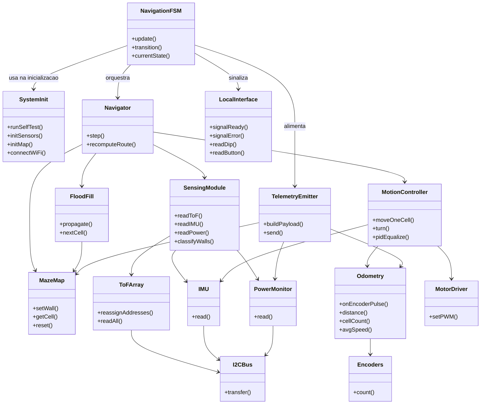
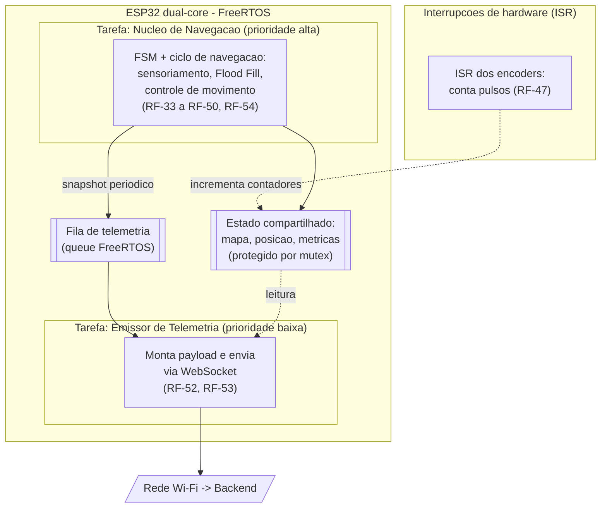
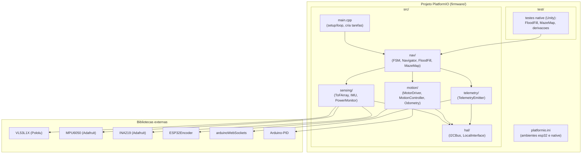

# Arquitetura do Firmware - Visões Lógica, de Processos e de Implementação (4+1)

- **Atividade:** 3.2 - Visões do firmware (lógica / processos / implementação)
- **Épico:** Arquitetura da Solução (4+1)
- **Responsável:** Gustavo Oki / Samuel
- **Entrega da etapa (AP5):** 28/09/2026
- **Projeto:** Rato Borrachudo
- **Grupo 1 - PI1 2026/2**

---

## 1. Contexto e escopo

Este documento apresenta **três das cinco visões 4+1** aplicadas ao subsistema de **firmware** (ESP32): **lógica**, **de processos** e **de implementação**. As visões de **dados** (MER/DER) e de **implantação** são tratadas nas atividades 3.3 e 3.5, respectivamente. As decisões de stack são as do documento `arquitetura-stack.md`: C++ com **PlatformIO/Arduino-ESP32 sobre FreeRTOS**, arquitetura de **monólito modular em camadas** (tendo a máquina de estados finita (FSM) como núcleo de controle e tarefas FreeRTOS para o paralelismo) e bibliotecas dedicadas de sensores/atuadores.

Os diagramas estão em **Mermaid**, renderizado nativamente pelo GitHub.

## 2. Visão Lógica

A visão lógica mostra a decomposição do firmware em **módulos/classes** e suas responsabilidades. Trata-se de um **monólito modular em camadas**: **HAL/Drivers** (acesso ao hardware) -> **Domínio** (sensoriamento, mapa, navegação, movimento, odometria, telemetria) -> **Controle** (máquina de estados e inicialização).

**Responsabilidades e rastreabilidade:**

| Módulo                                                                               | Responsabilidade                                                                             | RF                   |
| :----------------------------------------------------------------------------------- | :------------------------------------------------------------------------------------------- | :------------------- |
| SystemInit                                                                           | Auto-teste, reendereçamento ToF, verificação IMU/INA219, leitura do DIP, mapa inicial, Wi-Fi | RF-27 a RF-31, RF-51 |
| NavigationFSM                                                                        | Máquina de estados; sinalização de prontidão/erro                                            | RF-32, RF-54, RF-55  |
| SensingModule                                                                        | Leitura dos ToF/IMU/INA219 e classificação de paredes                                        | RF-33 a RF-36        |
| MazeMap                                                                              | Estado do mapa e paredes (bidirecional)                                                      | RF-31, RF-37         |
| FloodFill                                                                            | Propagação de valores e escolha da próxima célula                                            | RF-38, RF-39, RF-40  |
| Navigator                                                                            | Orquestra o ciclo de navegação e o recálculo de rota                                         | RF-40, RF-41         |
| MotionController                                                                     | PWM, PID, correção de trajetória, curvas                                                     | RF-42 a RF-46        |
| Odometry                                                                             | Pulsos -> distância, células, velocidade média                                               | RF-47 a RF-50        |
| TelemetryEmitter                                                                     | Monta e envia a carga útil (emissor unidirecional)                                           | RF-52, RF-53         |
| Drivers (ToFArray, IMU, PowerMonitor, MotorDriver, Encoders, LocalInterface, I2CBus) | Acesso ao hardware                                                                           | -                    |

## 3. Visão de Processos

O ESP32 é _dual-core_ e roda FreeRTOS. O firmware separa **duas tarefas** e as **interrupções de encoder**, para garantir tempo real na navegação e o **isolamento entre navegação e telemetria** (RNF-33): a telemetria apenas **lê** o estado compartilhado e **envia**, nunca bloqueando ou influenciando a navegação.

**Características dos processos:**

- **Núcleo de Navegação (alta prioridade):** executa a FSM e o ciclo de sensoriamento -> mapeamento -> Flood Fill -> movimento em cadência determinística. É o caminho crítico de tempo real.
- **Emissor de Telemetria (baixa prioridade):** consome _snapshots_ de uma fila e lê o estado compartilhado para montar e enviar a carga útil. Se o Wi-Fi cair, esta tarefa apenas acumula/descarta sem afetar a navegação (RNF-33); a telemetria retoma sozinha ao reconectar.
- **ISR dos encoders:** rotinas de interrupção contam pulsos sem perda mesmo em alta velocidade (RF-47), atualizando contadores no estado compartilhado.
- **Sincronização:** _queue_ FreeRTOS para os _snapshots_ e _mutex_ para o estado compartilhado, evitando condição de corrida entre as tarefas e a ISR.

## 4. Visão de Implementação

A visão de implementação mostra a organização física do código no repositório (projeto PlatformIO), os módulos-fonte e as dependências externas.

**Organização e build:**

- **`platformio.ini`** define dois ambientes: **`esp32`** (build/upload para a placa) e **`native`** (testes de lógica no PC, sem hardware).
- **`src/`** agrupa os módulos por responsabilidade (espelhando a visão lógica), com a camada `hal/` isolando o acesso ao hardware - o que permite testar `nav/` (Flood Fill, mapa) no ambiente _native_.
- **`test/`** contém os testes automatizados (Unity), executáveis via `pio test -e native`, alinhados aos casos CT-FW-12, CT-FW-13 e CT-FW-32 do roteiro de testes (`4.4.6`).
- **Dependências** são declaradas no `platformio.ini` (`lib_deps`) e resolvidas pelo gerenciador do PlatformIO.

## 5. Rastreabilidade (visão -> requisitos)

| Visão                                  | Requisitos que fundamentam                    |
| :------------------------------------- | :-------------------------------------------- |
| Lógica (decomposição em módulos)       | RF-27 a RF-56 (mapeados na tabela da seção 2) |
| Processos (tarefas + ISR + isolamento) | RF-47, RF-52, RF-53, RF-54, RNF-33            |
| Implementação (estrutura e testes)     | RNF-53 (testabilidade), decisões do `4.4.5`   |

## 6. Observações para a integração (atividade 3.5)

- Estas visões conectam-se ao restante do sistema por um único ponto: o **TelemetryEmitter** envia, via WebSocket, para o **backend**.
- A **visão de dados** (3.3) não se aplica ao firmware (estado em memória, sem banco); o firmware apenas **produz** a carga útil que o backend persiste.
