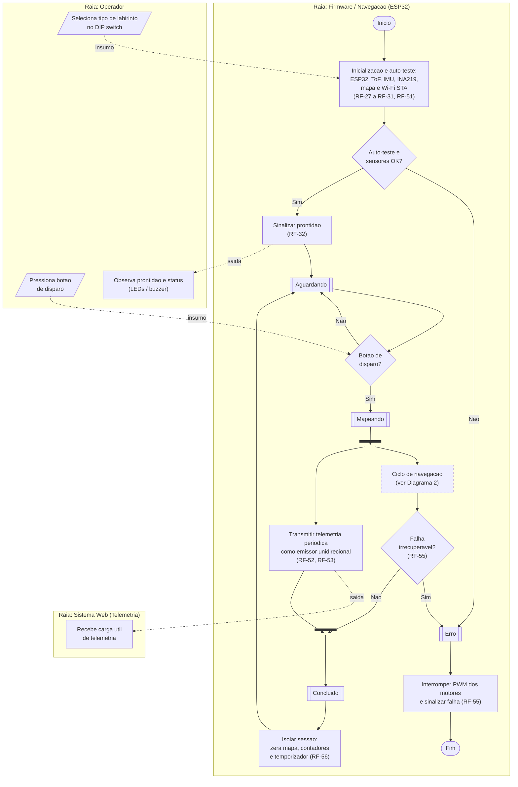
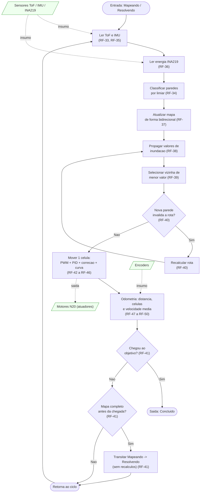
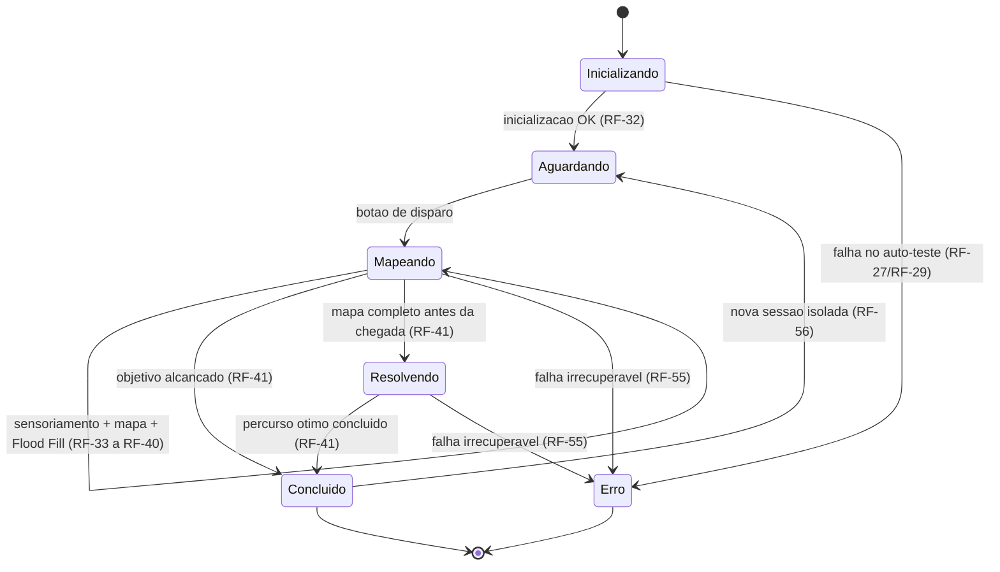

# Diagrama de Atividades - Raia do Firmware / Navegação

- **Atividade:** 2.1 - Modelar a raia do firmware/navegação - [issue #246](https://github.com/fcte-pi1/2026.2_PI1_Grupo1_Diogo/issues/246)
- **Épico:** Diagrama de Atividades UML
- **Responsável:** Gustavo Oki / Samuel
- **Entrega da etapa (AP5):** 28/09/2026
- **Projeto:** Rato Borrachudo
- **Grupo 1 - PI1 2026/2**

---

## 1. Escopo

Este documento modela a **raia (_swimlane_) do firmware embarcado no ESP32** dentro do Diagrama de Atividades UML do sistema. Ele descreve o fluxo de comportamento da navegação autônoma - da inicialização à conclusão da tentativa - e as trocas com os atores vizinhos (**Operador** e **Sistema Web**). Esta raia será integrada às demais (backend, frontend/operador) na **atividade 2.4 - Consolidar diagrama único**.

Os diagramas estão em **Mermaid**, renderizado nativamente pelo GitHub ao visualizar o arquivo `.md`. São três:

- **Diagrama 1 - Visão geral com raias:** o fluxo macro do firmware e suas trocas com Operador e Sistema Web, com bifurcação/sincronização (_fork/join_) da telemetria.
- **Diagrama 2 - Ciclo de navegação (detalhe):** a expansão da atividade "Ciclo de navegação" (sensoriamento -> mapa -> Flood Fill -> movimento -> odometria).
- **Diagrama 3 - Máquina de estados de navegação:** visão complementar dos seis estados (RF-54).

## 2. Notação adotada (mapeamento UML -> Mermaid)

| Elemento UML de atividade                              | Representação no Mermaid                        |
| :----------------------------------------------------- | :---------------------------------------------- |
| Estado inicial / final                                 | Nó estádio `([ ])` - "Início" / "Fim"           |
| Ação / atividade                                       | Retângulo `[ ]`                                 |
| Estado de navegação                                    | Sub-rotina `[[ ]]`                              |
| Nó de decisão                                          | Losango `{ }`                                   |
| Bifurcação / sincronização (_fork/join_)               | Barra escura (`:::bar`)                         |
| Insumo (entrada) / resultado (saída) - fluxo de objeto | Seta tracejada `-. insumo .->` / `-. saída .->` |
| Fluxo de controle                                      | Seta sólida `-->`                               |
| Raia (_swimlane_)                                      | `subgraph` por ator                             |

## 3. Diagrama 1 - Visão geral com raias

> A barra após **Mapeando** é a **bifurcação (_fork_)**: a navegação e a transmissão de telemetria correm em paralelo. A barra antes de **Concluído** é a **sincronização (_join_)**. Conforme o RNF-33, a telemetria é isolada da navegação - uma falha de Wi-Fi **não** leva ao estado Erro nem interrompe a navegação.

## 4. Diagrama 2 - Ciclo de navegação (detalhe da raia do firmware)

Expansão da atividade "Ciclo de navegação". Vale para os estados **Mapeando** e **Resolvendo**; a diferença é que, em Resolvendo, o recálculo de rota (decisão de nova parede) é ignorado, pois o percurso ótimo já está definido.

## 5. Diagrama 3 - Máquina de estados de navegação (complementar)

Os seis estados definidos no RF-54 e suas transições autorizadas.

## 6. Descrição do fluxo

### **Inicialização.**

Ao ligar, o firmware executa o auto-teste do ESP32 e dos GPIO, reendereça os sete ToF no barramento I2C, verifica IMU e INA219, lê o tipo de labirinto no DIP switch (insumo do Operador), inicializa o mapa com a inundação inicial e conecta o Wi-Fi em modo estação. Se algo falhar, transita direto para **Erro**. Caso contrário, sinaliza prontidão (saída para o Operador via LED/buzzer) e entra em **Aguardando**.

### **Disparo e paralelismo.**

Ao receber o botão de disparo (insumo do Operador), entra em **Mapeando** e ocorre a **bifurcação**: o _Ciclo de navegação_ e a _transmissão de telemetria_ passam a correr em paralelo. A telemetria é emissora unidirecional e isolada da navegação (RNF-33).

### **Ciclo de navegação (Diagrama 2).**

A cada iteração o firmware lê os sensores, classifica as paredes por limiar, atualiza o mapa, propaga os valores de inundação (Flood Fill), seleciona a próxima célula de menor valor e move-se uma célula (saída para os motores). Se uma nova parede invalida a rota, recalcula antes de mover. Ao completar o mapa antes de chegar, transita para **Resolvendo** e executa o percurso ótimo sem novos recálculos. Ao alcançar o objetivo, sai do ciclo.

### **Encerramento.**

A **sincronização** reúne navegação e telemetria em **Concluído**; em seguida a sessão é isolada (zera mapa, contadores e temporizador) e o robô retorna a **Aguardando** para uma nova tentativa. Uma falha irrecuperável detectada durante a operação leva a **Erro**, que interrompe todos os PWM dos motores e sinaliza a condição.

## 7. Rastreabilidade (atividade -> RF)

| Atividade no diagrama                           | RF                                       |
| :---------------------------------------------- | :--------------------------------------- |
| Inicialização e auto-teste                      | RF-27, RF-28, RF-29, RF-30, RF-31, RF-51 |
| Sinalizar prontidão / Aguardando                | RF-32                                    |
| Ler ToF e IMU / energia                         | RF-33, RF-35, RF-36                      |
| Classificar paredes                             | RF-34                                    |
| Atualizar mapa                                  | RF-37                                    |
| Flood Fill (propagar / selecionar / recalcular) | RF-38, RF-39, RF-40                      |
| Encerramento de mapeamento / Resolvendo         | RF-41                                    |
| Mover 1 célula (PWM, PID, correção, curva)      | RF-42, RF-43, RF-44, RF-45, RF-46        |
| Odometria                                       | RF-47, RF-48, RF-49, RF-50               |
| Telemetria (paralela)                           | RF-52, RF-53                             |
| Máquina de estados                              | RF-54                                    |
| Detecção de falha / Erro                        | RF-55                                    |
| Isolamento entre sessões                        | RF-56                                    |
