```mermaid
graph LR
    %% === RAIZ ===
    GF000["G-F000: Controlar autonomamente o robô para explorar e resolver o labirinto, alcançando a Célula Objetivo com geração contínua de Telemetria"]

    GF000 -->|AND| GF001["G-F001: Inicializar todos os periféricos e configurar o sistema antes de qualquer Sessão de Resolução"]
    GF000 -->|AND| GF002["G-F002: Detectar e classificar o estado das Paredes da Célula atual via sensoriamento periódico"]
    GF000 -->|AND| GF003["G-F003: Mapear e navegar o labirinto por meio do Algoritmo Flood Fill"]
    GF000 -->|AND| GF004["G-F004: Controlar velocidade e alinhamento dos motores durante deslocamentos e manobras"]
    GF000 -->|AND| GF005["G-F005: Estimar deslocamento, velocidade e posição discreta por Odometria"]
    GF000 -->|AND| GF006["G-F006: Transmitir Telemetria em tempo real via Wi-Fi ao sistema web"]
    GF000 -->|AND| GF007["G-F007: Gerenciar a máquina de Estados de Navegação ao longo do ciclo de execução"]

    %% === G-F001: Inicialização ===
    GF001 -->|AND| GF001_1["G-F001.1: Executar auto-teste do ESP32 ao boot"]
    GF001 -->|AND| GF001_2["G-F001.2: Realizar Reendereçamento de Sensores ToF no Barramento I²C"]
    GF001 -->|AND| GF001_3["G-F001.3: Verificar comunicação com IMU MPU-6050 e INA219"]
    GF001 -->|AND| GF001_4["G-F001.4: Ler DIP Switch e determinar Tipo de Labirinto e posição da Célula Objetivo"]
    GF001 -->|AND| GF001_5["G-F001.5: Construir estrutura inicial do Mapa do Labirinto na memória do ESP32"]
    GF001 -->|AND| GF001_6["G-F001.6: Sinalizar prontidão via Buzzer de Depuração e LED e transitar para estado Aguardando"]

    %% === G-F002: Sensoriamento ===
    GF002 -->|AND| GF002_1["G-F002.1: Realizar leituras periódicas dos 7 sensores ToF VL53L1X via Barramento I²C"]
    GF002 -->|AND| GF002_2["G-F002.2: Aplicar Limiar de Detecção de Parede para classificar cada face da Célula atual"]
    GF002 -->|AND| GF002_3["G-F002.3: Ler dados do giroscópio e do acelerômetro do IMU MPU-6050"]
    GF002 -->|AND| GF002_4["G-F002.4: Ler dados de tensão, corrente e potência do INA219"]

    %% === G-F003: Mapeamento e Navegação ===
    GF003 -->|AND| GF003_1["G-F003.1: Atualizar o Mapa do Labirinto com cada nova Parede detectada"]
    GF003 -->|AND| GF003_2["G-F003.2: Calcular e propagar Valores de Inundação a partir da Célula Objetivo"]
    GF003 -->|AND| GF003_3["G-F003.3: Selecionar a próxima Célula de menor Valor de Inundação a cada passo"]
    GF003 -->|AND| GF003_4["G-F003.4: Executar Recálculo de Rota ao detectar Parede que invalide o caminho corrente"]
    GF003 -->|AND| GF003_5["G-F003.5: Encerrar fase de Mapeamento ao alcançar a Célula Objetivo"]

    %% === G-F004: Controle de Motores ===
    GF004 -->|AND| GF004_1["G-F004.1: Gerar sinais PWM via canais LEDC do ESP32 para os Motores DC N20 via DRV8833"]
    GF004 -->|AND| GF004_2["G-F004.2: Executar malha Controle PID para equalizar velocidades em deslocamento em linha reta"]
    GF004 -->|AND| GF004_3["G-F004.3: Aplicar Correção de Trajetória com base nos sensores ToF laterais e no IMU"]
    GF004 -->|AND| GF004_4["G-F004.4: Monitorar e controlar Ângulo de Curva via giroscópio do IMU durante manobras"]
    GF004 -->|AND| GF004_5["G-F004.5: Autorizar avanço para próxima Célula somente após atingir a rotação-alvo da curva"]

    %% === G-F005: Odometria ===
    GF005 -->|AND| GF005_1["G-F005.1: Capturar pulsos dos Encoders dos Motores DC N20 via interrupção de hardware"]
    GF005 -->|AND| GF005_2["G-F005.2: Converter contagem de pulsos em distância percorrida em milímetros"]
    GF005 -->|AND| GF005_3["G-F005.3: Incrementar Contador de Células a cada transição completa de Célula"]
    GF005 -->|AND| GF005_4["G-F005.4: Calcular Velocidade Média da Sessão de Resolução corrente"]

    %% === G-F006: Telemetria ===
    GF006 -->|AND| GF006_1["G-F006.1: Configurar módulo Wi-Fi no modo estação durante a Inicialização"]
    GF006 -->|AND| GF006_2["G-F006.2: Transmitir continuamente a carga útil de Telemetria ao sistema web durante toda Sessão de Resolução"]
    GF006 -->|AND| GF006_3["G-F006.3: Garantir transmissão unidirecional sem processar comandos externos do sistema web"]

    %% === G-F007: Estados de Navegação ===
    GF007 -->|AND| GF007_1["G-F007.1: Implementar máquina de estados com os seis Estados de Navegação definidos"]
    GF007 -->|AND| GF007_2["G-F007.2: Detectar falhas em sensores ou atuadores e transitar para estado Erro com sinalização"]
    GF007 -->|AND| GF007_3["G-F007.3: Exigir retorno ao estado Aguardando antes de iniciar nova Sessão de Resolução"]

    %% === Obstáculos ===
    OBSF001{{"OBS-F001: Falha de sensor ToF durante o Reendereçamento de Sensores"}}
    OBSF002{{"OBS-F002: Limiar de Detecção de Parede mal calibrado gerando falsa detecção ou omissão de Parede"}}
    OBSF003{{"OBS-F003: Deriva acumulada do giroscópio do IMU em manobras repetidas comprometendo o Ângulo de Curva"}}
    OBSF004{{"OBS-F004: Erro acumulado de Odometria por escorregamento de rodas"}}
    OBSF005{{"OBS-F005: Perda ou instabilidade de conexão Wi-Fi durante a Sessão de Resolução"}}
    OBSF006{{"OBS-F006: Empate de Valores de Inundação entre células vizinhas acessíveis tornando a seleção não determinística"}}
    OBSF007{{"OBS-F007: Alteração acidental do DIP Switch após o boot induzindo expectativa de mudança de Tipo de Labirinto"}}

    OBSF001 -.->|Obstrui| GF001_2
    OBSF002 -.->|Obstrui| GF002_2
    OBSF003 -.->|Obstrui| GF004_4
    OBSF004 -.->|Obstrui| GF005_2
    OBSF005 -.->|Obstrui| GF006_2
    OBSF006 -.->|Obstrui| GF003_3
    OBSF007 -.->|Obstrui| GF001_4

    %% === Estilo ===
    classDef rootGoal fill:#d0dbe5,stroke:#1a252f,color:#1a252f,font-weight:bold;
    classDef goal fill:#ecf0f1,stroke:#bdc3c7,color:#2c3e50;
    classDef obstacle fill:#e74c3c,stroke:#c0392b,color:#fff;

    class GF000 rootGoal;
    class GF001,GF002,GF003,GF004,GF005,GF006,GF007 goal;
    class GF001_1,GF001_2,GF001_3,GF001_4,GF001_5,GF001_6 goal;
    class GF002_1,GF002_2,GF002_3,GF002_4 goal;
    class GF003_1,GF003_2,GF003_3,GF003_4,GF003_5 goal;
    class GF004_1,GF004_2,GF004_3,GF004_4,GF004_5 goal;
    class GF005_1,GF005_2,GF005_3,GF005_4 goal;
    class GF006_1,GF006_2,GF006_3 goal;
    class GF007_1,GF007_2,GF007_3 goal;
    class OBSF001,OBSF002,OBSF003,OBSF004,OBSF005,OBSF006,OBSF007 obstacle;
```

# Metas (KAOS) — Firmware do Robô

**Versão:** 1.0
**Escopo:** Modelo de metas KAOS do firmware embarcado no ESP32, cobrindo os oito módulos: Inicialização, Sensoriamento, Mapeamento, Navegação, Controle de Motores, Odometria, Telemetria e Interface Local. Todos os termos seguem o Glossário do Firmware v1.0. Referências a componentes de hardware, dimensionamento de energia e estrutura mecânica aparecem apenas como contexto — suas definições autoritativas residem nos documentos das respectivas frentes.

> **Nota de modelagem:** o firmware possui uma única meta estratégica raiz — **G-F000** — que expressa sua missão completa: controlar autonomamente o robô desde o estado inicial até o alcance da Célula Objetivo, com geração contínua de Telemetria. As sete submetas AND de primeiro nível correspondem diretamente aos grandes blocos funcionais do firmware, alinhados com os módulos do Glossário. O refinamento de cada bloco resulta em metas operacionais candidatas a Requisitos Funcionais na próxima fase do projeto.

---

---

## Meta Raiz

### G-F000

- **Descrição:** O firmware executado no ESP32 deve controlar de forma autônoma o robô seguidor de labirinto, realizando a exploração e a resolução do labirinto a partir da Célula de origem até o alcance da Célula Objetivo, com transmissão contínua de Telemetria ao sistema web externo ao longo de toda Sessão de Resolução.
- **`<` Backward:** — (meta raiz)
- **`>` Forward:** G-F001, G-F002, G-F003, G-F004, G-F005, G-F006, G-F007
- **Tipo:** Estratégica
- **Refinamento:** AND

---

## Inicialização do Sistema

### G-F001

- **Descrição:** Preparar o robô para operação antes de qualquer Sessão de Resolução, verificando a integridade de todos os periféricos sensoriais e de atuação, carregando a configuração selecionada pelo operador via DIP Switch e sinalizando prontidão antes de qualquer movimento autônomo.
- **`<` Backward:** G-F000
- **`>` Forward:** G-F001.1, G-F001.2, G-F001.3, G-F001.4, G-F001.5, G-F001.6
- **Tipo:** Tática
- **Refinamento:** AND
- **Módulos Associados:** Inicialização, Interface Local

### G-F001.1

- **Descrição:** Verificar o funcionamento básico do microcontrolador ESP32 e a configuração correta dos pinos GPIO no momento do boot, antes de qualquer operação com periféricos externos. Falhas nesta etapa devem impedir o prosseguimento da Inicialização.
- **`<` Backward:** G-F001
- **`>` Forward:** RF-001
- **Agente:** Firmware (ESP32)

### G-F001.2

- **Descrição:** Atribuir endereços I²C únicos e distintos a cada um dos sete sensores ToF VL53L1X, contornando o fato de todos saírem de fábrica com o mesmo endereço padrão (0x29). O firmware deve desativar todos os sensores via pinos XSHUT, ativá-los individualmente e gravar um novo endereço em cada um, confirmando comunicação no Barramento I²C após cada atribuição. A falha em qualquer etapa deste procedimento deve transitar o firmware para o Estado de Navegação `Erro`.
- **`<` Backward:** G-F001
- **`>` Forward:** RF-002; G-F007.2 (em caso de falha)
- **Obstáculo:** OBS-F001
- **Agente:** Firmware (ESP32)

### G-F001.3

- **Descrição:** Confirmar que o IMU MPU-6050 e o INA219 respondem corretamente no Barramento I²C após a energização, validando a comunicação com ambos antes de qualquer leitura de dados sensoriais. A ausência de resposta de qualquer um dos dois deve transitar o firmware para o Estado de Navegação `Erro`.
- **`<` Backward:** G-F001
- **`>` Forward:** RF-003; G-F007.2 (em caso de falha)
- **Agente:** Firmware (ESP32)

### G-F001.4

- **Descrição:** Ler o estado das chaves do DIP Switch via GPIO do ESP32 durante a Inicialização para determinar o Tipo de Labirinto selecionado pelo operador, definindo as dimensões da grade do Mapa do Labirinto e a posição da Célula Objetivo a ser utilizada em toda a Sessão de Resolução subsequente. O DIP Switch não é relido após a conclusão da Inicialização — alterações durante a Sessão de Resolução são ignoradas pelo firmware.
- **`<` Backward:** G-F001
- **`>` Forward:** G-F001.5 (fornece a posição da Célula Objetivo); RF-004, RNF-005
- **Obstáculo:** OBS-F007
- **Agente:** Firmware (ESP32) / Operador (seleciona o tipo antes do boot)

### G-F001.5

- **Descrição:** Alocar na memória do ESP32 a estrutura matricial do Mapa do Labirinto com dimensões derivadas do Tipo de Labirinto lido em G-F001.4, inicializando todas as Paredes internas com estado `desconhecida` e o perímetro externo com estado `presente`. Em seguida, calcular os Valores de Inundação iniciais propagando a partir da Célula Objetivo (Valor 0), com todas as paredes internas ainda desconhecidas tratadas como ausentes para fins do cálculo inicial.
- **`<` Backward:** G-F001
- **`>` Forward:** G-F003.1 (estrutura disponível para atualização); G-F003.2 (valores iniciais disponíveis para navegação); RF-005
- **Agente:** Firmware (ESP32)

### G-F001.6

- **Descrição:** Após a conclusão bem-sucedida de todos os passos anteriores da Inicialização, acionar o Buzzer de Depuração e os LEDs para informar ao operador que o robô está pronto para operar. O firmware deve então transitar para o Estado de Navegação `Aguardando`, onde permanece parado até receber o sinal de início da Sessão de Resolução.
- **`<` Backward:** G-F001
- **`>` Forward:** G-F007.1 (dispara transição para `Aguardando`); RF-006
- **Agente:** Firmware (ESP32)

---

## Sensoriamento

### G-F002

- **Descrição:** Coletar dados dos sensores ToF VL53L1X, do IMU MPU-6050 e do INA219 periodicamente durante toda a operação do robô, fornecendo a base de informação para detecção de Paredes, controle de manobras, Correção de Trajetória e geração dos dados incluídos na Telemetria.
- **`<` Backward:** G-F000
- **`>` Forward:** G-F002.1, G-F002.2, G-F002.3, G-F002.4
- **Tipo:** Tática
- **Refinamento:** AND
- **Módulos Associados:** Sensoriamento

### G-F002.1

- **Descrição:** Executar leituras temporizadas e sequenciais dos sete sensores ToF VL53L1X via Barramento I²C a cada ciclo de sensoriamento, cobrindo as posições frontal, duas laterais, duas diagonais e dois adicionais, para obter medidas de distância em milímetros a partir de cada direção ao redor da Célula atual.
- **`<` Backward:** G-F002
- **`>` Forward:** G-F002.2 (dados brutos para classificação); RF-007
- **Agente:** Firmware (ESP32) / Sensor ToF (VL53L1X)

### G-F002.2

- **Descrição:** Comparar cada leitura de distância obtida em G-F002.1 com o Limiar de Detecção de Parede configurado para aquela posição específica de sensor. Leituras abaixo do Limiar resultam em classificação `presente`; leituras acima, em `ausente`. Um Limiar mal calibrado pode causar falsas detecções ou omissões de Parede, comprometendo diretamente a integridade do Mapa do Labirinto e o Recálculo de Rota.
- **`<` Backward:** G-F002
- **`>` Forward:** G-F003.1 (resultado alimenta a atualização do Mapa do Labirinto); RF-008, RNF-001
- **Obstáculo:** OBS-F002
- **Agente:** Firmware (ESP32)

### G-F002.3

- **Descrição:** Coletar leituras do giroscópio de três eixos e do acelerômetro de três eixos do MPU-6050 via Barramento I²C a cada ciclo de sensoriamento. Os dados do giroscópio são consumidos por G-F004.4 para medir o Ângulo de Curva durante manobras; os dados do acelerômetro são consumidos por G-F004.3 como sinal auxiliar na Correção de Trajetória durante deslocamentos em linha reta.
- **`<` Backward:** G-F002
- **`>` Forward:** G-F004.3 (acelerômetro → Correção de Trajetória), G-F004.4 (giroscópio → Ângulo de Curva); RF-009
- **Agente:** Firmware (ESP32) / IMU (MPU-6050)

### G-F002.4

- **Descrição:** Coletar periodicamente as medições de tensão no barramento da bateria LiPo, corrente drenada pelo sistema e potência instantânea do INA219 via Barramento I²C. Esses três valores são incluídos na carga útil de Telemetria transmitida em G-F006.2, atendendo ao requisito explícito de exibição de consumo de bateria em tempo real no sistema web.
- **`<` Backward:** G-F002
- **`>` Forward:** G-F006.2 (dados alimentam a carga útil de Telemetria); RF-010
- **Agente:** Firmware (ESP32) / INA219

---

## Mapeamento e Navegação

### G-F003

- **Descrição:** Manter o Mapa do Labirinto atualizado com as Paredes detectadas, calcular e propagar os Valores de Inundação para todas as Células, e determinar a cada passo de navegação a Célula vizinha de menor custo até a Célula Objetivo, executando Recálculos de Rota sempre que uma nova Parede invalide o caminho corrente.
- **`<` Backward:** G-F000
- **`>` Forward:** G-F003.1, G-F003.2, G-F003.3, G-F003.4, G-F003.5
- **Tipo:** Tática
- **Refinamento:** AND
- **Módulos Associados:** Navegação, Mapeamento

### G-F003.1

- **Descrição:** A cada nova Parede classificada por G-F002.2, registrar o estado `presente` ou `ausente` na face correspondente (Norte, Sul, Leste ou Oeste) da Célula atual no Mapa do Labirinto, garantindo consistência bidirecional: uma Parede entre as Células A e B deve ser registrada simultaneamente como atributo de ambas as Células.
- **`<` Backward:** G-F003
- **`>` Forward:** G-F003.2 (alteração no mapa dispara recálculo de Valores de Inundação), G-F003.4 (nova Parede pode disparar Recálculo de Rota); RF-011
- **Agente:** Firmware (ESP32)

### G-F003.2

- **Descrição:** Propagar a partir da Célula Objetivo (Valor de Inundação 0) os Valores de Inundação de todas as Células do Mapa do Labirinto, incrementando em 1 a cada Célula adjacente sem Parede `presente` interposta. O cálculo deve ser executado integralmente na Inicialização (sobre o mapa inicial) e após cada atualização disparada por G-F003.1 que resulte em novos valores para células afetadas.
- **`<` Backward:** G-F003
- **`>` Forward:** G-F003.3 (valores disponíveis para seleção da próxima célula); RF-012
- **Agente:** Firmware (ESP32)

### G-F003.3

- **Descrição:** A cada passo de navegação, entre todas as Células vizinhas da Célula atual que sejam acessíveis (sem Parede `presente` interposta), selecionar aquela com menor Valor de Inundação como destino do próximo movimento. Em caso de empate entre dois ou mais vizinhos com o mesmo Valor de Inundação, aplicar critério de desempate determinístico pré-definido para garantir comportamento previsível e reproduzível.
- **`<` Backward:** G-F003
- **`>` Forward:** G-F004.1 (determina a manobra a ser executada pelos motores); RF-013, RNF-002
- **Obstáculo:** OBS-F006
- **Agente:** Firmware (ESP32)

### G-F003.4

- **Descrição:** Quando a detecção de uma nova Parede (G-F003.1) invalida o caminho que o robô estava seguindo, interromper o movimento, registrar a nova Parede no Mapa do Labirinto, acionar o recálculo de todos os Valores de Inundação afetados (G-F003.2) e determinar nova direção de menor Valor de Inundação (G-F003.3) antes de retomar o deslocamento.
- **`<` Backward:** G-F003
- **`>` Forward:** G-F003.2 (aciona recálculo), G-F003.3 (nova seleção de Célula após recálculo); RF-014
- **Agente:** Firmware (ESP32)

### G-F003.5

- **Descrição:** Detectar quando o robô ocupa a Célula Objetivo comparando a posição corrente (derivada da Odometria e do Contador de Células) com a posição da Célula Objetivo carregada na Inicialização. Ao confirmar a chegada, transitar o Estado de Navegação de `Mapeando` para `Concluído`. Se o mapa estiver completo antes da chegada à Célula Objetivo, transitar de `Mapeando` para `Resolvendo` e executar o percurso ótimo sem novos Recálculos de Rota.
- **`<` Backward:** G-F003
- **`>` Forward:** G-F007.1 (dispara transição de estado); RF-015
- **Agente:** Firmware (ESP32)

---

## Controle de Motores

### G-F004

- **Descrição:** Gerar os sinais PWM para os Motores DC N20 via Driver de Motor DRV8833, executar a malha Controle PID para manter velocidades iguais em deslocamentos em linha reta, aplicar Correção de Trajetória para manter o alinhamento direcional dentro da Célula e garantir precisão angular durante manobras de curva com base no Ângulo de Curva lido pelo giroscópio do IMU.
- **`<` Backward:** G-F000
- **`>` Forward:** G-F004.1, G-F004.2, G-F004.3, G-F004.4, G-F004.5
- **Tipo:** Tática
- **Refinamento:** AND
- **Módulos Associados:** Controle de Motores, Sensoriamento

### G-F004.1

- **Descrição:** Configurar os canais LEDC do ESP32 com frequência de PWM fixa, definida na Inicialização e mantida constante durante toda a operação. Gerar, a cada ciclo de controle, sinais PWM de duty cycle variável para cada canal do Driver de Motor DRV8833, controlando direção e velocidade de cada Motor DC N20 de forma independente por meio dos pinos IN1/IN2 de cada canal do DRV8833.
- **`<` Backward:** G-F004
- **`>` Forward:** RF-016
- **Agente:** Firmware (ESP32) / Driver de Motor (DRV8833)

### G-F004.2

- **Descrição:** Durante a travessia em linha reta de uma Célula, executar a malha Controle PID utilizando como sinal de erro a diferença de contagem de pulsos entre os Encoders dos dois motores de tração, ajustando dinamicamente o duty cycle de cada canal PWM a cada ciclo de controle para equalizar as velocidades dos dois motores e compensar assimetrias mecânicas ou de atrito.
- **`<` Backward:** G-F004
- **`>` Forward:** RF-017
- **Agente:** Firmware (ESP32)

### G-F004.3

- **Descrição:** Durante a travessia em linha reta, comparar as leituras dos sensores ToF laterais para medir o desvio lateral do robô em relação ao eixo da Célula e, opcionalmente, usar dados do acelerômetro do IMU como sinal auxiliar. Com base nesse erro direcional, ajustar o diferencial de velocidade entre os motores para manter o robô alinhado dentro da Célula, atuando de forma complementar ao Controle PID de velocidade de G-F004.2.
- **`<` Backward:** G-F004
- **`>` Forward:** RF-018
- **Agente:** Firmware (ESP32)

### G-F004.4

- **Descrição:** Durante manobras de 90° ou 180°, ler continuamente o giroscópio do IMU MPU-6050 para integrar o Ângulo de Curva acumulado desde o início da manobra. O firmware controla os motores durante a curva para que a rotação executada converja para o valor-alvo (90° ou 180°) dentro da tolerância calibrada, impedindo que acúmulo de erro de manobra em manobra desalinhasse progressivamente o robô com a grade do labirinto.
- **`<` Backward:** G-F004
- **`>` Forward:** G-F004.5 (o valor do Ângulo de Curva é verificado pela meta seguinte); RF-019, RNF-004
- **Obstáculo:** OBS-F003
- **Agente:** Firmware (ESP32) / IMU (MPU-6050)

### G-F004.5

- **Descrição:** Ao final de cada manobra de curva, verificar se o Ângulo de Curva acumulado, medido pelo giroscópio do IMU, atingiu o valor-alvo dentro da tolerância calibrada. Somente após essa condição ser satisfeita o firmware autoriza o avanço para a próxima Célula. Sem essa verificação, o robô poderia prosseguir desalinhado com o eixo da nova Célula, comprometendo toda a navegação subsequente.
- **`<` Backward:** G-F004
- **`>` Forward:** G-F003.3 (retorna o controle à seleção da próxima Célula); RF-020
- **Agente:** Firmware (ESP32)

---

## Odometria

### G-F005

- **Descrição:** Capturar os pulsos dos Encoders acoplados aos Motores DC N20 para estimar distância percorrida, posição discreta no labirinto (Contador de Células) e Velocidade Média da Sessão de Resolução, fornecendo dados tanto ao Controle PID (G-F004.2) quanto à carga útil de Telemetria (G-F006.2).
- **`<` Backward:** G-F000
- **`>` Forward:** G-F005.1, G-F005.2, G-F005.3, G-F005.4
- **Tipo:** Tática
- **Refinamento:** AND
- **Módulos Associados:** Odometria, Telemetria

### G-F005.1

- **Descrição:** Registrar cada pulso gerado pelos Encoders acoplados aos eixos dos Motores DC N20 por meio de rotinas de interrupção de hardware nos pinos GPIO do ESP32, garantindo que nenhum pulso seja perdido em condições de alta velocidade ou de grande carga de processamento.
- **`<` Backward:** G-F005
- **`>` Forward:** G-F005.2 (pulsos acumulados são convertidos em distância); G-F004.2 (diferença de pulsos alimenta o sinal de erro do PID); RF-021
- **Agente:** Firmware (ESP32) / Encoder (Motor DC N20)

### G-F005.2

- **Descrição:** Aplicar a relação (pulsos por revolução × diâmetro da roda) para converter a contagem acumulada de pulsos dos Encoders em distância linear percorrida em milímetros, atualizando o valor a cada ciclo de Odometria. A estimativa acumula erro ao longo do tempo por Odometria, mas é referenciada pelos sensores ToF laterais para compensação parcial de desvio.
- **`<` Backward:** G-F005
- **`>` Forward:** G-F005.3 (distância usada para detectar transição de Célula), G-F005.4 (distância total alimenta cálculo de Velocidade Média); RF-022, RNF-006
- **Obstáculo:** OBS-F004
- **Agente:** Firmware (ESP32)

### G-F005.3

- **Descrição:** Com base nos pulsos acumulados dos Encoders, detectar o momento em que o robô completou a travessia de uma Célula inteira e incrementar o Contador de Células. O valor atualizado do Contador de Células é incluído a cada ciclo na carga útil de Telemetria transmitida ao sistema web.
- **`<` Backward:** G-F005
- **`>` Forward:** G-F006.2 (alimenta a Telemetria); RF-023
- **Agente:** Firmware (ESP32)

### G-F005.4

- **Descrição:** Calcular continuamente, ao longo de toda a Sessão de Resolução corrente, a razão entre a distância total percorrida (derivada de G-F005.2) e o tempo decorrido desde o início da Sessão, obtendo a Velocidade Média. O valor é atualizado a cada ciclo de Telemetria e incluído na carga útil transmitida em G-F006.2. Difere da velocidade instantânea de cada motor, que é usada internamente pelo Controle PID de G-F004.2.
- **`<` Backward:** G-F005
- **`>` Forward:** G-F006.2 (alimenta a Telemetria); RF-024
- **Agente:** Firmware (ESP32)

---

## Telemetria

### G-F006

- **Descrição:** Configurar e manter ativa a interface Wi-Fi integrada ao ESP32 em modo estação, transmitindo unidirecionalmente ao sistema web externo o conjunto completo de dados da carga útil de Telemetria, com continuidade durante toda a Sessão de Resolução, sem que falhas de conectividade interrompam a navegação autônoma do robô.
- **`<` Backward:** G-F000
- **`>` Forward:** G-F006.1, G-F006.2, G-F006.3
- **Tipo:** Tática
- **Refinamento:** AND
- **Módulos Associados:** Telemetria

### G-F006.1

- **Descrição:** Durante a fase de Inicialização, configurar o módulo Wi-Fi integrado ao ESP32 no modo estação (STA), conectando-o à rede definida por parâmetros de compilação. A conexão deve ser estabelecida antes da transição para o Estado de Navegação `Aguardando`. Falha na conexão Wi-Fi na Inicialização não deve impedir o início da Sessão de Resolução, mas deve ser registrada e informada via LED ou Buzzer de Depuração ao operador.
- **`<` Backward:** G-F006
- **`>` Forward:** G-F006.2 (interface disponível para transmissão); RF-025
- **Agente:** Firmware (ESP32)

### G-F006.2

- **Descrição:** Durante toda a Sessão de Resolução, transmitir periodicamente ao sistema web a carga útil de Telemetria contendo: Estado de Navegação atual, Contador de Células percorridas, Velocidade Média, posição corrente no Mapa do Labirinto e dados de energia lidos pelo INA219 (tensão da bateria, corrente drenada e potência instantânea). A transmissão é periódica e contínua; eventuais perdas de pacote individuais são toleradas, mas interrupções prolongadas não devem interferir com o módulo de Navegação.
- **`<` Backward:** G-F006
- **`>` Forward:** RF-026, RNF-003
- **Obstáculo:** OBS-F005
- **Agente:** Firmware (ESP32) / Sistema Web (receptor)

### G-F006.3

- **Descrição:** O módulo Wi-Fi do firmware deve operar exclusivamente como emissor de Telemetria. O firmware não deve processar, interpretar ou responder a mensagens de entrada enviadas pelo sistema web durante a Sessão de Resolução. Nesta versão, nenhuma interface de controle remoto ou atualização de firmware em campo é implementada.
- **`<` Backward:** G-F006
- **`>` Forward:** RF-027
- **Agente:** Firmware (ESP32)

---

## Estados de Navegação

### G-F007

- **Descrição:** Implementar e gerenciar a máquina de estados que governa o comportamento do firmware ao longo de todo o seu ciclo de execução, garantindo transições corretas e determinísticas entre os Estados de Navegação definidos, detecção de falhas irrecuperáveis e isolamento entre Sessões de Resolução consecutivas.
- **`<` Backward:** G-F000
- **`>` Forward:** G-F007.1, G-F007.2, G-F007.3
- **Tipo:** Tática
- **Refinamento:** AND
- **Módulos Associados:** Navegação, Inicialização, Interface Local

### G-F007.1

- **Descrição:** Implementar no firmware os seis Estados de Navegação definidos — `Inicializando`, `Aguardando`, `Mapeando`, `Resolvendo`, `Concluído` e `Erro` — com as transições autorizadas entre eles: `Inicializando` → `Aguardando` (G-F001.6), `Aguardando` → `Mapeando` (sinal de início), `Mapeando` → `Resolvendo` (mapa completo), `Mapeando` ou `Resolvendo` → `Concluído` (G-F003.5), qualquer estado → `Erro` (G-F007.2), `Concluído` ou `Erro` → `Aguardando` (G-F007.3). O Estado de Navegação corrente deve integrar continuamente a carga útil de Telemetria de G-F006.2.
- **`<` Backward:** G-F007
- **`>` Forward:** RF-028
- **Agente:** Firmware (ESP32)

### G-F007.2

- **Descrição:** Monitorar continuamente a integridade dos sensores e atuadores durante a operação. Ao detectar falha irrecuperável — como sensor ToF sem resposta no Barramento I²C após a Inicialização, Encoder sem geração de pulsos esperados durante movimento comandado, ou qualquer condição que impeça a continuidade segura da navegação — transitar imediatamente para o Estado de Navegação `Erro`, interromper todos os sinais PWM para os motores e sinalizar a condição via Buzzer de Depuração e LEDs de Interface Local.
- **`<` Backward:** G-F007
- **`>` Forward:** RF-029
- **Agente:** Firmware (ESP32)

### G-F007.3

- **Descrição:** Garantir que uma nova Sessão de Resolução só possa ser iniciada após o firmware retornar ao Estado de Navegação `Aguardando`, com o Mapa do Labirinto reinicializado (todas as Paredes internas revertidas para `desconhecida`) e o Contador de Células zerado. Isso evita que dados residuais de uma Sessão anterior contaminem a execução da próxima, especialmente em casos de múltiplas tentativas consecutivas.
- **`<` Backward:** G-F007
- **`>` Forward:** G-F001.5 (reinicialização do Mapa do Labirinto ao reiniciar Sessão); RF-030
- **Agente:** Firmware (ESP32) / Operador (aciona o retorno ao estado `Aguardando`)

---

## Síntese de Obstáculos

| ID           | Obstáculo                                                                                                                                                                                                                                                                                                 | Meta Obstruída | Natureza                       | Meta de Resolução                                                                                                                                                                                                                                                                                                                                             |
| ------------ | --------------------------------------------------------------------------------------------------------------------------------------------------------------------------------------------------------------------------------------------------------------------------------------------------------- | -------------- | ------------------------------ | ------------------------------------------------------------------------------------------------------------------------------------------------------------------------------------------------------------------------------------------------------------------------------------------------------------------------------------------------------------- |
| **OBS-F001** | Falha em um ou mais sensores ToF VL53L1X durante o Reendereçamento de Sensores: sensor não responde no endereço I²C gravado ou não é detectado no Barramento após ativação individual.                                                                                                                    | G-F001.2       | Falha de hardware              | G-F007.2: transitar para Estado `Erro` e sinalizar ao operador via Buzzer de Depuração e LEDs, impedindo o início de qualquer Sessão de Resolução com sensor ausente.                                                                                                                                                                                         |
| **OBS-F002** | Limiar de Detecção de Parede mal calibrado para uma ou mais posições de sensor (frontal, lateral, diagonal), causando Paredes classificadas incorretamente como `ausente` (omissão) ou passagens livres classificadas como `presente` (falsa detecção), comprometendo a integridade do Mapa do Labirinto. | G-F002.2       | Risco de calibração            | Procedimento obrigatório de calibração dos Limiares em bancada antes de cada competição, com paredes e iluminação representativas do ambiente real. Não há compensação automática em firmware nesta versão — a calibração correta é pré-condição operacional.                                                                                                 |
| **OBS-F003** | Deriva acumulada do giroscópio do IMU MPU-6050 ao longo de manobras repetidas, causando leituras de Ângulo de Curva progressivamente imprecisas e desalinhamento crescente do robô em relação à grade do labirinto.                                                                                       | G-F004.4       | Limitação intrínseca de sensor | Aplicar fator de correção de deriva estimado na calibração de bancada e resetar a referência angular acumulada após a confirmação de cada manobra concluída, limitando a propagação do erro entre curvas consecutivas.                                                                                                                                        |
| **OBS-F004** | Erro acumulado de Odometria por escorregamento das rodas em superfícies de baixo atrito ou em acelerações bruscas, causando imprecisão crescente na conversão de pulsos de Encoder em distância percorrida e no Contador de Células.                                                                      | G-F005.2       | Limitação mecânica             | Utilizar as leituras dos sensores ToF laterais como referência absoluta de alinhamento, compensando parcialmente o desvio acumulado durante deslocamentos em linha reta (G-F004.3). A Odometria fornece posição relativa; os sensores ToF fornecem correção direcional absoluta dentro da Célula.                                                             |
| **OBS-F005** | Perda ou instabilidade prolongada da conexão Wi-Fi durante a Sessão de Resolução, interrompendo a transmissão de Telemetria ao sistema web sem que o robô tenha chegado à Célula Objetivo.                                                                                                                | G-F006.2       | Risco de conectividade         | Isolar o módulo de Telemetria do módulo de Navegação: a interrupção da transmissão Wi-Fi não deve transitar o firmware para o Estado de Navegação `Erro` nem interromper a execução autônoma. A navegação prossegue; a Telemetria retoma automaticamente quando a conexão for restabelecida.                                                                  |
| **OBS-F006** | Empate de Valores de Inundação entre duas ou mais Células vizinhas acessíveis a partir da posição atual, tornando a seleção da próxima Célula não determinística sem critério adicional, o que pode gerar comportamentos diferentes entre Sessões de Resolução sob as mesmas condições de labirinto.      | G-F003.3       | Ambiguidade algorítmica        | Definir e implementar critério de desempate determinístico baseado em ordem de preferência de direção relativa ao robô: frente > direita > esquerda > ré. O critério é fixo e aplicado sempre que o empate ocorrer, garantindo reprodutibilidade do comportamento.                                                                                            |
| **OBS-F007** | Alteração acidental das chaves do DIP Switch pelo operador após o boot do robô, podendo gerar discrepância entre o Tipo de Labirinto fisicamente configurado e o carregado durante a Inicialização, induzindo o operador ao erro de acreditar que a mudança foi incorporada.                              | G-F001.4       | Risco operacional              | O DIP Switch é lido exclusivamente na Inicialização (G-F001.4); alterações posteriores são ignoradas pelo firmware durante toda a Sessão de Resolução. O Modo de Operação só pode ser alterado com o robô desligado e com nova Inicialização subsequente — comportamento que deve ser documentado no manual de operação e reforçado no treinamento da equipe. |
