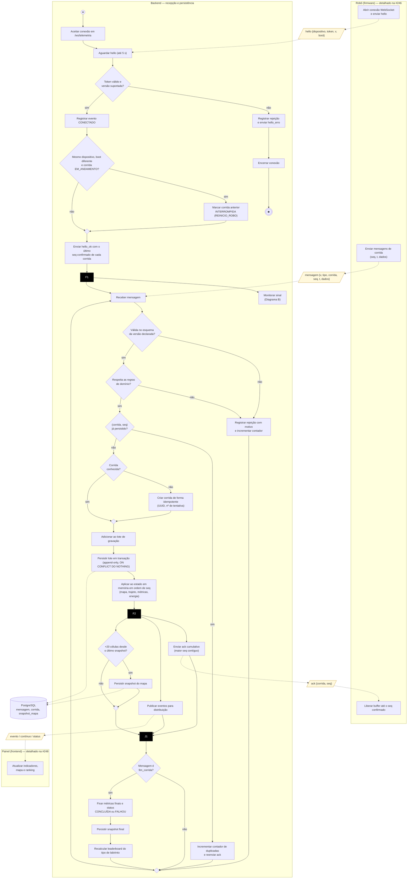
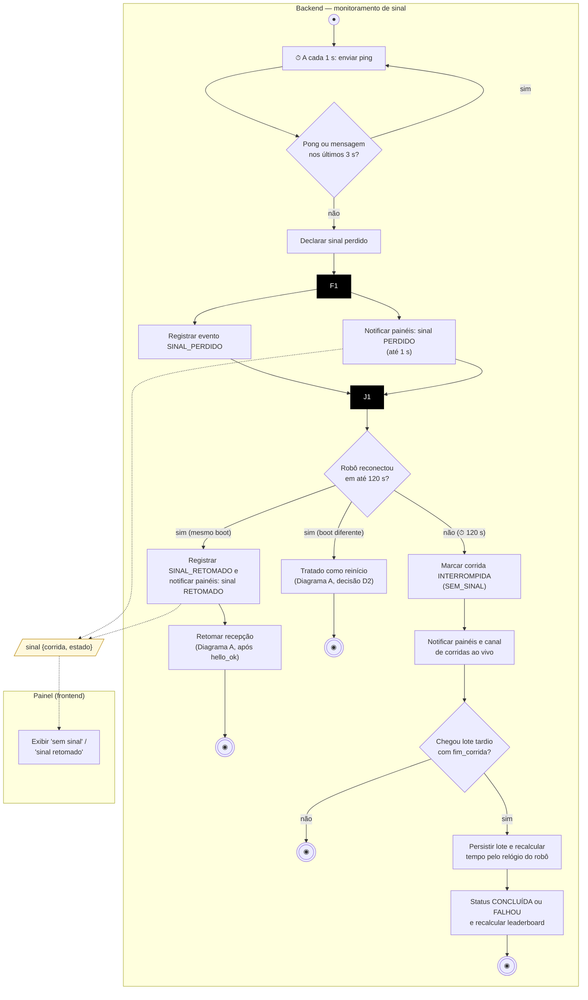

# Diagrama de Atividades — Raia do Backend (recepção e persistência)

**Versão:** 1.0
**Issue:** [#247 — 2.2 Modelar a raia do backend](https://github.com/fcte-pi1/2026.2_PI1_Grupo1_Diogo/issues/247)
**Escopo:** comportamento do backend desde a conexão do robô até a persistência, a confirmação e a publicação dos dados aos painéis. As raias **Robô** e **Painel** aparecem apenas nos pontos de interação: o detalhamento delas é das issues [#246](https://github.com/fcte-pi1/2026.2_PI1_Grupo1_Diogo/issues/246) (firmware) e [#248](https://github.com/fcte-pi1/2026.2_PI1_Grupo1_Diogo/issues/248) (frontend). A consolidação num diagrama único é feita na [#249](https://github.com/fcte-pi1/2026.2_PI1_Grupo1_Diogo/issues/249).

O comportamento foi dividido em dois diagramas complementares, que rodam em paralelo a partir do *fork* F1:

- **Diagrama A** — recepção, validação e persistência de mensagens (fluxo principal).
- **Diagrama B** — monitoramento de sinal e encerramento por falta de comunicação.

## Legenda da notação

| Elemento UML | Representação nos diagramas |
|:--|:--|
| Estado inicial | círculo `●` |
| Estado final | círculo duplo `◉` |
| Atividade | retângulo de cantos arredondados |
| Nó de decisão / junção (*merge*) | losango `{ }` |
| Barra de bifurcação / sincronização (*fork/join*) | barra preta `F`/`J` |
| Objeto (insumo ou saída) | paralelogramo `[/ /]` |
| Raia (*swimlane*) | moldura com o nome do ator |
| Evento de tempo | atividade iniciada por `⏱` |

---

## Diagrama A — Recepção, validação e persistência

## Diagrama B — Monitoramento de sinal e encerramento por falta de comunicação

---

## Descrição das atividades

### Atores

| Ator | Tipo | Papel no fluxo |
|:--|:--|:--|
| Robô (firmware do ESP32) | Sistema externo | Fonte da telemetria: envia `hello`, mensagens de corrida e responde ao ping. |
| Backend | Sistema (esta raia) | Autentica, valida, persiste, deriva métricas, confirma e distribui. |
| Painel (frontend) | Sistema externo | Consumidor das atualizações em tempo real. |
| Operador | Usuário | Não atua neste fluxo. Atua na anulação (RF-96), fora do caminho de ingestão. |

### Atividades, insumos e saídas

| # | Atividade | Insumos | Saídas | RF |
|:--|:--|:--|:--|:--|
| A1–A2 | Aceitar conexão e aguardar `hello` | Conexão WebSocket | Conexão pendente de autenticação | RF-72 |
| D1, A3–A4 | Autenticar dispositivo e versão | `hello` (dispositivo, token, `v`, `boot`) | `hello_ok` ou `hello_erro` + encerramento | RF-72, RNF-55, RNF-57 |
| D2, A6 | Detectar reinício do robô | `boot` do `hello` × `boot` da corrida em andamento | Corrida anterior `INTERROMPIDA (REINICIO_ROBO)` | RF-81 |
| A7 | Informar retomada | Último `seq` confirmado por corrida | `hello_ok` | RF-74 |
| D3 | Validar esquema | Mensagem + esquema JSON da versão | Mensagem válida ou rejeição | RF-75 |
| D4 | Validar domínio | Mensagem + dimensões do labirinto + último `t` | Mensagem válida ou rejeição | RF-76 |
| A9 | Registrar rejeição | Mensagem + motivo | Log JSON, `mensagem_rejeitada`, contador | RF-75, RF-76, RNF-56 |
| D5, A10 | Garantir idempotência | `(corrida, seq)` | `ack` sem novo registro | RF-77 |
| D6, A11 | Criar corrida | (dispositivo, id da corrida no robô) | Linha em `corrida` com UUID e nº de tentativa | RF-78, RF-97 |
| A12–A13 | Persistir em lote | Mensagens aceitas | Linhas em `mensagem` (append-only) | RF-79, RNF-49 |
| A14 | Atualizar estado derivado | Mensagens persistidas em ordem de `seq` | Mapa, trajeto, velocidade, energia | RF-80, RF-83 a RF-85 |
| A15 | Confirmar | Maior `seq` contíguo persistido | `ack` | RF-74 |
| A16 | Publicar | Eventos derivados | Eventos para o módulo de distribuição | RF-88 a RF-90 |
| D7, A17 | Snapshot periódico | Estado do mapa | Linha em `snapshot_mapa` | RF-80 |
| D8, A18–A20 | Encerrar corrida | `fim_corrida` | Métricas finais, status, snapshot final, ranking | RF-81, RF-82, RF-87, RF-95 |
| B1–B2 | Heartbeat | Ping/pong a cada 1 s | Declaração de perda após 3 s | RF-73 |
| B3–B5 | Notificar sinal | Perda ou retomada | Evento `sinal` aos painéis (≤ 1 s) | RF-92 |
| B8–B9 | Interromper por silêncio | ⏱ 120 s sem sinal | Corrida `INTERROMPIDA (SEM_SINAL)` | RF-81, RF-87 |
| D3–B11 (Diag. B) | Aceitar lote tardio | Lote com `fim_corrida` | Corrida `CONCLUÍDA` ou `FALHOU` | RF-81, RF-87 |

### Pontos de decisão, paralelismo e sincronização

- **F1 (Diagrama A):** após o `hello_ok`, o monitoramento de sinal (Diagrama B) e a recepção de mensagens rodam em paralelo durante toda a conexão. No Node.js isso é concorrência cooperativa no *event loop* (um *timer* e um *handler* de mensagens), sem threads.
- **F2/J1 (Diagrama A):** depois da persistência, a confirmação ao robô, a publicação aos painéis e a verificação de snapshot são independentes entre si. A sincronização em J1 garante que o encerramento da corrida (D8) só aconteça depois dos três ramos, para que o snapshot final e o ranking vejam o estado completo.
- **Ordem persistir → confirmar/distribuir:** o `ack` e a distribuição só ocorrem **depois** da transação confirmada. Assim, um dado exibido no painel ou liberado do buffer do robô nunca se perde num reinício do backend (RNF-50, RNF-52).
- **F1/J1 (Diagrama B):** o registro do evento e a notificação aos painéis são paralelos. A notificação não espera a escrita no banco, para cumprir o prazo de 1 s do RF-92.
- **Laço de recepção (M2 → A8):** a conexão continua aberta após o `fim_corrida`, porque o mesmo robô pode iniciar a próxima tentativa sem reconectar.
