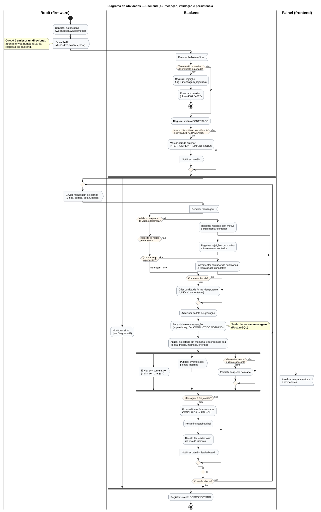
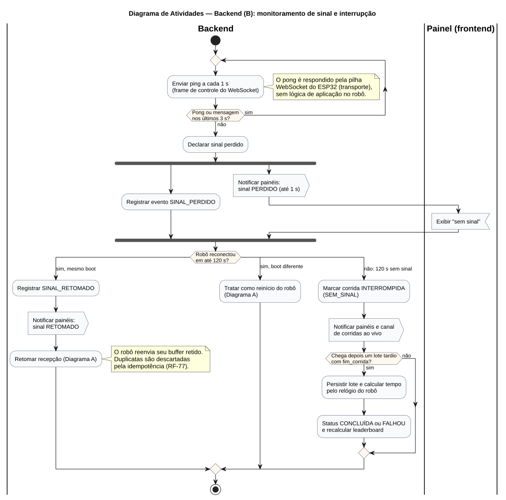

# Diagrama de Atividades — Raia do Backend (recepção e persistência)

**Versão:** 1.1 — alinhada ao Guia da Equipe de Software (21/09/2026)
**Issue:** [#247 — 2.2 Modelar a raia do backend](https://github.com/fcte-pi1/2026.2_PI1_Grupo1_Diogo/issues/247)
**Escopo:** comportamento do backend desde a conexão do robô até a persistência, a confirmação e a publicação dos dados aos painéis. As raias **Robô (firmware)** e **Painel (frontend)** aparecem apenas nos pontos de interação. O detalhamento delas é das issues [#246](https://github.com/fcte-pi1/2026.2_PI1_Grupo1_Diogo/issues/246) (firmware) e [#248](https://github.com/fcte-pi1/2026.2_PI1_Grupo1_Diogo/issues/248) (frontend), e a integração num diagrama único é feita pela Gerência de Software na [#249](https://github.com/fcte-pi1/2026.2_PI1_Grupo1_Diogo/issues/249).

**Arquivos (fonte editável + imagem exportada):**

| Diagrama | Fonte (PlantUML) | Imagem |
|:--|:--|:--|
| A — Recepção, validação e persistência | [`atividades-A-recepcao-persistencia.puml`](diagramas/atividades-A-recepcao-persistencia.puml) | [`.svg`](diagramas/atividades-A-recepcao-persistencia.svg) |
| B — Monitoramento de sinal e interrupção | [`atividades-B-monitoramento-sinal.puml`](diagramas/atividades-B-monitoramento-sinal.puml) | [`.svg`](diagramas/atividades-B-monitoramento-sinal.svg) |

Para regenerar as imagens, veja [`diagramas/README.md`](diagramas/README.md).

## Notação UML utilizada

| Elemento | Representação |
|:--|:--|
| Estado inicial | círculo preto cheio |
| Estado final | círculo preto com anel |
| Atividade | retângulo de cantos arredondados |
| Envio de sinal (saída para outra raia) | pentágono apontando para a direita (`<<output>>`) |
| Recepção de sinal (entrada vinda de outra raia) | retângulo com entalhe (`<<input>>`) |
| Nó de decisão e de junção (*merge*) | losango |
| Bifurcação e sincronização (*fork/join*) | barra preta horizontal |
| Raia (*swimlane*) | coluna com o nome do ator: Robô (firmware), Backend, Painel (frontend) |
| Fluxo de controle | seta |
| Insumos e saídas | notas associadas às atividades, com detalhamento na tabela abaixo |

---

## Diagrama A — Recepção, validação e persistência

## Diagrama B — Monitoramento de sinal e interrupção por falta de comunicação

---

## Descrição das atividades

### Atores

| Ator | Tipo | Papel no fluxo |
|:--|:--|:--|
| Robô (firmware do ESP32) | Sistema externo | Fonte da telemetria. **Emissor unidirecional**: envia `hello` e as mensagens de corrida e nunca depende de respostas do backend. |
| Backend | Sistema (esta raia) | Autentica, valida, persiste, deriva métricas, confirma e distribui. |
| Painel (frontend) | Sistema externo | Consumidor das atualizações em tempo real. |
| Operador | Usuário | Não atua neste fluxo. Atua na anulação (RF-96), fora do caminho de ingestão. |

### Atividades, insumos e saídas

| Diagrama | Atividade | Insumos | Saídas | RF |
|:--:|:--|:--|:--|:--|
| A | Receber `hello` (até 5 s) | Conexão WebSocket | Conexão pendente de autenticação | RF-72 |
| A | Autenticar dispositivo e versão | `hello` (dispositivo, token, `v`, `boot`) | Conexão aceita, ou rejeição registrada e conexão fechada (4001/4002) | RF-72, RNF-55, RNF-57 |
| A | Detectar reinício do robô | `boot` do `hello` × `boot` da corrida em andamento | Corrida anterior `INTERROMPIDA (REINICIO_ROBO)` e notificação aos painéis | RF-81 |
| A | Validar esquema | Mensagem + esquema JSON da versão | Mensagem válida ou rejeição | RF-75 |
| A | Validar domínio | Mensagem + dimensões do labirinto + último `t` | Mensagem válida ou rejeição | RF-76 |
| A | Registrar rejeição | Mensagem + motivo | Log JSON, linha em `mensagem_rejeitada`, contador | RF-75, RF-76, RNF-56 |
| A | Descartar duplicata | `(corrida, seq)` já persistido | `ack` reenviado, contador de duplicadas, nenhum registro novo | RF-77 |
| A | Criar corrida | (dispositivo, id da corrida no robô) | Linha em `corrida` com UUID e nº de tentativa | RF-78, RF-97 |
| A | Persistir lote | Mensagens aceitas | Linhas em `mensagem` (append-only) | RF-79, RNF-49 |
| A | Aplicar ao estado em memória | Mensagens persistidas, em ordem de `seq` | Mapa, trajeto, velocidade e energia atualizados | RF-80, RF-83 a RF-85 |
| A | Enviar `ack` cumulativo | Maior `seq` contíguo persistido | `ack` (informativo para o robô) | RF-74 |
| A | Publicar eventos | Eventos derivados | Evento/contínuo para os painéis inscritos | RF-88 a RF-90 |
| A | Persistir snapshot | Estado do mapa a cada +20 células | Linha em `snapshot_mapa` | RF-80 |
| A | Encerrar corrida | `fim_corrida` | Métricas finais, status, snapshot final, ranking recalculado | RF-81, RF-82, RF-87, RF-95 |
| B | Heartbeat | Ping a cada 1 s + pong ou mensagem | Declaração de perda após 3 s | RF-73 |
| B | Notificar sinal | Perda ou retomada | Evento `sinal` aos painéis (≤ 1 s) | RF-92 |
| B | Interromper por silêncio | 120 s sem sinal | Corrida `INTERROMPIDA (SEM_SINAL)` | RF-81, RF-87 |
| B | Aceitar lote tardio | Lote com `fim_corrida` após a interrupção | Corrida `CONCLUÍDA` ou `FALHOU` | RF-81, RF-87 |

### Pontos de decisão, paralelismo e sincronização

- **Robô como emissor unidirecional:** nenhuma atividade do robô espera uma resposta do backend. Uma autenticação recusada se manifesta só como o fechamento da conexão. O `ack` é enviado (RF-74), mas o fluxo do robô não depende dele. Depois de uma reconexão, o robô reenvia o buffer retido e as duplicatas são descartadas pelo backend (RF-77).
- **Primeiro fork/join (Diagrama A):** depois da autenticação, o monitoramento de sinal (Diagrama B) e o laço de recepção rodam em paralelo durante toda a conexão. No Node.js isso é concorrência cooperativa no *event loop* (um *timer* e um *handler* de mensagens), sem threads.
- **Fork/join interno (Diagrama A):** depois da persistência, a confirmação, a publicação aos painéis e a verificação de snapshot são independentes. A sincronização garante que o encerramento da corrida só ocorra depois dos três ramos, para que o snapshot final e o ranking vejam o estado completo.
- **Ordem persistir → confirmar/distribuir:** o `ack` e a distribuição só acontecem **depois** da transação confirmada. Assim, um dado exibido no painel nunca se perde num reinício do backend (RNF-50, RNF-52).
- **Fork/join (Diagrama B):** o registro do evento e a notificação aos painéis são paralelos. A notificação não espera a escrita no banco, para cumprir o prazo de 1 s do RF-92.
- **Decisão de reconexão (Diagrama B):** há três saídas: mesmo `boot` (retomada), `boot` diferente (reinício, tratado no Diagrama A) e 120 s sem sinal (interrupção, com possível lote tardio).
- **Laço de recepção:** a conexão continua aberta depois do `fim_corrida`, porque o mesmo robô pode iniciar a próxima tentativa sem reconectar.
