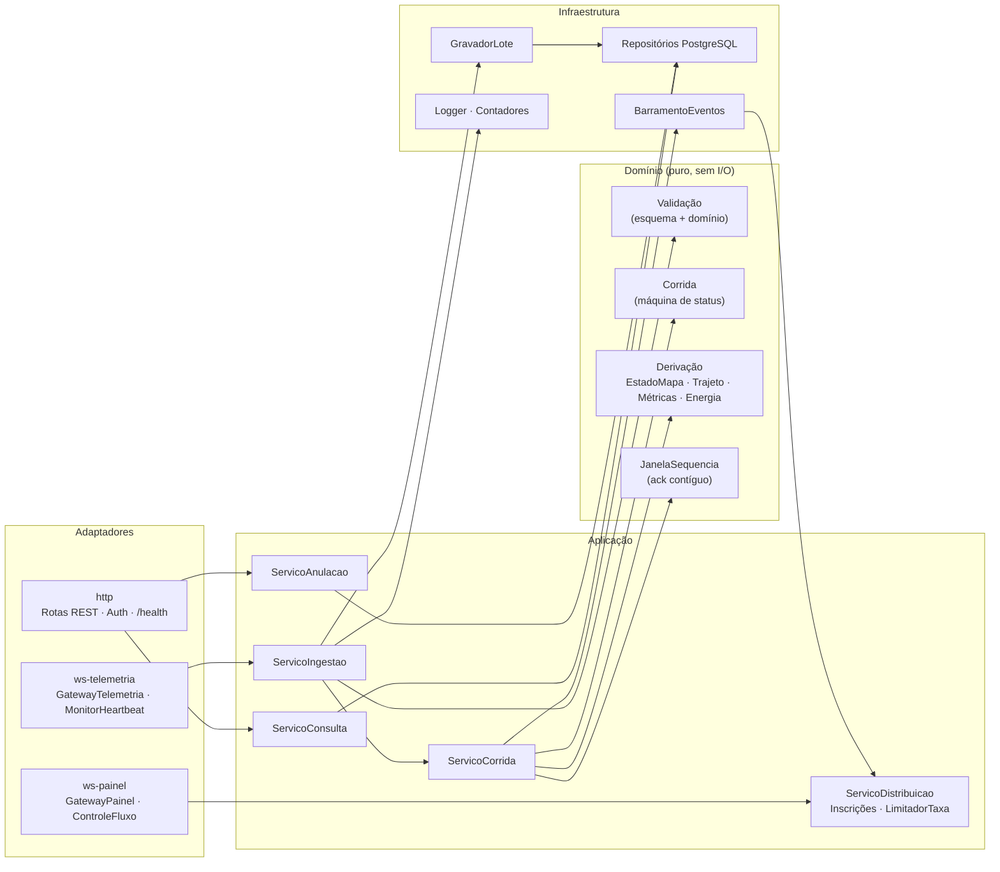
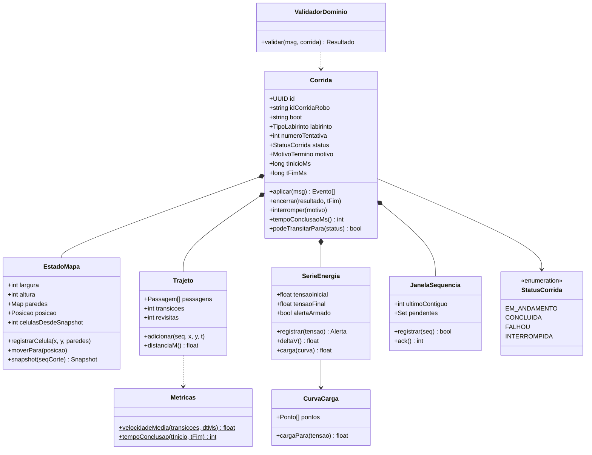
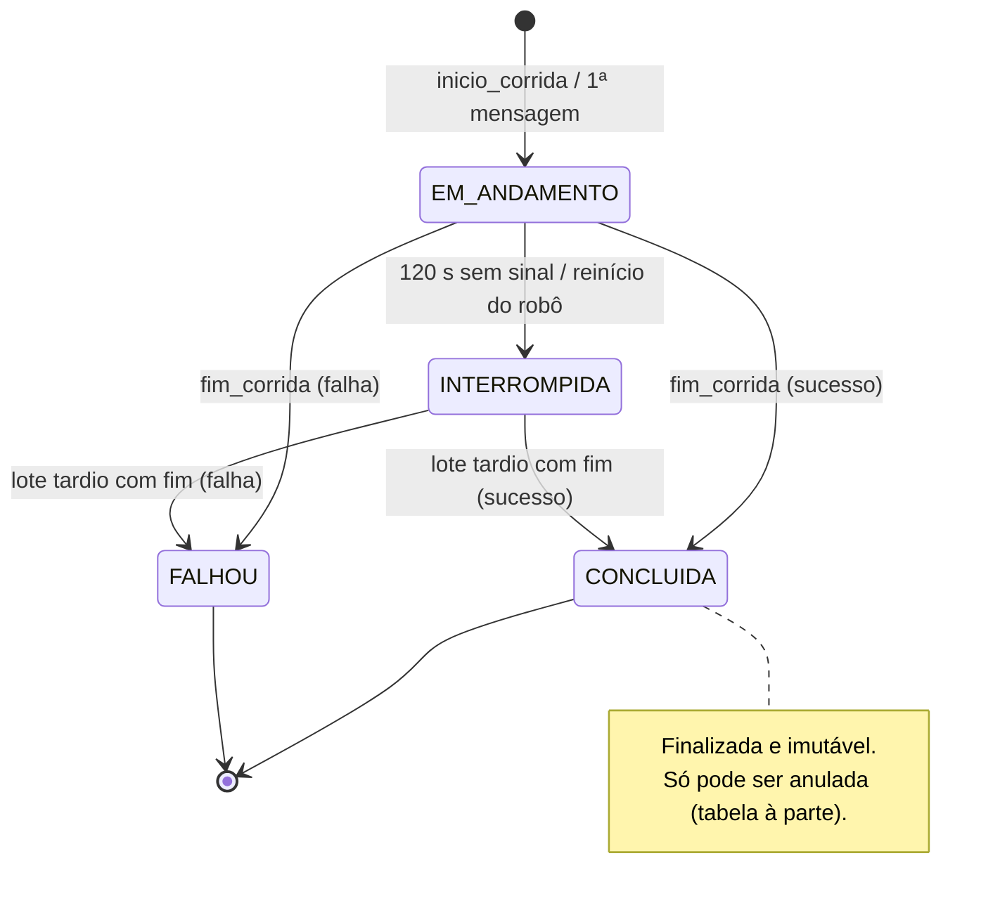
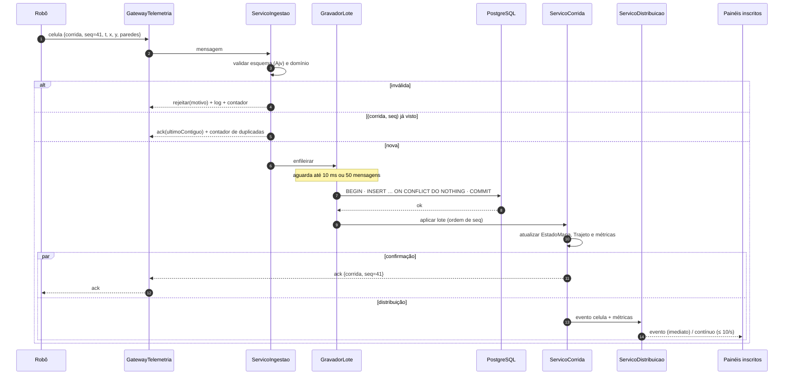
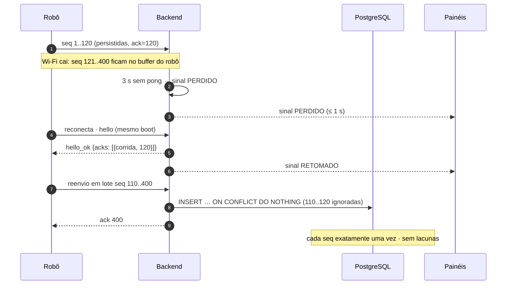
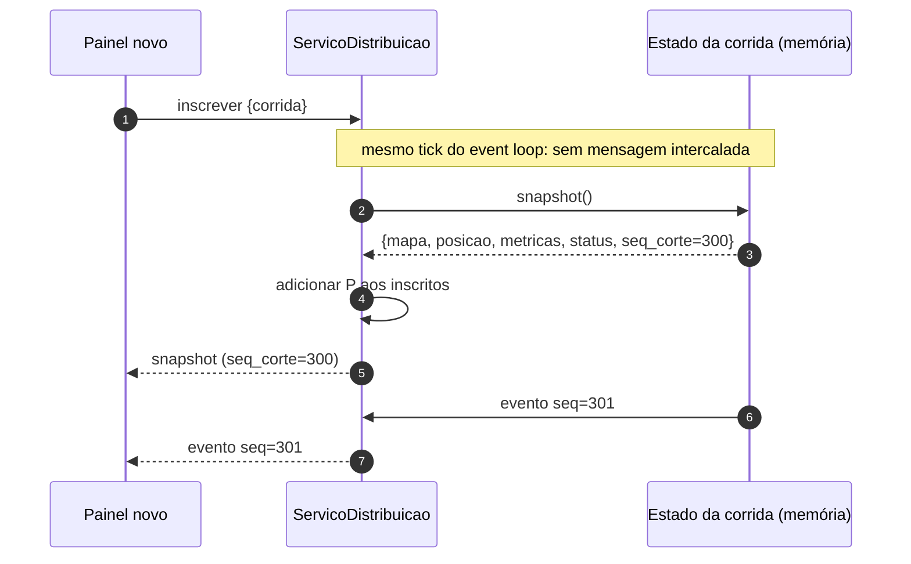
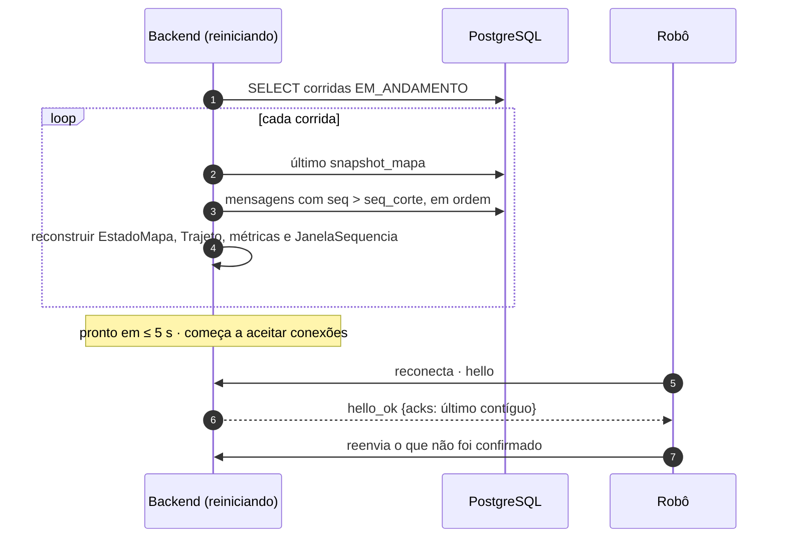
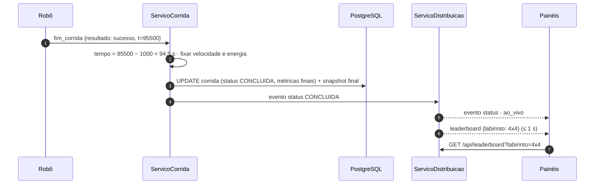
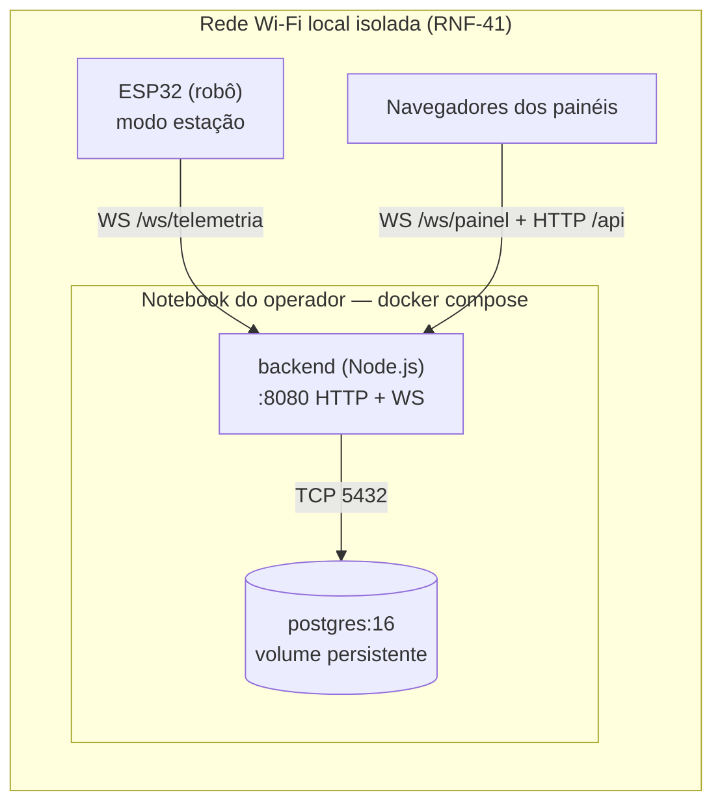
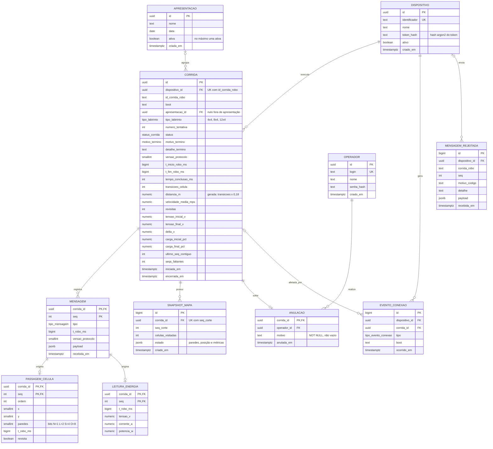

# Arquitetura do Backend — Visões e Modelo de Dados

**Versão:** 1.0
**Issue:** [#253 — 3.3 Visões do backend + modelo de dados (MER + DER)](https://github.com/fcte-pi1/2026.2_PI1_Grupo1_Diogo/issues/253)
**Escopo:** arquitetura do backend no modelo 4+1 adaptado pela disciplina (visões lógica, de processos, de implementação e de dados). A visão de implantação do sistema completo fica na [#255](https://github.com/fcte-pi1/2026.2_PI1_Grupo1_Diogo/issues/255). A seção [Implantação](#6-implantação-contribuição-para-a-255) traz apenas a parte do backend.

**Rastreabilidade:** RF-72 a RF-98, RNF-48 a RNF-58 e as histórias [HU-BE-01 a HU-BE-27](1_historias_de_usuario.md).

---

## 1. Propósito do backend

O backend é o **ponto central de verdade** do sistema web do Micromouse. Ele:

1. **Recebe** a telemetria do robô (ou do simulador) por WebSocket, autentica a fonte e valida cada mensagem.
2. **Persiste** tudo o que foi aceito, de forma durável, idempotente e sem lacunas, mesmo com quedas de Wi-Fi.
3. **Deriva** as métricas oficiais da corrida (tempo, velocidade média, trajeto, energia e status), usando sempre o relógio do robô.
4. **Distribui** o estado ao vivo aos painéis com volume e ordem controlados.
5. **Expõe** histórico, replay, ranking, anulação e exportação por uma API HTTP.

O backend **não** controla o robô. Toda decisão de navegação é do firmware. O único dado de controle que ele devolve ao robô é o `ack` de persistência (ver [Pontos em aberto](#pontos-em-aberto)).

## 2. Decisões de arquitetura

### 2.1 Padrão: monólito modular orientado a eventos, em camadas

Um único processo Node.js, dividido em módulos com fronteiras explícitas (ingestão, corrida, derivação, distribuição e consulta) e organizado em camadas (**adaptadores → aplicação → domínio**, com a **infraestrutura** implementando as portas). Os módulos se comunicam por um barramento de eventos em memória.

| Alternativa | Por que não foi adotada |
|:--|:--|
| Microsserviços | Um robô, até 10 painéis e uma rede local não justificam a complexidade operacional. Haveria mais saltos de rede (pior para o RNF-48) e subir o sistema com um comando em 2 min (RNF-58) ficaria mais difícil. |
| MVC clássico | Atende bem à API REST, mas não modela o fluxo contínuo de telemetria, o estado vivo por corrida nem a distribuição em tempo real. |
| Monólito sem módulos | Mistura regras de domínio com I/O e prejudica o RNF-53 (≥ 80 % de cobertura nos módulos de validação e derivação). |

**Por que isso funciona aqui:** com um processo único, o estado vivo de cada corrida fica em memória e é atualizado de forma serial pelo *event loop*. Isso resolve de graça a consistência do snapshot para quem entra no meio da corrida (RF-89): o corte e a inscrição acontecem no mesmo *tick*, sem locks. Como o domínio é puro (sem I/O), validação e derivação podem ser testadas de forma unitária.

### 2.2 Stack

| Camada | Escolha | Situação | Justificativa |
|:--|:--|:--|:--|
| Runtime | **Node.js 22 LTS** | Decidido pelo time | I/O assíncrono não bloqueante, adequado a muitas conexões WebSocket de baixo volume. O simulador em Node (RNF-53) compartilha o código do protocolo. |
| Linguagem | TypeScript | Proposta | Tipos do protocolo e do domínio compartilhados entre backend, simulador e frontend. |
| HTTP | Fastify | Proposta | Baixo overhead, validação por JSON Schema nativa e logs com pino integrados. |
| WebSocket | `ws` (via `@fastify/websocket`) | Proposta | Expõe `bufferedAmount` (necessário ao RF-91) e ping/pong nativo (RF-73). |
| Validação do protocolo | Ajv (JSON Schema 2020-12) | Proposta | Esquemas compilados uma vez, validação rápida e esquema publicável no repositório (RNF-57). |
| Banco de dados | **PostgreSQL 16** | Escolhido pela frente de backend | Relacional com transações ACID, `ON CONFLICT` para idempotência, `JSONB` para o *payload* bruto, *triggers* para imutabilidade e *window functions* para o ranking. |
| Acesso a dados | `pg` (node-postgres) + SQL explícito | Proposta | Controle total sobre `INSERT` em lote e `ON CONFLICT`, sem ORM escondendo o SQL. |
| Migrações | node-pg-migrate | Proposta | Migrações em SQL versionadas junto ao código. |
| Logs | pino (JSON) | Proposta | Logs estruturados com `corrida` e `seq` (RNF-56). |
| Testes | Vitest + Testcontainers (PostgreSQL) | Proposta | Unitário no domínio e integração com banco real. |
| Implantação | Docker Compose | Proposta | `docker compose up` sobe backend e banco com um único comando (RNF-58). |

> A formalização da stack é da [#251](https://github.com/fcte-pi1/2026.2_PI1_Grupo1_Diogo/issues/251). Os itens marcados como "Proposta" são a recomendação da frente de backend.

### 2.3 Protocolo de telemetria v1 (proposta)

Todas as mensagens são JSON sobre WebSocket. O esquema oficial será publicado em `src/backend/protocolo/v1/` (RNF-57), e o backend aceita a versão atual e a anterior.

**Robô → Backend** (`/ws/telemetria`)

| `tipo` | Campos (além do envelope) | Descrição |
|:--|:--|:--|
| `hello` | `dispositivo`, `token`, `boot` | Identificação. É a primeira mensagem da conexão e não tem `seq`. `boot` é um valor aleatório gerado a cada boot do ESP32. |
| `inicio_corrida` | `labirinto` ∈ {`4x4`,`8x4`,`12x4`} | Início da tentativa. |
| `celula` | `x`, `y`, `paredes` {`n`,`l`,`s`,`o`: bool} | Célula visitada com as paredes detectadas (evento **discreto**). |
| `posicao` | `x`, `y`, `orientacao`, `celulas` | Posição atual e contador de células (dado **contínuo**). |
| `energia` | `tensao_v`, `corrente_a`, `potencia_w` | Leitura do INA219 (dado **contínuo**). |
| `estado` | `estado` ∈ {Inicializando, Aguardando, Mapeando, Resolvendo, Concluído, Erro} | Estado de navegação (evento **discreto**). |
| `fim_corrida` | `resultado` ∈ {`sucesso`,`falha`}, `detalhe?` | Fim da tentativa. |

**Envelope comum** (exceto `hello`): `{ "v": 1, "tipo": "...", "corrida": "<id gerado pelo robô>", "seq": <int ≥ 1 por corrida>, "t": <ms no relógio do robô> }`

**Backend → Robô:** `hello_ok { acks: [{corrida, seq}] }` · `hello_erro { motivo }` · `ack { corrida, seq }` · *ping* (frame de controle do WebSocket).

**Painel ↔ Backend** (`/ws/painel`, somente leitura — RNF-55)

| Direção | `tipo` | Conteúdo |
|:--|:--|:--|
| Painel → | `inscrever` / `cancelar` | `{ corrida }`, ou `{ canal: "ao_vivo" }` |
| → Painel | `snapshot` | `{ corrida, seq_corte, mapa, posicao, metricas, status }` |
| → Painel | `evento` | Evento discreto: `celula` ou `status`, com `seq` |
| → Painel | `continuo` | Última posição e energia (no máximo 10/s por corrida) |
| → Painel | `sinal` | `{ corrida, estado: PERDIDO \| RETOMADO }` |
| → Painel | `alerta` | `{ corrida, tipo: TENSAO_BAIXA, tensao_v }` |
| → Painel | `ao_vivo` | Resumo de início, fim e status de qualquer corrida |
| → Painel | `leaderboard` | `{ labirinto }` — sinaliza que o ranking mudou |

**API HTTP**

| Método e rota | Uso | Autenticação | RF |
|:--|:--|:--|:--|
| `GET /api/corridas?tipo&status&de&ate&pagina&tamanho` | Listagem | — | RF-93 |
| `GET /api/corridas/{id}` | Detalhe (métricas, trajeto, energia, anulação) | — | RF-84, RF-85 |
| `GET /api/corridas/{id}/linha-do-tempo` | Replay em *stream* NDJSON | — | RF-94 |
| `GET /api/leaderboard?labirinto&apresentacao` | Ranking | — | RF-95 |
| `GET /api/corridas/{id}/exportacao?formato=json\|csv` | Exportação | — | RF-98 |
| `POST /api/corridas/{id}/anulacao` | Anular com motivo | Operador (JWT) | RF-96 |
| `POST /api/apresentacoes` / `PATCH /api/apresentacoes/{id}` | Abrir ou encerrar apresentação | Operador (JWT) | RF-97 |
| `POST /api/auth/login` | Login do operador | — | RNF-55 |
| `GET /health` | Saúde, contadores e atraso do *event loop* | — | RNF-56 |

---

## 3. Visão lógica

### 3.1 Módulos e dependências



| Módulo | Responsabilidade | RF/RNF |
|:--|:--|:--|
| GatewayTelemetria | Conexão do robô, `hello`, *parse*, envio de `ack` | RF-72, RF-74 |
| MonitorHeartbeat | Ping a cada 1 s, perda após 3 s, interrupção após 120 s | RF-73, RF-81 |
| ServicoIngestao | Orquestra validação → idempotência → gravação → aplicação ao estado | RF-75 a RF-79 |
| ServicoCorrida | Criação idempotente, numeração de tentativas, status, snapshots | RF-78, RF-80, RF-81, RF-87, RF-97 |
| Derivação (domínio) | Tempo, velocidade, trajeto, energia, alerta | RF-82 a RF-86 |
| ServicoDistribuicao | Inscrições, snapshot de entrada, *throttle*, sinal | RF-88 a RF-92 |
| ControleFluxo | `bufferedAmount` > 1 MB → descarta contínuos; 10 s → desconecta | RF-91 |
| ServicoConsulta | Listagem, replay, ranking, exportação em *stream* | RF-93 a RF-95, RF-98 |
| ServicoAnulacao | Anulação autenticada, auditável | RF-96, RNF-54 |

### 3.2 Modelo de domínio



**Máquina de status da corrida (RF-81, RF-87, RNF-54):**



> Só uma corrida `INTERROMPIDA` por `SEM_SINAL` aceita lote tardio. Uma interrompida por `REINICIO_ROBO` é definitiva, porque o robô que reiniciou perdeu o buffer.

---

## 4. Visão de processos

### 4.1 Modelo de concorrência

- **Processo único, uma thread de *event loop*.** Todo o estado vivo (corridas, inscrições, janelas de `seq`) é acessado só por essa thread, então não há *race conditions* em memória. A concorrência entre conexões e com o banco é assíncrona.
- **Nada bloqueia o loop (RNF-49):** os esquemas Ajv são compilados na inicialização; a gravação é feita em lotes assíncronos; replay e exportação usam *streams* com cursor do banco; nenhum trabalho de CPU passa de alguns milissegundos. O atraso do loop é medido com `perf_hooks.monitorEventLoopDelay` e exposto em `/health`.
- **Temporizadores:**

| Timer | Período | Função | RF |
|:--|:--|:--|:--|
| Heartbeat | 1 s por conexão de robô | Ping e verificação de silêncio de 3 s | RF-73 |
| Flush do lote | ≤ 10 ms ou 50 mensagens | Transação de `INSERT` em lote | RF-79 |
| Flush de contínuos | 100 ms por corrida | Envia a última posição e energia (≤ 10/s) | RF-90 |
| Interrupção por silêncio | 120 s após a perda | Marca `INTERROMPIDA (SEM_SINAL)` | RF-81 |
| Verificação de *backpressure* | 1 s por painel | `bufferedAmount` > 1 MB por 10 s → desconecta | RF-91 |

- **Ordem garantida:** eventos discretos são aplicados e distribuídos em ordem de `seq` contíguo. Mensagens que chegam depois de uma lacuna ficam persistidas, mas só são aplicadas ao estado quando a lacuna é preenchida. Se a corrida termina com lacuna, ela é registrada em `corrida.seqs_faltantes` ("lacuna sinalizada", RNF-50).

### 4.2 Ingestão, persistência, confirmação e distribuição



### 4.3 Queda de conexão e reenvio (RF-74, RF-77, RNF-50)



### 4.4 Painel que entra no meio da corrida (RF-89)



### 4.5 Recuperação após reinício do backend (RNF-52)



### 4.6 Fim da corrida e ranking (RF-82, RF-87, RF-95)



---

## 5. Visão de implementação

```text
src/backend/
├── package.json · tsconfig.json · Dockerfile · docker-compose.yml · .env.example
├── protocolo/
│   ├── v1/                      # esquemas JSON publicados (RNF-57)
│   └── tipos.ts                 # tipos gerados, compartilhados com simulador e frontend
├── migracoes/                   # SQL versionado (node-pg-migrate)
├── src/
│   ├── main.ts                  # composição da aplicação (injeção manual de dependências)
│   ├── config/                  # variáveis de ambiente, curva de carga, limiares
│   ├── adaptadores/
│   │   ├── ws-telemetria/       # GatewayTelemetria, MonitorHeartbeat
│   │   ├── ws-painel/           # GatewayPainel, ControleFluxo
│   │   └── http/                # rotas, autenticação JWT, /health
│   ├── aplicacao/               # ServicoIngestao, ServicoCorrida, ServicoDistribuicao, ServicoConsulta, ServicoAnulacao
│   ├── dominio/                 # Corrida, EstadoMapa, Trajeto, Metricas, SerieEnergia, JanelaSequencia, validação de domínio
│   └── infra/                   # repositórios pg, GravadorLote, BarramentoEventos, logger, contadores
├── simulador/                   # simulador de robô em Node, mesmo protocolo (RNF-53)
└── testes/
    ├── unit/                    # domínio (meta de cobertura ≥ 80 %)
    ├── integracao/              # PostgreSQL real via Testcontainers
    └── e2e/                     # simulador → backend → cliente WebSocket de painel
```

**Regras de dependência:**

- `dominio/` não importa nada de fora dele (nem `pg`, nem `ws`, nem `fastify`).
- `aplicacao/` depende de `dominio/` e de interfaces (portas) de repositório e publicação.
- `adaptadores/` e `infra/` implementam essas portas.
- Essas regras são verificadas no CI com `dependency-cruiser`.

---

## 6. Implantação (contribuição para a #255)



`docker compose up` sobe o banco, aplica as migrações e inicia o backend (RNF-58: ≤ 2 min num notebook limpo com as imagens já baixadas). Os segredos (token dos dispositivos, senha do operador, chave JWT) vêm de `.env`, que nunca é versionado.

---

## 7. Visão de dados

### 7.1 Modelo Entidade-Relacionamento (MER)

**Entidades**

| Entidade | Descrição | Atributos principais |
|:--|:--|:--|
| **DISPOSITIVO** | Fonte de telemetria autorizada (robô ou simulador) | <u>id</u>, identificador (único), nome, token_hash, ativo |
| **OPERADOR** | Usuário com permissão de escrita | <u>id</u>, login (único), nome, senha_hash |
| **APRESENTACAO** | Sessão de apresentação que agrupa as tentativas | <u>id</u>, nome, data, ativa |
| **CORRIDA** | Uma tentativa de resolução do labirinto | <u>id</u>, id_corrida_robo, boot, tipo_labirinto, numero_tentativa, status, motivo_termino, tempos do robô, métricas finais, ultimo_seq_contiguo, seqs_faltantes |
| **MENSAGEM** | Registro *append-only* de cada mensagem aceita (entidade fraca de CORRIDA) | <u>corrida_id + seq</u>, tipo, t_robo_ms, versao_protocolo, payload, recebida_em |
| **PASSAGEM_CELULA** | Projeção de MENSAGEM do tipo `celula`: o trajeto | <u>corrida_id + seq</u>, ordem, x, y, paredes, revisita |
| **LEITURA_ENERGIA** | Projeção de MENSAGEM do tipo `energia`: a série de energia | <u>corrida_id + seq</u>, tensao_v, corrente_a, potencia_w |
| **SNAPSHOT_MAPA** | Estado completo do mapa num `seq` de corte | <u>id</u>, seq_corte, celulas_visitadas, estado |
| **ANULACAO** | Anulação auditável de uma corrida finalizada | <u>corrida_id</u>, motivo, anulada_em |
| **EVENTO_CONEXAO** | Histórico de conexão, perda, retomada e reinício | <u>id</u>, tipo, boot, ocorrido_em |
| **MENSAGEM_REJEITADA** | Auditoria das mensagens rejeitadas | <u>id</u>, motivo_codigo, detalhe, payload, recebida_em |

**Relacionamentos**

| Relacionamento | Cardinalidade | Regra |
|:--|:--|:--|
| DISPOSITIVO *executa* CORRIDA | 1 : 0..N | O par (dispositivo, id_corrida_robo) é único (RF-78) |
| APRESENTACAO *agrupa* CORRIDA | 0..1 : 0..N | Corridas de teste podem ficar fora de apresentação; (apresentação, tipo, nº de tentativa) é único (RF-97) |
| CORRIDA *registra* MENSAGEM | 1 : 0..N | Chave (corrida, seq): idempotência (RF-77) |
| MENSAGEM *origina* PASSAGEM_CELULA | 1 : 0..1 | Só para `tipo = celula` |
| MENSAGEM *origina* LEITURA_ENERGIA | 1 : 0..1 | Só para `tipo = energia` |
| CORRIDA *possui* SNAPSHOT_MAPA | 1 : 0..N | Um a cada 20 células e um final (RF-80) |
| CORRIDA *sofre* ANULACAO | 1 : 0..1 | No máximo uma anulação por corrida (RF-96) |
| OPERADOR *realiza* ANULACAO | 1 : 0..N | Autor da anulação (RNF-54) |
| DISPOSITIVO *gera* EVENTO_CONEXAO | 1 : 0..N | — |
| CORRIDA *afetada por* EVENTO_CONEXAO | 0..1 : 0..N | Perda ou reinício durante a corrida |
| DISPOSITIVO *envia* MENSAGEM_REJEITADA | 0..1 : 0..N | Nulo quando a rejeição é anterior à autenticação |

**Decisões de modelagem**

- **Anulação em tabela separada:** a linha de uma `corrida` finalizada **nunca** é alterada (RNF-54). Anular é *inserir* em `anulacao`. O ranking exclui as corridas com anulação.
- **`mensagem` é a fonte da verdade:** `passagem_celula`, `leitura_energia`, `snapshot_mapa` e as métricas de `corrida` são **projeções** que podem ser reconstruídas a partir dela. Elas existem para consultas rápidas (RNF-43) e para a recuperação (RNF-52).
- **O relógio do robô é o oficial:** `t_robo_ms` é usado nos cálculos (RF-82). `recebida_em`, do servidor, serve só para auditoria e latência.
- **Valores de enumeração em ASCII no banco** (`CONCLUIDA`). A acentuação (`CONCLUÍDA`) fica só na apresentação.

### 7.2 Diagrama Entidade-Relacionamento (DER — PostgreSQL)



**Tipos enumerados**

| Tipo | Valores |
|:--|:--|
| `tipo_labirinto` | `4x4`, `8x4`, `12x4` |
| `status_corrida` | `EM_ANDAMENTO`, `CONCLUIDA`, `FALHOU`, `INTERROMPIDA` |
| `motivo_termino` | `SUCESSO`, `FALHA_REPORTADA`, `SEM_SINAL`, `REINICIO_ROBO` |
| `tipo_mensagem` | `inicio_corrida`, `celula`, `posicao`, `energia`, `estado`, `fim_corrida` |
| `tipo_evento_conexao` | `CONECTADO`, `SINAL_PERDIDO`, `SINAL_RETOMADO`, `DESCONECTADO`, `REINICIO_DETECTADO` |

### 7.3 Restrições, índices e regras no banco

```sql
-- Idempotência e unicidade (RF-77, RF-78, RF-97)
ALTER TABLE mensagem ADD PRIMARY KEY (corrida_id, seq);
ALTER TABLE corrida  ADD CONSTRAINT uq_corrida_robo      UNIQUE (dispositivo_id, id_corrida_robo);
ALTER TABLE corrida  ADD CONSTRAINT uq_corrida_tentativa UNIQUE (apresentacao_id, tipo_labirinto, numero_tentativa);
CREATE UNIQUE INDEX uq_apresentacao_ativa ON apresentacao (ativa) WHERE ativa;

-- Regras de domínio replicadas no banco como defesa em profundidade (RF-76)
ALTER TABLE leitura_energia ADD CONSTRAINT ck_tensao CHECK (tensao_v BETWEEN 5.0 AND 9.0);
ALTER TABLE anulacao        ADD CONSTRAINT ck_motivo CHECK (length(trim(motivo)) > 0);
ALTER TABLE corrida         ADD COLUMN distancia_m numeric(8,2)
    GENERATED ALWAYS AS (transicoes_celula * 0.18) STORED;

-- Registro append-only (RF-79)
CREATE FUNCTION impedir_alteracao() RETURNS trigger LANGUAGE plpgsql AS $$
BEGIN
  RAISE EXCEPTION 'tabela % é append-only', TG_TABLE_NAME;
END $$;
CREATE TRIGGER tg_mensagem_append_only
  BEFORE UPDATE OR DELETE ON mensagem
  FOR EACH ROW EXECUTE FUNCTION impedir_alteracao();

-- Corrida finalizada é imutável (RNF-54)
CREATE FUNCTION proteger_corrida_finalizada() RETURNS trigger LANGUAGE plpgsql AS $$
BEGIN
  IF TG_OP = 'DELETE' OR OLD.status IN ('CONCLUIDA', 'FALHOU') THEN
    RAISE EXCEPTION 'corrida % não pode ser alterada', OLD.id;
  END IF;
  RETURN NEW;
END $$;
CREATE TRIGGER tg_corrida_imutavel
  BEFORE UPDATE OR DELETE ON corrida
  FOR EACH ROW EXECUTE FUNCTION proteger_corrida_finalizada();

-- Consultas (RF-93, RF-95)
CREATE INDEX ix_corrida_listagem   ON corrida (tipo_labirinto, status, iniciada_em DESC);
CREATE INDEX ix_corrida_leaderboard ON corrida (tipo_labirinto, tempo_conclusao_ms, distancia_m)
  WHERE status = 'CONCLUIDA';

-- Ranking (RF-95): só CONCLUÍDAS e não anuladas; desempate pela menor distância
CREATE VIEW vw_leaderboard AS
SELECT c.tipo_labirinto,
       RANK() OVER (PARTITION BY c.tipo_labirinto
                    ORDER BY c.tempo_conclusao_ms, c.distancia_m) AS posicao,
       c.id AS corrida_id, c.apresentacao_id, c.numero_tentativa,
       c.tempo_conclusao_ms, c.distancia_m, c.velocidade_media_mps, c.encerrada_em
FROM corrida c
LEFT JOIN anulacao a ON a.corrida_id = c.id
WHERE c.status = 'CONCLUIDA' AND a.corrida_id IS NULL;
```

**Permissões:** o usuário de banco da aplicação recebe apenas `INSERT` e `SELECT` em `mensagem` e `anulacao`, como segunda barreira além dos *triggers*.

**Volume estimado:** uma corrida de 10 min a 20 mensagens/s gera cerca de 12 mil linhas em `mensagem` (~3 MB com índices). Mesmo 200 corridas somam menos de 1 GB, bem dentro do que um notebook suporta.

---

## Pontos em aberto

| # | Ponto | Impacto | Encaminhamento sugerido |
|:--|:--|:--|:--|
| 1 | **Conflito RF-53 × RF-72/RF-74.** O [RF-53](https://github.com/fcte-pi1/2026.2_PI1_Grupo1_Diogo/issues/133) do firmware diz que o robô opera "exclusivamente como emissor", sem processar mensagens de entrada. Já o RF-72 exige um *handshake* e o RF-74 exige que o robô leia o `ack` para liberar o buffer. | Sem `ack`, o robô não sabe o que reenviar após uma queda, e o RNF-50 (0 lacunas após 60 s de queda) fica sem mecanismo. | Revisar o RF-53 com a frente de firmware para: *"o robô não processa comandos de navegação vindos da web; processa apenas `hello_ok`/`hello_erro` e `ack` do protocolo de telemetria"*. O ping/pong é de nível de transporte (tratado pela biblioteca WebSocket) e não conflita com o RF-53. **Decisão atual: modelar com `ack`** e resolver o conflito na [#249](https://github.com/fcte-pi1/2026.2_PI1_Grupo1_Diogo/issues/249). |
| 2 | Curva tensão → carga (RF-85) | Valores da carga estimada | Validar os pontos da curva padrão com a frente de Energia. |
| 3 | Formalização da stack | Frameworks marcados como "Proposta" | Registrar na [#251](https://github.com/fcte-pi1/2026.2_PI1_Grupo1_Diogo/issues/251). |
| 4 | Conteúdo exato do protocolo v1 | Campos das mensagens de telemetria | Alinhar com o [RF-52](https://github.com/fcte-pi1/2026.2_PI1_Grupo1_Diogo/issues/132) (carga útil do firmware) e publicar os esquemas em `src/backend/protocolo/v1/`. |
