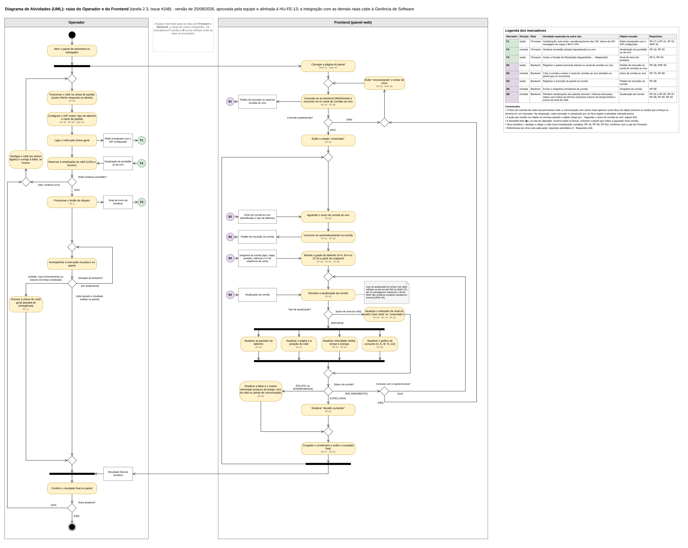

# Diagrama de Atividades — Raias do Operador e do Frontend

Este documento apresenta a modelagem, em Diagrama de Atividades da UML, das raias do **Operador** e do **Frontend (painel web)** do sistema Micromouse "Rato Borrachudo". A modelagem integra o entregável 5.1 do Projeto Conceitual de Software (AP5), definido no documento [4.4 - Projeto conceitual de software](../../4.4%20-%20Projeto%20conceitual%20de%20software.md) e detalhado no Guia da Equipe de Software (21/09/2026).

O escopo corresponde ao ciclo completo de uma tentativa, conforme o escopo mínimo do guia (seção 5.1): da preparação do robô e do painel pelo operador até a exibição do resultado no painel. As raias de Firmware e de Backend são modeladas pelos respectivos responsáveis. Os pontos de contato com essas raias estão indicados por marcadores (seção 4), e a consolidação das quatro raias em um diagrama único cabe à Gerência de Software (guia, seção 6).

## 1. Diagrama

<b>Figura 1</b> - Diagrama de Atividades das raias do Operador e do Frontend (painel web)

Fonte: elaboração própria. Arquivo-fonte editável: <a href="diagramas/2_diagrama_de_atividades_operador_frontend.drawio">2_diagrama_de_atividades_operador_frontend.drawio</a> (draw.io).

Sob cada ação, em cinza, estão os requisitos que ela atende, com a numeração de [2 - Requisitos](../../2%20-%20Requisitos.md).

## 2. Elementos do diagrama

### 2.1 Atores e raias

| Raia | Papel no fluxo |
|:--|:--|
| **Operador** | Integrante da equipe que prepara o robô na pista, dispara a tentativa, acompanha a execução no painel e intervém fisicamente quando necessário. É o único ator humano modelado. |
| **Frontend (painel web)** | Interface que se conecta ao backend, acompanha a corrida ao vivo e exibe, em tempo real, os seis dados obrigatórios, o labirinto, o trajeto e o estado da conexão. |
| Firmware e Backend | Raias modeladas por outros integrantes. Aparecem neste documento apenas por meio dos marcadores **F** (Firmware) e **B** (Backend). |

### 2.2 Notação UML utilizada

| Elemento | Uso no diagrama |
|:--|:--|
| Nó inicial | Início do processo, na raia do Operador. |
| Nó final de atividade | Encerramento do processo quando não há nova tentativa. Encerra todos os fluxos em andamento, inclusive o do painel. |
| Ações | 26 ações (10 na raia do Operador e 16 na raia do Frontend). |
| Nós de decisão | 7 decisões, todas com condições de guarda nas saídas. |
| Nós de junção (*merge*) | 10 junções, usadas nos retornos de laço e na convergência de caminhos alternativos. |
| Barras de bifurcação (*fork*) | 3 bifurcações: início em paralelo do painel e da preparação do robô; atualização paralela da tela; devolução do resultado ao operador em paralelo ao retorno do painel à espera. |
| Barras de sincronização (*join*) | 2 sincronizações: fim das atualizações paralelas da tela; conferência do resultado pelo operador. |
| Nós de objeto | 9 objetos que representam os insumos e as saídas trocados entre raias (seção 2.3). |
| Raias (*swimlanes*) | 2 raias (Operador e Frontend), com espaço reservado para Firmware e Backend. |
| Fluxos de controle e de objeto | Setas contínuas entre ações, nós e objetos. |
| Conectores (marcadores) | 8 marcadores, F1 a F3 e B1 a B5, que indicam os pontos de contato com as raias de Firmware e Backend. |
| Nota | Requisitos não funcionais que se aplicam ao laço de atualização (RNF-37, RNF-38 e RNF-40). |

### 2.3 Insumos e saídas

| Objeto | Produzido por | Consumido por | Tipo |
|:--|:--|:--|:--|
| Robô energizado com o DIP configurado | Operador: *Ligar o robô pela chave geral* | Firmware (F1) | Saída |
| Sinalização de prontidão ou de erro | Firmware (F2) | Operador: *Observar a sinalização do robô* | Insumo |
| Sinal de início da tentativa | Operador: *Pressionar o botão de disparo* | Firmware (F3) | Saída |
| Pedido de inscrição no canal de corridas ao vivo | Frontend: *Conectar-se ao backend e inscrever-se no canal de corridas ao vivo* | Backend (B1) | Saída |
| Aviso de corrida ao vivo (identificador e tipo de labirinto) | Backend (B2) | Frontend: *Aguardar o aviso de corrida ao vivo* | Insumo |
| Pedido de inscrição na corrida | Frontend: *Inscrever-se automaticamente na corrida* | Backend (B3) | Saída |
| Snapshot da corrida (tipo, mapa, posição, métricas e número de sequência de corte) | Backend (B4) | Frontend: *Montar a grade do labirinto a partir do snapshot* | Insumo |
| Atualização da corrida | Backend (B5) | Frontend: *Receber a atualização da corrida* | Insumo |
| Resultado final da tentativa | Frontend: *Congelar o cronômetro e exibir o resultado final* | Operador: sincronização antes de *Conferir o resultado final no painel* | Saída do Frontend, insumo do Operador |

Quando uma ação recebe um objeto, ela só é executada depois que o objeto chega. Por exemplo, *Aguardar o aviso de corrida ao vivo* permanece em espera até o backend enviar o aviso (B2).

## 3. Descrição do fluxo

### 3.1 Fluxo principal

1. O **Operador** abre o painel de telemetria no navegador. A partir desse ponto, uma bifurcação inicia dois fluxos paralelos: a preparação do robô, na raia do Operador, e a conexão do painel, na raia do Frontend.
2. Na raia do **Operador**:
   1. posiciona o robô na célula de partida;
   2. configura o DIP switch com o tipo de labirinto e o canto de partida (RF-30, RF-99);
   3. liga o robô pela chave geral.

   A configuração precede a energização porque o DIP switch é lido apenas na inicialização (RNF-35). A energização entrega ao Firmware o robô configurado (F1).
3. Na raia do **Frontend**, o painel é carregado (RNF-41, RNF-42), conecta-se ao backend por WebSocket e inscreve-se no canal de corridas ao vivo (RF-58, RF-88; B1). Confirmada a conexão, exibe o estado "conectado" (RF-59) e aguarda o aviso de uma corrida ao vivo.
4. O **Operador** observa a sinalização do robô, recebida do Firmware (F2). Diante da sinalização de prontidão (RF-32), pressiona o botão de disparo (RF-5), o que entrega ao Firmware o sinal de início da tentativa (F3). Em seguida, passa a acompanhar a execução na pista e no painel.
5. Quando o backend cria a corrida, envia o aviso ao canal de corridas ao vivo (B2). O **Frontend** inscreve-se automaticamente na corrida, sem configuração manual do operador (RF-62, RF-88; B3). Com o *snapshot* recebido (RF-89; B4), monta a grade do labirinto no formato 4×4, 8×4 ou 12×4 (RF-60, RF-62).
6. A cada atualização recebida do backend (B5), o **Frontend** verifica o tipo da mensagem:
   - **aviso de perda ou retomada do sinal do robô:** atualiza o indicador de sinal (RF-59, RF-73, RF-92);
   - **telemetria:** executa em paralelo quatro atualizações, sincronizadas ao final:
     - paredes do labirinto (RF-60);
     - trajeto e posição do robô (RF-61);
     - velocidade média, tempo e energia (RF-57, RF-64);
     - gráfico de consumo (RF-68).
7. Em seguida, o **Frontend** avalia o status da corrida:
   - **CONCLUÍDA:** sinaliza "desafio cumprido" (RF-63);
   - **FALHOU** ou **INTERROMPIDA:** sinaliza a falha e o motivo informado pelo backend, que pode ser estouro do tempo limite, erro do robô ou perda de comunicação (RF-69);
   - **EM_ANDAMENTO:** verifica a conexão com o backend antes de voltar a aguardar a próxima atualização.
8. Ao término, o **Frontend** congela o cronômetro e exibe o resultado final (RF-57, RF-64). Uma nova bifurcação então:
   - entrega o resultado final ao Operador;
   - devolve o painel à espera de uma nova corrida ao vivo.
9. O **Operador** confere o resultado final. A ação ocorre após a sincronização entre o encerramento observado por ele e o resultado entregue pelo painel. Em seguida, decide se realiza nova tentativa. Sem nova tentativa, o processo termina no nó final de atividade, que encerra também o fluxo do painel.

### 3.2 Fluxos alternativos

| Situação | Tratamento no diagrama | Requisitos |
|:--|:--|:--|
| Falha no auto-teste ou na inicialização | O robô sinaliza erro. O operador desliga o robô, corrige a falha e reinicia a preparação a partir do posicionamento. | RF-27 a RF-29; sinalização via F2 (ver seção 7) |
| Falha ao conectar o painel ao backend | O painel exibe "reconectando" e tenta novamente, sem intervenção do operador. | RF-59, RNF-39 |
| Queda da conexão entre painel e backend durante a corrida | O painel volta ao ciclo de reconexão. Ao se inscrever de novo, recebe um novo *snapshot*, o que ressincroniza a tela. | RF-89, RNF-39 |
| Perda do sinal do robô (entre robô e backend) | O painel exibe "sem sinal" e a navegação prossegue normalmente. Se a perda durar mais de 120 s, o backend marca a corrida como INTERROMPIDA e o painel sinaliza a falha. | RF-59, RF-73, RF-81, RF-92, RNF-33 |
| Colisão ou mau funcionamento do robô | O operador aciona a chave de corte geral (parada de emergência) e aguarda o resultado no painel. | RF-11 |
| Estouro do tempo limite de 10 minutos | O backend informa o estouro no status da corrida, com o motivo de término. O painel sinaliza a falha e o motivo recebido, e o operador interrompe o robô pela chave de corte geral. | RF-69, RF-87, RF-11 |
| Nova tentativa | O operador desliga o robô (se ainda estiver ligado), reposiciona e reconfigura o DIP switch se for mudar de labirinto, e liga novamente. A reinicialização garante mapa, contador e temporizador zerados. | RF-19, RF-56, RF-81 |

## 4. Pontos de integração com as demais raias

**Convenção adotada.** O fluxo de controle de cada raia permanece nela. A comunicação com as raias de Firmware e Backend é representada por fluxos de objeto (insumos e saídas) que começam ou terminam em um marcador. Na consolidação do diagrama, cada marcador deve ser substituído por um fluxo ligado à atividade correspondente da outra raia.

| Marcador | Direção | Raia | Atividade esperada na outra raia | Objeto trocado | Requisitos |
|:--:|:--|:--|:--|:--|:--|
| F1 | saída | Firmware | Inicialização: auto-teste, reendereçamento dos sensores ToF, leitura do DIP switch, montagem do mapa e conexão Wi-Fi em modo estação | Robô energizado com o DIP configurado | RF-27 a RF-31, RF-51, RNF-35 |
| F2 | entrada | Firmware | Sinalizar prontidão (estado Aguardando) ou erro | Sinalização de prontidão ou de erro | RF-32, RF-55 |
| F3 | saída | Firmware | Iniciar a Sessão de Resolução (Aguardando → Mapeando) | Sinal de início da tentativa | RF-5, RF-54 |
| B1 | saída | Backend | Registrar o painel (somente leitura) no canal de corridas ao vivo | Pedido de inscrição no canal de corridas ao vivo | RF-88, RNF-55 |
| B2 | entrada | Backend | Criar a corrida e avisar o canal de corridas ao vivo, inclusive o painel que se reconecta durante uma corrida | Aviso de corrida ao vivo | RF-78, RF-88 |
| B3 | saída | Backend | Registrar a inscrição do painel na corrida | Pedido de inscrição na corrida | RF-88 |
| B4 | entrada | Backend | Enviar o *snapshot* consistente da corrida | Snapshot da corrida | RF-89 |
| B5 | entrada | Backend | Distribuir atualizações aos painéis inscritos: métricas derivadas, status com motivo de término (inclusive estouro do tempo limite) e avisos de sinal do robô | Atualização da corrida | RF-82 a RF-85, RF-87, RF-88, RF-90, RF-92 |

## 5. Decisões de modelagem

1. **Operador como ator único.** Somente quem participa do processo foi modelado. O operador manipula o robô e acompanha o painel; plateia e avaliadores não fazem parte do fluxo.
2. **Inscrição automática na corrida.** O RF-62 determina que o painel se adapte ao labirinto sem configuração manual, e o RF-88 prevê um canal geral de corridas ao vivo. Os dois requisitos são compatíveis: o painel recebe o aviso pelo canal geral e se inscreve sozinho na corrida. Por isso, a raia do Operador não contém uma ação de seleção de corrida.
3. **Tempo limite detectado pelo Backend.** O estouro do limite de 10 minutos é informado pelo backend no status e no motivo de término da corrida, e o painel apenas sinaliza a falha e o motivo recebido (RF-69). A decisão segue a HU-FE-13, critério CA2, e a convenção das [histórias de usuário do frontend](UC-frontend.md) de que o painel não recalcula dados já derivados pelo backend, como o status da corrida. A interrupção física do robô cabe ao operador, porque o painel não envia comandos ao robô. Como nenhum requisito de backend prevê essa detecção hoje, o ponto está registrado na seção 7.
4. **Painel somente leitura e robô como emissor unidirecional.** O painel não envia comandos ao robô, conforme o RF-53, o RNF-55 e as decisões herdadas no guia (seção 4). A configuração do labirinto ocorre exclusivamente pelo DIP switch. Assim, não foram adotados a configuração por "comando web" citada no RF-5 nem o "recebimento de comandos" citado no RNF-6.
5. **Nova tentativa por reinicialização.** Desligar e religar o robô garante o isolamento entre sessões (RF-56) sem nova carga de firmware (RF-19). Também é coerente com a marcação como INTERROMPIDA de uma corrida não encerrada quando o robô se reconecta após reiniciar (RF-81).
6. **Escopo.** Seguindo o escopo mínimo do guia, que termina na exibição no painel, ficaram fora deste diagrama:
   - a consulta ao histórico, com filtros e detalhamento (RF-65 a RF-67);
   - o modo de depuração (RF-70);
   - a exportação de resultados (RF-71);
   - a anulação de corrida (RF-96).

## 6. Rastreabilidade

A coluna HU remete às [histórias de usuário do frontend](UC-frontend.md), que correspondem 1:1 aos RF-57 a RF-71.

| Requisito | HU | Elemento do diagrama |
|:--|:--|:--|
| RF-5 | — | *Pressionar o botão de disparo*; F3 |
| RF-11 | — | *Acionar a chave de corte geral (parada de emergência)* |
| RF-19 | — | Laço de nova tentativa (decisão "Nova tentativa?") |
| RF-30, RF-99, RNF-35 | — | *Posicionar o robô na célula de partida*; *Configurar o DIP switch*; F1 |
| RF-32, RF-55 | — | *Observar a sinalização do robô*; decisão "Robô sinalizou prontidão?"; F2 |
| RF-57 | HU-FE-01 | *Atualizar velocidade média, tempo e energia*; *Congelar o cronômetro e exibir o resultado final* |
| RF-58 | HU-FE-02 | *Conectar-se ao backend (WebSocket) e inscrever-se no canal de corridas ao vivo*; *Receber a atualização da corrida* |
| RF-59 | HU-FE-03 | *Exibir "reconectando" e tentar de novo*; *Exibir o estado "conectado"*; *Atualizar o indicador de sinal do robô* |
| RF-60 | HU-FE-04 | *Montar a grade do labirinto*; *Atualizar as paredes do labirinto* |
| RF-61 | HU-FE-05 | *Atualizar o trajeto e a posição do robô* |
| RF-62 | HU-FE-06 | *Inscrever-se automaticamente na corrida*; *Montar a grade do labirinto* |
| RF-63 | HU-FE-07 | *Sinalizar "desafio cumprido"* |
| RF-64 | HU-FE-08 | *Atualizar velocidade média, tempo e energia*; *Congelar o cronômetro e exibir o resultado final* |
| RF-68 | HU-FE-12 | *Atualizar o gráfico de consumo* |
| RF-69 | HU-FE-13 | *Sinalizar a falha e o motivo informado*, inclusive o estouro do tempo limite informado pelo backend |
| RF-73, RF-92 | — | *Atualizar o indicador de sinal do robô*; B5 |
| RF-87 | — | Decisão "Status da corrida?"; B5 |
| RF-88, RF-89 | — | *Aguardar o aviso de corrida ao vivo*; *Inscrever-se automaticamente na corrida*; *Montar a grade do labirinto*; B1 a B4 |
| RNF-37, RNF-38, RNF-40 | — | Nota do laço de atualização |
| RNF-39 | — | Ciclo de reconexão (decisões "Conexão estabelecida?" e "Conexão com o backend ativa?") |
| RNF-41, RNF-42 | — | *Carregar a página do painel* |

Requisitos de frontend sem elemento neste diagrama:

- RF-65 a RF-67, RF-70 e RF-71: fora do escopo (seção 5, item 6);
- RNF-43 a RNF-47: tratam de desempenho das consultas, responsividade, compatibilidade, legibilidade e cobertura de testes. Não descrevem comportamento do fluxo e são tratados nos protótipos, na arquitetura e no roteiro de testes.

## 7. Pontos em aberto

| Ponto | Com quem alinhar |
|:--|:--|
| Os requisitos tratam da sinalização de erro durante a operação (RF-55), mas não definem como o robô sinaliza falha no auto-teste de inicialização (RF-27 a RF-29), utilizada em F2. | Firmware |
| Confirmar que uma nova tentativa é realizada desligando e religando o robô. | Firmware |
| Ao reconectar durante uma corrida, o painel precisa receber o aviso da corrida já em andamento (B2); caso contrário, permanece aguardando uma corrida nova. | Backend |
| A detecção do estouro do tempo limite de 10 minutos cabe ao backend (HU-FE-13, CA2), mas nenhum requisito de backend a prevê hoje: o RF-81 trata apenas da falta de sinal, e o RF-87 lista os status sem esse motivo. É preciso incluir a regra no backend, com o motivo correspondente no status enviado ao painel e gravado no histórico. | Backend e Gerência de Software |
| O RF-86 prevê alerta de tensão baixa enviado aos painéis, mas nenhum requisito de frontend define sua exibição. | Gerência de Software |
| O RF-70 (modo de depuração) exige dados brutos dos sensores que não constam da carga útil de telemetria definida no RF-52. | Firmware e Gerência de Software |

## Referências

- OBJECT MANAGEMENT GROUP. *OMG Unified Modeling Language (OMG UML), Version 2.5.1*. Needham: OMG, 2017. Disponível em: <https://www.omg.org/spec/UML/2.5.1/>.
- Grupo 1 — PI1 2026/2. *Guia da Equipe de Software — Etapa de Projeto Conceitual de Software*, 21/09/2026.
- Grupo 1 — PI1 2026/2. [2 - Requisitos](../../2%20-%20Requisitos.md).
- Grupo 1 — PI1 2026/2. [4.4 - Projeto conceitual de software](../../4.4%20-%20Projeto%20conceitual%20de%20software.md).
- Grupo 1 — PI1 2026/2. [Histórias de Usuário — Frontend](UC-frontend.md).

## Histórico de versões

| Versão | Data | Descrição |
|:--|:--|:--|
| 1.0 | 24/09/2026 | Raias do Operador e do Frontend aprovadas pela equipe. |
| 1.1 | 25/09/2026 | Alinhamento com a HU-FE-13 (CA2): a detecção do estouro do tempo limite passa ao backend; removidas da raia do Frontend a decisão "Tempo decorrido ≥ 10 min?" e a ação *Sinalizar estouro do tempo limite*. |
