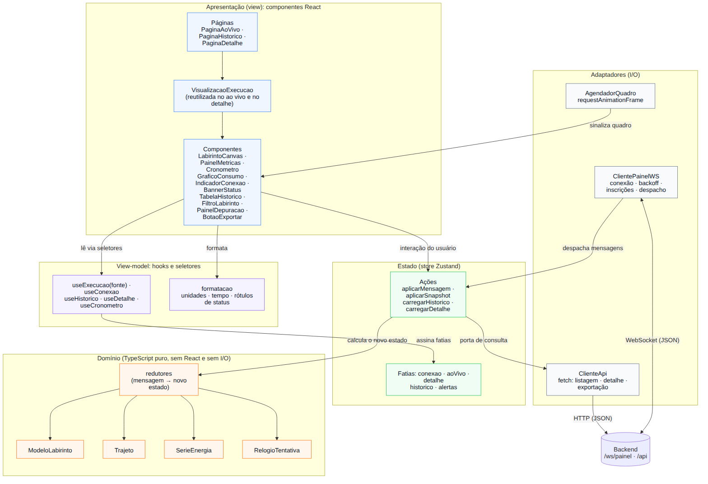
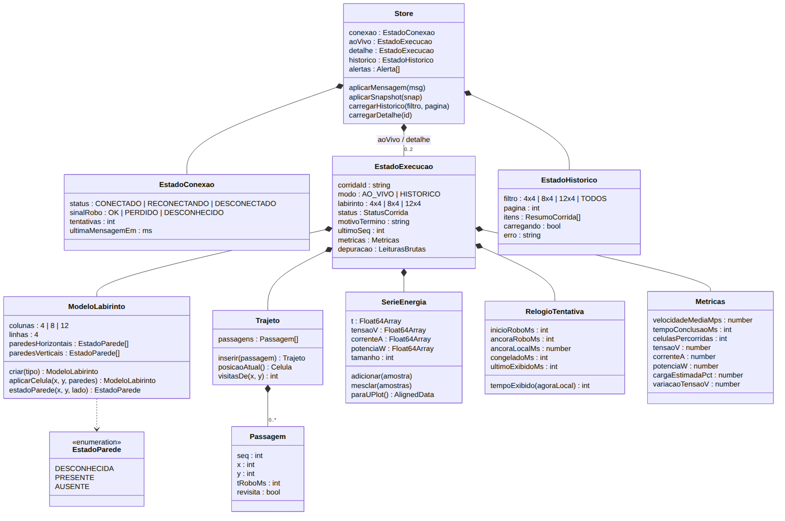
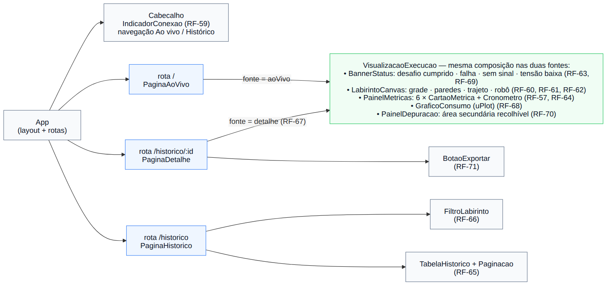
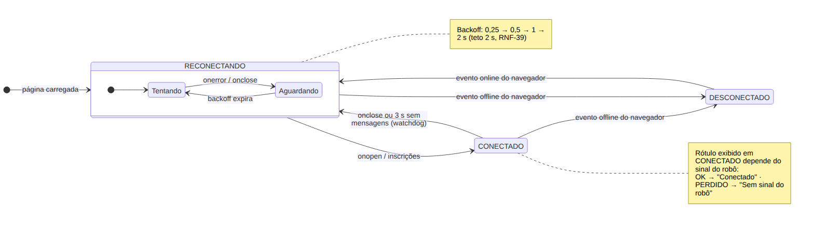
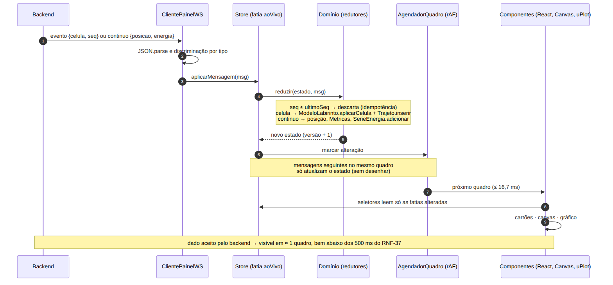
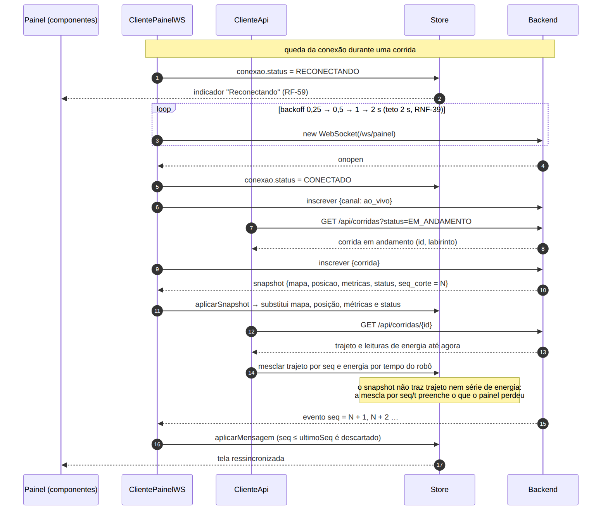

# Arquitetura do Frontend — Visões Lógica e de Implementação

**Versão:** 1.0 — alinhada ao Guia da Equipe de Software (21/09/2026)
**Issue:** [#254 — 3.4 Visões do frontend (lógica / implementação)](https://github.com/fcte-pi1/2026.2_PI1_Grupo1_Diogo/issues/254)
**Responsáveis:** Alice Mariano e Natan França
**Escopo:** arquitetura do painel web (*dashboard*) no modelo 4+1 adaptado pela disciplina, com as visões **lógica** e **de implementação** atribuídas ao frontend pelo guia (§6). A seção 4 traz, como contribuição à consolidação, a parte do frontend na visão de processos (o guia, §5.3, pede "recepção/renderização no frontend"). A seção 6 traz a parte do frontend na visão de implantação, que é consolidada na [#255](https://github.com/fcte-pi1/2026.2_PI1_Grupo1_Diogo/issues/255). O frontend não tem persistência própria, portanto não há visão de dados neste documento: o modelo de dados do sistema está na [arquitetura do backend](../backend/3_arquitetura.md#7-visão-de-dados).

**Rastreabilidade:** RF-57 a RF-71, RNF-37 a RNF-47 e as histórias [HU-FE-01 a HU-FE-15](UC-frontend.md).

---

## 1. Propósito do frontend

O frontend é a **interface de acompanhamento e consulta** do sistema Micromouse. Ele:

1. **Exibe em tempo real**, em tela única, os seis dados obrigatórios da tentativa (tipo do labirinto, trajeto percorrido, consumo de bateria, velocidade média, tempo e desafio cumprido), além do labirinto, do trajeto e do estado da conexão (RF-57 a RF-64).
2. **Consulta o histórico** de execuções gravadas, com filtro por tipo de labirinto, e reexibe uma execução passada na mesma visualização usada ao vivo (RF-65 a RF-67).
3. **Apoia a análise e os testes**, com o gráfico de consumo, a sinalização de falhas, o modo de depuração e a exportação de resultados (RF-68 a RF-71).

O frontend **não** calcula as métricas oficiais nem decide o status da corrida: esses dados são derivados pelo backend, que é o ponto central de verdade (convenção das [histórias de usuário do frontend](UC-frontend.md)). O painel também **não envia comandos ao robô**: ele é somente leitura (RNF-55) e se comunica apenas com o backend.

## 2. Decisões de arquitetura

### 2.1 Decisões herdadas do TAP, dos requisitos e do guia

Conforme o *Guia da Equipe de Software* (§4), estas decisões não são reabertas, apenas documentadas na forma como o frontend as atende.

| Decisão herdada | Como o frontend a atende |
|:--|:--|
| **Rede local isolada, sem dependências externas** (RNF-41) | O *build* empacota JavaScript, CSS e fontes em arquivos estáticos locais. Nenhuma CDN, fonte ou API remota é carregada. As URLs do backend são derivadas do endereço da própria página (seção 6). |
| **WebSocket para o tempo real** | O painel mantém uma conexão com `/ws/painel` durante toda a tentativa (RF-58), com reconexão automática (RNF-39). Consultas ao histórico usam a API HTTP do backend. |
| **Painel somente leitura; robô como emissor unidirecional** | O painel só envia ao backend pedidos de inscrição (`inscrever` e `cancelar`). Não há tela de comando do robô: o tipo de labirinto vem do DIP switch (RF-30) e chega ao painel pela telemetria (RF-62). |
| **Seis dados obrigatórios** | Cada dado tem um cartão fixo no `PainelMetricas` (seção 3.3). Tipo → `ao_vivo` e `snapshot`. Trajeto → eventos `celula`. Consumo → dados `energia` e métricas de carga do backend. Velocidade média e tempo → métricas do backend. Desafio cumprido → status `CONCLUIDA`. |
| **Consultar um labirinto específico ou todos** | `FiltroLabirinto` com as opções 4x4, 8x4, 12x4 e Todos, repassadas ao parâmetro `tipo` de `GET /api/corridas` (RF-66). |
| **O backend deriva; o frontend exibe** | Trajeto, tempo de conclusão, velocidade média, carga estimada e status chegam prontos. O frontend só calcula o que é de apresentação: formatação de unidades, geometria do desenho e o avanço do cronômetro entre duas mensagens (seção 3.2). |

### 2.2 Padrão: componentizado, com fluxo de dados unidirecional (MVVM/Flux)

O padrão definido pela Gerência na [#251](https://github.com/fcte-pi1/2026.2_PI1_Grupo1_Diogo/issues/251) é o **componentizado, no estilo MVVM/Flux**. No frontend ele se organiza assim:

| Papel | No projeto | Responsabilidade |
|:--|:--|:--|
| **Model** | `dominio/` + store (`estado/`) | Estado da aplicação e regras de atualização (como uma mensagem altera o mapa, o trajeto e a série de energia). |
| **ViewModel** | `view-model/` (hooks e seletores) + `formatacao/` | Transforma o estado no que cada componente precisa exibir, já formatado. |
| **View** | `componentes/` e `paginas/` (React) | Desenha a tela de forma declarativa. Só lê pelo view-model e dispara ações. |

O fluxo é **unidirecional** (Flux): fonte de dados (WebSocket ou HTTP) → ação → store → view-model → view. A view nunca altera o estado diretamente, e o estado só muda por ações, o que torna rastreável a origem de cada mudança na tela.

| Alternativa | Por que não foi adotada |
|:--|:--|
| MVC clássico, com controladores manipulando a tela | Pensado para ciclos de requisição e resposta. No painel, a entrada principal não é o usuário, e sim um fluxo contínuo vindo do servidor. Atualizar o DOM de forma imperativa a cada mensagem dificulta o RNF-38 e os testes. |
| Estado dentro de cada componente | A conexão e os dados da tentativa precisam sobreviver à troca de tela (ao vivo ↔ histórico) sem perder amostras (RNF-40). Com estado espalhado, sair da tela ao vivo descartaria os dados. |
| MVVM com vinculação bidirecional (*two-way binding*) | O painel é essencialmente somente leitura. A vinculação bidirecional não traz ganho e torna menos claro quem alterou cada dado. |

**Por que isso funciona aqui:** a mesma `VisualizacaoExecucao` exibe tanto a corrida ao vivo quanto uma execução do histórico, porque depende apenas de um `EstadoExecucao`, e não de onde os dados vieram. Isso atende ao RF-67 ("na mesma visualização usada em tempo real") sem duplicar componentes. O domínio é TypeScript puro e pode ser testado sem navegador, o que viabiliza a cobertura de 70 % exigida pelo RNF-47. O cliente WebSocket vive fora da árvore de componentes, então navegar entre as telas não derruba a conexão (RF-58).

### 2.3 Stack

| Camada | Escolha | Situação | Justificativa |
|:--|:--|:--|:--|
| Linguagem | **TypeScript** | Gerência ([#251](https://github.com/fcte-pi1/2026.2_PI1_Grupo1_Diogo/issues/251)) | Mesma linguagem do backend. Os tipos do protocolo são compartilhados com `src/backend/protocolo/tipos.ts`, então uma mudança no protocolo quebra a compilação do painel em vez de falhar em tempo de execução. |
| Biblioteca de interface | **React** | Gerência (#251) | Componentes reutilizáveis e modelo declarativo: a tela é função do estado. Permite a composição única da `VisualizacaoExecucao`. |
| *Build* e servidor de desenvolvimento | **Vite** | Gerência (#251) | Gera arquivos estáticos com todos os recursos locais (RNF-41). O *proxy* de desenvolvimento encaminha `/api` e `/ws` ao backend local, sem CORS. |
| Estado | **Zustand** | Gerência (#251) | A store pode ser usada fora do React, então o `ClientePainelWS` despacha mensagens sem ser um componente. Os componentes assinam fatias por seletor e só são redesenhados quando a fatia deles muda (RNF-38). Com a Context API, todos os consumidores seriam redesenhados a cada mensagem. |
| Desenho do labirinto | **Canvas 2D** (API nativa) | Gerência (#251) | Custo de desenho previsível por quadro, sem um nó de DOM por parede ou passagem (ver 2.4). |
| Gráfico de consumo | **uPlot** | Gerência (#251) | Biblioteca pequena, feita para séries temporais longas, que recebe os dados em colunas (*typed arrays*). A `SerieEnergia` já guarda os dados nesse formato (RF-68, RNF-40). |
| Rotas | React Router | Proposta da subfrente | Três rotas (`/`, `/historico`, `/historico/:id`). Permite abrir o detalhe de uma execução por link direto. |
| Estilos | CSS Modules + variáveis CSS | Proposta da subfrente | Recurso nativo do Vite, sem dependência extra. Tokens tipográficos garantem ≥ 24 px nos seis dados em 1920 × 1080 (RNF-46), e o layout usa CSS Grid responsivo (RNF-44). |
| Fontes | Fontes do sistema ou arquivos locais em `public/` | Proposta da subfrente | Nenhuma fonte remota (RNF-41). |
| Comunicação | APIs nativas `WebSocket` e `fetch` | Proposta da subfrente | Suportadas nas versões correntes de Chrome e Firefox (RNF-45), sem bibliotecas adicionais. |
| Testes unitários e de componentes | Vitest + Testing Library + jsdom | Proposta da subfrente | Mesmo executor de testes do backend. Relatório de cobertura com limite mínimo de 70 % em `dominio/` e `formatacao/` (RNF-47). |
| Testes ponta a ponta | Playwright (Chromium e Firefox) + simulador de robô do backend | Proposta da subfrente | Verifica o fluxo completo sem hardware (RNF-53) e a compatibilidade com os dois navegadores (RNF-45). |
| Qualidade | ESLint + Prettier + dependency-cruiser | Proposta da subfrente | As regras de dependência da seção 5.2 são verificadas no CI, como no backend. |

> A formalização da stack é da [#251](https://github.com/fcte-pi1/2026.2_PI1_Grupo1_Diogo/issues/251), registrada no documento `arquitetura-stack.md` da Gerência. Os itens marcados como "Proposta da subfrente" são a recomendação do frontend para completar essa decisão.

### 2.4 Desenho do labirinto: Canvas 2D × SVG

| Critério | Canvas 2D | SVG (ou DOM) |
|:--|:--|:--|
| Custo por atualização | Um redesenho completo por quadro. Com no máximo 48 células e algumas centenas de passagens, o custo estimado fica abaixo de 1 ms (a confirmar nos testes de desempenho). | Cada parede e passagem é um elemento que o React reconcilia. É viável nessa escala, mas o custo cresce com o trajeto. |
| Controle do momento do desenho | Total: o `AgendadorQuadro` desenha no máximo uma vez por quadro, mesmo com rajadas de eventos (RNF-38). | Controlado pelo ciclo de renderização do React. |
| Interação por elemento e acessibilidade | Não há elementos individuais. É mitigado com um resumo textual (`aria-label`) e porque o labirinto não é interativo. | Nativas. |

Com 48 células, o SVG também seria viável. O Canvas foi mantido porque o custo previsível e o controle do momento do desenho favorecem os RNF-37 e RNF-38, e porque o labirinto não precisa de interação por elemento.

---

## 3. Visão lógica

### 3.1 Camadas e módulos



<sub>Fonte editável: [`diagramas/arq-fe-01-camadas.mmd`](diagramas/arq-fe-01-camadas.mmd)</sub>

| Camada / módulo | Responsabilidade | RF/RNF |
|:--|:--|:--|
| **Apresentação** — páginas e componentes | Montar as três telas e desenhar os dados. Não conhece WebSocket nem HTTP. | RF-57 a RF-71, RNF-44, RNF-46 |
| **View-model** — `useExecucao(fonte)`, `useConexao`, `useHistorico`, `useDetalhe`, `useCronometro` | Selecionar a fatia de estado de cada componente e expô-la pronta para exibição. | RF-57, RF-59, RF-64 a RF-67 |
| **View-model** — `formatacao` | Unidades (m/s, V, A, W, %), tempo (mm:ss,d) e rótulos com acentuação (`CONCLUIDA` → "Concluída"; desafio "Cumprido"). O backend usa valores em ASCII, e a acentuação fica só na apresentação. | RF-57, RF-63, RF-64, RNF-47 |
| **Estado** — store Zustand | Guardar as fatias `conexao`, `aoVivo`, `detalhe`, `historico` e `alertas`, e expor as ações que as alteram. | RF-58, RF-67, RNF-40 |
| **Domínio** — `ModeloLabirinto`, `Trajeto`, `SerieEnergia`, `RelogioTentativa`, redutores | Regras de atualização do estado, em funções puras e testáveis sem navegador. | RF-60 a RF-62, RF-64, RF-68, RNF-47 |
| **Adaptador** — `ClientePainelWS` | Abrir a conexão, reconectar com *backoff*, refazer as inscrições, interpretar as mensagens e despachá-las para a store. | RF-58, RF-59, RNF-39 |
| **Adaptador** — `ClienteApi` | Listagem paginada, detalhe da corrida e URL de exportação, via `fetch`. | RF-65 a RF-67, RF-71, RNF-43 |
| **Adaptador** — `AgendadorQuadro` | Concentrar os redesenhos em `requestAnimationFrame`: no máximo um desenho por quadro. | RNF-37, RNF-38 |

### 3.2 Modelo de estado



<sub>Fonte editável: [`diagramas/arq-fe-02-modelo-estado.mmd`](diagramas/arq-fe-02-modelo-estado.mmd)</sub>

**Decisões de modelagem**

- **Duas instâncias de `EstadoExecucao`: `aoVivo` e `detalhe`.** A corrida ao vivo continua sendo atualizada enquanto o usuário consulta o histórico, e o detalhe de uma execução passada nunca recebe mensagens ao vivo (HU-FE-11, CA2). As duas instâncias são do mesmo tipo, então a mesma visualização atende às duas.
- **Paredes guardadas como arestas, e não como faces de célula.** O `ModeloLabirinto` guarda um vetor de paredes horizontais (colunas × (linhas + 1)) e um de paredes verticais ((colunas + 1) × linhas). Uma parede compartilhada entre duas células é **um único elemento**, então ela nunca aparece presente de um lado e ausente do outro. É a mesma consistência bidirecional que o firmware garante no RF-37. As paredes internas começam como `DESCONHECIDA` e as do perímetro como `PRESENTE` (RF-60, RF-31). Cada evento `celula` altera apenas as quatro arestas da célula informada, preservando o resto do mapa (HU-FE-04, CA3).
- **Grade criada a partir do tipo de labirinto.** `ModeloLabirinto.criar(tipo)` aceita apenas `4x4`, `8x4` e `12x4`. Com tipo ausente ou inválido, a grade não é criada e a tela mostra "configuração pendente" (HU-FE-06, CA3). Quando o tipo muda entre execuções, um novo modelo substitui o anterior (HU-FE-06, CA2).
- **Trajeto ordenado por `seq`.** `Trajeto.inserir` mantém as passagens em ordem de número de sequência e ignora `seq` repetido. Mesmo que uma mensagem chegue fora de ordem, o desenho segue a ordem do backend (HU-FE-05, CA4), e uma revisita não apaga as passagens anteriores (HU-FE-05, CA3).
- **Série de energia em colunas, sem descarte.** A `SerieEnergia` guarda tempo, tensão, corrente e potência em `Float64Array` pré-alocados (capacidade inicial de 8.192 amostras, dobrada se necessário). Uma tentativa de 10 min a 10 Hz gera 6.000 amostras, cerca de 190 KB, e nenhuma é descartada (RNF-40, HU-FE-12, CA4). O formato em colunas é o que o uPlot recebe, então não há conversão a cada quadro.
- **Cronômetro ancorado no relógio do robô.** O `RelogioTentativa` guarda o tempo do robô da última mensagem (`ancoraRoboMs`) e o instante local em que ela chegou (`ancoraLocalMs`). O tempo exibido é
  `max(últimoExibido, (ancoraRoboMs − inicioRoboMs) + (agoraLocal − ancoraLocalMs))`.
  Assim, o cronômetro avança suavemente entre mensagens e nunca diminui (HU-FE-08, CA2 e CA4). Quando o status se torna final, ele congela no tempo de conclusão calculado pelo backend (RF-82, HU-FE-08, CA3). O cálculo oficial continua sendo do backend: o painel apenas interpola a exibição.
- **Idempotência também no painel.** Cada `EstadoExecucao` guarda o `ultimoSeq` aplicado. Eventos com `seq` menor ou igual são descartados, o que torna seguro receber um *snapshot* seguido de eventos, ou reaplicar mensagens após uma reconexão.
- **Ausência explícita de dados.** Campos sem amostra ficam `null`, e não `0`, e a tela mostra "—" (HU-FE-01, CA2; HU-FE-14, CA4).

### 3.3 Componentes por tela



<sub>Fonte editável: [`diagramas/arq-fe-03-componentes.mmd`](diagramas/arq-fe-03-componentes.mmd)</sub>

As telas correspondem às previstas no guia (§5.2) e no [protótipo de alta fidelidade](../../../src/frontend/prototipo-alta-fidelidade.md): acompanhamento ao vivo, histórico com filtros e detalhe de execução, com o gráfico de consumo.

| Componente | O que exibe | Lê de | HU |
|:--|:--|:--|:--|
| `IndicadorConexao` | "Conectado", "Reconectando", "Desconectado" ou "Sem sinal do robô" (seção 3.4) | `conexao` | HU-FE-03 |
| `PainelMetricas` / `CartaoMetrica` | Os seis dados: tipo do labirinto, células percorridas, consumo (tensão, corrente, potência e carga estimada), velocidade média, tempo e desafio cumprido | `metricas`, `labirinto`, `status` | HU-FE-01 |
| `Cronometro` | Tempo decorrido, atualizado a cada 100 ms, e o tempo de conclusão congelado ao término | `relogio` | HU-FE-08 |
| `LabirintoCanvas` | Grade, paredes nos três estados, trajeto em ordem, revisitas e posição atual do robô | `mapa`, `trajeto` | HU-FE-04, HU-FE-05, HU-FE-06 |
| `BannerStatus` | "Desafio cumprido", falha com o motivo recebido, "sem sinal" e alerta de tensão baixa | `status`, `motivoTermino`, `alertas` | HU-FE-07, HU-FE-13 |
| `GraficoConsumo` | Tensão (V), corrente (A) e potência (W) ao longo do tempo do robô; carga estimada (%) e ΔV nos indicadores | `energia`, `metricas` | HU-FE-12 |
| `PainelDepuracao` | Leituras dos sete ToF, ângulo do MPU-6050 e contagem dos encoders, em área recolhível | `depuracao` | HU-FE-14 |
| `FiltroLabirinto` / `TabelaHistorico` | Filtro e lista paginada com data e hora, tipo, tempo e resultado | `historico` | HU-FE-09, HU-FE-10 |
| `BotaoExportar` | Download em CSV ou JSON pela rota de exportação do backend (RF-98) | `detalhe.corridaId` | HU-FE-15 |

**Leiaute responsivo (RNF-44, RNF-46):** em telas largas (≥ 1280 px), o labirinto fica à esquerda, os cartões à direita e o gráfico abaixo. Em telas estreitas, tudo fica em uma coluna. O canvas acompanha a largura do contêiner (`ResizeObserver`) e considera o `devicePixelRatio`, para ficar nítido também no projetor. Os seis dados usam um token de fonte de no mínimo 24 px em 1920 × 1080.

### 3.4 Estado da conexão



<sub>Fonte editável: [`diagramas/arq-fe-04-estados-conexao.mmd`](diagramas/arq-fe-04-estados-conexao.mmd)</sub>

O RF-59 pede o estado da conexão "do robô", mas o painel nunca fala com o robô: ele fala com o backend, que fala com o robô. Por isso, o indicador combina duas informações independentes:

| Conexão painel ↔ backend | Sinal robô ↔ backend (mensagem `sinal`) | Rótulo exibido |
|:--|:--|:--|
| `CONECTADO` | `OK` ou `DESCONHECIDO` | **Conectado** |
| `CONECTADO` | `PERDIDO` | **Sem sinal do robô** (RF-73: em até 4 s) |
| `RECONECTANDO` | qualquer um | **Reconectando** ("Conectando…" na primeira tentativa) |
| `DESCONECTADO` | qualquer um | **Desconectado** |

`DESCONECTADO` só ocorre quando o navegador informa que está sem rede (evento `offline`). Nesse caso as tentativas ficam suspensas e recomeçam sozinhas no evento `online`, sem intervenção do operador (RNF-39).

**Por que o teto de 2 s no *backoff*:** as tentativas esperam 0,25 s, 0,5 s, 1 s e depois 2 s, repetidamente. Quando o backend volta, a próxima tentativa acontece em no máximo 2 s, e o *handshake* na rede local leva milissegundos, o que mantém a reconexão dentro dos 5 s do RNF-39. Um teto maior, como os de dezenas de segundos usados em muitas bibliotecas de reconexão, violaria o requisito.

### 3.5 Contrato com o backend (o que o frontend consome)

O protocolo é definido pelo backend ([arquitetura do backend, §2.5](../backend/3_arquitetura.md#25-protocolo-de-telemetria-v1-proposta)). A tabela lista o que o frontend usa de cada mensagem. As linhas "a confirmar" estão nos [pontos em aberto](#pontos-em-aberto).

| Origem | Mensagem ou rota | Campos usados | Uso no frontend | Situação |
|:--|:--|:--|:--|:--|
| Painel → backend | `inscrever` / `cancelar` | `{ canal: "ao_vivo" }` ou `{ corrida }` | Acompanhar corridas novas e a corrida atual | Definido |
| Backend → painel | `ao_vivo` | corrida, labirinto, status | Inscrição automática quando uma corrida começa (RF-62) | Definido |
| Backend → painel | `snapshot` | corrida, `seq_corte`, mapa, posição, métricas, status | Estado inicial ao se inscrever ou reconectar (RF-89) | Definido; **não inclui trajeto nem série de energia** |
| Backend → painel | `evento` (`celula`) | `seq`, x, y, paredes `{n, l, s, o}`, `t` | Paredes (RF-60) e trajeto (RF-61) | `t` a confirmar |
| Backend → painel | `evento` (`status`) | `seq`, status, motivo de término, tempo de conclusão | Desafio cumprido, falha e cronômetro congelado (RF-63, RF-64, RF-69) | Motivo e tempo a confirmar |
| Backend → painel | `continuo` | posição, energia `{tensao_v, corrente_a, potencia_w}`, `t`, métricas | Posição do robô, cartões e gráfico (RF-57, RF-64, RF-68) | `t` e métricas a confirmar |
| Backend → painel | `sinal` | `estado: PERDIDO \| RETOMADO` | "Sem sinal do robô" (RF-59, RF-69) | Definido |
| Backend → painel | `alerta` | `tipo: TENSAO_BAIXA`, `tensao_v` | Alerta no `BannerStatus` | Definido; sem RF de frontend |
| Backend → painel | `leaderboard` | — | Ignorada: não há RF de frontend para o ranking | — |
| Backend → painel | mensagem de manutenção da conexão (*keepalive*) | — | *Watchdog* de conexão (seção 4.1) | A propor |
| Backend → painel | dados de depuração | 7 ToF, ângulo, encoders | `PainelDepuracao` (RF-70) | Não existe no protocolo v1 |
| HTTP | `GET /api/corridas?tipo&status&pagina&tamanho` | id, data e hora, tipo, tempo, status | Histórico e filtro (RF-65, RF-66); corrida em andamento na reconexão | Definido |
| HTTP | `GET /api/corridas/{id}` | métricas, trajeto (seq, x, y, paredes, t), energia, status, motivo | Detalhe (RF-67) e complemento do *snapshot* na reconexão | Campos do trajeto a confirmar |
| HTTP | `GET /api/corridas/{id}/exportacao?formato=json\|csv` | — (download) | Exportação (RF-71) | Definido |

Mensagens com `tipo` desconhecido são ignoradas e registradas no console, sem derrubar a conexão. Assim, uma versão nova do protocolo (RNF-57) não quebra um painel antigo.

---

## 4. Visão de processos do frontend (contribuição à consolidação)

### 4.1 Modelo de execução

- **Uma única *thread* principal do navegador.** Todo o código do painel roda no *event loop* do JavaScript. As fontes de eventos são: mensagens do WebSocket, respostas HTTP, temporizadores, `requestAnimationFrame`, interações do usuário e os eventos `online`, `offline` e `visibilitychange`. Não são usados *Web Workers*: interpretar e aplicar uma mensagem é uma operação de custo constante (estimado abaixo de 1 ms, a medir nos testes de desempenho), e a taxa é de até 10 mensagens contínuas por segundo, limitada pelo backend (RF-90). Um *worker* só acrescentaria o custo de copiar os dados entre *threads*.
- **Atualizar o estado e desenhar são etapas separadas.** Cada mensagem atualiza a store **imediatamente**. O desenho acontece **no máximo uma vez por quadro**, no `requestAnimationFrame`. Essa separação resolve três requisitos:
  - **RNF-37:** um dado recebido aparece no próximo quadro (≈ 17 ms a 60 Hz), bem abaixo de 500 ms;
  - **RNF-38:** o custo de desenho não depende do número de mensagens, porque dez mensagens no mesmo quadro geram um único desenho;
  - **RNF-40:** quando a aba fica em segundo plano, o navegador pausa o `requestAnimationFrame`, mas a store continua recebendo e guardando as mensagens. Ao voltar, um único quadro redesenha tudo, sem perda de amostras.
- **Temporizadores:**

| Temporizador | Período | Função | RF/RNF |
|:--|:--|:--|:--|
| *Backoff* de reconexão | 0,25 → 0,5 → 1 → 2 s (teto de 2 s) | Nova tentativa de conexão com o backend | RF-59, RNF-39 |
| *Watchdog* de conexão | Verificação a cada 1 s; queda declarada após 3 s sem nenhuma mensagem | Detectar queda silenciosa da rede, que o navegador só perceberia pelo *timeout* do TCP | RNF-39 |
| Quadro | ≈ 16,7 ms (60 Hz), só quando houve alteração | Desenhar o canvas, o gráfico e os cartões | RNF-37, RNF-38 |
| Cronômetro | 100 ms enquanto a corrida está `EM_ANDAMENTO` | Atualizar o texto do tempo decorrido | RF-64 |

> O *watchdog* só funciona se o backend enviar alguma mensagem ao painel pelo menos a cada 1 s, também fora das corridas. A API `WebSocket` do navegador não expõe os *frames* de *ping*/*pong*, então esse sinal precisa ser uma mensagem de aplicação. Ver [pontos em aberto](#pontos-em-aberto).

### 4.2 Fluxo de uma atualização ao vivo



<sub>Fonte editável: [`diagramas/arq-fe-05-seq-atualizacao.mmd`](diagramas/arq-fe-05-seq-atualizacao.mmd)</sub>

### 4.3 Reconexão e ressincronização no meio da corrida



<sub>Fonte editável: [`diagramas/arq-fe-06-seq-reconexao.mmd`](diagramas/arq-fe-06-seq-reconexao.mmd)</sub>

- **Ordem das inscrições:** o painel se inscreve em `ao_vivo` **antes** de consultar `GET /api/corridas?status=EM_ANDAMENTO`. Assim, uma corrida que comece entre as duas operações é avisada pelo canal, e uma corrida que já estava em andamento é encontrada pela consulta. O painel não depende de o canal `ao_vivo` reenviar corridas antigas, ponto levantado no [diagrama de atividades](2_diagrama_de_atividades.md#7-pontos-em-aberto).
- **O *snapshot* substitui, não mescla:** mapa, posição, métricas e status do *snapshot* substituem os da fatia `aoVivo`, e `ultimoSeq` passa a ser o `seq_corte`. A partir daí, eventos com `seq` ≤ `seq_corte` são descartados.
- **Complemento do *snapshot*:** como o *snapshot* não traz o trajeto nem a série de energia, o painel busca o detalhe da corrida e **mescla** os dados, o trajeto por `seq` e a energia pelo tempo do robô, ignorando repetidos. Sem isso, um painel reconectado perderia as passagens e os pontos do gráfico anteriores à queda (RF-61, RF-68, RNF-40).

---

## 5. Visão de implementação

### 5.1 Organização do código

```text
src/frontend/
├── index.html
├── package.json · package-lock.json · tsconfig.json · vite.config.ts · vitest.config.ts
├── public/
│   └── fontes/                     # fontes servidas localmente (RNF-41)
├── src/
│   ├── main.tsx                    # ponto de entrada: monta <App/> e inicia o ClientePainelWS
│   ├── app/                        # App, leiaute, Cabecalho e definição das rotas
│   ├── paginas/
│   │   ├── ao-vivo/                # PaginaAoVivo
│   │   ├── historico/              # PaginaHistorico
│   │   └── detalhe/                # PaginaDetalhe
│   ├── componentes/
│   │   ├── visualizacao-execucao/  # VisualizacaoExecucao, PainelMetricas, CartaoMetrica, BannerStatus
│   │   ├── labirinto/              # LabirintoCanvas + geometria.ts (cálculos puros de posição)
│   │   ├── grafico-consumo/        # GraficoConsumo (uPlot)
│   │   ├── cronometro/             # Cronometro
│   │   ├── conexao/                # IndicadorConexao
│   │   ├── historico/              # FiltroLabirinto, TabelaHistorico, Paginacao
│   │   ├── depuracao/              # PainelDepuracao
│   │   └── exportacao/             # BotaoExportar
│   ├── view-model/                 # useExecucao, useConexao, useHistorico, useDetalhe, useCronometro, seletores
│   ├── formatacao/                 # unidades, tempo e rótulos (acentuação só aqui)
│   ├── estado/                     # store Zustand: fatias e ações
│   ├── dominio/                    # ModeloLabirinto, Trajeto, SerieEnergia, RelogioTentativa, redutores
│   ├── adaptadores/
│   │   ├── ws/                     # ClientePainelWS: conexão, backoff, watchdog, inscrições, despacho
│   │   ├── http/                   # ClienteApi: listagem, detalhe, URL de exportação
│   │   └── quadro/                 # AgendadorQuadro (requestAnimationFrame)
│   ├── protocolo/                  # reexporta os tipos de src/backend/protocolo/tipos.ts
│   └── estilos/                    # tokens (variáveis CSS) e grade responsiva
└── testes/
    ├── unit/                       # dominio/ e formatacao/ (cobertura mínima de 70 %, RNF-47)
    ├── componentes/                # Testing Library (renderização e estados de erro/vazio)
    └── e2e/                        # Playwright + simulador de robô do backend (Chromium e Firefox)
```

Os tipos do protocolo não são redefinidos no frontend: `protocolo/` apenas reexporta os tipos publicados pelo backend, por meio de um *alias* de caminho do TypeScript (`@protocolo`).

### 5.2 Regras de dependência

- `dominio/` não importa nada de fora dele: nem React, nem Zustand, nem APIs do navegador.
- `formatacao/` depende apenas dos tipos de `dominio/`.
- `estado/` depende de `dominio/` e de `protocolo/`, e acessa o HTTP apenas pela interface (porta) implementada em `adaptadores/http/`.
- `adaptadores/` despacham ações para `estado/` e nunca importam componentes.
- `componentes/` e `paginas/` dependem de `view-model/` e `formatacao/`, e nunca importam `adaptadores/` diretamente.
- Essas regras são verificadas no CI com `dependency-cruiser`, a mesma ferramenta do backend.

### 5.3 Comandos previstos

| Comando | O que faz | Uso |
|:--|:--|:--|
| `npm run dev` | Servidor do Vite com *proxy* de `/api` e `/ws` para `localhost:8080` | Desenvolvimento com o backend e o simulador de robô, sem o ESP32 |
| `npm run build` | Verificação de tipos (`tsc --noEmit`) e `vite build` | Gera a pasta `dist/` com os arquivos estáticos |
| `npm test` | Vitest com cobertura; falha se `dominio/` ou `formatacao/` ficarem abaixo de 70 % | Testes unitários e de componentes (RNF-47) |
| `npm run test:e2e` | Playwright em Chromium e Firefox contra o backend e o simulador | Fluxos ponta a ponta (RNF-45) |
| `npm run lint` | ESLint e `dependency-cruiser` | Estilo e regras de dependência |

---

## 6. Implantação (contribuição para a #255)

- O `npm run build` gera `dist/`: um `index.html`, os pacotes JavaScript e CSS e as fontes, todos locais (RNF-41).
- **Proposta:** o próprio backend serve `dist/` na **mesma origem** da API (`http://<notebook-do-operador>:8080/`), por exemplo com `@fastify/static`. Com isso:
  - não é preciso configurar CORS;
  - o painel deriva as URLs da própria página (`ws://<host>/ws/painel` e `/api/...`), sem IP fixo no código, o que funciona com o endereço que o notebook receber na rede local;
  - o sistema continua subindo com um único comando (RNF-58), sem um contêiner a mais.
- A alternativa é um contêiner `nginx` no `docker compose`, que exigiria configurar o encaminhamento de `/api` e `/ws`.
- Os painéis são qualquer navegador (Chrome ou Firefox) na mesma rede: o notebook do operador, o computador ligado ao projetor ou um celular (a partir de 360 px, RNF-44).

---

## 7. Rastreabilidade

| Requisito | HU | Elementos da arquitetura |
|:--|:--|:--|
| [RF-57](https://github.com/fcte-pi1/2026.2_PI1_Grupo1_Diogo/issues/137) | [HU-FE-01](UC-frontend.md#hu-fe-01--exibir-os-dados-obrigatórios-da-execução) | `PainelMetricas`, `CartaoMetrica`, `Metricas`, `formatacao` |
| [RF-58](https://github.com/fcte-pi1/2026.2_PI1_Grupo1_Diogo/issues/138) | [HU-FE-02](UC-frontend.md#hu-fe-02--receber-continuamente-os-dados-da-tentativa) | `ClientePainelWS`, `aplicarMensagem`, redutores; conexão fora da árvore de componentes (2.2) |
| [RF-59](https://github.com/fcte-pi1/2026.2_PI1_Grupo1_Diogo/issues/139) | [HU-FE-03](UC-frontend.md#hu-fe-03--indicar-o-estado-da-conexão) | `EstadoConexao`, máquina de estados (3.4), `IndicadorConexao` |
| [RF-60](https://github.com/fcte-pi1/2026.2_PI1_Grupo1_Diogo/issues/140) | [HU-FE-04](UC-frontend.md#hu-fe-04--renderizar-o-labirinto-atualizado) | `ModeloLabirinto` (paredes como arestas), `LabirintoCanvas` |
| [RF-61](https://github.com/fcte-pi1/2026.2_PI1_Grupo1_Diogo/issues/141) | [HU-FE-05](UC-frontend.md#hu-fe-05--visualizar-o-trajeto-percorrido) | `Trajeto` ordenado por `seq`, `LabirintoCanvas`, complemento do *snapshot* (4.3) |
| [RF-62](https://github.com/fcte-pi1/2026.2_PI1_Grupo1_Diogo/issues/142) | [HU-FE-06](UC-frontend.md#hu-fe-06--adaptar-a-tela-ao-tipo-de-labirinto) | `ModeloLabirinto.criar(tipo)`, inscrição automática via `ao_vivo` |
| [RF-63](https://github.com/fcte-pi1/2026.2_PI1_Grupo1_Diogo/issues/143) | [HU-FE-07](UC-frontend.md#hu-fe-07--indicar-o-desafio-cumprido) | `BannerStatus`, rótulos de status em `formatacao` |
| [RF-64](https://github.com/fcte-pi1/2026.2_PI1_Grupo1_Diogo/issues/144) | [HU-FE-08](UC-frontend.md#hu-fe-08--cronometrar-a-tentativa) | `RelogioTentativa`, `Cronometro`, temporizador de 100 ms |
| [RF-65](https://github.com/fcte-pi1/2026.2_PI1_Grupo1_Diogo/issues/145) | [HU-FE-09](UC-frontend.md#hu-fe-09--listar-o-histórico-de-execuções) | `ClienteApi`, fatia `historico`, `TabelaHistorico` |
| [RF-66](https://github.com/fcte-pi1/2026.2_PI1_Grupo1_Diogo/issues/146) | [HU-FE-10](UC-frontend.md#hu-fe-10--filtrar-execuções-por-tipo-de-labirinto) | `FiltroLabirinto`, parâmetro `tipo` da listagem |
| [RF-67](https://github.com/fcte-pi1/2026.2_PI1_Grupo1_Diogo/issues/147) | [HU-FE-11](UC-frontend.md#hu-fe-11--detalhar-uma-execução-passada) | `PaginaDetalhe`, fatia `detalhe`, `VisualizacaoExecucao` reutilizada |
| [RF-68](https://github.com/fcte-pi1/2026.2_PI1_Grupo1_Diogo/issues/148) | [HU-FE-12](UC-frontend.md#hu-fe-12--analisar-o-consumo-durante-a-tentativa) | `SerieEnergia` em colunas, `GraficoConsumo` (uPlot) |
| [RF-69](https://github.com/fcte-pi1/2026.2_PI1_Grupo1_Diogo/issues/149) | [HU-FE-13](UC-frontend.md#hu-fe-13--sinalizar-falha-de-execução) | `BannerStatus`, `motivoTermino`, mensagem `sinal` |
| [RF-70](https://github.com/fcte-pi1/2026.2_PI1_Grupo1_Diogo/issues/150) | [HU-FE-14](UC-frontend.md#hu-fe-14--consultar-dados-em-modo-de-depuração) | `PainelDepuracao`, `EstadoExecucao.depuracao` (depende do protocolo) |
| [RF-71](https://github.com/fcte-pi1/2026.2_PI1_Grupo1_Diogo/issues/151) | [HU-FE-15](UC-frontend.md#hu-fe-15--exportar-resultados-da-execução) | `BotaoExportar`, rota de exportação do backend |
| [RNF-37](https://github.com/fcte-pi1/2026.2_PI1_Grupo1_Diogo/issues/215) | — | Separação entre atualizar o estado e desenhar; desenho no próximo quadro (4.1) |
| [RNF-38](https://github.com/fcte-pi1/2026.2_PI1_Grupo1_Diogo/issues/216) | — | `AgendadorQuadro`, Canvas 2D, assinatura por seletor no Zustand |
| [RNF-39](https://github.com/fcte-pi1/2026.2_PI1_Grupo1_Diogo/issues/217) | — | *Backoff* com teto de 2 s, *watchdog*, eventos `online`/`offline` (3.4, 4.1) |
| [RNF-40](https://github.com/fcte-pi1/2026.2_PI1_Grupo1_Diogo/issues/218) | — | `SerieEnergia` sem descarte; store atualizada mesmo com a aba oculta; complemento do *snapshot* |
| [RNF-41](https://github.com/fcte-pi1/2026.2_PI1_Grupo1_Diogo/issues/219) | — | *Build* do Vite com recursos locais, fontes locais, mesma origem (6) |
| [RNF-42](https://github.com/fcte-pi1/2026.2_PI1_Grupo1_Diogo/issues/220) | — | Arquivos estáticos pequenos; histórico e detalhe carregados sob demanda (`React.lazy`) |
| [RNF-43](https://github.com/fcte-pi1/2026.2_PI1_Grupo1_Diogo/issues/221) | — | Paginação feita no backend; `ClienteApi` pede uma página por vez |
| [RNF-44](https://github.com/fcte-pi1/2026.2_PI1_Grupo1_Diogo/issues/222) | — | CSS Grid responsivo; canvas com `ResizeObserver` (3.3) |
| [RNF-45](https://github.com/fcte-pi1/2026.2_PI1_Grupo1_Diogo/issues/223) | — | Somente APIs padrão (`WebSocket`, Canvas 2D, `fetch`); testes E2E em Chromium e Firefox |
| [RNF-46](https://github.com/fcte-pi1/2026.2_PI1_Grupo1_Diogo/issues/224) | — | Token tipográfico ≥ 24 px para os seis dados; canvas com `devicePixelRatio` |
| [RNF-47](https://github.com/fcte-pi1/2026.2_PI1_Grupo1_Diogo/issues/225) | — | `dominio/` e `formatacao/` puros; Vitest com limite mínimo de 70 % |

---

## Pontos em aberto

| # | Ponto | Impacto | Com quem alinhar |
|:--|:--|:--|:--|
| 1 | **O *snapshot* não traz o trajeto nem a série de energia.** O RF-89 garante só o mapa idêntico. | Sem complemento, um painel que entra ou reconecta no meio da corrida perde passagens e pontos do gráfico (RF-61, RF-68, RNF-40). | Backend: incluir o trajeto no *snapshot*, ou confirmar que `GET /api/corridas/{id}` devolve os dados parciais de uma corrida `EM_ANDAMENTO` (o frontend faz a mescla da seção 4.3). |
| 2 | **Tempo do robô (`t`) nas mensagens `evento` e `continuo` enviadas ao painel.** | Necessário para o cronômetro não regredir (HU-FE-08, CA4) e para o eixo do gráfico (RF-68). | Backend |
| 3 | **Como as métricas derivadas chegam durante a corrida.** O `snapshot` tem métricas, mas `evento` e `continuo` não as listam. | Velocidade média (RF-83), carga estimada e ΔV (RF-85) ficariam desatualizadas no painel entre *snapshots*. | Backend: sugerimos um campo `metricas` no `evento` de célula e no `continuo`. |
| 4 | **Mensagem de manutenção da conexão (*keepalive*) do backend para o painel**, pelo menos a cada 1 s. | Sem ela, uma queda silenciosa da rede só é percebida pelo *timeout* do TCP, que pode passar dos 5 s do RNF-39. | Backend |
| 5 | **Convenção de coordenadas.** Origem da grade, qual eixo corresponde ao comprimento (4, 8 ou 12 células) e à largura (4 células, 72 cm), e o significado de `n`, `l`, `s`, `o` em relação ao canto de partida (RF-99). | Sem isso, o painel pode desenhar o labirinto espelhado ou girado. | Firmware e Backend |
| 6 | **Campos de cada passagem no detalhe da corrida** (`seq`, x, y, paredes, `t`, revisita). | Necessários para reconstruir mapa e trajeto no detalhe (RF-67) sem depender da linha do tempo. | Backend |
| 7 | **Quem serve os arquivos estáticos do painel** (proposta da seção 6). | Define a URL do painel e a necessidade de CORS. | Gerência ([#255](https://github.com/fcte-pi1/2026.2_PI1_Grupo1_Diogo/issues/255)) |
| 8 | **Tipos compartilhados do protocolo.** Confirmar que `src/backend/protocolo/tipos.ts` inclui as mensagens do painel (`snapshot`, `evento`, `continuo`, `sinal`, `alerta`, `ao_vivo`). | Sem esses tipos, o frontend teria de duplicá-los. | Backend |
| 9 | **Dados de depuração (RF-70)** não existem na carga útil do RF-52 nem no protocolo v1. | O `PainelDepuracao` fica sem dados e mostra "indisponível". | Firmware, Backend e Gerência (já registrado no [diagrama de atividades](2_diagrama_de_atividades.md#7-pontos-em-aberto)) |
| 10 | **Requisitos do backend sem contraparte no frontend:** alerta de tensão baixa (RF-86), leaderboard (RF-95), anulação (RF-96) e numeração de tentativas (RF-97). | A arquitetura já exibe o alerta no `BannerStatus`, mas não há HU que o exija. Ranking e anulação ficam só na API. | Gerência: decidir se viram HU do frontend. |
| 11 | **Motivo de término para o estouro dos 10 min.** | O painel exibe o motivo recebido (HU-FE-13, CA2), mas nenhum requisito de backend o gera hoje. | Backend e Gerência (já registrado no [diagrama de atividades](2_diagrama_de_atividades.md#7-pontos-em-aberto)) |
| 12 | **Itens "Proposta da subfrente" da stack** (seção 2.3). | Rotas, estilos e ferramentas de teste. | Subfrente de frontend, com registro na [#251](https://github.com/fcte-pi1/2026.2_PI1_Grupo1_Diogo/issues/251) |

## Referências

- KRUCHTEN, P. B. The 4+1 View Model of Architecture. *IEEE Software*, v. 12, n. 6, p. 42–50, 1995. DOI: 10.1109/52.469759.
- FACEBOOK. *Flux: application architecture for building user interfaces*. Disponível em: <https://facebookarchive.github.io/flux/>.
- MOZILLA. *MDN Web Docs: WebSockets API; Window.requestAnimationFrame(); Page Visibility API*. Disponível em: <https://developer.mozilla.org/pt-BR/docs/Web/API/WebSockets_API>.
- REACT. *Documentação oficial*. Disponível em: <https://react.dev/>.
- VITE. *Documentação oficial*. Disponível em: <https://vite.dev/>.
- ZUSTAND. *Repositório oficial*. Disponível em: <https://github.com/pmndrs/zustand>.
- LEEONIYA. *uPlot*. Disponível em: <https://github.com/leeoniya/uPlot>.
- Grupo 1 — PI1 2026/2. *Guia da Equipe de Software — Etapa de Projeto Conceitual de Software*, 21/09/2026.
- Grupo 1 — PI1 2026/2. [2 - Requisitos](../../2%20-%20Requisitos.md).
- Grupo 1 — PI1 2026/2. [Arquitetura do Backend — Visões e Modelo de Dados](../backend/3_arquitetura.md).
- Grupo 1 — PI1 2026/2. [Histórias de Usuário — Frontend](UC-frontend.md) e [Diagrama de Atividades — Raias do Operador e do Frontend](2_diagrama_de_atividades.md).

## Histórico de versões

| Versão | Data | Descrição |
|:--|:--|:--|
| 1.0 | 25/09/2026 | Versão inicial: visões lógica e de implementação, contribuições de processos e implantação, contrato com o backend e pontos em aberto. |
